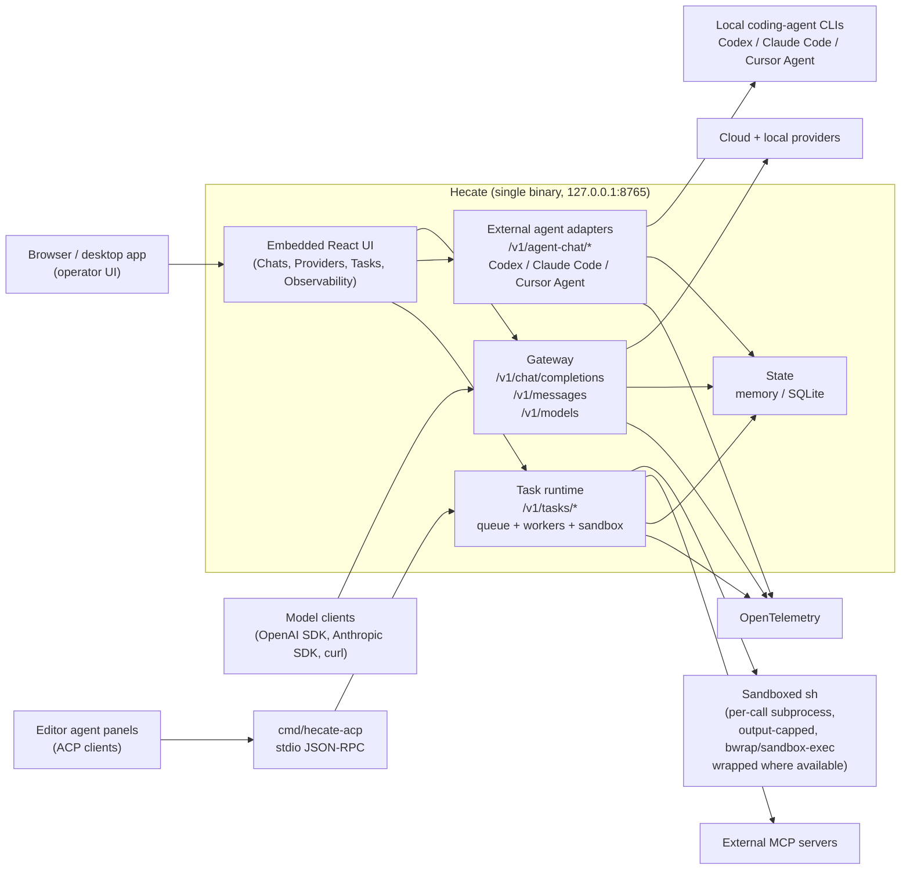

# Hecate

[](https://github.com/chicoxyzzy/hecate/releases/latest)
[](https://github.com/chicoxyzzy/hecate/pkgs/container/hecate)
[](https://github.com/chicoxyzzy/hecate/actions/workflows/test.yml)
[](https://goreportcard.com/report/github.com/chicoxyzzy/hecate)
[](go.mod)
[](LICENSE)
[](https://opentelemetry.io/)

**Hecate is an open-source AI gateway, coding-agent console, and agent-task runtime** for routing OpenAI- and Anthropic-compatible traffic across cloud and local models, running external coding agents as supervised local adapters, controlling spend, and running agent work behind policy, approvals, and OpenTelemetry.

> **Status: public alpha.** Core gateway is usable; agent runtime and sandbox are still evolving. Read [docs/known-limitations.md](docs/known-limitations.md) before depending on it.

## Table Of Contents

- [Why Hecate](#why-hecate)
- [Quick Start](#quick-start)
- [Architecture](#architecture)
- [Operator UI](#operator-ui)
- [What Works Today](#what-works-today)
- [Documentation](#documentation)
- [Contributing](#contributing)
- [License](#license)

## Why Hecate

AI workloads are moving from simple API calls to long-running agents, tool use, local/cloud routing, and budget-sensitive automation. Hecate gives you that runtime layer as one self-contained binary you run yourself: part LLM gateway, part operator console, part coding-agent workbench.

- **Cloud and local providers together** — OpenAI, Anthropic, Perplexity, Ollama, LM Studio, LocalAI, llama.cpp-compatible servers, and other shipped presets.
- **External coding agents in Chats** — run Codex, Claude Code, and Cursor Agent as supervised local processes from the same UI you use for model chat.
- **Operator-controlled spend** — balances, pricebook, rate limits, audit history.
- **Runtime visibility** — request ledger, route reports, failover details, cost, trace IDs, OpenTelemetry export.
- **Agent-task runtime** — queued tasks, approvals, controlled shell/file/git execution, patch artifacts, resumable runs, MCP integration.
- **Editor integration foundation** — experimental ACP stdio bridge for editor agent panels, backed by the same Hecate task/runtime stream.
- **One artifact, many wrappers** — single Go binary with the React operator UI embedded via `//go:embed`. Ships as a Docker image, native desktop bundles (`.dmg` / `.deb` / `.AppImage` / `.msi`), and bare binary tarballs.

## Quick Start

| Path | Best for |
|---|---|
| [Desktop app](#desktop-app) | Personal use on your laptop. No terminal, no Docker. |
| [Docker](#docker) | Local container, scripted local deploys. |

### Desktop app

Download from the [latest release](https://github.com/chicoxyzzy/hecate/releases/latest):

| Platform | Bundle |
|---|---|
| macOS (Apple Silicon) | `Hecate_X.Y.Z_aarch64.dmg` |
| Linux x86_64 | `hecate-app_X.Y.Z_amd64.deb` or `.AppImage` |
| Windows x86_64 | `Hecate_X.Y.Z_x64_en-US.msi` |

Open the bundle and launch Hecate. The gateway runs as a sidecar inside the app and the UI loads automatically. State lives in the platform data dir (`~/Library/Application Support/com.hecate.app/` on macOS, `%APPDATA%\com.hecate.app\` on Windows, `~/.local/share/com.hecate.app/` on Linux).

> Bundles are not yet code-signed. On macOS, the first launch needs **right-click → Open** (Gatekeeper will block a plain double-click). On Windows, click **More info → Run anyway** on the SmartScreen warning. Subsequent launches work normally. Full footguns and roadmap in [docs/desktop-app.md](docs/desktop-app.md).

Skip to [Add a provider](#add-a-provider) once it's running.

### Docker

```bash
docker run --rm -p 127.0.0.1:8765:8765 -v hecate-data:/data \
  ghcr.io/chicoxyzzy/hecate:0.1.0-alpha.10
```

Open `http://127.0.0.1:8765`. The UI loads with no further setup.

> The container intentionally publishes only on `127.0.0.1`. Hecate is a single-operator local tool — it relies on the loopback boundary and enforces same-origin on every request. Don't expose it to the network without putting your own auth in front.

Pinned image tags, single-file binaries (linux/darwin × amd64/arm64), and checksums in [`docs/deployment.md`](docs/deployment.md). Local development knobs in [`docs/development.md`](docs/development.md). Provider keys can be pre-seeded via `.env` for fleet automation — `PROVIDER_<NAME>_API_KEY`, `_BASE_URL`, `_DEFAULT_MODEL`, plus the `_PRECONFIGURED=1` gate. See [`docs/providers.md`](docs/providers.md#env-configured-providers).

### Add a provider

The Providers tab starts empty. Click **Add provider**, pick a preset (or **Custom** for any OpenAI-compatible endpoint), and paste an API key (cloud) or endpoint URL (local).


Cloud presets need an API key; local presets just need the runtime listening on its default port. Full catalog, custom-endpoint walk-through, and credential rotation in [`docs/providers.md`](docs/providers.md).

### Talk to it


Chats has two targets:

- **Model** — send OpenAI-compatible Chat Completions or Anthropic Messages traffic through Hecate's provider router.
- **Agent** — run an external coding-agent CLI such as Codex, Claude Code, or Cursor Agent in a selected workspace. Hecate records the normalized transcript, raw output, status, timing, trace IDs, workspace branch, and captured Git diff.

External agents are **not** providers and do not appear in the provider/model picker. They are local processes supervised by Hecate. See [docs/external-agent-adapters.md](docs/external-agent-adapters.md) for install checks and troubleshooting.

## Architecture

One Go process, one port, bound to loopback. Inside it: a chat/messages **gateway** that routes traffic to upstream model providers, an **external-agent adapter layer** that supervises coding-agent CLIs, and a **task runtime** that queues native agent work, drives approvals, and shells out through a sandbox boundary. The React operator UI is embedded into the same binary and served from the same port; `cmd/hecate-acp` is a separate stdio bridge for ACP-aware editor clients.



For deeper internals, read [docs/architecture.md](docs/architecture.md), [docs/runtime-api.md](docs/runtime-api.md), and [docs/events.md](docs/events.md).

## Operator UI

The embedded UI is a runtime console for the operator.

- **Chats** — talk to model providers or external coding agents, inspect per-turn route/cost metadata, agent activity, raw output, and captured diffs.
- **Providers** — manage provider credentials, defaults, model discovery, base URLs, and health.
- **Tasks** — create and manage agent runs, approvals, retries, resumes, and streamed output.
- **Observability** — inspect requests, route candidates, skip reasons, failover, costs, and trace events.
- **Costs** — balance, top-up / reset, usage table.
- **Settings** — pricebook and retention.

<details>
<summary>Various UI screenshots</summary>


</details>

## What Works Today

Hecate is public-alpha software. The core gateway path is usable; the agent runtime and sandbox are intentionally still evolving.

| Area | State | Notes |
|---|---|---|
| OpenAI-compatible gateway | Usable | Chat Completions, streaming, vision, model discovery |
| Anthropic-compatible gateway | Usable | Messages API shape, streaming translation, Claude Code support |
| Provider catalog | Usable | Built-in presets, encrypted credentials, health, routing readiness |
| Local providers | Usable | Ollama, LM Studio, LocalAI, llama.cpp-compatible servers |
| Loopback-only binding | Usable | Listens on `127.0.0.1`; same-origin enforced on every request |
| Budgets and rate limits | Usable | Balances, warning thresholds, pricebook, `429` rate-limit headers |
| OpenTelemetry | Usable | OTLP traces, metrics, logs, response headers, local trace view |
| Storage tiers | Usable | Memory or SQLite, selected per subsystem |
| Operator UI | Usable | Main workflows are present; debugging ergonomics are still improving |
| External agent adapters | Alpha | Codex, Claude Code, and Cursor Agent discovery/run/cancel/session history. Codex has JSONL normalization; Claude Code and Cursor mappings are still mostly text-output based |
| ACP bridge | Alpha | `cmd/hecate-acp` supports initialize, session new/prompt/cancel, continuation, run-event forwarding, and approval round-trip; editor packaging is not done |
| Agent task runtime | Alpha | Queues, approvals, resumable runs, `agent_loop`, MCP integration; periodic reconciler auto-recovers stale runs |
| Execution isolation | Alpha | Per-call subprocess + env sanitisation + output cap + wall-clock timeout; `bwrap` (Linux) / `sandbox-exec` (macOS) wrapping where available. Not container-level — see [`docs/sandbox.md`](docs/sandbox.md) |

Read [docs/known-limitations.md](docs/known-limitations.md) before treating Hecate as production-stable.

## Documentation

Full index lives at [`docs/README.md`](docs/README.md), organized by reader role. The most-reached-for pages:

**Running Hecate**

- [Deployment](docs/deployment.md) — Docker, image pinning, binary install, storage tiers, rate limits.
- [Desktop app](docs/desktop-app.md) — native bundles, first-launch footguns, platform data dirs, roadmap.
- [Providers](docs/providers.md) — preset catalog, OpenAI-compatible custom endpoints, credentials, health, circuit breaking.
- [Known limitations](docs/known-limitations.md) — plain-language list of what's still alpha.

**Building against Hecate**

- [Runtime API](docs/runtime-api.md) — task lifecycle, approvals, SSE streaming.
- [Agent runtime](docs/agent-runtime.md) — `agent_loop` loop mechanics, tools, cost ceilings, retry-from-turn.
- [External agent adapters](docs/external-agent-adapters.md) — use Codex, Claude Code, and Cursor Agent from Hecate.
- [ACP bridge](docs/acp.md) — experimental stdio bridge for editor agent panels.
- [Events](docs/events.md) — every event type, payload shape, when each fires.
- [MCP integration](docs/mcp.md) — Hecate as MCP server + attaching external MCP servers as tools.

**Observability and internals**

- [Telemetry](docs/telemetry.md) — OTLP traces / metrics / logs, response headers, local trace view.
- [Architecture](docs/architecture.md) — gateway request flow, task-runtime queue / lease / sandbox boundary.
- [Development](docs/development.md) — building from source, the test ladder, screenshot tooling.
- [Release](docs/release.md) — cutting a tag, alpha gate, recovery if CI fails.

First-run environment knobs live in [`.env.example`](.env.example).

## Contributing

See [CONTRIBUTING.md](CONTRIBUTING.md). If you work with an AI assistant, start with [AGENTS.md](AGENTS.md); the vendor-neutral agent instruction layer lives in [ai/](ai/README.md).

## License

MIT. See [LICENSE](LICENSE).

Third-party data notices live in [NOTICE.md](NOTICE.md), including LiteLLM pricing-data attribution.
