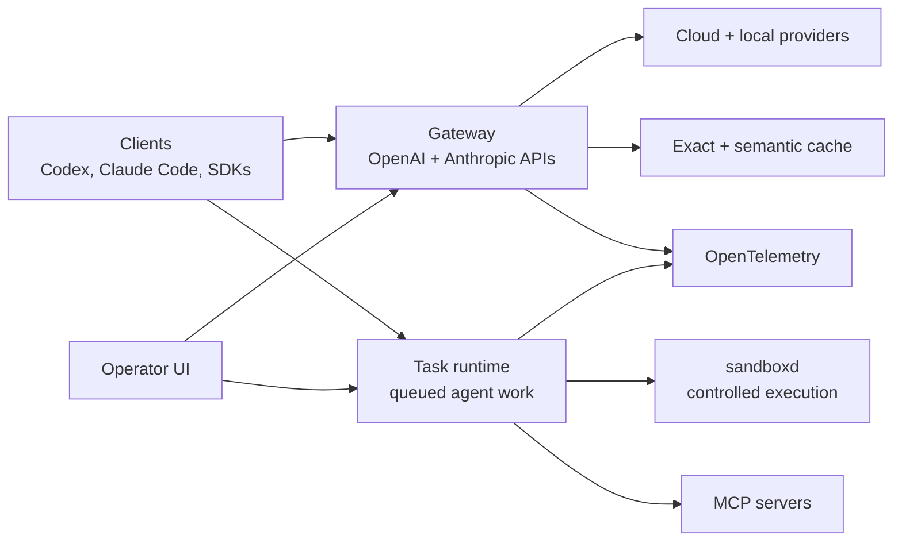

# Hecate

[](https://github.com/chicoxyzzy/hecate/actions/workflows/test.yml)
[](https://goreportcard.com/report/github.com/chicoxyzzy/hecate)
[](go.mod)
[](LICENSE)
[](https://opentelemetry.io/)

Hecate is an open-source **AI gateway and agent-task runtime** for teams that want one control plane for model access, cost governance, routing, caching, observability, and controlled agent execution.

It sits between AI clients and model providers. Existing OpenAI-compatible and Anthropic-compatible clients can point at Hecate, while operators get a place to manage providers, costs, traces, cache behavior, and queued agent work. Multi-tenant management is opt-in — the default deployment is a single-user gateway with one admin bearer.

## Table Of Contents

- [Why Hecate](#why-hecate)
- [Quick Start](#quick-start)
- [Add Providers](#add-providers)
- [Architecture](#architecture)
- [Operator UI](#operator-ui)
- [What Works Today](#what-works-today)
- [Configuration](#configuration)
- [Documentation](#documentation)
- [Contributing](#contributing)
- [License](#license)

## Why Hecate

AI workloads are moving from simple API calls to long-running agents, tool use, local/cloud routing, and budget-sensitive automation. Hecate is built for that messier runtime layer.

- **One gateway for many clients** — OpenAI Chat Completions and Anthropic Messages shapes.
- **Local and cloud providers together** — OpenAI, Anthropic, Ollama, LM Studio, LocalAI, llama.cpp-compatible servers, and other shipped presets.
- **Operator-controlled spend** — balances, pricebook management, rate limits, audit history, and (opt-in) per-tenant API keys with model/provider scoping.
- **Runtime visibility** — request ledger, route reports, failover details, cost, cache path, trace IDs, and OpenTelemetry export.
- **Agent-task runtime** — queued tasks, approvals, controlled shell/file/git execution, resumable runs, and MCP integration.
- **Single binary first** — Go gateway with embedded React operator UI; no premature microservice sprawl.

## Quick Start

The fastest way is the published image — no clone required:

```bash
docker run --rm -p 8765:8765 -v hecate-data:/data \
  ghcr.io/chicoxyzzy/hecate:0.1.0-alpha.7
```

Open `http://127.0.0.1:8765` and connect your first provider in the UI. On a localhost browser the console picks up the generated admin bearer through a same-origin loopback handshake — no token paste needed for single-user installs. Remote browsers, reverse proxies, and cross-origin setups still see the token paste prompt; the bootstrap token is also printed once to the container logs:

```text
============================================================
  Hecate first-run setup — admin bearer token generated.

    7f2a91b... (truncated)

  Saved to /data/hecate.bootstrap.json (mode 0600).
============================================================
```

If you've cloned the repo and want optional services (Postgres profile, dev rebuild from source):

```bash
docker compose up                    # uses ghcr.io image; first run pulls
docker compose --profile postgres up # adds Postgres for durable state
```

For local development from source:

```bash
make dev
```

Other install paths — pinned image tags, single-file binaries (linux/darwin × amd64/arm64), checksums — are documented in [docs/deployment.md](docs/deployment.md). Local development details are in [docs/development.md](docs/development.md). Provider API keys can be added in the UI after first boot, or pre-seeded via `.env.example`.

The first-run UI guides provider setup and token entry:


## Add Providers

Hecate ships with a preset catalog of cloud and local providers. The Providers tab starts empty until you add one from the catalog (or define a custom OpenAI-compatible endpoint). Open it on first boot, click **Add provider**, pick a preset (or **Custom**), and paste an API key (cloud) or endpoint URL (local).


Congrats, now you can talk to robots.


There are other ways to do it:

| Method | When |
|---|---|
| **Environment variables** | First-run bootstrap or fleet automation. Setting `PROVIDER_<NAME>_API_KEY`, `PROVIDER_<NAME>_BASE_URL`, `PROVIDER_<NAME>_DEFAULT_MODEL` in `.env` is equivalent to adding the provider via the UI on first boot — useful when you want config-as-code. Env-seeded providers are routable but don't appear in the Providers tab; add them explicitly there if you want to edit credentials from the UI. |
| **Control-plane API** | Programmatic management. `POST /admin/control-plane/providers`, `DELETE /admin/control-plane/providers/{id}`, `PUT /admin/control-plane/providers/{id}/api-key`, and `PATCH /admin/control-plane/providers/{id}` mirror every UI action. |

**Cloud presets** (need an API key): `anthropic`, `openai`, `gemini`, `groq`, `mistral`, `deepseek`, `together_ai`, `xai`.

**Local presets** (need the runtime listening on its default port): `ollama` (`:11434`), `lmstudio` (`:1234`), `localai` (`:8080`), `llamacpp` (`:8080`).

Example `.env` snippet for first-run bootstrap:

```bash
PROVIDER_ANTHROPIC_API_KEY=sk-ant-...
PROVIDER_OPENAI_API_KEY=sk-...
PROVIDER_OPENAI_DEFAULT_MODEL=gpt-4o-mini
# Local Ollama on the host machine — no key needed
PROVIDER_OLLAMA_BASE_URL=http://host.docker.internal:11434/v1
```

Provider health, circuit-breaking, base-URL overrides, and the full preset catalog are documented in [docs/providers.md](docs/providers.md).

## Architecture

Hecate is one Go binary with two main surfaces:

- **Gateway** — authenticates requests, applies policy/budget checks, resolves provider/model routing, handles cache paths, calls upstream model providers, and records traces.
- **Task runtime** — queues agent-style work, manages approvals, runs controlled tools through the sandbox boundary, streams run events, and records artifacts.



For deeper internals, read [docs/architecture.md](docs/architecture.md), [docs/runtime-api.md](docs/runtime-api.md), and [docs/events.md](docs/events.md).

## Operator UI

The embedded UI is a runtime console for operators.

- **Chats** — send requests through Hecate, choose provider/model, inspect per-turn route/cost/cache metadata.
- **Providers** — manage provider credentials, defaults, model discovery, base URLs, and health.
- **Tasks** — create and manage agent runs, approvals, retries, resumes, and streamed output.
- **Observability** — inspect requests, route candidates, skip reasons, failover, costs, cache decisions, and trace events.
- **Costs** — balance, top-up / reset, usage table.
- **Settings** — pricebook, policy rules, retention, and (when `GATEWAY_MULTI_TENANT=true`) tenants + API keys.

<details>
<summary>Various UI screenshots</summary>


</details>

## What Works Today

Hecate is public-alpha software. The core gateway path is usable; the agent runtime and sandbox are intentionally still evolving.

| Area | State | Notes |
|---|---|---|
| OpenAI-compatible gateway | Usable | Chat Completions, streaming, vision, model discovery |
| Anthropic-compatible gateway | Usable | Messages API shape, streaming translation, Claude Code support |
| Provider catalog | Usable | Built-in presets, encrypted credentials, health, routing readiness |
| Local providers | Usable | Ollama, LM Studio, LocalAI, llama.cpp-compatible servers |
| Auth | Usable | Admin bearer with same-origin loopback handshake; `GATEWAY_AUTH_DISABLED` for upstream-terminated auth |
| Tenants and API keys | Opt-in | `GATEWAY_MULTI_TENANT=true` exposes tenant + key management with provider/model scoping |
| Budgets and rate limits | Usable | Balances, warning thresholds, pricebook, `429` rate-limit headers |
| Caching | Usable | Exact cache; semantic cache is available but still early |
| OpenTelemetry | Usable | OTLP traces, metrics, logs, response headers, local trace view |
| Storage tiers | Usable | Memory, SQLite, Postgres, selected per subsystem |
| Operator UI | Usable | Main workflows are present; debugging ergonomics are still improving |
| Agent task runtime | Alpha | Queues, approvals, resumable runs, `agent_loop`, MCP integration |
| Execution isolation | Alpha | `sandboxd` boundary exists; stronger OS-level isolation is future work |

Read [docs/known-limitations.md](docs/known-limitations.md) before treating Hecate as production-stable.

## Configuration

The README intentionally stays light on configuration. The source of truth is:

- [`.env.example`](.env.example) — practical first-run environment knobs.
- [docs/deployment.md](docs/deployment.md) — Docker, storage tiers, rate limits, image pinning, reset/recovery.
- [docs/providers.md](docs/providers.md) — provider presets, local runtimes, credentials, health.
- [docs/telemetry.md](docs/telemetry.md) — OTLP traces, metrics, logs, collector recipes.
- [docs/agent-runtime.md](docs/agent-runtime.md) — task runtime, approvals, tools, workspace modes.
- [docs/mcp.md](docs/mcp.md) — MCP server and MCP tool integration.

## Documentation

- [Architecture](docs/architecture.md)
- [Agent runtime](docs/agent-runtime.md)
- [Runtime API](docs/runtime-api.md)
- [Providers](docs/providers.md)
- [Tenants and API keys (opt-in)](docs/tenants.md)
- [MCP integration](docs/mcp.md)
- [Telemetry](docs/telemetry.md)
- [Deployment](docs/deployment.md)
- [Development](docs/development.md)
- [Known limitations](docs/known-limitations.md)
- [Release process](docs/release.md)

## Contributing

See [CONTRIBUTING.md](CONTRIBUTING.md). If you work with an AI assistant, start with [AGENTS.md](AGENTS.md); the vendor-neutral agent instruction layer lives in [ai/](ai/README.md).

## License

MIT. See [LICENSE](LICENSE).

Third-party data and software notices live in [NOTICE.md](NOTICE.md), including LiteLLM pricing-data attribution.
