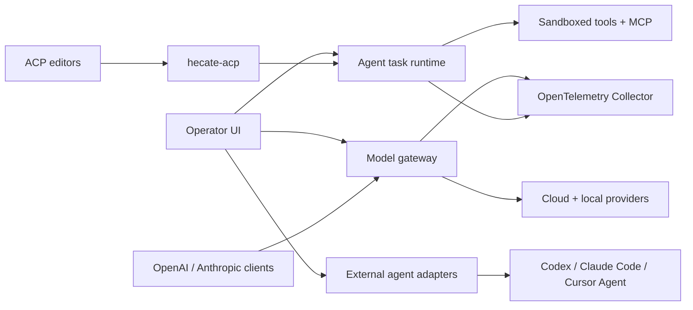

<h1 align="center">
  
</h1>

[](https://github.com/chicoxyzzy/hecate/releases/latest)
[](https://github.com/chicoxyzzy/hecate/pkgs/container/hecate)
[](https://github.com/chicoxyzzy/hecate/actions/workflows/test.yml)
[](https://goreportcard.com/report/github.com/chicoxyzzy/hecate)
[](go.mod)
[](LICENSE)
[](https://opentelemetry.io/)

**Hecate is an open-source AI gateway, coding-agent console, and agent-task runtime** for routing OpenAI- and Anthropic-compatible traffic across cloud and local models, running external coding agents as supervised local adapters, controlling spend, and running agent work behind policy, approvals, and OpenTelemetry.

> **Status: public alpha.** Core gateway and native task runtime are usable for alpha workflows; chat-native Hecate Agent UX, desktop app, ACP bridge, and sandbox hardening are still evolving. Read [docs/known-limitations.md](docs/known-limitations.md) before depending on it.

## Table Of Contents

- [Why Hecate](#why-hecate)
- [Quick Start](#quick-start)
- [Architecture](#architecture)
- [Operator UI](#operator-ui)
- [What Works Today](#what-works-today)
- [Documentation](#documentation)
- [Contributing](#contributing)
- [License](#license)

## Why Hecate

AI systems are becoming more than model calls. A useful agent now chooses between cloud and local models, calls tools, edits files, retries flaky providers, spends real money, and leaves behind a trail operators need to understand.

Hecate sits at that crossroads. It is a self-hosted runtime layer between clients, model providers, coding-agent CLIs, and local tools — built to make agent work cheaper, easier to inspect, and safer to run.

- **One gateway for cloud and local models** — OpenAI, Anthropic, DeepSeek, Gemini, Groq, Mistral, Perplexity, Together AI, xAI, Ollama, LM Studio, LocalAI, llama.cpp-compatible servers, and custom OpenAI-compatible endpoints.
- **One console for models and coding agents** — use direct Model chat, Hecate Agent chats backed by the native task runtime, or supervised Codex, Claude Code, and Cursor Agent sessions.
- **Cost and routing control where requests happen** — balances, pricebook, rate limits, model/provider selection, failover, and route reports sit on the hot path instead of in a separate spreadsheet.
- **OpenTelemetry-first visibility** — traces, metrics, logs, request IDs, route decisions, cache paths, provider health, and cost metadata are emitted as runtime signals.
- **Agent execution with guardrails** — queued tasks, approvals, controlled shell/file/git execution, patch artifacts, resumable runs, and MCP integration.
- **Local-first distribution** — run it as a desktop app, Docker container, or `hecate` binary with the operator UI embedded; protocol-specific companions such as `hecate-acp` stay separate where needed.

## Quick Start

| Path | Best for |
|---|---|
| [Desktop app](#desktop-app) | Personal use on your laptop. No terminal, no Docker. |
| [Docker](#docker) | Local container, scripted local deploys. |

### Desktop app

Download from the [latest release](https://github.com/chicoxyzzy/hecate/releases/latest):

<!-- desktop-release-links:start -->
| Platform | Bundle |
|---|---|
| macOS (Apple Silicon) | [Hecate_0.1.0-alpha.17_aarch64.dmg](https://github.com/chicoxyzzy/hecate/releases/download/v0.1.0-alpha.17/Hecate_0.1.0-alpha.17_aarch64.dmg) |
| Linux x86_64 | [Hecate_0.1.0-alpha.17_amd64.deb](https://github.com/chicoxyzzy/hecate/releases/download/v0.1.0-alpha.17/Hecate_0.1.0-alpha.17_amd64.deb) or [Hecate_0.1.0-alpha.17_amd64.AppImage](https://github.com/chicoxyzzy/hecate/releases/download/v0.1.0-alpha.17/Hecate_0.1.0-alpha.17_amd64.AppImage) |
| Windows x86_64 | [Hecate_0.1.0-alpha.17_x64_en-US.msi](https://github.com/chicoxyzzy/hecate/releases/download/v0.1.0-alpha.17/Hecate_0.1.0-alpha.17_x64_en-US.msi) |
<!-- desktop-release-links:end -->

Open the bundle and launch Hecate. The app starts the gateway sidecar, waits for it to become healthy, and opens the embedded operator UI automatically. State lives in the platform data dir (`~/Library/Application Support/io.github.chicoxyzzy.hecate/` on macOS, `%APPDATA%\io.github.chicoxyzzy.hecate\` on Windows, `~/.local/share/io.github.chicoxyzzy.hecate/` on Linux).

> Bundles are not yet code-signed. On macOS, the first launch needs **right-click → Open** (Gatekeeper will block a plain double-click). On Windows, click **More info → Run anyway** on the SmartScreen warning. Subsequent launches work normally. Full footguns and roadmap in [docs/desktop-app.md](docs/desktop-app.md).

Skip to [Add a provider](#add-a-provider) once it's running.

### Docker

```bash
docker run --rm -p 127.0.0.1:8765:8765 -v hecate-data:/data \
  ghcr.io/chicoxyzzy/hecate:0.1.0-alpha.17
```

Open `http://127.0.0.1:8765`. The UI loads with no further setup.

> The container intentionally publishes only on `127.0.0.1`. Hecate has no built-in auth layer; same-origin checks protect browser traffic, but they are not a network security boundary. Do not expose it to the network without your own auth, firewall, or reverse proxy in front.

Pinned image tags, binary tarballs (linux/darwin × amd64/arm64), checksums, compose examples, and storage notes live in [`docs/deployment.md`](docs/deployment.md). Local development setup lives in [`docs/development.md`](docs/development.md).

### Add a provider

On first boot, Chats is already available. If Hecate detects a local runtime such as Ollama or LM Studio, the model chat setup can be one click: choose **Add detected providers** and Hecate adds the detected local endpoints with the preset defaults.


You can still configure providers manually from **Providers → Add provider**:

- Cloud providers need an API key.
- Local providers need a running local server URL, usually the preset default.
- Custom OpenAI-compatible endpoints can be added from the same modal when the preset catalog is not enough.

After a provider is saved, Hecate discovers models and the Chats model picker becomes routable. The full preset catalog, env bootstrapping, custom-endpoint walk-through, and credential rotation live in [`docs/providers.md`](docs/providers.md).

### Talk to it

Chats is the primary day-to-day surface. It explains missing setup before you send a request, then lets you choose between model traffic and local coding-agent sessions.


There are two top-level chat targets:

- **Hecate Chat** — select a configured provider/model. Tools are on by default and run the prompt through Hecate's native `agent_loop` task runtime with task approvals, artifacts, per-call sandboxing, OTel, and a visible backing Task; turn tools off for direct model chat through Hecate's router.
- **External Agent** — select Codex, Claude Code, or Cursor Agent, choose a workspace, and run a supervised local ACP session with approval prompts, guardrails, raw diagnostics, and Git diff review.

Direct model turns and Hecate Agent turns now share one Hecate Chat transcript. Direct turns record route, cost, cache, and trace metadata; tools-on turns create task-backed segments with streamed assistant text, per-run timing buckets for queue/model/tool/approval/overhead work, and activity projected from the backing task. The Tasks workspace remains canonical for Hecate Agent approvals, events, artifacts, retry/resume, and patch review, while each task-backed assistant turn links back to its backing Task/run. External Agent turns record normalized transcript, raw output, status, timing, trace IDs, workspace branch, approval decisions, and captured Git diffs that can be inspected or reverted from Chats. External agents are **not** providers and do not appear in the provider/model picker. See [docs/agent-runtime.md](docs/agent-runtime.md) for Hecate Agent internals and [docs/external-agent-adapters.md](docs/external-agent-adapters.md) for external-adapter install checks and troubleshooting.

## Architecture

The gateway runs as one Go process on one local HTTP port. Inside it: a chat/messages **gateway** that routes traffic to upstream model providers, an **external-agent adapter layer** that supervises coding-agent CLIs, and a **task runtime** that queues native agent work, drives approvals, and shells out through a sandbox boundary. The React operator UI is embedded into the gateway and served from the same port; `hecate-acp` is a separate stdio bridge for ACP-aware editor clients.



For deeper internals, read [docs/architecture.md](docs/architecture.md), [docs/runtime-api.md](docs/runtime-api.md), [docs/events.md](docs/events.md), and [docs/telemetry.md](docs/telemetry.md).

## Operator UI

The embedded UI is a runtime console for the operator.

- **Chats** — talk to model providers, run Hecate Agent chats backed by Tasks, or supervise external coding agents; inspect per-turn route/cost metadata, agent activity, timing, raw output, and captured diffs.
- **Providers** — manage provider credentials, defaults, model discovery, base URLs, and health.
- **Tasks** — create and manage native Hecate `agent_loop` runs, task approvals, retries, resumes, streamed tool output, and the same compact run activity shown inside Hecate Chat.
- **Observability** — inspect requests, route candidates, skip reasons, failover, costs, traces, metrics, logs, and local trace events.
- **Costs** — balance, top-up / reset, usage table.
- **Settings** — pricebook, model capability overrides, retention, external-agent readiness checks, and durable approval grants.

<details>
<summary>Various UI screenshots</summary>


</details>

## What Works Today

Hecate is public-alpha software. The core gateway and native task runtime are usable for alpha workflows; chat-native Hecate Agent UX and sandbox hardening are intentionally still evolving.

Stability stages:

- **Alpha-ready**: coherent enough for normal alpha use with known caveats.
- **Implemented**: core mechanism exists, but product polish/hardening is still needed.
- **Early**: works in some paths, but still rough or incomplete.
- **Not shipped**: planned, not available.

| Area | State | Notes |
|---|---|---|
| OpenAI-compatible gateway | Alpha-ready | Chat Completions, streaming, vision, model discovery, custom OpenAI-compatible endpoints |
| Anthropic-compatible gateway | Alpha-ready | Messages API shape, streaming translation, Claude Code support |
| Provider catalog | Alpha-ready | Built-in presets, credentials, health, routing readiness |
| Local providers | Alpha-ready | Ollama, LM Studio, LocalAI, llama.cpp-compatible servers |
| Model capabilities | Implemented | `/v1/models` surfaces tool-calling capability metadata; Settings provides a per-model tools on/off switch for local/custom models |
| Local default address | Alpha-ready | Defaults to `127.0.0.1:8765`; same-origin enforced for browser requests; no built-in auth |
| Budgets and rate limits | Alpha-ready | Balances, warning thresholds, pricebook, `429` rate-limit headers |
| OpenTelemetry | Alpha-ready | OTLP traces, metrics, logs, response headers, local trace view |
| Storage tiers | Alpha-ready | Memory or SQLite, selected per subsystem. `GATEWAY_CHAT_SESSIONS_BACKEND=sqlite` covers the full agent-chat bundle (sessions, messages, approvals, grants); orphaned pending approvals are reconciled on startup |
| Operator UI | Alpha-ready | Main workflows are present; chat/debugging ergonomics are still improving |
| Desktop app | Early | Native `.dmg`, `.deb`, `.AppImage`, and `.msi` bundles run Hecate as a sidecar. Bundles are unsigned |
| External agent adapters | Alpha-ready | Stable enough for alpha use when you accept the trusted-subprocess model: Codex, Claude Code, and Cursor Agent discovery, long-lived ACP sessions, prompt-first approvals, grants, adapter health/version checks, cancel, guardrails, raw diagnostics, and Git diff inspect/revert |
| Hecate Agent chats | Implemented | Hecate Chat can switch between direct model segments and task-backed `agent_loop` segments in one transcript. Consecutive tools-on turns continue the latest terminal run; re-enabling tools after a model segment starts a fresh backing Task. While a backing task is active, the whole chat is busy and direct model sends are blocked until the task settles. Task-backed turns stream assistant text through the chat session while the run is active. Requires a model known to support tools |
| ACP bridge | Early | `hecate-acp` supports initialize, session new/prompt/cancel, continuation, run-event forwarding, and approval round-trip; registry/editor packaging is not done |
| Agent task runtime | Implemented | Native Hecate task runs: queue/lease execution, approvals, resumable `agent_loop`, MCP integration, streamed output, and periodic stale-run recovery. Still needs broader lifecycle hardening before stable |
| Execution isolation | Early | Per-call subprocess + env sanitisation + output cap + wall-clock timeout; `bwrap` (Linux) / `sandbox-exec` (macOS) wrapping where available. Not container-level — see [`docs/sandbox.md`](docs/sandbox.md) |
| Homebrew distribution | Not shipped | A CLI formula/cask is planned later. Homebrew helps installation, but it does not replace Apple Developer ID signing/notarization for a smooth macOS desktop-app launch |

Read [docs/known-limitations.md](docs/known-limitations.md) before treating Hecate as production-stable.

## Documentation

Full index lives at [`docs/README.md`](docs/README.md), organized by reader role. The most-reached-for pages:

**Running Hecate**

- [Deployment](docs/deployment.md) — Docker, image pinning, binary install, storage tiers, rate limits.
- [Desktop app](docs/desktop-app.md) — native bundles, first-launch footguns, platform data dirs, roadmap.
- [Providers](docs/providers.md) — preset catalog, OpenAI-compatible custom endpoints, credentials, health, circuit breaking.
- [Known limitations](docs/known-limitations.md) — plain-language list of what's still alpha.

**Building against Hecate**

- [Runtime API](docs/runtime-api.md) — task lifecycle, approvals, queue/lease execution, SSE streaming.
- [Agent runtime](docs/agent-runtime.md) — `agent_loop` loop mechanics, tools, stdout/stderr handling, cost ceilings, retry-from-turn.
- [External agent adapters](docs/external-agent-adapters.md) — Hecate as an ACP client/operator: use Codex, Claude Code, and Cursor Agent from Chats.
- [ACP bridge](docs/acp.md) — Hecate as an ACP agent for editor panels such as Zed and JetBrains.
- [Events](docs/events.md) — every event type, payload shape, when each fires.
- [MCP integration](docs/mcp.md) — Hecate as MCP server + attaching external MCP servers as tools.

**Observability and internals**

- [Telemetry](docs/telemetry.md) — OTLP traces / metrics / logs, response headers, local trace view.
- [Architecture](docs/architecture.md) — gateway request flow, task-runtime queue / lease / sandbox boundary.
- [Development](docs/development.md) — source-build toolchain, local dev, the test ladder, screenshot tooling.
- [Release](docs/release.md) — cutting a tag, verification gate, recovery if CI fails.

First-run environment knobs live in [`.env.example`](.env.example).

## Contributing

See [CONTRIBUTING.md](CONTRIBUTING.md). If you work with an AI assistant, start with [AGENTS.md](AGENTS.md); the vendor-neutral agent instruction layer lives in [docs-ai/](docs-ai/README.md).

## License

MIT. See [LICENSE](LICENSE).

Third-party notices live in [NOTICE.md](NOTICE.md), including LiteLLM pricing-data attribution and vendored splash-font licenses.
