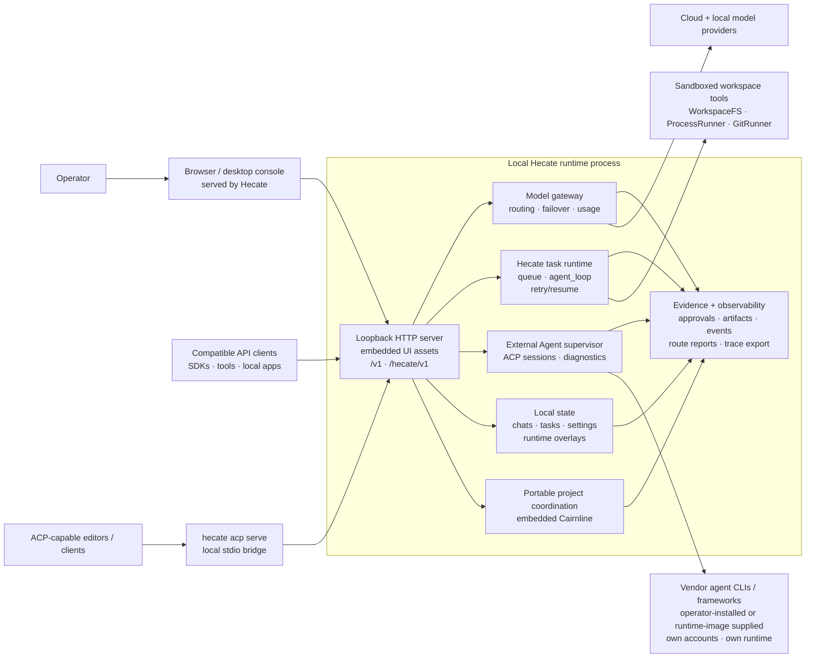
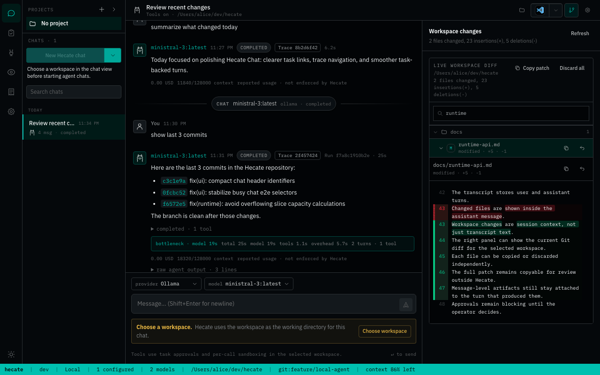
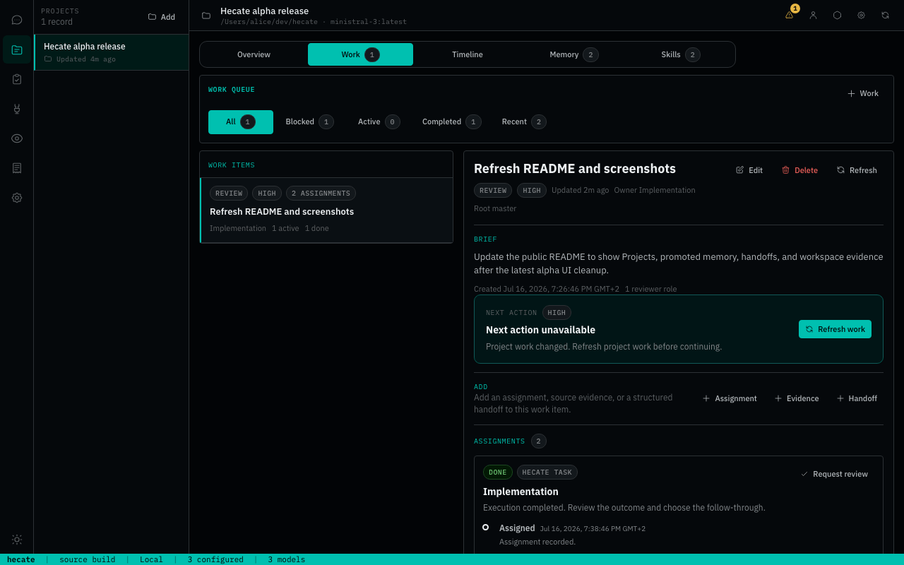
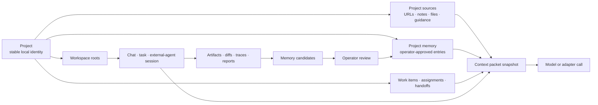

<h1 align="center">
  
</h1>

<p align="center">
  <a href="https://github.com/hecatehq/hecate/releases">
    
  </a>
  <a href="docs/operator/deployment.md#image-pinning">
    
  </a>
  <a href="https://github.com/hecatehq/hecate/actions/workflows/test.yml">
    
  </a>
  <a href="go.mod">
    
  </a>
  <a href="LICENSE">
    
  </a>
  <a href="https://opentelemetry.io/">
    
  </a>
</p>

<p align="center">
  <strong>AI workspace and runtime for projects, chats, providers, and supervised agents.</strong><br>
  Run Hecate on your machine as the personal control plane for agent work:
  create projects, chat with models, supervise external agents, use Hecate from
  ACP-capable clients, approve risky actions, inspect diffs, and trace what
  happened.
</p>

> **Status: public alpha.** Hecate is useful today as an AI workspace for
> model-provider routing, Hecate Chat, External Agent sessions,
> project-scoped work, approvals, artifacts, usage, and observability. It is not
> production-stable infrastructure yet: the bounded report-only QA runbook is
> available, while broader workflow modes, interactive browser automation,
> richer Agent Presets, and sandbox hardening are still design or early-alpha
> work. Read
> [known limitations](docs/operator/known-limitations.md) before depending on it.

## Contents

- [What Hecate Is](#what-hecate-is)
- [Positioning](#positioning)
- [System Shape](#system-shape)
- [Current Capabilities](#current-capabilities)
- [Quick Start](#quick-start)
- [Use The Console](#use-the-console)
- [Project, Context, And Memory Flow](#project-context-and-memory-flow)
- [Architecture And Docs](#architecture-and-docs)
- [Status And Roadmap](#status-and-roadmap)
- [Contributing](#contributing)
- [License](#license)

## What Hecate Is

Hecate is an AI workspace and runtime for people who want one place for
projects, chats, model providers, memory, approvals, and supervised agent work.
It gives you a product surface to talk to models, run Hecate-native agent tasks,
supervise external agent CLIs, inspect project context, approve risky actions,
collect evidence, and see what happened after the run.

The open-source runtime can run as a desktop app, from source, in Docker, or
behind an access layer for personal remote use. In the default desktop/source
setup, Hecate-owned state is stored locally and the gateway binds to loopback;
hosted deployments provide their own access-control and storage boundary.

Hecate is not trying to be the only agent framework in your stack. It is the
place where agents, agent frameworks, model calls, local tools, and project
coordination become visible and controllable by the operator.

The short version:

- **Gateway:** one local API for OpenAI-compatible Chat Completions,
  Anthropic-shaped Messages, model discovery, failover, rate limits, provider
  health, and usage visibility.
- **Console:** a React operator UI for Chats, Connections, Tasks, Projects,
  Usage, Observability, and Settings.
- **Native runtime:** queued task runs, tool-calling `agent_loop`, approvals,
  per-call sandbox policy, artifacts, retries, resumes, and event streams.
- **External Agent supervision:** long-lived local ACP sessions for coding-agent
  CLIs, with readiness checks, approvals, adapter diagnostics, and Git diff
  review.
- **ACP agent:** a local stdio endpoint that lets an ACP-capable editor use
  Hecate's native task runtime without bypassing its policy or evidence trail.
- **Agent orchestration:** project work, roles, assignments, handoffs, review
  artifacts, activity health, context snapshots, memory candidates, and
  operator-gated follow-up.
- **Evidence:** traces, route reports, task artifacts, diffs, logs, screenshots
  where available, and final run output close to the decision that produced it.

The product goal is not just to make model calls. It is to give you a single
place to coordinate personal and project-scoped agent work and understand what
is happening, what context it used, what it changed, what it cost, what needs
approval, and where the evidence lives.

## Positioning

Hecate sits beside agent frameworks and agent CLIs rather than replacing all of
them.

| Question                                 | Hecate answer                                                                                                                                             |
| ---------------------------------------- | --------------------------------------------------------------------------------------------------------------------------------------------------------- |
| **Is Hecate a personal assistant?**      | It can be the runtime and memory base for one, but it stays grounded in visible chats, projects, tools, approvals, and evidence rather than a hidden bot. |
| **Is Hecate an agent?**                  | It includes a native task agent loop, but Hecate itself is the operator console and runtime boundary around agent work, not a single autonomous persona.  |
| **Is Hecate an orchestrator?**           | Yes, when it coordinates projects, assignments, native tasks, external-agent sessions, approvals, handoffs, and reviews. The operator remains in control. |
| **Is Hecate an agent framework?**        | Not primarily. Hecate exposes APIs and runtime contracts, but it does not require teams to rewrite their agents into a Hecate SDK.                        |
| **Is Hecate a model gateway?**           | Yes, but the gateway is one subsystem. It exists so chats, tasks, external tools, and compatible clients share routing, policy, usage, and observability. |
| **Is Hecate a project-management tool?** | No. Projects are a coordination graph for AI work: context, assignments, evidence, memory candidates, reviews, handoffs, and runtime links.               |
| **Is this Hecate Cloud?**                | No. This repo is the open-source Hecate runtime and app. Hecate Cloud is the separate hosted deployment and remote-access product at hecatehq.com.        |

The practical model is:

```text
operator
  -> Hecate console / runtime control plane
    -> model gateway
    -> Hecate-native task agent loop
    -> supervised external agent CLIs
    -> portable project coordination state
    -> approvals, artifacts, traces, and review evidence
```

That makes Hecate useful whether the work is done by Hecate's own task runtime,
an external coding-agent CLI, a local app using `/v1`, or a future agent system
that claims project assignments through a portable coordination server.

## System Shape



The runtime is deliberately boring in the good way: request handling, routing,
task execution, approvals, artifacts, and telemetry are all ordinary
subsystems with memory, SQLite, and Postgres storage parity where persistence
matters.

## Current Capabilities

| Surface              | What works today                                                                                                                                                                                                                                                                                                                                                                                                                                                                                                                               |
| -------------------- | ---------------------------------------------------------------------------------------------------------------------------------------------------------------------------------------------------------------------------------------------------------------------------------------------------------------------------------------------------------------------------------------------------------------------------------------------------------------------------------------------------------------------------------------------- |
| **Model gateway**    | OpenAI-compatible Chat Completions, Anthropic-shaped Messages, streaming, vision, model discovery, provider health, failover, retry, usage events, and custom OpenAI-compatible endpoints.                                                                                                                                                                                                                                                                                                                                                     |
| **Connections**      | Cloud presets plus Ollama, LM Studio, LocalAI, llama.cpp-compatible servers, local discovery, health checks, credentials, dictation-route readiness, external-agent readiness, and durable approval grants.                                                                                                                                                                                                                                                                                                                                    |
| **Chats**            | Provider-routed dictation, Hecate turns with image attachments, External Agent turns with arbitrary file inputs, Hecate Chat selection of a frozen named runtime preset, tools-on task-backed turns with managed-workspace or current-folder execution, queued prompts, task/run/trace links, inline approvals, inline MCP Apps views, context packet snapshots, project-aware history, and workspace changes with rich per-file diffs.                                                                                                        |
| **Projects**         | Cairnline-backed project identity, roots, context and skill metadata, roles, work items, assignments, handoffs, project memory, review artifacts, and memory candidates, presented through Hecate's native operator cockpit and execution links.                                                                                                                                                                                                                                                                                               |
| **Tasks**            | Native `agent_loop` Runs, one-time and cron Schedules with durable occurrence history, queue/lease execution, blocking approvals, streamed activity, artifacts, retry/resume, stale-Run recovery, MCP tool/App integration, MCP probe, MCP registry discovery, and a built-in report-only `qa` workflow that records its read-only contract and clearly labels agent-reported findings separately from Hecate-observed posture/evidence.                                                                                                       |
| **Browser evidence** | Optional, local native-browser inspection for native project-assignment tasks: script-disabled, exact-origin `GET`/`HEAD` static loads in a fresh profile, explicit approval for every call, a single wall-clock timeout, cancellation after 4 MiB of observed aggregate response data (with possible buffered overshoot), and a bounded text-only evidence artifact. It requires an operator-configured executable and does not expose scripts, clicks, typing, downloads, screenshots, saved browser state, Hecate Chat, or External Agents. |
| **External Agent**   | Supervised local ACP sessions for Codex, Claude Code, Cursor Agent, and Grok Build, including file inputs, readiness/version checks, prompt-first approvals, adapter diagnostics, cancellation, and Git diff inspect/revert. External agents keep their own accounts/billing.                                                                                                                                                                                                                                                                  |
| **ACP agent**        | `hecate acp serve` exposes Hecate's native `agent_loop` to local ACP-capable editors and clients. Text prompts map to durable tasks and runs; Hecate retains provider routing, policy, approvals, artifacts, and observability. [See the ACP agent contract.](docs/runtime/acp.md)                                                                                                                                                                                                                                                             |
| **Observability**    | OpenTelemetry traces/metrics/logs, response trace headers, local trace view, route reports, runtime stats, timing, token usage, and provider-reported cost where available.                                                                                                                                                                                                                                                                                                                                                                    |
| **Desktop app**      | Native bundles run the Hecate runtime as a sidecar. macOS Apple Silicon is launch-tested; Linux and Windows bundles are CI-built but still experimental.                                                                                                                                                                                                                                                                                                                                                                                       |
| **Sandbox policy**   | WorkspaceFS boundaries, ProcessRunner/GitRunner seams, env sanitisation, output caps, timeouts, and `bwrap` / `sandbox-exec` wrappers where available. This is not container-level isolation.                                                                                                                                                                                                                                                                                                                                                  |

Design direction that is not yet a runtime contract:

- Named workflow modes beyond the available report-only `qa` slice: `review`,
  `investigate`, `ship`, `security-audit`, and `design-review`.
- Interactive browser automation, visual capture, and broader browser-backed
  QA beyond the narrow text-evidence slice.
- Richer Agent Presets and preset workflows.
- Broader context-window management and external memory provider selection.
- A first-class workflow/runbook API if the report-only QA experiment proves
  valuable.

## Quick Start

Choose the path that matches how you want to run Hecate.

| Path                                 | Best for                                                                                                                   |
| ------------------------------------ | -------------------------------------------------------------------------------------------------------------------------- |
| [Desktop app](#desktop-app)          | Personal Hecate on your laptop. No Docker required. macOS is the most-tested path; Linux/Windows bundles are experimental. |
| [Docker](#docker)                    | Local container, scripted local deploys, and Linux/Windows alpha use today.                                                |
| [From source](#from-source)          | Contributors and local development.                                                                                        |
| [Hecate Cloud](https://hecatehq.com) | Hosted Hecate plus authenticated browser access to a running Hecate desktop app.                                           |

### Desktop app

Download the current alpha from [hecate.sh](https://hecate.sh) or from the
versioned GitHub Release assets below:

<!-- desktop-release-links:start -->

| Platform              | Bundle                                                                                                                                                                                                                                                                                 |
| --------------------- | -------------------------------------------------------------------------------------------------------------------------------------------------------------------------------------------------------------------------------------------------------------------------------------- |
| macOS (Apple Silicon) | [Hecate_0.5.0-alpha.2_aarch64.dmg](https://github.com/hecatehq/hecate/releases/download/v0.5.0-alpha.2/Hecate_0.5.0-alpha.2_aarch64.dmg)                                                                                                                                               |
| Linux x86_64          | [Hecate_0.5.0-alpha.2_amd64.deb](https://github.com/hecatehq/hecate/releases/download/v0.5.0-alpha.2/Hecate_0.5.0-alpha.2_amd64.deb) or [Hecate_0.5.0-alpha.2_amd64.AppImage](https://github.com/hecatehq/hecate/releases/download/v0.5.0-alpha.2/Hecate_0.5.0-alpha.2_amd64.AppImage) |
| Windows x86_64        | [Hecate_0.5.0-alpha.2_x64_en-US.msi](https://github.com/hecatehq/hecate/releases/download/v0.5.0-alpha.2/Hecate_0.5.0-alpha.2_x64_en-US.msi)                                                                                                                                           |

<!-- desktop-release-links:end -->

Open the bundle and launch Hecate. The app starts the bundled runtime on a
private loopback port, waits for it to become healthy, and opens the operator UI
automatically. State lives in the platform data dir:

- macOS: `~/Library/Application Support/sh.hecate.app/`
- Windows: `%APPDATA%\sh.hecate.app\`
- Linux: `~/.local/share/sh.hecate.app/`

To reach this Hecate from a phone or another browser, open **Settings -> Remote
access** in the desktop app and sign in to Hecate Cloud. The app handles browser
approval and the outbound connection directly; installing the `hec` CLI is not
required. Requests still execute on this computer, and Hecate keeps local-only
operations unavailable over the remote connection.

macOS release bundles are signed and notarized. Linux and Windows bundles are
published by CI but have not yet had the same manual launch coverage. The
desktop status, updater behavior, signing notes, and footguns live in
[Desktop app](docs/operator/desktop-app.md).

### Docker

```bash
docker run --rm -p 127.0.0.1:8765:8765 -v hecate-data:/data \
  ghcr.io/hecatehq/hecate:0.5.0-alpha.2
```

Open `http://127.0.0.1:8765`.

The container intentionally publishes only on `127.0.0.1`. If you bind it
beyond loopback, put your own access control, firewall, or reverse proxy in
front. See [Security](docs/operator/security.md) for the current threat model.

Pinned image tags, binary tarballs, checksums, compose examples, storage notes,
and lost-token recovery live in [Deployment](docs/operator/deployment.md).

### From source

```bash
just dev
```

Local development requires Go, Bun, and the repo toolchain described in
[Development](docs/contributor/development.md). First-run environment knobs live
in [`.env.example`](.env.example).

## Use The Console

### Add a provider

On first boot, Chats is available immediately. If Hecate detects a local runtime
such as Ollama or LM Studio, the first-run card can add it in one click. For
manual setup, open **Connections -> Add provider**.


Cloud providers need an API key. Local providers need a running local server
URL, usually the preset default. Custom OpenAI-compatible endpoints can be added
from the same modal when the preset catalog is not enough.

After a provider is saved, Hecate discovers models and the Chats picker becomes
routable. The full provider catalog, env bootstrapping, custom-endpoint
walk-through, and credential rotation live in
[Providers](docs/operator/providers.md).

### Chat with or without tools

Hecate Chat keeps direct model turns and tools-on task-backed turns in one
transcript. Tools off sends through the gateway. Tools on uses the task runtime
with approvals, artifacts, sandbox policy, and traces.

Before task-backed work starts, chat settings choose **Managed workspace** or
**Current folder**. Managed execution works in a separate Hecate-owned
workspace and leaves the selected source folder untouched; Current folder lets
tools edit the selected working tree directly. Hecate snapshots that posture
onto the backing task and locks it after the first task-backed segment so the
chat cannot silently switch execution boundaries.


If the selected model cannot call tools, Hecate keeps the chat usable as direct
model chat and makes the tools-unavailable state visible.

Image-capable models accept PNG, JPEG, and WebP attachments with tools on or
off, by picker, drag-and-drop, or paste. Hecate stores the image body outside the
transcript, loads its preview through the normal Hecate-native API path
(including the runtime-token header when that optional guard is configured),
and sends it only through an explicitly image-capable provider route.
Image-bearing requests may retry on that exact provider generation but never
fail over or follow a same-name replacement. Tools-on turns hydrate images from
an opaque run input reference immediately before the agent loop starts; task
conversation artifacts retain an omission marker, never the binary body. Image
blocks and remote image URLs are not persisted in those artifacts. Same-input
resume and retry runs rehydrate through the opaque reference. At the final
provider-dispatch boundary, Hecate atomically records the exact resolved route
on the run before provider I/O, so a worker restart cannot Auto-route the image
elsewhere; the first model may be policy-rewritten, then every later model call
stays on that same route and instance. This private may-disclose fence is
distinct from the transcript marker, which is set only after a dispatched
provider call reports its route. A pre-dispatch failure does not mark the
transcript as having disclosed the image. Image drafts never enter the local busy-message queue, and
the UI keeps submitted in-memory `File` values owned by their turn until it
settles.

External Agent chats accept up to four non-empty files of any type, with the
same 5 MiB per-file and 12 MiB per-message limits. Hecate resolves those inputs
through the live ACP session: it uses supported inline image or embedded
resource forms when available and otherwise supplies a private staged resource
link. Transcript images keep their guarded previews; every other file stays
inert until the operator chooses its explicit **Download** action. Malformed
image-like inputs remain available to an External Agent as opaque files rather
than becoming inline previews. Staged path aliases are removed from
operator-visible output and approvals, and staged-turn raw ACP diagnostics are
withheld when present.

The composer also supports dictation through an explicitly selected OpenAI,
Groq, LocalAI, or env-configured OpenAI-compatible transcription route. Hecate
records for at most two minutes, sends the bounded audio to that route only,
does not retain the audio, and inserts the returned transcript at the cursor as
an editable draft. Capture uses standard secure-context browser APIs, with
native permission integration for the macOS, Windows, and Linux desktop
webviews; the browser or operating system controls microphone access. The
transcription route is independent of the selected chat model or External
Agent, so the editable draft works with Claude, Codex, and every other target.
Connections shows the ready and unavailable speech-to-text routes, rather than
mistaking an External Agent sign-in for transcription setup. Linux and Windows
desktop capture remain experimental until they have real-machine audio smoke
coverage. Dictation never sends the chat message automatically.


### Review workspace changes

Workspace changes sit beside the chat as session context. You can inspect the
current Git diff, filter changed files, copy patches, and discard selected
files without digging through transcript noise.



### Supervise External Agents

External Agent sessions use Hecate's built-in ACP adapters for owned
integrations and direct local ACP CLIs for Cursor and Grok. Hecate supervises
the session but does not proxy or pool those vendors' credentials.


Approvals surface as blocking operator prompts before gated actions can proceed.


See [Chat sessions](docs/runtime/chat-sessions.md), [Agent runtime](docs/runtime/agent-runtime.md),
and [External Agents](docs/runtime/external-agents.md)
for the deeper contracts.

### Use Hecate as an ACP agent

`hecate acp serve` is the opposite direction from External Agent supervision:
an ACP-capable editor launches Hecate over local stdio, and Hecate maps the
session to its native durable `agent_loop` tasks. That keeps provider routing,
task sandbox/tool policy, approvals, artifacts, and traces in Hecate rather
than in a new editor-side runtime. ACP V1 does not expose Agent Preset
selection.

This first slice supports text prompts and safe opaque resource references. It
does not transfer file/media bodies, attach editor terminals/filesystems, launch
client-supplied MCP servers, reload ACP sessions, or connect an editor to a
remote Hecate runtime. See [Hecate as an ACP agent](docs/runtime/acp.md) for
setup, the exact capability boundary, and local security model.

## Project, Context, And Memory Flow

The newer Hecate shape starts with projects. A project is the durable local
identity for a work area: code, research, writing, design, ops, planning, or
support. A project can start without a workspace; a workspace is the concrete
filesystem root used later by a chat, task, or external-agent session when local
files matter.

Hecate ships the operator cockpit and runtime integration for this flow.
[Cairnline](https://github.com/hecatehq/cairnline), embedded in the current
runtime, is the agent-neutral authority for durable project, work, memory, and
evidence coordination. Hecate owns runtime launch, model routing, approvals,
sandboxing, traces, External Agent supervision, context snapshots, and the
richer operator UI. A separately installed Cairnline connector may replace the
embedded package boundary later without changing the Projects experience.





Important boundaries:

- Context packets snapshot what Hecate assembled for a call. They are audit
  evidence, not durable memory by themselves.
- Project memory is explicit operator-approved context. Hecate does not write
  memory automatically.
- Project sources are provenance and source metadata first; Hecate does not
  fetch source URLs or include source bodies unless a supported context policy
  path explicitly does so.
- Memory candidates can be proposed by chats, tasks, handoffs, or future
  workflows. They stay out of context until the operator promotes them.
- External-agent private memory stays outside Hecate unless the operator imports
  or writes Hecate memory explicitly.

Read the implemented contract in [Runtime API](docs/runtime/runtime-api.md#project-endpoints),
then the design records for [Projects](docs/design/accepted/projects.md),
[Context assembly](docs/design/proposals/context-assembly-and-injection-boundaries.md),
[Agent memory](docs/design/proposals/agent-memory.md), and
[Workflow runbooks v0](docs/design/proposals/workflow-runbooks-v0.md).

## Architecture And Docs

The full docs index lives at [docs/README.md](docs/README.md). Start with the
bucket that matches your job.

| You are...                         | Start here                                                                                                                                                                   |
| ---------------------------------- | ---------------------------------------------------------------------------------------------------------------------------------------------------------------------------- |
| Running Hecate locally             | [Desktop app](docs/operator/desktop-app.md), [Deployment](docs/operator/deployment.md), [Security](docs/operator/security.md), [Providers](docs/operator/providers.md)       |
| Calling Hecate from a client       | [Runtime API](docs/runtime/runtime-api.md), [Chat sessions](docs/runtime/chat-sessions.md), [Agent runtime](docs/runtime/agent-runtime.md), [Events](docs/runtime/events.md) |
| Connecting an ACP client to Hecate | [ACP agent](docs/runtime/acp.md), [Agent runtime](docs/runtime/agent-runtime.md), [Events](docs/runtime/events.md)                                                           |
| Building coding-agent integrations | [External Agents](docs/runtime/external-agents.md), [ACP agent](docs/runtime/acp.md), [MCP integration](docs/runtime/mcp.md), [Events](docs/runtime/events.md)               |
| Changing the codebase              | [Architecture](docs/contributor/architecture.md), [Development](docs/contributor/development.md), [Release](docs/contributor/release.md), [docs-ai](docs-ai/README.md)       |
| Planning future runtime behavior   | [Design records](docs/design/README.md), especially the proposal/accepted/candidate bucket before implementation starts.                                                     |

Runtime references:

- [Runtime API](docs/runtime/runtime-api.md) - Hecate-native endpoints, task
  lifecycle, approvals, streaming, projects, memory, work items, and handoffs.
- [Agent runtime](docs/runtime/agent-runtime.md) - `agent_loop`, tools, costs,
  retry-from-model-call, stdout/stderr, and system prompt layers.
- [Chat sessions](docs/runtime/chat-sessions.md) - transcript segments, direct
  turns, task-backed turns, queued prompts, context packets, and External Agent
  chats.
- [ACP agent](docs/runtime/acp.md) - `hecate acp serve`, its local stdio
  contract, task mapping, capability boundary, and security posture.
- [Events](docs/runtime/events.md) - run-event names, payloads, and SSE replay.
- [Telemetry](docs/runtime/telemetry.md) - OpenTelemetry spans, metrics, logs,
  trace headers, local trace view, and retention.
- [Sandbox](docs/runtime/sandbox.md) - subprocess boundaries, policy
  validation, env sanitisation, output caps, timeouts, and OS wrappers.

Operator guides:

- [Providers](docs/operator/providers.md) - provider presets, custom endpoints,
  credentials, model discovery, health, and circuit breaking.
- [Security](docs/operator/security.md) - runtime threat model, workspace
  safety, approvals, secrets, and advisory handling.
- [Known limitations](docs/operator/known-limitations.md) - the plain-language
  alpha boundary.

## Status And Roadmap

Hecate is public-alpha software. The fastest-moving areas are supervised agent
execution, memory/context visibility, External Agent ergonomics, desktop
packaging, the report-only QA runbook experiment, and sandbox hardening.

Near-term design direction:

1. Keep embedded Cairnline as the portable Projects authority while Hecate
   evolves as the operator cockpit and runtime/orchestration layer.
2. Keep projects, context packets, memory, artifacts, approvals, and traces as
   the shared substrate for all agent work.
3. Add reversible runtime-wide writer quiescence before enabling in-process data
   reset; the reserved endpoint currently fails closed without deleting state.
4. Evaluate the built-in report-only `qa` workflow's manifest/report UX before
   considering a separately permissioned test runner or a standalone workflow
   engine.
5. Expand the conservative browser-evidence slice only after its approval,
   privacy, and state-isolation boundaries have proven useful.
6. Promote successful workflow lessons only as memory candidates with
   provenance and operator approval.

The broader alpha-to-beta gate lives in
[Beta roadmap](docs/contributor/beta-roadmap.md). Proposed, accepted,
candidate, implemented, and parked design records live in
[Design records](docs/design/README.md).

## Contributing

See [CONTRIBUTING.md](CONTRIBUTING.md). If you work with an AI assistant, start
with [AGENTS.md](AGENTS.md); the provider-neutral guidance layer lives in
[docs-ai](docs-ai/README.md).

## License

MIT. See [LICENSE](LICENSE).
