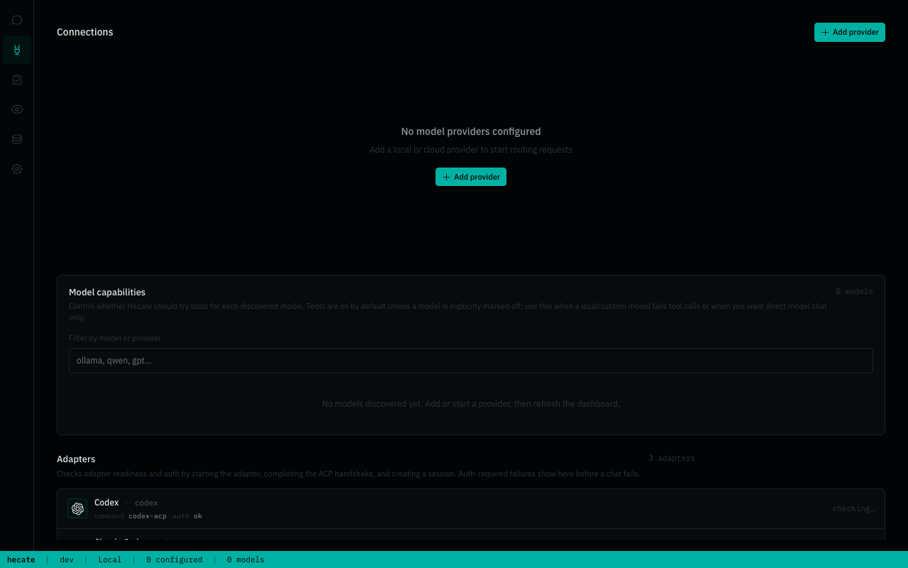
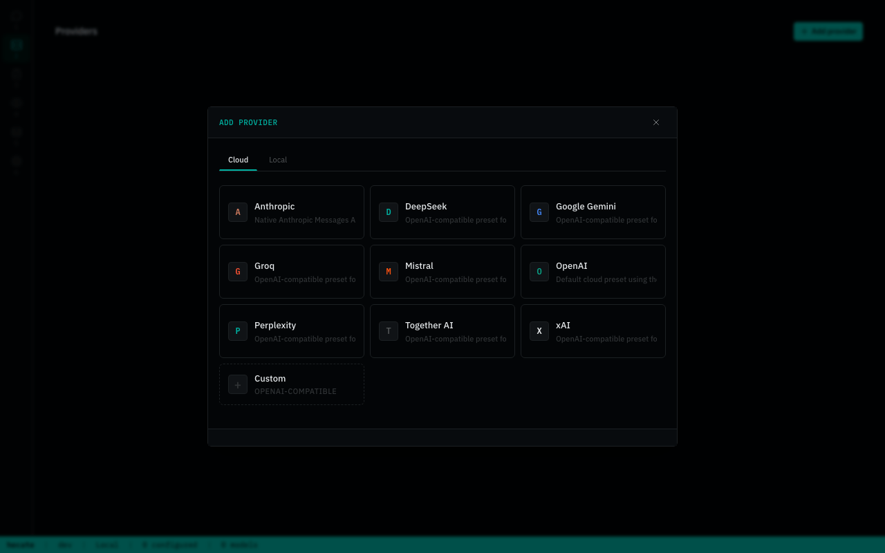
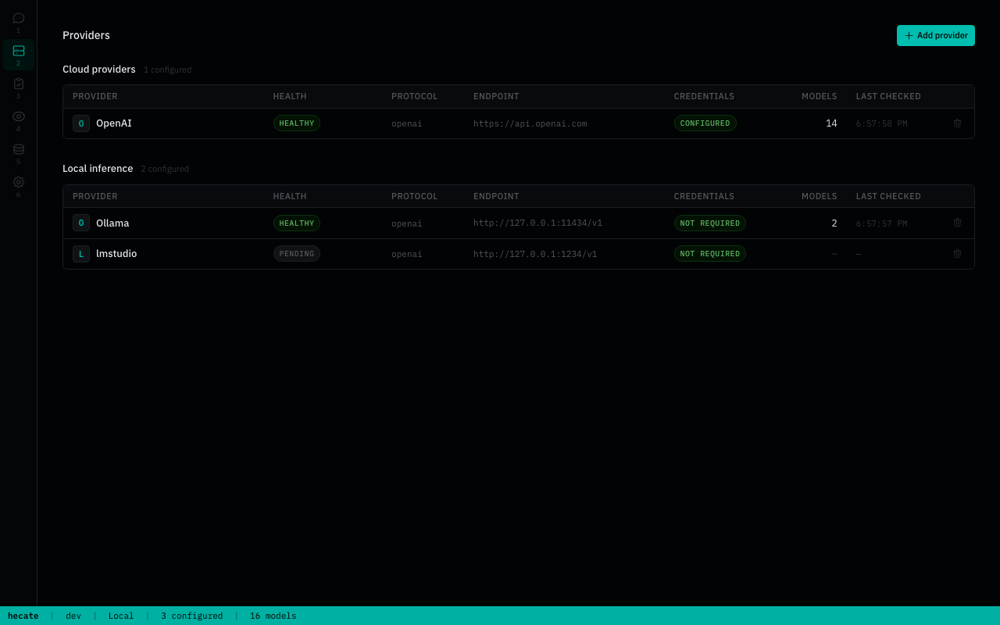
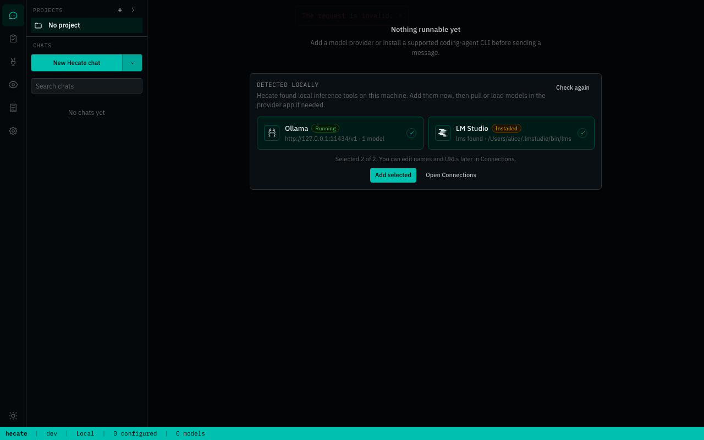
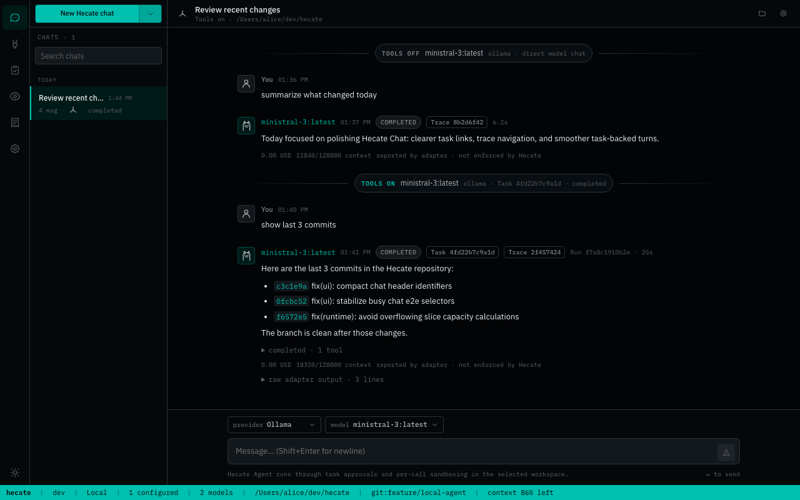
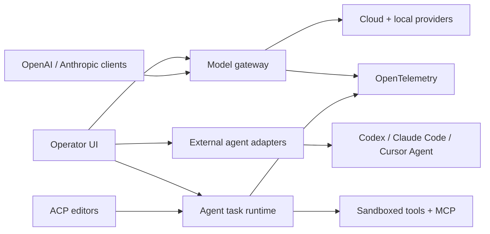
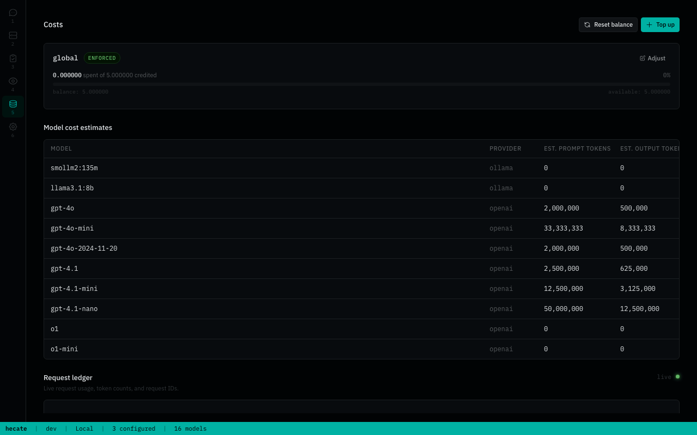
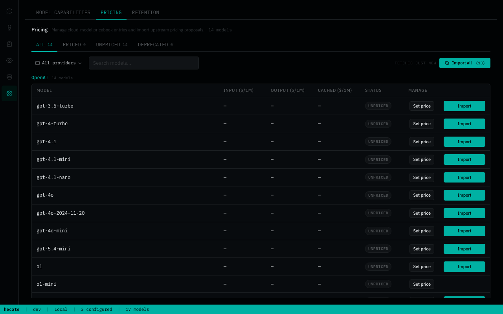
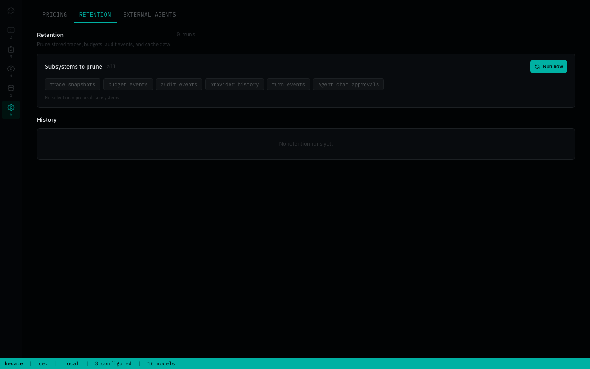

<h1 align="center">
  
</h1>

[](https://github.com/chicoxyzzy/hecate/releases/latest)
[](https://github.com/chicoxyzzy/hecate/pkgs/container/hecate)
[](https://github.com/chicoxyzzy/hecate/actions/workflows/test.yml)
[](https://goreportcard.com/report/github.com/chicoxyzzy/hecate)
[](go.mod)
[](LICENSE)
[](https://opentelemetry.io/)

**Hecate is an open-source AI gateway, coding-agent console, and agent-task runtime** for routing OpenAI- and Anthropic-compatible traffic across cloud and local models, running external coding agents as supervised local adapters, controlling spend, and running agent work behind policy, approvals, and OpenTelemetry.

> **Status: public alpha.** Core gateway is usable; agent runtime and sandbox are still evolving. Read [docs/known-limitations.md](docs/known-limitations.md) before depending on it.

## Table Of Contents

- [Why Hecate](#why-hecate)
- [Quick Start](#quick-start)
- [Architecture](#architecture)
- [Operator UI](#operator-ui)
- [What Works Today](#what-works-today)
- [Documentation](#documentation)
- [Contributing](#contributing)
- [License](#license)

## Why Hecate

AI workloads are moving from simple API calls to long-running agents, tool use, local/cloud routing, and budget-sensitive automation. Hecate gives you that runtime layer as a self-hosted gateway you run yourself: part LLM gateway, part operator console, part coding-agent workbench.

- **Cloud and local providers together** — OpenAI, Anthropic, Perplexity, Ollama, LM Studio, LocalAI, llama.cpp-compatible servers, and other shipped presets.
- **External coding agents in Chats** — run Codex, Claude Code, and Cursor Agent as supervised local processes from the same UI you use for model chat.
- **Operator-controlled spend** — balances, pricebook, rate limits, audit history.
- **Runtime visibility** — request ledger, route reports, failover details, cost, trace IDs, OpenTelemetry export.
- **Agent-task runtime** — queued tasks, approvals, controlled shell/file/git execution, patch artifacts, resumable runs, MCP integration.
- **Editor integration foundation** — experimental ACP stdio bridge for editor agent panels, backed by the same Hecate task/runtime stream.
- **Hecate-first distribution** — the `hecate` binary embeds the React operator UI via `//go:embed` and ships as a Docker image, native desktop bundles (`.dmg` / `.deb` / `.AppImage` / `.msi`), and bare binary tarballs. Companion entrypoints such as the ACP bridge stay separate where the protocol requires it.

## Quick Start

| Path | Best for |
|---|---|
| [Desktop app](#desktop-app) | Personal use on your laptop. No terminal, no Docker. |
| [Docker](#docker) | Local container, scripted local deploys. |

### Desktop app

Download from the [latest release](https://github.com/chicoxyzzy/hecate/releases/latest):

<!-- desktop-release-links:start -->
| Platform | Bundle |
|---|---|
| macOS (Apple Silicon) | [Hecate_0.1.0-alpha.12_aarch64.dmg](https://github.com/chicoxyzzy/hecate/releases/download/v0.1.0-alpha.12/Hecate_0.1.0-alpha.12_aarch64.dmg) |
| Linux x86_64 | [Hecate_0.1.0-alpha.12_amd64.deb](https://github.com/chicoxyzzy/hecate/releases/download/v0.1.0-alpha.12/Hecate_0.1.0-alpha.12_amd64.deb) or [Hecate_0.1.0-alpha.12_amd64.AppImage](https://github.com/chicoxyzzy/hecate/releases/download/v0.1.0-alpha.12/Hecate_0.1.0-alpha.12_amd64.AppImage) |
| Windows x86_64 | [Hecate_0.1.0-alpha.12_x64_en-US.msi](https://github.com/chicoxyzzy/hecate/releases/download/v0.1.0-alpha.12/Hecate_0.1.0-alpha.12_x64_en-US.msi) |
<!-- desktop-release-links:end -->

Open the bundle and launch Hecate. The gateway runs as a sidecar inside the app and the UI loads automatically. State lives in the platform data dir (`~/Library/Application Support/io.github.chicoxyzzy.hecate/` on macOS, `%APPDATA%\io.github.chicoxyzzy.hecate\` on Windows, `~/.local/share/io.github.chicoxyzzy.hecate/` on Linux).

> Bundles are not yet code-signed. On macOS, the first launch needs **right-click → Open** (Gatekeeper will block a plain double-click). On Windows, click **More info → Run anyway** on the SmartScreen warning. Subsequent launches work normally. Full footguns and roadmap in [docs/desktop-app.md](docs/desktop-app.md).

Skip to [Add a provider](#add-a-provider) once it's running.

### Docker

```bash
docker run --rm -p 127.0.0.1:8765:8765 -v hecate-data:/data \
  ghcr.io/chicoxyzzy/hecate:0.1.0-alpha.12
```

Open `http://127.0.0.1:8765`. The UI loads with no further setup.

> The container intentionally publishes only on `127.0.0.1`. Hecate is a single-operator local tool with no built-in auth; same-origin checks protect browser traffic, but they are not a network security boundary. Don't expose it to the network without putting your own auth, firewall, or reverse proxy in front.

Pinned image tags, single-file binaries (linux/darwin × amd64/arm64), and checksums in [`docs/deployment.md`](docs/deployment.md). Local development knobs in [`docs/development.md`](docs/development.md). Provider keys can be pre-seeded via `.env` for fleet automation — `PROVIDER_<NAME>_API_KEY`, `_BASE_URL`, `_DEFAULT_MODEL`, plus the `_PRECONFIGURED=1` gate. See [`docs/providers.md`](docs/providers.md#env-configured-providers).

### Add a provider

On first boot, Chats is already available but may have nothing runnable yet. For model chat, open **Providers**, click **Add provider**, pick a preset, and save the minimal setup:

- Cloud providers need an API key.
- Local providers need a running local server URL, usually the preset default.
- Custom OpenAI-compatible endpoints can be added from the same modal.







After a provider is saved, Hecate discovers models and the Chats model picker becomes routable. Full catalog, custom-endpoint walk-through, and credential rotation live in [`docs/providers.md`](docs/providers.md).

### Talk to it

Chats is the first working surface. It explains missing setup before you send a request, then lets you choose between model traffic and local coding-agent CLIs.





There are two chat targets:

- **Model** — select a configured provider/model and send OpenAI-compatible Chat Completions or Anthropic Messages traffic through Hecate's router.
- **Agent** — select a coding-agent adapter, choose a workspace, and run Codex, Claude Code, or Cursor Agent as a supervised local ACP session. Codex and Claude can use Hecate-managed local launchers; Cursor requires the Cursor Agent CLI.

Model turns record route, cost, cache, and trace metadata. Agent turns record normalized transcript, raw output, status, timing, trace IDs, workspace branch, and captured Git diff. External agents are **not** providers and do not appear in the provider/model picker; see [docs/external-agent-adapters.md](docs/external-agent-adapters.md) for install checks and troubleshooting.

## Architecture

The gateway runs as one Go process on one local HTTP port. Inside it: a chat/messages **gateway** that routes traffic to upstream model providers, an **external-agent adapter layer** that supervises coding-agent CLIs, and a **task runtime** that queues native agent work, drives approvals, and shells out through a sandbox boundary. The React operator UI is embedded into the gateway and served from the same port; `cmd/hecate-acp` is a separate stdio bridge for ACP-aware editor clients.



For deeper internals, read [docs/architecture.md](docs/architecture.md), [docs/runtime-api.md](docs/runtime-api.md), and [docs/events.md](docs/events.md).

## Operator UI

The embedded UI is a runtime console for the operator.

- **Chats** — talk to model providers or external coding agents, inspect per-turn route/cost metadata, agent activity, raw output, and captured diffs.
- **Providers** — manage provider credentials, defaults, model discovery, base URLs, and health.
- **Tasks** — create and manage agent runs, approvals, retries, resumes, and streamed output.
- **Observability** — inspect requests, route candidates, skip reasons, failover, costs, and trace events.
- **Costs** — balance, top-up / reset, usage table.
- **Settings** — pricebook and retention.

<details>
<summary>Various UI screenshots</summary>








</details>

## What Works Today

Hecate is public-alpha software. The core gateway path is usable; the agent runtime and sandbox are intentionally still evolving.

| Area | State | Notes |
|---|---|---|
| OpenAI-compatible gateway | Usable | Chat Completions, streaming, vision, model discovery |
| Anthropic-compatible gateway | Usable | Messages API shape, streaming translation, Claude Code support |
| Provider catalog | Usable | Built-in presets, encrypted credentials, health, routing readiness |
| Local providers | Usable | Ollama, LM Studio, LocalAI, llama.cpp-compatible servers |
| Local default address | Usable | Defaults to `127.0.0.1:8765`; same-origin enforced for browser requests |
| Budgets and rate limits | Usable | Balances, warning thresholds, pricebook, `429` rate-limit headers |
| OpenTelemetry | Usable | OTLP traces, metrics, logs, response headers, local trace view |
| Storage tiers | Usable | Memory or SQLite, selected per subsystem |
| Operator UI | Usable | Main workflows are present; debugging ergonomics are still improving |
| Desktop app | Alpha | Native `.dmg`, `.deb`, `.AppImage`, and `.msi` bundles are published on each release and run Hecate as a sidecar. Bundles are unsigned, so macOS Gatekeeper / Windows SmartScreen first-launch warnings are expected |
| External agent adapters | Alpha | Codex, Claude Code, and Cursor Agent discovery, long-lived ACP sessions, cancel, session history, raw diagnostics, and workspace diff capture |
| ACP bridge | Alpha | `cmd/hecate-acp` supports initialize, session new/prompt/cancel, continuation, run-event forwarding, and approval round-trip; editor packaging is not done |
| Agent task runtime | Alpha | Queues, approvals, resumable runs, `agent_loop`, MCP integration; periodic reconciler auto-recovers stale runs |
| Execution isolation | Alpha | Per-call subprocess + env sanitisation + output cap + wall-clock timeout; `bwrap` (Linux) / `sandbox-exec` (macOS) wrapping where available. Not container-level — see [`docs/sandbox.md`](docs/sandbox.md) |
| Homebrew distribution | Not shipped | A CLI formula/cask is planned later. Homebrew helps installation, but it does not replace Apple Developer ID signing/notarization for a smooth macOS desktop-app launch |

Read [docs/known-limitations.md](docs/known-limitations.md) before treating Hecate as production-stable.

## Documentation

Full index lives at [`docs/README.md`](docs/README.md), organized by reader role. The most-reached-for pages:

**Running Hecate**

- [Deployment](docs/deployment.md) — Docker, image pinning, binary install, storage tiers, rate limits.
- [Desktop app](docs/desktop-app.md) — native bundles, first-launch footguns, platform data dirs, roadmap.
- [Providers](docs/providers.md) — preset catalog, OpenAI-compatible custom endpoints, credentials, health, circuit breaking.
- [Known limitations](docs/known-limitations.md) — plain-language list of what's still alpha.

**Building against Hecate**

- [Runtime API](docs/runtime-api.md) — task lifecycle, approvals, SSE streaming.
- [Agent runtime](docs/agent-runtime.md) — `agent_loop` loop mechanics, tools, cost ceilings, retry-from-turn.
- [External agent adapters](docs/external-agent-adapters.md) — use Codex, Claude Code, and Cursor Agent from Hecate.
- [ACP bridge](docs/acp.md) — experimental stdio bridge for editor agent panels.
- [Events](docs/events.md) — every event type, payload shape, when each fires.
- [MCP integration](docs/mcp.md) — Hecate as MCP server + attaching external MCP servers as tools.

**Observability and internals**

- [Telemetry](docs/telemetry.md) — OTLP traces / metrics / logs, response headers, local trace view.
- [Architecture](docs/architecture.md) — gateway request flow, task-runtime queue / lease / sandbox boundary.
- [Development](docs/development.md) — building from source, the test ladder, screenshot tooling.
- [Release](docs/release.md) — cutting a tag, alpha gate, recovery if CI fails.

First-run environment knobs live in [`.env.example`](.env.example).

## Contributing

See [CONTRIBUTING.md](CONTRIBUTING.md). If you work with an AI assistant, start with [AGENTS.md](AGENTS.md); the vendor-neutral agent instruction layer lives in [ai/](ai/README.md).

## License

MIT. See [LICENSE](LICENSE).

Third-party notices live in [NOTICE.md](NOTICE.md), including LiteLLM pricing-data attribution and vendored splash-font licenses.
