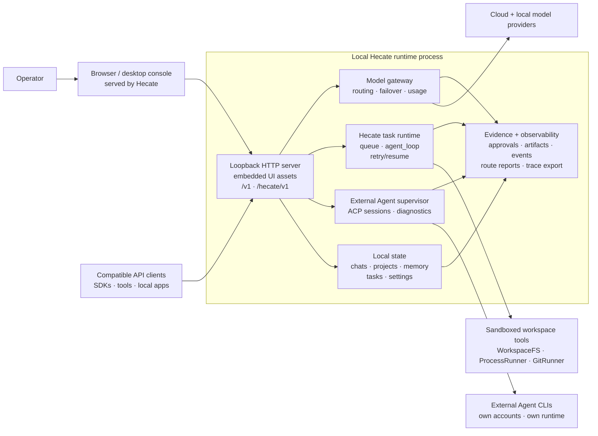
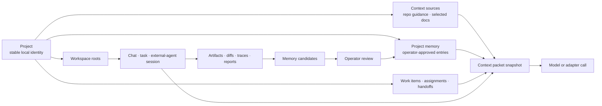

<h1 align="center">
  
</h1>

[](https://github.com/hecatehq/hecate/releases)
[](docs/operator/deployment.md#image-pinning)
[](https://github.com/hecatehq/hecate/actions/workflows/test.yml)
[](https://goreportcard.com/report/github.com/hecatehq/hecate)
[](go.mod)
[](LICENSE)
[](https://opentelemetry.io/)

<p align="center">
  <strong>Local AI operations console for supervised agent work.</strong><br>
  Run Hecate on your machine between AI clients, model providers, coding agents,
  and workspace tools so project work can be coordinated, routed, approved,
  traced, and reviewable.
</p>

> **Status: public alpha.** Hecate is useful today for model-provider routing,
> Hecate Chat, External Agent sessions, project-scoped work, approvals,
> artifacts, usage, and observability. It is not production-stable
> infrastructure yet: workflow runbooks, richer agent profiles, browser QA, and
> sandbox hardening are still design or early-alpha work. Read
> [known limitations](docs/operator/known-limitations.md) before depending on it.

## Contents

- [What Hecate Is](#what-hecate-is)
- [System Shape](#system-shape)
- [Current Capabilities](#current-capabilities)
- [Quick Start](#quick-start)
- [Use The Console](#use-the-console)
- [Project, Context, And Memory Flow](#project-context-and-memory-flow)
- [Architecture And Docs](#architecture-and-docs)
- [Status And Roadmap](#status-and-roadmap)
- [Contributing](#contributing)
- [License](#license)

## What Hecate Is

Hecate is a local AI operations console for running, supervising, and
coordinating AI work. It combines a model gateway, chat workspace, task runtime,
external-agent console, project orchestration, project context and memory,
approval gates, artifacts, usage, and OpenTelemetry traces into one operator
surface.

Hecate is local-first in the operational sense: the runtime and UI run on your
machine, Hecate-owned state is stored locally, and the gateway binds to loopback
by default. It is not local-only: you can route to cloud providers and supervise
external coding-agent CLIs that use their own accounts.

The short version:

- **Gateway:** one local API for OpenAI-compatible Chat Completions,
  Anthropic-shaped Messages, model discovery, failover, rate limits, provider
  health, and usage visibility.
- **Console:** a React operator UI for Chats, Connections, Tasks, Projects,
  Usage, Observability, and Settings.
- **Runtime:** queued task runs, tool-calling `agent_loop`, approvals,
  per-call sandbox policy, artifacts, retries, resumes, and event streams.
- **External Agent supervision:** long-lived local ACP sessions for coding-agent
  CLIs, with readiness checks, approvals, adapter diagnostics, and Git diff
  review.
- **Project orchestration:** durable project identity, roles, work records,
  assignments, handoffs, activity health, project-scoped memory, context packet
  snapshots, project skill metadata, and explicit memory promotion.
- **Evidence:** traces, route reports, task artifacts, diffs, logs, screenshots
  where available, and final run output close to the decision that produced it.

The product goal is not just to make model calls. It is to give the operator a
single place to coordinate project-scoped agent work and understand what is
happening, what context it used, what it changed, what it cost, what needs
approval, and where the evidence lives.

## System Shape



The runtime is deliberately boring in the good way: request handling, routing,
task execution, approvals, artifacts, and telemetry are all ordinary
subsystems with memory, SQLite, and Postgres storage parity where persistence
matters.

## Current Capabilities

| Surface            | What works today                                                                                                                                                                                                                                                 |
| ------------------ | ---------------------------------------------------------------------------------------------------------------------------------------------------------------------------------------------------------------------------------------------------------------- |
| **Model gateway**  | OpenAI-compatible Chat Completions, Anthropic-shaped Messages, streaming, vision, model discovery, provider health, failover, retry, usage events, and custom OpenAI-compatible endpoints.                                                                       |
| **Connections**    | Cloud presets plus Ollama, LM Studio, LocalAI, llama.cpp-compatible servers, local discovery, health checks, credentials, external-agent readiness, and durable approval grants.                                                                                 |
| **Chats**          | Direct model turns, tools-on task-backed turns, queued prompts, task/run/trace links, inline approvals, inline MCP Apps views, context packet snapshots, project-aware history, and workspace changes with rich per-file diffs.                                  |
| **Projects**       | Durable project identity, roots, context-source metadata, project activity, work items, assignments, handoffs, project memory entries, and memory candidates that require explicit operator promotion.                                                           |
| **Tasks**          | Native `agent_loop` runs, queue/lease execution, blocking approvals, streamed activity, artifacts, retry/resume, stale-run recovery, MCP tool/App integration, MCP probe, and MCP registry discovery.                                                            |
| **External Agent** | Supervised local ACP sessions for Codex, Claude Code, Cursor Agent, and Grok Build, including readiness/version checks, prompt-first approvals, adapter diagnostics, cancellation, and Git diff inspect/revert. External agents keep their own accounts/billing. |
| **Observability**  | OpenTelemetry traces/metrics/logs, response trace headers, local trace view, route reports, runtime stats, timing, token usage, and provider-reported cost where available.                                                                                      |
| **Desktop app**    | Native bundles run the Hecate runtime as a sidecar. macOS Apple Silicon is launch-tested; Linux and Windows bundles are CI-built but still experimental.                                                                                                         |
| **Sandbox policy** | WorkspaceFS boundaries, ProcessRunner/GitRunner seams, env sanitisation, output caps, timeouts, and `bwrap` / `sandbox-exec` wrappers where available. This is not container-level isolation.                                                                    |

Design direction that is not yet a runtime contract:

- Named workflow modes such as `review`, `investigate`, `qa`, `ship`,
  `security-audit`, and `design-review`.
- Browser-backed QA evidence and design review.
- Richer agent profiles and preset workflows.
- Broader context-window management and external memory provider selection.
- A first-class workflow/runbook API if the v0 experiments prove valuable.

## Quick Start

Choose the path that matches how you want to run Hecate.

| Path                        | Best for                                                                                           |
| --------------------------- | -------------------------------------------------------------------------------------------------- |
| [Desktop app](#desktop-app) | macOS personal use on your laptop. No terminal, no Docker. Linux/Windows bundles are experimental. |
| [Docker](#docker)           | Local container, scripted local deploys, and the safer Linux/Windows alpha path today.             |
| [From source](#from-source) | Contributors and local development.                                                                |

### Desktop app

Download the current alpha from [hecate.sh](https://hecate.sh) or from the
versioned GitHub Release assets below:

<!-- desktop-release-links:start -->

| Platform              | Bundle                                                                                                                                                                                                                                                                                       |
| --------------------- | -------------------------------------------------------------------------------------------------------------------------------------------------------------------------------------------------------------------------------------------------------------------------------------------- |
| macOS (Apple Silicon) | [Hecate_0.1.0-alpha.45_aarch64.dmg](https://github.com/hecatehq/hecate/releases/download/v0.1.0-alpha.45/Hecate_0.1.0-alpha.45_aarch64.dmg)                                                                                                                                                  |
| Linux x86_64          | [Hecate_0.1.0-alpha.45_amd64.deb](https://github.com/hecatehq/hecate/releases/download/v0.1.0-alpha.45/Hecate_0.1.0-alpha.45_amd64.deb) or [Hecate_0.1.0-alpha.45_amd64.AppImage](https://github.com/hecatehq/hecate/releases/download/v0.1.0-alpha.45/Hecate_0.1.0-alpha.45_amd64.AppImage) |
| Windows x86_64        | [Hecate_0.1.0-alpha.45_x64_en-US.msi](https://github.com/hecatehq/hecate/releases/download/v0.1.0-alpha.45/Hecate_0.1.0-alpha.45_x64_en-US.msi)                                                                                                                                              |

<!-- desktop-release-links:end -->

Open the bundle and launch Hecate. The app starts the bundled runtime on a
private loopback port, waits for it to become healthy, and opens the operator UI
automatically. State lives in the platform data dir:

- macOS: `~/Library/Application Support/sh.hecate.app/`
- Windows: `%APPDATA%\sh.hecate.app\`
- Linux: `~/.local/share/sh.hecate.app/`

macOS release bundles are signed and notarized. Linux and Windows bundles are
published by CI but have not yet had the same manual launch coverage. The
desktop status, updater behavior, signing notes, and footguns live in
[Desktop app](docs/operator/desktop-app.md).

### Docker

```bash
docker run --rm -p 127.0.0.1:8765:8765 -v hecate-data:/data \
  ghcr.io/hecatehq/hecate:0.1.0-alpha.45
```

Open `http://127.0.0.1:8765`.

The container intentionally publishes only on `127.0.0.1`. If you bind it
beyond loopback, put your own access control, firewall, or reverse proxy in
front. See [Security](docs/operator/security.md) for the current threat model.

Pinned image tags, binary tarballs, checksums, compose examples, storage notes,
and lost-token recovery live in [Deployment](docs/operator/deployment.md).

### From source

```bash
just dev
```

Local development requires Go, Bun, and the repo toolchain described in
[Development](docs/contributor/development.md). First-run environment knobs live
in [`.env.example`](.env.example).

## Use The Console

### Add a provider

On first boot, Chats is available immediately. If Hecate detects a local runtime
such as Ollama or LM Studio, the first-run card can add it in one click. For
manual setup, open **Connections -> Add provider**.


Cloud providers need an API key. Local providers need a running local server
URL, usually the preset default. Custom OpenAI-compatible endpoints can be added
from the same modal when the preset catalog is not enough.

After a provider is saved, Hecate discovers models and the Chats picker becomes
routable. The full provider catalog, env bootstrapping, custom-endpoint
walk-through, and credential rotation live in
[Providers](docs/operator/providers.md).

### Chat with or without tools

Hecate Chat keeps direct model turns and tools-on task-backed turns in one
transcript. Tools off sends through the gateway. Tools on uses the task runtime
with approvals, artifacts, sandbox policy, and traces.


If the selected model cannot call tools, Hecate keeps the chat usable as direct
model chat and makes the tools-unavailable state visible.


### Review workspace changes

Workspace changes sit beside the chat as session context. You can inspect the
current Git diff, filter changed files, copy patches, and discard selected
files without digging through transcript noise.


### Supervise External Agents

External Agent sessions run through local ACP-compatible CLIs. Hecate supervises
the session but does not proxy or pool those vendors' credentials.


Approvals surface as blocking operator prompts before gated actions can proceed.


See [Chat sessions](docs/runtime/chat-sessions.md), [Agent runtime](docs/runtime/agent-runtime.md),
and [External Agents](docs/runtime/external-agents.md)
for the deeper contracts.

## Project, Context, And Memory Flow

The newer Hecate shape starts with projects. A project is the durable local
identity for a codebase or work area. A workspace is the concrete filesystem
root used by a chat, task, or external-agent session.



Important boundaries:

- Context packets snapshot what Hecate assembled for a call. They are audit
  evidence, not durable memory by themselves.
- Project memory is explicit operator-approved context. Hecate does not write
  memory automatically.
- Memory candidates can be proposed by chats, tasks, handoffs, or future
  workflows. They stay out of context until the operator promotes them.
- External-agent private memory stays outside Hecate unless the operator imports
  or writes Hecate memory explicitly.

Read the implemented contract in [Runtime API](docs/runtime/runtime-api.md#project-endpoints),
then the design records for [Projects](docs/design/accepted/projects.md),
[Context assembly](docs/design/proposals/context-assembly-and-injection-boundaries.md),
[Agent memory](docs/design/proposals/agent-memory.md), and
[Workflow runbooks v0](docs/design/proposals/workflow-runbooks-v0.md).

## Architecture And Docs

The full docs index lives at [docs/README.md](docs/README.md). Start with the
bucket that matches your job.

| You are...                         | Start here                                                                                                                                                                   |
| ---------------------------------- | ---------------------------------------------------------------------------------------------------------------------------------------------------------------------------- |
| Running Hecate locally             | [Desktop app](docs/operator/desktop-app.md), [Deployment](docs/operator/deployment.md), [Security](docs/operator/security.md), [Providers](docs/operator/providers.md)       |
| Calling Hecate from a client       | [Runtime API](docs/runtime/runtime-api.md), [Chat sessions](docs/runtime/chat-sessions.md), [Agent runtime](docs/runtime/agent-runtime.md), [Events](docs/runtime/events.md) |
| Building coding-agent integrations | [External Agents](docs/runtime/external-agents.md), [MCP integration](docs/runtime/mcp.md), [Events](docs/runtime/events.md)                                                 |
| Changing the codebase              | [Architecture](docs/contributor/architecture.md), [Development](docs/contributor/development.md), [Release](docs/contributor/release.md), [docs-ai](docs-ai/README.md)       |
| Planning future runtime behavior   | [Design records](docs/design/README.md), especially the proposal/accepted/candidate bucket before implementation starts.                                                     |

Runtime references:

- [Runtime API](docs/runtime/runtime-api.md) - Hecate-native endpoints, task
  lifecycle, approvals, streaming, projects, memory, work items, and handoffs.
- [Agent runtime](docs/runtime/agent-runtime.md) - `agent_loop`, tools, costs,
  retry-from-turn, stdout/stderr, and system prompt layers.
- [Chat sessions](docs/runtime/chat-sessions.md) - transcript segments, direct
  turns, task-backed turns, queued prompts, context packets, and External Agent
  chats.
- [Events](docs/runtime/events.md) - run-event names, payloads, and SSE replay.
- [Telemetry](docs/runtime/telemetry.md) - OpenTelemetry spans, metrics, logs,
  trace headers, local trace view, and retention.
- [Sandbox](docs/runtime/sandbox.md) - subprocess boundaries, policy
  validation, env sanitisation, output caps, timeouts, and OS wrappers.

Operator guides:

- [Providers](docs/operator/providers.md) - provider presets, custom endpoints,
  credentials, model discovery, health, and circuit breaking.
- [Security](docs/operator/security.md) - local-first threat model, workspace
  safety, approvals, secrets, and advisory handling.
- [Known limitations](docs/operator/known-limitations.md) - the plain-language
  alpha boundary.

## Status And Roadmap

Hecate is public-alpha software. The fastest-moving areas are project-scoped
work, memory/context visibility, External Agent ergonomics, desktop packaging,
workflow runbook experiments, and sandbox hardening.

Near-term design direction:

1. Keep projects, context packets, memory, artifacts, approvals, and traces as
   the shared substrate for all agent work.
2. Prototype one report-only `qa` workflow using existing task runs before
   adding a standalone workflow engine.
3. Start browser support with conservative evidence capture and explicit state
   isolation.
4. Promote successful workflow lessons only as memory candidates with
   provenance and operator approval.

The broader alpha-to-beta gate lives in
[Beta roadmap](docs/contributor/beta-roadmap.md). Proposed, accepted,
candidate, implemented, and parked design records live in
[Design records](docs/design/README.md).

## Contributing

See [CONTRIBUTING.md](CONTRIBUTING.md). If you work with an AI assistant, start
with [AGENTS.md](AGENTS.md); the provider-neutral guidance layer lives in
[docs-ai](docs-ai/README.md).

## License

MIT. See [LICENSE](LICENSE).
