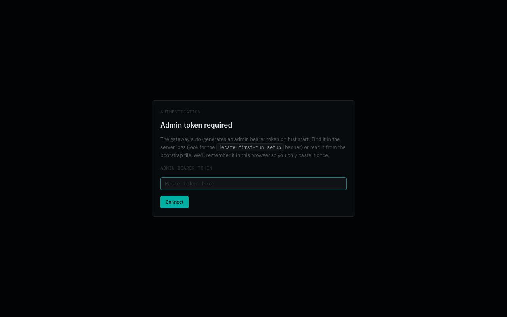
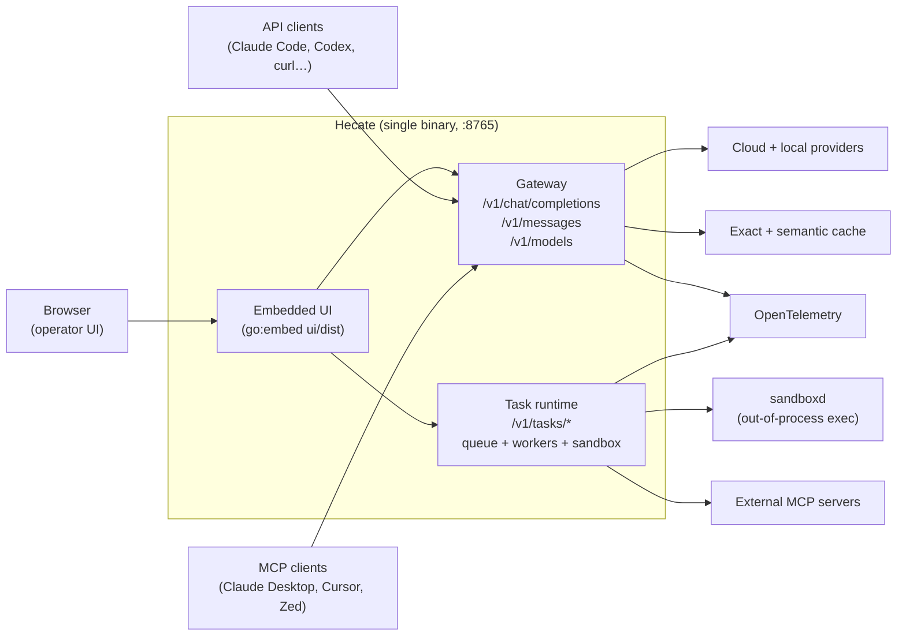
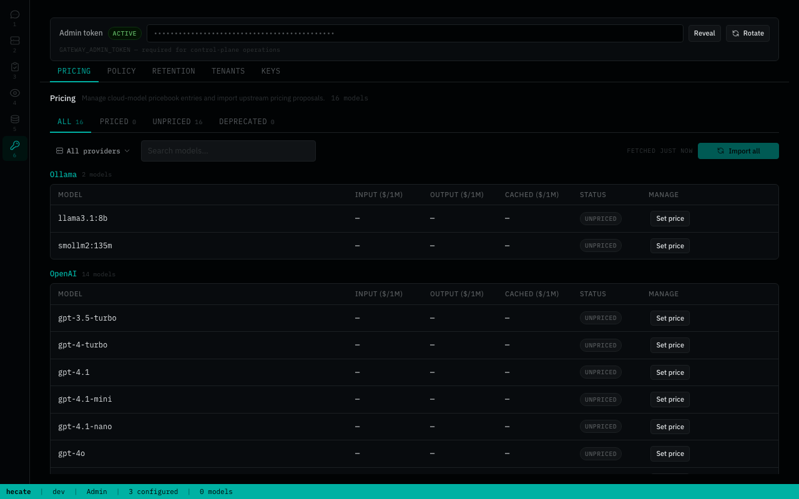

# Hecate

[](https://github.com/chicoxyzzy/hecate/releases/latest)
[](https://github.com/chicoxyzzy/hecate/pkgs/container/hecate)
[](https://github.com/chicoxyzzy/hecate/actions/workflows/test.yml)
[](https://github.com/chicoxyzzy/hecate/actions/workflows/codeql.yml)
[](https://goreportcard.com/report/github.com/chicoxyzzy/hecate)
[](go.mod)
[](LICENSE)
[](https://opentelemetry.io/)

**Open-source AI gateway and agent-task runtime.** One control plane for model access, cost governance, routing, caching, observability, and controlled agent execution. Single-user by default, multi-tenant opt-in.

> **Status: public alpha.** Core gateway is usable; agent runtime + sandbox are still evolving. Read [docs/known-limitations.md](docs/known-limitations.md) before depending on it.

## Table Of Contents

- [Why Hecate](#why-hecate)
- [Quick Start](#quick-start)
- [Modes](#modes)
- [Architecture](#architecture)
- [Operator UI](#operator-ui)
- [What Works Today](#what-works-today)
- [Documentation](#documentation)
- [Contributing](#contributing)
- [License](#license)

## Why Hecate

AI workloads are moving from simple API calls to long-running agents, tool use, local/cloud routing, and budget-sensitive automation. Hecate is built for that runtime layer.

- **Cloud and local providers together** — OpenAI, Anthropic, Ollama, LM Studio, LocalAI, llama.cpp-compatible servers, and other shipped presets.
- **Operator-controlled spend** — balances, pricebook, rate limits, audit history, and (opt-in) per-tenant API keys with model/provider scoping.
- **Runtime visibility** — request ledger, route reports, failover details, cost, cache path, trace IDs, OpenTelemetry export.
- **Agent-task runtime** — queued tasks, approvals, controlled shell/file/git execution, resumable runs, MCP integration.
- **One artifact, many wrappers** — single Go binary with the React operator UI embedded via `//go:embed`. Ships as a Docker image, native desktop bundles (`.dmg` / `.deb` / `.AppImage` / `.msi`), and bare binary tarballs.

## Quick Start

Single-user path; for multi-tenant see [`docs/tenants.md`](docs/tenants.md).

| Path | Best for |
|---|---|
| [Desktop app](#desktop-app) | Personal use on your laptop. No terminal, no Docker. |
| [Docker](#docker) | Servers, scripted deployments, anything you'd run as a service. |

### Desktop app

Download from the [latest release](https://github.com/chicoxyzzy/hecate/releases/latest):

| Platform | Bundle |
|---|---|
| macOS (Apple Silicon) | `Hecate_X.Y.Z_aarch64.dmg` |
| Linux x86_64 | `hecate-app_X.Y.Z_amd64.deb` or `.AppImage` |
| Windows x86_64 | `Hecate_X.Y.Z_x64_en-US.msi` |

Open the bundle and launch Hecate. The gateway runs as a sidecar inside the app and the UI loads automatically — no token paste, no port to remember. State lives in the platform data dir (`~/Library/Application Support/com.hecate.app/` on macOS, `%APPDATA%\com.hecate.app\` on Windows, `~/.local/share/com.hecate.app/` on Linux).

> Bundles are not yet code-signed. On macOS, the first launch needs **right-click → Open** (Gatekeeper will block a plain double-click). On Windows, click **More info → Run anyway** on the SmartScreen warning. Subsequent launches work normally. Full footguns and roadmap in [docs/desktop-app.md](docs/desktop-app.md).

Skip to [Add a provider](#add-a-provider) once it's running.

### Docker

```bash
docker run --rm -p 8765:8765 -v hecate-data:/data \
  ghcr.io/chicoxyzzy/hecate:0.1.0-alpha.9
```

Open `http://127.0.0.1:8765`. On a localhost browser, the UI picks up the generated admin bearer through a same-origin loopback handshake — no token paste needed.

<details>
<summary>Remote browsers, reverse proxies, and cross-origin setups</summary>

The loopback handshake only fires for same-host browsers. Anywhere else (Tailscale, port-forward over SSH, reverse proxy with a different hostname) the UI shows a token paste prompt:



The bootstrap token is printed once to the container logs:

```text
============================================================
  Hecate first-run setup — admin bearer token generated.

    7f2a91b... (truncated)

  Saved to /data/hecate.bootstrap.json (mode 0600).
============================================================
```

It also lives in `hecate.bootstrap.json` on the `hecate-data` volume — recovery instructions in [`docs/deployment.md`](docs/deployment.md#recovering-a-lost-admin-token).
</details>

<details>
<summary>Other install paths (clone, Postgres profile, source build, env-as-code)</summary>

Cloning the repo lets you pick up optional compose profiles or rebuild from source:

```bash
docker compose up                    # uses the ghcr.io image; first run pulls
docker compose --profile postgres up # adds Postgres for durable state across all subsystems
make dev                             # build + run from source
```

Pinned image tags, single-file binaries (linux/darwin × amd64/arm64), and checksums in [`docs/deployment.md`](docs/deployment.md). Local development knobs in [`docs/development.md`](docs/development.md).

Provider keys can be pre-seeded via `.env` for fleet automation — `PROVIDER_<NAME>_API_KEY`, `_BASE_URL`, `_DEFAULT_MODEL`, plus the `_PRECONFIGURED=1` gate. See [`docs/providers.md`](docs/providers.md#env-configured-providers). The `/admin/control-plane/providers` endpoints mirror every UI action for programmatic management.
</details>

### Add a provider

The Providers tab starts empty. Click **Add provider**, pick a preset (or **Custom** for any OpenAI-compatible endpoint), and paste an API key (cloud) or endpoint URL (local).


Cloud presets need an API key; local presets just need the runtime listening on its default port. Full catalog, custom-endpoint walk-through, and credential rotation in [`docs/providers.md`](docs/providers.md).

### Talk to it


## Modes

Hecate runs in one of two modes. The flag flips at startup; you can switch between runs without losing state.

| | **Single-user** (default) | **Multi-tenant** (opt-in) |
|---|---|---|
| Flag | `GATEWAY_MULTI_TENANT=false` | `GATEWAY_MULTI_TENANT=true` |
| Auth | One admin bearer; loopback handshake auto-fills it for same-host browsers. | Admin bearer **plus** per-tenant API keys, each scoped to allowed providers and models. |
| Operator UI | Chats, Providers, Tasks, Observability, Costs, Settings (Pricing / Policy / Retention). | Same plus the Tenants and Keys tabs in Settings. |
| Observability | Admin sees everything; tenants see nothing because there are no tenants. | Tenants see their own traces / requests / runtime stats via `/v1/*` mirrors of the `/admin/*` endpoints. |
| Use when | One operator on one host; local dev; a personal gateway behind a single key. | Multiple consumers, per-key audit, scoped credentials. |

The published Docker image ships single-user. Full breakdown in [`docs/tenants.md`](docs/tenants.md).

## Architecture

One Go process, one port. Inside it: a chat/messages **gateway** that routes traffic to upstream providers, and a **task runtime** that queues agent work, drives approvals, and shells out through a sandbox boundary. The React operator UI is embedded into the same binary and served from the same port.



For deeper internals, read [docs/architecture.md](docs/architecture.md), [docs/runtime-api.md](docs/runtime-api.md), and [docs/events.md](docs/events.md).

## Operator UI

The embedded UI is a runtime console for operators.

- **Chats** — send requests through Hecate, choose provider/model, inspect per-turn route/cost/cache metadata.
- **Providers** — manage provider credentials, defaults, model discovery, base URLs, and health.
- **Tasks** — create and manage agent runs, approvals, retries, resumes, and streamed output.
- **Observability** — inspect requests, route candidates, skip reasons, failover, costs, cache decisions, and trace events.
- **Costs** — balance, top-up / reset, usage table.
- **Settings** — pricebook, policy rules, retention, and (when `GATEWAY_MULTI_TENANT=true`) tenants + API keys.

<details>
<summary>Various UI screenshots</summary>




</details>

## What Works Today

Hecate is public-alpha software. The core gateway path is usable; the agent runtime and sandbox are intentionally still evolving.

| Area | State | Notes |
|---|---|---|
| OpenAI-compatible gateway | Usable | Chat Completions, streaming, vision, model discovery |
| Anthropic-compatible gateway | Usable | Messages API shape, streaming translation, Claude Code support |
| Provider catalog | Usable | Built-in presets, encrypted credentials, health, routing readiness |
| Local providers | Usable | Ollama, LM Studio, LocalAI, llama.cpp-compatible servers |
| Auth | Usable | Admin bearer with same-origin loopback handshake; `GATEWAY_AUTH_DISABLED` for upstream-terminated auth |
| Tenants and API keys | Opt-in | `GATEWAY_MULTI_TENANT=true` exposes tenant + key management with provider/model scoping |
| Budgets and rate limits | Usable | Balances, warning thresholds, pricebook, `429` rate-limit headers |
| Caching | Usable | Exact cache; semantic cache is available but still early |
| OpenTelemetry | Usable | OTLP traces, metrics, logs, response headers, local trace view |
| Storage tiers | Usable | Memory, SQLite, Postgres, selected per subsystem |
| Operator UI | Usable | Main workflows are present; debugging ergonomics are still improving |
| Agent task runtime | Alpha | Queues, approvals, resumable runs, `agent_loop`, MCP integration |
| Execution isolation | Alpha | `sandboxd` boundary exists; stronger OS-level isolation is future work |

Read [docs/known-limitations.md](docs/known-limitations.md) before treating Hecate as production-stable.

## Documentation

Full index lives at [`docs/README.md`](docs/README.md), organized by reader role. The most-reached-for pages:

**Running Hecate**

- [Deployment](docs/deployment.md) — Docker, image pinning, binary install, lost-token recovery, storage tiers, rate limits.
- [Desktop app](docs/desktop-app.md) — native bundles, first-launch footguns, platform data dirs, roadmap.
- [Providers](docs/providers.md) — preset catalog, custom OpenAI-compatible endpoints, credentials, health, circuit breaking.
- [Tenants and API keys](docs/tenants.md) — opt-in multi-tenant: roles, scopes, observability mirrors.
- [Known limitations](docs/known-limitations.md) — plain-language list of what's still alpha.

**Building against Hecate**

- [Runtime API](docs/runtime-api.md) — task lifecycle, approvals, SSE streaming, bootstrap-token handshake.
- [Agent runtime](docs/agent-runtime.md) — `agent_loop` loop mechanics, tools, cost ceilings, retry-from-turn.
- [Events](docs/events.md) — every event type, payload shape, when each fires.
- [MCP integration](docs/mcp.md) — Hecate as MCP server + attaching external MCP servers as tools.

**Observability and internals**

- [Telemetry](docs/telemetry.md) — OTLP traces / metrics / logs, response headers, local trace view.
- [Architecture](docs/architecture.md) — gateway request flow, task-runtime queue / lease / sandbox boundary.
- [Development](docs/development.md) — building from source, the test ladder, screenshot tooling.
- [Release](docs/release.md) — cutting a tag, alpha gate, recovery if CI fails.

First-run environment knobs live in [`.env.example`](.env.example).

## Contributing

See [CONTRIBUTING.md](CONTRIBUTING.md). If you work with an AI assistant, start with [AGENTS.md](AGENTS.md); the vendor-neutral agent instruction layer lives in [ai/](ai/README.md).

## License

MIT. See [LICENSE](LICENSE).

Third-party data notices live in [NOTICE.md](NOTICE.md), including LiteLLM pricing-data attribution.
