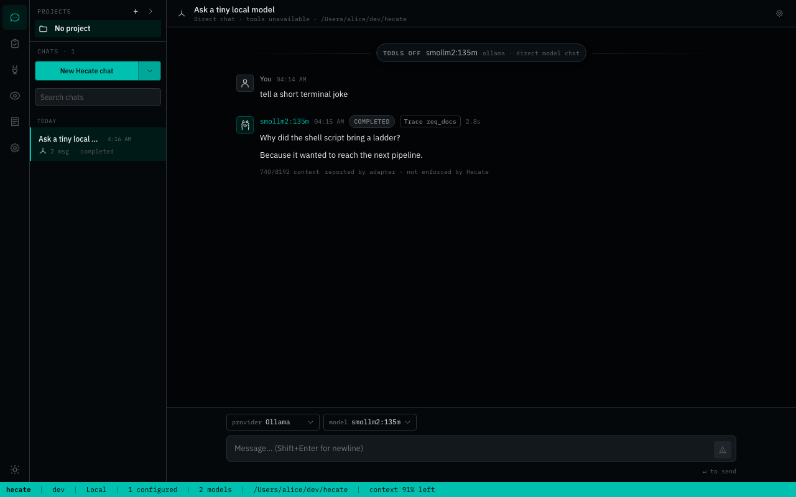
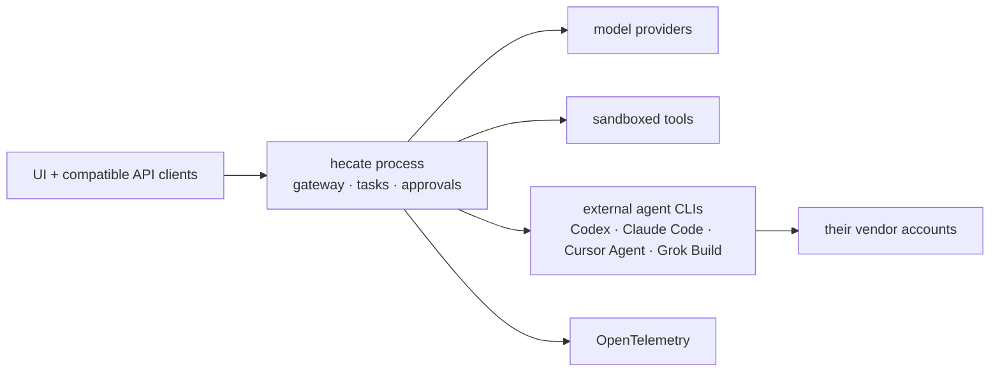
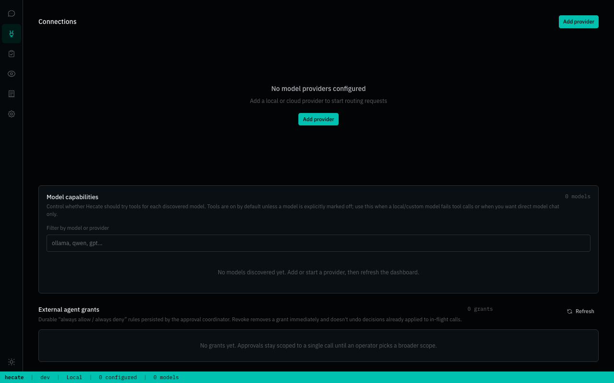
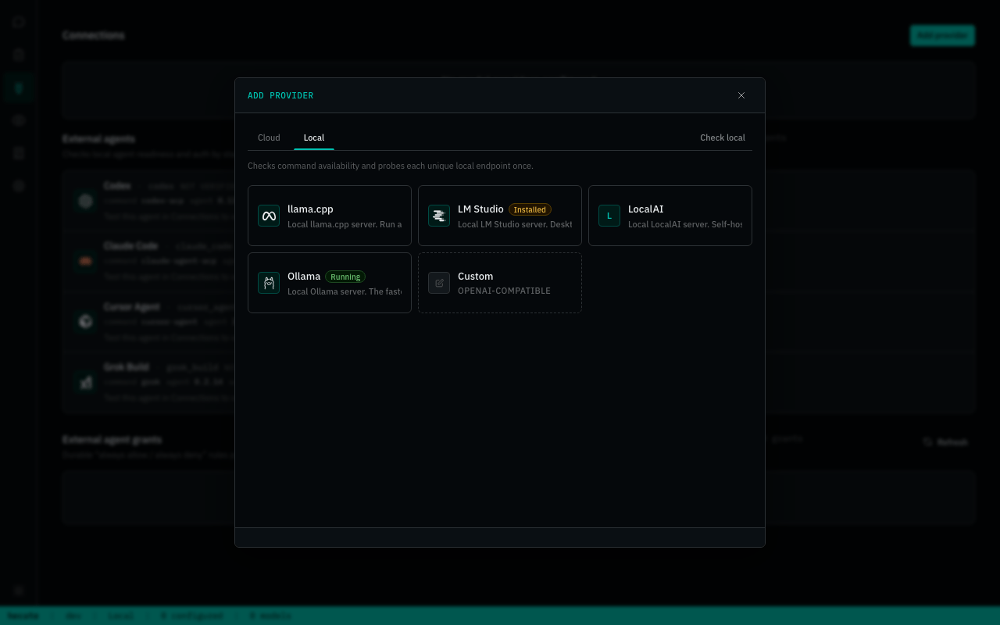
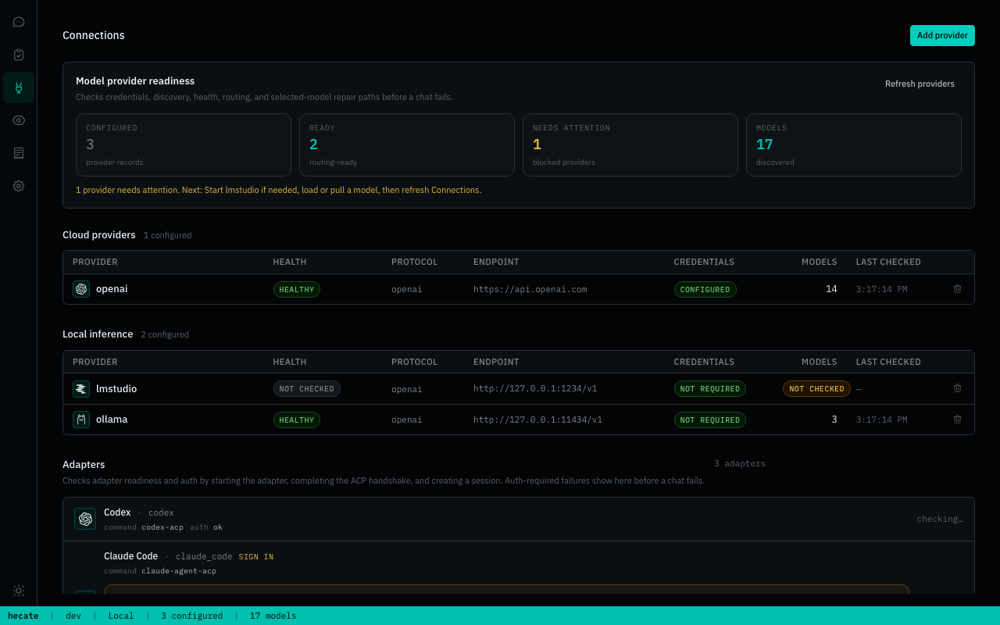
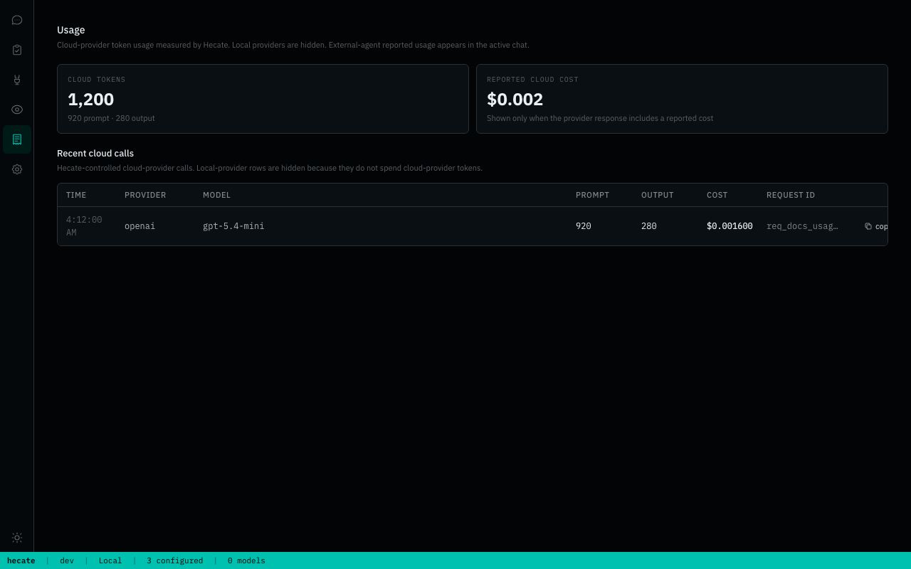
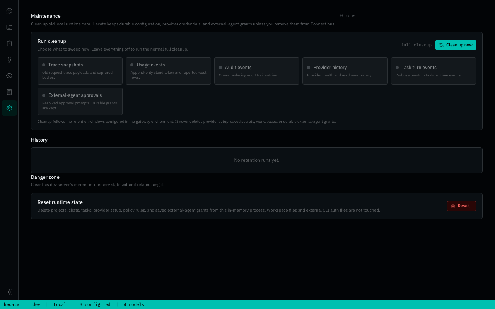

<h1 align="center">
  
</h1>

[](https://github.com/hecatehq/hecate/releases)
[](docs/deployment.md#image-pinning)
[](https://github.com/hecatehq/hecate/actions/workflows/test.yml)
[](https://goreportcard.com/report/github.com/hecatehq/hecate)
[](go.mod)
[](LICENSE)
[](https://opentelemetry.io/)
[](https://safeskill.dev/scan/hecatehq-hecate)

<p align="center">
  <strong>Local-first AI gateway and agent console.</strong><br>
  Route cloud/local models, run Hecate-owned tool agents, supervise Codex / Claude Code / Cursor Agent / Grok Build, and keep every decision observable.
</p>

> **Status: public alpha.** Gateway routing, provider onboarding, Hecate Chat, External Agent sessions, and native task runs are usable for alpha workflows. Desktop signing, workspace modes, agent profiles, and sandbox hardening are still evolving. Read [known limitations](docs/known-limitations.md) before depending on it.

## Table Of Contents

- [Why Hecate](#why-hecate)
- [Quick Start](#quick-start)
- [Architecture](#architecture)
- [Operator UI](#operator-ui)
- [What Works Today](#what-works-today)
- [Documentation](#documentation)
- [Contributing](#contributing)
- [License](#license)

## Why Hecate

AI systems are becoming more than model calls. A useful agent now chooses between cloud and local models, calls tools, edits files, retries flaky providers, spends real money, and leaves behind a trail operators need to understand.

Hecate sits at that crossroads: one local runtime layer between clients, model providers, coding-agent CLIs, and the tools that touch your machine.

| What you get                         | Why it matters                                                                                                                                                                                           |
| ------------------------------------ | -------------------------------------------------------------------------------------------------------------------------------------------------------------------------------------------------------- |
| **Gateway for cloud + local models** | OpenAI, Anthropic, DeepSeek, Gemini, Groq, Mistral, Perplexity, Together AI, xAI, Ollama, LM Studio, LocalAI, llama.cpp-compatible servers, and custom OpenAI-compatible endpoints behind one local API. |
| **Hecate Chat**                      | Use one transcript for direct model turns and tools-on task-backed agent turns with approvals, artifacts, streamed activity, and trace links.                                                            |
| **External Agent console\***         | Supervise Codex, Claude Code, Cursor Agent, and Grok Build as local ACP sessions with readiness checks, approvals, adapter diagnostics, and Git diff inspect/revert.                                     |
| **Operator-grade control**           | Token usage, reported cost, rate limits, routing reports, provider health, task approvals, and OpenTelemetry are on the hot path.                                                                        |

\*External agents use their own local CLIs, accounts, subscriptions, and billing.
Hecate supervises the session, but does not proxy, pool, or bypass those
credentials. See [External agent adapters](docs/external-agent-adapters.md).

## Quick Start

| Path                        | Best for                                             |
| --------------------------- | ---------------------------------------------------- |
| [Desktop app](#desktop-app) | Personal use on your laptop. No terminal, no Docker. |
| [Docker](#docker)           | Local container, scripted local deploys.             |

### Desktop app

Download the current alpha from [hecate.sh](https://hecate.sh) or from the
versioned GitHub Release assets below:

<!-- desktop-release-links:start -->

| Platform              | Bundle                                                                                                                                                                                                                                                                                       |
| --------------------- | -------------------------------------------------------------------------------------------------------------------------------------------------------------------------------------------------------------------------------------------------------------------------------------------- |
| macOS (Apple Silicon) | [Hecate_0.1.0-alpha.37_aarch64.dmg](https://github.com/hecatehq/hecate/releases/download/v0.1.0-alpha.37/Hecate_0.1.0-alpha.37_aarch64.dmg)                                                                                                                                                  |
| Linux x86_64          | [Hecate_0.1.0-alpha.37_amd64.deb](https://github.com/hecatehq/hecate/releases/download/v0.1.0-alpha.37/Hecate_0.1.0-alpha.37_amd64.deb) or [Hecate_0.1.0-alpha.37_amd64.AppImage](https://github.com/hecatehq/hecate/releases/download/v0.1.0-alpha.37/Hecate_0.1.0-alpha.37_amd64.AppImage) |
| Windows x86_64        | [Hecate_0.1.0-alpha.37_x64_en-US.msi](https://github.com/hecatehq/hecate/releases/download/v0.1.0-alpha.37/Hecate_0.1.0-alpha.37_x64_en-US.msi)                                                                                                                                              |

<!-- desktop-release-links:end -->

Open the bundle and launch Hecate. The app starts the gateway sidecar, waits for it to become healthy, and opens the embedded operator UI automatically. State lives in the platform data dir (`~/Library/Application Support/sh.hecate.app/` on macOS, `%APPDATA%\sh.hecate.app\` on Windows, `~/.local/share/sh.hecate.app/` on Linux).

> macOS bundles released after the codesign+notarization rollout are signed with a Developer ID Application certificate and notarized — first launch needs no Gatekeeper bypass. Earlier alpha bundles, plus any future release built before the `APPLE_*` repo secrets are configured (e.g. fork builds, the brief window between this PR and the next tag), remain unsigned and need **right-click → Open** on first launch. Windows bundles are not yet signed; click **More info → Run anyway** on the SmartScreen warning. Subsequent launches work normally. Full footguns and roadmap in [docs/desktop-app.md](docs/desktop-app.md).
>
> Existing installs from alpha.28 onward auto-update through the signed `https://hecate.sh/releases/alpha/latest.json` channel. Older alpha builds used GitHub's `/releases/latest/download/latest.json` updater endpoint and should be reinstalled manually from the current alpha.

Skip to [Add a provider](#add-a-provider) once it's running.

### Docker

```bash
docker run --rm -p 127.0.0.1:8765:8765 -v hecate-data:/data \
  ghcr.io/hecatehq/hecate:0.1.0-alpha.37
```

Open `http://127.0.0.1:8765`. The UI loads with no further setup.

> The container intentionally publishes only on `127.0.0.1`. Hecate is designed as a local-first operator console, not as a directly exposed network service. If you bind it beyond loopback, put your own access controls, firewall, or reverse proxy in front. See [Security](docs/security.md) for the current threat model.

Pinned image tags, binary tarballs (linux/darwin × amd64/arm64), checksums, compose examples, and storage notes live in [`docs/deployment.md`](docs/deployment.md). Local development setup lives in [`docs/development.md`](docs/development.md).

### Add a provider

On first boot, Chats is already available. If Hecate detects a local runtime such as Ollama or LM Studio, the model chat setup can be one click: keep the detected runtimes selected, choose **Add selected**, and Hecate adds those local endpoints with the preset defaults.


Chats starts with a setup-first empty state: detected local runtimes can be added in one click, while Connections remains available for manual provider setup.

You can still configure providers manually from **Connections → Add provider**:

- Cloud providers need an API key.
- Local providers need a running local server URL, usually the preset default.
- Custom OpenAI-compatible endpoints can be added from the same modal when the preset catalog is not enough.

After a provider is saved, Hecate discovers models and the Chats model picker becomes routable. The full preset catalog, env bootstrapping, custom-endpoint walk-through, and credential rotation live in [`docs/providers.md`](docs/providers.md).

### Talk to it

Chats is the primary day-to-day surface. It explains missing setup before you send a request, then keeps the common flows in one place:

- **Hecate Chat** — choose a provider/model and use the per-chat **tools on/off** switch. Tools off is direct model chat through the gateway; tools on uses Hecate's task runtime with approvals, artifacts, per-call sandboxing, and OpenTelemetry. If a selected model becomes stale because provider discovery changed, Chats blocks send and shows the provider route, discovered-model count, health, and repair steps before the request leaves your machine.
- **External Agent** — select Codex, Claude Code, Cursor Agent, or Grok Build, choose a workspace, and supervise a local ACP session.


Hecate Chat keeps direct model turns and tools-on task-backed turns in one transcript, with task, run, trace, timing, usage, and activity details close to the answer.



If the selected model is known not to support tool-calling, Hecate keeps the chat usable as direct model chat and shows the tools-unavailable state in the header instead of failing the prompt.


External Agent approvals surface in Chats as actionable operator prompts before Codex, Claude Code, Cursor Agent, or Grok Build can apply gated actions.


The approval modal shows the adapter-provided action, available ACP choices, grant scope, and an optional audit note before the decision is persisted.

Hecate Chat preserves runtime boundaries inside the transcript: tools-off turns keep route/cost/cache metadata, tools-on turns link to their backing Task/run, and every assistant turn can link to its trace. If a task-backed run is busy, the composer queues the next prompt locally for that chat and sends it when the run settles. The Tasks workspace remains canonical for full run history, advanced activity details, artifacts, retry/resume, and patch review. See [Chat sessions](docs/chat-sessions.md), [Agent runtime](docs/agent-runtime.md), and [External agent adapters](docs/external-agent-adapters.md) for the deeper contracts.

Chats can be renamed from the sidebar. The title is just operator-facing metadata, so renaming never changes the workspace, selected runtime, provider/model snapshots, or external-agent native session.

## Architecture

The main `hecate` process owns the local UI/API, model gateway, and task runtime. External agents are separate local CLIs supervised from Chats.



For deeper internals, read [docs/architecture.md](docs/architecture.md), [docs/runtime-api.md](docs/runtime-api.md), [docs/events.md](docs/events.md), and [docs/telemetry.md](docs/telemetry.md).

## Operator UI

The embedded UI is a runtime console for the operator.

| Workspace         | Job                                                                                                                                         |
| ----------------- | ------------------------------------------------------------------------------------------------------------------------------------------- |
| **Chats**         | Hecate Chat with per-chat tools on/off, External Agent sessions, queued prompts, task/trace/run links, timing, usage, and captured diffs.   |
| **Connections**   | Model-provider credentials, local/cloud presets, model discovery, routing readiness, external-agent readiness, and durable approval grants. |
| **Tasks**         | Native `agent_loop` runs, approvals, retries, resumes, streamed output, artifacts, and full run history.                                    |
| **Observability** | Request history, route candidates, skip reasons, failover, usage, traces, metrics, logs, and local trace events.                            |
| **Usage**         | Cloud-provider tokens, known provider-reported cost, and adapter-reported external-agent usage.                                             |
| **Settings**      | Local data cleanup. Provider credentials, model capabilities, and external-agent setup live in Connections.                                 |

<details>
<summary>Various UI screenshots</summary>



Connections owns setup: when no providers exist, the empty state points directly to the provider catalog instead of leaving Chats to fail later.



The Add provider flow groups cloud and local presets, showing detected local runtimes and the defaults Hecate will use.



Configured providers show health, endpoint, credential state, model discovery, routing readiness, and repair actions in one place.


External-agent readiness, Claude Code/Codex/Cursor Agent setup state, and durable approval grants are managed from the same Connections surface.


Chats starts from a project-aware shell with setup-aware onboarding: local runtimes can be added quickly, or you can jump back to Connections for manual provider setup.


Hecate Chat keeps project-scoped direct model turns and tools-on task-backed turns in one transcript, with task, run, trace, timing, usage, and activity details close to the answer.


Models without tool-calling support still work for ordinary chat: Hecate falls back to direct model turns and keeps that state visible in the header.


External Agent approvals surface in Chats as actionable operator prompts before Codex, Claude Code, Cursor Agent, or Grok Build can apply gated actions.


The approval modal shows the adapter-provided action, available ACP choices, grant scope, and an optional audit note before the decision is persisted.


Tasks remains the deep-debug view for native `agent_loop` runs: timelines, failed tools, stdout/stderr, artifacts, approvals, retry, and resume.


Observability answers “what happened?” with recent requests, route status, trace timing, event flow, and the selected request’s runtime details.



Usage is intentionally narrow: cloud-provider tokens and known provider-reported cost where Hecate controls or observes the provider call.



Settings stays small; cleanup controls are separated from provider, adapter, and model-capability setup, which live in Connections.

</details>

## What Works Today

Hecate is public-alpha software. The core gateway, Hecate Chat, and native task runtime are usable for alpha workflows; workspace modes, agent profiles, desktop signing, and sandbox hardening are intentionally still evolving.

Stability stages:

- **Alpha-ready**: coherent enough for normal alpha use with known caveats.
- **Implemented**: core mechanism exists, but product polish/hardening is still needed.
- **Early**: works in some paths, but still rough or incomplete.
- **Not shipped**: planned, not available.

| Area                | State       | Notes                                                                                                                                                                                                                                                        |
| ------------------- | ----------- | ------------------------------------------------------------------------------------------------------------------------------------------------------------------------------------------------------------------------------------------------------------ |
| Model gateway       | Alpha-ready | OpenAI-compatible Chat Completions, Anthropic-shaped Messages, streaming, vision, model discovery, failover, rate limits, usage events, and custom endpoints.                                                                                                |
| Connections         | Alpha-ready | Cloud presets plus Ollama, LM Studio, LocalAI, llama.cpp-compatible servers, local discovery, health, credentials, and checklist-style routing readiness diagnostics.                                                                                        |
| Hecate Chat         | Alpha-ready | Direct model turns and tools-on task-backed `agent_loop` segments in one transcript, streamed assistant text, task/trace links, local busy-prompt queueing, and inline task approvals. Workspace modes and agent profiles are still future work.             |
| External Agent      | Alpha-ready | Codex, Claude Code, Cursor Agent, and Grok Build discovery, long-lived ACP sessions, prompt-first approvals, grants, health/version checks, cancel, guardrails, adapter diagnostics, and Git diff inspect/revert. Runs as trusted subprocesses.              |
| Task runtime        | Alpha-ready | Queue/lease execution, approvals, resumable `agent_loop`, MCP integration, streamed output, artifacts, and stale-run recovery. Broader lifecycle hardening is still ongoing.                                                                                 |
| Observability       | Alpha-ready | OTLP traces/metrics/logs, response trace headers, local trace view, route reports, timing buckets, and runtime stats.                                                                                                                                        |
| Storage             | Alpha-ready | Memory or SQLite per subsystem; SQLite persists chat/task/provider state. Pending approval reconciliation runs on startup.                                                                                                                                   |
| Desktop app         | Early       | Native `.dmg`, `.deb`, `.AppImage`, and `.msi` bundles run Hecate as a sidecar. macOS release builds are signed/notarized and auto-update is active through the `hecate.sh` alpha channel; Windows signing and Linux/Windows launch smoke are still pending. |
| Execution isolation | Early       | Per-call subprocess + env sanitisation + output cap + timeout, with `bwrap` / `sandbox-exec` where available. Not container-level isolation.                                                                                                                 |

Read [docs/known-limitations.md](docs/known-limitations.md) before treating Hecate as production-stable.

## Documentation

Full index lives at [`docs/README.md`](docs/README.md), organized by reader role. The most-reached-for pages:

**Running Hecate**

- [Deployment](docs/deployment.md) — Docker, image pinning, binary install, storage tiers, rate limits.
- [Desktop app](docs/desktop-app.md) — native bundles, first-launch footguns, platform data dirs, roadmap.
- [Providers](docs/providers.md) — preset catalog, OpenAI-compatible custom endpoints, credentials, health, circuit breaking.
- [Known limitations](docs/known-limitations.md) — plain-language list of what's still alpha.
- [Alpha-to-beta roadmap](docs/beta-roadmap.md) — core gates, UX polish order, cleanup/refactoring, and branch/release workflow.

**Building against Hecate**

- [Runtime API](docs/runtime-api.md) — task lifecycle, approvals, queue/lease execution, SSE streaming.
- [Chat sessions](docs/chat-sessions.md) — Hecate Chat transcript segments, tools on/off behavior, task-backed turns, queueing, and activity rendering.
- [Agent runtime](docs/agent-runtime.md) — `agent_loop` loop mechanics, tools, stdout/stderr handling, cost ceilings, retry-from-turn.
- [External agent adapters](docs/external-agent-adapters.md) — Hecate as an ACP client/operator: use Codex, Claude Code, Cursor Agent, and Grok Build from Chats.
- [Events](docs/events.md) — every event type, payload shape, when each fires.
- [MCP integration](docs/mcp.md) — Hecate as MCP server + attaching external MCP servers as tools.

**Observability and internals**

- [Telemetry](docs/telemetry.md) — OTLP traces / metrics / logs, response headers, local trace view.
- [Security](docs/security.md) — local-first threat model, workspace safety, approvals, secrets, and advisory handling.
- [Architecture](docs/architecture.md) — gateway request flow, task-runtime queue / lease / sandbox boundary.
- [Development](docs/development.md) — source-build toolchain, local dev, website work, the test ladder, screenshot tooling.
- [Release](docs/release.md) — cutting a tag, verification gate, recovery if CI fails.
- [Alpha-to-beta roadmap](docs/beta-roadmap.md) — what must be true before the first beta tag.

First-run environment knobs live in [`.env.example`](.env.example).

## Contributing

See [CONTRIBUTING.md](CONTRIBUTING.md). If you work with an AI assistant, start with [AGENTS.md](AGENTS.md); the vendor-neutral agent instruction layer lives in [docs-ai/](docs-ai/README.md).

## License

MIT. See [LICENSE](LICENSE).
