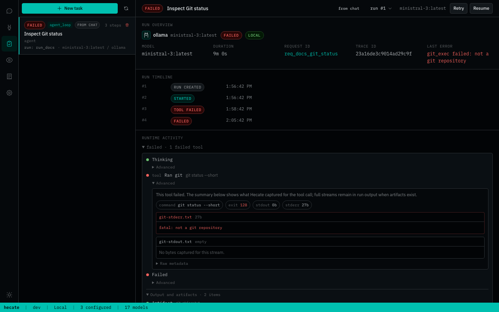
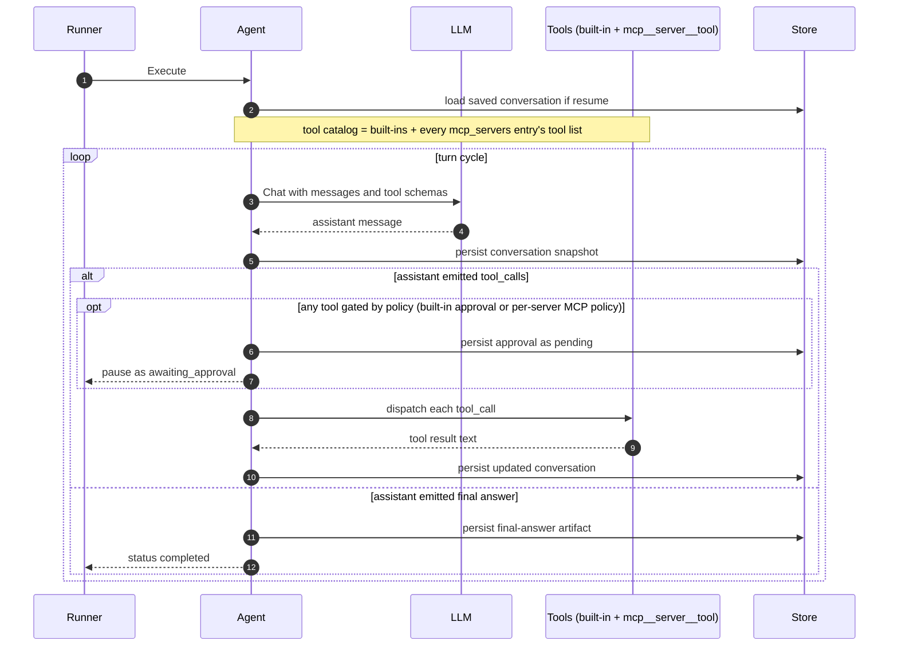

# Agent Runtime

Hecate's `agent_loop` execution kind runs an LLM-driven loop: the model picks tools, the runtime dispatches them, results feed back to the model, and the loop continues until the model produces a final answer or hits a safety bound (max turns, cost ceiling, approval gate). This document covers how the loop works, the built-in tools, the safety story, and the control surface.

For the high-level execution flow that wraps it (queue, lease, sandbox, events), see [`architecture.md`](architecture.md#task-runtime-flow). For the API endpoints that drive it, see [`runtime-api.md`](runtime-api.md).

`agent_loop` is also the runtime behind **Hecate Chat** when tools are on. In
that mode Chats creates a visible task with `execution_profile=chat_agent` and
`origin_kind=chat`; the first tools-on user message starts the task, and
follow-up tools-on messages continue the latest terminal run instead of
creating a new task per message. Turning tools off switches the same transcript
back to direct model chat. Turning tools on again after a direct model segment
starts a fresh task-backed segment in that transcript. Tasks remains canonical
for approvals, events, artifacts, retry/resume, and patch review; Chats is the
conversational entry point with compact activity, task/trace links, and inline
approval actions. When the selected provider supports streaming, the agent loop
streams assistant text into the conversation artifact during the model turn so
Chats can show the answer before the task run reaches a terminal state.
Providers without streaming fall back to the normal non-streaming chat call.

**Invariant: one chat, many segments, one active task-backed loop.** A single
Hecate Chat session can carry an arbitrary history of segments — alternating
tools-on and tools-off — in one continuous transcript. Within that transcript
**at most one task-backed loop is active at a time.** Each tools-on segment
maps to exactly one backing task; while that task's latest run is non-terminal
(`queued`, `running`, `awaiting_approval`), the chat is "busy" and the
composer's submit control reflects three states:

- **idle** — the regular `Send message` button (`aria-label="Send message"`).
- **busy with empty composer** — a red icon button labelled
  `Stop current run` that cancels the active run.
- **busy with a typed prompt** — a `Queue message` button that buffers
  the text locally and replays it automatically once the active run
  finishes.

A yellow banner under the composer surfaces a queueing notice plus an
`Open task` link to the backing task in the Tasks workspace and a `Stop`
button (`aria-label="Stop active task"`) that also cancels the run. The
backend returns `409 chat.agent_session_busy` if a client bypasses
the UI. Once the active run reaches a terminal state, the next tools-on
prompt either continues the same task with a new run or — if tools have
been toggled off and on in the meantime — starts a fresh task-backed
segment. Historical segments persist for transcript context but never
resume execution; the only loop the runtime drives forward is the active
one.

The Tasks workspace in the operator UI is the human entry point — create a task, watch its run state, approve or retry, and inspect streamed output:

> Contributing here? Start at [`AGENTS.md`](../AGENTS.md) for the codebase map and runtime invariants; conventions, workflow, and verification ladders live under [`docs-ai/`](../docs-ai/README.md).

## Contents

- [Loop mechanics](#loop-mechanics)
- [Built-in tools](#built-in-tools)
- [External MCP tools](#external-mcp-tools)
- [Workspace modes](#workspace-modes)
- [Output and stderr in the UI](#output-and-stderr-in-the-ui)
- [System prompt layers](#three-layer-system-prompt)
- [Approval gating](#approval-gating)
- [Cost tracking](#cost-tracking)
- [Retry and resume](#retry-and-resume)
- [Configuration knobs](#configuration-knobs)
- [Common failure modes](#common-failure-modes)

## Loop mechanics

A run with `execution_kind=agent_loop` walks turns:

1. The runtime calls the LLM with the running conversation, available tool schemas, and the operator-composed system prompt. If the gateway route supports streaming, assistant text deltas are captured and persisted as a partial conversation snapshot while the turn is still running.
2. The model responds with either tool calls or a final answer.
3. If tool calls: each is dispatched, the result is appended as a `tool` message, the loop runs another turn.
4. If a final answer: the loop ends. The answer is persisted as a `summary` artifact.

The conversation is persisted as an artifact (`agent_conversation`, JSON-encoded `[]Message`) on every turn. During a streaming model turn, Hecate also refreshes that artifact with the partial assistant answer at a throttled cadence; after the provider finishes, the usual full turn snapshot replaces it. A crash mid-loop, an approval pause, or a deliberate retry-from-turn therefore all start from a known state.

Three things bound the loop:

- **`GATEWAY_TASK_AGENT_LOOP_MAX_TURNS`** (default `8`) — hard ceiling on LLM round-trips per run. Runaway-cost safety net.
- **`Task.BudgetMicrosUSD`** — per-task cost ceiling. Checked after each turn against `priorCost + costSpent`; failing the run preserves the assistant's last message.
- **Approval gates** — when the model requests a gated tool, the loop pauses with `status=awaiting_approval` and emits an approval record. See below.

## Built-in tools

The agent gets seven tools by default. None require operator config beyond the approval policies; `http_request` reads the network policy from env.

| Tool           | What it does                                                  | Policy                                                                                                                                                                                                                                                                    |
| -------------- | ------------------------------------------------------------- | ------------------------------------------------------------------------------------------------------------------------------------------------------------------------------------------------------------------------------------------------------------------------- |
| `shell_exec`   | Run a shell command in the workspace                          | Gated by `shell_exec` or `all_tools` policy (default on); executed in a per-call `sh` subprocess with env sanitisation + output cap + wall-clock timeout, optionally wrapped by `bwrap` / `sandbox-exec` for OS-level fs+net confinement (see [`sandbox.md`](sandbox.md)) |
| `git_exec`     | Run a git command in the workspace                            | Gated by `git_exec` or `all_tools` policy (default on)                                                                                                                                                                                                                    |
| `file_write`   | Write or append a file under the workspace                    | Gated by `file_write` or `all_tools` policy (default on)                                                                                                                                                                                                                  |
| `file_edit`    | Replace exact text in an existing workspace file              | Gated by `file_write` or `all_tools` policy (default on)                                                                                                                                                                                                                  |
| `read_file`    | Read a file under the workspace (8 KiB cap, binary detection) | Ungated by default; gate with `read_file` or `all_tools` policy. Path must resolve within the sandbox root                                                                                                                                                                |
| `list_dir`     | List entries under a workspace path                           | Ungated unless `all_tools` is set. Path must resolve within the sandbox root                                                                                                                                                                                              |
| `http_request` | Make an outbound HTTP request                                 | Gated by `network_egress` or `all_tools` policy; SSRF guards (private-IP block, scheme allowlist, optional host allowlist)                                                                                                                                                |

Tool argument schemas are JSON-Schema-shaped and surfaced to the LLM in the standard `tools` array on each `Chat` request. Bad arguments are returned to the model as a tool-result error string rather than failing the run, so the model can correct itself.

### Network egress for shell_exec / git_exec

`shell_exec` and `git_exec` are bounded by the same allowlist semantics as `http_request` when the task has `sandbox_network=true`:

- HTTP/HTTPS URLs that appear as command tokens are extracted and validated.
- Hosts that parse as a private/loopback IP literal (10/8, 172.16/12, 192.168/16, 127/8, 169.254/16, link-local, multicast) are rejected unless `GATEWAY_TASK_SHELL_ALLOW_PRIVATE_IPS=true`.
- When `GATEWAY_TASK_SHELL_ALLOWED_HOSTS` is set, only those exact hostnames are reachable. Empty = all public hosts allowed.

Enforcement is **best-effort static parsing** of the command string. Tools that respect the allowlist (`curl`, `wget`, `git fetch`, `bun install`, `pip install`, etc.) get covered; clever obfuscation (base64-encoded URLs, `nc`/`telnet` raw sockets, custom-binary egress) bypasses it. The kernel-enforced backstop comes from Layer 2 of the sandbox: on Linux with `bwrap` installed, and on macOS, every shell/git call runs inside a wrapper that drops the network namespace (Linux) or applies a Seatbelt profile (macOS) when the task's `sandbox_network=false`. See [`sandbox.md`](sandbox.md#layer-2--os-level-isolation) for the auto-detection logic and platform coverage. The default `sandbox_network=false` (no network at all) plus an active Layer 2 wrapper is the strongest guarantee short of a full container.

## External MCP tools

In addition to the seven built-ins, an `agent_loop` task can declare external MCP servers on the `mcp_servers` task field. Their tools join the LLM's catalog at run start under `mcp__<server>__<tool>` aliases — for example a `read_file` tool on a server aliased `fs` becomes `mcp__fs__read_file`. Approval gating is per-server (`auto` / `require_approval` / `block`), distinct from the built-in approval policy axis.

See [`mcp.md#hecate-as-mcp-client`](mcp.md#hecate-as-mcp-client) for the full schema, transports (stdio + Streamable HTTP), secret-aware `env` / `headers`, lifecycle / caching contract, and dry-run probe.

## Workspace modes

Every run has a workspace — a directory the sandbox locks tools to. Two modes:

- **isolated clone** (default; `WorkspaceMode` empty / `persistent` / `ephemeral`) — the workspace manager copies or git-clones `task.WorkingDirectory` (or `task.Repo`) to a fresh temp dir under `${TMPDIR}/hecate-workspaces/<task_id>/<run_id>`. Writes don't touch the source. Safe by default.
- **`in_place`** — the workspace IS `task.WorkingDirectory`. Tools write directly to the operator's source. Necessarily destructive; opt-in. Requires an absolute existing directory or the run fails up-front rather than silently flipping back to the clone behavior.

The new-task UI exposes `in_place` as a "Run directly in this workspace" checkbox under WORKSPACE.

## Run activity in the UI

Task Detail renders the run's normalized activity array as the primary
inspection timeline. Hecate Chat uses the same renderer when a tools-on chat
turn projects backing task activity into the transcript, so operators see the
same labels in both places: tool calls, approvals, changed files, final-answer
artifacts, and terminal run state.

The shared renderer intentionally separates signal from bookkeeping. High-level
activity stays visible in chronological order; raw task artifacts and internal
markers are grouped under **Details**. Task Detail opens that activity section
by default because it is a run-inspection view. Chats keeps it quieter so the
conversation remains the primary surface. Task Detail may additionally expose a
per-row **Advanced** disclosure with raw activity metadata for debugging:
activity id/type/status, step/artifact/approval ids, tool kind, path, timestamp,
and summary payload. Failed tool rows additionally preview related stdout/stderr
artifacts there, so the common "why did this command fail?" path is answerable
without leaving the activity row.

## Output and stderr in the UI

Task runs capture process output as structured stdout/stderr artifacts and
typed `tool.shell.*` events. The operator UI intentionally treats stdout as the
primary terminal pane and only surfaces stderr when stderr exists.

That default keeps successful runs readable: many healthy CLIs write progress,
warnings, or diagnostics to stderr, and rendering an always-empty stderr panel
creates noise. When both streams exist, they should remain visually separated
(stdout first, stderr as a labeled section or toggle) rather than merged into
one undifferentiated transcript. For lower-level consumers, use the run
artifacts and `tool.shell.output_chunk` events; the event payload includes
`stream: "stdout" | "stderr"` so tooling can reconstruct or filter either
stream.

Task Detail still records whether each stream artifact exists. The run output
header shows stdout size when available, `stderr available` when stderr has
content, and `stderr empty` when the stderr artifact was created but no bytes
were captured. Failed tool rows in Task Detail's **Advanced** disclosure preview
stdout/stderr artifacts from the same step and keep empty stderr discoverable as
"No bytes captured for this stream." Hecate Chat keeps failed-tool diagnostics
compact: it links only non-empty stdout/stderr artifacts from the chat activity
row, shows capped inline previews for those streams, and leaves the empty-stream
confirmation to Task Detail.

### Workspace environment system message

Every fresh `agent_loop` run prepends a machine-generated system message that tells the model where its workspace lives:

> Your workspace is at: `/var/folders/.../run_xxx`
>
> Use this path (or paths under it) when calling tools. `shell_exec` / `git_exec` default their working_directory to the workspace when omitted; `read_file` / `list_dir` resolve relative paths from the workspace. Tool calls that target paths outside this directory are rejected by the sandbox — don't reuse paths from the user prompt verbatim if they fall outside the workspace.

Without this, the model would read `/Users/foo/myrepo` from the user prompt and use that path verbatim — landing outside the cloned sandbox and failing with `escapes allowed root`. The env message is environmental fact, kept separate from the operator-tunable system prompt so it can't be accidentally elided.

## Three-layer system prompt

The operator-tunable system prompt is composed from three layers, broadest first:

1. **Global** — `GATEWAY_TASK_AGENT_SYSTEM_PROMPT` (env). Applies to every agent_loop run gateway-wide.
2. **Workspace** — `CLAUDE.md` or `AGENTS.md` in the task's working directory, capped at 8 KiB. Read once per run.
3. **Per-task** — `Task.SystemPrompt` set when the task is created.

Layers are concatenated with blank lines between them. Empty layers are skipped (no wasted message). The composed prompt is the second system message in the conversation; the workspace-environment message above is the first.

## Approval gating

Two distinct approval flows:

### Pre-execution approval

Triggered when the task's `execution_kind` is `shell` / `git` / `file` (or `sandbox_network=true`) AND a matching policy is in `GATEWAY_TASK_APPROVAL_POLICIES`. The run is created in `awaiting_approval` status before it ever leaves the queue. The UI shows an amber banner with the command being approved. Approve → run becomes `queued` → executes. Cancel before approval → run becomes `cancelled` and the pending approval is marked `cancelled` so stale approval buttons cannot resurrect the run.

### Mid-loop approval (`agent_loop_tool_call`)

When the LLM calls a gated tool inside an `agent_loop` run, the loop pauses. Policy → tool mapping:

- `shell_exec` → pauses on `shell_exec` tool calls
- `git_exec` → pauses on `git_exec` tool calls
- `file_write` → pauses on `file_write` and `file_edit` tool calls
- `read_file` → pauses on `read_file` tool calls
- `network_egress` → pauses on `http_request` tool calls
- `all_tools` → pauses on every tool call (`shell_exec`, `git_exec`, `file_write`, `file_edit`, `read_file`, `list_dir`, `http_request`)

The runtime emits an approval record of kind `agent_loop_tool_call`, persists the conversation snapshot, and returns `status=awaiting_approval` for the run. The UI banner shows which tools the agent wants to use. On approve, the same run is re-queued; on resume, the loop detects the trailing assistant tool_calls without resolved results, dispatches them (no second LLM call), and continues. On reject, the run terminates `failed`. On cancel, the run terminates `cancelled`, any awaiting approval step is marked `cancelled`, and the pending approval is resolved as `cancelled`.

The approval banner stays in sync with the run state because approvals ride along in every SSE snapshot (`TaskRunStreamEventData.Approvals`). No separate refetch needed.

## Cost tracking

Per-turn LLM cost is captured at three granularities:

- **`turn.completed` events** — one per LLM round-trip on the persisted run-event log. Each event carries the per-turn spend, the run-cumulative figure (this run only), and the task-cumulative figure (entire resume chain via `PriorCostMicrosUSD`). Subscribe via `/hecate/v1/events?event_type=turn.completed`; the wire shape is in [`events.md`](events.md#turncompleted). These rows are the only run events the retention worker prunes — see the `turn_events` subsystem in [`telemetry.md`](telemetry.md#retention-spans) and `GATEWAY_RETENTION_TURN_EVENTS_*` in `.env.example`.
- **`tool.file.patch` events** — emitted whenever `file_write` or `file_edit` changes or proposes a file change. Each event points at a `patch` artifact containing the unified diff, giving operator UIs and future ACP/CLI consumers an inspectable edit record without re-deriving state from the workspace.
- **Patch review API** — `GET /hecate/v1/tasks/{id}/runs/{run_id}/patches` lists patch artifacts. Applied patches can be reverted; proposed patches from `file_edit` with `propose=true` can be applied if the target file still matches the captured before-content.
- **`git_summary` artifacts** — when the run workspace is a git repository and has changes at run completion, Hecate records a `git-changes.json` artifact with porcelain status entries and a diff stat for quick changed-file review.
- **Model-step `OutputSummary`** — each thinking step's `OutputSummary.cost_micros_usd` carries the same per-turn figure, so the run-replay UI surfaces it next to "turn N" without a separate event subscription.
- **`TaskRun.TotalCostMicrosUSD` + `PriorCostMicrosUSD`** — finalized totals on the run record. Cumulative across the resume chain = `Prior + Total`.

The per-task ceiling (`Task.BudgetMicrosUSD`) is checked against `priorCost + costSpent` after each turn — so a chain of resumes can't escape the ceiling by repeatedly resuming a maxed-out run.

Same-run mid-approval resumes seed `costSpent` from the run's pre-pause `TotalCostMicrosUSD`, so the post-resume turns add to (rather than overwrite) the pre-pause spend.

## Retry and resume

Three operations land an agent_loop run back on the queue with prior context:

- **Retry** — `POST /hecate/v1/tasks/{id}/runs/{run_id}/retry`. Creates a new run with the same task config but no conversation history. The cheapest "do it again from scratch" button.
- **Resume** — `POST /hecate/v1/tasks/{id}/runs/{run_id}/resume`. Creates a new run that hydrates the source run's conversation and continues from where it left off. Used after a `failed` or `cancelled` run.
- **Continue** — `POST /hecate/v1/tasks/{id}/runs/{run_id}/continue` with `{ "prompt": "..." }`. Creates the next run in the same agent conversation, hydrates the source conversation, then appends the new user prompt. This is the ACP/editor-session path.
- **Retry from turn N** — `POST /hecate/v1/tasks/{id}/runs/{run_id}/retry-from-turn` with `{ "turn": N, "reason": "..." }`. Creates a new run whose conversation is truncated to right before the Nth assistant message. Lets operators explore an alternate path from a known prior state. Turn must be in `[1, count(assistant messages)]`. The new run's step indices restart at 1; cumulative cost picks up from `source.PriorCost + source.Total`.

The conversation viewer in the run-replay UI shows a `↻ retry from here` button on each assistant turn (terminal runs only).

## Configuration knobs

Env vars that affect agent_loop runs:

| Variable                               | Default            | What it does                                                                                                      |
| -------------------------------------- | ------------------ | ----------------------------------------------------------------------------------------------------------------- |
| `GATEWAY_TASK_AGENT_LOOP_MAX_TURNS`    | `8`                | Hard ceiling on LLM round-trips per run                                                                           |
| `GATEWAY_TASK_AGENT_SYSTEM_PROMPT`     | `""`               | Global (broadest) layer of the three-layer system prompt                                                          |
| `GATEWAY_TASK_HTTP_TIMEOUT`            | `30s`              | Timeout for the `http_request` tool                                                                               |
| `GATEWAY_TASK_HTTP_MAX_RESPONSE_BYTES` | `262144` (256 KiB) | Response size cap for `http_request`                                                                              |
| `GATEWAY_TASK_HTTP_ALLOW_PRIVATE_IPS`  | `false`            | When `false`, blocks loopback / RFC1918 / link-local destinations                                                 |
| `GATEWAY_TASK_HTTP_ALLOWED_HOSTS`      | `""`               | Comma-separated exact-host allowlist; empty = all public hosts                                                    |
| `GATEWAY_TASK_SHELL_ALLOW_PRIVATE_IPS` | `false`            | Same private-IP block, applied to URLs in shell_exec / git_exec commands when the task has `sandbox_network=true` |
| `GATEWAY_TASK_SHELL_ALLOWED_HOSTS`     | `""`               | Same exact-host allowlist, applied to shell_exec / git_exec command URLs                                          |

For `GATEWAY_TASK_APPROVAL_POLICIES` (which gates mid-loop tool calls and the matching pre-execution task gates; valid values: `shell_exec`, `git_exec`, `file_write`, `network_egress`, `read_file`, `all_tools`) see [`runtime-api.md#approval-policy-configuration`](runtime-api.md#approval-policy-configuration). `file_write` gates both full-file writes and exact-match `file_edit` calls. For per-task `mcp_servers` knobs (max-servers cap, client-cache sizing, ping intervals) see [`runtime-api.md#runtime-backend-and-queue-configuration`](runtime-api.md#runtime-backend-and-queue-configuration) and [`mcp.md#resource-limits`](mcp.md#resource-limits).

Hecate Chat can opt a session into RTK command-output compaction from
the chat settings panel. The setting is off by default. Hecate only
discovers RTK with `exec.LookPath("rtk")`, so the `rtk` binary must be
visible in the gateway process `PATH`; `/hecate/v1/system/stats` then
reports `rtk_available=true` plus `rtk_path`, and the UI suggests
enabling compact command output during new-chat onboarding. When enabled
for that chat, shell/git tool subprocesses launch as
`rtk sh -lc <command>` after policy validation; the same sandbox wrapper,
environment sanitisation, output caps, and timeouts still apply. Task
telemetry records both the pre-wrapper and post-wrapper command strings
so traces can show what RTK changed, with secret-looking env assignments
redacted before export or persistence.

Per-task fields on `POST /hecate/v1/tasks` that affect agent_loop:

- `execution_kind: "agent_loop"` — picks this runtime
- `prompt` — the user message; required
- `system_prompt` — narrowest layer of the three-layer composition; optional
- `working_directory` — absolute path; required when `workspace_mode=in_place`
- `workspace_mode` — `""` / `"persistent"` / `"ephemeral"` (all clone) or `"in_place"` (use source directly)
- `requested_provider` / `requested_model` — pin the LLM provider and model. For `agent_loop`, a model must be resolvable at start time — either `requested_model` is set on the task, or the gateway has a default model configured (`GATEWAY_DEFAULT_MODEL`). A missing model returns 422 `model_not_configured` before a run is created.
- `budget_micros_usd` — per-task cost ceiling in micro-USD; `0` disables
- `mcp_servers` — array of external MCP server configs whose tools join the catalog under `mcp__<name>__<tool>` aliases. Schema in [`mcp.md#hecate-as-mcp-client`](mcp.md#hecate-as-mcp-client).

## Common failure modes

- **HTTP 422 `model_not_configured`** — `POST /hecate/v1/tasks/{id}/start` was called for an `agent_loop` task with no model resolvable (neither `task.RequestedModel` nor the gateway's `GATEWAY_DEFAULT_MODEL` is set). No run is created. Fix: set `requested_model` on the task or configure a default model.
- **`escapes allowed root`** — the LLM picked a path outside the workspace. The env system message normally prevents this; if you see it, check that `task.WorkingDirectory` matches what the model is using, or switch to `workspace_mode=in_place` to align them.
- **`api key is required for cloud provider X`** — the operator pinned provider X but no credentials are configured, OR the request fell through to the default provider. The router uses `Scope.ProviderHint` from `run.Provider` (mirrored from `task.RequestedProvider`); empty hint falls back to the default model's provider.
- **`model "X" does not support tool-calling`** — the chosen model rejects the `tools` field. Tiny / chat-only models (e.g. `smollm2:135m`) hit this. Pick a tool-capable model: `gpt-4o-mini`, `claude-sonnet-4-6`, or `qwen2.5-coder` for Ollama. Hecate Chat normally avoids this for new prompts by falling back to direct model chat when tool support is unknown or absent; native Tasks still require a tool-capable model.
- **`agent loop hit per-task cost ceiling`** — `Task.BudgetMicrosUSD` was exceeded across the run + prior chain. Raise the ceiling and resume to continue.
- **`agent loop hit maxTurns=N without producing a final answer`** — the model didn't terminate. Either raise `GATEWAY_TASK_AGENT_LOOP_MAX_TURNS`, narrow the prompt, or resume to give it more turns.
