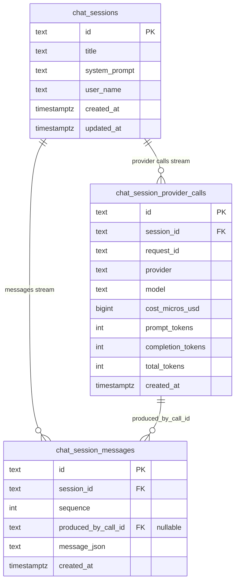
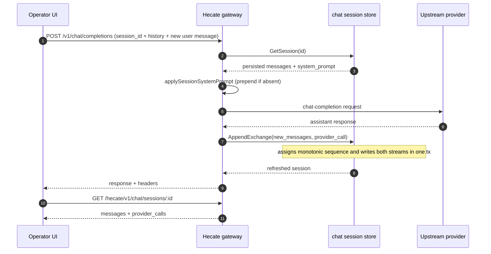

# Chat sessions

Hecate has two chat persistence surfaces today. The legacy
`/hecate/v1/chat/sessions` subsystem stores SDK-style direct model conversations
against the gateway. It is *not* the agent runtime (see
[agent-runtime.md](agent-runtime.md) for the `agent_loop` execution kind, which
uses the word "turn" for a different concept). SDK clients hitting
`/v1/chat/completions` with a `session_id` use this store; the MCP
`list_chat_sessions` tool surfaces it.

The Chats workspace has two top-level targets: **Hecate Chat** and
**External Agent**. Hecate Chat covers both direct model chat and
Hecate-owned agent execution: the tools toggle decides whether a prompt stays
as a direct provider/model turn or enters the native agent task runtime.

Hecate Chat treats model/provider readiness as part of composition, not a
send-time surprise. If no configured provider has routable models, the empty
state points at provider setup or local runtime discovery. If models exist but
the currently selected model is no longer reported by the selected provider
(for example after changing Ollama models), the composer is blocked with the
selected model, provider route, discovered-model count, health, and next steps
before any request is sent. Existing transcripts show the full readiness card
near the composer with an **Open Connections** action; empty chats show a compact
version in the empty state that still includes the discovered-model count,
health/blocking/error diagnostics, and short remediation steps. The compact card
is intentionally not just a warning — it should be enough to choose a discovered
model, refresh local provider discovery, or jump to Connections for the full
readiness checklist.

The backend owns the readiness wording. `/hecate/v1/providers/status` returns a
provider-level `readiness` summary plus detailed `readiness_checks`, and
`/v1/models` adds `metadata.readiness` for every discovered provider/model row.
The UI should prefer those fields over local guesswork whenever they are
present; client-side inference is only a fallback for stale sessions or older
payloads.

Hecate Chat also has one per-chat **Instructions** field. With tools off, the
instructions are sent as the direct model turn's `system_prompt`. With tools
on, the same text becomes the per-task system prompt for the Hecate-owned
`agent_loop` task, layered under the global, tenant, and workspace
`AGENTS.md` / `CLAUDE.md` prompts. Once a chat has messages the field is locked
so historical segments keep the instructions they were created with; start a
new chat to change them. External Agent chats do not use this field because
Codex, Claude Code, and Cursor own their own prompt/configuration surface.

The operator UI's **Hecate Chat** target now uses **Agent Chat** sessions under
`/hecate/v1/agent-chat/sessions` for both tools-off direct model turns and tools-on
Hecate Agent turns. Those records can point at a runtime when tools are enabled,
but they can also store direct model segments:

- **Model** segments call the gateway/router directly and store user/assistant
  messages with `runtime_kind="model"`. They do not create Tasks.
- **Hecate Agent** sessions map one chat session to one visible
  `agent_loop` task-backed segment. The first tool-enabled prompt creates the
  task; follow-up prompts continue the latest terminal run when the previous
  segment was also Hecate Agent. If tools are re-enabled after a direct model
  segment, Hecate creates a new task-backed segment in the same transcript.
  While a task-backed segment is queued, running, or awaiting approval, the
  whole Hecate Chat session is busy: direct model sends are blocked too, so one
  transcript cannot race a live task loop against a separate model turn. The
  composer shows the busy state with **Open task** and **Stop** actions so the
  operator can jump to the canonical Task view or cancel the active loop.
  If the operator submits another prompt while the active run is still busy,
  the UI keeps it in a local **Queued next** FIFO and submits it automatically
  after the run or approval reaches a terminal state. Queued prompts preserve
  the originating chat session plus the selected runtime/model/workspace
  snapshot from the moment they were queued, so switching to another chat cannot
  drain a prompt into the wrong transcript. They can be edited or removed while
  waiting. They are persisted in browser-local operator storage until submitted,
  removed, or pruned because the backing chat session was deleted.
  Chats projects the backing run activity into the transcript, links each
  assistant turn back to its backing Task/run, and can approve/reject pending
  task approvals inline. Low-level artifacts stay under transcript **Details**,
  while Tasks remains the canonical run/artifact view. On refresh, the UI
  rehydrates the active Hecate Chat from the persisted session/task snapshot so
  queued, running, and awaiting-approval states stay visible without sending a
  new prompt.
  When the backing provider supports streaming, the running assistant message
  updates from the task conversation artifact before the task run completes.
- **External Agent** sessions map one chat session to one supervised adapter
  session such as Codex, Claude Code, or Cursor Agent.

The Agent Chat API shape used by the operator UI is in
[`runtime-api.md`](runtime-api.md#get-hecatev1agent-chatsessions), and external
adapter behavior is in [`external-agent-adapters.md`](external-agent-adapters.md).

## Activity rendering

Hecate uses one compact activity vocabulary across Hecate Chat transcripts and
Task Detail. This is deliberate: an operator should see the same story whether
they stay in Chats or open the canonical Task/run view.

The shared renderer keeps the high-signal path visible:

- model turns / thinking
- tool calls
- approval requested / approved / rejected / cancelled
- files changed
- final answer
- terminal run state

Lower-level task artifacts, raw output markers, and internal bookkeeping are
grouped under **Details**. Chats keeps those details collapsed by default so the
conversation stays readable; Task Detail opens the activity section by default
because that view is already a run-inspection surface. Task Detail can also
show a per-row **Advanced** disclosure with raw activity metadata such as
step/artifact/approval ids, tool kind, path, timestamp, and summary payload.
For failed tool rows, Task Detail also previews stdout/stderr artifacts captured
for the same tool step, including an explicit empty-stream note when stderr was
captured but contained no bytes. Artifacts from other steps are intentionally
not linked into that row, so a failed command cannot appear to have output from
an unrelated tool call.
When a tool row fails, Chats may show its own **Advanced** disclosure with
capped previews of the backing Task's non-empty stdout/stderr artifacts plus an
**Open task output** escape hatch for the full capture. Empty streams stay
hidden there; open the Task view when you need to confirm whether stderr was
captured but empty.

## Mental model

This section covers the legacy `/hecate/v1/chat/sessions` storage model used by
SDK-style direct model conversations. The operator UI's current Hecate Chat
target uses Agent Chat sessions as described above.

A chat session has two independent streams:

- **Messages** — the conversation, in order. Every entry is a complete `Message` (role, content, content_blocks, tool_calls, tool_call_id, tool_error). Sequence numbers are monotonic per session and authoritative for ordering.
- **Provider calls** — observability for upstream chat-completion requests. Each call records routing decision (requested vs. resolved provider/model), token usage, and resolved cost.

Provider and model selection are per request, not fixed on the session. A single chat session can therefore contain provider calls from multiple upstream providers or models; replay uses the message stream, while the provider-call stream explains what each request used.

Messages and provider calls are linked by `produced_by_call_id`: a message's `produced_by_call_id` points at the call that emitted it. Assistant messages always have one; tool messages emitted by a server-side runtime have one; user, system, and client-supplied tool-result messages have an empty `produced_by_call_id`.



The `(session_id, sequence)` pair on `chat_session_messages` is unique — the store assigns sequence numbers inside the same transaction as the insert to keep ordering deterministic across concurrent appends. `produced_by_call_id` is `ON DELETE SET NULL` so a deleted call doesn't drag its messages down with it; sessions cascade-delete both children.

## Why two streams instead of one row per exchange

Hecate previously stored a flat `(user_message, assistant_message)` row per upstream call. That worked for plain chat but broke as soon as a tool loop entered the picture: intermediate `assistant(tool_calls)` and `tool` messages had no place to live, so they were dropped on persistence and the next replay failed with an orphaned `tool_call_id`. Mid-conversation provider switches also lost rich content — Anthropic `thinking` blocks and `tool_error` flags couldn't survive a UI round-trip.

The two-stream model splits two concerns that were conflated:

| Concern | Lives in |
|---|---|
| Conversation state (what the model receives on the next call) | `chat_session_messages` |
| Per-request observability (routing, model, cost, tokens) | `chat_session_provider_calls` |

These have different cardinalities — a server-driven tool loop produces *one* user message and *N* provider calls; a single client-driven call may add several tool-result messages and produce *one* assistant message. The flat exchange row couldn't honor both at once.

## Replay

Replay is a one-line transform: read messages in `sequence` order. There's no special case for tool flows, no inferring of "exchanges," no diff against prior state. The UI does this directly; SDK clients re-emit the history on each call and the gateway diffs against persisted count to figure out which entries are new.



The "new messages this round" calculation in `RecordChatExchange` is:

1. Read current `len(persisted_messages)`.
2. Skip a leading system message if it matches `session.system_prompt` exactly (this was prepended by `applySessionSystemPrompt`, not authored by the operator).
3. Take `req.Messages[skip + persistedCount:]` — those are the new client-supplied entries.
4. Append them with empty `produced_by_call_id`, then append the assistant response with `produced_by_call_id = call.id`.

This handles three flows uniformly: first-turn, multi-turn replay, and tool-loop continuation (where the new entries include tool-result messages).

## Wire shape

`GET /hecate/v1/chat/sessions/{id}` returns:

```json
{
  "object": "chat_session",
  "data": {
    "id": "chat_…",
    "title": "…",
    "system_prompt": "…",
    "user": "…",
    "created_at": "…",
    "updated_at": "…",
    "messages": [
      {
        "id": "msg_…",
        "sequence": 0,
        "role": "user",
        "content": "Say hello.",
        "created_at": "…"
      },
      {
        "id": "msg_…",
        "sequence": 1,
        "produced_by_call_id": "call_…",
        "role": "assistant",
        "content": "Hello.",
        "content_blocks": [
          { "type": "thinking", "thinking": "…", "signature": "…" },
          { "type": "text", "text": "Hello." }
        ],
        "created_at": "…"
      }
    ],
    "provider_calls": [
      {
        "id": "call_…",
        "request_id": "req_…",
        "provider": "anthropic",
        "model": "claude-sonnet-4-…",
        "cost_micros_usd": 1234,
        "cost_usd": "0.001234",
        "prompt_tokens": 12,
        "completion_tokens": 4,
        "total_tokens": 16,
        "created_at": "…"
      }
    ]
  }
}
```

The session-list endpoint (`GET /hecate/v1/chat/sessions`) returns a leaner summary per session: `message_count`, `provider_call_count`, and the most-recent call's `last_model` / `last_provider` / `last_cost_usd` / `last_request_id`. It does not include message bodies.

`content_blocks` and `tool_error` are Hecate extensions to the OpenAI-compat `OpenAIChatMessage` shape. They are emitted on session-fetch responses and consumed on inbound chat-completion requests when the UI replays history. SDK clients hitting the public `/v1/chat/completions` proxy don't need to know about them — the fields are `omitempty` on the wire and the canonical `Message` is the lingua franca either way.

## Storage backends

Two implementations, same `Store` interface (`internal/chatstate/store.go`):

| Backend | When | Notes |
|---|---|---|
| `memory` | tests, `--memory` mode | In-process, ephemeral; mutex-serialized. |
| `sqlite` | `--sqlite-path …`, default in the docker image | WAL journal, `foreign_keys = ON`, `BEGIN IMMEDIATE`-style transactions for `AppendExchange`. |

Schema migration on upgrade drops the old `chat_session_turns` table — turn rows are not migrated forward. Session metadata (title, system_prompt, user_name, timestamps) survives the upgrade. Operators with stored conversation history they want to keep should export before upgrading; this is a one-way break.

## Code map

- `pkg/types/chat.go` — `ChatSession`, `ChatSessionMessage`, `ChatProviderCall`, the canonical `Message` type with `ContentBlocks` and `ToolError`.
- `internal/chatstate/` — `Store` interface plus two implementations (`MemoryStore`, `SQLiteStore`). `AppendExchange` is the canonical write; it assigns sequence numbers and writes both streams in one transaction.
- `internal/gateway/service.go` — `RecordChatExchange` decides which inbound messages are "new this round" and constructs the `ChatProviderCall` from response metadata.
- `internal/api/openai.go` — `OpenAIChatMessage` extension fields (`content_blocks`, `tool_error`); `ChatSessionMessageItem` and `ChatProviderCallItem` are the wire shape for session-fetch.
- `internal/api/handler_sessions.go` — render functions for list / get / create / update / delete.
- `ui/src/types/runtime.ts` — TS mirrors (`ChatSessionRecord`, `ChatSessionMessageRecord`, `ChatProviderCallRecord`).
- `ui/src/app/useRuntimeConsole.ts` — `buildMessagesForSubmission` flattens persisted messages for replay; `submitChat` performs the optimistic insert + post-response patch.
- `ui/src/features/chats/ChatView.tsx` — message-by-message rendering; per-assistant-message cost / token strip looked up via `produced_by_call_id`.
