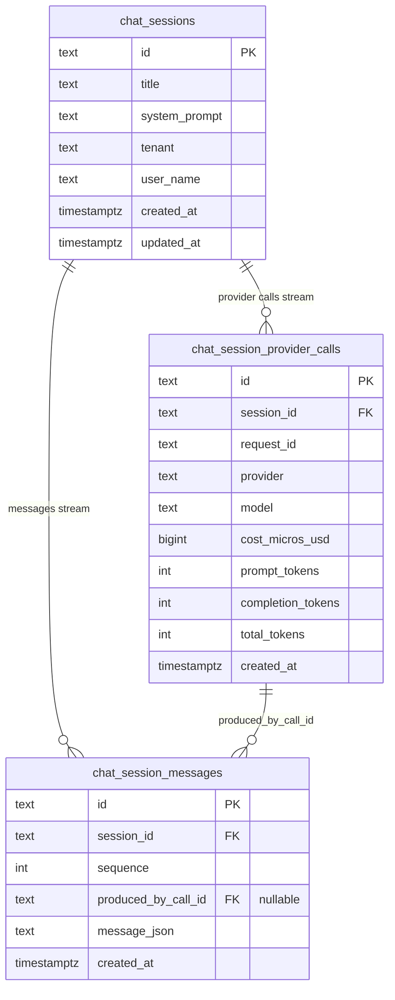

# Chat sessions

Hecate's chat-session subsystem stores operator conversations against the gateway. It is *not* the agent runtime (see [agent-runtime.md](agent-runtime.md) for the `agent_loop` execution kind, which uses the word "turn" for a different concept). A chat session is a flat append-only conversation with parallel observability records — the operator UI's chat surface uses it; SDK clients hitting `/v1/chat/completions` with a `session_id` use it; the MCP `list_chat_sessions` tool surfaces it.

## Mental model

A chat session has two independent streams:

- **Messages** — the conversation, in order. Every entry is a complete `Message` (role, content, content_blocks, tool_calls, tool_call_id, tool_error). Sequence numbers are monotonic per session and authoritative for ordering.
- **Provider calls** — observability for upstream chat-completion requests. Each call records routing decision (requested vs. resolved provider/model), token usage, and resolved cost.

Messages and provider calls are linked by `produced_by_call_id`: a message's `produced_by_call_id` points at the call that emitted it. Assistant messages always have one; tool messages emitted by a server-side runtime have one; user, system, and client-supplied tool-result messages have an empty `produced_by_call_id`.



The `(session_id, sequence)` pair on `chat_session_messages` is unique — the store assigns sequence numbers inside the same transaction as the insert to keep ordering deterministic across concurrent appends. `produced_by_call_id` is `ON DELETE SET NULL` so a deleted call doesn't drag its messages down with it; sessions cascade-delete both children.

## Why two streams instead of one row per exchange

Hecate previously stored a flat `(user_message, assistant_message)` row per upstream call. That worked for plain chat but broke as soon as a tool loop entered the picture: intermediate `assistant(tool_calls)` and `tool` messages had no place to live, so they were dropped on persistence and the next replay failed with an orphaned `tool_call_id`. Mid-conversation provider switches also lost rich content — Anthropic `thinking` blocks and `tool_error` flags couldn't survive a UI round-trip.

The two-stream model splits two concerns that were conflated:

| Concern | Lives in |
|---|---|
| Conversation state (what the model receives on the next call) | `chat_session_messages` |
| Per-request observability (routing, model, cost, tokens) | `chat_session_provider_calls` |

These have different cardinalities — a server-driven tool loop produces *one* user message and *N* provider calls; a single client-driven call may add several tool-result messages and produce *one* assistant message. The flat exchange row couldn't honor both at once.

## Replay

Replay is a one-line transform: read messages in `sequence` order. There's no special case for tool flows, no inferring of "exchanges," no diff against prior state. The UI does this directly; SDK clients re-emit the history on each call and the gateway diffs against persisted count to figure out which entries are new.


The "new messages this round" calculation in `RecordChatExchange` is:

1. Read current `len(persisted_messages)`.
2. Skip a leading system message if it matches `session.system_prompt` exactly (this was prepended by `applySessionSystemPrompt`, not authored by the operator).
3. Take `req.Messages[skip + persistedCount:]` — those are the new client-supplied entries.
4. Append them with empty `produced_by_call_id`, then append the assistant response with `produced_by_call_id = call.id`.

This handles three flows uniformly: first-turn, multi-turn replay, and tool-loop continuation (where the new entries include tool-result messages).

## Wire shape

`GET /v1/chat/sessions/{id}` returns:

```json
{
  "object": "chat_session",
  "data": {
    "id": "chat_…",
    "title": "…",
    "system_prompt": "…",
    "tenant": "…",
    "user": "…",
    "created_at": "…",
    "updated_at": "…",
    "messages": [
      {
        "id": "msg_…",
        "sequence": 0,
        "role": "user",
        "content": "Say hello.",
        "created_at": "…"
      },
      {
        "id": "msg_…",
        "sequence": 1,
        "produced_by_call_id": "call_…",
        "role": "assistant",
        "content": "Hello.",
        "content_blocks": [
          { "type": "thinking", "thinking": "…", "signature": "…" },
          { "type": "text", "text": "Hello." }
        ],
        "created_at": "…"
      }
    ],
    "provider_calls": [
      {
        "id": "call_…",
        "request_id": "req_…",
        "provider": "anthropic",
        "model": "claude-sonnet-4-…",
        "cost_micros_usd": 1234,
        "cost_usd": "0.001234",
        "prompt_tokens": 12,
        "completion_tokens": 4,
        "total_tokens": 16,
        "created_at": "…"
      }
    ]
  }
}
```

The session-list endpoint (`GET /v1/chat/sessions`) returns a leaner summary per session: `message_count`, `provider_call_count`, and the most-recent call's `last_model` / `last_provider` / `last_cost_usd` / `last_request_id`. It does not include message bodies.

`content_blocks` and `tool_error` are Hecate extensions to the OpenAI-compat `OpenAIChatMessage` shape. They are emitted on session-fetch responses and consumed on inbound chat-completion requests when the UI replays history. SDK clients hitting the public `/v1/chat/completions` proxy don't need to know about them — the fields are `omitempty` on the wire and the canonical `Message` is the lingua franca either way.

## Storage backends

Three implementations, same `Store` interface (`internal/chatstate/store.go`):

| Backend | When | Notes |
|---|---|---|
| `memory` | tests, `--memory` mode | In-process, ephemeral; mutex-serialized. |
| `sqlite` | `--sqlite-path …`, default in the docker image | WAL journal, `foreign_keys = ON`, `BEGIN IMMEDIATE`-style transactions for `AppendExchange`. |
| `postgres` | production | Per-session `BEGIN/COMMIT` for `AppendExchange`. |

Schema migration on upgrade drops the old `chat_session_turns` table — turn rows are not migrated forward. Session metadata (title, system_prompt, tenant, user_name, timestamps) survives the upgrade. Operators with stored conversation history they want to keep should export before upgrading; this is a one-way break.

## Code map

- `pkg/types/chat.go` — `ChatSession`, `ChatSessionMessage`, `ChatProviderCall`, the canonical `Message` type with `ContentBlocks` and `ToolError`.
- `internal/chatstate/` — `Store` interface plus three implementations (`MemoryStore`, `PostgresStore`, `SQLiteStore`). `AppendExchange` is the canonical write; it assigns sequence numbers and writes both streams in one transaction.
- `internal/gateway/service.go` — `RecordChatExchange` decides which inbound messages are "new this round" and constructs the `ChatProviderCall` from response metadata.
- `internal/api/openai.go` — `OpenAIChatMessage` extension fields (`content_blocks`, `tool_error`); `ChatSessionMessageItem` and `ChatProviderCallItem` are the wire shape for session-fetch.
- `internal/api/handler_sessions.go` — render functions for list / get / create / update / delete.
- `ui/src/types/runtime.ts` — TS mirrors (`ChatSessionRecord`, `ChatSessionMessageRecord`, `ChatProviderCallRecord`).
- `ui/src/app/useRuntimeConsole.ts` — `buildMessagesForSubmission` flattens persisted messages for replay; `submitChat` performs the optimistic insert + post-response patch.
- `ui/src/features/chats/ChatView.tsx` — message-by-message rendering; per-assistant-message cost / token strip looked up via `produced_by_call_id`.
