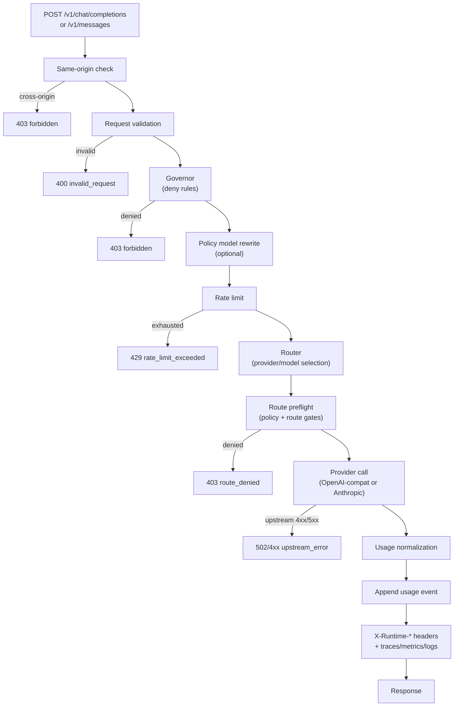
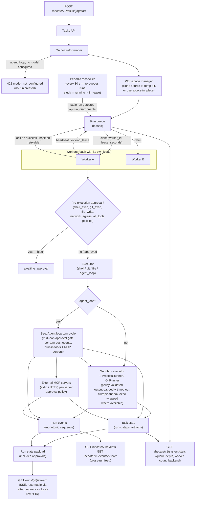
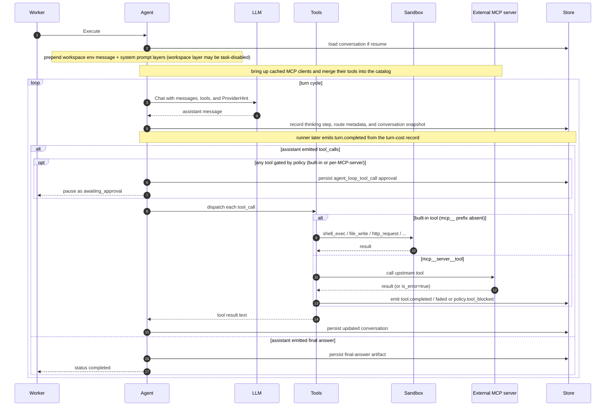

# Architecture

Hecate splits cleanly into two concurrent surfaces: a **gateway** for OpenAI- and Anthropic-shaped client traffic, and a **task runtime** for queued agent work. Both are served from the same gateway process on the same port, but the request paths are independent — you can use either in isolation, or both side-by-side.

> Contributing here? Start at [`AGENTS.md`](../../AGENTS.md) for the codebase map and runtime invariants; conventions, workflow, and verification ladders live under [`docs-ai/`](../../docs-ai/README.md).

## Contents

- [Gateway request flow](#gateway-request-flow)
- [Task runtime flow](#task-runtime-flow)
- [What the orchestrator owns](#what-the-orchestrator-owns)
- [Agent loop turn cycle](#agent-loop-turn-cycle)
- [Storage tiers](#storage-tiers)
- [Why two flows share one gateway](#why-two-flows-share-one-gateway)

## Gateway request flow

Every chat / messages call goes through the same pipeline. Each gate can short-circuit the request — policy, route, and rate-limit failures never spend upstream tokens. Errors produce a fixed status code per gate so client SDKs can handle them deterministically.

Key invariants:

- **Local operator boundary.** Hecate defaults to `127.0.0.1:8765` and rejects cross-origin browser requests. That same-origin check is browser protection, not a network security boundary. If you bind the gateway beyond the local machine, put your own access controls, firewall, or reverse proxy in front.
- **Policy can deny without an upstream call.** Deny rules, provider/model
  allowlists, route mode, and rate limits fail before provider tokens are spent.
- **Usage events are append-only.** Hecate records tokens and known/reported
  cost for operator visibility, but it does not enforce a global spend gate.

## Task runtime flow

Tasks are durable: a run survives process restarts, can be resumed from a terminal state, and is leased to one worker at a time so two replicas can share a queue without stepping on each other.

Key invariants:

- **Workspace before queue.** Every run has a workspace before a worker can claim it. Default is an isolated clone of `task.WorkingDirectory` (or `task.Repo`) under `${TMPDIR}/hecate-workspaces/<task_id>/<run_id>`; opt in to `workspace_mode=in_place` to run directly in the source. The sandbox `AllowedRoot` is the workspace path either way.
- **Lease before work.** A worker doesn't see a `task_run` until it has claimed a lease; if it crashes, the lease expires and another worker can pick the run up. Pinned by `HECATE_TASK_QUEUE_LEASE_SECONDS`.
- **Workspace IO goes through WorkspaceFS.** Hecate-mediated file, search, and write tools resolve paths through `internal/workspacefs` before touching the filesystem. That shared resolver keeps traversal and symlink checks in one place instead of duplicating them across tools.
- **Shell execution goes through the sandbox and ProcessRunner.** The sandbox layer validates policy, sanitises the environment, prepares the optional OS isolation wrapper (`bwrap` / `sandbox-exec`) where available, then `internal/processrunner` starts the child process with bounded cwd, timeout, streaming output, and output caps.
- **Git helpers go through GitRunner.** Hecate-owned Git helpers (`git_status`, `git_diff`, workspace setup, change review) use `internal/gitrunner` rather than ad hoc shell commands. GitRunner validates the workspace directory and dispatches Git through the controlled process path with a sanitised environment. Agent-loop structured reads use an immutable temporary gitdir containing only safe core settings plus snapshotted HEAD/ref/info metadata; the source config is never reloaded by the actual status/diff process. A workspace nested inside a checkout is resolved against the true repository top-level while status/diff pathspecs and returned paths remain scoped to that workspace. Optional locks, lazy fetch, fsmonitor, global/system config and attributes, and recursion are disabled; bounded NUL-safe effective-attribute resolution fails closed when a scoped path has a content-conversion filter; and the OS wrapper supplies a read-only root plus network isolation where available. The broad `git_exec` tool still goes through the sandbox command executor because it intentionally accepts a shell-shaped Git subcommand string.
- **Execution remains per-call.** There is no separate sandbox daemon — the safety properties are applied inline for each Hecate-owned call. Container/chroot/VM-level isolation is not provided. See [`sandbox.md`](../runtime/sandbox.md) for the full isolation-layer model.
- **Approvals are blocking and come in two flavors.** Pre-execution approval (shell/git/file kinds, or `sandbox_network=true`) halts the run at `awaiting_approval` before the executor runs. Mid-loop approval (`agent_loop_tool_call`, see below) halts an `agent_loop` run after a turn produced a gated tool call. Both resolve via `POST /approvals/{id}/resolve`.
- **Events are appended, not mutated.** Every step transition writes a `run_event` with a monotonic sequence number. The SSE stream replays from `after_sequence=N` or `Last-Event-ID`, so a disconnected client can re-join exactly where it left off. Each state payload carries the run's approvals so the operator UI's banner stays in sync without a separate refetch. The full catalog of event types and their payload shapes lives in [`events.md`](../runtime/events.md).
- **Resume creates a new attempt.** A resumed run gets a fresh `run_id`; the original run stays terminal. The new run reuses the prior workspace so file state carries forward, gets the prior checkpoint context in step input, and inherits the chain's cumulative cost via `PriorCostMicrosUSD` so the per-task ceiling holds across the full chain.

## What the orchestrator owns

`internal/orchestrator/` is the task-runtime coordinator. It is not the
provider router and it is not a separate daemon; it is the in-process boundary
that turns task API requests into durable work.

The orchestrator owns:

- workspace preparation before a run is queued
- run creation, queueing, leases, worker heartbeats, retries, resumes, and stale-run reconciliation
- executor dispatch for `shell`, `git`, `file`, and `agent_loop`
- blocking task approvals and the transition back to the queue after approval
- run events, steps, artifacts, stdout/stderr capture, final-answer artifacts, and trace correlation

The orchestrator does **not** own OpenAI/Anthropic request routing for normal
chat traffic, and it does not own external-agent adapter runtimes such as Codex,
Claude Code, Cursor Agent, or Grok Build. Those external adapters are supervised by Agent
Chat and run as their own processes in the selected workspace. Task-runtime
`agent_loop` work is the path that uses the orchestrator, task approvals,
workspace manager, and sandbox boundary described here.

## Agent loop turn cycle

When an `agent_loop` run executes, the worker drives the LLM through a tool-using loop. Each turn round-trips the model, optionally pauses for approval, dispatches tools, and persists the conversation. See [`agent-runtime.md`](../runtime/agent-runtime.md) for the detailed contract.

Three runtime invariants worth pinning (full mechanics in [`agent-runtime.md`](../runtime/agent-runtime.md)):

- **Workspace environment system message.** The loop prepends a machine-generated system message naming the workspace path so the model uses the cloned cwd. See [`agent-runtime.md#workspace-environment-system-message`](../runtime/agent-runtime.md#workspace-environment-system-message) for the wire shape and rationale.
- **Provider hint.** `ChatRequest.Scope.ProviderHint` is set from `run.Provider` (mirrored from `task.RequestedProvider`), so the operator's pinned provider actually routes — no fallback to the default for generic model ids.
- **Resolved route survives streaming.** Streaming and non-streaming agent turns both copy the resolved provider, provider kind, and model back onto the run result, so task detail and resumes see what actually served the turn.
- **Cost ceiling is task-cumulative.** The per-task `BudgetMicrosUSD` is checked against `priorCost + costSpent` after each turn, where `priorCost` includes every prior run in the resume chain. A chain of resumes can't escape the ceiling.

## Storage tiers

Three tiers — `memory`, `sqlite`, and `postgres` — selected globally with
`HECATE_BACKEND`. The bare binary defaults to `memory`; the docker image
defaults to `sqlite` so the container survives restarts. `HECATE_SQLITE_PATH`
configures the shared SQLite client for local durable state, while
`HECATE_POSTGRES_URL` / `DATABASE_URL` configures the shared Postgres client for
hosted/cloud-runtime durable state.

This selector covers Hecate-owned state. Portable Projects coordination is
owned by embedded Cairnline and stored in
`<HECATE_DATA_DIR>/cairnline/embedded/projects.db`; Hecate stores only runtime
overlays such as task/chat references and context snapshots in its configured
backend. Do not introduce a second Hecate Projects authority or dual-write
mirror.

The full storage reference lives in [`docs/operator/deployment.md`](../operator/deployment.md#storage-backend). Implementation notes worth pinning here:

- SQLite uses the pure-Go `modernc.org/sqlite` driver — no CGO, no native extensions.
- Postgres uses `pgx` through `database/sql`; shared SQL stores keep `?`
  placeholders and the storage layer rebinds them to `$N`.
- The SQLite task queue uses `BEGIN IMMEDIATE` plus `UPDATE … RETURNING` for
  atomic claim under WAL. The Postgres queue uses `FOR UPDATE SKIP LOCKED`.
  Both are race-tested; the opt-in Postgres smoke covers real dialect behavior.

## Why two flows share one gateway

The shared deployment is deliberate. An operator who only needs LLM-gateway features still gets the task runtime endpoints (returning empty lists) without configuring anything; an operator who runs agent tasks shares the same observability and usage-event stream with the model traffic. There is no separate "task daemon" to deploy.
