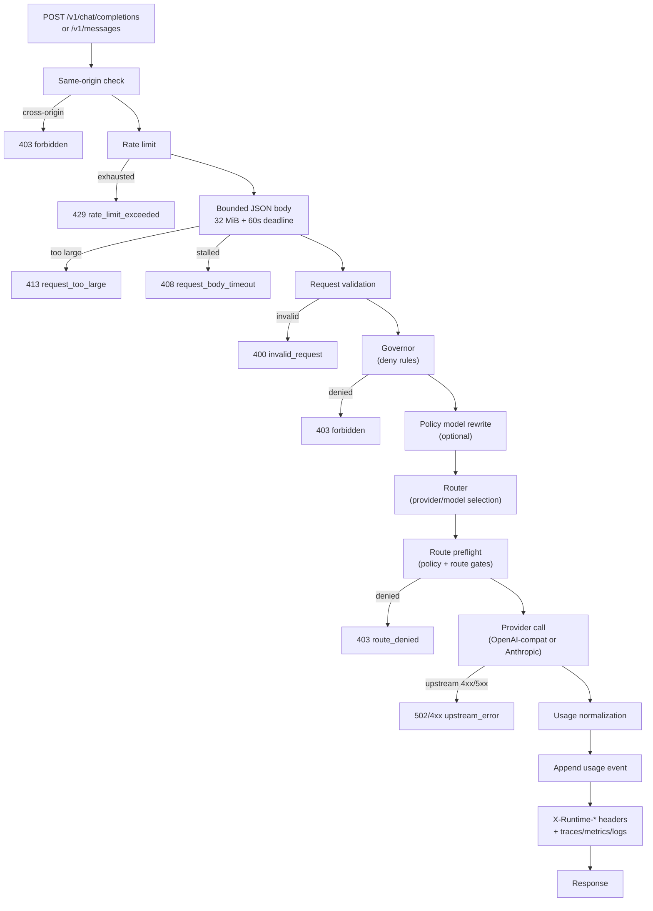
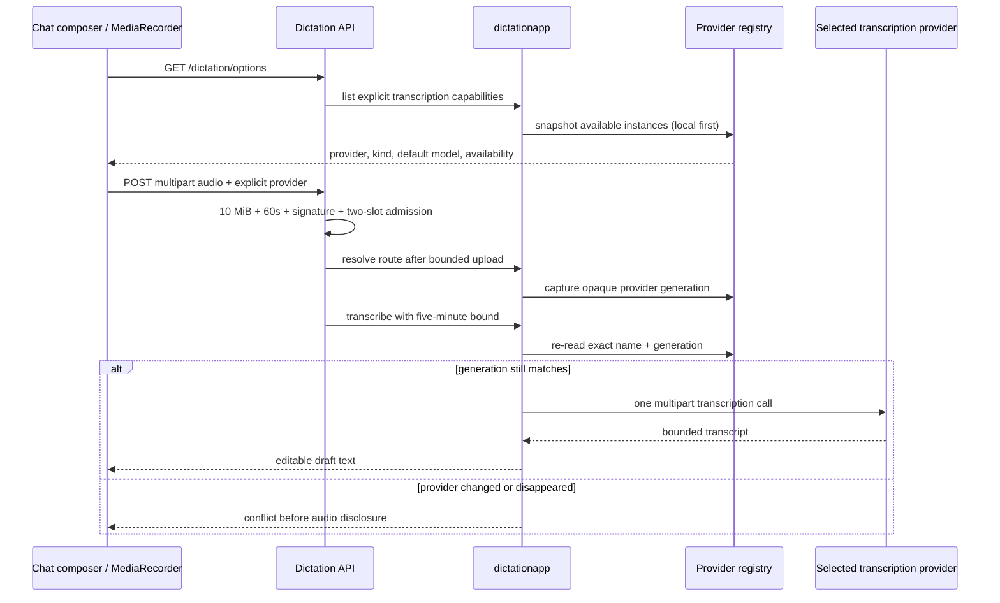
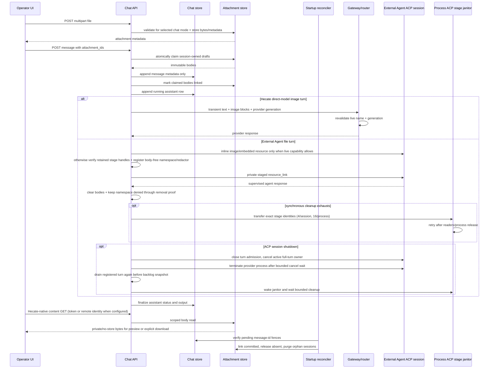
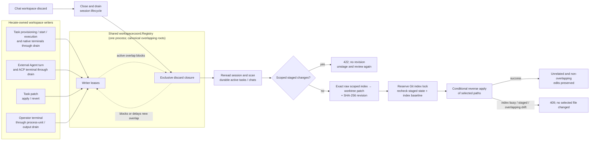
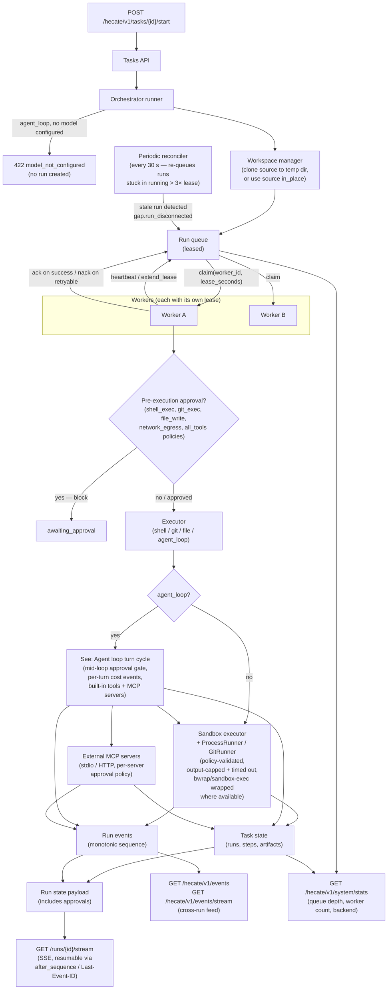
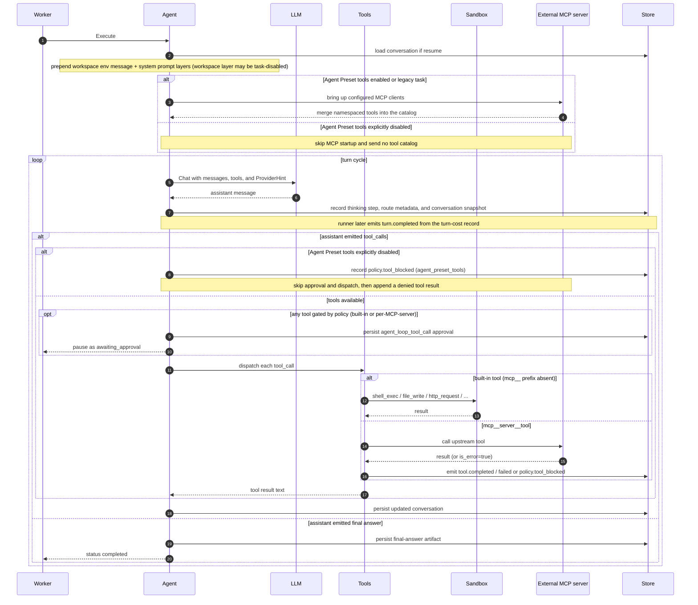

# Architecture

Hecate splits cleanly into two concurrent surfaces: a **gateway** for OpenAI- and Anthropic-shaped client traffic, and a **task runtime** for queued agent work. Both are served from the same gateway process on the same port, but the request paths are independent — you can use either in isolation, or both side-by-side.

> Contributing here? Start at [`AGENTS.md`](../../AGENTS.md) for the codebase map and runtime invariants; conventions, workflow, and verification ladders live under [`docs-ai/`](../../docs-ai/README.md).

## Contents

- [Gateway request flow](#gateway-request-flow)
- [Dictation flow](#dictation-flow)
- [Chat attachment flow](#chat-attachment-flow)
- [Workspace mutation coordination](#workspace-mutation-coordination)
- [Task runtime flow](#task-runtime-flow)
- [What the orchestrator owns](#what-the-orchestrator-owns)
- [Agent loop turn cycle](#agent-loop-turn-cycle)
- [Storage tiers](#storage-tiers)
- [Why two flows share one gateway](#why-two-flows-share-one-gateway)

## Gateway request flow

Every chat / messages call goes through the same pipeline. Each gate can short-circuit the request — policy, route, and rate-limit failures never spend upstream tokens. Errors produce a fixed status code per gate so client SDKs can handle them deterministically.

Key invariants:

- **Local operator boundary.** Hecate defaults to `127.0.0.1:8765` and rejects cross-origin browser requests. That same-origin check is browser protection, not a network security boundary. If you bind the gateway beyond the local machine, put your own access controls, firewall, or reverse proxy in front.
- **Policy can deny without an upstream call.** Deny rules, provider/model
  allowlists, route mode, and rate limits fail before provider tokens are spent.
- **Compatibility ingress is bounded.** Chat Completions and Messages accept one
  JSON value up to 32 MiB and apply a route-local 60-second body-read deadline.
  Long-lived response streams do not inherit a global server timeout.
- **Usage events are append-only.** Hecate records tokens and known/reported
  cost for operator visibility, but it does not enforce a global spend gate.

## Dictation flow

Dictation is a narrow Hecate-native application seam, not a chat-router mode.
The browser records audio, the API owns binary admission and media validation,
`dictationapp` owns provider selection and the exact-instance disclosure fence,
and the provider adapter owns the OpenAI-compatible multipart call. No chat
handler or provider failover path receives the audio.

Audio and transcript bodies are transient and must not enter Hecate storage,
usage events, traces, metrics, logs, or artifacts. Provider configuration
fingerprints include the transcription path and default model but exclude
credentials. The UI stops microphone tracks on stop/unmount/chat switch,
inserts returned text at the current selection, and never submits it.

## Chat attachment flow

Chat attachments deliberately split durable binary storage from durable
transcript metadata. The staged upload is session-owned but does not create a
message. A direct-model or External Agent send references attachment ids; Hecate atomically claims
the immutable bodies against concurrent deletion, stores only metadata on the
user message, and links the bodies after that append. Direct-model turns create
canonical image content blocks transiently for the normal gateway/router path.
External Agent turns resolve live ACP capabilities and otherwise fall back to a
private staged resource link; non-image file bytes are never rendered inline by
the operator UI. A failure before
the transcript append releases the claim. Each claim is fenced by the intended
user-message id, so an ambiguous append result can be resolved against the
authoritative transcript without making a committed image deletable.

External Agent attachment blocks are resolved from the live ACP Initialize
capabilities at dispatch. A supported raster may use `image`; an embedded
`resource` requires explicit context support. The baseline `resource_link`
points to one exact read-only file in a private per-turn staging directory.
ACP filesystem callbacks can read only that path while the turn is live, and
Hecate attempts to remove the staging directory when `session/prompt` settles.
Darwin/Linux creation and removal stay relative to retained directory handles.
Darwin requires local mounts, while Linux restricts every verified handle to a
mode-bit/POSIX-ACL filesystem allowlist. On Windows, Hecate supplies the
protected owner/DACL in its relative directory create, then uses
non-inheritable DACLs for the sealed and cleanup states because every child has
an explicit protected DACL. All implementations verify the
parent/ancestor/stage/child identity before dispatch. Cleanup clears body
references and quarantines the retained stage under a fresh random
parent-relative name. Windows re-verifies the child identities, then closes
Hecate's retained child handles immediately before quarantine because the OS
does not rename directories with open descendants. Cleanup retries the complete
quarantine/prepare/remove transition. A body-free namespace fence outlives the
turn and denies original and quarantine paths until removal proof. Body-free
callback comparison covers absolute, file-URI, and workspace-relative spellings
under lexical and canonical roots. Reads and writes retain the shared fence
through the complete WorkspaceFS fallback; cleanup registers one stable pending
quarantine alias under the exclusive fence before rename. Body-free alias
redactors remain session-owned after proof so delayed approvals, command/config
updates, and direct config-write responses cannot repersist a disclosed path.
They remove complete aliases and ordinary accumulated chunking from output,
approvals, command/config display metadata, errors, and late terminal previews;
entries are dropped rather than
mutating protocol identifiers or values, and unsanitized typed-control and
staged-turn raw diagnostics are withheld. This is not DLP against a selected
agent deliberately transforming or segmenting a path. If every cleanup attempt
fails, the turn reports an error and preserves the protected identity for retry. This
stage is not a same-OS-user isolation boundary; another operator-owned process
may change owner-controlled modes or DACLs or inspect a discovered path.

Hecate attachment turns set an explicit internal image-input requirement. The
router admits only an initial route with explicit support; unknown support is
not permission. Once image bytes are hydrated, cross-provider failover is
disabled, while retries may repeat the request on that same provider. A
provider-bound request requires the exact canonical runtime name and opaque
provider generation to remain configured. The router carries the generation
from its catalog snapshot and the executor compares it with the live registry
immediately before dispatch. Removal, alias reassignment, or replacement by a
different endpoint/account under the same name fails instead of retargeting the
bytes. Managed-provider generations are derived only from non-secret
control-plane generation/configuration data; unknown providers receive a
process-scoped fence. Legacy or missing generations are not eligible for
historical image hydration, and the fence is never rendered into public API or
telemetry data. Failed calls retain the attempted provider/model/generation and
trace correlation internally when an upstream received the request.
Attachment-bearing user rows receive that generation only from attempted-call
metadata; failures before the provider call leave it empty and therefore cannot
make the stored bytes eligible for later history replay.
Historical bytes are rehydrated only when the active configured provider name
and generation are the ones recorded on the original turn; legacy rows,
provider switches, recreated runtime-only providers, and unresolved Auto
boundaries receive an omission marker instead. Provider-compatible `/v1`
requests do not set this Hecate runtime requirement, so rich-content
passthrough remains available for custom providers with incomplete discovery
metadata. Compatibility requests with image blocks still disable
cross-provider failover, while allowing same-provider retries. Their selected
provider instance is revalidated immediately before both non-streaming and
streaming dispatch, and their encoded JSON bodies remain subject to the 32 MiB
/ 60-second ingress boundary.
Binary bodies must not enter transcript JSON, SSE, traces, logs,
metrics, or client-side persisted queues.
Hecate gates the ACP receive loop until a structural SDK diagnostic logger is
installed. SDK records retain only fixed event names and bounded queue counters;
peer-controlled protocol lines, identifiers, methods, and error values are
discarded before they can reach local or exported logs, including outside file
turns. Native close/delete RPC failures retain only a fixed classification and
numeric code. Session-owned alias redactors sanitize delayed approvals, typed
command/config updates, and direct config-write responses even after cleanup
proof, drop entries whose protocol identifiers or values would change, and
suppress original typed-update raw records. A body-free deny
set covers every original and quarantine stage namespace until handle-bound
removal proof, including across later turns. The bounded adapter stderr capture
exists only for startup failures; a successful initial session/model/config
setup zeroes and disables that sink before prompt dispatch.

## Workspace mutation coordination

Chat workspace discard crosses the Chat, task-runtime, External Agent, patch,
terminal, and Git boundaries. API composition creates one
`workspacecoord.Registry` and shares it with every Hecate-owned writer in the
process. The registry resolves workspace aliases to canonical paths and treats
equal and ancestor/descendant roots as overlapping; sibling roots remain
independent.

The discard path closes and drains the owning `agentChatLive` lifecycle before
it tries the workspace closure, then rereads durable state after both admission
domains are closed. A complete task-run scan catches queued or recovered
non-terminal work that is not represented by a currently executing writer
lease; the chat scan catches another active session on the same overlapping
root. With those checks held, GitRunner checks the scoped index before issuing
authority. Any staged-only or mixed staged/unstaged change returns
`422 invalid_request` without a revision; the operator must unstage and review
again. This prevents a staged-only workspace from appearing clean and prevents
mixed state from authorizing only its visible layer. When no scoped staged
change exists, GitRunner recaptures the complete raw unstaged tracked patch
(index → worktree) through its passive view and compares the exact revision the
operator reviewed. Untracked files are outside this discard contract. Selected
changes are removed by reverse-applying those patch bytes, not by restoring a
path from `HEAD` or generating a new mutation patch.

The registry is deliberately process-local. It does not exclude another Hecate
replica or an external editor. Before mutation, GitRunner additionally reserves
Git's conventional index lock, rechecks staged state, and proves that the
reviewed patch's old side still applies to the live index baseline. This
excludes cooperating Git index writers but not direct filesystem or
non-cooperating index writes. A committed baseline change or overlapping later
worktree edit makes the entire selected operation return `409`, while unrelated
and non-overlapping edits survive. The durable scan, transient index
reservation, and conditional apply reduce different risks; none should be
removed or described as distributed atomic coordination.

## Task runtime flow

Tasks are durable: a run survives process restarts, can be resumed from a terminal state, and is leased to one worker at a time so two replicas can share a queue without stepping on each other.

Key invariants:

- **Workspace before queue.** Every run has a workspace before a worker can claim it. Default is an isolated clone of `task.WorkingDirectory` (or `task.Repo`) under `${TMPDIR}/hecate-workspaces/<task_id>/<run_id>`; opt in to `workspace_mode=in_place` to run directly in the source. A Hecate Chat task segment may carry internal `WorkspaceReuse` only when its working directory matches the prior durable run workspace, preserving dirty managed work without changing the session's managed posture. The sandbox `AllowedRoot` is the workspace path in every case.
- **Lease before work.** A worker doesn't see a `task_run` until it has claimed a lease; if it crashes, the lease expires and another worker can pick the run up. Pinned by `HECATE_TASK_QUEUE_LEASE_SECONDS`.
- **Workspace IO goes through WorkspaceFS.** Hecate-mediated file, search, and write tools resolve paths through `internal/workspacefs` before touching the filesystem. That shared resolver keeps traversal and symlink checks in one place instead of duplicating them across tools.
- **Shell execution goes through the sandbox and ProcessRunner.** The sandbox layer validates policy, sanitises the environment, prepares the optional OS isolation wrapper (`bwrap` / `sandbox-exec`) where available, then `internal/processrunner` starts the child process with bounded cwd, timeout, streaming output, and output caps.
- **Git helpers go through GitRunner.** Hecate-owned Git helpers (`git_status`, `git_diff`, workspace setup, change review) use `internal/gitrunner` rather than ad hoc shell commands. GitRunner validates the workspace directory and dispatches Git through the controlled process path with a sanitised environment. Agent-loop structured reads use an immutable temporary gitdir containing only safe core settings plus snapshotted HEAD/ref/info metadata; the source config is never reloaded by the actual status/diff process. A workspace nested inside a checkout is resolved against the true repository top-level while status/diff pathspecs and returned paths remain scoped to that workspace. Optional locks, lazy fetch, fsmonitor, global/system config and attributes, and recursion are disabled; bounded NUL-safe effective-attribute resolution fails closed when a scoped path has an effective or ambiguous content-conversion filter; and the OS wrapper supplies a read-only root plus network isolation where available. The broad `git_exec` tool still goes through the sandbox command executor because it intentionally accepts a shell-shaped Git subcommand string.
- **Execution remains per-call.** There is no separate sandbox daemon — the safety properties are applied inline for each Hecate-owned call. Container/chroot/VM-level isolation is not provided. See [`sandbox.md`](../runtime/sandbox.md) for the full isolation-layer model.
- **Approvals are blocking and come in two flavors.** Pre-execution approval (shell/git/file kinds, or `sandbox_network=true`) halts the run at `awaiting_approval` before the executor runs. An `agent_loop` task whose Agent Preset snapshot explicitly disables tools skips the network gate because it has no executable network capability to approve. Mid-loop approval (`agent_loop_tool_call`, see below) halts an `agent_loop` run after a turn produced a gated tool call. Both resolve via `POST /approvals/{id}/resolve`.
- **Events are appended, not mutated.** Every step transition writes a `run_event` with a monotonic sequence number. The SSE stream replays from `after_sequence=N` or `Last-Event-ID`, so a disconnected client can re-join exactly where it left off. Each state payload carries the run's approvals so the operator UI's banner stays in sync without a separate refetch. The full catalog of event types and their payload shapes lives in [`events.md`](../runtime/events.md).
- **Resume creates a new attempt.** A resumed run gets a fresh `run_id`; the original run stays terminal. The new run reuses the prior workspace so file state carries forward, gets the prior checkpoint context in step input, and inherits the chain's cumulative cost via `PriorCostMicrosUSD` so the per-task ceiling holds across the full chain.

## What the orchestrator owns

`internal/orchestrator/` is the task-runtime coordinator. It is not the
provider router and it is not a separate daemon; it is the in-process boundary
that turns task API requests into durable work.

The orchestrator owns:

- workspace preparation before a run is queued
- process-local workspace writer admission during durable run start and for the
  complete execution attempt, using the registry shared with destructive
  workspace mutations
- per-handle native-terminal writer admission through process-unit and output
  drain, including while a same-run approval is pending and during shutdown
- run creation, queueing, leases, worker heartbeats, retries, resumes, and stale-run reconciliation
- executor dispatch for `shell`, `git`, `file`, and `agent_loop`
- blocking task approvals and the transition back to the queue after approval
- run events, steps, artifacts, stdout/stderr capture, final-answer artifacts, and trace correlation

The orchestrator does **not** own OpenAI/Anthropic request routing for normal
chat traffic, and it does not own external-agent adapter runtimes such as Codex,
Claude Code, Cursor Agent, or Grok Build. Those external adapters are supervised by Agent
Chat and run as their own processes in the selected workspace. Task-runtime
`agent_loop` work is the path that uses the orchestrator, task approvals,
workspace manager, and sandbox boundary described here.

## Agent loop turn cycle

When an `agent_loop` run executes, the worker drives the LLM through a tool-using loop. Each turn round-trips the model, optionally pauses for approval, dispatches tools, and persists the conversation. See [`agent-runtime.md`](../runtime/agent-runtime.md) for the detailed contract.

Three runtime invariants worth pinning (full mechanics in [`agent-runtime.md`](../runtime/agent-runtime.md)):

- **Workspace environment system message.** The loop prepends a machine-generated system message naming the workspace path so the model uses the cloned cwd. See [`agent-runtime.md#workspace-environment-system-message`](../runtime/agent-runtime.md#workspace-environment-system-message) for the wire shape and rationale.
- **Provider hint.** `ChatRequest.Scope.ProviderHint` is set from `run.Provider` (mirrored from `task.RequestedProvider`), so the operator's pinned provider actually routes — no fallback to the default for generic model ids.
- **Resolved route survives streaming.** Streaming and non-streaming agent turns both copy the resolved provider, provider kind, and model back onto the run result, so task detail and resumes see what actually served the turn.
- **Cost ceiling is task-cumulative.** The per-task `BudgetMicrosUSD` is checked against `priorCost + costSpent` after each turn, where `priorCost` includes every prior run in the resume chain. A chain of resumes can't escape the ceiling.

## Storage tiers

Three tiers — `memory`, `sqlite`, and `postgres` — selected globally with
`HECATE_BACKEND`. The bare binary defaults to `memory`; the docker image
defaults to `sqlite` so the container survives restarts. `HECATE_SQLITE_PATH`
configures the shared SQLite client for local durable state, while
`HECATE_POSTGRES_URL` / `DATABASE_URL` configures the shared Postgres client for
hosted/cloud-runtime durable state.

This selector covers Hecate-owned state. Portable Projects coordination is
owned by embedded Cairnline and stored in
`<HECATE_DATA_DIR>/cairnline/embedded/projects.db`; Hecate stores only runtime
overlays such as task/chat references and context snapshots in its configured
backend. Do not introduce a second Hecate Projects authority or dual-write
mirror.

Project facade mutations use a process-local, project-keyed fence in the API
composition layer. It does not persist coordination state or replace
Cairnline. Ordinary mutations are shared admissions. A Cairnline-authoritative
delete closes its key, waits for admitted mutations, and holds the closure
through Hecate-owned cleanup and a project-scoped rollback import; new
same-project mutations fail with a conflict while different projects remain
concurrent. A delete acquires the process-wide destructive-state closure before
closing its project key. A multi-project mutation declares its full scope up
front; the gate normalizes and sorts that set and admits every key atomically.
Nested calls reuse any subset of the context-carried lease, while incremental
expansion is rejected to avoid cross-project lock cycles. Pathless Project
Assistant draft/propose/apply routes derive the full typed action scope before
writing, add the existing project of a moved chat, and retain the lease through
proposal ledgers, compatibility mirrors, and the response decision. The first
typed action scope is validated and persisted as the proposal record's primary
project.
Project-scoped manual Task creation uses the same composition-layer fence: it
holds the project key across Cairnline-backed existence validation and durable
Hecate Task creation, so same-project deletion wins with a `409` instead of
leaving an execution row linked to deleted coordination intent. This is runtime
admission only; Cairnline remains the project authority.
The existing state, project, chat, and workspace gates are not a runtime-wide
reset protocol: task workers and reconcilers, retention, ACP callbacks, gateway
finalizers, and writer-capable Cairnline opens can all outlive an HTTP request
and repopulate state. The live
`POST /hecate/v1/system/reset-data` endpoint therefore returns `409 conflict`
before mutation. Enabling online reset requires one reversible top-level
quiescer with admission and generation fencing across all of those writers.
This is in-process coordination, not a replica-wide CAS guarantee. Terminal
and idle chat assignment reconciliation uses nonblocking admission because
project deletion may hold the key while it waits for that chat run to clear; a
skipped best-effort projection is retried by later terminal or read
reconciliation.

The full storage reference lives in [`docs/operator/deployment.md`](../operator/deployment.md#storage-backend). Implementation notes worth pinning here:

- SQLite uses the pure-Go `modernc.org/sqlite` driver — no CGO, no native extensions.
- Postgres uses `pgx` through `database/sql`; shared SQL stores keep `?`
  placeholders and the storage layer rebinds them to `$N`.
- Chat attachment bodies follow the chat backend and live in a separate
  session-scoped store; chat message rows persist metadata and digests only.
  Before serving, startup reconciliation resolves durable message-id claim
  fences and performs a metadata-only orphan-session sweep. Exact committed
  metadata links a claim, an absent row releases it, a deleted owner purges all
  bodies, and conflicting metadata remains fenced. This recovery assumes one
  Chat API writer; task queue leases do not make Chat writes active-active.
- Optional queued-message `client_request_id` values live in a session-scoped
  `chat_message_requests` ledger. The ledger stores a SHA-256 payload
  fingerprint rather than request bodies and commits its marker in the same
  transaction as the user transcript row before turn dispatch. Memory,
  SQLite, and Postgres share the same claim/replay/conflict contract; a bounded
  pending-owner lease permits safe runtime replacement without granting
  general active-active Chat mutation semantics. `chatapp` renews the pending
  lease throughout pre-commit admission work at one-third of its stale window
  or faster, then performs one final conditional renewal before the atomic
  commit. A renewal that no longer matches the pending owner token and payload
  fingerprint fails closed before provider, task, or ACP dispatch.
- The SQLite task queue uses `BEGIN IMMEDIATE` plus `UPDATE … RETURNING` for
  atomic claim under WAL. The Postgres queue uses `FOR UPDATE SKIP LOCKED`.
  Both are race-tested; the opt-in Postgres smoke covers real dialect behavior.

## Why two flows share one gateway

The shared deployment is deliberate. An operator who only needs LLM-gateway features still gets the task runtime endpoints (returning empty lists) without configuring anything; an operator who runs agent tasks shares the same observability and usage-event stream with the model traffic. There is no separate "task daemon" to deploy.
