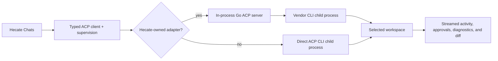

# External Agent Integrations — Accepted Design Record

> **Status:** accepted; partially implemented alpha baseline.
> **Current source of truth:** [External Agents](../../runtime/external-agents.md),
> [Chat sessions](../../runtime/chat-sessions.md), and [Runtime API](../../runtime/runtime-api.md).
> **Next action:** keep improving adapter-specific structured mapping, patch
> review UX, and convergence with task-runtime primitives.

This design record defines how Hecate should let an operator chat with external coding
agents such as Codex CLI, Claude Code, Cursor Agent, Grok Build, and future agent CLIs
without pretending those agents are model providers.

The core distinction:

| Concept          | Examples                                                                                  | What Hecate controls                                                            |
| ---------------- | ----------------------------------------------------------------------------------------- | ------------------------------------------------------------------------------- |
| Model provider   | OpenAI, Anthropic, Ollama, LM Studio                                                      | Request routing, usage reporting, provider health, model choice                 |
| Agent adapter    | Codex ACP, Claude ACP, Cursor Agent ACP, Grok Build ACP, future ACP-capable coding agents | Process lifecycle, workspace, prompt/session flow, output capture, diff capture |
| Protocol adapter | ACP, MCP, OpenAI-compatible HTTP, Anthropic Messages                                      | How another system talks to or from Hecate                                      |

Providers answer LLM calls. Agent adapters drive coding-agent loops.

## Problem

Hecate already has two strong surfaces:

- **Chats** — model/provider conversations routed through the gateway.
- **Tasks** — durable agent/runtime work with approvals, events, artifacts, and
  workspace state.

Using Hecate with Codex, Claude Code, Cursor Agent, or Grok Build belongs in
Chats as an External Agent Turn. It is conversation-first like every other Chat
Turn while exposing runtime-aware activity where useful; it is not a third
top-level product shape beside Chats and Tasks. A user wants to type in Hecate
and get a response from an external coding agent while Hecate still records what
happened, captures output, and eventually shows diffs and later artifacts.

Putting Codex, Claude Code, Cursor Agent, or Grok Build in the provider/model dropdown would be wrong:

- They are full agents, not models.
- They carry their own tool loop and permission model.
- They may own their own credentials and provider routing.
- Their costs may be externally managed or opaque to Hecate.

## Goals

- Add a product and backend seam for **External Agent Turns** inside Chats,
  alongside Hecate-owned direct-model and task-backed Turns.
- Support Codex, Claude, Cursor Agent, and Grok Build through ACP-capable adapters first.
- Keep provider/model routing unchanged.
- Let Hecate supervise External Agent Turn and session lifecycles: start or
  restore sessions, stream/cancel/timeout Turns, and capture process exit status.
- Store enough turn/session state that UI and future clients can replay the
  conversation.
- Capture ACP updates as runtime output first, then richer structured events as
  the adapter surface matures.
- Normalize ACP output into readable transcript text without discarding the raw
  diagnostic stream needed for future debugging.
- Capture workspace diff after a turn when the workspace is a Git repo.
- Use ACP for outbound external-agent sessions when an adapter is available.

## Non-goals

- Do not make Codex, Claude Code, Cursor Agent, or Grok Build fake providers.
- Do not add a second one-shot CLI compatibility layer while the project is
  still alpha.
- Do not claim exact cost accounting for external agents until the adapter can
  report it.
- Do not build a plugin marketplace or broad agent-runtime SDK yet.
- Do not support remote multi-user agent sessions in this design record.

## Recommended Shape

Start with **ACP session adapters**.



The implementation keeps one adapter runtime and one native ACP session alive
per External Agent chat session. Hecate-owned adapter servers run in-process;
their provider CLIs remain supervised child processes. Direct ACP CLIs run as
supervised child processes. Each prompt becomes the next ACP turn in the same
typed client contract.

## UI Model

Chats exposes one agent picker. `Hecate` is the first option and keeps the
provider/model controls plus the tools toggle for direct model chat vs Hecate
Agent task execution. External adapters are separate agent choices in the same
picker:

```text
Agent: Hecate | Codex | Claude Code | Cursor Agent
Workspace: /path/to/repo
Prompt: message
```

The conversation transcript should remain one surface. Runtime metadata should
show that this response came from an agent adapter, not a provider/model route:

```text
Codex · external agent
Workspace: /Users/.../hecate
Cost: external / unknown
Patch: 3 files changed
```

## Backend Model

The adapter code lives behind `internal/agentadapters/` without coupling to
provider routing or `internal/api` request structs:

```text
internal/agentadapters/
  acp_session.go
  approvals.go
  errors.go
  probe.go
  registry.go
  version.go
```

The current runtime shape is ACP-first:

- `registry.go` declares built-in adapters, direct commands, tested version
  ranges, and lightweight auth hints.
- `probe.go` performs the explicit "can this adapter really start?" check by
  starting the adapter runtime, completing ACP `initialize`, opening a no-op
  session, and classifying the result.
- `acp_session.go` owns the long-lived adapter runtime, native ACP session,
  prompt turns, streaming update normalization, cancellation, shutdown, usage
  updates, raw diagnostics, and Git diff capture.
- `approvals.go` maps ACP `RequestPermission` into Hecate's external-agent
  approval rows, grants, REST/SSE surfaces, and OTel metrics.

API handlers translate HTTP shapes into adapter/session manager calls. The
adapter package remains independent from provider routing: external coding
agents are not model providers, and provider APIs are not threaded into this
path unless a future adapter explicitly opts in.

## API Shape

The shipped alpha shape uses one chat-session API:
`/hecate/v1/chat/sessions/*`. A session is owned by `agent_id`: `hecate` for
Hecate-owned chat, or an external adapter id such as `codex`, `claude_code`, or
`cursor_agent`. Individual messages record the execution mode that produced
them. This replaced the earlier model-vs-agent session-type sketch from this
design record; there is no separate live target selector field.

Implemented MVP endpoints:

```text
GET  /hecate/v1/agent-adapters
POST /hecate/v1/agent-adapters/{id}/probe
GET  /hecate/v1/agent-adapters/{id}/health
GET  /hecate/v1/chat/sessions
POST /hecate/v1/chat/sessions
GET  /hecate/v1/chat/sessions/{id}
GET  /hecate/v1/chat/sessions/{id}/stream
POST /hecate/v1/chat/sessions/{id}/messages
GET  /hecate/v1/chat/sessions/{id}/messages/{message_id}/files
GET  /hecate/v1/chat/sessions/{id}/messages/{message_id}/files/{path}
GET  /hecate/v1/chat/sessions/{id}/workspace-files
GET  /hecate/v1/chat/sessions/{id}/workspace-diff
GET  /hecate/v1/chat/sessions/{id}/workspace-diff/files/{path}
POST /hecate/v1/chat/sessions/{id}/workspace-diff/revert
POST /hecate/v1/chat/sessions/{id}/cancel
DELETE /hecate/v1/chat/sessions/{id}
GET  /hecate/v1/chat/sessions/{id}/approvals
GET  /hecate/v1/chat/sessions/{id}/approvals/{approval_id}
POST /hecate/v1/chat/sessions/{id}/approvals/{approval_id}/resolve
POST /hecate/v1/chat/sessions/{id}/approvals/{approval_id}/cancel
GET  /hecate/v1/chat/grants
DELETE /hecate/v1/chat/grants/{grant_id}
```

The catalog and compatibility health `GET` endpoints are passive: they may
resolve and inspect an executable path but must not execute it. The explicit
`POST /agent-adapters/{id}/probe` endpoint is an optional, disposable
diagnostic boundary that starts a temporary ACP runtime and performs a
handshake without sending a prompt. Its provider-specific version or auth
detection may execute the discovered app. Creating an External Agent chat is
the independent real-session boundary: it resolves the current app and performs
a fresh ACP handshake whether or not a diagnostic ran. Direct ACP peers launch
during that setup. Embedded bridges may run bounded provider discovery during
setup while deferring their prompt-serving vendor invocation and prompt-time
auth result until the first message, which is authoritative for that deferred
work. A cached diagnostic result can explain an earlier failure, but cannot
authorize or block the real session or first-message attempt. Clients refresh
the passive catalog independently after install/path changes or a diagnostic;
only that passive response may update pre-launch availability, status, error,
remote-credential gates, and last-discovered path. Clients may retain
process-derived versions, auth/capability evidence, and launch controls with the
cached diagnostic for troubleshooting.

Stored message diffs are read-only historical evidence. The current
`workspace-diff` response carries an opaque revision for the complete scoped
unstaged tracked patch (index → worktree), and its revision-bound revert
endpoint is the only chat surface allowed to discard workspace files. Staged
index changes and untracked files are outside that authority. A message-scoped
captured diff can be stale and therefore cannot authorize mutation.

Message creation remains a blocking POST while the submitting client stays
connected, and clients can subscribe to the session SSE stream first to receive
partial output while the external process is running. Once the user message and
running assistant are durable, Hecate owns the ACP turn independently of that
POST and stream: a client disconnect ends its waiters but does not cancel the
admitted turn. Explicit Stop, chat close/delete, and runtime shutdown remain
cancellation authorities. The turn timeout instead ends and terminalizes the
turn as failed.

History follows `HECATE_BACKEND`; `sqlite` persists sessions across restarts.
The store also keeps the native ACP session id. An in-flight turn is not resumed
after a gateway restart; startup reconciliation marks its running assistant
interrupted. On the next prompt, Hecate passes the stored native id to the
adapter through ACP `session/load` when the adapter advertises load-session
support; otherwise it creates a fresh native session and keeps the Hecate
transcript intact.

## Adapter Session Behavior

When an External Agent chat session is created:

1. Resolve the provider/runtime command. Codex and Claude Code use Go ACP
   adapter libraries compiled into Hecate and resolve `codex` / `claude`;
   Cursor comes from `cursor-agent acp`, and Grok comes from
   `grok agent ... stdio`.
2. Validate and canonicalize the workspace path.
3. Build a sanitized process environment. Gateway/provider secrets are not
   forwarded by default.
4. Start the ACP runtime. Built-in adapters get an in-memory ACP transport and
   launch provider commands through the host-supplied environment; direct ACP
   agents are supervised child processes in the selected workspace.
5. Complete ACP `initialize` and `session/new`.
6. Store the native ACP session id on the Hecate chat session.

For each prompt in that chat, Hecate:

- Sends the next ACP turn.
- Normalizes ACP updates into transcript text, structured activity records, raw
  diagnostics, usage telemetry, and approval requests.
- Enforces timeout, cancellation, turn ceilings, wall-clock limits, and idle
  cleanup.
- Captures `git diff --stat` and `git diff --binary` onto the assistant message
  when the workspace is a Git repo.

For later prompts in the same External Agent chat session, Hecate reuses the same
adapter runtime and native ACP session. If the gateway restarts and SQLite chat
storage is enabled, Hecate keeps the transcript and saved native session id. On
the next prompt it asks the adapter to load that native session when the adapter
advertises load-session support; otherwise it starts a fresh native ACP session
and keeps the Hecate-side transcript intact.

## Relationship To ACP

Hecate uses ACP as an outbound adapter protocol:

```text
Hecate -> ACP -> Codex / Claude / Cursor Agent
```

The adapter layer lets Hecate talk to ACP-capable external coding agents while
keeping provider routing and Hecate-owned Task Runs separate.

## Observability

External Agent Turns currently have three observability surfaces:

- The per-session SSE stream emits typed `session_update`,
  `approval.requested`, and `approval.resolved` events.
- Assistant messages carry stable Turn metadata (`turn_id`, timestamps, duration,
  trace ids, native session id), structured activity records, raw ACP
  diagnostics, usage updates, and captured diff data.
- OpenTelemetry spans and metrics cover `chat.turn`, adapter probe
  outcomes, approval request/resolve paths, approval timeout/grant counters,
  cancellation reasons, output byte counts, and diff-capture state.

Important attributes include:

- `hecate.agent_adapter.id`
- `hecate.agent_adapter.command`
- `hecate.agent_adapter.driver.kind`
- `hecate.agent_adapter.native_session.id`
- `hecate.chat.session.id`
- `hecate.workspace.path`
- `hecate.chat.turn.id`
- `hecate.agent_adapter.output.bytes`
- `hecate.agent_adapter.diff.captured`

Do not log prompts by default outside existing debug/redaction rules.

## Security And Policy

The External Agent adapter layer is high-risk because it runs third-party CLIs that may
themselves execute tools.

First-version safety rules:

- Require an explicit workspace path.
- Validate and canonicalize the workspace directory before storing a session.
- Use sanitized env by default.
- Do not pass provider API keys unless the adapter config explicitly opts in.
- Enforce timeout and cancellation.
- Capture output with the same output-size limits used by task tools.
- Mark cost as `external` / `unknown` unless the adapter reports structured
  usage.
- Make the UI visibly distinguish external-agent output from provider/model
  output.

Current limitation: external adapters run as trusted subprocesses in the
selected workspace. They are not the same as Hecate task-runtime sandboxed tool
calls. This is intentional for alpha: Codex, Claude Code, Cursor Agent, and Grok Build are
long-lived interactive processes with their own auth, caches, child processes,
and ACP stdio/session lifecycle. Reusing the task-runtime per-call sandbox is
not a drop-in fit.

## Acceptance Criteria For First Implementation

- [x] `GET /hecate/v1/agent-adapters` reports built-in adapter definitions and availability.
- [x] Hecate can run Codex, Claude Code, Cursor Agent, or Grok Build prompts through a supervised ACP session.
- [x] Output is captured and displayed in the UI.
- [x] Raw ACP diagnostics are retained when normalized text hides adapter quirks;
      private resource-link turns withhold them when present because arbitrary
      chunking can expose temporary path fragments.
- [x] Chats show structured activity markers for start/running/output/files-changed/final failure states.
- [x] Timeout marks the turn failed with a stable error.
- [x] Final response and raw output are replayable after refresh, and durable across gateway restarts when SQLite chat sessions are enabled.
- [x] Workspace diff is captured when the workspace is a Git repo.
- [x] Docs clearly state cost is external/unknown for these adapters.
- [x] Streaming output reaches the UI while the process is still running.
- [x] Cancellation signals the ACP turn and marks the Turn and Chat session cancelled.
- [x] Session history is durable across gateway restarts when the chat-session backend is SQLite.
- [x] Adapter readiness can distinguish missing binaries, auth/billing failures, and versions outside Hecate's tested range.
- [x] Operator approvals are prompt-first by default and visible through REST, SSE, Connections grants, and Chats review UI.
- [x] Optional turn, wall-clock, and idle guardrails protect long-lived external-agent sessions.

## Future Enhancements

- Fuller patch review UX: side-by-side hunks, batch selection, and richer
  artifact history. The current Chats UI keeps captured per-turn diffs as
  read-only historical evidence and can discard selected paths only from the
  revision-bound live unstaged tracked workspace patch.
- Deeper adapter-specific structured mappers for ACP tool output. The current
  generic mapper plus raw diagnostics is sufficient for alpha stability.
- Decide which task-runtime primitives External Agent chat should reuse without
  pretending Hecate owns the external agent runtime.

## Open Questions

- Should External Agent chat reuse task-runtime primitives for artifacts, event
  history, retention, and trace correlation while keeping Codex, Claude Code,
  and Cursor as opaque supervised runtimes?
- How much of the external process environment should be configurable by the
  operator?
- Should Hecate eventually offer optional process containment for external
  adapters? Not a near-term requirement. If it happens, it should be a separate
  design for long-lived ACP subprocesses, not reuse of the task-runtime
  per-call sandbox.
- Which adapter-specific ACP update shapes deserve first-class UI mapping next?
