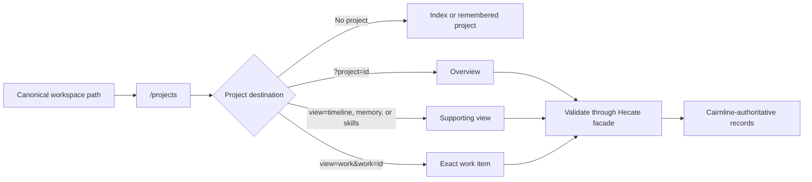

# Projects

> **Status:** accepted; Projects V1 local cockpit substrate implemented.

Current source of truth: [Agent runtime](../../runtime/agent-runtime.md), [Chat sessions](../../runtime/chat-sessions.md), [Architecture](../../contributor/architecture.md)

Projects V1 is the durable local cockpit for project-scoped work: roots,
defaults, memory/context, skills metadata, roles, work items, assignments,
handoffs, reviews, evidence, explicit closeout, activity, and context
inspection. Remaining near-term work should be beta hardening and
dogfood-driven UX polish. Planner / Manager agents, runbooks, browser QA,
automatic memory promotion, skill-body injection, and team project management
should be handled as separate proposals instead of expanding this foundation
document.

## Summary

Hecate should distinguish **Projects** from **Workspaces**.

A project is the durable Hecate identity for a codebase or work area. It owns memory scopes, chat/task grouping, default runtime choices, trusted context sources, and Agent Preset defaults. A workspace is a concrete filesystem root used by one chat, task, run, or external-agent session.

Today Hecate often uses a raw workspace path as both identity and runtime location. That works for early local flows, but it becomes confusing once we add durable memory, imported contexts, multiple checkouts of the same repo, temporary task workspaces, editor-owned workspaces, and future assistant layers.

## Problem

`workspace` currently carries too many meanings:

- The directory where a task or agent is allowed to read/write.
- The UI label for where a chat is happening.
- The implicit scope for memories or instructions.
- The thing future agent runtime presets would likely attach to.
- Sometimes a source checkout, sometimes a temporary clone, sometimes an in-place working tree.

Raw paths are not stable enough to be the durable identity:

- A repo can move on disk.
- The same repo can have multiple clones.
- A task can run in an isolated clone while the user thinks of it as the same project.
- Native app, web, Docker, and editor-owned ACP workspaces can expose different paths for the same logical work.
- Future project memory should not silently split because the path changed.

## Terminology

| Term            | Meaning                                                                                                                                                                               |
| --------------- | ------------------------------------------------------------------------------------------------------------------------------------------------------------------------------------- |
| Project         | Durable Hecate object representing a codebase or work area. Identified by `project_id`. Owns defaults, memories, history grouping, and context sources.                               |
| Workspace       | Concrete filesystem root used for execution. A project can have one or more workspaces over time.                                                                                     |
| Project root    | A saved checkout/workspace path for a project. Roots can represent the main checkout, a linked Git worktree, an editor-owned workspace, or a temporary root.                          |
| Chat            | Conversation attached to an optional project and, when running, a concrete workspace.                                                                                                 |
| Task            | Durable runtime object attached to an optional project and a concrete workspace mode.                                                                                                 |
| Run             | One execution attempt under a task. Runs never define project identity by themselves.                                                                                                 |
| Agent Preset    | Reusable Hecate runtime configuration for Hecate Chat, project assignments, or an external agent: model/adapter hints, tools, memory/source policy, instructions, and safety posture. |
| Runtime profile | Hecate launch/safety posture such as execution profile string, tool/write/network posture, approvals, and adapter options.                                                            |
| Project role    | Responsibility needed by the work, such as architect, implementer, reviewer, researcher, release manager, designer, or operator.                                                      |
| Context packet  | A snapshot of what Hecate assembled for a model/agent call, including project and workspace metadata.                                                                                 |

## Goals

- Add stable project identity independent of raw filesystem paths.
- Make project memory a first-class durable scope.
- Give Hecate Chat, Tasks, and External Agents a shared grouping model.
- Coordinate project-scoped agent teams through roles, assignments, handoffs,
  project activity, and reviewed memory/context without replacing Tasks or
  Chats as execution surfaces.
- Keep workspace modes explicit: in-place, isolated clone, temporary workspace, editor-owned workspace.
- Treat branches and Git worktrees as concrete root metadata, not project
  identity. A project can span the main checkout and linked worktrees while
  preserving one memory/context/work history.
- Let project defaults feed new chats and tasks: provider, model, Agent Preset, tools, command-output compaction, approval posture, workspace mode, and system prompt where applicable.
- Let context assembly use project-level sources: project instructions, selected docs, saved memories, and trusted files.
- Let Hecate Chat and external-agent chats share project memory when their active Agent Preset opts into it.
- Make UI history clearer: “these chats/tasks belong to this project,” not just “these happened under similar-looking paths.”

## Non-goals

- Hosted multi-tenant project management.
- Team permissions, sharing, or organization policy.
- Replacing task workspaces or sandboxing.
- Automatically cloning or syncing repositories.
- Importing private memory from external agents.
- Synchronizing external-agent private memory into Hecate memory.
- Treating a project as a billing/accounting boundary.

## Cairnline Authority

Portable project coordination is implemented by
[Cairnline](https://github.com/hecatehq/cairnline), an agent-neutral local
coordination server embedded in the Hecate process.

Cairnline is authoritative for:

- project identity and optional workspace roots;
- context-source and skill metadata;
- project roles;
- work items and assignments;
- evidence, review, collaboration, and handoff artifacts;
- accepted project memory and memory candidates;
- Project Assistant proposal records.

Hecate remains authoritative for:

- Agent Presets and provider/model/runtime defaults;
- Hecate task and External Agent dispatch;
- approvals, sandboxing, workspace and Git side effects;
- task, run, chat-session, and trace references;
- assignment context snapshots and other project-runtime overlays;
- the operator UI and `/hecate/v1/projects*` facade.

The facade combines Cairnline coordination records with Hecate runtime state.
An assignment expresses coordination intent; it does not authorize Cairnline to
launch an agent or bypass Hecate policy.

The production runtime has one Projects authority. It does not expose a native
coordination backend, backend selector, dual-write mirror, migration route,
rollback route, or sidecar diagnostic control plane. The alpha/dogfood project
records were intentionally not migrated: existing disposable Hecate-native
Projects state may be reset, while new state is created in Cairnline.

The current integration embeds Cairnline and stores its graph at
`<HECATE_DATA_DIR>/cairnline/embedded/projects.db`. A future separately
installed connector may preserve the same Hecate API/UI contract, but it must
not change the authority split or make assignment metadata an execution
permission.

Tests must prove the normal Hecate Projects journey works without native
portable stores: create a project, role, work item, and assignment through the
Hecate facade; launch through Hecate; then inspect Cairnline coordination state
together with Hecate runtime references and context evidence.

## Data Model

Sketch:

```go
type Project struct {
    ID              string // proj_...
    Name            string
    Roots           []ProjectRoot
    ContextSources  []ProjectContextSource
    DefaultRootID   string
    RepoURL         string
    DefaultBranch   string
    DefaultProvider string
    DefaultModel    string
    DefaultAgentPreset string
    SourcePresetID string

    DefaultToolsEnabled      *bool
    DefaultWorkspaceMode     string
    DefaultSystemPrompt      string
    DefaultCompactToolOutput *bool

    CreatedAt    time.Time
    UpdatedAt    time.Time
    LastOpenedAt time.Time
}

type ProjectRoot struct {
    ID        string
    Path      string
    Kind      string // local, git, git_worktree, editor_owned, temporary
    GitRemote string
    GitBranch string
    Active    bool
}

type ProjectContextSource struct {
    ID      string // ctxsrc_...
    Kind    string // doc, policy, memory, external
    Title   string
    Path    string
    Enabled bool
}
```

Rules:

- `project_id` remains optional on chats and tasks; non-project work is valid.
- Operators create projects explicitly and may attach chats, tasks, work items,
  and assignments to them.
- Cairnline stores context-source metadata. Hecate may read bounded portable
  workspace guidance only through an explicit Agent Preset context policy;
  host-specific guidance and skill bodies remain metadata-only.
- Operators can rename projects later.
- Multiple roots can map to one project, but one root should not silently attach to many projects without operator confirmation.
- Git worktrees are roots, not separate projects by default. Root discovery can
  register linked worktrees for visibility, but newly discovered worktree roots
  start inactive so context discovery and assignment launch stay scoped to the
  operator-selected roots.

## API Shape

Proposed Hecate-native endpoints:

```text
GET    /hecate/v1/projects
POST   /hecate/v1/projects
GET    /hecate/v1/projects/{project_id}
PATCH  /hecate/v1/projects/{project_id}
DELETE /hecate/v1/projects/{project_id}
GET    /hecate/v1/projects/{project_id}/activity
```

Chats and tasks should expose project linkage directly:

```json
{
  "id": "chat_...",
  "project_id": "proj_...",
  "workspace": "/Users/me/dev/hecate",
  "workspace_mode": "in_place"
}
```

Project activity is a convenience aggregation over existing chats, tasks, runs, approvals, and usage. It should not replace those canonical APIs.

## Memory Relationship

Project memory should be the default durable memory scope.

Memory layers:

| Layer               | Persistence   | Scope                       | Promotion                    |
| ------------------- | ------------- | --------------------------- | ---------------------------- |
| Global memory       | Durable       | Whole local Hecate instance | Explicit only                |
| Project memory      | Durable       | One `project_id`            | Explicit save from chat/task |
| Chat/session memory | Session-local | One chat/session            | Never auto-promoted          |
| Current context     | Per request   | One model/agent call        | Not memory                   |

This keeps short-lived conversation facts out of project memory unless the
operator explicitly saves them or promotes a pending memory candidate.

Agent Presets decide whether project memory is used for a given agent. For
example, a Hecate Chat preset can inject project memory into the provider
prompt, while a Claude Code preset can send the same project memory only if the
ACP adapter exposes a safe instruction/config surface. If no such surface
exists, Hecate can still show the project memory in the context inspector as
operator-side notes. Those notes are structured project-scoped memory entries
with Markdown-compatible bodies, not Markdown files as the default durable
storage format.

External memory providers should plug in behind the Hecate memory service and
be selected by Agent Preset. Projects define the durable scope; presets define
which local/external memory sources participate for a specific agent.

## Roles, Agent Presets, And Runtime Profiles

Projects, roles, presets, and runtime profiles have separate jobs:

| Object          | Job                                                                                                                                                                | Runtime role                                                      |
| --------------- | ------------------------------------------------------------------------------------------------------------------------------------------------------------------ | ----------------------------------------------------------------- |
| Project         | Durable identity for a codebase/work area. Owns defaults, history grouping, and project memory.                                                                    | Active runtime scope.                                             |
| Project role    | Responsibility the work needs: architect, implementer, reviewer, researcher, release manager, designer, operator.                                                  | Assignment responsibility and handoff target.                     |
| Agent Preset    | Saved behavior/context posture for a Hecate-managed or Hecate-supervised agent: instructions, model/adapter hints, tools, approvals, memory/source policy, skills. | Active runtime configuration selected by role/project defaults.   |
| Runtime profile | Launch/safety posture: execution profile string, tool/write/network posture, approval policy, and adapter options.                                                 | Hecate-owned execution constraint, not portable Cairnline policy. |

In other words: a project can choose a default Agent Preset, a role can refine
that preset for a responsibility, and Hecate resolves those choices into
runtime launch behavior. Cairnline records portable coordination intent and
may expose desired-agent/skill hints from external clients, but Hecate does not
mirror its Agent Preset/runtime posture into Cairnline. Hecate enforces
provider/model, approval, sandbox, write, network, and adapter policy.

The current native-assignment contract enforces preset surface compatibility
and snapshots tools/write/network posture onto the Hecate task. A tools-off
snapshot preserves normal Task/Run supervision while sending an empty tool
catalog, skipping MCP startup, and denying unexpected calls before dispatch.
Read-only snapshots remove broad subprocess, direct-write, and interactive-terminal
surfaces while keeping structured inspection and proposal-only patches;
network-disabled snapshots remove native HTTP/search. The preset id is the
compatibility marker, so legacy/manual tasks are not reinterpreted from a
zero-valued network flag. Preset-wide approval semantics remain narrower: the
gateway's global task policy and each MCP server's explicit policy stay
authoritative, and a preset cannot weaken them. External Agent CLIs
remain trusted subprocesses rather than Hecate-sandboxed native tasks.

Local MCP exposure should use the same preset vocabulary rather than a separate
taxonomy. The initial built-in MCP toolset presets are `readonly`, `operator`,
`observability`, `security`, and `support`; see
[`mcp.md`](../../runtime/mcp.md#local-scenarios-and-built-in-presets) for their intended
scope and security posture.

## Context Relationship

Context assembly should include both project and workspace metadata:

- `project_id`: stable identity for memory/defaults/history.
- `workspace`: concrete execution path.
- `workspace_mode`: in-place, isolated clone, temporary, or editor-owned.
- `project_context`: saved memories, project instructions, selected docs, and trusted repo guidance.
- `agent_preset_context`: selected memory sources, preset instructions, and adapter/model controls.
- `workspace_context`: files, diffs, tool output, and runtime artifacts from the concrete workspace.

This prevents future context systems from confusing “same path today” with “same durable project.”
Today, chat message context packets already snapshot enabled project
context-source metadata for Hecate Chat, direct model turns, and External Agent
turns. The snapshot is provenance-only: it records configured source paths and
labels as itemized `workspace_guidance` context metadata, but does not read or
inject file contents.

## UI Shape

The Projects UI should stay lightweight but operational:

- Show project identity in the Chats sidebar and Chat settings when present.
- Group chat history by selected project, while keeping **No project** valid.
- Let “New Hecate chat” and External Agent chats attach to the selected project.
- Show project identity in Task detail once task linkage exists.
- Show project roots/worktrees with branch and active/default status so the
  operator knows which checkout an assignment will use.
- Let future “Use model” and “Use external agent” flows attach to the same project when started from the same workspace.
- Let Agent Presets expose whether project memory is injected, visible only,
  or disabled for that agent.
- Show compact activity and needs-attention surfaces in the project cockpit that
  derive operational status from existing activity, assignment execution
  rollups, handoff summaries, project defaults, memory entries, memory
  candidates, context-source metadata, Agent Preset references, and project
  skills registry status.
- Keep the project details surface focused on defaults, memory, trusted docs,
  activity, and assignment drill-downs.
- Use the cockpit as the first screen for project orchestration. The project
  header owns project identity plus global actions: Needs Attention, Roles,
  Project Settings, and refresh. Needs Attention is a compact dropdown of
  actionable rows, not a second health dashboard.
- Keep the Projects index as a stable left panel at desktop widths and stack it
  above the workspace at narrow widths. Do not add a collapsed mini-rail or
  persist a collapsed Projects state until the operator workflow calls for a
  clearer navigation pattern.
- Keep the cockpit workspace tabbed by operator intent: Overview, Work,
  Timeline, Memory, and Skills. Overview is the ready project's default and
  owns the server-ordered next action plus compact activity navigation. Work
  owns work items, assignment launch, handoffs, and selected-work detail. The
  idle Project Assistant follows the queue and detail as a native disclosure
  instead of leading the Work surface. Attention state opens that disclosure;
  it does not create another project-state model. Work should use one Work Queue
  with All / activity filters instead of separate Activity Inbox and Work Items
  lists. Timeline owns project story and durable decisions. Memory owns saved
  entries, candidates, and context sources. Skills owns the project skill
  registry. These supporting tabs start with readable status and summaries;
  source configuration, resolved candidate history, provenance, paths, declared
  access, and runtime identifiers stay available through native disclosure.
- Treat setup readiness and Overview operations as authoritative projections.
  While setup readiness is unknown, show a loading or retry state instead of
  assuming a new project is ready. Clear stale operations during refresh and do
  not let an older response replace a newer projection.
- Revalidate visible project operations and selected-work detail periodically,
  refresh the project catalog on a slower cadence, and perform one full catch-up
  when the operator returns to the app. Passive reads must retain last-good
  records, preserve focus, pause while an editable Project surface is open, and
  identify refresh failures as last-known state. They remain reads through the
  Hecate facade; the browser does not persist or infer another project state.
- Treat the selected work item as one card. The work title, brief,
  assignments, collaboration artifacts, and handoffs are one work coordination
  object with internal sections, not separate dashboard panels.
- Start selected-work detail with one follow-through rail driven by the first
  server-ordered operation for that work item. Use typed assignment, review
  artifact, and handoff identifiers to focus the exact existing record. Do not
  parse blocker copy, reorder operations in the client, or derive a parallel
  next-action cascade.
- When pristine selected work has no active server-directed follow-through, its
  explicit kickoff owns the primary action. If no role is available, **Add
  responsibility** exposes Name and Description first and progressively
  discloses instructions, execution defaults, and skills. Saving a
  responsibility must not create an assignment. **Assign work** creates only
  the reviewed assignment and must not launch it. Optional Assistant drafting,
  evidence, and handoff actions remain under **More options**.
- Present each assignment as a readable execution story with one state-driven
  primary action. Show Assigned, recorded Started, current status, and recorded
  Finished milestones without treating `updated_at` as transition history.
  Keep approvals, failures, and missing links visible; place canonical
  `execution_ref`, projected task/run/chat/message/context/trace IDs,
  provider/model, counts, root, readiness, and Context Inspector behind native
  disclosure. The full Context Inspector remains the place to inspect the
  persisted packet sections the agent actually saw. Activity remains a separate
  inbox projection and must not override the selected assignment's current
  execution state, evidence, links, or actions.
- Present External Agent preparation truthfully inside that existing execution
  story. A queued assignment remains queued; an available `chat_session_id`
  without `message_id` is **Chat ready** with **Continue in chat**; a recorded
  `message_id` establishes agent-turn continuity and running work uses **Open
  chat**. A runtime marked missing stays unavailable and offers no chat action.
  Authoritative review, failure, and cancellation states use **Review in chat**
  or **Inspect chat**. Preparing the session must not send the prompt. Seed the
  editable launch draft once after a successful prepare, keep unsent drafts
  scoped to their chat sessions, and retain that seed through a transient first
  selection failure. After an app reload, rebuild the prepared launch-context
  fallback from canonical assignment data. Announce loading and withhold the
  composer until the selected chat ID and loaded chat record agree. Make the
  latest operator chat transition authoritative over older selection,
  creation, or dashboard responses, including chat-list and queued-prompt
  projection. An intentional live edit or clear remains authoritative over a
  regenerated fallback. Serialize every path that can create a chat session,
  scope detached-draft recovery to the originating project and chat route, and
  consume recovery by ownership rather than text equality. Session preparation
  may lock Send and New chat, but it is not an active turn and must not expose
  Stop or suppress an unrelated selected chat's state. Bind each locally
  submitted turn to its canonical session so late create, stream, and message
  responses cannot replace a newer chat selection; only that session projects
  live controls, while a selected idle session can queue its own follow-up. A
  submitted detached composer and its route/config controls lock only until its
  session ID is allocated, without removing keyboard focus. If the message
  request then fails, retain the submitted prompt against its source session
  independently of a newer selection or draft and offer an explicit restore.
  These are presentation rules over Cairnline assignment state and Hecate
  execution references, not a second project lifecycle.
- Present assignment destinations in product language: **Human**, **Hecate
  Task**, and **External Agent**. Human maps to Cairnline `manual`; it starts
  and completes through Cairnline assignment transitions without creating a
  Task or Chat. Human work may be rootless, and V1 does not imply a named-person
  identity model. Human assignment metadata is mutable only before start;
  review/resume and terminal progress remain explicit operator actions.
- Cairnline currently treats failed and cancelled assignments as terminal
  closeout blockers and has no retry/supersession transition. Hecate must not
  disguise a new assignment as recovery while the original blocker remains.
- Show handoff source evidence separately from target assignment evidence.
  Source assignment/run/chat/message/context refs explain provenance; target
  assignment refs explain the follow-up work. Accepting or linking a handoff
  still records operator intent only and must not auto-dispatch work.
- Keep routine evidence, review, and handoff forms short. Require an explicit
  review verdict, preserve advanced source/runtime/provenance fields behind
  disclosure, and collapse multi-column form layouts at narrow widths.
- Treat closeout as an explicit operator transition. Completed assignments may
  project active or blocked work signals, but they do not close the work item.
  Confirm **Mark work done**, retain a server conflict as an actionable error,
  and use the Cairnline-backed readiness status to make completed work
  read-only while preserving inspection.
- Open Project Settings as the same right-side inspector pattern used by Chat
  settings, with the same right-panel width behavior. The project header stays
  above the workspace/settings split so the inspector starts below the header,
  not beside it. At narrow widths, Settings replaces the workspace body instead
  of crushing it. Move focus to the Settings heading on entry, provide an
  explicit **Back** action, and return focus to the semantic trigger that opened
  it after Back or save, even when a project refresh replaced that trigger's DOM
  node. Lock navigation and form drafts while a save is pending. Do not use a
  modal for routine project defaults.
- Preserve workspace behavior values exactly when Project Settings loads and
  saves. An unset value is the recommended isolated copy; `ephemeral` and
  `persistent` are distinct stored isolated-copy settings; only `in_place`
  writes directly to the attached folder. Unknown stored values remain
  selectable and must not be coerced during an unrelated settings save.
- Keep file discovery conditional on an active root with a nonblank path.
  Rootless projects can still add and manage memory and sources, and manage
  registered skills, but should not offer source or skill discovery as if a
  folder were available.
- Preserve Cairnline's separate root fields. A default root may be inactive, so
  changing **Active** must not silently change **Default folder**. When an
  unsaved folder is selected as the default, resolve the ID returned by the root
  mutation before saving `default_root_id`; never send a local placeholder into
  the project record.

### Navigation Contract

Each top-level workspace has one canonical browser path:

| Workspace     | Path             |
| ------------- | ---------------- |
| Chats         | `/chats`         |
| Projects      | `/projects`      |
| Tasks         | `/tasks`         |
| Connections   | `/connections`   |
| Observability | `/observability` |
| Usage         | `/usage`         |
| Settings      | `/settings`      |

Projects adds presentation intent to `/projects` without making the URL a
project store. `/projects?project=<id>` opens Overview. Supporting views add
`view=timeline`, `view=memory`, or `view=skills`. Work uses
`/projects?project=<id>&view=work`; an exact work item adds `work=<id>`. Overview
is the default and omits `view`. A `work` value always implies the Work view.



Operator navigation pushes a history entry when the operator changes workspace,
project, tab, or work item. Canonicalization and automatic reconciliation use
`replaceState`: initial path cleanup, filling a selected project or Work item,
removing Projects query keys on another workspace, deleting the selected
record, and returning an onboarding project to Overview must not add a phantom
Back step. `popstate` restores the address as presentation intent. The URL takes
precedence over the remembered workspace/project preference; that preference is
only the fallback for an address without a recognized workspace or project.
Workspace, project, tab, and work-item destinations render as native links.
Unmodified primary clicks use the in-app history path; modified clicks, middle
clicks, and browser context-menu actions retain native link behavior.

The client holds an explicit project or work-item destination while the
authoritative catalog loads. A missing project stays selected in the address,
shows **Project not found**, and loads no project subresources. A missing work
item keeps the Work queue available, announces that the item was not found, and
does not fetch or select another detail. When server setup readiness says the
project is onboarding, child views are replaced with its guided Overview state.
None of these paths create, copy, infer, or authorize Cairnline records.

Browser operators can copy the current address, reload it, share it with
someone using the same Hecate runtime, and use Back/Forward to restore prior
workspace and Projects selections. Project and work identifiers are local to
that runtime, so a link is not a portable project export. The Tauri desktop
webview uses the same paths internally, but V1 has no visible address bar,
native **Copy link** action, or operating-system deep-link handler; desktop link
sharing is therefore not a supported entry path yet.

Avoid turning Projects into a heavy project-management product. This is a runtime identity and context boundary first.

## Authority Model

Projects is the operator cockpit for project-scoped work. It coordinates
identity, roles, assignments, handoffs, memory, guidance, activity, approvals,
artifacts, and context inspection, but it is not itself an execution engine.

The product layers should stay separate:

| Layer             | Scope               | Owns                                                                                                   |
| ----------------- | ------------------- | ------------------------------------------------------------------------------------------------------ |
| Operator          | Human control plane | Final authority over project setup, proposal apply, assignment start, approvals, cancellation, memory. |
| Project Assistant | One project         | Bounded proposals for setup, work items, assignments, handoffs, and memory candidates.                 |
| Planner           | Future project plan | Backlog, milestones, dependencies, roles, and context-bundle proposals.                                |
| Manager           | Future project run  | Active-state monitoring, blocker detection, sequencing suggestions, follow-up proposals.               |
| Orchestrator      | Runtime execution   | Approved task/agent coordination, waits, approvals, event emission, and state transitions.             |

Project Assistant can help create a new project or draft a follow-up assignment.
In the Projects UI, Bootstrap is project onboarding: it prepares setup proposals
by refreshing workspace guidance and project skills, without inheriting nested
worktree containers as parent-root input. It does not auto-start work, run
agents, or write durable memory directly.
For pristine selected work, direct **Assign work** is the routine path. **Draft
with Project Assistant** remains an optional reviewable proposal path under
**More options** and continues to use the owner/default role and selected root.
Applying a proposal and starting an assignment remain separate operator actions.
Planner and Manager are future proposal/monitoring layers. The orchestrator is
the runtime coordinator that executes approved work through Tasks, External
Agents, approvals, artifacts, traces, and events.

## Storage Plan

Cairnline owns portable Projects persistence in its embedded SQLite database:

```text
<HECATE_DATA_DIR>/cairnline/embedded/projects.db
```

Hecate does not duplicate that graph in its `memory`, `sqlite`, or
`postgres` backend. Hecate's configured backend stores only Hecate-owned
records: Agent Presets, chats, tasks/runs, approvals, context snapshots, and the
project-runtime overlay that links Cairnline assignments to Hecate executions.

The live system-reset endpoint fails closed before mutation until Hecate has a
runtime-wide write-quiescence protocol. An operator may reset a stopped local
deployment by removing both Hecate-owned data and the embedded Cairnline
database through the deployment-specific procedure. Workspace files and
external-agent private state are not part of that data directory cleanup.

## Implementation Status

Projects V1 is implemented as a Hecate-native operator experience over
Cairnline coordination state. The current flow supports:

- rootless or workspace-backed project creation and onboarding;
- root, guidance, context-source, and skill discovery;
- project roles and Hecate Agent Preset defaults;
- work items and Human, Hecate Task, and External Agent assignments, including
  direct Human progress and launch preflight for execution-backed destinations;
- state-driven assignment execution stories with truthful recorded milestones
  and progressively disclosed runtime evidence;
- supervised External Agent continuity from queued assignment to prepared chat
  to recorded agent turn, with one-time draft seeding and state-specific chat
  actions;
- a selected-work follow-through rail that preserves server priority and
  focuses the exact assignment, review, handoff, or closeout target;
- direct selected-work kickoff with responsibility quick-create, optional
  Assistant disclosure, and exact post-create focus;
- context inspection, progressively disclosed evidence/review/handoff forms,
  explicit closeout confirmation, read-only completed work, and project
  activity;
- accepted project memory, operator-reviewed memory candidates, and
  summary-first memory/source management;
- a status-first skill registry and responsive Project Settings inspector that
  preserves exact workspace behavior;
- canonical workspace paths and shareable browser navigation that restores an
  exact project, supporting view, or work item across reload and history;
- deterministic and model-assisted Project Assistant proposals with confirmed
  apply;
- worktree-aware roots and explicit workspace selection;
- a Cairnline-only API journey proving launch works without Hecate-native
  portable stores.

Future Projects work should be driven by concrete Hecate execution needs or
Cairnline contract changes, not by expanding a parallel coordination model in
Hecate.

## V1 Closure Boundary

Projects V1 is considered structurally complete when an operator can:

- Create a rootless or workspace-backed project without treating every project
  as a GitHub/code project.
- Run project setup to discover guidance and skills metadata, then review the
  proposed memory/role changes before applying them.
- Configure project defaults, roles, skills, provider/model posture,
  memory/source policies, roots, and worktrees explicitly.
- Create a work item, create assignments directly or optionally draft them with
  Project Assistant, complete Human work or start Hecate Task/External Agent
  execution, inspect relevant context, record evidence/reviews, hand off to
  another role, and close the work item deliberately.
- See actionable project activity and health without a separate persisted
  health model.

Remaining Projects V1 hardening:

- Keep the browser-level project journey test representative as setup,
  assignment, evidence, and closeout flows evolve.
- Keep polishing onboarding and first-work UI so setup is the obvious path and
  supporting configuration remains available but secondary.
- Continue dogfooding Hecate development through a Hecate project and capture
  only concrete gaps as follow-up issues.

Out of scope for this document and Projects V1:

- Planner / Manager agents that autonomously propose sequencing across many
  work items.
- Workflow runbooks, browser QA capture, design-review automation, or
  production-risk review modes.
- Automatic memory writes, automatic handoff dispatch, remote skill install,
  skill-body prompt injection, or host-specific guidance-body injection.
- Multi-operator/team project-management semantics, GitHub issue sync, or
  non-local permission models.

## Test Plan

- Cairnline service and Hecate-facade tests for project, root, role, work,
  assignment, artifact, handoff, skill, memory, and proposal behavior.
- API tests for CRUD, root attachment, rename, deletion constraints, and
  Cairnline-only startup without native portable stores.
- Chat tests that new Hecate and External Agent chat sessions attach to the
  selected project.
- Task tests that task/run records preserve `project_id`.
- Memory tests that project memory appears only for matching `project_id`.
- Preset tests proving Hecate Chat and external-agent presets can opt into the
  same project memory without sharing private adapter memory.
- API journey: create project, discover guidance/skills, add memory, create and
  start assignment, inspect context, create handoff/follow-up assignment.
- UI journeys: create rootless and workspace-backed projects, run setup, create
  work, start/complete Human work or draft/start an agent assignment, inspect
  context, record review/evidence, resolve a handoff or review follow-up,
  confirm closeout, and verify the read-only completed state across desktop and
  narrow widths, alongside no-project/new-project onboarding states. A
  browser-level Projects journey now covers create project -> setup proposal ->
  first work -> assignment draft/start -> evidence -> closeout; its
  follow-through coverage should stay representative as the cockpit evolves.
  Kickoff coverage quick-creates a responsibility without implicitly creating
  an assignment, explicitly creates a rootless Human assignment, returns focus
  to **Assign work** and then the exact assignment story, and verifies the
  idle/attention Assistant disclosure at desktop and 390px widths.
  External Agent continuity coverage prepares a linked chat without sending a
  prompt, verifies the editable draft is seeded once, records the first agent
  turn, returns to the exact work item, and checks the resulting chat action at
  desktop and 390px widths.
  URL coverage opens a non-first work item directly, reloads it, traverses
  workspace/tab history, repeats at 390px, and proves that missing project/work
  identifiers do not load an unrelated record. Needs Attention coverage opens
  the compound panel with keyboard focus, restores the trigger on Escape, and
  verifies horizontal and status-bar containment at 320px.
  Handoff coverage holds a decision request open at 390px, navigates to another
  work item and back, verifies the same busy state and disabled controls, proves
  that only one authoritative mutation was sent, and then checks exact focus
  and closeout reconciliation after release. Focused tests cover stale conflict
  reloads, dirty-field-only edits, idempotent atomic follow-up creation, and
  follow-up links that accept without launching the assignment.

## Open Questions

- Should project identity ever be inferred from Git remote, or only from
  explicit operator selection?
- How should project defaults interact with per-chat overrides?
- Should imported Claude/Codex contexts create projects automatically?
- Should a project have one preferred workspace mode or separate defaults for Hecate Chat, Tasks, and External Agents?
- Which Agent Presets should opt into project memory by default?
- What structured fields are needed for review/evidence querying once the V1
  markdown-body artifact model is not enough?
