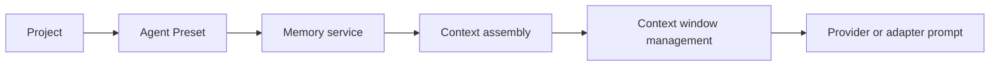

# Agent Memory

> **Status:** proposed; project-scoped operator memory implemented through
> Cairnline, broader agent memory remains future work.
> **Current source of truth:** [Chat sessions](../../runtime/chat-sessions.md),
> [Agent runtime](../../runtime/agent-runtime.md), and
> [Context assembly and injection boundaries](context-assembly-and-injection-boundaries.md)
> for today's prompt and context behavior.
> **Next action:** extend activation/profile selection beyond the current
> Cairnline-backed project memory scope, then add broader context
> assembly and prompt-rendering integration.

Operators often repeat the same durable context: coding preferences,
repository conventions, communication style, recurring paths, and project facts
that should survive across Hecate Chat sessions, external-agent chats, and
task-backed runs. Today those facts live either in the global system prompt, in
workspace docs, in external-agent-specific settings, or in the operator's head.

This design record defines Hecate memory as **operator-approved durable context**. It is
not automatic transcript mining, not a vector search system, and not a vendor
memory feature. Memory entries are visible, scoped, editable, and included in a
model call only through the context assembly pipeline.

[Projects](../accepted/projects.md) provide the durable default scope for memory. Agent
Presets choose which memory sources and scopes a given agent uses. Context
assembly remains the enforcement layer that decides what enters a specific
model or adapter call. Project-team orchestration should use context packets
for work-item briefs, handoffs, reviews, and decision notes before promoting any
fact into durable memory. Generated or runtime-derived text may be stored as a
project memory candidate, but it remains outside durable memory and outside
context injection until the operator explicitly promotes it.

## Relationship To Context

Memory is one input to the context pipeline:



- [Context assembly](context-assembly-and-injection-boundaries.md) decides
  whether a memory entry is active for a given chat message or task run and
  labels it as `operator_memory`.
- [Context window management](llm-context-window-management.md) counts memory
  tokens and may warn/block if memory plus transcript exceeds the model limit.
- [Projects](../accepted/projects.md) provide the default durable scope for memory.
- Agent Presets select which memory scopes and external memory providers the
  active agent should use.
- Memory itself only stores durable entries and scopes. It does not perform
  retrieval, summarization, or prompt rendering.

## Goals

1. **Operator-authored persistence.** Entries survive restarts, chats, and task
   runs.
2. **Scoped activation.** Entries can apply globally, to a project, to a
   chat/session, to a runtime surface, or through a named Agent Preset.
3. **Full visibility.** Operators can see which memory entries are active before
   sending and can inspect which entries influenced a completed message/run.
4. **Provider-neutral behavior.** Memory works the same whether the next call
   routes to OpenAI, Anthropic, Gemini, a local provider, or another compatible
   backend.
5. **Agent-neutral project memory.** Hecate Chat and external-agent chats can
   both use project memory when their active Agent Preset opts into it.
6. **No silent writes.** The model cannot quietly create or edit memory. Any
   future "remember this" flow must be explicit and operator-approved.

## Non-goals

- **Automatic extraction from chats.** No "I noticed this, so I remembered it"
  behavior in v1.
- **Semantic recall or vector retrieval.** Exact scope matching first. Embedding
  search can become a later retrieval design record.
- **Owning external-agent private memory.** Codex, Claude Code, Cursor, and
  Grok Build have their own memory/settings layers. Hecate can provide project
  memory to an external-agent session through supported prompt/config surfaces,
  but it should not pretend to read, rewrite, or synchronize the agent's private
  memory.
- **Cross-user sharing.** Hecate remains local-first and single-operator shaped.
- **Replacing workspace docs.** Repository guidance belongs in repo files such
  as `AGENTS.md`; memory is for operator-owned durable preferences and facts.

## Memory Entry Model

Sketch:

```go
type MemoryEntry struct {
    ID            string
    Title         string
    Body          string
    Scope         MemoryScope
    ProjectID     string
    ChatSessionID string
    AgentProfile  string
    Surface       string // "" | "hecate_chat" | "external_agent" | "task_run"
    Enabled       bool
    Source        string // local | external
    SourceRef     string // provider/key reference for external memory backends
    CreatedAt     time.Time
    UpdatedAt     time.Time
}

type MemoryScope string

const (
    MemoryScopeGlobal       MemoryScope = "global"
    MemoryScopeProject      MemoryScope = "project"
    MemoryScopeChat         MemoryScope = "chat"
    MemoryScopeAgentProfile MemoryScope = "agent_profile"
    MemoryScopeSurface      MemoryScope = "surface"
    MemoryScopeComposite    MemoryScope = "composite"
)
```

Scope semantics:

| Scope           | Activates when                                                                                                               |
| --------------- | ---------------------------------------------------------------------------------------------------------------------------- |
| `global`        | Every Hecate-controlled model call.                                                                                          |
| `project`       | Active `project_id` matches.                                                                                                 |
| `chat`          | Active chat/session ID matches.                                                                                              |
| `agent_profile` | Active Agent Preset opts into the entry or backing source. The stored scope value remains `agent_profile` for compatibility. |
| `surface`       | Runtime surface matches `surface`, such as Hecate Chat or task runs.                                                         |
| `composite`     | Project, chat, profile, and/or surface constraints all match.                                                                |

Agent Presets can reference a set of memory entries, memory scopes, or external
memory sources, but they should not become memory themselves. A preset is a
reusable runtime configuration; memory is durable context. Once a preset is
selected, the resolved preset settings control memory activation.

## Memory Layers

| Layer                  | Persistence                       | Scope                       | Promotion                                               |
| ---------------------- | --------------------------------- | --------------------------- | ------------------------------------------------------- |
| Global memory          | Durable                           | Whole local Hecate instance | Explicit only                                           |
| Project memory         | Durable                           | One `project_id`            | Explicit save from chat/task                            |
| Chat/session memory    | Session-local or durable-per-chat | One chat/session            | Never auto-promoted                                     |
| Preset-selected memory | Durable selection rule            | One Agent Preset            | References scopes/sources; does not store memory itself |
| Current context        | Per request                       | One model/agent call        | Not memory                                              |

Project memory should be the default durable scope. Chat/session memory is for
short-lived continuity and notes inside one conversation. If something learned
in a chat should persist for the project, the operator should explicitly save
it to project memory, or review and promote a pending memory candidate. In UI
language, "project memory notes" are structured `MemoryEntry` records scoped to
a project. Their `body` can contain Markdown-compatible text, but Markdown
files are not the default storage format or source of truth.

## External Memory Providers

External memory providers should integrate behind Hecate's memory service, with
Agent Presets as the user-facing control plane.

Responsibilities:

- **Project** owns the default durable memory scope.
- **Agent Preset** selects which memory scopes and external memory providers an
  agent should use.
- **Memory service** normalizes local and external entries into Hecate
  `MemoryEntry` records or read-only `ContextItem` candidates.
- **Context assembly** applies trust labels, prompt-injection boundaries,
  context-window eligibility, and audit snapshots.
- **Adapters/providers** receive only the rendered context Hecate chose to send.

This keeps Hecate in control of visibility and safety while still allowing
future integrations with external memory systems.

External memory provider rules:

1. External memory reads are optional per Agent Preset.
2. External memory writes require explicit operator approval.
3. External provider output is not trusted more than local operator memory
   unless the operator marks that source as trusted.
4. Failed external memory lookups should degrade gracefully and be visible in
   the context inspector.
5. External memory providers cannot bypass Hecate approvals, sandboxing, or
   workspace validation.

## Hecate And External Agents

Hecate Chat can inject project memory directly into the provider prompt because
Hecate owns that model call.

External agents are different: Codex, Claude Code, Cursor, and Grok Build own
their private prompt/history internals. Hecate should still let them use
project memory, but only through explicit surfaces:

- ACP config/session options when an adapter exposes a suitable field.
- Hecate-authored session preamble or instruction text when the adapter accepts
  it.
- Operator-visible context notes in the chat settings/context inspector when no
  injection surface exists.

The UI should make this distinction visible: "available to Hecate Chat" versus
"sent to this external agent" versus "stored as project memory but not injected."

## Storage

Accepted project memory and memory candidates now live in Cairnline's embedded
SQLite graph with the rest of portable Projects coordination state. Hecate
keeps the `/hecate/v1/projects/{project_id}/memory*` API facade and Projects UI,
but it does not persist a second Hecate memory/SQLite/Postgres copy.
`internal/memory/` remains as the in-memory adapter vocabulary used by context
assembly, Project Assistant, and tests.

The implementation is deliberately project-scoped: entries are written only
by explicit operator action and are shown in the Projects UI.
Enabled entries are added to chat context packets as itemized `memory` context
items using the entry's trust/provenance labels. Global, chat, profile,
surface, composite, external-provider, and `/active` selection surfaces remain
future work.

Project memory candidates are also project-scoped and authoritative in
Cairnline. They live under
`/hecate/v1/projects/{project_id}/memory/candidates`, carry suggested
trust/provenance fields plus source references, and move through `pending`,
`promoted`, or `rejected`. Candidate creation is not a memory write: only the
promote endpoint creates a durable `MemoryEntry`, and that promotion accepts
operator edits before saving.

It is logically related to chats but not owned by chat sessions.

Historical pre-extraction Hecate-native SQLite sketch (not the current
Cairnline schema):

```sql
CREATE TABLE IF NOT EXISTS memory_entries (
    id              TEXT PRIMARY KEY,
    title           TEXT NOT NULL,
    body            BLOB NOT NULL,
    scope           TEXT NOT NULL,
    project_id      TEXT NOT NULL DEFAULT '',
    chat_session_id TEXT NOT NULL DEFAULT '',
    agent_profile   TEXT NOT NULL DEFAULT '',
    surface         TEXT NOT NULL DEFAULT '',
    source          TEXT NOT NULL DEFAULT 'local',
    source_ref      TEXT NOT NULL DEFAULT '',
    enabled         INTEGER NOT NULL DEFAULT 1,
    created_at      TEXT NOT NULL,
    updated_at      TEXT NOT NULL
);
CREATE INDEX IF NOT EXISTS idx_memory_entries_scope
    ON memory_entries (scope, project_id, chat_session_id, agent_profile, surface, enabled);
```

A future encrypted-memory design could use the same secret-management
primitives as stored provider credentials. That is not current Cairnline
behavior. The `body` text may use Markdown-style formatting because it renders
well for operators and agents, but the durable object remains a structured
memory entry. Filesystem-backed Markdown notes can be an import/export or
context-source integration later, not the v1 default.

## API Surface

Hecate-native endpoints:

```
GET    /hecate/v1/memory
POST   /hecate/v1/memory
GET    /hecate/v1/memory/{id}
PATCH  /hecate/v1/memory/{id}
DELETE /hecate/v1/memory/{id}
GET    /hecate/v1/memory/active?project_id=proj_...&chat_session_id=chat_...&agent_profile=codex&surface=external_agent
```

`/active` is an introspection endpoint. It returns entries that would become
`operator_memory` context items for the supplied project, chat, Agent Preset,
and surface, but it does not render a prompt and does not apply
context-window truncation.

## Context Assembly Integration

Memory enters a model call through the context packet, not by ad hoc prompt
string concatenation.

For every model-backed chat message, external-agent session, or task run:

1. Context assembly asks the memory service for scoped active entries and
   preset-selected external memory candidates.
2. Each matching entry becomes a `ContextItem` with
   `trust_level=operator_memory`, `kind=memory`, and `origin=<memory_id>`.
3. The context packet stores the memory item IDs and snapshots enough title/body
   content for auditability.
4. The provider renderer inserts the memory block after system instructions and
   before workspace guidance.
5. Context-window management counts the memory tokens with the rest of the
   packet.

Recommended rendered block:

```markdown
## Operator Memory

### <title>

<body>
```

This label is intentional. It tells the model that memory is durable operator
context, while keeping it distinct from Hecate runtime instructions and
workspace guidance.

## Workflow Memory Candidates

[Workflow runbooks](workflow-runbooks-v0.md) may propose project memory
candidates when a completed workflow finds a reusable lesson. The workflow does
not write durable memory directly. It emits a candidate with source provenance,
evidence artifact ids, and a suggested trust/provenance label, then the
operator decides whether to edit, promote, reject, or ignore it.

Examples:

- A `qa` workflow learns that a project needs `just dev` before browser checks.
- A `ship` workflow records that desktop release notes must change when Tauri
  files change.
- An `investigate` workflow identifies a recurring diagnostic command that
  should be remembered for this project.

Pending workflow candidates remain review artifacts. They are excluded from
context packets until the operator promotes them into project memory.

## UI Placement

Memory should be visible from two places:

- **Management surface:** likely Connections or a dedicated "Memory" view once
  the feature is real. The operator can create, edit, disable, delete, and
  scope entries there.
- **Chat/Run context inspector:** shows active memory entries for the next call
  and the memory entries that influenced a completed message/run.

Avoid hiding memory only in a generic Settings page. The operator needs memory
visibility at the point of use.

## Safety Rules

1. Memory writes require explicit operator action.
2. Imported text, tool output, raw adapter output, and generated summaries
   cannot become memory without review.
3. Disabled entries are never included in context packets.
4. Deleted or edited entries do not rewrite historical context packet snapshots.
5. Memory cannot override Hecate security policy, approvals, sandboxing, or
   workspace validation.
6. Structured project handoffs may link memory entry IDs as context references,
   but creating or accepting a handoff does not create, edit, enable, or
   promote memory.
7. Memory entries should have size guardrails. Initial proposal: warn at 5,000
   characters and block at 20,000 characters per entry unless overridden.

## Implementation Plan

| PR  | Scope                                                                                                              |
| --- | ------------------------------------------------------------------------------------------------------------------ |
| 1   | Landed, then extracted: project-scoped memory CRUD and UI now use Cairnline authority through Hecate's API facade. |
| 2   | Landed for chat packets: enabled project memory emits labelled `memory` context items.                             |
| 3   | Landed for project handoffs: handoff records can reference memory IDs without writing or promoting memory.         |
| 4   | Add `/active` introspection once preset/surface selection exist beyond project scope.                              |
| 5   | Agent Preset memory-source selection for Hecate Chat and external agents.                                          |
| 6   | Extend active-memory indicators into Chat/Task Detail and standalone task-run context packets.                     |
| 7   | Docs, screenshots, and e2e coverage for scoped memory visibility.                                                  |

This should land after the first context-packet implementation. Otherwise
memory will have no durable "what saw this entry?" audit trail.

## Test Plan

- Cairnline store and Hecate facade tests for accepted memory and candidates.
- Scope matching unit tests for global, project, chat, Agent Preset, surface, and composite
  entries.
- API tests for CRUD, disabled entries, and `/active`.
- Context assembly tests proving memory items are labelled `operator_memory`.
- External memory provider tests proving failures are visible but non-fatal.
- Prompt-injection regression tests proving untrusted content cannot write or
  override memory.
- UI tests for active-memory indicators and management CRUD.
- E2E test where project-scoped memory appears in one project and not another.
- E2E test where Hecate Chat and an external-agent chat share the same project
  memory when their profiles opt in.

## Open Questions

- What is the first external memory provider worth supporting, if any?
- Should operators be able to export/import memory as JSON? This is useful for
  backup and migration; keep it out of the first storage/API PR.
- Should a future "remember this" command exist? Only if it opens a visible
  approval/edit flow before persisting anything.
- Which External Agent integrations support a safe project-memory injection surface
  today, and which should show memory as operator-side notes only?
