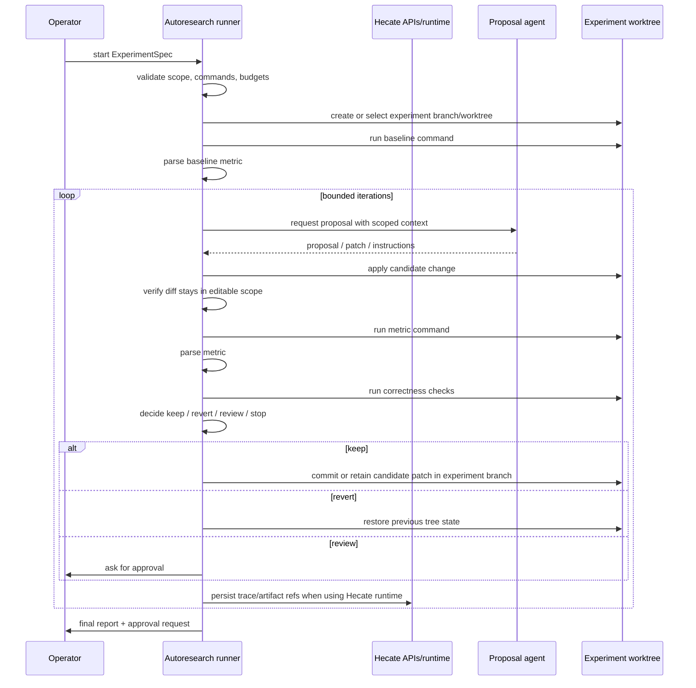

# Autoresearch

> **Status:** proposed; not implemented.
> **Current source of truth:** [Agent runtime](../../runtime/agent-runtime.md),
> [Runtime API](../../runtime/runtime-api.md), [Projects](../accepted/projects.md),
> [Context assembly](context-assembly-and-injection-boundaries.md), and
> [Security](../../operator/security.md) for today's task, project, context, approval, and
> workspace-safety behavior.
> **Next action:** prototype a files-first companion runner against one bounded
> conformance workflow before deciding whether the loop should move into Hecate
> core.

Autoresearch is a bounded, observable experiment loop for local code research.
It is not a general AI scientist and not an unrestricted coding agent. The
first useful version is deliberately narrow:

```text
bounded editable scope
  -> agent proposes a change
  -> deterministic command runs
  -> metric is parsed
  -> correctness checks run
  -> keep / revert / ask approval
  -> trace, artifacts, and experiment log are persisted
```

The anchor use case is a Pragmatist/Cynic conformance loop: select one known
failing conformance cluster, let an agent propose local changes inside an
allowlist, run the targeted replay command, parse pass/fail movement, run
broader checks, and keep only changes that improve the metric without violating
scope. "Kept" means kept in an experiment branch or worktree, not merged.
Human approval is required before finalization.

## Facts From Current Hecate

These are existing Hecate capabilities Autoresearch can build on:

| Capability                | Current source                                                                                                                                                      | What Autoresearch can reuse                                                                                      |
| ------------------------- | ------------------------------------------------------------------------------------------------------------------------------------------------------------------- | ---------------------------------------------------------------------------------------------------------------- |
| Task/run persistence      | [`taskstate.Store`](../../../internal/taskstate/store.go#L49)                                                                                                       | Runs, steps, artifacts, approvals, and append-only run events for Hecate-owned execution.                        |
| Task HTTP API             | [`registerHecateTaskRoutes`](../../../internal/api/server.go#L108)                                                                                                  | Existing task/run/approval/artifact/event endpoints for supervised work.                                         |
| Task runner lifecycle     | [`Runner`](../../../internal/orchestrator/runner.go#L124), [`startTaskWithOptions`](../../../internal/orchestrator/runner.go#L555)                                  | Queued execution, trace creation, approval gates, workspace provisioning, artifacts, and terminal state updates. |
| Workspace provisioning    | [`WorkspaceManager`](../../../internal/orchestrator/workspace.go#L17), [`Provision`](../../../internal/orchestrator/workspace.go#L32)                               | In-place or isolated workspaces for experiments.                                                                 |
| Workspace path boundary   | [`workspacefs`](../../../internal/workspacefs/workspacefs.go#L11)                                                                                                   | Canonical path resolution for Hecate-mediated file/search/write operations.                                      |
| Process execution seam    | [`processrunner.Runner`](../../../internal/processrunner/processrunner.go#L39)                                                                                      | Bounded subprocess execution with cwd, env, timeout, streaming output, and caps.                                 |
| Git execution seam        | [`gitrunner.Runner`](../../../internal/gitrunner/gitrunner.go#L19)                                                                                                  | Git worktree checks, diffs, restore, clone, and sanitized environment handling.                                  |
| Patch apply/revert safety | [`HandleApplyTaskRunPatch`](../../../internal/api/handler_tasks_patches.go#L224), [`HandleRevertTaskRunPatch`](../../../internal/api/handler_tasks_patches.go#L153) | Scope-aware patch artifact application and conflict-checked reverts for Hecate task artifacts.                   |
| Project identity          | [`projects.Project`](../../../internal/projects/store.go#L18), [`projects.ContextSource`](../../../internal/projects/store.go#L48)                                  | Durable project identity, roots, and future context-source metadata.                                             |
| Telemetry and traces      | [`Runner.startTaskWithOptions`](../../../internal/orchestrator/runner.go#L584)                                                                                      | Trace IDs and spans surfaced through existing run/task records.                                                  |
| Artifact persistence      | [`Runner.persistOutputArtifacts`](../../../internal/orchestrator/runner.go#L910), [`Runner.gitSummaryArtifact`](../../../internal/orchestrator/runner.go#L928)      | Storing logs, patches, summaries, and replay material.                                                           |
| Blocking approvals        | [`Runner.startTaskWithOptions`](../../../internal/orchestrator/runner.go#L674), [`Runner.pendingApprovalsForRun`](../../../internal/orchestrator/runner.go#L962)    | Human checkpoints before privileged execution or finalization.                                                   |
| Context packet direction  | [Context assembly design record](context-assembly-and-injection-boundaries.md)                                                                                      | Future "what did the agent see?" snapshots and memory candidate provenance.                                      |

Assumptions:

- Hecate remains local-first and single-operator shaped for this feature.
- Autoresearch should start with local files, local commands, and deterministic
  replay commands.
- External agents can be used as proposal engines, but Hecate should own the
  experiment log, scope validation, metric parsing, and final decision record.
- The first implementation may use a companion runner, but it must preserve the
  same safety boundaries as Hecate-owned runtime work.

## Goals

1. **Bound the editable scope.** Every experiment declares editable paths,
   read-only paths, and forbidden files before the loop starts.
2. **Make every decision replayable.** Baseline, metric, and check commands are
   deterministic and recorded with arguments, cwd, environment policy, stdout,
   stderr, exit status, and parsed result.
3. **Keep operator control.** Autoresearch can propose, apply, test, and retain
   candidate patches in an experiment branch/worktree. It cannot merge or write
   durable memory without explicit approval.
4. **Persist useful artifacts.** Each iteration stores prompt/context metadata,
   agent output, patch, command logs, metrics, check results, decision, trace
   references, and replay commands.
5. **Be observable.** The operator can inspect the loop as a sequence of
   bounded state transitions rather than a vague long-running agent session.
6. **Support the Pragmatist/Cynic loop first.** Optimize the v0 shape around
   conformance repair: one cluster, one target metric, one replay path, and
   conservative keep/revert rules.

## Non-goals

- **No autonomous science claims.** Autoresearch is a command/metric/check loop,
  not a general research agent.
- **No unrestricted coding agent.** The agent proposes changes inside an
  allowlist; Hecate validates the resulting diff before keeping anything.
- **No automatic merge.** Finalization creates a branch, patch, report, and
  approval request. Merge stays outside the loop.
- **No automatic durable memory writes.** The loop may create memory candidates
  with provenance, but the operator decides whether to save them.
- **No secret capture.** Artifacts must avoid storing secrets and should redact
  configured sensitive environment values from logs.
- **No plugin ABI in v0.** A plugin/module shape can come later after the domain
  model proves itself.

## Placement Decision

Recommended v0 placement: **companion CLI/local runner that uses Hecate APIs
where useful, with an implementation path that can later move into core**.

| Option                     | Pros                                                                                                            | Cons                                                                                                                | Decision                                                                   |
| -------------------------- | --------------------------------------------------------------------------------------------------------------- | ------------------------------------------------------------------------------------------------------------------- | -------------------------------------------------------------------------- |
| Hecate core                | Can reuse task runtime, approvals, traces, artifacts, WorkspaceFS, ProcessRunner, GitRunner, and UI directly.   | Adds a new product domain to the main runtime before the loop shape is proven.                                      | Not v0. Promote after the loop is validated.                               |
| Hecate plugin/module       | Clean conceptual boundary for experiments.                                                                      | Hecate does not yet have a stable plugin/module ABI for local runners, storage, approvals, traces, and UI surfaces. | Not v0. Keep as a later packaging choice.                                  |
| Companion CLI/local runner | Fastest safe prototype; can remain files-first; can use current APIs and local artifacts without changing core. | Must carefully mirror Hecate safety boundaries; some UI and persistence integration comes later.                    | Recommended v0. Build with a path to promotion, not as a throwaway script. |

The companion runner can live outside the Hecate server process while still
writing Hecate-shaped artifacts and linking to Hecate traces/runs. If it is
built inside this repository, it may reuse internal runner abstractions. If it
is built outside the repository, equivalent path, process, git, and secret
redaction controls are new requirements.

## Domain Model

Use Hecate-native names where possible. New Autoresearch terms map to existing
runtime concepts but do not replace them.

| Model             | Purpose                                                                                       | Hecate mapping                                                                                           |
| ----------------- | --------------------------------------------------------------------------------------------- | -------------------------------------------------------------------------------------------------------- |
| `ExperimentSpec`  | Declarative contract for repo, target cluster, editable scope, commands, metrics, and policy. | New file-first spec. Can reference `project_id`, workspace root, agent/profile, and task/runtime policy. |
| `ExperimentRun`   | One invocation of a spec in one worktree/branch.                                              | New aggregate that may reference many Hecate task runs, chat messages, traces, and artifacts.            |
| `Iteration`       | One proposal/apply/measure/decide cycle.                                                      | New record that may contain one or more Hecate runs plus local command results.                          |
| `MetricParser`    | Deterministic parser that converts command output to structured metrics.                      | New requirement. Prefer simple regex/JSON/junit parsers before model-based interpretation.               |
| `CheckResult`     | Result of a correctness or regression command.                                                | Similar to a task step result; should store command, exit code, stdout/stderr refs, and parsed status.   |
| `Decision`        | `keep`, `revert`, `review`, or `stop` with a reason and evidence.                             | New experiment log row. `review` may create a Hecate approval request in future core integration.        |
| `ArtifactRef`     | Pointer to patch, log, summary, metric, replay, or report artifact.                           | Can map to `TaskArtifact` when execution uses Hecate task runtime.                                       |
| `TraceRef`        | Trace/run/request identifiers for observability.                                              | Existing trace IDs, run IDs, task IDs, and request IDs.                                                  |
| `ApprovalRequest` | Human decision before finalization or risky actions.                                          | Existing task approvals if core-integrated; CLI prompt or UI approval in companion v0.                   |
| `MemoryCandidate` | Proposed durable memory entry with provenance.                                                | Future memory design record input; never written automatically.                                          |

Sketch:

```go
type ExperimentSpec struct {
    ID            string
    Title         string
    ProjectID     string
    WorkspaceRoot string
    WorktreePolicy string // in_place | isolated
    EditablePaths []string
    ReadOnlyPaths []string
    ForbiddenPaths []string
    Agent         AgentSelector
    Baseline      CommandSpec
    Metric        MetricSpec
    Checks        []CommandSpec
    Policy        ExperimentPolicy
    Budgets       ExperimentBudgets
}

type Iteration struct {
    Index       int
    ProposalRef ArtifactRef
    PatchRef    ArtifactRef
    Metric      MetricResult
    Checks      []CheckResult
    Decision    Decision
    TraceRefs   []TraceRef
}
```

## Run Lifecycle



Detailed flow:

1. **Validate spec.** Confirm repo exists, worktree is clean or explicitly
   allowed dirty, editable paths are inside workspace, read-only and forbidden
   paths do not overlap editable paths, commands are declared, and budgets are
   finite.
2. **Prepare worktree.** Create an experiment branch/worktree. Never merge.
3. **Baseline.** Run the baseline command and parse the starting metric.
4. **Proposal.** Ask the selected Hecate Chat mode or external agent for one
   bounded proposal. The prompt must include editable scope, metric goal,
   replay command, and stop conditions.
5. **Apply change.** Apply the proposed patch or instructions inside the
   experiment worktree.
6. **Validate diff.** Reject or revert if the diff touches forbidden or
   read-only paths, escapes editable paths, changes generated lockfiles without
   permission, or includes suspicious secret material.
7. **Run metric.** Execute the metric command and parse a structured result.
8. **Run checks.** Execute targeted checks first; optionally execute broader
   regression checks when the metric improves.
9. **Decide.** Keep if metric improves and checks pass; revert if metric
   regresses or scope is violated; ask for review when evidence is ambiguous.
10. **Persist iteration.** Store command logs, metric, checks, diff, decision,
    trace refs, replay commands, and a short summary.
11. **Finalize.** Ask the operator to approve the final branch/patch/report.
12. **Export/replay.** Emit a replay script and machine-readable run log so the
    result can be reproduced outside the UI.

## Storage And Artifact Layout

V0 should be files-first. A local artifact directory is easier to inspect,
copy, and delete than a premature database schema.

```text
hecate-autoresearch/
  <run_id>/
    experiment.yaml
    baseline/
      command.json
      stdout.log
      stderr.log
      metric.json
    iterations/
      0001/
        prompt.md
        context.json
        proposal.md
        patch.diff
        command.metric.json
        command.metric.stdout.log
        command.metric.stderr.log
        checks.json
        decision.json
        trace-refs.json
      0002/
        ...
    autoresearch.jsonl
    memory-candidates.jsonl
    summary.md
    final.patch
    replay.sh
```

Rules:

- `autoresearch.jsonl` is append-only.
- Command logs are referenced by artifact refs instead of duplicated into every
  JSON row.
- Secrets are redacted before writing logs.
- `memory-candidates.jsonl` records suggestions only; it never writes durable
  memory.
- If the loop uses Hecate task runtime, Hecate task artifacts should be linked
  from `trace-refs.json` instead of copied blindly.

SQLite can be added later when the UI needs queryable experiment history.

## API, CLI, And UI Surfaces

### V0 CLI

The command shape is intentionally provisional:

```text
hecate-autoresearch validate <experiment.yaml>
hecate-autoresearch run <experiment.yaml>
hecate-autoresearch status <run_id>
hecate-autoresearch stop <run_id>
hecate-autoresearch replay <run_id>
hecate-autoresearch export <run_id>
hecate-autoresearch finalize <run_id>
```

If this graduates into the main binary, the command group should keep the same
separation from runtime startup, likely under an experiment-oriented noun rather
than hidden inside chat or tasks.

### Future Hecate API

No new API is required for the companion v0. A core-integrated version can add:

```text
POST   /hecate/v1/experiments
GET    /hecate/v1/experiments
GET    /hecate/v1/experiments/{run_id}
POST   /hecate/v1/experiments/{run_id}/stop
POST   /hecate/v1/experiments/{run_id}/finalize
GET    /hecate/v1/experiments/{run_id}/events
GET    /hecate/v1/experiments/{run_id}/artifacts/{artifact_id}
```

These endpoints should not ship until the files-first run log proves stable.

### Future UI

The UI should make the loop legible:

- spec editor with editable/read-only path preview
- baseline metric card
- iteration timeline
- metric trend
- check results
- rich diff viewer
- command log viewer
- trace links
- artifact browser
- final approval / export panel

Autoresearch should feel closer to a controlled experiment notebook than to an
open-ended chat transcript.

## Safety Model

Safety boundaries:

1. **Editable path allowlist.** Candidate diffs outside editable paths are
   rejected and reverted.
2. **Read-only path veto.** Read-only paths may be used as context or test
   inputs but cannot be modified.
3. **Forbidden path veto.** Secrets, credentials, `.git`, runtime data dirs,
   and generated artifacts are never editable unless explicitly allowed.
4. **Deterministic commands.** Metric and check commands are predeclared and
   recorded. Ad hoc commands require review.
5. **Command policy.** Commands run through Hecate ProcessRunner/sandbox when
   core-integrated, or through equivalent local controls in a companion v0.
6. **Git policy.** Branch/worktree operations use GitRunner semantics when
   inside Hecate.
7. **Network policy.** Network access is off or explicit per command.
8. **Budget policy.** Iteration count, wall time, command time, output size,
   and model usage are bounded.
9. **Human finalization.** The loop can keep an experiment branch but cannot
   merge or write durable memory without approval.
10. **Secret handling.** Logs and artifacts redact configured sensitive values.

Prompt-injection handling is mostly context-boundary work:

- Treat repo files, tests, and external issue/comment text as evidence, not
  instructions.
- Keep generated summaries and memory candidates labelled with provenance.
- Do not promote agent-generated text into system instructions.

## Trace And Observability

Autoresearch should emit one trace per experiment run and child spans for:

- spec validation
- baseline command
- proposal call
- patch apply
- diff validation
- metric command
- metric parsing
- each check command
- decision
- revert or keep
- finalization approval

Suggested event names:

```text
experiment.started
experiment.baseline.completed
experiment.iteration.started
experiment.proposal.completed
experiment.patch.applied
experiment.metric.parsed
experiment.check.completed
experiment.decision.recorded
experiment.iteration.completed
experiment.finalization.requested
experiment.completed
experiment.failed
```

Every iteration should carry trace refs back to any Hecate task run, chat
message, provider request, or external-agent session used to produce the
proposal.

## Memory Integration

Autoresearch can create memory candidates, not memory entries.

Example candidate:

```json
{
  "scope": "project",
  "title": "Cynic test262 replay command",
  "body": "Use the targeted test262 replay command from experiment run ...",
  "evidence": {
    "experiment_run": "exp_...",
    "iteration": 3,
    "artifact": "iterations/0003/checks.json"
  },
  "confidence": "operator_review_required"
}
```

The future memory UI can show these candidates with provenance. The operator
decides whether to save, edit, or discard them.

## Pragmatist/Cynic V0 Anchor

The first serious validation target should be one known failing conformance
cluster in a local Cynic checkout.

Example spec shape:

```yaml
id: cynic-test262-cluster
title: Cynic targeted test262 cluster
project_id: cynic
workspace_root: /path/to/cynic
worktree_policy: isolated

editable_paths:
  - src/
  - tests/

read_only_paths:
  - test262/
  - fixtures/

baseline:
  command: ["just", "test262-target", "path/to/cluster"]

metric:
  kind: regex
  command: ["just", "test262-target", "path/to/cluster"]
  pattern: "(?P<passed>\\d+) passed"
  objective: maximize
  field: passed

checks:
  - name: targeted replay
    command: ["just", "test262-target", "path/to/cluster"]
  - name: regression smoke
    command: ["just", "test"]

policy:
  max_iterations: 8
  require_improvement: true
  require_checks_pass: true
  finalization_requires_approval: true
```

This spec is illustrative. The actual commands and editable paths must come
from the target repository.

## Roadmap

### V0 — Files-first Local Runner

- Read and validate `ExperimentSpec`.
- Create/select experiment worktree.
- Run baseline, metric, and check commands.
- Ask one configured agent for bounded proposals.
- Apply/revert patches.
- Enforce editable/read-only/forbidden path scope.
- Persist file artifacts and append-only run log.
- Export summary, final patch, replay script, and memory candidates.

### V1 — Hecate Runtime Integration

- Use Hecate task runtime for proposal/check execution where appropriate.
- Link every iteration to Hecate traces, task runs, artifacts, and approvals.
- Add an experiment viewer in the UI.
- Add finalization approval through Hecate approval primitives.

### V2 — Context And Memory Integration

- Store context packets for proposals and checks.
- Show "what did the agent see?" per iteration.
- Surface memory candidates in the memory UI.
- Support project/profile-selected memory as read-only context.

### V3 — Multi-strategy Experiments

- Compare proposal strategies across isolated branches/worktrees.
- Add richer metric parsers such as junit, JSON, benchmark output, and custom
  scripts.
- Add pause/resume and resumable experiments.
- Add optional hosted artifact export without changing local-first defaults.

## Open Questions

1. Should the promoted command eventually be named around `experiment`,
   `research`, or another Hecate-native noun?
2. Should v0 ask external agents for patches only, or allow command-level
   instructions that Hecate applies through its own tools?
3. How much of ProcessRunner/GitRunner should a companion CLI reuse directly
   versus calling Hecate task APIs?
4. What is the minimum safe metric parser set: regex, JSON, junit, or all
   three?
5. How should the UI display a kept iteration versus a final approved result?
6. Which artifacts need redaction by default before being written to disk?
7. When should an ambiguous metric improvement require review instead of an
   automatic keep?
8. Should experiments attach to `project_id` immediately, or should v0 allow
   projectless runs that only use a workspace path?
