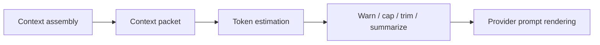

# LLM Context Window Management

> **Status:** proposed; not implemented.
> **Current source of truth:** [Chat sessions](../../runtime/chat-sessions.md),
> [Agent runtime](../../runtime/agent-runtime.md), and
> [Context assembly and injection boundaries](context-assembly-and-injection-boundaries.md)
> for today's prompt, transcript, and usage behavior.
> **Next action:** implement context-packet snapshots first; then add token
> estimation and warning/cap behavior against those packets.

Long Hecate Chat sessions and task-backed `agent_loop` runs can exceed a
model's context window. Today that failure usually comes back from the upstream
provider as a provider-specific 4xx, often after the operator has waited for a
run to start. Hecate should be able to warn, explain, and eventually compress
or block before the provider rejects the request.

This design record owns **fitting already-assembled context into a model window**. It does
not decide which sources are trusted or eligible. That belongs to
[context assembly](context-assembly-and-injection-boundaries.md).

## Relationship To Context And Memory



- Context assembly produces an ordered `ContextPacket` with trust labels and
  inclusion reasons.
- Agent memory contributes `operator_memory` items to that packet.
- Context-window management estimates tokens for the included packet items,
  applies thresholds, and may produce a smaller packet view.
- It must not change trust labels or promote untrusted content into
  instructions.

## Goals

1. **Visibility.** Show estimated context usage before provider failure:
   `tokens_in`, `model_limit`, and fraction of the window.
2. **Friendly failures.** Return a stable Hecate error before an upstream
   context-length error when the next call is clearly too large.
3. **Soft warnings.** Warn near the model limit without blocking.
4. **Optional fitting policy.** Allow explicit opt-in truncation or
   summarization for long task/chat histories.
5. **Auditability.** Record which items were kept, dropped, or summarized so
   the operator can inspect the decision.

## Non-goals

- **Source eligibility and prompt-injection boundaries.** Those are owned by
  context assembly.
- **External-agent private context management.** Hecate cannot count or trim
  Codex/Claude Code/Cursor internal model calls through ACP today.
- **Exact tokenization for every provider.** Approximate estimates are enough
  for warnings and Hecate-side caps. Exact vendor count APIs can be added later
  only where they are cheap and useful.
- **Automatic memory retrieval.** Memory selection happens before this stage.
- **Cost enforcement.** Hecate records usage for visibility; this design record is about
  model capability limits, not spend controls.

## Token Estimation

Initial estimator:

- Uses a shared helper, proposed as `internal/contextwindow/`.
- Estimates `ContextPacket` items plus tool definitions and provider-specific
  message framing overhead.
- Uses `tiktoken-go` or a similarly maintained tokenizer for OpenAI-shaped
  estimates.
- Falls back to conservative approximations for providers without a cheap exact
  count API.

The estimator should return:

```go
type ContextEstimate struct {
    TokensIn        int
    ModelLimit      int
    Fraction        float64
    UnknownLimit    bool
    Estimator       string
    PacketID        string
    IncludedItemIDs []string
}
```

When the model limit is unknown, use the model capability registry if possible,
then a conservative fallback. The response should include a warning that the
limit is estimated.

## Model Context Limits

Model limits belong in the shared model capability record, not in a hidden
budget package.

Lookup precedence:

1. Provider-discovered capability if available.
2. Static catalog default.
3. Conservative fallback plus `unknown_model_context_limit` warning.

The model capability field should be named `max_context_tokens` or
`context_window_tokens` consistently with existing model capability naming. The
implementation should pick one and update the API/docs in the same PR.

## Threshold Behavior

Recommended defaults:

| Level         | Default            | Effect                                                          |
| ------------- | ------------------ | --------------------------------------------------------------- |
| Soft warning  | 80% of model limit | Add warning to response metadata, trace, and UI. Call proceeds. |
| Hard cap      | 95% of model limit | Refuse before provider call with a structured Hecate error.     |
| Unknown limit | 32K fallback       | Warn that the limit is estimated.                               |

Structured error sketch:

```json
{
  "error": {
    "type": "context.window_exceeded",
    "message": "This request is too large for the selected model.",
    "details": {
      "tokens_in": 129000,
      "model_limit": 128000,
      "model": "example-model",
      "packet_id": "ctx_..."
    }
  }
}
```

Use a context-specific error family (`context.*`) because future siblings are
likely: `context.summary_failed`, `context.truncation_failed`,
`context.unknown_model_limit`.

## Fitting Policies

Default behavior should be conservative: warn and cap, but do not silently
remove context. Operators should opt in to fitting policies.

### Drop Oldest Transcript

Drop oldest user/assistant transcript pairs while preserving:

- System instructions.
- Operator memory.
- Workspace guidance.
- Recent transcript turns.
- Current user request.

This is simple and predictable, but can lose important early intent.

### Drop Tool Intermediates

Drop older tool output before dropping user/assistant text. This is useful for
agentic coding workflows where large stdout/stderr or file reads dominate the
window, but it can break references to earlier tool results.

### Summarize Older Context

Use a configurable summarization model to replace older transcript/tool output
with a generated summary item.

The generated summary must become a `generated_summary` context item that
references the item IDs it replaced. It is evidence, not instruction.

## Packet Mutation Rules

Window management may produce a fitted view of the packet, but the original
packet remains inspectable.

Allowed:

- Mark included items as dropped for size.
- Add a generated summary item with provenance.
- Recompute token estimates.
- Return warnings/caps.

Not allowed:

- Change trust labels.
- Turn untrusted text into an instruction.
- Drop Hecate safety instructions.
- Drop operator system prompt or approval/sandbox policy text.
- Rewrite memory entries.

## Telemetry And UI

Emit:

- Span attributes:
  - `hecate.context.packet_id`
  - `hecate.context.tokens_in`
  - `hecate.context.model_limit`
  - `hecate.context.fraction`
  - `hecate.context.policy`
- Optional response headers for compatibility clients:
  - `X-Hecate-Context-Used: <tokens>/<limit>`
  - `X-Hecate-Context-Warning: <reason>`

UI:

- Chat composer warning near the model picker when the next call is near the
  limit.
- Message/run context inspector shows original packet, fitted view, dropped
  items, summaries, and token estimates.
- Friendly error with repair actions: switch model, reduce context, summarize,
  or start a fresh chat.

## Implementation Plan

| PR  | Scope                                                                                 |
| --- | ------------------------------------------------------------------------------------- |
| 1   | Add model context limit field to capability records and provider/model API responses. |
| 2   | Add token estimator over `ContextPacket` items with unit tests.                       |
| 3   | Add soft warning + hard cap for Hecate Chat direct-model and tools-on runs.           |
| 4   | Surface context usage in Chat and Task Detail.                                        |
| 5   | Add opt-in fitting policy for task-backed Hecate Chat runs.                           |
| 6   | Add summarization as a separate, evaluated feature.                                   |

PRs 1-4 are the practical beta target. PRs 5-6 are useful but should not block
basic context visibility.

## Test Plan

- Unit tests for model-limit lookup precedence.
- Unit tests for token estimation across system prompt, memory, workspace docs,
  transcript, and tool output items.
- API tests for soft warning and hard cap response shapes.
- Regression tests proving fitting policies preserve trust labels.
- SQLite/memory parity tests if context estimates are persisted on packets.
- UI tests for warning, error, and context inspector rendering.
- E2E test for a synthetic long transcript that produces a friendly Hecate
  error instead of an upstream provider context error.

## Open Questions

- Should Hecate call provider count-token APIs when available? Recommendation:
  not in v1; add only if a provider makes it free and low-latency.
- Should context limits be per chat, per segment, or per run? Recommendation:
  estimate per model call, display per message/run, and aggregate only for
  orientation.
- Should summarization default to local providers when configured?
  Recommendation: yes, but only after summarization has its own evals.
- Should operators configure thresholds globally or per model/profile?
  Recommendation: global defaults first, profile-level overrides later.
