# Projects Cockpit UX

> **Status:** Proposal with the overview-first, work-item execution,
> assignment-destination, follow-through, supporting-surface hierarchy, and
> shareable-navigation slices implemented. The Overview-hosted guided-start
> selected-work kickoff, and External Agent continuity slices are also
> implemented.
>
> **Current source of truth:** [Projects](../../operator/projects.md),
> [Projects design](../accepted/projects.md), and the Hecate
> `/hecate/v1/projects*` facade.

## UX Audit

The Projects implementation has strong coordination contracts but presents too
many of them at once. `ProjectsView` correctly owns data loading and mutations,
while `ProjectWorkspaceView` composes setup, Project Assistant, operations,
activity, the work queue, and selected-work detail. Before this redesign, ready
projects opened directly on that whole Work surface.

Concrete issues from the current UI and browser behavior:

- There was no project Overview. Project Assistant, Project Operations, Resume,
  queue filters, the work list, and selected detail all appeared in the default
  path and competed to be the next action.
- Resume derived another priority from activity even though the ordered
  operations brief is the server authority for the best operator action.
- Long workspace-tab labels required four 148px tracks and horizontal overflow.
- At a 390px viewport, the fixed 220px project index left roughly 120px for the
  workspace, reducing routine copy to one-word lines.
- The committed Projects screenshot predates Project Operations and no longer
  represents the current information hierarchy.
- Browser tests cover setup, rootless work, assignment launch, evidence, and
  closeout, but not a default overview or narrow navigation.
- Assignment forms exposed implementation-shaped role/driver language, and the
  Hecate facade did not preserve Cairnline's `manual` destination for human
  work.
- Preparing an External Agent assignment created a linked chat but immediately
  presented the work as running, before the operator reviewed or sent the first
  turn.
- Reopening that prepared chat could seed the launch draft again and replace
  unsent operator edits in the composer.
- Completed assignments could make a work item look done before the operator
  resolved evidence, review follow-up, or an open handoff.
- Review, handoff, evidence, and closeout controls were spread across several
  sections, so a selected work item could present several equally prominent
  actions.
- Overview could open the right work item but discard the exact assignment,
  review, or handoff target. That forced another scan, especially at 390px.
- Review and handoff forms exposed advanced record details in the routine path,
  and closeout could be committed without a final confirmation.
- Memory mixed pending review, saved guidance, source management, and raw
  provenance into one dense surface with several competing header actions.
- Skills rendered every registered skill as an always-open editor, so status
  and warnings were harder to scan than paths, trust labels, and runtime needs.
- Project Settings exposed stored workspace-mode values instead of product
  language and squeezed the project workspace beside a fixed-width inspector at
  390px.
- Rootless projects offered file discovery even though skills discovery without
  an active folder can mark previously registered skills missing.
- Workspace, project, tab, and work-item selection lived outside the browser
  address, so reload, Back/Forward, and a copied link could not reliably return
  the operator to the same work.
- New-project setup begins on Overview but proposal review and first-work
  creation move into Work. Setup readiness, Project Operations, Project
  Assistant results, and the Work header can consequently offer several
  competing first-work actions after reload or proposal apply.
- Pristine selected work led with an always-visible Assistant and a prepare
  action. A roleless operator had to leave that work for the full role registry
  before the ordinary assignment path became understandable.

Existing strengths stay intact: rootless creation is first-class, setup and
assistant changes remain reviewable, launch preflight is explicit, evidence is
generic provenance, and review, handoff, memory promotion, and closeout remain
operator-controlled.

## Design Thesis

- **Visual thesis:** one current operator decision is the only accent.
  Server-ordered follow-through wins when present; otherwise pristine selected
  work owns its explicit kickoff.
- **Content plan:** workspace navigation, next action, activity continuity, then
  the full work surface.
- **Interaction thesis:** overview actions route to the exact existing surface;
  activity controls navigate rather than invent priority; the project index
  stacks above the workspace at narrow widths.

## Target Information Architecture

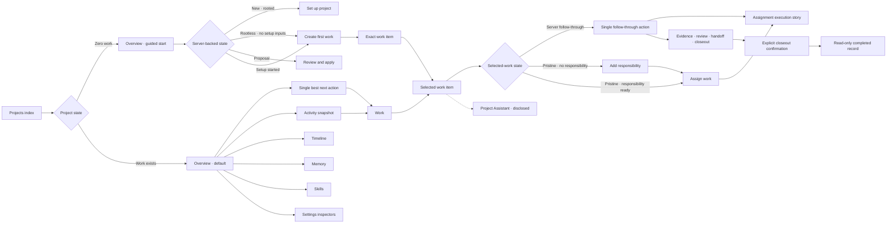
```mermaid
flowchart LR
  P["Projects index"] --> G{"Project state"}
  G -->|"Zero work"| O["Overview · guided start"]
  G -->|"Work exists"| V["Overview · default"]
  O --> GS{"Server-backed state"}
  GS -->|"New · rooted"| SU["Set up project"]
  GS -->|"Rootless · no setup inputs"| FW["Create first work"]
  GS -->|"Proposal"| PR["Review and apply"]
  GS -->|"Setup started"| FW["Create first work"]
  FW --> WI["Exact work item"]
  V --> N["Single best next action"]
  V --> S["Activity snapshot"]
  N --> W["Work"]
  S --> W
  W --> SW["Selected work item"]
  WI --> SW
  SW --> SS{"Selected-work state"}
  SS -->|"Server follow-through"| F["Single follow-through action"]
  SS -->|"Pristine · no responsibility"| R["Add responsibility"]
  R --> A["Assign work"]
  SS -->|"Pristine · responsibility ready"| A
  A --> X["Assignment execution story"]
  SW -.-> PA["Project Assistant · disclosed"]
  F --> X
  F --> CR["Evidence · review · handoff · closeout"]
  CR --> CC["Explicit closeout confirmation"]
  CC --> RC["Read-only completed record"]
  V --> T["Timeline"]
  V --> M["Memory"]
  V --> K["Skills"]
  V --> I["Settings inspectors"]
```

Overview uses setup readiness, the first ordered operation, and activity counts
already loaded through Hecate. Work continues to own the queue, selected work
item, assignments, evidence, handoffs, review, and closeout. Project Assistant
follows the selected-work surface as supporting disclosure while idle.
Within selected work, the first server-ordered operation for that item becomes
its one follow-through action and routes to the exact record. Timeline, Memory,
Skills, Roles, Agent Presets, roots, sources, and runtime detail stay supporting
surfaces.

## Operator Journey

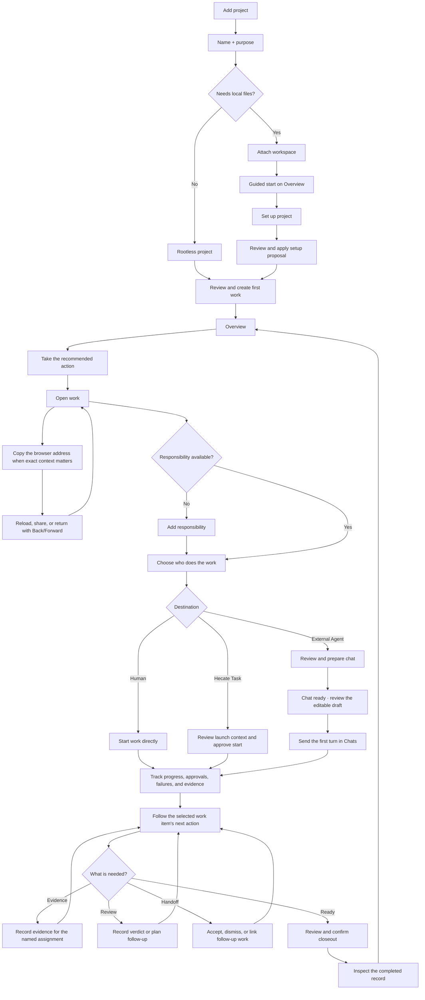
```mermaid
flowchart TD
  A["Add project"] --> B["Name + purpose"]
  B --> C{"Needs local files?"}
  C -->|"No"| D["Rootless project"]
  C -->|"Yes"| E["Attach workspace"]
  D --> FW["Review and create first work"]
  E --> F["Guided start on Overview"]
  F --> FS["Set up project"]
  FS --> FR["Review and apply setup proposal"]
  FR --> FW
  FW --> G["Overview"]
  G --> H["Take the recommended action"]
  H --> I["Open work"]
  I --> U["Copy the browser address when exact context matters"]
  U --> V["Reload, share, or return with Back/Forward"]
  V --> I
  I --> JR{"Responsibility available?"}
  JR -->|"No"| JA["Add responsibility"]
  JA --> J["Choose who does the work"]
  JR -->|"Yes"| J
  J --> K{"Destination"}
  K -->|"Human"| KH["Start work directly"]
  K -->|"Hecate Task"| KA["Review launch context and approve start"]
  K -->|"External Agent"| KE["Review and prepare chat"]
  KH --> L["Track progress, approvals, failures, and evidence"]
  KA --> L
  KE --> KP["Chat ready · review the editable draft"]
  KP --> KS["Send the first turn in Chats"]
  KS --> L
  L --> M["Follow the selected work item's next action"]
  M --> N{"What is needed?"}
  N -->|"Evidence"| NE["Record evidence for the named assignment"]
  N -->|"Review"| NR["Record verdict or plan follow-up"]
  N -->|"Handoff"| NH["Accept, dismiss, or link follow-up work"]
  N -->|"Ready"| O["Review and confirm closeout"]
  NE --> M
  NR --> M
  NH --> M
  O --> P["Inspect the completed record"]
  P --> G
```

## Reviewable Slices

1. **Overview-first shell:** default to Overview, show the server's first
   operation as the primary action, keep activity as navigation, move the full
   queue/detail to Work, shorten tabs, repair narrow layout, and add focused
   journey coverage.
2. **Work-item execution story:** reshape dense assignment rows into a readable
   execution timeline with technical evidence behind disclosure.
3. **Assignment destinations:** expose plain Human, Hecate Task, and External
   Agent choices after the Hecate facade faithfully maps Cairnline's portable
   `manual` execution mode.
4. **Review, handoff, and closeout rail:** make follow-through legible without
   auto-dispatching or auto-closing work.
5. **Supporting inspectors and navigation:** progressively disclose memory,
   skills, context, and runtime detail; make Settings responsive and preserve
   exact launch semantics; add shareable project/work navigation and
   broader accessibility coverage.
6. **Overview-hosted guided start:** keep setup readiness, bootstrap proposal
   review/apply, and first-work creation on Overview with one primary action at
   a time. Keep root optional, use existing typed readiness and mutation
   contracts, and return to the normal cockpit only after work exists.
7. **Selected-work kickoff:** make direct assignment the pristine-work primary
   action, quick-create a missing responsibility, move the idle Assistant behind
   disclosure, and preserve exact focus without chaining writes.
8. **External Agent continuity:** distinguish a prepared linked chat from an
   active agent turn, seed the editable launch draft once, preserve unsent edits
   on reopen, and use state-specific Continue, Open, Review, and Inspect actions.

Slices 1 through 8 are implemented. Slice 1 rearranges existing server
projections and action routing. Slice 2 reshapes each assignment into a
state-driven story. Slice 3 adds Human as a faithful facade label for
Cairnline's `manual` execution mode, with direct Start work, Resume work, and
Mark complete actions backed by Cairnline claim/status/completion transitions.
Slice 4 adds one server-directed follow-through action to selected work, exact
assignment/review/handoff focus, progressive evidence and handoff forms, an
explicit closeout confirmation, and a read-only completed state. It also keeps
work-item closure explicit: completed assignments no longer make an open work
item appear closed. Slice 5 puts pending memory review before saved guidance,
collapses resolved history and technical metadata,
turns Skills into a status-first registry, gives Timeline semantic structure,
and makes Project Settings a full-width narrow inspector. Workspace behavior
labels preserve the exact stored mode: an unset value remains the recommended
isolated copy, `ephemeral` and `persistent` remain distinct isolated settings,
and only `in_place` is described as writing directly to the attached folder.
File-backed discovery is unavailable without an active nonblank root, while
rootless projects retain normal memory and skill management. It also gives each
workspace a canonical path and records Projects presentation intent as
`/projects?project=<id>&view=<view>&work=<id>`, with Overview and absent values
omitted. Browser reload and Back/Forward restore the exact valid destination;
missing records stay explicit instead of falling through to another project or
work item.
Slice 6 keeps the guided start on Overview until first work exists. Slice 7
gives otherwise pristine selected work one direct kickoff, progressively
discloses responsibility defaults, keeps Assistant drafting optional, and
returns focus to the exact next control or created assignment story.
Slice 8 derives a calm External Agent presentation from the existing assignment
status and `execution_ref`: an available prepared `chat_session_id` without
`message_id` is **Chat ready**, while `message_id` records agent-turn
continuity. It keeps each unsent draft scoped to its chat, restores the prepared
chat's one launch draft on return, and retains the seed through a transient
initial selection failure. After an app reload clears transient composer state,
it derives a fallback again from the canonical assignment.
None of the slices add local project lifecycle state or inferred execution
events.

## Overview-Hosted Guided Start

The guided-start rail owns Overview only while the selected project has no work
items. It renders one primary action from existing server and Project Assistant
state:

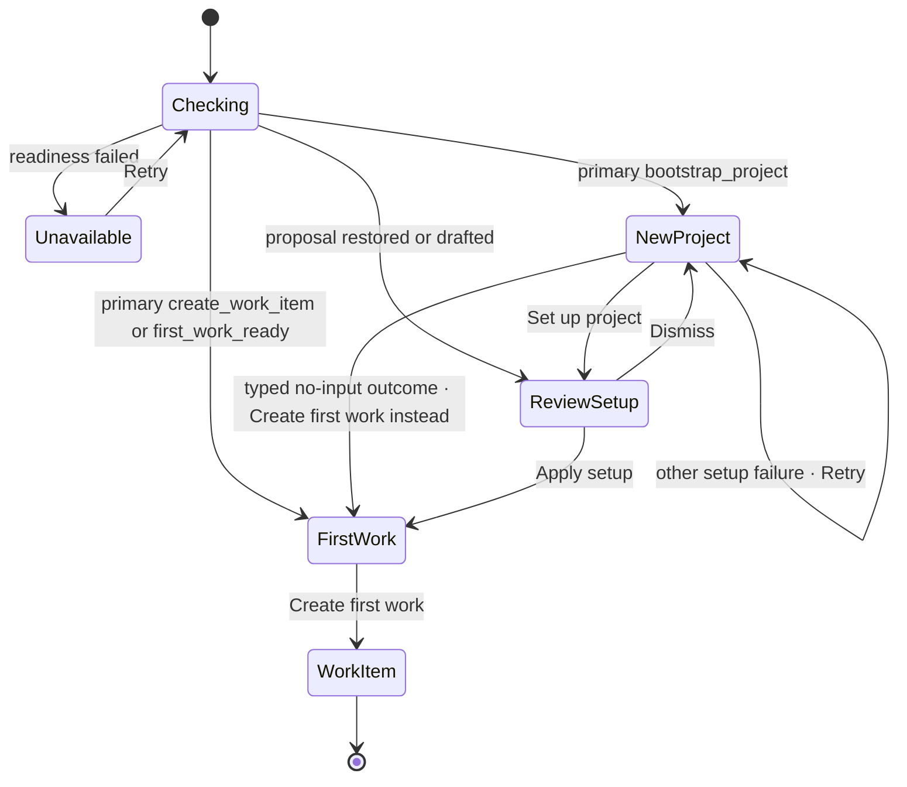
```mermaid
stateDiagram-v2
  [*] --> Checking
  Checking --> Unavailable: readiness failed
  Checking --> NewProject: primary bootstrap_project
  Checking --> ReviewSetup: proposal restored or drafted
  Checking --> FirstWork: primary create_work_item or first_work_ready
  Unavailable --> Checking: Retry
  NewProject --> ReviewSetup: Set up project
  NewProject --> FirstWork: typed no-input outcome · Create first work instead
  NewProject --> NewProject: other setup failure · Retry
  ReviewSetup --> NewProject: Dismiss
  ReviewSetup --> FirstWork: Apply setup
  FirstWork --> WorkItem: Create first work
  WorkItem --> [*]
```

**Set up project**, **Apply setup**, and **Create first work** are never
co-primary. Project Settings, context inspection, memory review, role review,
setup refresh, and proposal dismissal remain supporting actions. During setup
proposal review, the existing explicit apply boundary remains unchanged; after
setup, first-work creation still opens an editable form and writes only after
the operator submits it.

Rootless projects use the same rail. The workspace check remains optional and
does not receive a fake path, repository, or Git state. When a new project has
no active workspace or local setup inputs, Hecate's Cairnline-backed readiness
projection returns typed **Create first work** as the primary action; the browser
does not infer a skip state or invent a local record. Provider, model, Agent
Preset, workspace, and runtime
requirements are evaluated later when an execution-backed assignment needs
them, not as prerequisites for creating planning or Human work.

The UI consumes Hecate's existing facade, which reads and mutates the embedded
Cairnline graph. It may validate that an action targets the selected project
and that current loaded work is still empty, but it must not recompute
`show_onboarding`, `setup_started`, `first_work_ready`, checklist status, or a
portable work item. Successful first-work creation uses Cairnline's returned
record, refreshes projections, and navigates to that exact identifier.

## Selected-Work Kickoff

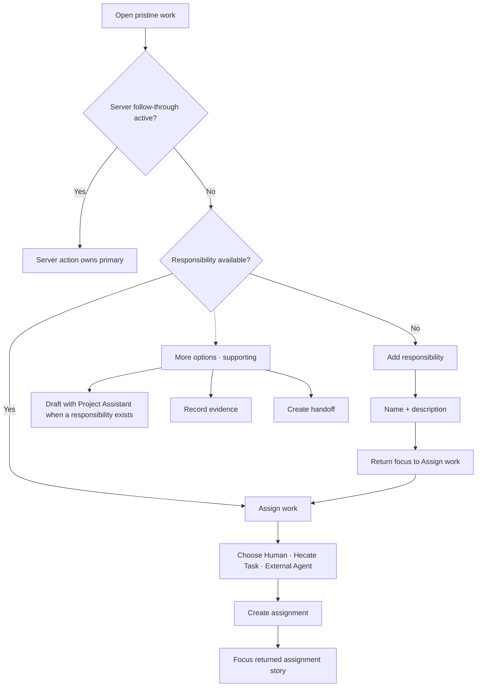
```mermaid
flowchart TD
  A["Open pristine work"] --> B{"Server follow-through active?"}
  B -->|"Yes"| S["Server action owns primary"]
  B -->|"No"| C{"Responsibility available?"}
  C -->|"No"| D["Add responsibility"]
  D --> E["Name + description"]
  E --> F["Return focus to Assign work"]
  C -->|"Yes"| G["Assign work"]
  F --> G
  G --> H["Choose Human · Hecate Task · External Agent"]
  H --> I["Create assignment"]
  I --> J["Focus returned assignment story"]
  C -.-> M["More options · supporting"]
  M --> P["Draft with Project Assistant when a responsibility exists"]
  M --> V["Record evidence"]
  M --> K["Create handoff"]
```

Role-backed pristine work presents direct **Assign work** as its only routine
primary action. A roleless project first exposes the smallest useful
responsibility form: Name and Description, with instructions, execution
defaults, and skills behind disclosure. Assistant drafting, evidence, and
handoff remain available under **More options** without competing with the
kickoff. The idle Assistant follows selected-work detail in a collapsed native
disclosure and opens when progress, a proposal, inspected context, a result, or
an error needs attention.

Selected-work kickoff is presentation over existing Cairnline role and
assignment mutations. **Add responsibility** creates only the returned role;
**Assign work** creates only the returned assignment. Neither action chains
creation, launches work, or persists another workflow phase. Disclosure and
focus targets remain UI state only.

## Shareable Navigation

The address is a restorable view request, not project state. Cairnline remains
the sole authority for whether a project or work item exists; the UI validates
identifiers through Hecate's existing facade after loading the relevant
catalog. It never creates a local placeholder record from a URL.

Operator workspace, project, tab, and work-item choices use browser history
pushes. Initial canonicalization, automatic selection of an omitted project or
Work item, record deletion, and the onboarding return to Overview replace the
current entry. Back/Forward listens to `popstate` and reapplies the URL. A
remembered local workspace/project is only a fallback when the address does not
name one.

While the catalog is loading, the link remains intact. A missing project shows
a dedicated empty state without requesting its subresources. A missing work
item leaves the project's Work queue available without loading the first item
as a substitute. A project whose server readiness still requires onboarding
returns to its guided Overview state. Browser links can be copied and used
against the same Hecate runtime; they are not a Cairnline export or an
authorization capability. The Tauri webview has no address bar, native copy-link
control, or OS deep-link handler in this slice.

## Work-Item Follow-Through Rail

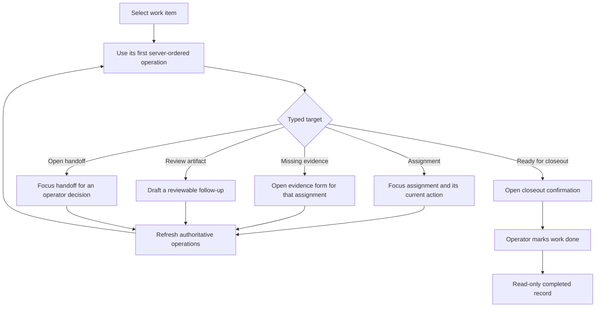
```mermaid
flowchart TD
  A["Select work item"] --> B["Use its first server-ordered operation"]
  B --> C{"Typed target"}
  C -->|"Assignment"| D["Focus assignment and its current action"]
  C -->|"Missing evidence"| E["Open evidence form for that assignment"]
  C -->|"Review artifact"| F["Draft a reviewable follow-up"]
  C -->|"Open handoff"| G["Focus handoff for an operator decision"]
  C -->|"Ready for closeout"| H["Open closeout confirmation"]
  D --> K["Refresh authoritative operations"]
  E --> K
  F --> K
  G --> K
  K --> B
  H --> I["Operator marks work done"]
  I --> J["Read-only completed record"]
```

The rail never parses blocker copy or invents urgency. It uses the operation's
typed assignment, review artifact, or handoff identifier and checks that target
against the structured closeout readiness response. The same identifiers carry
Overview navigation into selected work, where focus lands on the intended
record. If no server operation promotes the selected item, its closeout checks
remain available without creating another primary action.
At narrow widths the rail stacks its action below the explanation, routine
forms collapse to one column, and focused records scroll into view with a
visible keyboard-focus target.

## Assignment Execution Story

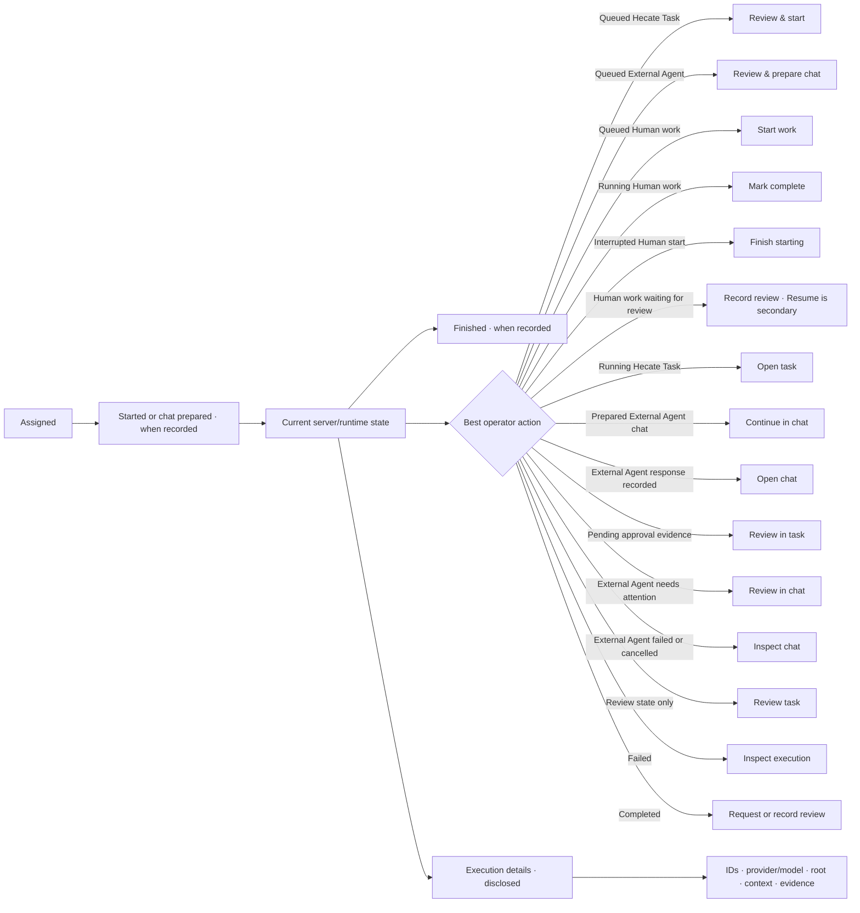
```mermaid
flowchart LR
  Q["Assigned"] --> S["Started or chat prepared · when recorded"]
  S --> C["Current server/runtime state"]
  C --> F["Finished · when recorded"]
  C --> A{"Best operator action"}
  A -->|"Queued Hecate Task"| L["Review & start"]
  A -->|"Queued External Agent"| EL["Review & prepare chat"]
  A -->|"Queued Human work"| H["Start work"]
  A -->|"Running Human work"| HC["Mark complete"]
  A -->|"Interrupted Human start"| HI["Finish starting"]
  A -->|"Human work waiting for review"| HR["Record review · Resume is secondary"]
  A -->|"Running Hecate Task"| T["Open task"]
  A -->|"Prepared External Agent chat"| EC["Continue in chat"]
  A -->|"External Agent response recorded"| EO["Open chat"]
  A -->|"Pending approval evidence"| P["Review in task"]
  A -->|"External Agent needs attention"| ER["Review in chat"]
  A -->|"External Agent failed or cancelled"| EI["Inspect chat"]
  A -->|"Review state only"| U["Review task"]
  A -->|"Failed"| I["Inspect execution"]
  A -->|"Completed"| R["Request or record review"]
  C --> D["Execution details · disclosed"]
  D --> E["IDs · provider/model · root · context · evidence"]
```

The execution rail uses only recorded `created_at`, `started_at`, and
`completed_at`/runtime `finished_at` timestamps. It presents the current status
as a snapshot when no transition time exists and never treats `updated_at` as
execution history. For External Agent work, the recorded preparation timestamp
is labeled **Chat prepared**, not execution started.

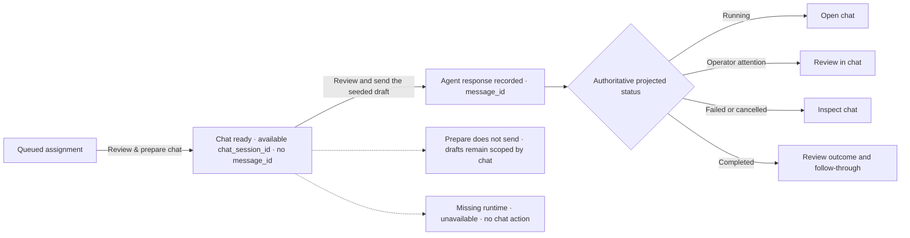
```mermaid
flowchart LR
  Q["Queued assignment"] -->|"Review & prepare chat"| P["Chat ready · available chat_session_id · no message_id"]
  P -->|"Review and send the seeded draft"| A["Agent response recorded · message_id"]
  P -.-> N["Prepare does not send · drafts remain scoped by chat"]
  P -.-> U["Missing runtime · unavailable · no chat action"]
  A --> S{"Authoritative projected status"}
  S -->|"Running"| O["Open chat"]
  S -->|"Operator attention"| R["Review in chat"]
  S -->|"Failed or cancelled"| I["Inspect chat"]
  S -->|"Completed"| F["Review outcome and follow-through"]
```

The first successful prepare seeds one editable launch draft in the linked
chat; it does not append a prompt or start an agent turn. Unsent drafts remain
scoped by chat, so returning through **Continue in chat** restores the linked
session's edit instead of another chat's text. A transient first selection
failure retains the seed for retry. After an app reload, the transient draft
map is empty and Projects derives a fallback from the current canonical
assignment; a live edit or intentional clear remains authoritative within the
running app. A projected `message_id` records agent response continuity;
assignment/runtime status still decides whether Projects offers **Open chat**,
**Review in chat**, or **Inspect chat**. A missing runtime offers none of those
chat actions. This presentation uses the existing Cairnline-backed assignment
and Hecate execution reference; the browser does not persist a second
prepared/active state.

Pending approvals, failures, missing runtime links, and an unprepared External
Agent chat remain visible outside the disclosure. Blocked closeout guidance
follows the assignments it describes; ready and completed closeout stays
promoted near the work brief. Because the current Hecate facade also maps
Cairnline's `awaiting_review` to `awaiting_approval`, the cockpit uses neutral
review language unless a linked runtime reports a pending approval.

## Verified Screen States

The implemented slices were exercised in the running Hecate UI with deterministic
fixtures for the Cairnline-backed Hecate facade at desktop and 390px widths.
Empty, guided-setup, setup-unavailable, loading, active, blocked,
approval-review, interrupted-start, completed, failed, cancelled, evidence, and
closeout states are covered by focused component and journey tests. Failure and
cancellation use an explicit second confirmation, including for keyboard
submission. A prepared Human claim is shown as blocked rather than as a
recoverable interrupted start, and queued progress changes are saved separately
from destination edits.

The deterministic follow-through journey verifies exact assignment, handoff,
review-artifact, and closeout focus against same-work decoys; narrow-width
containment before test-driven scrolling; explicit closeout; and the durable
read-only completed state. Focus requests for records that disappeared fail
closed to the selected work item with an announced refresh action. Unexpected
fixture routes fail the journey instead of receiving generic success data.

The supporting-surface journey starts rootless at 390px and verifies that folder
discovery stays unavailable while manual memory and work remain usable. It
checks long-content containment in the Memory form and saved entry, the
rootless Skills state, attached-folder source and skill discovery, collapsed
supporting details, skill editing through the existing mutation, and containment
again with registered skill details expanded. Project Settings is exercised
from its in-workspace onboarding action and header action: the inspector heading
receives focus, **Back** restores the exact origin, successful saves restore the
same semantic origin after project refresh, and the workspace is replaced only
at 390px. Focused tests cover loading, empty, error, pending and resolved memory
suggestions, immediate rejected-history projection, rejection races, exact
workspace values, Cairnline's independent default/active root fields, new-root
ID resolution, non-primary preset selection, and locked Memory, Source,
Settings, and Agent Preset saves.

The navigation journey opens a non-first work item from its exact browser link,
moves to Memory, returns with Back, reloads the work item, crosses to Chats and
back, and repeats the reload at 390px without horizontal overflow. A separate
fail-closed journey keeps missing project and work-item identifiers in the
address, loads no unrelated detail, and leaves the valid Work queue available.

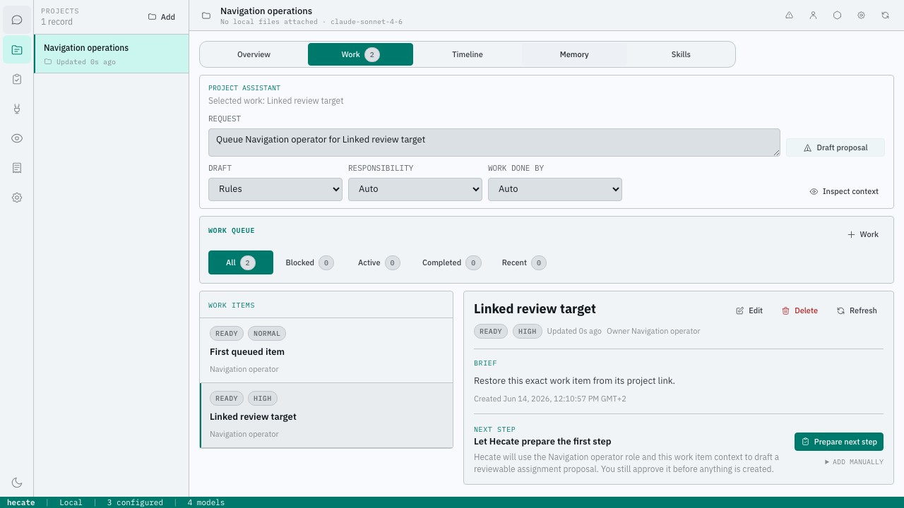

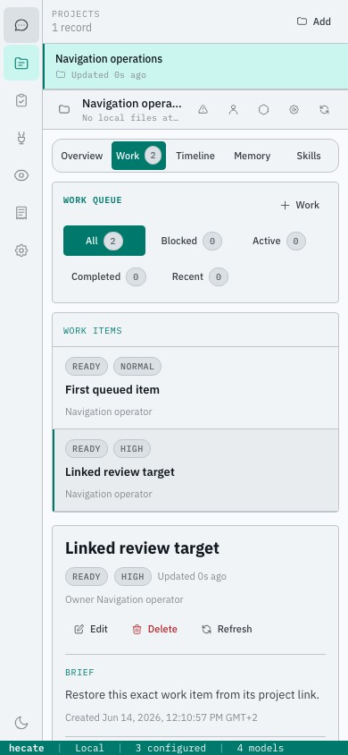

Regenerate these images from `ui/` with
`HECATE_CAPTURE_PROJECTS_NAVIGATION=1 bunx playwright test e2e/projects.spec.ts -g "Projects links restore exact work"`.

The guided-start slice includes deterministic desktop and narrow reference
captures for the Overview-hosted first-work-ready state:

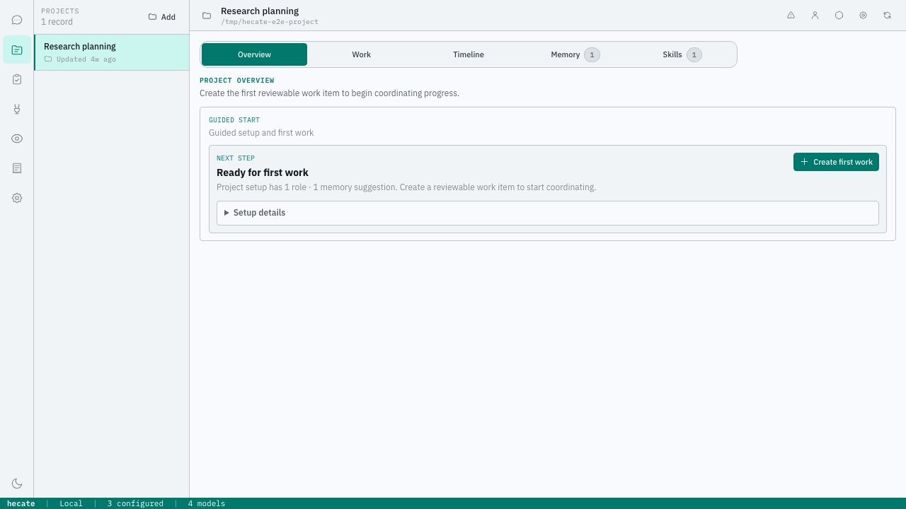

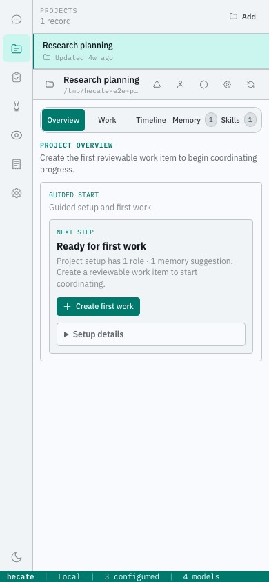

Regenerate both images from `ui/` with
`HECATE_CAPTURE_PROJECTS_GUIDED_START=1 bunx playwright test e2e/projects.spec.ts -g "Projects guided start"`.

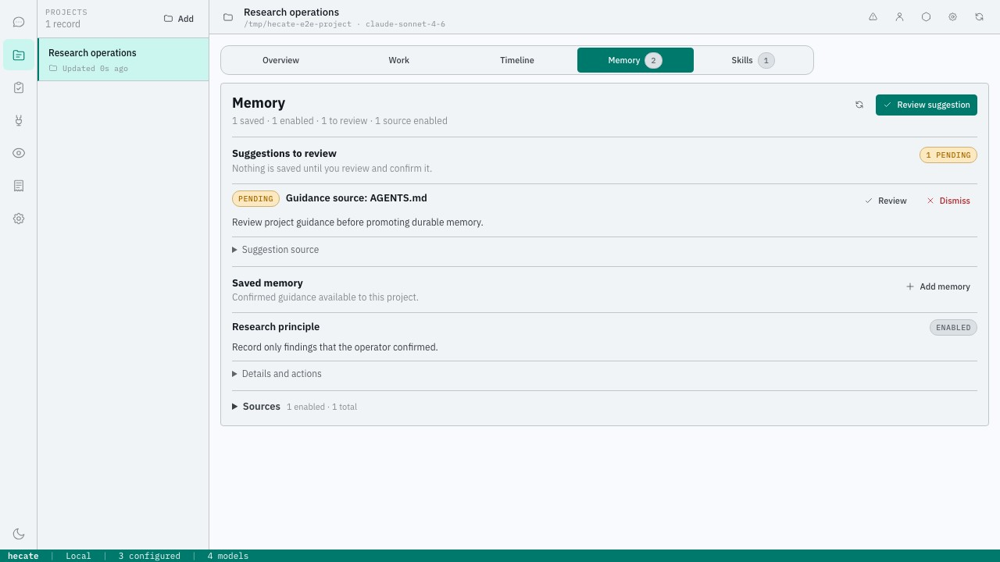

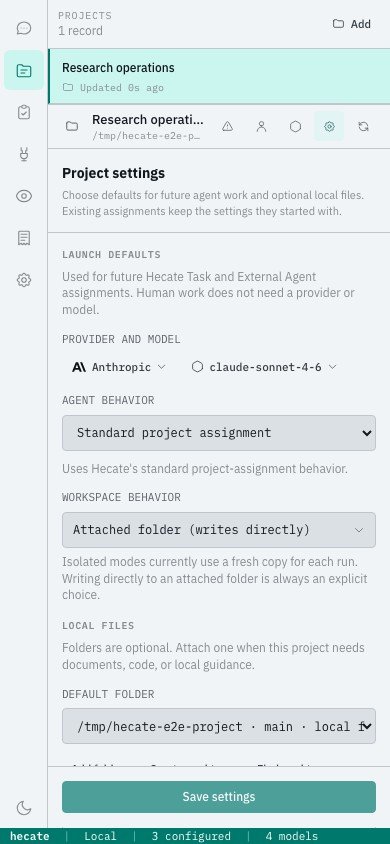

Regenerate these images with
`HECATE_CAPTURE_PROJECTS_SUPPORTING=1 bunx playwright test e2e/projects.spec.ts -g "Projects supporting surfaces stay read-first"`
from `ui/`.

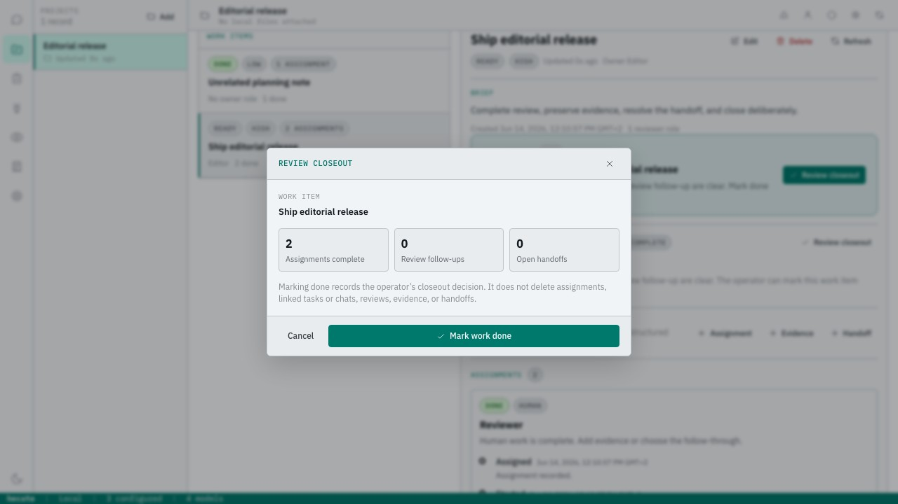

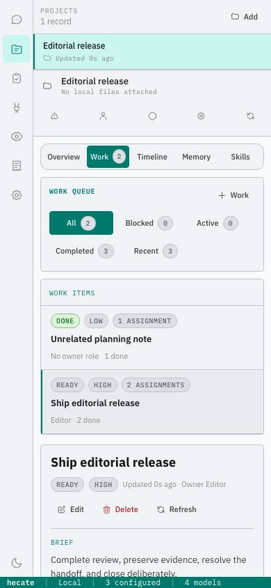

Regenerate these images with
`HECATE_CAPTURE_PROJECTS_FOLLOW_THROUGH=1 bunx playwright test e2e/projects.spec.ts -g "Projects follow-through journey"`
from `ui/`.

Regenerate the two Overview images from the deterministic browser journey with
`HECATE_CAPTURE_PROJECTS_OVERVIEW=1 bunx playwright test e2e/projects.spec.ts -g "default ready-project home"` from `ui/`.
This targeted journey is the canonical generator for these two JPGs; the general
documentation capture script continues to own `projects.png`.

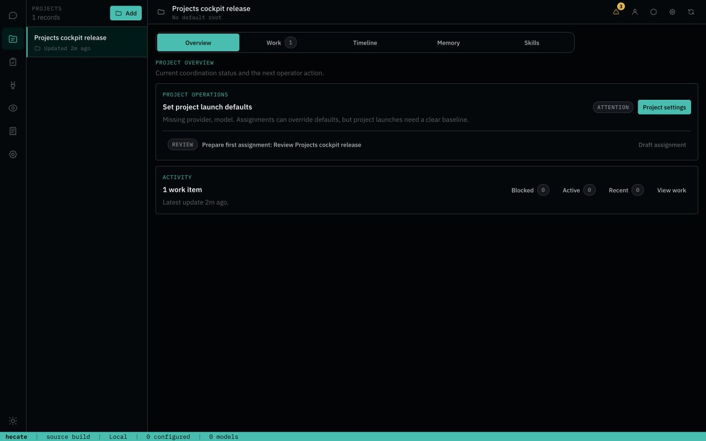

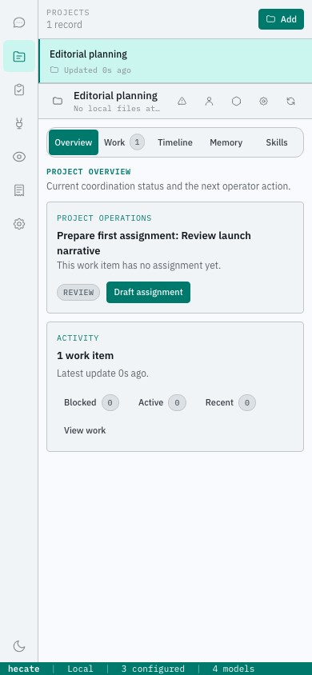

Regenerate the assignment execution images from the deterministic full Projects
journey with
`HECATE_CAPTURE_PROJECTS_EXECUTION=1 bunx playwright test e2e/projects.spec.ts -g "Projects journey"`
from `ui/`.

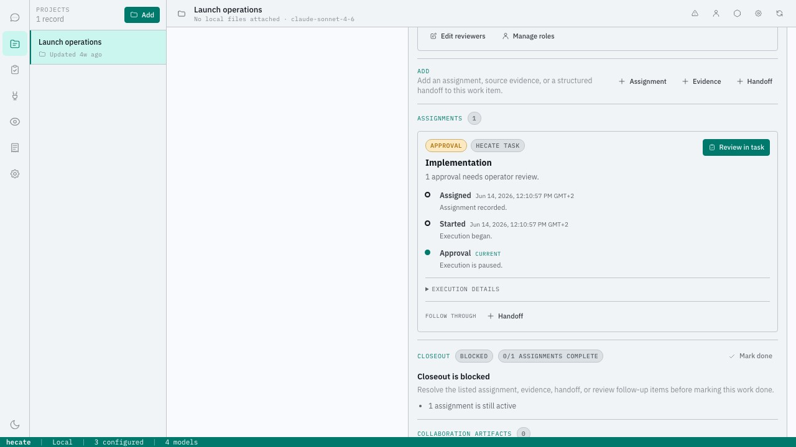

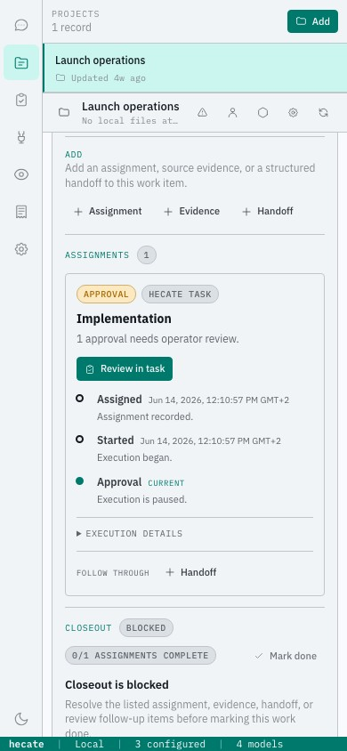

The External Agent continuity journey verifies queued preparation, the
non-sending **Chat ready** state, a recorded agent turn, exact return to the
originating work item, and desktop/390px containment:

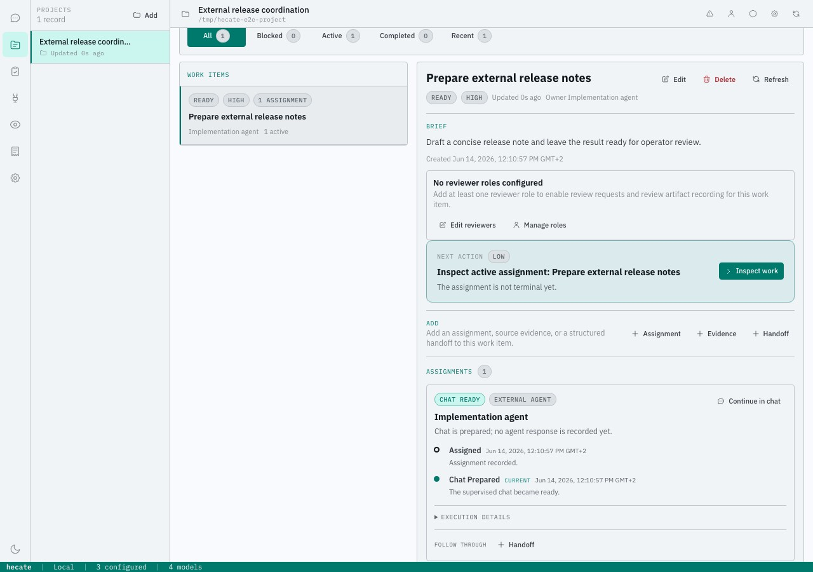

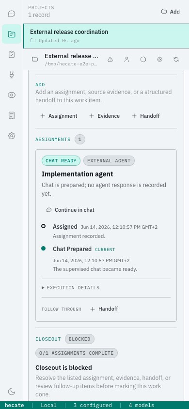

Regenerate both images from `ui/` with
`HECATE_CAPTURE_PROJECTS_EXTERNAL=1 bunx playwright test e2e/projects.spec.ts -g "Projects External Agent continuity"`.

The selected-work kickoff journey verifies a roleless direct path and produces
both the pristine kickoff and resulting Human assignment references. Regenerate
all four from `ui/` with
`HECATE_CAPTURE_PROJECTS_KICKOFF=1 HECATE_CAPTURE_PROJECTS_HUMAN=1 bunx playwright test e2e/projects.spec.ts -g "Projects selected-work kickoff"`.

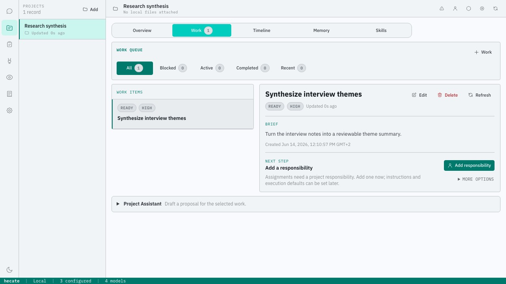

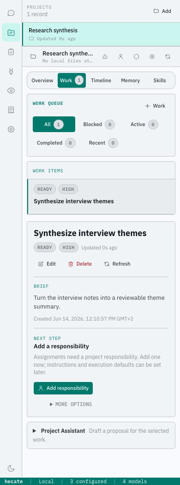

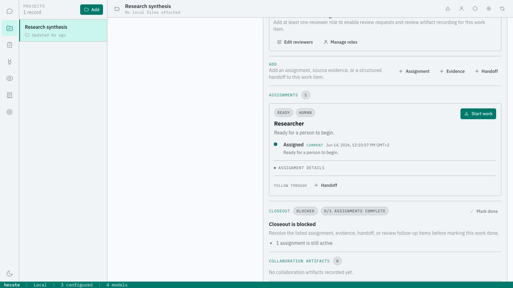

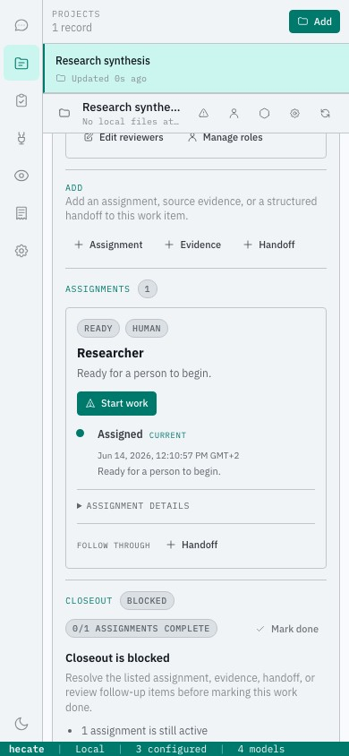

## Contract Stop Lines

- Cairnline remains the sole portable coordination authority. The UI uses only
  Hecate's facade and never reconstructs portable state.
- Guided start treats `show_onboarding`, `setup_started`, `first_work_ready`,
  checklist status, and typed setup actions as server-owned projections. The UI
  does not persist or infer another setup phase, and it never applies setup or
  creates first work without the operator's explicit action.
- Selected-work kickoff uses existing Cairnline role and assignment mutations.
  Responsibility creation and assignment creation are separately confirmed;
  neither action chains another write, starts execution, or persists a local
  workflow phase.
- External Agent continuity is derived from the existing assignment status and
  execution reference. An available `chat_session_id` without `message_id` may
  change the presentation to **Chat ready**, but it does not create a
  browser-owned lifecycle phase or prove that a prompt was sent. A missing
  runtime stays unavailable. Reopening the linked chat is navigation only and
  must restore only that chat's unsent operator input, or derive canonical
  launch context when transient composer state was cleared by an app reload.
- The URL records presentation intent only. It may name a workspace, project
  view, and work item, but it never creates portable state, proves that a record
  exists, grants runtime permission, or substitutes for Cairnline validation.
- Operations route through the server-provided `action.type`; `kind`, target
  metadata, and client activity are not alternate priority authorities.
- Selected-work follow-through preserves the exact server operation the
  operator chose, including when several operations target the same work item;
  after that operation disappears from a loaded authoritative brief, the rail
  advances in server order. Direct work selection also starts in server order.
  It may validate and focus a typed assignment, review artifact, or handoff
  target, but it must not rank local blockers or parse display copy into
  actions. A missing exact target remains guarded across pending or failed
  refreshes until the record appears or the loaded brief removes the target.
- Closeout readiness exposes `missing_evidence_assignment_ids`,
  `review_follow_up_artifact_ids`, and `open_handoff_ids` for exact routing.
  Cairnline remains the authority for those records and their readiness; Hecate
  does not reconstruct them from rendered blocker text.
- A completed assignment is not a completed work item. Only the explicit
  operator closeout transition produces the read-only `done` state.
- Health remains a secondary inspector because a root can be optional for
  coordination even when health reports that launches need one.
- Human is a product label for Cairnline's `manual` execution mode, not a
  second identity or assignment store. V1 does not add named assignees or due
  dates. A root remains optional, and direct progress actions use the
  Cairnline-authoritative assignment lifecycle.
- Cairnline `awaiting_review` is not yet distinct in Hecate's assignment view.
  The execution story therefore says review, not approval, unless Hecate has a
  positive pending-approval count. Review artifacts, handoffs, and closeout
  follow-up remain the honest review surfaces.
- Failed and cancelled assignments are terminal closeout blockers in Cairnline,
  which does not yet expose retry or supersession. This slice keeps that outcome
  visible and does not offer a misleading local recovery action.
- An execution timeline may show current Cairnline milestones and Hecate runtime
  events, but must not invent a portable transition history Cairnline does not
  store.
- Task reconciliation advances only from a Task and latest Run whose project,
  work-item, and assignment links match the portable row. Old resumed runs and
  cross-assignment links are evidence, not lifecycle authority.
