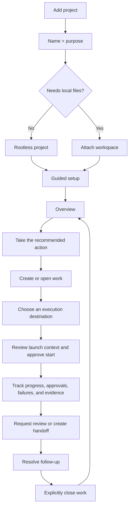

# Projects Cockpit UX

> **Status:** Proposal with the overview-first slice implemented.
>
> **Current source of truth:** [Projects](../../operator/projects.md),
> [Projects design](../accepted/projects.md), and the Hecate
> `/hecate/v1/projects*` facade.

## UX Audit

The Projects implementation has strong coordination contracts but presents too
many of them at once. `ProjectsView` correctly owns data loading and mutations,
while `ProjectWorkspaceView` composes setup, Project Assistant, operations,
activity, the work queue, and selected-work detail. Before this redesign, ready
projects opened directly on that whole Work surface.

Concrete issues from the current UI and browser behavior:

- There was no project Overview. Project Assistant, Project Operations, Resume,
  queue filters, the work list, and selected detail all appeared in the default
  path and competed to be the next action.
- Resume derived another priority from activity even though the ordered
  operations brief is the server authority for the best operator action.
- Long workspace-tab labels required four 148px tracks and horizontal overflow.
- At a 390px viewport, the fixed 220px project index left roughly 120px for the
  workspace, reducing routine copy to one-word lines.
- The committed Projects screenshot predates Project Operations and no longer
  represents the current information hierarchy.
- Browser tests cover setup, rootless work, assignment launch, evidence, and
  closeout, but not a default overview or narrow navigation.

Existing strengths stay intact: rootless creation is first-class, setup and
assistant changes remain reviewable, launch preflight is explicit, evidence is
generic provenance, and review, handoff, memory promotion, and closeout remain
operator-controlled.

## Design Thesis

- **Visual thesis:** calm technical hierarchy with the server's next action as
  the only accent.
- **Content plan:** workspace navigation, next action, activity continuity, then
  the full work surface.
- **Interaction thesis:** overview actions route to the exact existing surface;
  activity controls navigate rather than invent priority; the project index
  stacks above the workspace at narrow widths.

## Target Information Architecture

Overview uses `setup-readiness`, the first ordered `operations` item, and
activity counts already loaded through Hecate. Work continues to own the queue,
selected work item, Project Assistant, assignments, evidence, handoffs, review,
and closeout. Timeline, Memory, Skills, Roles, Agent Presets, roots, sources, and
runtime detail stay supporting surfaces.

## Operator Journey

## Reviewable Slices

1. **Overview-first shell:** default to Overview, show the server's first
   operation as the primary action, keep activity as navigation, move the full
   queue/detail to Work, shorten tabs, repair narrow layout, and add focused
   journey coverage.
2. **Work-item execution story:** reshape dense assignment rows into a readable
   execution timeline with technical evidence behind disclosure.
3. **Assignment destinations:** expose plain Human, Hecate Task, and External
   Agent choices after the Hecate facade faithfully maps Cairnline's portable
   `manual` execution mode.
4. **Review, handoff, and closeout rail:** make follow-through legible without
   auto-dispatching or auto-closing work.
5. **Supporting inspectors and navigation:** progressively disclose context and
   runtime detail, then add shareable project/work navigation and broader
   accessibility coverage.

Slice 1 has the highest usability gain and lowest contract risk because it only
rearranges existing server projections and action routing. It adds no project
records, local lifecycle state, endpoint, or client-side action ordering.

## Verified Screen States

The implemented slice was exercised against the live Hecate UI and Cairnline
backend at desktop and 390px widths. Empty and guided-setup states were checked
in the browser; loading, active, blocked, review, and completed projections are
covered by focused component and journey tests.

## Contract Stop Lines

- Cairnline remains the sole portable coordination authority. The UI uses only
  Hecate's facade and never reconstructs portable state.
- Operations route through the server-provided `action.type`; `kind`, target
  metadata, and client activity are not alternate priority authorities.
- Health remains a secondary inspector because a root can be optional for
  coordination even when health reports that launches need one.
- Human/manual assignment is deferred: Cairnline supports `manual`, but the
  current Hecate assignment facade exposes Hecate Task and External Agent.
- Cairnline `awaiting_review` is not yet distinct in Hecate's assignment view.
  Review artifacts, handoffs, and closeout follow-up remain the honest review
  surfaces.
- An execution timeline may show current Cairnline milestones and Hecate runtime
  events, but must not invent a portable transition history Cairnline does not
  store.
