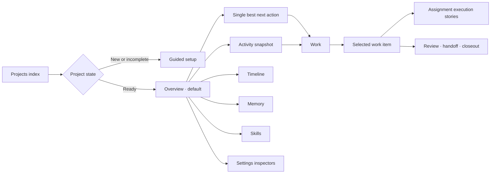
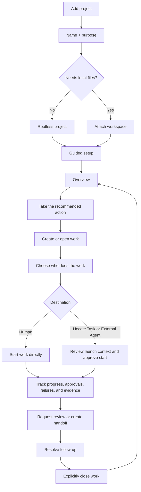
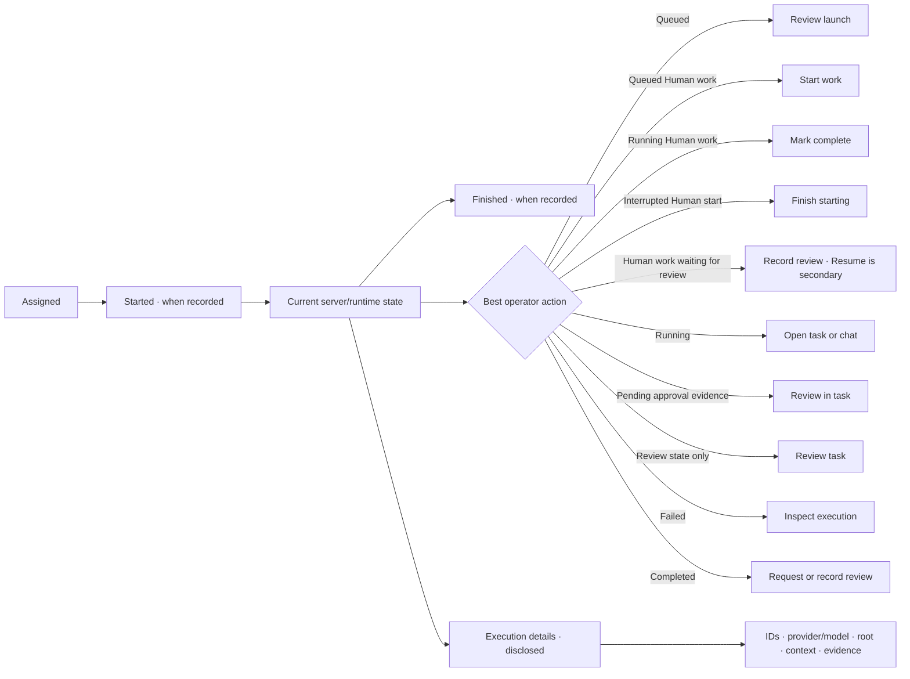

# Projects Cockpit UX

> **Status:** Proposal with the overview-first, work-item execution, and
> assignment-destination slices implemented.
>
> **Current source of truth:** [Projects](../../operator/projects.md),
> [Projects design](../accepted/projects.md), and the Hecate
> `/hecate/v1/projects*` facade.

## UX Audit

The Projects implementation has strong coordination contracts but presents too
many of them at once. `ProjectsView` correctly owns data loading and mutations,
while `ProjectWorkspaceView` composes setup, Project Assistant, operations,
activity, the work queue, and selected-work detail. Before this redesign, ready
projects opened directly on that whole Work surface.

Concrete issues from the current UI and browser behavior:

- There was no project Overview. Project Assistant, Project Operations, Resume,
  queue filters, the work list, and selected detail all appeared in the default
  path and competed to be the next action.
- Resume derived another priority from activity even though the ordered
  operations brief is the server authority for the best operator action.
- Long workspace-tab labels required four 148px tracks and horizontal overflow.
- At a 390px viewport, the fixed 220px project index left roughly 120px for the
  workspace, reducing routine copy to one-word lines.
- The committed Projects screenshot predates Project Operations and no longer
  represents the current information hierarchy.
- Browser tests cover setup, rootless work, assignment launch, evidence, and
  closeout, but not a default overview or narrow navigation.
- Assignment forms exposed implementation-shaped role/driver language, and the
  Hecate facade did not preserve Cairnline's `manual` destination for human
  work.

Existing strengths stay intact: rootless creation is first-class, setup and
assistant changes remain reviewable, launch preflight is explicit, evidence is
generic provenance, and review, handoff, memory promotion, and closeout remain
operator-controlled.

## Design Thesis

- **Visual thesis:** calm technical hierarchy with the server's next action as
  the only accent.
- **Content plan:** workspace navigation, next action, activity continuity, then
  the full work surface.
- **Interaction thesis:** overview actions route to the exact existing surface;
  activity controls navigate rather than invent priority; the project index
  stacks above the workspace at narrow widths.

## Target Information Architecture

Overview uses `setup-readiness`, the first ordered `operations` item, and
activity counts already loaded through Hecate. Work continues to own the queue,
selected work item, Project Assistant, assignments, evidence, handoffs, review,
and closeout. Timeline, Memory, Skills, Roles, Agent Presets, roots, sources, and
runtime detail stay supporting surfaces.

## Operator Journey

## Reviewable Slices

1. **Overview-first shell:** default to Overview, show the server's first
   operation as the primary action, keep activity as navigation, move the full
   queue/detail to Work, shorten tabs, repair narrow layout, and add focused
   journey coverage.
2. **Work-item execution story:** reshape dense assignment rows into a readable
   execution timeline with technical evidence behind disclosure.
3. **Assignment destinations:** expose plain Human, Hecate Task, and External
   Agent choices after the Hecate facade faithfully maps Cairnline's portable
   `manual` execution mode.
4. **Review, handoff, and closeout rail:** make follow-through legible without
   auto-dispatching or auto-closing work.
5. **Supporting inspectors and navigation:** progressively disclose context and
   runtime detail, then add shareable project/work navigation and broader
   accessibility coverage.

Slices 1 through 3 are implemented. Slice 1 rearranges existing server
projections and action routing. Slice 2 reshapes each assignment into a
state-driven story. Slice 3 adds Human as a faithful facade label for
Cairnline's `manual` execution mode, with direct Start work, Resume work, and
Mark complete actions backed by Cairnline claim/status/completion transitions.
None of the slices add local project lifecycle state or inferred execution
events.

## Assignment Execution Story

The execution rail uses only recorded `created_at`, `started_at`, and
`completed_at`/runtime `finished_at` timestamps. It presents the current status
as a snapshot when no transition time exists and never treats `updated_at` as
execution history. Pending approvals, failures, missing runtime links, and an
unprepared External Agent chat remain visible outside the disclosure. Blocked
closeout guidance follows the assignments it describes; ready and completed
closeout stays promoted near the work brief. Because the current Hecate facade
also maps Cairnline's `awaiting_review` to `awaiting_approval`, the cockpit uses
neutral review language unless a linked runtime reports a pending approval.

## Verified Screen States

The implemented slices were exercised in the running Hecate UI with deterministic
fixtures for the Cairnline-backed Hecate facade at desktop and 390px widths.
Empty, guided-setup, setup-unavailable, loading, active, blocked,
approval-review, interrupted-start, completed, failed, cancelled, evidence, and
closeout states are covered by focused component and journey tests. Failure and
cancellation use an explicit second confirmation, including for keyboard
submission. A prepared Human claim is shown as blocked rather than as a
recoverable interrupted start, and queued progress changes are saved separately
from destination edits.

Regenerate the two Overview images from the deterministic browser journey with
`HECATE_CAPTURE_PROJECTS_OVERVIEW=1 bunx playwright test e2e/projects.spec.ts -g "default ready-project home"` from `ui/`.
This targeted journey is the canonical generator for these two JPGs; the general
documentation capture script continues to own `projects.png`.

Regenerate the assignment execution images from the deterministic full Projects
journey with
`HECATE_CAPTURE_PROJECTS_EXECUTION=1 bunx playwright test e2e/projects.spec.ts -g "Projects journey"`
from `ui/`.

Regenerate the rootless Human assignment images from the deterministic browser
journey with
`HECATE_CAPTURE_PROJECTS_HUMAN=1 bunx playwright test e2e/projects.spec.ts -g "Projects Human assignment journey"`
from `ui/`.

## Contract Stop Lines

- Cairnline remains the sole portable coordination authority. The UI uses only
  Hecate's facade and never reconstructs portable state.
- Operations route through the server-provided `action.type`; `kind`, target
  metadata, and client activity are not alternate priority authorities.
- Health remains a secondary inspector because a root can be optional for
  coordination even when health reports that launches need one.
- Human is a product label for Cairnline's `manual` execution mode, not a
  second identity or assignment store. V1 does not add named assignees or due
  dates. A root remains optional, and direct progress actions use the
  Cairnline-authoritative assignment lifecycle.
- Cairnline `awaiting_review` is not yet distinct in Hecate's assignment view.
  The execution story therefore says review, not approval, unless Hecate has a
  positive pending-approval count. Review artifacts, handoffs, and closeout
  follow-up remain the honest review surfaces.
- Failed and cancelled assignments are terminal closeout blockers in Cairnline,
  which does not yet expose retry or supersession. This slice keeps that outcome
  visible and does not offer a misleading local recovery action.
- An execution timeline may show current Cairnline milestones and Hecate runtime
  events, but must not invent a portable transition history Cairnline does not
  store.
- Task reconciliation advances only from a Task and latest Run whose project,
  work-item, and assignment links match the portable row. Old resumed runs and
  cross-assignment links are evidence, not lifecycle authority.
