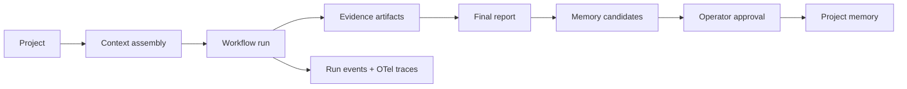

# Workflow Runbooks V0

> **Status:** proposed.
> **Current source of truth:** [Runtime API](../../runtime/runtime-api.md),
> [Agent runtime](../../runtime/agent-runtime.md),
> [Context assembly and injection boundaries](context-assembly-and-injection-boundaries.md),
> [Agent memory](agent-memory.md), and [Security](../../operator/security.md)
> for today's task, context, approval, artifact, memory, and sandbox behavior.
> **Implemented prerequisite:** Hecate now has a small native
> `browser_inspect` evidence capability for browser-enabled native
> project-assignment tasks. It is local-only, approval-gated, exact-origin,
> fresh-profile, script-disabled, `GET`/`HEAD`-only, and produces bounded
> static text evidence. It is
> not this proposal's runbook engine and is not interactive browser automation,
> visual capture, persistent browser state, Hecate Chat, or External Agent
> support.
> **Next action:** prototype a report-only `qa` workflow using existing task
> runs, context packets, artifacts, approvals, memory candidates, and traces
> before adding a standalone workflow engine.

Hecate already has most of the substrate needed for repeatable agent workflows:
projects, task runs, `agent_loop`, approvals, artifacts, project memory,
context packets, External Agent supervision, and OpenTelemetry traces. This
proposal adds a small typed runbook layer that names common operator intents
without creating a parallel memory, prompt, or execution system.

The immediate inspiration is the pattern family visible in
[`garrytan/gstack`](https://github.com/garrytan/gstack): named workflow
commands, browser-backed evidence, diff-aware QA, production-risk review,
root-cause investigation, final-mile shipping checks, design review, and
explicit final reports. Accessed 2026-06-04. Hecate should borrow the portable
patterns, not the implementation, dependency graph, or host-specific runtime
assumptions.

## Summary

Workflow runbooks are named, typed task patterns. A runbook declares:

- mode and inputs
- allowed tools and permissions
- approval gates
- evidence artifacts
- stop conditions
- final report requirements
- optional memory candidates for operator review

The intended flow is:



## Useful Patterns

Patterns Hecate should translate:

- **Named workflow modes.** `review`, `investigate`, `qa`, `ship`,
  `security-audit`, and `design-review` are clearer than asking a model to
  infer posture from a free-form prompt.
- **Runbooks over personas.** The useful unit is expected steps, evidence, and
  stop conditions, not just a tone or role prompt.
- **Evidence artifacts.** Screenshots, accessibility snapshots, logs, diffs,
  test output, and final reports make workflow results reviewable.
- **Diff-aware QA.** QA and review should bias toward changed surfaces, changed
  files, and observed regressions.
- **Production-risk review.** A workflow can ask what could fail in production
  after ordinary tests pass.
- **Root-cause investigation.** Investigation should collect evidence and stop
  on uncertainty rather than racing to a speculative fix.
- **Final-mile shipping.** A shipping mode can require clean status, tests,
  release notes, CI evidence, and explicit approval before mutating GitHub or
  deployment state.
- **Browser-backed design review.** A browser can capture visual and
  accessibility evidence that unit tests do not see.

Patterns to avoid or delay:

- Claude Code-specific slash-command mechanics.
- Bun-specific daemon/runtime assumptions.
- Global host install hooks or silent modification of external agent settings.
- Raw CDP access without a deny-default allowlist.
- Cookie import, logged-in browser sessions, or remote browser tunneling in v0.
- Workflows that auto-fix, push, deploy, or write memory without explicit
  operator approval.
- External telemetry defaults. Hecate remains local-first.

## Hecate Translation

Runbooks should sit on top of current Hecate primitives:

| Concern       | Hecate-native representation                                                                |
| ------------- | ------------------------------------------------------------------------------------------- |
| Project scope | `project_id`, project workspace/defaults, project memory, project work records.             |
| Context       | Context packet assembled before the workflow run.                                           |
| Execution     | Existing task/run machinery, initially `agent_loop` plus typed metadata.                    |
| Permissions   | Existing sandbox, WorkspaceFS, ProcessRunner, GitRunner, MCP policy, and approval settings. |
| Approvals     | Blocking `TaskApproval` records with workflow metadata.                                     |
| Evidence      | Task artifacts plus run events.                                                             |
| Observability | Parent workflow span, per-step spans, trace id on events and artifacts.                     |
| Lessons       | Project memory candidates, promoted only by explicit operator action.                       |

V0 should avoid a new durable workflow store. Store runbook metadata on the
task/run or as a small `workflow_manifest` artifact. If the experiment proves
valuable, promote workflow state to first-class storage later with the normal
memory/SQLite parity rule.

## Named Workflow Modes

Initial built-in modes:

| Mode             | Primary question                                        | Default posture                      |
| ---------------- | ------------------------------------------------------- | ------------------------------------ |
| `review`         | What changed, and what risks or regressions are likely? | Read-only, diff-aware.               |
| `investigate`    | What is the root cause?                                 | Evidence-first, no speculative fix.  |
| `qa`             | Does the changed surface work from the user's view?     | Browser/test evidence, report-only.  |
| `ship`           | Is this ready to publish?                               | Gate on tests, status, and approval. |
| `security-audit` | What security or privacy risks changed?                 | Read-only, threat-model oriented.    |
| `design-review`  | Does the UI meet product/design expectations?           | Browser visual and AX evidence.      |

Modes are not models, providers, or personalities. They are runbook selectors
that constrain context, tools, evidence, and stop conditions.

## Minimal Typed Interface

Sketch:

```go
type WorkflowMode string

const (
    WorkflowReview        WorkflowMode = "review"
    WorkflowInvestigate   WorkflowMode = "investigate"
    WorkflowQA            WorkflowMode = "qa"
    WorkflowShip          WorkflowMode = "ship"
    WorkflowSecurityAudit WorkflowMode = "security-audit"
    WorkflowDesignReview  WorkflowMode = "design-review"
)

type RunbookSpec struct {
    ID              string
    Version         string
    Mode            WorkflowMode
    Title           string
    Description     string
    Inputs          []RunbookInputSpec
    DefaultPolicy   RunbookPolicy
    Steps           []RunbookStepSpec
    RequiredOutputs []ArtifactRequirement
    StopConditions  []StopCondition
}

type RunbookInputSpec struct {
    Name        string
    Type        string // string | bool | int | enum | path | url | ref
    Required    bool
    Description string
}

type RunbookPolicy struct {
    MutationsAllowed bool
    NetworkAllowed   bool
    BrowserAllowed   bool
    SecretAccess     string // none | explicit_approval
    ApprovalPolicy   string // auto | require_approval | block
}

type RunbookStepSpec struct {
    ID               string
    Kind             string // model_turn | shell_check | browser_check | diff_review | approval_gate
    PromptTemplate   string
    Tools            []string
    RequiresApproval bool
    EmitsArtifacts   []ArtifactRequirement
}

type ArtifactRequirement struct {
    Kind     string
    Required bool
}

type StopCondition struct {
    Kind   string // max_attempts | approval_rejected | failing_required_check | budget_exceeded | unsafe_permission | confidence_below_threshold
    Value  any
    Action string // fail | pause_for_approval | report_only
}
```

V0 can encode this as JSON metadata and validate it before creating the
underlying task. The typed Go shape can come when the first workflow endpoint
or built-in runbook registry lands.

## Inputs, Permissions, Approvals, Artifacts, And Stop Conditions

Common workflow inputs:

- `project_id`
- `workspace`
- `base_ref`
- `head_ref`
- `url`
- `risk_level`
- `allowed_mutations`
- `test_commands`
- `browser_evidence_target`
- `deployment_target`

Permission vocabulary should reuse existing Hecate concepts first:

- WorkspaceFS roots and read-only/write controls.
- ProcessRunner/GitRunner execution through sandbox policy.
- MCP server approval policy.
- Network egress policy.
- Implemented browser evidence as a separate, approval-gated task capability
  with exact origins; future stateful or interactive browser access needs a
  separate permission model.
- Future GitHub/deploy actions as explicit approval gates.

Approval gates should be ordinary blocking approvals. Workflow-specific detail
belongs in metadata:

```json
{
  "kind": "workflow.step_approval",
  "workflow_mode": "ship",
  "runbook_id": "builtin.ship.v0",
  "step_id": "push_branch",
  "requested_permission": "git_push"
}
```

Recommended first artifact kinds:

- `workflow_manifest`
- `workflow_report`
- `diff_summary`
- `risk_findings`
- `test_log`
- `browser_screenshot`
- `browser_ax_snapshot`
- `browser_console_log`
- `browser_network_log`
- `memory_candidate`

Stop conditions should be machine-readable and rendered in the final report.
The most important v0 condition is "report-only": if QA finds a failure, the run
reports evidence and stops rather than attempting a fix.

## Browser Support

The first implementation is intentionally smaller than a workflow browser
worker: `browser_inspect` lets a native project-assignment task load one
approved exact-origin page through an explicitly configured local
Chromium-compatible executable. Each call creates a fresh temporary profile,
requires a blocking approval, limits URL-loader traffic to the selected exact
origin using `GET`/`HEAD`, disables page scripts and service workers, blocks
downloads, and emits bounded static text evidence.
It accepts a page path but rejects credentials, query strings, and fragments so
those values do not enter task records. It does not attach to the operator's
browser, import cookies, reuse a logged-in session, click, type, upload, use a
device, or expose raw CDP.

The Agent Preset owns the exact origin list and Hecate snapshots it to the
native task at assignment launch. A preset can make several origins eligible,
but each approved call permits only its selected origin; another configured
origin is not a cross-origin subresource destination. Browser evidence is not inherited from
generic `network_allowed`, is not exposed to Hecate Chat or External Agents,
and is unavailable in remote runtime. Private-IP checking is initial
application-level preflight, not an OS-level network sandbox; stronger egress
controls remain an operator deployment responsibility. Even a `GET` request
can have an application-specific side effect, so each call remains explicitly
approval-gated.

Future workflow work should build on that narrow primitive in this order:

1. **Near-term:** use text evidence in report-only QA/runbook experiments and
   validate its approval and artifact UX.
2. **Later, if justified:** independently review visual capture or additional
   read-only evidence types with their own redaction and retention model.
3. **Much later:** consider stateful or interactive browser work only with a
   separate permission model and a clearly stronger isolation story.

### Browser Artifacts

The implemented artifact is `browser_evidence` (`text/plain`): redacted final
URL/origin, page title, a small accessibility summary, bounded console lines,
and network counters. It is intentionally not a screenshot, DOM dump, HAR,
browser profile, cookie export, storage export, request/response body, or raw
CDP transcript.

Potential future evidence types need separate review rather than piggybacking
on the current tool:

- screenshots or visual-diff artifacts
- fuller accessibility evidence
- capped DOM evidence when it is demonstrably safe and useful
- video replay, HAR bodies, or remote browser sharing

The first browser API should prefer narrow operations over raw CDP. Raw CDP
methods need a deny-default allowlist with per-method rationale.

## Browser State And Secret Protection

Browser workflows are high-risk because they can observe logged-in state.
Initial rules:

1. The implemented capability creates a new temporary profile per inspection;
   it never imports a host profile, cookies, extensions, or saved logins.
   That is not a hard identity-isolation boundary: OS or enterprise Chromium
   policy can still provide integrated authentication or client certificates.
2. It retains no browser storage or downloads and exposes no cookie, storage,
   request body, response body, screenshot, or raw-CDP artifact.
3. Requested URLs with credentials, queries, or fragments are rejected before
   tool-call persistence. Text evidence redacts final URLs and is bounded.
4. A future stateful or visual browser feature must not reuse this approval as
   authorization. It needs explicit state ownership, redaction, retention,
   audit events, and a separate permission decision.
5. Browser workers remain in Hecate's local-first threat model: useful
   application controls, not a VM boundary or complete network sandbox.

## Memory Candidates

Workflow lessons should use project memory candidates, not direct memory
writes.

Example candidate:

```go
type MemoryCandidate struct {
    Title       string
    Body        string
    ProjectID   string
    SourceKind  string // workflow_run
    SourceID    string // run_id
    EvidenceIDs []string
    TrustLabel  string // proposed_workflow_lesson
}
```

Candidate examples:

- "Browser QA for this project should start `just dev` before opening the UI."
- "The Settings page depends on provider discovery and may show a loading state
  on first paint."
- "Shipping requires updating the desktop release note when Tauri files
  change."

The operator may edit and promote a candidate into project memory. Until then,
the candidate remains a review artifact and is excluded from context packets.

## Proposed V0 Scope

The smallest useful experiment is a report-only `qa` runbook:

- input: `project_id`
- input: target `url`
- optional input: `base_ref` and `head_ref`
- optional input: one `test_command`
- context: project memory, repo guidance metadata, diff summary if available
- browser evidence: the existing approval-gated text-only `browser_evidence`
  artifact (redacted final URL/origin, title, small accessibility summary,
  bounded console lines, and network counters)
- output: final `workflow_report`
- optional output: project memory candidates
- mutation policy: no file writes, no Git writes, no deploys, no memory writes

This validates whether named runbooks plus evidence artifacts improve operator
trust before Hecate grows a full workflow engine.

## Non-goals

- Adding `garrytan/gstack` as a dependency.
- Replacing Hecate task runs with a separate workflow scheduler.
- Replacing context assembly, memory, artifacts, or OTel with workflow-specific
  subsystems.
- Supporting user-authenticated browser state in v0.
- Interactive navigation, clicking, typing, form submission, uploads, or
  downloads through the browser-evidence capability.
- Remote browser sharing or hosted browser sessions.
- Auto-fixing during `review`, `qa`, `security-audit`, or `design-review`.
- Auto-pushing, deploying, or opening ready PRs from `ship`.
- Automatic memory writes.

## Testing Strategy

- Unit tests for runbook validation, required inputs, permission resolution,
  stop-condition evaluation, and artifact requirements.
- API tests proving workflow metadata round-trips through task/run detail and
  stream snapshots.
- Artifact tests proving report and browser evidence artifacts carry
  `task_id`, `run_id`, `step_id`, `workflow_mode`, and `trace_id`.
- Redaction and privacy tests for browser text evidence and tool-call inputs.
- Fresh-profile browser smoke tests against a static local page.
- OTel tests proving workflow and step spans are correlated with task events.
- Memory-candidate tests proving generated lessons remain pending until an
  explicit promotion call.

## Open Questions

- Should built-in runbooks be hard-coded Go specs, embedded JSON files, or
  project-configurable records?
- Should workflow metadata live in `TaskRun`, task metadata, or a
  `workflow_manifest` artifact for v0?
- Which UI surface should show workflow reports: task detail, project activity,
  or a dedicated workflow tab?
- What evidence, if any, is worth adding beyond the current text-only,
  report-only browser inspection?
- What isolation and explicit permissions would interactive or stateful
  browser work require?
- Should `ship` integrate with GitHub connector flows or stay a checklist until
  PR/deploy permissions are better modeled?

## Recommended Next Implementation Step

Implement no broad framework first. Add a narrow design-backed experiment:

1. Define a built-in `qa` runbook spec in tests or an internal package.
2. Create one task/run metadata path for `workflow_mode=qa`.
3. Produce a `workflow_report` artifact from existing task infrastructure.
4. Use the implemented browser evidence only as an optional report input; do
   not add interactive or persistent browser behavior to the runbook skeleton.
