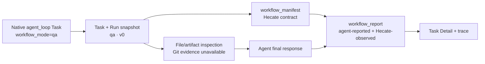

# Workflow Runbooks V0

> **Status:** partially implemented — report-only `qa` v0.
> **Current source of truth:** [Runtime API](../../runtime/runtime-api.md),
> [Agent runtime](../../runtime/agent-runtime.md),
> [Context assembly and injection boundaries](context-assembly-and-injection-boundaries.md),
> [Agent memory](agent-memory.md), and [Security](../../operator/security.md)
> for today's task, context, approval, artifact, memory, and sandbox behavior.
> **Implemented QA slice:** native `agent_loop` tasks may select
> `workflow_mode="qa"`. Hecate snapshots the built-in `v0` contract onto the
> Task and Run, emits a `workflow_manifest` before model work, admits only
> structured read-only inspection, and wraps a model final response in a
> versioned `workflow_report`. The report keeps agent-reported prose separate
> from Hecate-observed posture and evidence references.
> **Implemented prerequisite:** Hecate also has a small native
> `browser_inspect` evidence capability for browser-enabled native
> project-assignment tasks. It is local-only, approval-gated, exact-origin,
> fresh-profile, script-disabled, `GET`/`HEAD`-only, and produces bounded
> static text evidence. It is
> not this proposal's runbook engine and is not interactive browser automation,
> visual capture, persistent browser state, Hecate Chat, or External Agent
> support.
> **Deferred:** generic workflow scheduling, arbitrary runbook records, test
> command execution, browser automation, and workflow-driven memory writes.
> Those need separate product and permission decisions; this slice does not
> create a standalone workflow engine.

Hecate already has most of the substrate needed for repeatable agent workflows:
projects, task runs, `agent_loop`, approvals, artifacts, project memory,
context packets, External Agent supervision, and OpenTelemetry traces. The
implemented slice uses a deliberately small typed runbook contract to name one
operator intent without creating a parallel memory, prompt, or execution
system. This proposal keeps the broader runbook direction explicit while
separating it from the available QA contract.

The immediate inspiration is the pattern family visible in
[`garrytan/gstack`](https://github.com/garrytan/gstack): named workflow
commands, browser-backed evidence, diff-aware QA, production-risk review,
root-cause investigation, final-mile shipping checks, design review, and
explicit final reports. Accessed 2026-06-04. Hecate should borrow the portable
patterns, not the implementation, dependency graph, or host-specific runtime
assumptions.

## Summary

Workflow runbooks are named, typed task patterns. A runbook declares:

- mode and inputs
- allowed tools and permissions
- approval gates
- evidence artifacts
- stop conditions
- final report requirements
- optional memory candidates for operator review

The implemented QA v0 flow is:



## Useful Patterns

Patterns Hecate should translate:

- **Named workflow modes.** `review`, `investigate`, `qa`, `ship`,
  `security-audit`, and `design-review` are clearer than asking a model to
  infer posture from a free-form prompt.
- **Runbooks over personas.** The useful unit is expected steps, evidence, and
  stop conditions, not just a tone or role prompt.
- **Evidence artifacts.** Screenshots, accessibility snapshots, logs, diffs,
  test output, and final reports make workflow results reviewable.
- **Diff-aware QA.** QA and review should bias toward changed surfaces, changed
  files, and observed regressions.
- **Production-risk review.** A workflow can ask what could fail in production
  after ordinary tests pass.
- **Root-cause investigation.** Investigation should collect evidence and stop
  on uncertainty rather than racing to a speculative fix.
- **Final-mile shipping.** A shipping mode can require clean status, tests,
  release notes, CI evidence, and explicit approval before mutating GitHub or
  deployment state.
- **Browser-backed design review.** A browser can capture visual and
  accessibility evidence that unit tests do not see.

Patterns to avoid or delay:

- Claude Code-specific slash-command mechanics.
- Bun-specific daemon/runtime assumptions.
- Global host install hooks or silent modification of external agent settings.
- Raw CDP access without a deny-default allowlist.
- Cookie import, logged-in browser sessions, or remote browser tunneling in v0.
- Workflows that auto-fix, push, deploy, or write memory without explicit
  operator approval.
- External telemetry defaults. Hecate remains local-first.

## Hecate Translation

Runbooks should sit on top of current Hecate primitives:

| Concern       | Hecate-native representation                                                                |
| ------------- | ------------------------------------------------------------------------------------------- |
| Project scope | `project_id`, project workspace/defaults, project memory, project work records.             |
| Context       | Context packet assembled before the workflow run.                                           |
| Execution     | Existing task/run machinery, initially `agent_loop` plus typed metadata.                    |
| Permissions   | Existing sandbox, WorkspaceFS, ProcessRunner, GitRunner, MCP policy, and approval settings. |
| Approvals     | Blocking `TaskApproval` records with workflow metadata.                                     |
| Evidence      | Task artifacts plus run events.                                                             |
| Observability | Existing Task/Run lifecycle spans, `hecate.workflow.mode`, and trace-linked artifacts.      |
| Lessons       | Project memory candidates, promoted only by explicit operator action.                       |

QA v0 avoids a new durable workflow store. It stores mode/version on the
Task/Run and emits a small `workflow_manifest` artifact. If a future contract
proves valuable, evaluate first-class workflow state with the normal
memory/SQLite/Postgres parity rule instead of creating a parallel store.

## Named Workflow Modes

Candidate built-in modes:

| Mode             | Status         | Primary question                                        | Default posture                                       |
| ---------------- | -------------- | ------------------------------------------------------- | ----------------------------------------------------- |
| `review`         | Deferred       | What changed, and what risks or regressions are likely? | Read-only, diff-aware.                                |
| `investigate`    | Deferred       | What is the root cause?                                 | Evidence-first, no speculative fix.                   |
| `qa`             | Implemented v0 | What can the agent inspect and report?                  | Structured read-only inspection and report-only.      |
| `ship`           | Deferred       | Is this ready to publish?                               | Gate on tests, status, and approval.                  |
| `security-audit` | Deferred       | What security or privacy risks changed?                 | Read-only, threat-model oriented.                     |
| `design-review`  | Deferred       | Does the UI meet product/design expectations?           | Browser visual and AX evidence need a separate grant. |

Modes are not models, providers, or personalities. They are runbook selectors
that constrain context, tools, evidence, and stop conditions.

## Implemented Minimal Contract

The v0 contract is intentionally smaller than the earlier sketch. It supports
only `qa`; the mode is selected on task creation and Hecate writes the version
instead of accepting it from clients:

```go
type WorkflowMode string

const (
    WorkflowModeQA WorkflowMode = "qa"
)

type Task struct {
    WorkflowMode    WorkflowMode
    WorkflowVersion string
}

type TaskRun struct {
    WorkflowMode    WorkflowMode
    WorkflowVersion string
}
```

`workflow_mode` is absent for ordinary tasks and may only be `qa` today. A QA
Task must use `execution_kind=agent_loop`; Hecate records `workflow_version=v0`
on the Task and snapshots both fields onto every new Run. The two fields are an
atomic durable contract: a missing, non-canonical, or partial pair fails closed
rather than falling back to a mutable Task value. No separate workflow endpoint,
durable workflow store, registry, or scheduler is involved.

## Inputs, Permissions, Approvals, Artifacts, And Stop Conditions

Potential future workflow inputs:

- `project_id`
- `workspace`
- `base_ref`
- `head_ref`
- `url`
- `risk_level`
- `allowed_mutations`
- `test_commands`
- `browser_evidence_target`
- `deployment_target`

The implemented QA v0 contract has a much narrower posture:

- Hecate rejects a non-`agent_loop` execution kind, configured MCP servers,
  requested native HTTP/search access, and any explicitly requested non-ephemeral
  workspace mode.
- Hecate forces an ephemeral workspace, `sandbox_read_only=true`, and
  `sandbox_network=false` before persistence. It excludes workspace
  `CLAUDE.md` / `AGENTS.md` from system-prompt composition, and snapshots a
  local Git source by safe directory copy instead of a clone checkout and
  excludes every `.git` entry. Runtime tool dispatch applies a second,
  mode-specific deny boundary rather than trusting those fields alone.
- The model sees file and artifact inspection tools: `read_file`, `grep`,
  `glob`, `artifact_read`, and `list_dir`. `git_status` and `git_diff` report
  the metadata-free snapshot as unavailable without invoking Git.
- QA blocks workspace writes, patch/proposal artifacts, shell and terminal
  commands, external MCP tools, native HTTP requests, web search, and browser
  inspection. It does not run test commands or add a `test_command` input.
  It also skips automatic post-run Git summary capture and has no Git evidence
  in v0; source Git metadata is not copied into the QA workspace.
- It emits `workflow_manifest` at run start. If the agent produces a final
  response, Hecate wraps that response in `workflow_report`; no report is
  invented for an unavailable model or a run that ends without a final answer.
  The report's `agent_reported` prose is not proof that a test or browser check
  ran. Its `hecate_observed` object records the enforced posture and declares
  browser and Git evidence unavailable in v0. The manifest calls
  `workflow_report` a success artifact, because an unavailable model or an
  early terminal failure intentionally remains manifest-only evidence.

Future modes should reuse existing Hecate concepts first:

- WorkspaceFS roots and read-only/write controls.
- ProcessRunner/GitRunner execution through sandbox policy.
- MCP server approval policy.
- Network egress policy.
- Implemented browser evidence as a separate, approval-gated task capability
  with exact origins; future stateful or interactive browser access needs a
  separate permission model.
- Future GitHub/deploy actions as explicit approval gates.

Future approval gates should be ordinary blocking approvals. Workflow-specific
detail belongs in metadata:

```json
{
  "kind": "workflow.step_approval",
  "workflow_mode": "ship",
  "runbook_id": "builtin.ship.v0",
  "step_id": "push_branch",
  "requested_permission": "git_push"
}
```

The implemented artifact kinds are:

- `workflow_manifest`
- `workflow_report`

Potential future artifact kinds are:

- `diff_summary`
- `risk_findings`
- `test_log`
- `browser_screenshot`
- `browser_ax_snapshot`
- `browser_console_log`
- `browser_network_log`
- `memory_candidate`

Future stop conditions should be machine-readable and rendered in the final
report. The most important implemented condition is "report-only": the QA
runtime denies an attempted fix before it can reach a workspace, MCP server,
or network tool.

## Browser Support

The first implementation is intentionally smaller than a workflow browser
worker: `browser_inspect` lets a native project-assignment task load one
approved exact-origin page through an explicitly configured local
Chromium-compatible executable. Each call creates a fresh temporary profile,
requires a blocking approval, limits URL-loader traffic to the selected exact
origin using `GET`/`HEAD`, disables page scripts and service workers, blocks
downloads, and emits bounded static text evidence.
It accepts a page path but rejects credentials, query strings, and fragments so
those values do not enter task records. It does not attach to the operator's
browser, import cookies, reuse a logged-in session, click, type, upload, use a
device, or expose raw CDP.

The Agent Preset owns the exact origin list and Hecate snapshots it to the
native task at assignment launch. A preset can make several origins eligible,
but each approved call permits only its selected origin; another configured
origin is not a cross-origin subresource destination. Browser evidence is not inherited from
generic `network_allowed`, is not exposed to Hecate Chat or External Agents,
and is unavailable in remote runtime. Private-IP checking is initial
application-level preflight, not an OS-level network sandbox; stronger egress
controls remain an operator deployment responsibility. Even a `GET` request
can have an application-specific side effect, so each call remains explicitly
approval-gated.

QA v0 does not invoke or reference browser evidence. Choosing
`workflow_mode=qa` blocks browser inspection, does not add a URL input, and
does not enable browser automation. A future QA contract needs an explicit
Hecate-owned assignment-launch selection before it can claim constrained
browser evidence.

Future workflow work should build on that narrow primitive in this order:

1. **Next:** evaluate the manifest/report distinction and define an explicit
   assignment-launch selection if constrained browser evidence is justified.
2. **Later, if justified:** independently review visual capture or additional
   read-only evidence types with their own redaction and retention model.
3. **Much later:** consider stateful or interactive browser work only with a
   separate permission model and a clearly stronger isolation story.

### Browser Artifacts

The implemented artifact is `browser_evidence` (`text/plain`): redacted final
URL/origin, page title, a small accessibility summary, bounded console lines,
and network counters. It is intentionally not a screenshot, DOM dump, HAR,
browser profile, cookie export, storage export, request/response body, or raw
CDP transcript.

Potential future evidence types need separate review rather than piggybacking
on the current tool:

- screenshots or visual-diff artifacts
- fuller accessibility evidence
- capped DOM evidence when it is demonstrably safe and useful
- video replay, HAR bodies, or remote browser sharing

The first browser API should prefer narrow operations over raw CDP. Raw CDP
methods need a deny-default allowlist with per-method rationale.

## Browser State And Secret Protection

Browser workflows are high-risk because they can observe logged-in state.
Initial rules:

1. The implemented capability creates a new temporary profile per inspection;
   it never imports a host profile, cookies, extensions, or saved logins.
   That is not a hard identity-isolation boundary: OS or enterprise Chromium
   policy can still provide integrated authentication or client certificates.
2. It retains no browser storage or downloads and exposes no cookie, storage,
   request body, response body, screenshot, or raw-CDP artifact.
3. Requested URLs with credentials, queries, or fragments are rejected before
   tool-call persistence. Text evidence redacts final URLs and is bounded.
4. A future stateful or visual browser feature must not reuse this approval as
   authorization. It needs explicit state ownership, redaction, retention,
   audit events, and a separate permission decision.
5. Browser workers remain in Hecate's local-first threat model: useful
   application controls, not a VM boundary or complete network sandbox.

## Memory Candidates

Workflow lessons should use project memory candidates, not direct memory
writes.

Example candidate:

```go
type MemoryCandidate struct {
    Title       string
    Body        string
    ProjectID   string
    SourceKind  string // workflow_run
    SourceID    string // run_id
    EvidenceIDs []string
    TrustLabel  string // proposed_workflow_lesson
}
```

Candidate examples:

- "Browser QA for this project should start `just dev` before opening the UI."
- "The Settings page depends on provider discovery and may show a loading state
  on first paint."
- "Shipping requires updating the desktop release note when Tauri files
  change."

The operator may edit and promote a candidate into project memory. Until then,
the candidate remains a review artifact and is excluded from context packets.

## Implemented V0 Scope

The available experiment is a report-only `qa` Task:

- input: the normal `agent_loop` task prompt, workspace/context already owned
  by the Task, and ordinary provider/model selection
- context: normal task context and workspace guidance; no new workflow context
  store or Project/Cairnline record
- structured evidence: bounded file/search/artifact/directory inspection; Git
  evidence is unavailable in QA v0; no shell test runner
- browser evidence: unavailable in QA v0; no browser automation or general
  URL checker
- output: a static `workflow_manifest` plus a `workflow_report` only after an
  agent final response exists
- mutation policy: no file or Git writes, patch/proposal creation, deploys,
  memory writes, MCP tools, network requests, or search

This tests whether a named runbook and clearly labelled evidence improve
operator trust before Hecate considers a broader workflow engine.

## Non-goals

- Adding `garrytan/gstack` as a dependency.
- Replacing Hecate task runs with a separate workflow scheduler.
- Replacing context assembly, memory, artifacts, or OTel with workflow-specific
  subsystems.
- Supporting user-authenticated browser state in v0.
- Shell or terminal test execution, including an arbitrary `test_command`.
- Interactive navigation, clicking, typing, form submission, uploads, or
  downloads through the browser-evidence capability.
- Remote browser sharing or hosted browser sessions.
- Auto-fixing during `review`, `qa`, `security-audit`, or `design-review`.
- Auto-pushing, deploying, or opening ready PRs from `ship`.
- Automatic memory writes.

## Testing Strategy

- Unit tests for `workflow_mode` validation, forced task posture, run snapshots,
  the mode-specific dispatcher boundary, and manifest/report JSON envelopes.
- API tests proving mode/version round-trip through task/run detail and stream
  snapshots.
- Runtime tests proving configured MCP hosts cannot start under QA, blocked
  calls do not create approvals, and no report is fabricated without an agent
  final response.
- UI tests proving Task Detail labels agent-reported narrative separately from
  Hecate-observed posture/evidence.
- Existing browser tests retain responsibility for fresh-profile evidence; QA
  does not create a broader browser or test-runner surface.

## Open Questions

- What evidence, if any, should a separately permissioned constrained test
  runner produce and how should it be retained?
- Which future modes justify a hard-coded contract before any registry or
  project-configurable runbook record is considered?
- Should a future workflow report appear outside Task Detail, such as project
  activity, without duplicating Cairnline coordination state?
- What evidence, if any, is worth adding beyond the current text-only,
  report-only browser inspection?
- What isolation and explicit permissions would interactive or stateful
  browser work require?
- Should `ship` integrate with GitHub connector flows or stay a checklist until
  PR/deploy permissions are better modeled?

## Recommended Next Implementation Step

Do not add a broad framework next. Evaluate this slice with operators: does the
manifest/report distinction make evidence easier to review, and is a separately
authorized, constrained test runner valuable enough to warrant its own
permission model? Any such runner must be a new explicit capability, not an
exception to QA's report-only boundary. Browser automation, generic workflow
records, and workflow-managed Project memory remain separate decisions.
