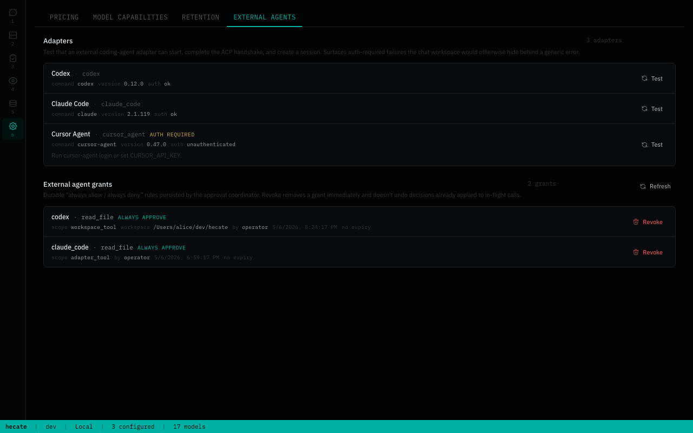

# External agent adapters: Hecate as an ACP client

Hecate can run external coding-agent CLIs from the **Chats** view. This is for
using Codex, Claude Code, Cursor Agent, and later similar tools through the same
operator console used for model chat.

External agents are not model providers. They are long-lived ACP agent sessions
running in a selected workspace. Hecate supervises the adapter process, forwards
prompts over ACP, records the normalized transcript plus raw ACP updates, and
captures timing, workspace branch, and Git diff. Cost is still reported as
`external`; when an adapter emits ACP `usage_update`, Hecate also records the
reported context-window usage and optional adapter-reported cost for display.

Chat transcripts are durable when `GATEWAY_CHAT_SESSIONS_BACKEND=sqlite`.
Hecate also stores the native ACP session id. After a gateway or native-app
restart, the next prompt asks the adapter to `session/load` that native session
when the adapter advertises ACP load-session support. If the adapter cannot load
the saved id, Hecate starts a fresh native session and keeps the existing
Hecate transcript.

## Relationship to the ACP bridge

ACP appears in Hecate in two directions:

| Direction | What Hecate does | Where to read |
|---|---|---|
| **Hecate as an ACP client/operator** | Launches and supervises external ACP adapters from **Chats → Agent**. This is the flow documented here. | This page |
| **Hecate as an ACP agent** | Exposes Hecate's task runtime to external editor ACP hosts through `hecate-acp`. | [ACP bridge](acp.md) |

The two flows share the ACP protocol vocabulary, but they do not share a
process model. Agent Chat owns the external adapter process. Editor ACP hosts
own the `hecate-acp` bridge process.

## Supported adapters

| Adapter | How Hecate starts it | Auth expected by the underlying agent |
|---|---|---|
| Codex | Hecate-managed launcher for `@zed-industries/codex-acp` via local `npx`; direct `codex-acp` also works | Codex CLI / adapter login or config |
| Claude Code | Hecate-managed launcher for `@agentclientprotocol/claude-agent-acp` via local `npx`; direct `claude-agent-acp` also works | Claude agent / adapter login or config |
| Cursor Agent | `cursor-agent acp` | `cursor-agent login` or `CURSOR_API_KEY` |

Check discovery:

```sh
curl -s http://127.0.0.1:8765/hecate/v1/agent-adapters | jq
```

Discovery reports command availability, tested version range, and lightweight
auth hints (`auth_status`: `ok`, `unauthenticated`, `billing`, or `unknown`).
Use Settings → External agents → **Test**, or call the probe endpoint, for a
full spawn + ACP handshake + no-op session check:



```sh
curl -X POST http://127.0.0.1:8765/hecate/v1/agent-adapters/codex/probe | jq
```

For Codex and Claude, Hecate does not require `codex-acp` or
`claude-agent-acp` to be installed on `PATH`. If the direct command is missing
but `npx` is available, Hecate creates a small launcher in the operator cache
directory and runs the official ACP npm package from there. Cursor still
requires the Cursor Agent CLI because its ACP mode is shipped by `cursor-agent`.

By default the managed launcher directory is the user cache location:

```text
<user-cache>/hecate/agent-adapters
```

Set `HECATE_AGENT_ADAPTERS_DIR` only if you want to override that location for
development, Docker volume mapping, or a packaged desktop build. Hecate removes
stale managed-launcher scripts at startup when their adapter no longer exists.
To force-refresh one managed launcher after changing Node/npm managers:

```sh
curl -X POST http://127.0.0.1:8765/hecate/v1/agent-adapters/codex/refresh-launcher | jq
```

## Setup checks

Agent Chat does not use Hecate model providers. It needs the selected
coding-agent to be authenticated, and either a direct ACP command or a managed
package runner to be visible to Hecate.

### Codex ACP

```sh
command -v npx
curl -s http://127.0.0.1:8765/hecate/v1/agent-adapters | jq '.data[] | select(.id=="codex")'
```

If `available` is true, Hecate can start Codex ACP. The first run may fetch and
cache the official `@zed-industries/codex-acp` package through `npx`.

If Hecate reports that the managed launcher is unavailable, install Node/npm or
start Hecate from an environment where `npx` is available. Hecate also checks
common operator locations such as Volta, mise/asdf shims, Homebrew, and
`/usr/bin`.

### Claude ACP

```sh
command -v npx
curl -s http://127.0.0.1:8765/hecate/v1/agent-adapters | jq '.data[] | select(.id=="claude_code")'
```

If `available` is true, Hecate can start Claude ACP. The first run may fetch and
cache the official `@agentclientprotocol/claude-agent-acp` package through
`npx`.

If Hecate reports that the managed launcher is unavailable, install Node/npm or
start Hecate from an environment where `npx` is available.

Hecate strips `ANTHROPIC_*` provider variables from the Claude Code adapter
environment. Claude Code subscription login is file-backed, and forwarding
provider API variables can make the ACP runner use Console credits instead of
the `/login` managed key shown by `claude /status`.

If Claude reports `Credit balance is too low`, run `claude /status` from the
same workspace and confirm it is using the account you expect. Hecate preserves
the raw adapter error in diagnostics, but shows a friendlier usage-limit message
in Chats.

### Cursor Agent

```sh
command -v cursor-agent
cursor-agent acp --help
cursor-agent login
```

Cursor can also authenticate through:

```sh
export CURSOR_API_KEY=...
```

If a run fails with `Authentication required. Please run 'agent login' first, or
set CURSOR_API_KEY environment variable.`, authenticate Cursor Agent in the same
environment that starts Hecate.

## Manual smoke

1. Start Hecate:

   ```sh
   just dev
   ```

2. Open **Chats** and switch the target from **Model** to **Agent**.

3. Choose an available adapter.

4. Choose a workspace directory from the folder button, or use **paste path**
   when the native folder dialog is not available. Hecate stores the canonical
   path and shows the full path plus Git branch in the shell status bar.

5. Send a prompt, for example:

   ```text
   Show me git status and summarize what changed.
   ```

6. Confirm the assistant message shows:
   - structured activity markers such as starting, running, files changed, or failed
   - normalized transcript text
   - context usage in the shell status bar when the adapter reports it
   - captured workspace diff under the inline diff disclosure when files changed
   - raw ACP diagnostics under the inline diagnostic disclosure when they differ from the normalized transcript

## Runtime behavior

Each Agent Chat session maps to one native ACP session. Hecate starts the
selected adapter process the first time the chat sends a prompt, creates the ACP
session, and reuses it for later prompts in the same Hecate chat. The adapter is
fixed for the chat session; start a new Agent Chat to choose another adapter.
Model Chats are different: their provider/model selection is per request and
can change inside one session.

Hecate validates the workspace before creating a session, sanitizes the
environment passed to the ACP adapter process, applies timeout/cancel behavior,
captures ACP updates with an output cap, and records Git diff / diff stat after
each turn. External agent adapters are still trusted subprocesses in the
selected workspace; this is not equivalent to the task runtime sandbox.
Read [Security](security.md) for the full runtime-boundary and workspace-safety
model.

On Hecate shutdown, active Agent Chat turns are cancelled first. Hecate waits
briefly for the ACP turn to drain, asks the native ACP session to close, and
then kills the owned adapter process group if it is still alive. This keeps app
quit / restart from leaving Codex, Claude, or Cursor adapter processes behind.
Operators can also close an Agent Chat session manually to release the external
adapter process while keeping the Hecate chat history. Deleting a chat performs
the same release step and then removes the persisted history.

Every prompt also gets OTel-shaped observability. The message response includes
`request_id`, `trace_id`, and `span_id`, and `GET
/hecate/v1/traces?request_id=<request_id>` shows the `agent_chat.run` span with adapter
identity, workspace, status, duration, output byte counts, and diff-capture
state. Approval gating adds two more spans:
`agent_adapter.approval.request` covers the coordinator's decision (grant
short-circuit, mode default, or prompt-mode wait) and carries
`hecate.agent_adapter.approval.path` once the path is known;
`agent_adapter.approval.resolve` wraps the operator's decision-application
path with `decision` and `scope` attributes.

Durable approval grants are part of the Agent Chat SQLite bundle. When
`GATEWAY_CHAT_SESSIONS_BACKEND=sqlite`, grants survive gateway restarts and are
listed from `GET /hecate/v1/agent-chat/grants`; the operator can revoke them from
Settings → External agents. Pending approvals from a dead process are not
replayed as actionable prompts — startup reconcile marks them `timed_out` with
`path=startup_reconcile` before the gateway accepts traffic.


## Approval mode and the alpha → prompt migration

`GATEWAY_AGENT_ADAPTER_APPROVAL_MODE` controls how the gateway responds to ACP
`RequestPermission` from external adapters. Three values:

- `prompt` (default) — the gateway records a pending row and waits for an
  operator decision via the Chats workspace banner / modal or the
  `/hecate/v1/agent-chat/sessions/{id}/approvals` REST surface. Without an operator
  reviewing within `GATEWAY_AGENT_ADAPTER_APPROVAL_TIMEOUT` (default 5m), the
  approval times out and the adapter receives ACP `Cancelled`.
- `auto` — every adapter request is permitted without review. Surfaces a red
  danger banner across every Chats session because every adapter call runs
  unsupervised. Useful only for headless / CI usage where no operator is
  available; never the right setting for interactive use.
- `deny` — every adapter request is refused.

**Alpha → prompt migration.** Through the alpha cycle the effective default
was `auto`; from this release the default is `prompt`. Operators who relied
on the old auto-approve behaviour — typically headless / CI flows where no
operator UI is connected — must explicitly set
`GATEWAY_AGENT_ADAPTER_APPROVAL_MODE=auto`. Without this, the first adapter
request in a new chat will block for the full timeout and then surface as
`Cancelled` to the adapter, looking like an inert hang.

## Runtime guardrails

### Per-session turn ceiling

`GATEWAY_AGENT_CHAT_MAX_TURNS_PER_SESSION` caps the number of user→assistant
round-trips per agent-chat session. When a session reaches the ceiling,
`POST /hecate/v1/agent-chat/sessions/{id}/messages` returns HTTP 422:

```json
{
  "error": {
    "type": "agent_chat.session_limit_exceeded",
    "message": "session has reached the 50-turn limit; start a new session to continue",
    "limit": 50,
    "turns_used": 50
  }
}
```

| Setting | Behavior |
|---|---|
| `GATEWAY_AGENT_CHAT_MAX_TURNS_PER_SESSION=0` | Unlimited (default) |
| `GATEWAY_AGENT_CHAT_MAX_TURNS_PER_SESSION=50` | Enforce 50-turn ceiling per session |

When a limit is set, the chat header shows a `{turns_used}/{max} turns` badge.
The badge turns amber when the ceiling is reached.

Turns are counted per session, not per workspace — starting a new session in
the same workspace resets the counter.

### Wall-clock and idle limits

Two optional time-based limits protect long-lived ACP sessions from turning
into invisible background processes:

| Setting | Behavior |
|---|---|
| `GATEWAY_AGENT_CHAT_MAX_SESSION_DURATION=0s` | Unlimited wall-clock age (default) |
| `GATEWAY_AGENT_CHAT_MAX_SESSION_DURATION=2h` | Reject new turns once the session is at least 2 hours old |
| `GATEWAY_AGENT_CHAT_IDLE_TIMEOUT=0s` | No idle sweeper (default) |
| `GATEWAY_AGENT_CHAT_IDLE_TIMEOUT=1h` | Auto-close idle sessions after 1 hour without updates |

When the wall-clock limit is exceeded, `POST
/hecate/v1/agent-chat/sessions/{id}/messages` returns HTTP 422 with
`agent_chat.session_duration_limit_exceeded`.

When the idle limit is exceeded, the background sweeper cancels the session,
clears the native ACP handle, and appends an `interrupted` activity to the last
assistant message when one exists. If the operator sends a new prompt before
the sweeper has closed the stale session, the request returns HTTP 422 with
`agent_chat.session_idle_timeout`; start a new chat to continue.

## Troubleshooting

| Symptom | What to check |
|---|---|
| Codex or Claude adapter is missing | Hecate could not find the direct ACP command or a local `npx` runner. Install Node/npm, or make sure Volta/mise/asdf/Homebrew is visible to the process that starts Hecate. |
| Cursor adapter is missing | `cursor-agent` is not visible to Hecate. Install Cursor Agent and restart Hecate after changing shell/runtime managers such as Volta. |
| Cursor says authentication is required | Run `cursor-agent login` or set `CURSOR_API_KEY` in the environment that starts Hecate. |
| Output looks strange | Open the message's raw output disclosure. The visible transcript is normalized from ACP updates, but raw update JSON is retained for adapter debugging. |
| Run hangs | Use the Stop button. Hecate sends ACP cancellation and marks the run `cancelled`. |
| Diff is empty | The workspace may not be a Git repo, or the adapter did not change files. |

## Stable alpha scope

External agent adapters are stable enough for alpha use when the operator
accepts the trusted-subprocess model: Codex, Claude Code, and Cursor run as
their own runtimes in the selected workspace while Hecate supervises lifecycle,
approvals, output capture, diagnostics, observability, guardrails, and Git diff
inspect/revert.

## Future enhancements

- Patch review is intentionally "already applied" for now. Hecate captures
  diff data, exposes structured changed-file / per-file diff APIs, and the
  Chats UI can inspect or revert captured Git paths. A fuller review surface
  with side-by-side hunks, batch selection, and richer artifact history is
  still future work.
- Adapter-specific ACP mappers can make Codex, Claude Code, and Cursor progress
  updates prettier over time. The current generic mapper plus raw diagnostics is
  sufficient for alpha stability.
- Agent Chat is a lightweight API around opaque external runtimes. Future work
  may reuse task-runtime primitives for artifacts, event history, retention,
  and trace correlation, but Hecate should not pretend it owns the Codex /
  Claude / Cursor runtime loop.
