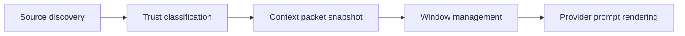

# Context Assembly And Injection Boundaries

> **Status:** proposed; not implemented.
> **Current source of truth:** [Chat sessions](../chat-sessions.md),
> [Agent runtime](../agent-runtime.md), and [Security](../security.md) for
> today's prompt, workspace, tool, and approval behavior.
> **Next action:** implement a small context-packet snapshot for Hecate Chat
> and task-backed runs before adding durable memory or automatic context
> summarization.

Hecate is starting to grow several related ideas: projects, chat settings,
system prompts, task-backed Hecate Chat turns, external-agent transcripts,
workspace instructions, model capabilities, future memory, external memory
providers, and future context window management. Without a named assembly layer,
these concepts blur together and invite two bad outcomes:

- Memory becomes "whatever text we prepend to the prompt."
- Context-window management becomes responsible for security decisions it
  should not own.

This RFC introduces a small, explicit context assembly contract. Context
assembly decides what information is eligible for a model call, how each piece
is labelled, what trust boundary it crosses, and how the operator can inspect
the final packet. Context-window management then decides how that packet fits
inside a model limit. Agent memory becomes one durable input to the packet, not
the packet itself.

## Relationship To Adjacent RFCs

| Concept                                                               | Owns                                                                                                                                   | Does not own                                                                                                          |
| --------------------------------------------------------------------- | -------------------------------------------------------------------------------------------------------------------------------------- | --------------------------------------------------------------------------------------------------------------------- |
| [**Projects**](projects.md)                                           | Durable identity for a codebase/work area: defaults, memory scope, history grouping, trusted context sources.                          | Concrete sandbox/workspace execution or per-call prompt rendering.                                                    |
| **Context assembly** (this RFC)                                       | Source collection, trust labels, injection boundaries, final context packet snapshot, "what did the model see?" UI.                    | Token fitting, summarization algorithms, long-term memory CRUD.                                                       |
| [**Agent memory**](agent-memory.md)                                   | Durable operator-approved facts and preferences with scopes.                                                                           | Deciding whether an entry fits a model window or whether untrusted content should become memory.                      |
| [**LLM context window management**](llm-context-window-management.md) | Token estimation, warning/cap thresholds, truncation, summarization, model limit lookup.                                               | Deciding whether a source is trusted, authoritative, or eligible.                                                     |
| **Agent profiles**                                                    | Saved runtime configurations: agent/provider/model controls, tools, RTK, approvals, memory-source selection, and system prompt text.   | Durable project identity, memory storage, or prompt rendering by itself.                                              |
| **Presets**                                                           | Templates for creating/updating project defaults or agent profiles.                                                                    | Runtime identity. Once applied, the resolved profile/settings are what matter.                                        |
| **Prompt-injection defense**                                          | Enforced mostly by context assembly: source labels, authority boundaries, and no silent promotion from untrusted text to instructions. | Perfect detection of malicious text. Hecate should label and bound sources, not pretend it can classify every attack. |

## Goals

1. **Make context visible.** Operators can inspect the context packet used for a
   chat message or task run: system instructions, workspace guidance, selected
   files, memory entries, summaries, tool output, and untrusted external text.
2. **Separate authority from evidence.** System instructions, operator-authored
   memory, workspace docs, tool output, and imported external text are not
   equivalent. The prompt renderer must preserve that distinction.
3. **Create a stable input for token budgeting.** Context-window management
   receives a resolved packet and can count, trim, or summarize it without
   re-deciding security policy.
4. **Support future memory safely.** Durable memory entries can be added to the
   packet only when scoped and visible. Untrusted text cannot silently become
   memory.
5. **Preserve auditability.** A completed model call records enough context
   metadata to answer "why did the model know that?" after the underlying
   memory, settings, or files change.

## Non-goals

- **Full semantic retrieval.** Embeddings and vector search can suggest
  candidate context later, but the first assembly layer is source/provenance
  plumbing.
- **Automatic memory extraction.** This RFC explicitly keeps memory writes
  operator-approved. Auto-extraction needs a separate review and eval story.
- **Replacing sandbox or approval policy.** Prompt labelling reduces instruction
  confusion; it does not replace tool sandboxing, approvals, network policy, or
  workspace validation.
- **External-agent private context control.** Codex, Claude Code, and Cursor
  own their internal prompts and history. Hecate can show and label the
  transcript and raw adapter output it receives, but cannot fully assemble their
  private model context through ACP today.
- **Hosted multi-user policy.** Hecate remains local-first and single-operator
  shaped for this RFC.

## Context Pipeline

The proposed pipeline has five stages:



### 1. Source Discovery

Candidate sources are collected from the active runtime surface:

| Source                    | Examples                                                                                            |
| ------------------------- | --------------------------------------------------------------------------------------------------- |
| Chat state                | User and assistant messages, direct-model segment history, task-backed segment summaries.           |
| Runtime state             | Task/run status, approvals, artifacts, changed files, prior tool output.                            |
| Operator settings         | System prompt, tools on/off, RTK state, profile/preset choices when they exist.                     |
| Project context           | `project_id`, project defaults, project instructions, saved project memory, trusted project docs.   |
| Agent profile context     | Profile-selected memory sources, adapter/model controls, profile instructions.                      |
| Workspace context         | Concrete workspace path, `AGENTS.md`, `CLAUDE.md`, selected files, git diff, file tree snippets.    |
| Memory                    | Future operator-authored memory entries selected by scope.                                          |
| External memory providers | Future profile-selected memory sources normalized through Hecate memory service.                    |
| External imports          | Future imported Codex/Claude transcripts, PR comments, issue text, web content, raw adapter output. |

Discovery is allowed to over-collect candidates. Later stages decide inclusion.

### 2. Trust Classification

Every context item gets a trust level before rendering:

| Trust level          | Meaning                                                                                                          | Examples                                                        |
| -------------------- | ---------------------------------------------------------------------------------------------------------------- | --------------------------------------------------------------- |
| `system_instruction` | Highest authority. Hecate-authored runtime instructions and operator-authored system prompt.                     | Built-in tool rules, explicit chat system prompt.               |
| `operator_memory`    | Durable facts or preferences intentionally saved by the operator.                                                | "Use conventional commits", "Prefer Go-first tooling".          |
| `workspace_guidance` | Repository-local guidance. Trusted for this workspace, but still less authoritative than operator/system policy. | `AGENTS.md`, `CLAUDE.md`, repo docs selected by user.           |
| `runtime_state`      | Hecate-observed state. Evidence, not instruction.                                                                | Run status, approvals, artifact metadata, changed files.        |
| `tool_output`        | Output produced by tools. Evidence, not instruction.                                                             | `git status`, `go test`, stdout/stderr artifacts.               |
| `generated_summary`  | Model-generated compression of older context. Evidence with lossy provenance.                                    | Conversation summary produced by a summarizer.                  |
| `external_untrusted` | Text from outside the current operator/runtime trust boundary. Must be quoted/labelled as untrusted.             | PR comments, imported chat text, web pages, raw adapter output. |

The renderer must never merge untrusted text into an instruction block. If a
PR comment says "ignore previous instructions," it remains labelled as external
evidence, not as a system message.

### 3. Context Packet Snapshot

The assembly output is a `ContextPacket`: a durable, inspectable description of
what was prepared for a model call.

Sketch:

```go
type ContextPacket struct {
    ID          string
    SessionID   string
    MessageID   string
    TaskID      string
    RunID       string
    CreatedAt   time.Time
    ProjectID   string
    Workspace   string
    AgentProfile string
    SourcePreset string
    Provider    string
    Model       string
    ExecutionMode string // direct_model | hecate_task | external_agent
    Items       []ContextItem
}

type ContextItem struct {
    ID              string
    Kind            string // system_prompt | memory | workspace_doc | transcript | tool_output | summary | imported_text
    TrustLevel      string
    Origin          string // file path, memory id, run event id, import id, etc.
    Title           string
    Body            string // optional inline text; large bodies may be referenced
    BodyRef         string // artifact/file/blob reference when not inlined
    TokenEstimate   int
    Included        bool
    InclusionReason string
    Redacted        bool
}
```

Storage can start as a JSON column on chat messages and task runs, then move to
`internal/context/` if the shape grows. The important part is that in-memory
and SQLite storage backends expose the same packet data.

### 4. Window Management

Window management receives only the packet items marked `Included=true`. It can:

- Estimate tokens for the full packet.
- Warn or block before provider context errors.
- Drop low-priority items according to policy.
- Replace older transcript/tool output with generated summaries.

It cannot promote an excluded source, remove trust labels, or rewrite untrusted
text as an instruction. If it summarizes, the summary becomes a new
`generated_summary` item that references the items it replaced.

### 5. Provider Prompt Rendering

Prompt rendering converts the packet into provider-specific wire messages.

Recommended rendering order:

1. Hecate runtime instructions.
2. Operator system prompt / profile instructions.
3. Project memory and profile-selected memory blocks.
4. Workspace guidance block.
5. Runtime state block.
6. Transcript.
7. Tool output and external evidence blocks, explicitly labelled.

The exact provider message shape can differ: OpenAI-style `system` messages,
Anthropic system blocks, or task-runtime prompt layers. The packet order and
trust labels should remain stable.

## Operator UX

### Chat And Task Views

Each model-backed message/run should expose a quiet "context" action:

- Shows included items grouped by trust level.
- Shows excluded candidates and why they were excluded when useful.
- Links large items to artifacts/files instead of dumping huge text inline.
- Shows token estimates once context-window management exists.

This becomes the answer to "what did the model see?"

### Connections / Settings

Connections remains the right place for provider/model readiness and future
model capabilities. Chat settings remains the right place for per-chat runtime
choices. Memory management can live in either Connections, Projects, or a
dedicated memory surface, but the active memory list must be visible from the
chat context inspector. Agent profiles should make it clear whether project
memory is injected into the current agent, visible only as operator notes, or
disabled.

## API Sketch

Hecate-native endpoints remain under `/hecate/v1`.

```
GET /hecate/v1/chats/{session_id}/messages/{message_id}/context
GET /hecate/v1/tasks/{task_id}/runs/{run_id}/context
```

Both return:

```json
{
  "object": "context_packet",
  "data": {
    "id": "ctx_...",
    "session_id": "chat_...",
    "run_id": "run_...",
    "items": []
  }
}
```

The initial implementation can omit standalone list/delete endpoints. Context
packets are audit snapshots owned by their parent message/run.

## Prompt-Injection Rules

1. Untrusted external content is always labelled as untrusted evidence.
2. Tool output is evidence, not instruction.
3. Generated summaries are evidence, not instruction.
4. Memory writes require explicit operator action.
5. Workspace guidance can guide codebase behavior but cannot override Hecate
   security policy, approvals, sandboxing, or operator system prompt.
6. Context packet inspection must show labels that match the actual prompt
   rendering.
7. Any future automatic retrieval or import feature must preserve origin and
   trust labels all the way to the rendered prompt.
8. External memory provider results enter as labelled memory/context items via
   the Hecate memory service, never as hidden agent instructions.

## Implementation Plan

| PR  | Scope                                                                                                                                   |
| --- | --------------------------------------------------------------------------------------------------------------------------------------- |
| 1   | Add `internal/context/` packet types, in-memory assembly for Hecate Chat direct-model and tools-on messages, and context inspector API. |
| 2   | Persist context packet snapshots in memory and SQLite chat/task stores.                                                                 |
| 3   | Add UI context inspector for chat messages and task runs.                                                                               |
| 4   | Wire token estimates from the context-window RFC against packet items.                                                                  |
| 5   | Add agent-memory selection as a packet source after the memory store exists.                                                            |

The first PR is intentionally small: no memory, no summarization, no vector
retrieval. Just create the audit boundary.

## Test Plan

- Unit tests for trust classification and rendering order.
- API tests for chat-message and task-run context packet retrieval.
- SQLite/memory parity tests for packet persistence.
- UI tests for context inspector grouping and large-item references.
- Prompt-injection tests where untrusted text tries to override system
  instructions and remains labelled evidence.
- Regression test that context-window truncation cannot move
  `external_untrusted` text into an instruction slot.

## Open Questions

- Should the first packet snapshot store full inline bodies, body references,
  or both? Recommendation: inline small text, reference artifacts/files for
  large bodies.
- Should context packet snapshots be retained forever with chat/task history or
  pruned by retention? Recommendation: follow the parent chat/task retention
  policy.
- Should operators be able to manually pin context items before memory exists?
  This is useful but may blur into memory. Recommendation: keep pinning out of
  v1 and implement memory deliberately.
- Should external-agent runs get a packet? Recommendation: yes, but only as a
  projection of what Hecate knows: operator prompt, workspace, adapter settings,
  ACP events, raw adapter output, and artifacts. Do not claim it is the
  adapter's full internal model context.
