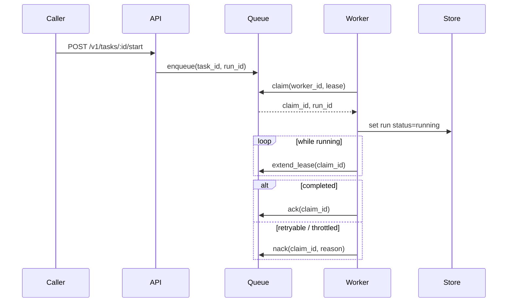

# Runtime API Notes

Hecate exposes a coding-runtime API surface under `/v1/tasks` for client-orchestrated agents. The runtime is durable: a run survives process restarts, can be resumed from a terminal state, and is leased to one worker at a time so two replicas can share a queue without stepping on each other.

For the high-level execution flow (lease semantics, sandbox boundary, event sequence), see [`architecture.md`](architecture.md#task-runtime-flow). For the LLM-driven `agent_loop` execution kind specifically (tools, approval gating, cost tracking, retry-from-turn semantics), see [`agent-runtime.md`](agent-runtime.md).

> Contributing here? Start at [`AGENTS.md`](../AGENTS.md) for the codebase map and runtime invariants; conventions, workflow, and verification ladders live under [`ai/`](../ai/README.md).

## Contents

- [Core resources](#core-resources)
  - [Task fields](#task-fields)
  - [Run fields](#run-fields)
- [Lifecycle endpoints](#lifecycle-endpoints)
  - [Resume semantics](#resume-semantics)
  - [Retry-from-turn-N semantics](#retry-from-turn-n-semantics)
- [Execution detail endpoints](#execution-detail-endpoints)
- [Approval endpoints](#approval-endpoints)
  - [Approval kinds](#approval-kinds)
  - [Approval policy configuration](#approval-policy-configuration)
- [Event and stream endpoints](#event-and-stream-endpoints)
- [Queue execution model](#queue-execution-model)
- [Runtime backend and queue configuration](#runtime-backend-and-queue-configuration)
- [Health and discovery endpoints](#health-and-discovery-endpoints)
- [Rate-limit headers on chat / messages](#rate-limit-headers-on-chat--messages)

## Core resources

- `task`
- `task_run`
- `task_step`
- `task_artifact`
- `task_approval`
- `task_run_event`

### Task fields

The `task` resource accepts these fields on `POST /v1/tasks`:

- `execution_kind` — one of `shell`, `git`, `file`, `agent_loop`
- `prompt` — the user-facing prompt; required for `agent_loop`, optional description for the others
- `system_prompt` — per-task agent prompt (narrowest of the four-layer composition); `agent_loop` only
- `shell_command` / `git_command` / `file_path` / `file_content` / `file_operation` — execution-kind-specific
- `working_directory` — absolute path; required when `workspace_mode=in_place`
- `workspace_mode` — `""` / `"persistent"` / `"ephemeral"` (clone behavior, default) or `"in_place"` (run directly in `working_directory`); see [`agent-runtime.md`](agent-runtime.md#workspace-modes)
- `repo` / `base_branch` — alternate source for the workspace clone
- `sandbox_allowed_root` / `sandbox_read_only` / `sandbox_network` — sandbox policy for shell / git / file kinds
- `requested_provider` / `requested_model` — pin the LLM (`agent_loop`); empty falls back to gateway default
- `budget_micros_usd` — per-task cost ceiling in micro-USD; `0` disables
- `mcp_servers` — `agent_loop`-only array of external MCP server configs whose tools join the LLM's tool catalog under `mcp__<name>__<tool>` aliases. Each entry picks one transport (stdio: `command` + optional `args` / `env`; HTTP: `url` + optional `headers`), and may set `approval_policy` (`auto` / `require_approval` / `block`). Capped per-task by `GATEWAY_TASK_MAX_MCP_SERVERS_PER_TASK`. Full schema, secret handling, and lifecycle in [`mcp.md#hecate-as-mcp-client`](mcp.md#hecate-as-mcp-client).
- `priority` / `timeout_ms`

### Run fields

`task_run` carries the cost figures the operator UI surfaces:

- `total_cost_micros_usd` — this run's LLM spend (after routing).
- `prior_cost_micros_usd` — cumulative spend of every prior run in this run's resume chain. Cumulative-across-task = `prior + total`.
- `model` / `provider` — what was actually used (after routing). May differ from the task's `requested_*` when the operator picked auto.

## Lifecycle endpoints

- `POST /v1/tasks`
- `GET /v1/tasks`
- `GET /v1/tasks/{id}`
- `DELETE /v1/tasks/{id}`
- `POST /v1/tasks/{id}/start` — returns `422 model_not_configured` when an `agent_loop` task has no model resolvable (neither `requested_model` on the task nor the gateway's default model is set). No run is created.
- `POST /v1/tasks/{id}/runs/{run_id}/retry`
- `POST /v1/tasks/{id}/runs/{run_id}/resume`
- `POST /v1/tasks/{id}/runs/{run_id}/retry-from-turn`
- `POST /v1/tasks/{id}/runs/{run_id}/cancel`

### Resume semantics

- resume is allowed when the source run is terminal (`completed`, `failed`, or `cancelled`)
- resume creates a new run attempt (new `run_id`) rather than mutating the original run
- the new run reuses the prior run workspace when available, so file state carries forward
- optional payload: `{"reason":"..."}` to annotate the resume request
- resumed executions include checkpoint context (source run id, last completed step, last event sequence) in step input so executors/tools can continue from the prior boundary
- for `agent_loop` runs, the saved `agent_conversation` artifact is hydrated as the starting message history — the loop continues from where it left off rather than re-running prior turns
- the new run inherits the chain's cumulative cost via `PriorCostMicrosUSD`, so the per-task ceiling holds across the full chain

### Retry-from-turn-N semantics

`POST /v1/tasks/{id}/runs/{run_id}/retry-from-turn` body:

```json
{ "turn": 2, "reason": "explore alternative" }
```

- only valid on `agent_loop` runs that produced an `agent_conversation` artifact
- `turn` must be in `[1, count(assistant turns)]`; out-of-range turns return 400
- creates a new run whose conversation is truncated to right before the Nth assistant message; the LLM re-issues that turn from the prior context
- step indices on the new run restart at 1 (semantically a fresh run that happens to share prior context, not a continuation)
- see [`agent-runtime.md`](agent-runtime.md#retry-and-resume) for the full flow

## Execution detail endpoints

- `GET /v1/tasks/{id}/runs`
- `GET /v1/tasks/{id}/runs/{run_id}`
- `GET /v1/tasks/{id}/runs/{run_id}/steps`
- `GET /v1/tasks/{id}/runs/{run_id}/steps/{step_id}`
- `GET /v1/tasks/{id}/runs/{run_id}/artifacts`
- `GET /v1/tasks/{id}/runs/{run_id}/artifacts/{artifact_id}`
- `GET /v1/tasks/{id}/artifacts`

## Approval endpoints

- `GET /v1/tasks/{id}/approvals`
- `GET /v1/tasks/{id}/approvals/{approval_id}`
- `POST /v1/tasks/{id}/approvals/{approval_id}/resolve`

### Approval kinds

The `kind` field on a `task_approval` is one of:

- `shell_command` — pre-execution gate for `execution_kind=shell` tasks
- `git_exec` — pre-execution gate for `execution_kind=git` tasks
- `file_write` — pre-execution gate for `execution_kind=file` tasks
- `network_egress` — pre-execution gate when `sandbox_network=true`
- `agent_loop_tool_call` — mid-loop gate when an `agent_loop` run calls a gated tool (`shell_exec`, `http_request`, etc.). The reason text lists the tools the agent wants to use. See [`agent-runtime.md`](agent-runtime.md#approval-gating) for the full flow.

Resolve payload: `{"decision": "approve" | "reject", "note": "..."}`. Approving an `agent_loop_tool_call` requeues the same run; the loop dispatches the approved tool calls without re-calling the LLM.

### Approval policy configuration

`GATEWAY_TASK_APPROVAL_POLICIES` (default `shell_exec,git_exec,file_write`) is a comma-separated allowlist of which approval gates are active across the task runtime. It controls both pre-execution gates on `shell` / `git` / `file` tasks **and** mid-loop gates inside `agent_loop` runs — same env var, same names. Recognized values:

| Value | Effect |
|---|---|
| `shell_exec` | Gate `execution_kind=shell` task creates and `agent_loop` `shell_exec` tool calls. |
| `git_exec` | Gate `execution_kind=git` task creates and `agent_loop` `git_exec` tool calls. |
| `file_write` | Gate `execution_kind=file` task creates and `agent_loop` `file_write` tool calls. |
| `network_egress` | Gate task creates that opt into `sandbox_network=true` and `agent_loop` `http_request` tool calls. |
| `read_file` | Gate `agent_loop` `read_file` tool calls. Useful when operators want visibility into every file the agent reads, not just what it writes. |
| `all_tools` | Gate every agent tool call (`shell_exec`, `git_exec`, `file_write`, `read_file`, `list_dir`, `http_request`) and all pre-execution task gates. Short-circuits to the full set — no need to list individual names. |

Unknown policy names are rejected at startup with a clear error. Empty value disables every gate (use only in trusted environments). For per-MCP-server gating in `agent_loop` runs, see `approval_policy` on `mcp_servers` entries in [`mcp.md#approval-policy`](mcp.md#approval-policy).

## Event and stream endpoints

### Per-run events

- `GET /v1/tasks/{id}/runs/{run_id}/events?after_sequence=<n>`
- `POST /v1/tasks/{id}/runs/{run_id}/events`
- `GET /v1/tasks/{id}/runs/{run_id}/stream?after_sequence=<n>`

Stream resume also supports `Last-Event-ID`. Each SSE snapshot carries the run state, current steps, current artifacts, AND any approvals scoped to that run — so the operator UI can drive the approval banner directly off the SSE without a separate refetch (`TaskRunStreamEventData.Approvals`).

### Public events feed

For external dashboards (Grafana, Slack notifiers, audit log shippers) that want one subscription instead of per-run polling:

- `GET /v1/events?event_type=<csv>&task_id=<id>&after_sequence=<n>&limit=<n>` — paginated JSON list with cursor-based pagination
- `GET /v1/events/stream?event_type=<csv>` — long-lived SSE feed; reconnect via `Last-Event-ID`

Filters AND together; within a slice (`event_type` is comma-separated) the match is OR. `after_sequence` is the global event sequence cursor, strictly greater. Tenant principals are auto-scoped to their tenant's tasks; admins see all events across all tenants. Asking for a foreign `task_id` returns an empty result rather than 403 (so existence isn't leaked).

### Event types

The full catalog of event types — including payload shapes, when each fires, and per-event extras — lives in [`events.md`](events.md). Highlights:

- `run.*` lifecycle (`run.created` / `run.queued` / `run.running` / `run.completed` / `run.failed` / `run.cancelled`)
- `step.*` and `artifact.*` for in-run timeline detail
- `approval.requested` / `approval.approved` / `approval.rejected` for human-gating flows
- `agent.turn.completed` for per-LLM-turn cost ledgers in `agent_loop` runs
- `run.resumed` / `run.resume_requested` for resume / retry-from-turn chains

## Queue execution model

When a run is queued, workers consume it through a claim/lease protocol:

1. enqueue `task_id` + `run_id`
2. worker claims with a time-bound lease
3. worker heartbeats to extend lease while work is running
4. worker `ack`s on success/terminal handling or `nack`s to requeue
5. expired leases can be reclaimed by another worker



## Runtime backend and queue configuration

- `GATEWAY_TASKS_BACKEND=memory|sqlite|postgres`
- `GATEWAY_TASK_QUEUE_BACKEND=memory|sqlite|postgres`
- `GATEWAY_TASK_QUEUE_WORKERS=<int>`
- `GATEWAY_TASK_QUEUE_BUFFER=<int>`
- `GATEWAY_TASK_QUEUE_LEASE_SECONDS=<int>`
- `GATEWAY_TASK_MAX_CONCURRENT_PER_TENANT=<int>` (`0` disables the limit)
- `GATEWAY_TASK_RECONCILE_INTERVAL=<duration>` (default `30s`; Go duration string — e.g. `"1m"`; how often the periodic reconciler scans for stalled runs; runs stuck in `running` longer than 3× `GATEWAY_TASK_QUEUE_LEASE_SECONDS` are automatically re-queued and emit `run.reconciled_restart_requeued` with `recovery_strategy=periodic_requeue`)
- `GATEWAY_TASK_MAX_MCP_SERVERS_PER_TASK=<int>` (default `16`; caps `mcp_servers` entries on `agent_loop` task creates; `0` disables the check)
- `GATEWAY_TASK_MCP_CLIENT_CACHE_MAX_ENTRIES=<int>` (default `256`; soft cap on the gateway-wide MCP client cache; LRU-idle eviction kicks in at the cap, with fail-open when every entry is in use)
- `GATEWAY_TASK_MCP_CLIENT_CACHE_PING_INTERVAL=<duration>` (default `60s`; how often the cache pings each idle cached upstream to detect wedged subprocesses; `0` disables the proactive health check, leaving only reactive eviction in `Pool.Call`)
- `GATEWAY_TASK_MCP_CLIENT_CACHE_PING_TIMEOUT=<duration>` (default `5s`; per-ping deadline; failure or timeout evicts the entry)

When `GATEWAY_TASKS_BACKEND` is `sqlite` or `postgres`, tasks/runs/steps/approvals/artifacts/run-events are persisted and the stream replay cursor is durable across restarts. When `GATEWAY_TASK_QUEUE_BACKEND` is `sqlite` or `postgres`, workers claim queue items with renewable leases, so pending runs survive process restarts and can be recovered by another worker when a lease expires.

For `agent_loop`-specific knobs (max turns, system-prompt layers, HTTP policy for the `http_request` tool), see [`agent-runtime.md`](agent-runtime.md#configuration-knobs).

`GET /admin/runtime/stats` also reports queue health fields including queue depth, queue capacity, worker count, and `queue_backend`.

`GET /admin/mcp/cache` returns a snapshot of the shared MCP client cache:

```json
{
  "object": "mcp_cache_stats",
  "data": {
    "checked_at": "2026-04-29T01:00:00.123Z",
    "configured": true,
    "entries": 4,
    "in_use": 1,
    "idle": 3
  }
}
```

`configured: false` means no cache is wired (the deploy explicitly disabled it via `Handler.SetMCPClientCache(nil)`); the counter fields are present but zero so admin UIs can render a "no cache" cell instead of error-handling. `in_use` is the **sum** of refcounts across all entries (an entry held by two concurrent runs counts as 2), not the number of entries with at least one acquirer; `idle` is the count of entries with refcount=0. See [`mcp.md`](mcp.md#lifecycle-and-caching) for the underlying contract.

`POST /v1/mcp/probe` is the dry-run discovery surface for an MCP server config. It accepts a single MCP server entry (same shape as one item in the task-create `mcp_servers` array — `name` defaults to `probe` when omitted), brings the server up the way an `agent_loop` run would (same secret resolution, same uncached spawn path), calls `tools/list`, and tears it down. Returns the upstream's tool catalog so operators can confirm the config before committing it to a task.

```json
POST /v1/mcp/probe
{
  "command": "bunx",
  "args": ["--bun", "@modelcontextprotocol/server-filesystem", "/workspace"]
}

→ 200
{
  "object": "mcp_probe",
  "data": {
    "tools": [
      { "name": "read_text_file", "description": "...", "input_schema": {...} },
      { "name": "list_directory", "input_schema": {...} }
    ]
  }
}
```

Tool names come back un-namespaced — the operator wants to see what the upstream itself calls them, not the gateway's runtime alias. Auth matches `POST /v1/tasks` (`requireAny`): if a principal can create a task with `mcp_servers` configured, it can probe with the same config (both paths exec the same arbitrary command). Bounded by a 10-second deadline; a stuck upstream surfaces as a 400 with the diagnostic rather than wedging the request.

## Health and discovery endpoints

Four small surfaces that don't need auth (or only need any-principal auth) and are useful for clients, ops, and the UI.

### `GET /healthz`

Liveness probe. Returns `200` with the gateway's current time and version unconditionally — no auth, no upstream calls. Suitable for load-balancer health checks, Kubernetes `livenessProbe` / `readinessProbe`, and Docker Compose `healthcheck`.

```json
GET /healthz
→ 200
{
  "status": "ok",
  "time": "2026-04-29T12:34:56Z",
  "version": "0.0.0-dev"
}
```

The endpoint is intentionally cheap: it doesn't touch the database, providers, or queue. A `200` here means "the process is up and serving HTTP," not "every backend is healthy." For deeper signal use `GET /admin/runtime/stats` (admin-gated; see above).

### `GET /v1/whoami`

Auth introspection. Tells the caller which principal a presented token resolves to — admin, tenant API key, anonymous — without requiring authentication itself. The UI uses this to render the "you are signed in as …" indicator; client integrations use it to confirm a bearer token works before issuing real traffic.

```json
GET /v1/whoami
→ 200
{
  "object": "session",
  "data": {
    "authenticated": true,
    "invalid_token": false,
    "role": "admin",
    "name": "operator",
    "tenant": "",
    "source": "bearer",
    "key_id": "",
    "allowed_providers": [],
    "allowed_models": [],
    "features": {
      "multi_tenant": false,
      "auth_disabled": false
    }
  }
}
```

Anonymous (no token / unrecognized token) returns `authenticated: false` with empty `role`. A token that's syntactically present but doesn't match any record returns `authenticated: false, invalid_token: true` — distinguishable so clients can show "your token is wrong" vs. "you're not signed in."

The `features` object reflects the gateway's runtime configuration:

- `multi_tenant` — `GATEWAY_MULTI_TENANT`. When `true`, the operator UI exposes Tenants + Keys management; clients wrapping Hecate can use the flag to decide whether to surface their own tenant-aware UI. See [`tenants.md`](tenants.md).
- `auth_disabled` — `GATEWAY_AUTH_DISABLED`. When `true`, the gateway accepts unauthenticated requests; the embedded UI uses this to skip its TokenGate.

### `GET /v1/bootstrap-token`

Loopback handshake. Returns the gateway-managed admin bearer token to a same-origin loopback caller so the embedded UI can skip a manual paste on first boot. Refuses for any other source. See [`deployment.md` § Bootstrap handshake](deployment.md#bootstrap-handshake-loopback-only) for the full fencing rules.

```json
GET /v1/bootstrap-token
→ 200
{
  "object": "bootstrap_token",
  "data": { "token": "7f2a91…" }
}
```

Refusal cases (all return `403`):

- The TCP peer is not a loopback address (`X-Forwarded-For` is ignored).
- The `Origin` header host is non-loopback and doesn't match the request `Host`.
- `GATEWAY_AUTH_TOKEN` was supplied via env (the gateway never hands out a token it didn't generate).
- No admin token is configured (auth disabled with no fallback).

### `GET /v1/provider-presets`

Provider catalog the UI's task-create form uses to render the provider picker. Each entry carries the operator-facing display name, the kind (`cloud` / `local`), the protocol Hecate speaks to it, the `BASE_URL` / `API_KEY` env-var pattern (so the UI can show which `PROVIDER_<NAME>_*` variables to set), the default model, and a short `env_snippet` ready to paste into `.env`.

```json
GET /v1/provider-presets
→ 200
{
  "object": "provider_presets",
  "data": [
    {
      "id": "openai",
      "name": "OpenAI",
      "kind": "cloud",
      "protocol": "openai",
      "base_url": "https://api.openai.com/v1",
      "api_key_env": "OPENAI_API_KEY",
      "default_model": "gpt-5.4-mini",
      "docs_url": "https://platform.openai.com/docs",
      "description": "OpenAI's Responses + Chat Completions API.",
      "env_snippet": "OPENAI_API_KEY=your_api_key_here"
    },
    ...
  ]
}
```

The list is built from `config.BuiltInProviders()` — see [`docs/providers.md`](providers.md) for the full catalog and the Custom OpenAI-compatible flow.

## Rate-limit headers on chat / messages

Every response from `POST /v1/chat/completions` and `POST /v1/messages` carries three rate-limit headers, regardless of whether rate limiting is enabled (the headers are zero-value when off):

| Header | Type | Meaning |
|---|---|---|
| `X-RateLimit-Limit` | int | Steady-state refill rate per API key (`GATEWAY_RATE_LIMIT_RPM`). |
| `X-RateLimit-Remaining` | int | Tokens still available in this key's bucket. Decrements per request. |
| `X-RateLimit-Reset` | Unix seconds | When the bucket will be full again. |

Over-limit requests get `429 Too Many Requests` with the standard error envelope and `code: "rate_limit_exceeded"`. Bucketing is keyed on the tenant API key's `KeyID`; principals without a `KeyID` (admin bearer tokens, anonymous traffic when `auth_token` is empty) all share a single `"anonymous"` bucket. See [Deployment: Rate limiting](deployment.md#rate-limiting) for the env-var knobs.
