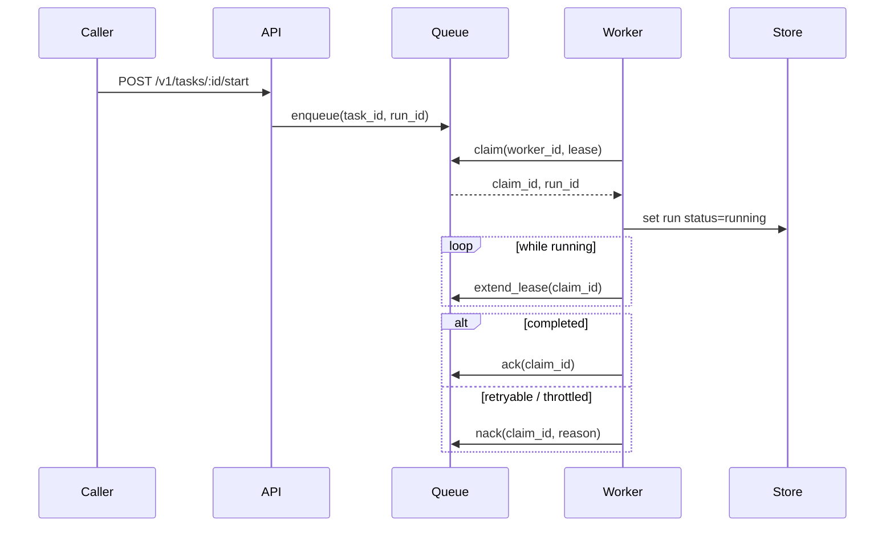

# Runtime API Notes

Hecate exposes a coding-runtime API surface under `/v1/tasks` for client-orchestrated agents. The runtime is durable: a run survives process restarts, can be resumed from a terminal state, and is leased to one worker at a time so two replicas can share a queue without stepping on each other.

For the high-level execution flow (lease semantics, sandbox boundary, event sequence), see [`architecture.md`](architecture.md#task-runtime-flow). For the LLM-driven `agent_loop` execution kind specifically (tools, approval gating, cost tracking, retry-from-turn semantics), see [`agent-runtime.md`](agent-runtime.md).

> Contributing here? Start at [`AGENTS.md`](../AGENTS.md) for the codebase map and runtime invariants; conventions, workflow, and verification ladders live under [`ai/`](../ai/README.md).

## Contents

- [Core resources](#core-resources)
  - [Task fields](#task-fields)
  - [Run fields](#run-fields)
- [Lifecycle endpoints](#lifecycle-endpoints)
  - [Resume semantics](#resume-semantics)
  - [Retry-from-turn-N semantics](#retry-from-turn-n-semantics)
- [Execution detail endpoints](#execution-detail-endpoints)
- [Approval endpoints](#approval-endpoints)
  - [Approval kinds](#approval-kinds)
  - [Approval policy configuration](#approval-policy-configuration)
- [Event and stream endpoints](#event-and-stream-endpoints)
- [Queue execution model](#queue-execution-model)
- [Runtime backend and queue configuration](#runtime-backend-and-queue-configuration)
- [Health and discovery endpoints](#health-and-discovery-endpoints)
- [Rate-limit headers on chat / messages](#rate-limit-headers-on-chat--messages)

## Core resources

- `task`
- `task_run`
- `task_step`
- `task_artifact`
- `task_approval`
- `task_run_event`

### Task fields

The `task` resource accepts these fields on `POST /v1/tasks`:

- `execution_kind` — one of `shell`, `git`, `file`, `agent_loop`
- `prompt` — the user-facing prompt; required for `agent_loop`, optional description for the others
- `system_prompt` — per-task agent prompt (narrowest of the three-layer composition); `agent_loop` only
- `shell_command` / `git_command` / `file_path` / `file_content` / `file_operation` — execution-kind-specific
- `working_directory` — absolute path; required when `workspace_mode=in_place`
- `workspace_mode` — `""` / `"persistent"` / `"ephemeral"` (clone behavior, default) or `"in_place"` (run directly in `working_directory`); see [`agent-runtime.md`](agent-runtime.md#workspace-modes)
- `repo` / `base_branch` — alternate source for the workspace clone
- `sandbox_allowed_root` / `sandbox_read_only` / `sandbox_network` — sandbox policy for shell / git / file kinds; see [`sandbox.md`](sandbox.md) for the full policy and isolation model
- `requested_provider` / `requested_model` — pin the LLM (`agent_loop`); empty falls back to gateway default
- `budget_micros_usd` — per-task cost ceiling in micro-USD; `0` disables
- `mcp_servers` — `agent_loop`-only array of external MCP server configs whose tools join the LLM's tool catalog under `mcp__<name>__<tool>` aliases. Each entry picks one transport (stdio: `command` + optional `args` / `env`; HTTP: `url` + optional `headers`), and may set `approval_policy` (`auto` / `require_approval` / `block`). Capped per-task by `GATEWAY_TASK_MAX_MCP_SERVERS_PER_TASK`. Full schema, secret handling, and lifecycle in [`mcp.md#hecate-as-mcp-client`](mcp.md#hecate-as-mcp-client).
- `priority` / `timeout_ms`

`execution_profile` applies task-create defaults:

| Profile | Defaults |
|---|---|
| `repo_local` | `execution_kind=agent_loop`, `workspace_mode=persistent`, `working_directory=.`, `timeout_ms=120000` |
| `coding_agent` | Same as `repo_local`, plus `timeout_ms=300000` and a coding-oriented system prompt that nudges the model toward read-before-edit and `file_edit` for targeted changes |

### Run fields

`task_run` carries the cost figures the operator UI surfaces:

- `total_cost_micros_usd` — this run's LLM spend (after routing).
- `prior_cost_micros_usd` — cumulative spend of every prior run in this run's resume chain. Cumulative-across-task = `prior + total`.
- `model` / `provider` — what was actually used (after routing). May differ from the task's `requested_*` when the operator picked auto.

## Lifecycle endpoints

- `POST /v1/tasks`
- `GET /v1/tasks`
- `GET /v1/tasks/{id}`
- `DELETE /v1/tasks/{id}`
- `POST /v1/tasks/{id}/start` — returns `422 model_not_configured` when an `agent_loop` task has no model resolvable (neither `requested_model` on the task nor the gateway's default model is set). No run is created.
- `POST /v1/tasks/{id}/runs/{run_id}/retry`
- `POST /v1/tasks/{id}/runs/{run_id}/resume`
- `POST /v1/tasks/{id}/runs/{run_id}/continue`
- `POST /v1/tasks/{id}/runs/{run_id}/retry-from-turn`
- `POST /v1/tasks/{id}/runs/{run_id}/cancel`

### Resume semantics

- resume is allowed when the source run is terminal (`completed`, `failed`, or `cancelled`)
- resume creates a new run attempt (new `run_id`) rather than mutating the original run
- the new run reuses the prior run workspace when available, so file state carries forward
- optional payload: `{"reason":"..."}` to annotate the resume request
- resumed executions include checkpoint context (source run id, last completed step, last event sequence) in step input so executors/tools can continue from the prior boundary
- for `agent_loop` runs, the saved `agent_conversation` artifact is hydrated as the starting message history — the loop continues from where it left off rather than re-running prior turns
- the new run inherits the chain's cumulative cost via `PriorCostMicrosUSD`, so the per-task ceiling holds across the full chain

### Continue semantics

`POST /v1/tasks/{id}/runs/{run_id}/continue` body:

```json
{ "prompt": "follow-up instruction" }
```

- only valid for terminal `agent_loop` runs that produced an `agent_conversation` artifact
- creates a new run for the same task, hydrates the source conversation, appends the supplied user prompt, then resumes the loop
- used by ACP/editor sessions where one editor conversation maps to one durable Hecate task and each user prompt becomes the next Hecate run
- returns 409 when the source run is still active, and 400 for non-agent tasks, empty prompts, or missing/malformed conversation artifacts

### Retry-from-turn-N semantics

`POST /v1/tasks/{id}/runs/{run_id}/retry-from-turn` body:

```json
{ "turn": 2, "reason": "explore alternative" }
```

- only valid on `agent_loop` runs that produced an `agent_conversation` artifact
- `turn` must be in `[1, count(assistant turns)]`; out-of-range turns return 400
- creates a new run whose conversation is truncated to right before the Nth assistant message; the LLM re-issues that turn from the prior context
- step indices on the new run restart at 1 (semantically a fresh run that happens to share prior context, not a continuation)
- see [`agent-runtime.md`](agent-runtime.md#retry-and-resume) for the full flow

## Execution detail endpoints

- `GET /v1/tasks/{id}/runs`
- `GET /v1/tasks/{id}/runs/{run_id}`
- `GET /v1/tasks/{id}/runs/{run_id}/steps`
- `GET /v1/tasks/{id}/runs/{run_id}/steps/{step_id}`
- `GET /v1/tasks/{id}/runs/{run_id}/artifacts`
- `GET /v1/tasks/{id}/runs/{run_id}/artifacts/{artifact_id}`
- `GET /v1/tasks/{id}/artifacts`
- `GET /v1/tasks/{id}/runs/{run_id}/patches`
- `GET /v1/tasks/{id}/runs/{run_id}/patches/{artifact_id}`
- `POST /v1/tasks/{id}/runs/{run_id}/patches/{artifact_id}/apply`
- `POST /v1/tasks/{id}/runs/{run_id}/patches/{artifact_id}/revert`

`patches` is a review-focused projection over `patch` artifacts. File-writing tools create patches with `status=applied`; `file_edit` can also create `status=proposed` patches when called with `propose=true`. The apply endpoint writes the proposed after-content only when the current file still matches the captured before-content, then emits `tool.file.applied`. The revert endpoint restores the before-content captured in Hecate's patch artifact and updates the patch to `status=reverted`. Reverting a new-file patch removes the file. Reverting emits `tool.file.reverted` on the run-event stream.

## Approval endpoints

- `GET /v1/tasks/{id}/approvals`
- `GET /v1/tasks/{id}/approvals/{approval_id}`
- `POST /v1/tasks/{id}/approvals/{approval_id}/resolve`

### Approval kinds

The `kind` field on a `task_approval` is one of:

- `shell_command` — pre-execution gate for `execution_kind=shell` tasks
- `git_exec` — pre-execution gate for `execution_kind=git` tasks
- `file_write` — pre-execution gate for `execution_kind=file` tasks
- `network_egress` — pre-execution gate when `sandbox_network=true`
- `agent_loop_tool_call` — mid-loop gate when an `agent_loop` run calls a gated tool (`shell_exec`, `http_request`, etc.). The reason text lists the tools the agent wants to use. See [`agent-runtime.md`](agent-runtime.md#approval-gating) for the full flow.

Resolve payload: `{"decision": "approve" | "reject", "note": "..."}`. Approving an `agent_loop_tool_call` requeues the same run; the loop dispatches the approved tool calls without re-calling the LLM.

### Approval policy configuration

`GATEWAY_TASK_APPROVAL_POLICIES` (default `shell_exec,git_exec,file_write`) is a comma-separated allowlist of which approval gates are active across the task runtime. It controls both pre-execution gates on `shell` / `git` / `file` tasks **and** mid-loop gates inside `agent_loop` runs — same env var, same names. Recognized values:

| Value | Effect |
|---|---|
| `shell_exec` | Gate `execution_kind=shell` task creates and `agent_loop` `shell_exec` tool calls. |
| `git_exec` | Gate `execution_kind=git` task creates and `agent_loop` `git_exec` tool calls. |
| `file_write` | Gate `execution_kind=file` task creates and `agent_loop` `file_write` / `file_edit` tool calls. |
| `network_egress` | Gate task creates that opt into `sandbox_network=true` and `agent_loop` `http_request` tool calls. |
| `read_file` | Gate `agent_loop` `read_file` tool calls. Useful when operators want visibility into every file the agent reads, not just what it writes. |
| `all_tools` | Gate every agent tool call (`shell_exec`, `git_exec`, `file_write`, `file_edit`, `read_file`, `list_dir`, `http_request`) and all pre-execution task gates. Short-circuits to the full set — no need to list individual names. |

Unknown policy names are rejected at startup with a clear error. Empty value disables every gate (use only in trusted environments). For per-MCP-server gating in `agent_loop` runs, see `approval_policy` on `mcp_servers` entries in [`mcp.md#approval-policy`](mcp.md#approval-policy).

## Event and stream endpoints

### Per-run events

- `GET /v1/tasks/{id}/runs/{run_id}/events?after_sequence=<n>`
- `POST /v1/tasks/{id}/runs/{run_id}/events`
- `GET /v1/tasks/{id}/runs/{run_id}/stream?after_sequence=<n>`

The JSON list returns agent event protocol v1 envelopes:
`schema_version`, `event_id`, `task_id`, `run_id`, `sequence`,
`occurred_at`, `type`, and `data`.

Stream resume also supports `Last-Event-ID`. The per-run state stream is still
snapshot-oriented: each SSE snapshot carries the run state, current steps,
current artifacts, and any approvals scoped to that run — so the operator UI can
drive the approval banner directly off the SSE without a separate refetch
(`TaskRunStreamEventData.Approvals`). The snapshot's `event_type` mirrors the
persisted event that produced it.

Snapshots also include a normalized `activity` array for clients that want a
coding-agent-style timeline without reconstructing it from raw steps and
artifacts. Activity item types include `thinking`, `tool_call`, `patch`,
`changed_files`, `final_answer`, `approval`, and `run_result`.

### Public events feed

For external dashboards (Grafana, Slack notifiers, audit log shippers) that want one subscription instead of per-run polling:

- `GET /v1/events?event_type=<csv>&task_id=<id>&after_sequence=<n>&limit=<n>` — paginated JSON list with cursor-based pagination
- `GET /v1/events/stream?event_type=<csv>` — long-lived SSE feed; reconnect via `Last-Event-ID`

Both endpoints emit the same v1 event envelopes as the per-run event list.
Filters AND together; within a slice (`event_type` is comma-separated) the match
is OR. `after_sequence` is the event sequence cursor, strictly greater.

### Event types

The full catalog of event types — including payload shapes, when each fires, and per-event extras — lives in [`events.md`](events.md). Highlights:

- `run.*` lifecycle (`run.created` / `run.queued` / `run.started` / `run.finished` / `run.failed` / `run.cancelled`)
- typed `tool.*` events for in-run tool lifecycle detail
- `approval.requested` / `approval.resolved` for human-gating flows
- `turn.completed` for per-LLM-turn cost ledgers in `agent_loop` runs
- `run.resumed_from_event` for resume / retry-from-turn chains

## Queue execution model

When a run is queued, workers consume it through a claim/lease protocol:

1. enqueue `task_id` + `run_id`
2. worker claims with a time-bound lease
3. worker heartbeats to extend lease while work is running
4. worker `ack`s on success/terminal handling or `nack`s to requeue
5. expired leases can be reclaimed by another worker



## Runtime backend and queue configuration

- `GATEWAY_TASKS_BACKEND=memory|sqlite`
- `GATEWAY_TASK_QUEUE_BACKEND=memory|sqlite`
- `GATEWAY_TASK_QUEUE_WORKERS=<int>`
- `GATEWAY_TASK_QUEUE_BUFFER=<int>`
- `GATEWAY_TASK_QUEUE_LEASE_SECONDS=<int>`
- `GATEWAY_TASK_MAX_CONCURRENT=<int>` (`0` disables the limit)
- `GATEWAY_TASK_RECONCILE_INTERVAL=<duration>` (default `30s`; Go duration string — e.g. `"1m"`; how often the periodic reconciler scans for stalled runs; runs stuck in `running` longer than 3× `GATEWAY_TASK_QUEUE_LEASE_SECONDS` are automatically re-queued and emit `gap.run_disconnected` with `reason=worker_lease_expired`)
- `GATEWAY_TASK_MAX_MCP_SERVERS_PER_TASK=<int>` (default `16`; caps `mcp_servers` entries on `agent_loop` task creates; `0` disables the check)
- `GATEWAY_TASK_MCP_CLIENT_CACHE_MAX_ENTRIES=<int>` (default `256`; soft cap on the gateway-wide MCP client cache; LRU-idle eviction kicks in at the cap, with fail-open when every entry is in use)
- `GATEWAY_TASK_MCP_CLIENT_CACHE_PING_INTERVAL=<duration>` (default `60s`; how often the cache pings each idle cached upstream to detect wedged subprocesses; `0` disables the proactive health check, leaving only reactive eviction in `Pool.Call`)
- `GATEWAY_TASK_MCP_CLIENT_CACHE_PING_TIMEOUT=<duration>` (default `5s`; per-ping deadline; failure or timeout evicts the entry)

When `GATEWAY_TASKS_BACKEND` is `sqlite`, tasks/runs/steps/approvals/artifacts/run-events are persisted and the stream replay cursor is durable across restarts. When `GATEWAY_TASK_QUEUE_BACKEND` is `sqlite`, workers claim queue items with renewable leases, so pending runs survive process restarts and can be recovered when a lease expires.

For `agent_loop`-specific knobs (max turns, system-prompt layers, HTTP policy for the `http_request` tool), see [`agent-runtime.md`](agent-runtime.md#configuration-knobs).

`GET /admin/runtime/stats` also reports queue health fields including queue depth, queue capacity, worker count, and `queue_backend`.

The response also surfaces `agent_adapter_approval_mode` — the configured mode for the external-agent adapter approval coordinator: `"auto"`, `"prompt"`, or `"deny"`. Operators surface a danger banner in the UI when this is `"auto"` since every adapter `RequestPermission` is permitted without review. Empty when the gateway was built without an approval coordinator (legacy configs / test fixtures).

`GET /admin/mcp/cache` returns a snapshot of the shared MCP client cache:

```json
{
  "object": "mcp_cache_stats",
  "data": {
    "checked_at": "2026-04-29T01:00:00.123Z",
    "configured": true,
    "entries": 4,
    "in_use": 1,
    "idle": 3
  }
}
```

`configured: false` means no cache is wired (the deploy explicitly disabled it via `Handler.SetMCPClientCache(nil)`); the counter fields are present but zero so admin UIs can render a "no cache" cell instead of error-handling. `in_use` is the **sum** of refcounts across all entries (an entry held by two concurrent runs counts as 2), not the number of entries with at least one acquirer; `idle` is the count of entries with refcount=0. See [`mcp.md`](mcp.md#lifecycle-and-caching) for the underlying contract.

`POST /v1/mcp/probe` is the dry-run discovery surface for an MCP server config. It accepts a single MCP server entry (same shape as one item in the task-create `mcp_servers` array — `name` defaults to `probe` when omitted), brings the server up the way an `agent_loop` run would (same secret resolution, same uncached spawn path), calls `tools/list`, and tears it down. Returns the upstream's tool catalog so operators can confirm the config before committing it to a task.

```json
POST /v1/mcp/probe
{
  "command": "bunx",
  "args": ["--bun", "@modelcontextprotocol/server-filesystem", "/workspace"]
}

→ 200
{
  "object": "mcp_probe",
  "data": {
    "tools": [
      { "name": "read_text_file", "description": "...", "input_schema": {...} },
      { "name": "list_directory", "input_schema": {...} }
    ]
  }
}
```

Tool names come back un-namespaced — the operator wants to see what the upstream itself calls them, not the gateway's runtime alias. Bounded by a 10-second deadline; a stuck upstream surfaces as a 400 with the diagnostic rather than wedging the request.

## Health and discovery endpoints

### `GET /healthz`

Liveness probe. Returns `200` with the gateway's current time and version. Suitable for sidecar health checks, Kubernetes `livenessProbe` / `readinessProbe`, and Docker Compose `healthcheck`.

```json
GET /healthz
→ 200
{
  "status": "ok",
  "time": "2026-04-29T12:34:56Z",
  "version": "0.0.0-dev"
}
```

The endpoint is intentionally cheap: it doesn't touch the database, providers, or queue. A `200` here means "the process is up and serving HTTP," not "every backend is healthy." For deeper signal use `GET /admin/runtime/stats`.

### `GET /v1/provider-presets`

Provider catalog the UI's task-create form uses to render the provider picker. Each entry carries the operator-facing display name, the kind (`cloud` / `local`), the protocol Hecate speaks to it, the `BASE_URL` / `API_KEY` env-var pattern (so the UI can show which `PROVIDER_<NAME>_*` variables to set), the default model, and a short `env_snippet` ready to paste into `.env`.

```json
GET /v1/provider-presets
→ 200
{
  "object": "provider_presets",
  "data": [
    {
      "id": "openai",
      "name": "OpenAI",
      "kind": "cloud",
      "protocol": "openai",
      "base_url": "https://api.openai.com/v1",
      "api_key_env": "OPENAI_API_KEY",
      "default_model": "gpt-5.4-mini",
      "docs_url": "https://platform.openai.com/docs",
      "description": "OpenAI's Responses + Chat Completions API.",
      "env_snippet": "OPENAI_API_KEY=your_api_key_here"
    },
    ...
  ]
}
```

The list is built from `config.BuiltInProviders()` — see [`docs/providers.md`](providers.md) for the full catalog and OpenAI-compatible custom-endpoint flow.

### `GET /v1/agent-adapters`

External coding-agent adapter catalog. This is the first discovery surface for
Agent Chat: it reports the agent runtimes Hecate knows how to supervise and
whether their direct command or Hecate-managed launcher can be started.

```json
GET /v1/agent-adapters
→ 200
{
  "object": "agent_adapters",
  "data": [
    {
      "id": "codex",
      "name": "Codex",
      "kind": "acp",
      "command": "codex-acp",
      "managed": true,
      "managed_package": "@zed-industries/codex-acp",
      "available": true,
      "status": "available",
      "path": "/Users/alice/Library/Caches/hecate/agent-adapters/codex-acp",
      "cost_mode": "external",
      "version": "1.2.3",
      "supported_range": ">=0.1.0",
      "version_outside_range": false
    },
    {
      "id": "cursor_agent",
      "name": "Cursor Agent",
      "kind": "acp",
      "command": "cursor-agent",
      "args": ["acp"],
      "available": true,
      "status": "available",
      "path": "/Users/alice/.local/bin/cursor-agent",
      "cost_mode": "external",
      "version": "0.0.9",
      "supported_range": ">=0.1.0",
      "version_outside_range": true
    },
    {
      "id": "claude_code",
      "name": "Claude Code",
      "kind": "acp",
      "command": "claude-agent-acp",
      "managed": true,
      "managed_package": "@agentclientprotocol/claude-agent-acp",
      "available": false,
      "status": "missing",
      "error": "exec: \"claude-agent-acp\": executable file not found in $PATH; managed launcher unavailable: no local package runner found for @agentclientprotocol/claude-agent-acp",
      "cost_mode": "external",
      "supported_range": ">=0.1.0"
    }
  ]
}
```

`version` is populated by running the binary with `--version` and extracting
the first semver-shaped token from stdout; it is absent when the adapter is
missing or when the binary does not print a recognisable version string.
`version_outside_range` is `true` when both `version` and `supported_range`
are present and the version does not satisfy the constraint — the Settings UI
shows an amber "outside tested range" chip in that case.

These are **agent adapters**, not model providers. They run ACP-compatible
external coding agents under Hecate supervision; cost is reported as `external`
until an adapter can supply structured usage.

### `GET /v1/agent-adapters/{id}/health`

Probes a single adapter end-to-end and classifies the outcome so operators can
distinguish "binary missing" from "binary on PATH but auth failing" without
reading raw error text. The probe does spawn → ACP `Initialize` → ACP
`NewSession` against a temporary workspace → terminate; it never issues a
chat prompt.

```json
GET /v1/agent-adapters/codex/health
→ 200
{
  "object": "agent_adapter_health",
  "data": {
    "adapter_id": "codex",
    "status": "auth_required",
    "stage": "initialize",
    "path": "/Users/alice/.local/bin/codex-acp",
    "error": "Authentication required",
    "hint": "Adapter started but failed authentication. Try the adapter's CLI login flow or set its API-key env var.",
    "duration_ms": 412
  }
}
```

`status` is one of:

- `ready` — spawn + Initialize + NewSession all succeeded.
- `not_installed` — binary not on PATH and managed launcher unavailable.
- `auth_required` — process started but Initialize or NewSession failed with
  an auth-shaped error (`Authentication required`, `Please log in`, `API key`,
  `Credit balance is too low`, `401`, `403`, …).
- `error` — anything else. `error` and `stderr` carry the verbatim diagnostic
  so the operator can act on it.

`stage` reports which step in the sequence completed (on success) or failed (on
error): `lookup` / `spawn` / `initialize` / `new_session` / `ready`.

Status codes:
- `200 OK` with the typed result on every classification (`ready`,
  `not_installed`, `auth_required`, `error`). The probe completing
  successfully is itself a 200; the adapter's status lives in the body.
- `404 not_found` when the adapter id is not registered.

The probe creates and immediately abandons a fresh ACP session, so adapters
that bill on session creation will see one no-op session per call. Adapters
that bill on prompt completion see no charge.

### `GET /v1/agent-chat/sessions`

Lists Agent Chat sessions. Agent Chat uses the same backend selection as model
chat history: memory by default, SQLite when `GATEWAY_CHAT_SESSIONS_BACKEND=sqlite`.
It is the alpha surface for running external coding agents such as Codex,
Claude Code, and Cursor Agent from the Hecate Chats UI.

`GATEWAY_CHAT_SESSIONS_BACKEND=sqlite` is the single selector for the entire
agent-chat state bundle: sessions, messages, **and** the operator-facing
approval rows + grants documented under
`/v1/agent-chat/sessions/{id}/approvals` and `/v1/agent-chat/grants`. They all
move together so agent-chat state can't go split-brain. On startup the gateway
runs a reconcile pass that flips any approvals stuck in `pending` from a prior
process to `status=timed_out` with `path=startup_reconcile` — process-local
waiters can't be resurrected, so the operator UI never sees an actionable
"pending" row that nothing is actually blocked on.

Resolved approvals are pruned by the retention worker
(`GATEWAY_RETENTION_AGENT_CHAT_APPROVALS_*`, default 30d / 10k). Operator-
authored grants are NOT subject to that retention — only their own
`expires_at` drives deletion, so explicit operator intent outlives normal
retention windows.

The same per-session SSE stream (`GET /v1/agent-chat/sessions/{id}/stream`)
also carries approval lifecycle events so frontends don't have to poll. Two
new event types in addition to the existing `snapshot` chat-update frames:

```
event: approval.requested
data: {
  "approval_id":   "appr_01JX...",
  "session_id":    "chat_01JX...",
  "adapter_id":    "codex",
  "tool_kind":     "file_write",
  "tool_name":     "Edit src/foo.go",
  "scope_choices": ["once","session","workspace_tool","adapter_tool"],
  "created_at":    "2026-05-04T10:23:45.123Z",
  "expires_at":    "2026-05-04T10:28:45.123Z"
}

event: approval.resolved
data: {
  "approval_id":     "appr_01JX...",
  "session_id":      "chat_01JX...",
  "status":          "approved",
  "decision":        "approve",
  "scope":           "session",
  "path":            "operator",
  "selected_option": "allow_always_for_session",
  "resolved_at":     "2026-05-04T10:24:01.000Z"
}
```

Frontends switch on the `path` field of `approval.resolved` to render the
disposition: `operator` (explicit decision), `grant` (pre-existing grant
short-circuited the prompt), `default_mode` (`auto`/`deny` mode resolved
without operator), `timeout` (prompt-mode timeout fired), or
`request_cancelled` (the request context died — session shutdown, adapter
teardown, HTTP context cancellation, process stop). `request_cancelled` is
operationally distinct from `operator`: nobody clicked anything, the request
just died.

Backpressure: per-subscriber buffers are bounded (16 events). On overflow,
approval events are **dropped** rather than blocking the coordinator. A
slow operator UI catches up by re-fetching `/approvals?status=pending` on
reconnect. Replay across restart is not supported in this slice.

```json
GET /v1/agent-chat/sessions
→ 200
{
  "object": "agent_chat_sessions",
  "data": [
    {
      "id": "agent_chat_...",
      "title": "Codex chat",
      "adapter_id": "codex",
      "driver_kind": "acp",
      "native_session_id": "session_...",
      "workspace": "/Users/alice/project",
      "workspace_branch": "main",
      "status": "completed",
      "message_count": 2,
      "created_at": "2026-05-03T12:00:00Z",
      "updated_at": "2026-05-03T12:00:08Z"
    }
  ]
}
```

### `POST /v1/agent-chat/sessions`

Creates an Agent Chat session. The session records which adapter should run
and which workspace path the ACP session should use. The workspace must be
an operator-controlled local directory. Hecate validates and canonicalizes the
path at session creation, so later runs use the resolved directory instead of
failing only after the external process starts.

```json
POST /v1/agent-chat/sessions
{
  "adapter_id": "codex",
  "workspace": "/Users/alice/project",
  "title": "Codex review"
}

→ 200
{
  "object": "agent_chat_session",
  "data": {
    "id": "agent_chat_...",
    "title": "Codex review",
    "adapter_id": "codex",
    "driver_kind": "acp",
    "workspace": "/Users/alice/project",
    "workspace_branch": "main",
    "status": "idle",
    "messages": []
  }
}
```

### `GET /v1/agent-chat/sessions/{id}`

Returns the full session transcript, including user messages and assistant
messages produced by the external adapter.

### `POST /v1/agent-chat/sessions/{id}/messages`

Sends the submitted prompt to the session's native ACP session and appends both
the user message and the adapter output. The response returns after the ACP turn
finishes, times out, is cancelled, or fails. For live output while the turn is
running, subscribe to the session stream before posting the message.

```json
POST /v1/agent-chat/sessions/agent_chat_.../messages
{
  "content": "Review the current diff and suggest fixes."
}

→ 200
{
  "object": "agent_chat_session",
  "data": {
    "id": "agent_chat_...",
    "status": "completed",
    "messages": [
      {
        "id": "msg_...",
        "role": "user",
        "content": "Review the current diff and suggest fixes."
      },
      {
        "id": "msg_...",
        "run_id": "agent_run_...",
        "request_id": "req_...",
        "trace_id": "d4c5...",
        "span_id": "8f3a...",
        "role": "assistant",
        "content": "...",
        "raw_output": "...",
        "adapter_id": "codex",
        "adapter_name": "Codex",
        "driver_kind": "acp",
        "native_session_id": "session_...",
        "status": "completed",
        "cost_mode": "external",
        "workspace": "/Users/alice/project",
        "diff_stat": "...",
        "started_at": "2026-05-03T12:00:01Z",
        "completed_at": "2026-05-03T12:00:08Z",
        "duration_ms": 7000,
        "activities": [
          {
            "type": "started",
            "status": "completed",
            "title": "Starting external agent",
            "detail": "Codex in /Users/alice/project",
            "created_at": "2026-05-03T12:00:01Z"
          },
          {
            "type": "files_changed",
            "status": "completed",
            "title": "Files changed",
            "detail": "2 files changed",
            "created_at": "2026-05-03T12:00:08Z"
          },
          {
            "type": "completed",
            "status": "completed",
            "title": "Final answer",
            "created_at": "2026-05-03T12:00:08Z"
          }
        ]
      }
    ]
  }
}
```

Each adapter response gets a stable `run_id` plus start/end timestamps and
duration so clients can correlate streamed updates, final output, and future
artifacts without treating the assistant message id as the runtime identity.
It also stores `request_id`, `trace_id`, and `span_id`; use
`GET /v1/traces?request_id=<request_id>` to inspect the OTel-shaped
`agent_chat.run` span for that prompt.
`content` is the normalized transcript that should be shown by default.
`raw_output` preserves raw ACP update JSON for diagnostics when an adapter emits
surprising structured output. `driver_kind` and `native_session_id` identify the
underlying ACP session reused across turns in the Hecate chat. `activities` is
the structured progress model for the Chats UI: it records lifecycle markers
such as starting, running, output, files changed, failed, cancelled, and final
answer. Failures from the ACP adapter are still represented as assistant
messages with `"status": "failed"` and `error` so the transcript stays intact.
Transport or request validation failures still use the normal Hecate error
envelope.

### `GET /v1/agent-chat/sessions/{id}/stream`

Streams live Agent Chat session snapshots as Server-Sent Events. This is an
in-process live feed, not the durable task-event log: session history remains in
the configured Agent Chat backend, while the stream fans out updates from the
currently running gateway process.

```text
event: snapshot
data: {"object":"agent_chat_session","data":{...}}

event: done
data: {"object":"agent_chat_session","data":{"status":"completed",...}}
```

Clients should subscribe before sending a message so they can receive partial
ACP output from the external adapter. The stream stays open for an idle or
previously completed session and closes after it observes a new running message
reach a terminal status (`completed`, `failed`, or `cancelled`).

### `POST /v1/agent-chat/sessions/{id}/cancel`

Cancels the currently running ACP turn for the session.

```json
POST /v1/agent-chat/sessions/agent_chat_.../cancel
{}
```

Returns `202` when a running turn was signalled. If the session is not
currently running, the endpoint returns `409 invalid_request`.

### `POST /v1/agent-chat/sessions/{id}/close`

Closes the native ACP adapter session while keeping the Hecate chat history.
If a turn is currently running, Hecate cancels and waits briefly before closing
the external session.

### `DELETE /v1/agent-chat/sessions/{id}`

Deletes an Agent Chat session from the configured chat-session backend.
If the session has an active native ACP adapter process, Hecate closes the
native session and terminates the owned process as part of deletion.

### `POST /v1/workspace-dialog`

Opens a local folder picker from the gateway process and returns the selected
workspace path. The browser cannot safely expose absolute folder paths on its
own, so this endpoint is intentionally local-runtime-oriented.

```json
POST /v1/workspace-dialog
{}

→ 200
{
  "object": "workspace_dialog",
  "data": {
    "path": "/Users/alice/project",
    "branch": "main"
  }
}
```

Current native-dialog support is macOS via `osascript`; unsupported platforms
return `501`. The UI falls back to a manual path entry so Agent Chat remains
usable on Linux and Windows. If the operator cancels the dialog, the endpoint
returns the standard error envelope and the UI keeps the workspace unchanged.

## Rate-limit headers on chat / messages

Every response from `POST /v1/chat/completions` and `POST /v1/messages` carries three rate-limit headers, regardless of whether rate limiting is enabled (the headers are zero-value when off):

| Header | Type | Meaning |
|---|---|---|
| `X-RateLimit-Limit` | int | Steady-state refill rate (`GATEWAY_RATE_LIMIT_RPM`). |
| `X-RateLimit-Remaining` | int | Tokens still available in the bucket. Decrements per request. |
| `X-RateLimit-Reset` | Unix seconds | When the bucket will be full again. |

Over-limit requests get `429 Too Many Requests` with the standard error envelope and `code: "rate_limit_exceeded"`. See [Deployment: Rate limiting](deployment.md#rate-limiting) for the env-var knobs.
