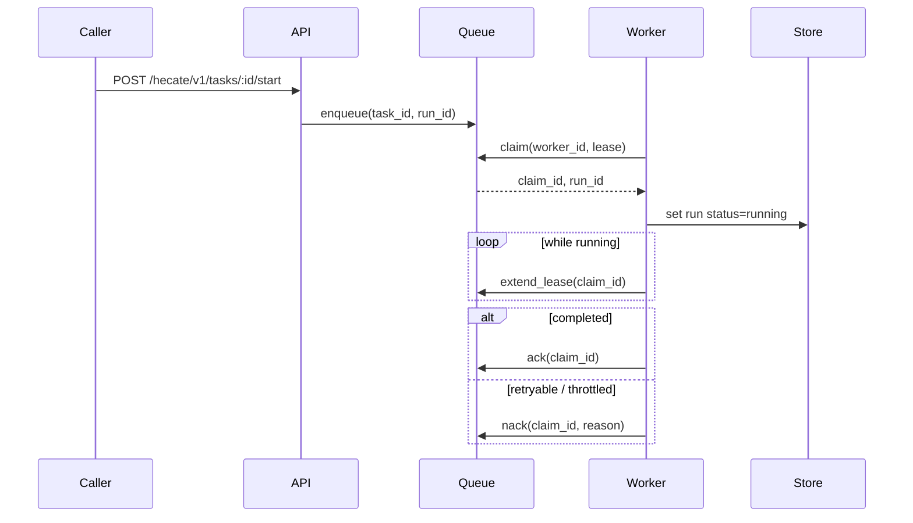

# Runtime API Notes

Hecate exposes a coding-runtime API surface under `/hecate/v1/tasks` for client-orchestrated agents. The runtime is durable: a run survives process restarts, can be resumed from a terminal state, and is leased to one worker at a time so two replicas can share a queue without stepping on each other.

For the high-level execution flow (lease semantics, sandbox boundary, event sequence), see [`architecture.md`](architecture.md#task-runtime-flow). For the LLM-driven `agent_loop` execution kind specifically (tools, approval gating, cost tracking, retry-from-turn semantics), see [`agent-runtime.md`](agent-runtime.md).

> Contributing here? Start at [`AGENTS.md`](../AGENTS.md) for the codebase map and runtime invariants; conventions, workflow, and verification ladders live under [`docs-ai/`](../docs-ai/README.md).

## API namespaces

Hecate serves three intentionally separate HTTP surfaces:

| Namespace      | Purpose                                                                                                                                                                                                                                                 |
| -------------- | ------------------------------------------------------------------------------------------------------------------------------------------------------------------------------------------------------------------------------------------------------- |
| `/v1/*`        | Provider-compatible protocol ingress. These paths stay OpenAI- or Anthropic-shaped so existing SDKs can point at Hecate without learning Hecate-specific URLs. Today that means `GET /v1/models`, `POST /v1/chat/completions`, and `POST /v1/messages`. |
| `/hecate/v1/*` | Hecate-native product API: tasks, Hecate Chat sessions, external-agent adapters, settings, usage, traces, events, and system operations. Operator UI, MCP tools, and Hecate-aware clients should use this namespace.                                    |
| `/healthz`     | Unversioned process liveness for local scripts, desktop sidecars, and load balancers. It is intentionally tiny and not wrapped in the normal `{object,data}` API envelope.                                                                              |

OTLP collector/export endpoints keep their standard protocol paths
(`/v1/traces`, `/v1/metrics`, `/v1/logs`) when Hecate is configured to export to
an OpenTelemetry collector. Those are not Hecate product resources. Hecate's
local trace lookup for the operator UI is `GET /hecate/v1/traces`.

Set `HECATE_RUNTIME_TOKEN` to require Hecate-aware clients to send
`X-Hecate-Runtime-Token` on `/hecate/v1/*`. This protects the Hecate-native
control plane, including Hecate-native chat and task routes that can spend
configured provider credentials. It does not apply to provider-compatible
`/v1/*` paths or `/healthz`. The operator UI sends the header when
`hecate.runtimeToken` is present in `sessionStorage` or `localStorage`; the MCP
server reads the same value from its `HECATE_RUNTIME_TOKEN` environment.

Set `HECATE_INFERENCE_TOKEN` to require a shared token on the
provider-compatible inference routes: `GET /v1/models`,
`POST /v1/chat/completions`, and `POST /v1/messages`. Clients may send it as
either `Authorization: Bearer <token>` or `x-api-key: <token>`, so standard
OpenAI- and Anthropic-shaped SDK configuration continues to work. This token
does not wrap `/hecate/v1/*`, `/healthz`, static UI assets, or OTLP collector
paths such as `/v1/traces`, `/v1/metrics`, and `/v1/logs`. The operator UI
sends it to local provider-compatible paths when `hecate.inferenceToken` is
present in `sessionStorage` or `localStorage`.

Legacy Hecate-native `/v1/*` and `/admin/*` paths are intentionally not kept as
compatibility shims in this alpha branch. Unknown API-shaped paths return 404
rather than falling through to the embedded UI shell.

## Error envelope

Hecate-native JSON errors use one stable envelope:

```json
{
  "error": {
    "type": "route_impossible",
    "message": "route request: no provider available",
    "user_message": "No configured provider can serve this request.",
    "operator_action": "Open Connections to inspect readiness checks, discover models, or enable a routable provider.",
    "request_id": "req_...",
    "trace_id": "..."
  }
}
```

- `type` is the stable machine code. Operator UI and automation should branch
  on this field, not raw text.
- `message` is the detailed gateway/runtime message. It may include provider or
  router wording.
- `user_message` is the short operator-facing summary.
- `operator_action` is the recommended next step.
- `request_id` and `trace_id` are included when the runtime has already created
  trace state. They mirror `X-Request-Id` / `X-Trace-Id` and let clients open
  `GET /hecate/v1/traces?request_id=...` directly from an error surface.
- Runtime-specific fields may be attached when they help repair the failure.
  Examples: `task_id`, `latest_run_id`, and `run_status` for a busy Hecate Chat
  task; `provider`, `model`, and `capabilities` for tool-capability failures;
  `limit_ms` / `turns_used` for session guardrails.

Common Hecate-native error types:

| Type                                   | Status | Meaning                                                                          |
| -------------------------------------- | -----: | -------------------------------------------------------------------------------- |
| `invalid_request`                      |    400 | Request JSON, query parameters, or required fields are invalid.                  |
| `not_found`                            |    404 | The requested Hecate resource does not exist.                                    |
| `conflict`                             |    409 | The resource changed state or the requested transition is not valid now.         |
| `gateway_error`                        |    500 | Hecate failed before it could classify the failure more specifically.            |
| `rate_limit_exceeded`                  |    429 | The local gateway rate limiter rejected the request.                             |
| `model_not_configured`                 |    422 | The selected model is stale or not currently reported by the selected provider.  |
| `chat.agent_session_busy`              |    409 | A Hecate Chat task-backed loop is queued, running, or awaiting approval.         |
| `chat.model_capability_required`       |    422 | A task-backed Hecate Chat turn was requested, but the model is not tool-capable. |
| `chat.workspace_required`              |    400 | Task-backed Hecate Chat or External Agent chat needs a workspace path.           |
| `chat.session_limit_exceeded`          |    422 | The chat turn limit was reached.                                                 |
| `chat.session_duration_limit_exceeded` |    422 | The chat wall-clock limit was reached.                                           |
| `chat.session_idle_timeout`            |    422 | The chat was idle beyond the configured timeout.                                 |

OpenAI-compatible and Anthropic-compatible ingress paths keep their protocol
shape, but gateway-classified failures also include the same
`user_message` / `operator_action` / correlation fields inside their `error`
object when available.

## Contents

- [API namespaces](#api-namespaces)
- [Error envelope](#error-envelope)
- [Core resources](#core-resources)
  - [Task fields](#task-fields)
  - [Run fields](#run-fields)
- [Lifecycle endpoints](#lifecycle-endpoints)
  - [Resume semantics](#resume-semantics)
  - [Retry-from-turn-N semantics](#retry-from-turn-n-semantics)
- [Execution detail endpoints](#execution-detail-endpoints)
- [Approval endpoints](#approval-endpoints)
  - [Approval kinds](#approval-kinds)
  - [Approval policy configuration](#approval-policy-configuration)
- [Event and stream endpoints](#event-and-stream-endpoints)
- [Queue execution model](#queue-execution-model)
- [Runtime backend and queue configuration](#runtime-backend-and-queue-configuration)
- [Usage endpoints](#usage-endpoints)
- [Health and discovery endpoints](#health-and-discovery-endpoints)
- [Project endpoints](#project-endpoints)
- [Chat session endpoints](#chat-session-endpoints)
- [Rate-limit headers on chat / messages](#rate-limit-headers-on-chat--messages)

## Core resources

- `task`
- `task_run`
- `task_step`
- `task_artifact`
- `task_approval`
- `task_run_event`

### Task fields

The `task` resource accepts these fields on `POST /hecate/v1/tasks`:

- `execution_kind` — one of `shell`, `git`, `file`, `agent_loop`
- `prompt` — the user-facing prompt; required for `agent_loop`, optional description for the others
- `system_prompt` — per-task agent prompt (narrowest of the three-layer composition); `agent_loop` only
- `shell_command` / `git_command` / `file_path` / `file_content` / `file_operation` — execution-kind-specific
- `working_directory` — absolute path; required when `workspace_mode=in_place`
- `workspace_mode` — `""` / `"persistent"` / `"ephemeral"` (clone behavior, default) or `"in_place"` (run directly in `working_directory`); see [`agent-runtime.md`](agent-runtime.md#workspace-modes)
- `repo` / `base_branch` — alternate source for the workspace clone
- `sandbox_allowed_root` / `sandbox_read_only` / `sandbox_network` — sandbox policy for shell / git / file kinds; see [`sandbox.md`](sandbox.md) for the full policy and isolation model
- `requested_provider` / `requested_model` — pin the LLM (`agent_loop`); empty falls back to gateway default
- `budget_micros_usd` — per-task cost ceiling in micro-USD; `0` disables
- `mcp_servers` — `agent_loop`-only array of external MCP server configs whose tools join the LLM's tool catalog under `mcp__<name>__<tool>` aliases. Each entry picks one transport (stdio: `command` + optional `args` / `env`; HTTP: `url` + optional `headers`), and may set `approval_policy` (`auto` / `require_approval` / `block`). Capped per-task by `HECATE_TASK_MAX_MCP_SERVERS_PER_TASK`. Full schema, secret handling, and lifecycle in [`mcp.md#hecate-as-mcp-client`](mcp.md#hecate-as-mcp-client).
- `priority` / `timeout_ms`

`execution_profile` applies task-create defaults:

| Profile        | Defaults                                                                                                                                                              |
| -------------- | --------------------------------------------------------------------------------------------------------------------------------------------------------------------- |
| `repo_local`   | `execution_kind=agent_loop`, `workspace_mode=persistent`, `working_directory=.`, `timeout_ms=120000`                                                                  |
| `coding_agent` | Same as `repo_local`, plus `timeout_ms=300000` and a coding-oriented system prompt that nudges the model toward read-before-edit and `file_edit` for targeted changes |

### Run fields

`task_run` carries the cost figures the operator UI surfaces:

- `total_cost_micros_usd` — this run's LLM spend (after routing).
- `prior_cost_micros_usd` — cumulative spend of every prior run in this run's resume chain. Cumulative-across-task = `prior + total`.
- `model` / `provider` / `provider_kind` — what was actually used (after routing). May differ from the task's `requested_*` when the operator picked auto. Agent-loop runs preserve these fields for both streaming and non-streaming model turns.

## Lifecycle endpoints

- `POST /hecate/v1/tasks`
- `GET /hecate/v1/tasks`
- `GET /hecate/v1/tasks/{id}`
- `DELETE /hecate/v1/tasks/{id}`
- `POST /hecate/v1/tasks/{id}/start` — returns `422 model_not_configured` when an `agent_loop` task has no `requested_model` set. No run is created.
- `POST /hecate/v1/tasks/{id}/runs/{run_id}/retry`
- `POST /hecate/v1/tasks/{id}/runs/{run_id}/resume`
- `POST /hecate/v1/tasks/{id}/runs/{run_id}/continue`
- `POST /hecate/v1/tasks/{id}/runs/{run_id}/retry-from-turn`
- `POST /hecate/v1/tasks/{id}/runs/{run_id}/cancel`

### Resume semantics

- resume is allowed when the source run is terminal (`completed`, `failed`, or `cancelled`)
- resume creates a new run attempt (new `run_id`) rather than mutating the original run
- the new run reuses the prior run workspace when available, so file state carries forward
- optional payload: `{"reason":"..."}` to annotate the resume request
- resumed executions include checkpoint context (source run id, last completed step, last event sequence) in step input so executors/tools can continue from the prior boundary
- for `agent_loop` runs, the saved `agent_conversation` artifact is hydrated as the starting message history — the loop continues from where it left off rather than re-running prior turns
- the new run inherits the chain's cumulative cost via `PriorCostMicrosUSD`, so the per-task ceiling holds across the full chain

### Continue semantics

`POST /hecate/v1/tasks/{id}/runs/{run_id}/continue` body:

```json
{ "prompt": "follow-up instruction" }
```

- only valid for terminal `agent_loop` runs that produced an `agent_conversation` artifact
- creates a new run for the same task, hydrates the source conversation, appends the supplied user prompt, then resumes the loop
- used by ACP/editor sessions where one editor conversation maps to one durable Hecate task and each user prompt becomes the next Hecate run
- returns 409 when the source run is still active, and 400 for non-agent tasks, empty prompts, or missing/malformed conversation artifacts

### Retry-from-turn-N semantics

`POST /hecate/v1/tasks/{id}/runs/{run_id}/retry-from-turn` body:

```json
{ "turn": 2, "reason": "explore alternative" }
```

- only valid on `agent_loop` runs that produced an `agent_conversation` artifact
- `turn` must be in `[1, count(assistant turns)]`; out-of-range turns return 400
- creates a new run whose conversation is truncated to right before the Nth assistant message; the LLM re-issues that turn from the prior context
- step indices on the new run restart at 1 (semantically a fresh run that happens to share prior context, not a continuation)
- see [`agent-runtime.md`](agent-runtime.md#retry-and-resume) for the full flow

## Execution detail endpoints

- `GET /hecate/v1/tasks/{id}/runs`
- `GET /hecate/v1/tasks/{id}/runs/{run_id}`
- `GET /hecate/v1/tasks/{id}/runs/{run_id}/context`
- `GET /hecate/v1/tasks/{id}/runs/{run_id}/steps`
- `GET /hecate/v1/tasks/{id}/runs/{run_id}/steps/{step_id}`
- `GET /hecate/v1/tasks/{id}/runs/{run_id}/artifacts`
- `GET /hecate/v1/tasks/{id}/runs/{run_id}/artifacts/{artifact_id}`
- `GET /hecate/v1/tasks/{id}/artifacts`
- `GET /hecate/v1/tasks/{id}/runs/{run_id}/patches`
- `GET /hecate/v1/tasks/{id}/runs/{run_id}/patches/{artifact_id}`
- `POST /hecate/v1/tasks/{id}/runs/{run_id}/patches/{artifact_id}/apply`
- `POST /hecate/v1/tasks/{id}/runs/{run_id}/patches/{artifact_id}/revert`

`patches` is a review-focused projection over `patch` artifacts. File-writing tools create patches with `status=applied`; `file_edit` and `apply_patch` can also create `status=proposed` patches when called with `propose=true`. The apply endpoint writes the proposed after-content only when the current file still matches the captured before-content, then emits `tool.file.applied`. The revert endpoint restores the before-content captured in Hecate's patch artifact and updates the patch to `status=reverted`. Before reverting, Hecate verifies that the current file still matches the artifact's after-content (or is still present/absent as expected for create/delete patches). If it drifted, the endpoint returns `409 Conflict`, leaves the workspace unchanged, and emits no `tool.file.reverted` event. Repeated reverts of an already-reverted patch are clean no-ops. Reverting a new-file patch removes the file. Reverting emits `tool.file.reverted` on the run-event stream.

Revert is also conflict-checked. Before touching the workspace, Hecate verifies
that the current file still matches the patch artifact's captured after-content.
If the operator or another agent changed or removed the file after the patch was
applied, revert returns `409 conflict`, leaves the workspace unchanged, and keeps
the patch artifact in `applied`.

`GET /hecate/v1/tasks/{id}/runs/{run_id}/context` returns the context packet
snapshot for a task run when the run is linked to a Hecate Chat assistant
message. Today task runs do not own a separate context-packet store; the
endpoint resolves the already persisted chat message packet for task-backed
Hecate Chat runs and returns `404 not_found` when no linked packet exists.

## Approval endpoints

- `GET /hecate/v1/tasks/{id}/approvals`
- `GET /hecate/v1/tasks/{id}/approvals/{approval_id}`
- `POST /hecate/v1/tasks/{id}/approvals/{approval_id}/resolve`

### Approval kinds

The `kind` field on a `task_approval` is one of:

- `shell_command` — pre-execution gate for `execution_kind=shell` tasks
- `git_exec` — pre-execution gate for `execution_kind=git` tasks
- `file_write` — pre-execution gate for `execution_kind=file` tasks
- `network_egress` — pre-execution gate when `sandbox_network=true`
- `agent_loop_tool_call` — mid-loop gate when an `agent_loop` run calls a gated tool (`shell_exec`, `http_request`, etc.). The reason text lists the tools the agent wants to use. See [`agent-runtime.md`](agent-runtime.md#approval-gating) for the full flow.

Resolve payload: `{"decision": "approve" | "reject", "note": "..."}`.

Approval resolution is owned by the task runtime so approval, run, task, step, and run-event state transition together:

- `approve` marks the pending approval `approved`, emits `approval.resolved`, requeues the same run (`queued`) and task (`queued`), and emits `run.queued`. For `agent_loop_tool_call`, the loop dispatches the approved tool calls without re-calling the LLM.
- `reject` marks the pending approval `rejected`, emits `approval.resolved`, and terminalizes the run/task as `cancelled` with `last_error: "approval rejected"`. Any awaiting approval step is cancelled, and the runtime emits `run.cancelled` and `task.updated`.
- Cancelling an `awaiting_approval` run cancels the run/task, cancels pending approvals with `resolved_by: "system"`, cancels the awaiting approval step, and emits the same terminal run/task events. Resolving that approval afterward returns `409 conflict`.
- Resolving a non-pending approval returns `409 conflict`; cancelling an already-terminal run is a no-op and returns the current terminal run.

### Approval policy configuration

`HECATE_TASK_APPROVAL_POLICIES` (default `shell_exec,git_exec,file_write`) is a comma-separated allowlist of which approval gates are active across the task runtime. It controls both pre-execution gates on `shell` / `git` / `file` tasks **and** mid-loop gates inside `agent_loop` runs — same env var, same names. Recognized values:

| Value            | Effect                                                                                                                                                                                                                                                                |
| ---------------- | --------------------------------------------------------------------------------------------------------------------------------------------------------------------------------------------------------------------------------------------------------------------- |
| `shell_exec`     | Gate `execution_kind=shell` task creates and `agent_loop` `shell_exec` tool calls.                                                                                                                                                                                    |
| `git_exec`       | Gate `execution_kind=git` task creates and `agent_loop` `git_exec` / `git_status` / `git_diff` tool calls.                                                                                                                                                            |
| `file_write`     | Gate `execution_kind=file` task creates and `agent_loop` `file_write` / `file_edit` / `apply_patch` tool calls.                                                                                                                                                       |
| `network_egress` | Gate task creates that opt into `sandbox_network=true` and `agent_loop` `http_request` tool calls.                                                                                                                                                                    |
| `read_file`      | Gate `agent_loop` `read_file` / `grep` / `glob` / `artifact_read` tool calls. Useful when operators want visibility into every file, search, or persisted artifact the agent reads, not just what it writes.                                                          |
| `all_tools`      | Gate every agent tool call (`shell_exec`, `git_exec`, `git_status`, `git_diff`, `file_write`, `file_edit`, `apply_patch`, `read_file`, `grep`, `glob`, `artifact_read`, `list_dir`, `http_request`) and all pre-execution task gates. Short-circuits to the full set. |

Unknown policy names are rejected at startup with a clear error. Empty value disables every gate (use only in trusted environments). For per-MCP-server gating in `agent_loop` runs, see `approval_policy` on `mcp_servers` entries in [`mcp.md#approval-policy`](mcp.md#approval-policy).

## Event and stream endpoints

### Per-run events

- `GET /hecate/v1/tasks/{id}/runs/{run_id}/events?after_sequence=<n>`
- `POST /hecate/v1/tasks/{id}/runs/{run_id}/events`
- `GET /hecate/v1/tasks/{id}/runs/{run_id}/stream?after_sequence=<n>`

The JSON list returns agent event protocol v1 envelopes:
`schema_version`, `event_id`, `task_id`, `run_id`, `sequence`,
`occurred_at`, `type`, and `data`.

Stream resume also supports `Last-Event-ID`. Each per-run SSE frame carries the
current run state, steps, artifacts, activity, and approvals scoped to that run
so the operator UI can drive approval banners and progress surfaces without a
separate refetch (`TaskRunStreamEventData.Approvals`). The frame's `event_type`
mirrors the persisted event that produced the state refresh.
The frame is a read-time projection over the append-only run-event log and live
run storage. When the stream emits a projected live snapshot without a newer
persisted event, the SSE `id` and `data.sequence` stay on the latest persisted
cursor instead of creating a new `run_event` row.

The frame also includes a normalized `activity` array for clients that want a
coding-agent-style timeline without reconstructing it from raw steps and
artifacts. Activity item types include `thinking`, `tool_call`, `patch`,
`changed_files`, `final_answer`, `approval`, and `run_result`. Approval
activities carry `approval_id` and `needs_action` when a user decision is
pending. The operator UI uses this same array in both Task Detail and Hecate
Chat transcript projections; clients should treat it as the compact timeline
surface and use raw steps/artifacts/events only for deeper inspection. Task
Detail may expose the raw `TaskActivityItem` fields behind an advanced
disclosure, but Chats should favor the compact projection.

### Public events feed

For external dashboards (Grafana, Slack notifiers, audit log shippers) that want one subscription instead of per-run polling:

- `GET /hecate/v1/events?event_type=<csv>&task_id=<id>&after_sequence=<n>&limit=<n>` — paginated JSON list with cursor-based pagination
- `GET /hecate/v1/events/stream?event_type=<csv>` — long-lived SSE feed; reconnect via `Last-Event-ID`

Both endpoints emit the same v1 event envelopes as the per-run event list.
Filters AND together; within a slice (`event_type` is comma-separated) the match
is OR. `after_sequence` is the event sequence cursor, strictly greater.

### Event types

The full catalog of event types — including payload shapes, when each fires, and per-event extras — lives in [`events.md`](events.md). Highlights:

- `run.*` lifecycle (`run.created` / `run.queued` / `run.started` / `run.finished` / `run.failed` / `run.cancelled`)
- typed `tool.*` events for in-run tool lifecycle detail
- `approval.requested` / `approval.resolved` for human-gating flows
- `turn.completed` for per-LLM-turn cost/tokens summaries in `agent_loop` runs
- `run.resumed_from_event` for resume / retry-from-turn chains

## Queue execution model

When a run is queued, workers consume it through a claim/lease protocol:

1. enqueue `task_id` + `run_id`
2. worker claims with a time-bound lease
3. worker heartbeats to extend lease while work is running
4. worker `ack`s on success/terminal handling or `nack`s to requeue
5. expired leases can be reclaimed by another worker



## Runtime backend and queue configuration

- `HECATE_BACKEND=memory|sqlite` controls all Hecate-owned durable state,
  including tasks, the task queue, projects, chats, usage events, and settings.
- `HECATE_TASK_QUEUE_WORKERS=<int>`
- `HECATE_TASK_QUEUE_BUFFER=<int>`
- `HECATE_TASK_QUEUE_LEASE_SECONDS=<int>`
- `HECATE_TASK_MAX_CONCURRENT_PER_TENANT=<int>` (`0` disables the limit)
- `HECATE_TASK_RECONCILE_INTERVAL=<duration>` (default `30s`; Go duration string — e.g. `"1m"`; how often the periodic reconciler scans for stalled runs; runs stuck in `running` longer than 3× `HECATE_TASK_QUEUE_LEASE_SECONDS` are automatically re-queued and emit `gap.run_disconnected` with `reason=worker_lease_expired`)
- `HECATE_TASK_MAX_MCP_SERVERS_PER_TASK=<int>` (default `16`; caps `mcp_servers` entries on `agent_loop` task creates; `0` disables the check)
- `HECATE_TASK_MCP_CLIENT_CACHE_MAX_ENTRIES=<int>` (default `256`; soft cap on the gateway-wide MCP client cache; LRU-idle eviction kicks in at the cap, with fail-open when every entry is in use)
- `HECATE_TASK_MCP_CLIENT_CACHE_PING_INTERVAL=<duration>` (default `60s`; how often the cache pings each idle cached upstream to detect wedged subprocesses; `0` disables the proactive health check, leaving only reactive eviction in `Pool.Call`)
- `HECATE_TASK_MCP_CLIENT_CACHE_PING_TIMEOUT=<duration>` (default `5s`; per-ping deadline; failure or timeout evicts the entry)

When `HECATE_BACKEND=sqlite`, tasks/runs/steps/approvals/artifacts/run-events
are persisted and the stream replay cursor is durable across restarts. Workers
claim queue items with renewable leases, so pending runs survive process
restarts and can be recovered when a lease expires.

For `agent_loop`-specific knobs (max turns, system-prompt layers, HTTP policy for the `http_request` tool), see [`agent-runtime.md`](agent-runtime.md#configuration-knobs).

`GET /hecate/v1/system/stats` also reports queue health fields including queue depth, queue capacity, worker count, and `queue_backend`.

The response also surfaces `agent_adapter_approval_mode` — the configured mode for the external-agent approval coordinator: `"auto"`, `"prompt"`, or `"deny"`. Operators surface a danger banner in the UI when this is `"auto"` since every agent `RequestPermission` is permitted without review. Empty when the gateway was built without an approval coordinator (legacy configs / test fixtures).

The same payload includes `rtk_available` and optional `rtk_path` so the UI can offer the per-chat **Compact command output** toggle only when the optional `rtk` helper is installed in the gateway process `PATH`. Hecate never enables RTK automatically; new chats default to compact output off.

`GET /hecate/v1/system/mcp/cache` returns a snapshot of the shared MCP client cache:

```json
{
  "object": "mcp_cache_stats",
  "data": {
    "checked_at": "2026-04-29T01:00:00.123Z",
    "configured": true,
    "entries": 4,
    "in_use": 1,
    "idle": 3
  }
}
```

`configured: false` means no cache is wired (the deploy explicitly disabled it via `Handler.SetMCPClientCache(nil)`); the counter fields are present but zero so operator UIs can render a "no cache" cell instead of error-handling. `in_use` is the **sum** of refcounts across all entries (an entry held by two concurrent runs counts as 2), not the number of entries with at least one acquirer; `idle` is the count of entries with refcount=0. See [`mcp.md`](mcp.md#lifecycle-and-caching) for the underlying contract.

`POST /hecate/v1/mcp/probe` is the dry-run discovery surface for an MCP server config. It accepts a single MCP server entry (same shape as one item in the task-create `mcp_servers` array — `name` defaults to `probe` when omitted), brings the server up the way an `agent_loop` run would (same secret resolution, same uncached spawn path), calls `tools/list`, and tears it down. Returns the upstream's tool catalog so operators can confirm the config before committing it to a task. The endpoint is local-only: non-loopback sockets and forwarded-client headers are rejected before command handling.

```json
POST /hecate/v1/mcp/probe
{
  "command": "bunx",
  "args": ["--bun", "@modelcontextprotocol/server-filesystem", "/workspace"]
}

→ 200
{
  "object": "mcp_probe",
  "data": {
    "tools": [
      { "name": "read_text_file", "description": "...", "input_schema": {...} },
      { "name": "list_directory", "input_schema": {...} }
    ]
  }
}
```

Tool names come back un-namespaced — the operator wants to see what the upstream itself calls them, not the gateway's runtime alias. Bounded by a 10-second deadline; a stuck upstream surfaces as a 400 with the diagnostic rather than wedging the request.

`POST /hecate/v1/system/reset-data` resets local operator state without restarting the gateway. It deletes chat sessions, projects, project work-coordination rows, tasks, configured providers, policy rules, and saved external-agent approval grants. Chat sessions are deleted through the normal chat-delete path first, so live external-agent sessions are closed before their rows disappear. When SQLite is configured, it then clears remaining Hecate-prefixed database table rows while preserving schemas. Workspace files and external CLI auth files are not touched. The endpoint is local-only: non-loopback sockets and forwarded-client headers are rejected.

```json
→ 200
{
  "object": "system_reset",
  "data": {
    "projects_deleted": 1,
    "project_work_rows_deleted": 3,
    "chat_sessions_deleted": 2,
    "tasks_deleted": 1,
    "providers_deleted": 1,
    "policy_rules_deleted": 1,
    "agent_approval_grants_deleted": 1,
    "database_rows_deleted": 8
  }
}
```

If a running chat does not settle before the bounded close wait, or a standalone task still has an active run, the endpoint returns `409 conflict`; retry after the chat finishes cancelling or cancel the active task first.

`POST /hecate/v1/system/shutdown` requests an orderly process shutdown. The desktop app uses this from its window-close confirmation flow so the gateway runs the same drain path `SIGINT`/`SIGTERM` take (retention cancel, runner drain — including MCP subprocess teardown, then HTTP server shutdown) instead of being SIGKILL'd by the child-process handle. Empty body, returns `202` and an `object: "system_shutdown"` ack; the signal fires asynchronously after a short delay so the response can flush before the listener tears down. Clients that need to observe the gateway actually exiting should poll `/healthz` until it stops responding (the desktop app uses a 12-second deadline). The endpoint is local-only: non-loopback sockets and forwarded-client headers are rejected.

The shipped `cmd/hecate` binary wires `Handler.SetQuitFunc` unconditionally, so the endpoint is available in every standard deployment (Tauri sidecar, Docker, systemd) from the gateway's local network namespace. In Docker, call it from inside the container or use the normal orchestrator stop path (`docker stop`, Compose, systemd, Kubernetes); requests through a published port usually arrive from a non-loopback bridge address and are rejected. Returns `503` with `error.code = "gateway_error"` when the endpoint is not wired; this path is reached only by test harnesses or custom embedders that build a `Handler` without calling `SetQuitFunc`.

## Usage endpoints

Hecate records usage for operator visibility, not global spend enforcement.
Cloud-provider calls may include measured tokens and known or provider-reported
cost. Local-provider rows are still recorded as usage events, but the Usage UI
hides them from the cloud-spend table because they do not consume cloud-provider
tokens. External-agent usage remains agent-reported and is surfaced on chat
messages when the agent provides it.

### `GET /hecate/v1/usage/summary`

Returns the cumulative known/reported spend for a usage bucket. In the local
single-operator shape, clients usually call this without query parameters and
read the global bucket.

Query parameters:

| Name       | Meaning                                                                   |
| ---------- | ------------------------------------------------------------------------- |
| `scope`    | `global` (default) or `provider`. Unknown values fall back to `global`.   |
| `provider` | Provider id when `scope=provider`.                                        |
| `key`      | Explicit internal usage key. Intended for diagnostics, not normal UI use. |

```json
GET /hecate/v1/usage/summary
→ 200
{
  "object": "usage_summary",
  "data": {
    "key": "global",
    "scope": "global",
    "backend": "sqlite",
    "used_micros_usd": 1600,
    "used_usd": "$0.001600"
  }
}
```

### `GET /hecate/v1/usage/events`

Returns recent append-only usage rows, newest first. The UI uses these rows to
show cloud-provider tokens and known/reported cost. The endpoint is intentionally
read-only.

Query parameters:

| Name    | Meaning                                                                 |
| ------- | ----------------------------------------------------------------------- |
| `limit` | Maximum rows to return. Defaults to the configured usage history limit. |

```json
GET /hecate/v1/usage/events?limit=20
→ 200
{
  "object": "usage_events",
  "data": [
    {
      "type": "usage",
      "scope": "provider",
      "provider": "openai",
      "model": "gpt-5.4-mini",
      "request_id": "req_...",
      "amount_micros_usd": 1600,
      "amount_usd": "$0.001600",
      "prompt_tokens": 920,
      "completion_tokens": 280,
      "total_tokens": 1200,
      "timestamp": "2026-05-14T10:00:00Z"
    }
  ]
}
```

## Health and discovery endpoints

### `GET /healthz`

Liveness probe. Returns `200` with the gateway's current time and version. Suitable for sidecar health checks, Kubernetes `livenessProbe` / `readinessProbe`, and Docker Compose `healthcheck`.

```json
GET /healthz
→ 200
{
  "status": "ok",
  "time": "2026-04-29T12:34:56Z",
  "version": "0.0.0-dev"
}
```

The endpoint is intentionally cheap: it doesn't touch the database, providers, or queue. A `200` here means "the process is up and serving HTTP," not "every backend is healthy." For deeper signal use `GET /hecate/v1/system/stats`.

### `GET /hecate/v1/providers/presets`

Provider catalog the UI's task-create form uses to render the provider picker. Each entry carries the operator-facing display name, the kind (`cloud` / `local`), the protocol Hecate speaks to it, the `BASE_URL` / `API_KEY` env-var pattern (so the UI can show which `PROVIDER_<NAME>_*` variables to set), and a short `env_snippet` ready to paste into `.env`.

```json
GET /hecate/v1/providers/presets
→ 200
{
  "object": "provider_presets",
  "data": [
    {
      "id": "openai",
      "name": "OpenAI",
      "kind": "cloud",
      "protocol": "openai",
      "base_url": "https://api.openai.com/v1",
      "api_key_env": "OPENAI_API_KEY",
      "docs_url": "https://platform.openai.com/docs",
      "description": "OpenAI's Responses + Chat Completions API.",
      "env_snippet": "OPENAI_API_KEY=your_api_key_here"
    },
    ...
  ]
}
```

The list is built from `config.BuiltInProviders()` — see [`docs/providers.md`](providers.md) for the full catalog and OpenAI-compatible custom-endpoint flow.

### `GET /hecate/v1/providers/status`

Runtime provider readiness snapshot. The UI uses this endpoint to explain
whether a configured provider can receive traffic right now and why it may be
skipped by routing.

Pass `refresh=true` or `refresh=1` when the operator explicitly asks to
refresh provider discovery. Normal reads keep using the provider capability
cache; explicit refresh bypasses the completed cache while still sharing any
same-provider discovery request already in flight.

```json
GET /hecate/v1/providers/status
→ 200
{
  "object": "provider_status",
  "data": [
    {
      "name": "ollama",
      "kind": "local",
      "status": "healthy",
      "healthy": true,
      "base_url": "http://127.0.0.1:11434/v1",
      "models": ["llama3.1:8b"],
      "model_count": 1,
      "credential_state": "not_required",
      "credential_ready": true,
      "routing_ready": true,
      "readiness": {
        "status": "ok",
        "reason": "ready",
        "message": "Provider \"ollama\" is ready for routing."
      },
      "readiness_checks": [
        {
          "name": "credentials",
          "status": "ok",
          "reason": "not_required",
          "message": "No credentials are required for this provider."
        },
        {
          "name": "models",
          "status": "ok",
          "reason": "models_discovered",
          "message": "1 model discovered."
        },
        {
          "name": "health",
          "status": "ok",
          "reason": "healthy",
          "message": "Provider health checks are passing."
        },
        {
          "name": "routing",
          "status": "ok",
          "reason": "routable",
          "message": "Provider is eligible for routing."
        }
      ]
    }
  ]
}
```

`readiness` is the compact provider-level answer for cards and tables:
`status` is `ok`, `warning`, `blocked`, or `unknown`; `reason` is stable enough
for UI branching; `message` is safe to show directly to the operator; and
`operator_action` appears when there is a repair step.

`readiness_checks` is the canonical operator-facing checklist. It prevents
clients from guessing readiness by combining unrelated raw fields. Check names
are currently `credentials`, `models`, `health`, and `routing`; statuses use the
same `ok` / `warning` / `blocked` / `unknown` set. `reason` is stable enough for
UI branching, while `message` is safe to show directly to the operator.
When a check needs operator action, `operator_action` carries the canonical
repair step; clients should prefer it over deriving their own copy from
`reason`. For example `credential_missing` includes "add or rotate
credentials", `no_models` includes "start the provider and load at least one
model", and `provider_rate_limited` includes "wait for cooldown or route
elsewhere".

`routing_ready=false` means the router currently skips the provider. The
matching `routing_blocked_reason` and the `reason` on the
`readiness_checks[]` item whose `name` is `routing` use the same vocabulary as
route diagnostics: `credential_missing`, `provider_disabled`,
`provider_rate_limited`, `circuit_open`, `provider_unhealthy`, and `no_models`.
Other checks use reason values scoped to that check, such as
`default_model_only` for model-discovery fallback, `discovery_failed` when the
provider could not return a model list, `self_referential` when a provider URL
points back to Hecate, `provider_slow` when a latency-degraded provider remains
routable, or `not_required` for local providers that do not need credentials.

The trace inspector reuses the same vocabulary in route candidates. A selected
candidate is paired with the route reason (`requested_model`, `pinned_provider`,
`provider_default_model`, etc.); skipped candidates carry `skip_reason` values
such as `policy_denied`, `provider_rate_limited`,
`provider_less_stable`, or `provider_unavailable`. This keeps the operator
debugging path consistent: Connections explains whether a route is possible now,
and Observability explains how a specific request moved through the candidates.

### `GET /hecate/v1/settings/providers/local-discovery`

Advisory discovery for the Connections view's **Add provider → Local** catalog.
The gateway checks whether the expected provider command is on `PATH` and
probes each unique default local endpoint once. Shared endpoints, such as the
`llama.cpp` / `LocalAI` default `127.0.0.1:8080/v1`, are only called once and
then reused for every matching preset card.

```json
GET /hecate/v1/settings/providers/local-discovery
→ 200
{
  "object": "local_provider_discovery",
  "data": [
    {
      "preset_id": "ollama",
      "name": "Ollama",
      "base_url": "http://127.0.0.1:11434/v1",
      "probe_url": "http://127.0.0.1:11434/api/tags",
      "status": "running",
      "command": "ollama",
      "command_available": true,
      "command_path": "/opt/homebrew/bin/ollama",
      "http_available": true,
      "model_count": 2,
      "models": ["llama3.1:8b", "qwen2.5:7b"]
    }
  ]
}
```

`status` is one of:

- `running` — the HTTP probe returned 2xx.
- `installed` — the command is present on `PATH`, but the default HTTP
  endpoint did not respond.
- `not_detected` — neither the command nor the default HTTP endpoint was found.

This endpoint does not create or mutate provider records. It is a UX helper for
the picker; routing readiness still comes from `GET /hecate/v1/providers/status` after the
operator adds a provider.

### `GET /v1/models`

Lists models currently known to configured providers. Each row includes Hecate
metadata under `metadata`, including the effective model capability snapshot
used by the Chats target picker.

Pass `refresh=true` or `refresh=1` for an explicit operator refresh. Without
that query parameter, the endpoint keeps normal provider discovery cache
behavior.

```json
GET /v1/models
→ 200
{
  "object": "list",
  "data": [
    {
      "id": "qwen2.5-coder",
      "object": "model",
      "owned_by": "ollama",
      "metadata": {
        "provider": "ollama",
        "provider_kind": "local",
        "default": false,
        "discovery_source": "provider",
        "capabilities": {
          "tool_calling": "unknown",
          "streaming": true,
          "max_context_tokens": 32768,
          "source": "provider"
        },
        "readiness": {
          "provider": "ollama",
          "matched_provider": "ollama",
          "model": "qwen2.5-coder",
          "ready": true,
          "status": "ok",
          "reason": "model_available",
          "message": "Provider \"ollama\" reports model \"qwen2.5-coder\".",
          "routing_ready": true,
          "provider_status": "healthy"
        }
      }
    }
  ]
}
```

`capabilities.tool_calling` is one of `unknown`, `none`, `basic`, or
`parallel`. Task-backed Hecate Chat requires a known tool-capable value
(`basic` or `parallel`). When tools are on but the selected model is
`unknown` or `none`, the operator UI keeps normal chat available by sending the
turn as direct model chat and showing a compact capability hint. Local/custom
OpenAI-compatible providers often report `unknown`; Ollama models are enriched
from the native `/api/show` capability list when available. Tool usage is a
per-chat setting; model capability metadata is observed from provider/catalog
data rather than edited globally.

`metadata.readiness` is the backend-owned provider/model readiness snapshot for
that discovered row. Chats should use it before sending instead of inferring
routability from model names alone: a model can appear in discovery while its
provider is credential-blocked, circuit-open, disabled, or otherwise not
routable. When `ready=false`, show `message` and `operator_action` directly and
use `reason`, `provider_status`, `provider_blocked_reason`, and
`suggested_models` for compact diagnostics.

### `GET /hecate/v1/agent-adapters`

External coding-agent catalog. This is the first discovery surface for
External Agent chats: it reports the agent runtimes Hecate knows how to
supervise, whether their direct command or Hecate-managed launcher can be
started, and any Hecate-managed launch `config_options` that can be selected
before a concrete chat session exists.

```json
GET /hecate/v1/agent-adapters
→ 200
{
  "object": "agent_adapters",
  "data": [
    {
      "id": "codex",
      "name": "Codex",
      "kind": "acp",
      "command": "codex-acp",
      "managed": true,
      "managed_package": "@zed-industries/codex-acp",
      "available": true,
      "status": "available",
      "path": "/Users/alice/Library/Caches/hecate/agent-adapters/codex-acp",
      "cost_mode": "external",
      "adapter_version": "1.2.3",
      "agent_version": "0.48.0",
      "supported_range": ">=0.1.0",
      "version_outside_range": false,
      "auth_status": "ok"
    },
    {
      "id": "grok_build",
      "name": "Grok Build",
      "kind": "acp",
      "command": "grok",
      "args": ["agent"],
      "available": true,
      "status": "available",
      "path": "/Users/alice/.local/bin/grok",
      "cost_mode": "external",
      "docs_url": "https://docs.x.ai/build/cli/headless-scripting#acp",
      "supported_range": ">=0.1.0",
      "auth_status": "ok"
    },
    {
      "id": "cursor_agent",
      "name": "Cursor Agent",
      "kind": "acp",
      "command": "cursor-agent",
      "args": ["acp"],
      "available": true,
      "status": "available",
      "path": "/Users/alice/.local/bin/cursor-agent",
      "cost_mode": "external",
      "agent_version": "0.0.9",
      "supported_range": ">=0.1.0",
      "version_outside_range": true,
      "auth_status": "unauthenticated",
      "auth_error": "Run cursor-agent login, or set CURSOR_API_KEY for the agent environment."
    },
    {
      "id": "claude_code",
      "name": "Claude Code",
      "kind": "acp",
      "command": "claude-agent-acp",
      "managed": true,
      "managed_package": "@agentclientprotocol/claude-agent-acp",
      "available": false,
      "status": "missing",
      "error": "exec: \"claude-agent-acp\": executable file not found in $PATH; managed launcher unavailable: no local package runner found for @agentclientprotocol/claude-agent-acp",
      "cost_mode": "external",
      "supported_range": ">=0.1.0",
      "auth_status": "unknown",
      "auth_error": "Open Connections and test Claude Code. If it reports a sign-in error, run `claude /login` in Terminal."
    }
  ]
}
```

`adapter_version` is the ACP bridge/launcher version when Hecate needs a
separate bridge package or binary to speak ACP. Managed package launchers avoid
package-manager execution during passive listing; their bridge version is only
populated after an explicit readiness probe. `agent_version` is the underlying
coding-agent CLI version, such as `codex`, `claude`, `cursor-agent`, or `grok`.
Both fields are extracted from `--version` output and omitted when the command is
missing or does not print a recognisable semver string. `version_outside_range`
is `true` when the version subject to `supported_range` does not satisfy the
constraint — the Connections UI shows an amber "outside tested range" chip in
that case.

`auth_status` is a lightweight dashboard hint, not a full login check. Values:
`ok`, `unauthenticated`, `billing`, or `unknown`. It is derived from known env
vars and login files without spawning the agent. Use `POST
/hecate/v1/agent-adapters/{id}/probe` for the full ACP handshake.

These are **external agents**, not model providers. They run ACP-compatible
coding agents under Hecate supervision; cost is reported as `external`
until an agent can supply structured usage.

`config_options` on a catalog row are Hecate-managed launch controls. Clients
can render them before creating an External Agent chat and pass the selected
options to `POST /hecate/v1/chat/sessions`. Values prefixed with
`__hecate_no_` are explicit "not selected" sentinels. Some options are optional;
launch-model options can be required by the adapter definition and cause
`400 chat.model_required` at session creation until a real value is selected.
Agent-owned ACP model state appears on the prepared chat session instead of
the catalog row and is updated with ACP `session/set_model`. When an agent
uses CLI help or model-list commands to populate launch controls, the catalog
endpoint reuses a short in-process cache instead of spawning the CLI on every
refresh.

### `POST /hecate/v1/agent-adapters/{id}/probe`

Re-runs discovery for one adapter, then performs the same end-to-end ACP probe
as `/health`. The response includes the fresh catalog row plus the health
result, so UIs can update a single Connections row after the operator logs in or
installs a missing dependency.

```json
POST /hecate/v1/agent-adapters/codex/probe
→ 200
{
  "object": "agent_adapter_probe",
  "data": {
    "adapter": {
      "id": "codex",
      "name": "Codex",
      "kind": "acp",
      "command": "codex-acp",
      "available": true,
      "status": "available",
      "auth_status": "ok"
    },
    "health": {
      "adapter_id": "codex",
      "status": "ready",
      "stage": "ready",
      "duration_ms": 412
    }
  }
}
```

Status codes:

- `200 OK` when the adapter id is registered; `health.status` carries
  `ready`, `not_installed`, `auth_required`, or `error`.
- `404 not_found` when the adapter id is not registered.

### `GET /hecate/v1/agent-adapters/{id}/health`

Probes a single adapter end-to-end and classifies the outcome so operators can
distinguish "binary missing" from "binary on PATH but auth failing" without
reading raw error text. The probe does spawn → ACP `Initialize` → ACP
`NewSession` against a temporary workspace → terminate; it never issues a
chat prompt.

```json
GET /hecate/v1/agent-adapters/codex/health
→ 200
{
  "object": "agent_adapter_health",
  "data": {
    "adapter_id": "codex",
    "status": "auth_required",
    "stage": "initialize",
    "path": "/Users/alice/.local/bin/codex-acp",
    "error": "Authentication required",
    "hint": "Adapter started but failed authentication. Try the adapter's CLI login flow or set its API-key env var.",
    "duration_ms": 412
  }
}
```

`status` is one of:

- `ready` — spawn + Initialize + NewSession all succeeded.
- `not_installed` — binary not on PATH and managed launcher unavailable.
- `auth_required` — process started but Initialize or NewSession failed with
  an auth-shaped error (`Authentication required`, `Please log in`, `API key`,
  `Credit balance is too low`, `401`, `403`, …).
- `error` — anything else. `error` and `stderr` carry the verbatim diagnostic
  so the operator can act on it. Timeout and deadline diagnostics stay in this
  bucket with a hint to retry from Connections after resolving stuck CLI,
  browser, or login prompts.

`stage` reports which step in the sequence completed (on success) or failed (on
error): `lookup` / `spawn` / `initialize` / `new_session` / `ready`.

Status codes:

- `200 OK` with the typed result on every classification (`ready`,
  `not_installed`, `auth_required`, `error`). The probe completing
  successfully is itself a 200; the agent status lives in the body.
- `404 not_found` when the adapter id is not registered.

The probe creates and immediately abandons a fresh ACP session, so agents that
bill on session creation will see one no-op session per call. Agents that bill
on prompt completion see no charge.

### `POST /hecate/v1/agent-adapters/{id}/refresh-launcher`

Deletes and recreates the Hecate-managed launcher script for a managed adapter
such as Codex or Claude Code, then returns a one-item `agent_adapters` response
with the refreshed status. This is useful after changing Node/npm managers or
when `HECATE_AGENT_ADAPTERS_DIR` points at a stale cache.

```json
POST /hecate/v1/agent-adapters/codex/refresh-launcher
→ 200
{
  "object": "agent_adapters",
  "data": [
    {
      "id": "codex",
      "name": "Codex",
      "kind": "acp",
      "command": "codex-acp",
      "managed": true,
      "managed_package": "@zed-industries/codex-acp",
      "available": true,
      "status": "available"
    }
  ]
}
```

Status codes:

- `200 OK` for managed adapters when a local package runner such as `npx` is
  available.
- `404 not_found` when the adapter id is not registered.
- `409 conflict` when the adapter is not managed or the launcher cannot be
  recreated.

## Project endpoints

Projects are the durable Hecate identity for a codebase or work area. A project
can remember one or more concrete workspace roots and future defaults such as
provider, model, agent profile, tools posture, workspace mode, system prompt,
compact command-output preference, and trusted context-source metadata.

The project catalog implementation is intentionally lightweight:
`GET`/`POST`/`PATCH`/`DELETE /hecate/v1/projects` work, and
`HECATE_BACKEND=sqlite` persists them. Chat sessions can carry an optional
`project_id` so the operator UI can group history by project. Opening chat from
a project-work assignment creates a project-scoped Hecate Chat session and
pre-fills the editable composer with a concise launch-context draft; the draft
is not submitted automatically. Projects can also remember context-source
metadata (`path`, `kind`, `title`, and whether the
source is enabled). Chat message context packets include enabled sources as
itemized `workspace_guidance` metadata for inspection, but Hecate does not
inject those files into prompts yet. Project work-coordination endpoints can
persist roles, work items, assignments, and collaboration artifacts under a
project. Assignments may record links to existing task runs or chat messages,
but creating an assignment does not start a task, open a chat, inject context,
or dispatch any agent. Durable memory, profiles, presets, and source-content
injection are not linked to `project_id` yet.

### `GET /hecate/v1/projects`

Lists projects ordered by recent activity, then update/create time.

```json
GET /hecate/v1/projects
→ 200
{
  "object": "projects",
  "data": [
    {
      "id": "proj_...",
      "name": "Hecate",
      "description": "Gateway and agent runtime",
      "roots": [
        {
          "id": "root_...",
          "path": "/Users/alice/src/hecate",
          "kind": "git",
          "git_remote": "git@github.com:hecatehq/hecate.git",
          "git_branch": "master",
          "active": true,
          "created_at": "2026-05-20T12:00:00Z",
          "updated_at": "2026-05-20T12:00:00Z"
        }
      ],
      "context_sources": [
        {
          "id": "ctxsrc_...",
          "kind": "doc",
          "title": "README",
          "path": "README.md",
          "enabled": true,
          "created_at": "2026-05-20T12:00:00Z",
          "updated_at": "2026-05-20T12:00:00Z"
        }
      ],
      "default_root_id": "root_...",
      "default_provider": "ollama",
      "default_model": "qwen2.5-coder",
      "default_agent_profile": "implementation",
      "default_tools_enabled": true,
      "default_workspace_mode": "in_place",
      "default_system_prompt": "Prefer small, reviewable patches.",
      "default_compact_tool_output": false,
      "created_at": "2026-05-20T12:00:00Z",
      "updated_at": "2026-05-20T12:00:00Z",
      "last_opened_at": "2026-05-20T12:30:00Z"
    }
  ]
}
```

### `POST /hecate/v1/projects`

Creates a project. `name` is required. Root `id` values are optional; Hecate
generates `root_...` IDs for roots that omit them. If `default_root_id` is
empty and at least one root is supplied, the first root becomes the default.
When supplied, `default_root_id` must match one of the supplied roots.
Context source `id` values are optional; Hecate generates `ctxsrc_...` IDs for
sources that omit them. Context sources are metadata only in this release.

```json
POST /hecate/v1/projects
{
  "name": "Hecate",
  "description": "Gateway and agent runtime",
  "roots": [
    {
      "path": "/Users/alice/src/hecate",
      "kind": "git",
      "git_remote": "git@github.com:hecatehq/hecate.git",
      "git_branch": "master",
      "active": true
    }
  ],
  "context_sources": [
    {
      "kind": "doc",
      "title": "README",
      "path": "README.md",
      "enabled": true
    }
  ],
  "default_provider": "ollama",
  "default_model": "qwen2.5-coder",
  "default_tools_enabled": true,
  "default_workspace_mode": "in_place"
}

→ 201
{
  "object": "project",
  "data": {
    "id": "proj_...",
    "name": "Hecate",
    "roots": [
      {
        "id": "root_...",
        "path": "/Users/alice/src/hecate",
        "kind": "git",
        "active": true
      }
    ],
    "default_root_id": "root_..."
  }
}
```

### `GET /hecate/v1/projects/{id}`

Returns one project or `404 not_found`.

### `PATCH /hecate/v1/projects/{id}`

Updates project metadata and defaults. Fields are optional. When `roots` is
present, it replaces the full root list; use this for root add/remove/reorder
until narrower root endpoints exist.
When `context_sources` is present, it replaces the full source-metadata list;
use this for add/remove/reorder until narrower context-source endpoints exist.
When `default_root_id` is supplied, it must match the replacement root list or,
if `roots` is omitted, one of the existing roots.

```json
PATCH /hecate/v1/projects/proj_...
{
  "name": "Hecate runtime",
  "last_opened_at": "2026-05-20T12:45:00Z",
  "default_compact_tool_output": true
}
```

### `DELETE /hecate/v1/projects/{id}`

Deletes the project catalog entry, its roots, and chat sessions scoped to that
project. It also deletes project work-coordination rows for that project. This
does not delete workspace files. Unprojected chats and chats scoped to other
projects stay untouched. Assignment links to task/chat IDs are metadata only;
the linked tasks or unprojected chat sessions are not deleted through assignment
cleanup.

### Project Work Coordination

Project work coordination is the durable substrate for future project-team
orchestration. It records project-scoped agent roles, work items, assignment
metadata, and collaboration artifacts. It does not add a new execution runtime:
existing Tasks and Chats remain the execution surfaces. Assignment creation
records intended or already-linked execution metadata; the separate native
assignment start endpoint can create and start a Hecate-owned `agent_loop` task
for `driver_kind="hecate_task"` assignments.
Create requests that supply an existing project-scoped ID return `409 conflict`
instead of overwriting the existing record.

Role list responses merge built-in roles with project custom roles. Built-ins
are listable but immutable and are not seeded as duplicate project rows. The
built-in IDs are:

```text
product_manager
architect
software_developer
frontend_engineer
designer
sre
tech_writer
reviewer_qa
```

Supported work-item statuses are `backlog`, `ready`, `running`, `review`,
`blocked`, `done`, and `cancelled`. Supported assignment statuses are `queued`,
`running`, `awaiting_approval`, `completed`, `failed`, and `cancelled`.
Supported assignment driver kinds are `hecate_task` and `external_agent`, but
native assignment start V1 only dispatches `hecate_task`.
Supported collaboration artifact kinds are `brief`, `handoff`, `review`, and
`decision_note`.

Assignment responses are projected from linked canonical task/run state when
`task_id` and `run_id` point at a Hecate task run. If `task_id` is present and
`run_id` is empty, Hecate uses that task's `latest_run_id` when available. The
stored assignment row is coordination metadata; reads do not mutate the task,
run, or assignment rows. Run statuses map directly into assignment statuses:

| Task/run status     | Project assignment status |
| ------------------- | ------------------------- |
| `queued`            | `queued`                  |
| `running`           | `running`                 |
| `awaiting_approval` | `awaiting_approval`       |
| `completed`         | `completed`               |
| `failed`            | `failed`                  |
| `cancelled`         | `cancelled`               |

If the linked task/run is missing, Hecate keeps the stored assignment status
and marks the nested `execution` summary as `missing`. If a linked run is older
than a newer explicit terminal assignment update, the assignment keeps that
explicit project-work terminal status instead of being overwritten by stale
runtime state. The `execution` summary may include `task_status`, `run_status`,
projected `status`, pending approval count, step/approval/artifact counts,
model/provider, last error, run timestamps, and trace ID.

Work-item list and detail responses apply the same conservative rollup over
projected assignment statuses: any active linked assignment (`queued`,
`running`, or `awaiting_approval`) makes the work item `running`; all
assignments `completed` makes it `done`; all assignments `cancelled` makes it
`cancelled`; any failed assignment, or any cancelled assignment mixed with a
non-cancelled assignment, makes it `blocked`. Otherwise the stored work-item
status is returned.

#### `GET /hecate/v1/projects/{id}/activity`

Returns a read-only project activity inbox for the operator cockpit. The
response is bounded and deterministic: Hecate composes existing project work
items, assignments, projected task/run execution summaries, linked chat/task
identifiers, and recent collaboration artifact signals without mutating any
project-work or task rows.

The top-level envelope follows the Hecate-native convention:

```json
{
  "object": "project_activity",
  "data": {
    "project_id": "proj_...",
    "summary": {
      "work_item_count": 3,
      "assignment_count": 5,
      "active_count": 1,
      "blocked_count": 2,
      "completed_count": 2,
      "recent_count": 1
    },
    "buckets": {
      "blocked": [
        {
          "id": "asgn_...",
          "project_id": "proj_...",
          "work_item": {
            "id": "work_...",
            "title": "Backend substrate",
            "status": "running",
            "priority": "high"
          },
          "assignment": {
            "id": "asgn_...",
            "project_id": "proj_...",
            "work_item_id": "work_...",
            "role_id": "software_developer",
            "driver_kind": "hecate_task",
            "status": "awaiting_approval",
            "task_id": "task_...",
            "run_id": "run_...",
            "execution": {
              "task_id": "task_...",
              "run_id": "run_...",
              "task_status": "running",
              "run_status": "awaiting_approval",
              "status": "awaiting_approval",
              "pending_approval_count": 1
            },
            "created_at": "2026-06-03T12:00:00Z",
            "updated_at": "2026-06-03T12:01:00Z"
          },
          "role": {
            "id": "software_developer",
            "project_id": "proj_...",
            "name": "Software Developer",
            "built_in": true
          },
          "status": "awaiting_approval",
          "blocking_signal": "awaiting_approval",
          "status_summary": "1 approval pending",
          "linked_task_id": "task_...",
          "linked_run_id": "run_...",
          "artifact_summary": {
            "count": 1,
            "latest_kind": "handoff",
            "latest_title": "Backend handoff",
            "latest_at": "2026-06-03T12:03:00Z",
            "assignment_id": "asgn_..."
          },
          "recent_artifacts": [
            {
              "id": "art_...",
              "project_id": "proj_...",
              "work_item_id": "work_...",
              "assignment_id": "asgn_...",
              "kind": "handoff",
              "title": "Backend handoff",
              "body": "Ready for review.",
              "created_at": "2026-06-03T12:03:00Z",
              "updated_at": "2026-06-03T12:03:00Z"
            }
          ],
          "updated_at": "2026-06-03T12:03:00Z"
        }
      ],
      "active": [],
      "completed": [],
      "recent": []
    },
    "recent": []
  }
}
```

`blocking_signal` is the compact V1 operator signal. Known values are
`awaiting_approval`, `failed`, `not_started`, `running`, `completed`, and
`stale_unknown`. `not_started` means a queued assignment has no linked task,
run, or chat identifiers. `stale_unknown` covers missing linked task/run
records, run-only links without enough task context, and unknown status values.
Rows are sorted by most recent assignment/work/artifact update, then assignment
ID. Each bucket is capped at 20 rows; `recent` mirrors
`buckets.recent`. The example above leaves the mirrored recent arrays empty for
brevity; real responses include the same item shape there when `recent_count`
is non-zero. `artifact_summary.assignment_id` is present only when the latest
summarized artifact is assignment-scoped; work-item-level artifacts omit it.

#### `GET /hecate/v1/projects/{id}/roles`

Lists built-in roles plus custom roles for the project.

```json
{
  "object": "project_roles",
  "data": [
    {
      "id": "architect",
      "project_id": "proj_...",
      "name": "Architect",
      "description": "Owns technical direction, boundaries, and system trade-offs.",
      "built_in": true
    },
    {
      "id": "role_...",
      "project_id": "proj_...",
      "name": "Release captain",
      "description": "Coordinates release work.",
      "instructions": "Keep release notes current.",
      "default_driver_kind": "hecate_task",
      "default_provider": "ollama",
      "default_model": "ministral-3:latest",
      "default_agent_profile": "implementation",
      "built_in": false,
      "created_at": "2026-06-03T12:00:00Z",
      "updated_at": "2026-06-03T12:00:00Z"
    }
  ]
}
```

#### `POST /hecate/v1/projects/{id}/roles`

Creates a custom role. `name` is required. `id` is optional; Hecate generates a
`role_...` ID when omitted. Built-in role IDs cannot be created, updated, or
deleted as custom roles. Role defaults are execution hints: `default_driver_kind`
can seed new assignment driver kind, and `default_provider`, `default_model`,
and `default_agent_profile` can seed native task/chat launches before project
defaults are used. Provider, model, and profile hints are stored as supplied
and are not validated against the live provider catalog when the role is saved;
stale or unroutable values fail later when an assignment or chat launch uses
them.

```json
{
  "name": "Release captain",
  "description": "Coordinates release work.",
  "instructions": "Keep release notes current.",
  "default_driver_kind": "hecate_task",
  "default_provider": "ollama",
  "default_model": "ministral-3:latest",
  "default_agent_profile": "implementation"
}
```

Returns `{ "object": "project_role", "data": { ... } }`.

#### `PATCH /hecate/v1/projects/{id}/roles/{role_id}`

Updates a custom role's `name`, `description`, `instructions`, or role default
execution hints. Built-in roles return `409 conflict`.

#### `DELETE /hecate/v1/projects/{id}/roles/{role_id}`

Deletes a custom role. Built-in roles return `409 conflict`.

#### `GET /hecate/v1/projects/{id}/work-items`

Lists work items for the project. Each item includes projected assignment
summaries in `assignments` when assignments exist, so callers can render list
status/count signals without issuing one assignment request per work item.
The nested assignment objects use the same shape as
`GET /hecate/v1/projects/{id}/work-items/{work_item_id}/assignments`.

#### `POST /hecate/v1/projects/{id}/work-items`

Creates a project-scoped work item. `title` is required. `status` defaults to
`backlog`; `priority` defaults to `normal` and accepts `low`, `normal`, `high`,
or `urgent`.

```json
{
  "title": "Backend substrate",
  "brief": "Persist coordination metadata only.",
  "status": "ready",
  "priority": "high",
  "owner_role_id": "software_developer",
  "reviewer_role_ids": ["architect", "reviewer_qa"]
}
```

Returns:

```json
{
  "object": "project_work_item",
  "data": {
    "id": "work_...",
    "project_id": "proj_...",
    "title": "Backend substrate",
    "brief": "Persist coordination metadata only.",
    "status": "ready",
    "priority": "high",
    "owner_role_id": "software_developer",
    "reviewer_role_ids": ["architect", "reviewer_qa"],
    "created_at": "2026-06-03T12:00:00Z",
    "updated_at": "2026-06-03T12:00:00Z"
  }
}
```

#### `GET /hecate/v1/projects/{id}/work-items/{work_item_id}`

Returns one work item or `404 not_found`.

#### `PATCH /hecate/v1/projects/{id}/work-items/{work_item_id}`

Updates `title`, `brief`, `status`, `priority`, `owner_role_id`, or
`reviewer_role_ids`.

#### `DELETE /hecate/v1/projects/{id}/work-items/{work_item_id}`

Deletes the work item and its assignments and collaboration artifacts.

#### `GET /hecate/v1/projects/{id}/work-items/{work_item_id}/assignments`

Lists assignment metadata for a work item.

#### `POST /hecate/v1/projects/{id}/work-items/{work_item_id}/assignments`

Creates an assignment metadata record. `role_id` is required. `driver_kind`
defaults to `hecate_task`. Optional link fields (`task_id`, `run_id`,
`chat_session_id`, `message_id`, `context_snapshot_id`) are stored as
references only.

```json
{
  "role_id": "software_developer",
  "driver_kind": "hecate_task",
  "task_id": "task_...",
  "run_id": "run_...",
  "context_snapshot_id": "ctx_..."
}
```

Returns:

```json
{
  "object": "project_assignment",
  "data": {
    "id": "asgn_...",
    "project_id": "proj_...",
    "work_item_id": "work_...",
    "role_id": "software_developer",
    "driver_kind": "hecate_task",
    "status": "queued",
    "task_id": "task_...",
    "run_id": "run_...",
    "context_snapshot_id": "ctx_...",
    "execution": {
      "task_id": "task_...",
      "run_id": "run_...",
      "task_status": "queued",
      "run_status": "queued",
      "status": "queued"
    },
    "created_at": "2026-06-03T12:00:00Z",
    "updated_at": "2026-06-03T12:00:00Z"
  }
}
```

#### `PATCH /hecate/v1/projects/{id}/work-items/{work_item_id}/assignments/{assignment_id}`

Updates assignment status, role, link fields, `started_at`, or `completed_at`.
It does not mutate or start the linked Task or Chat.

#### `DELETE /hecate/v1/projects/{id}/work-items/{work_item_id}/assignments/{assignment_id}`

Deletes the assignment metadata record and collaboration artifacts attached to
that assignment. It does not delete or cancel a linked Task, Run, Chat session,
or external-agent execution.

#### `POST /hecate/v1/projects/{id}/work-items/{work_item_id}/assignments/{assignment_id}/start`

Starts a native Hecate assignment. V1 supports only assignments whose
`driver_kind` is `hecate_task`; `external_agent` assignments return
`409 conflict` and must still be run through the external-agent chat/session
surface. The request body is optional. When present, `driver_kind` must match
the stored assignment driver.

```json
{
  "driver_kind": "hecate_task"
}
```

Starting verifies that the project, work item, assignment, and role exist, then
creates a normal Task with `execution_kind="agent_loop"`,
`origin_kind="project_work_item"`, and `origin_id` set to the work item ID. The
task title, prompt, and system prompt are composed from a visible launch-context
block covering project, work item, assignment, role, execution hints, role
defaults, and project defaults. Role default provider/model/profile override
project defaults for the backing task when configured; project
provider/model/workspace settings remain the fallback. Provider and model
defaults are route hints, so catalog/routing validation happens during task
start instead of role save. The workspace root must
resolve to an absolute existing project root before a task is created; missing
or defaultless roots return `400 invalid_request`. A missing model returns
`422 model_not_configured`.

The endpoint then starts the task through the canonical task runner, so normal
task approvals, queueing, run events, artifacts, and SSE inspection apply. On
success it updates the assignment with `task_id`, latest `run_id`, status, and
timestamps, and returns the updated assignment:

```json
{
  "object": "project_assignment",
  "data": {
    "id": "asgn_...",
    "project_id": "proj_...",
    "work_item_id": "work_...",
    "role_id": "software_developer",
    "driver_kind": "hecate_task",
    "status": "queued",
    "task_id": "task_...",
    "run_id": "run_...",
    "execution": {
      "task_id": "task_...",
      "run_id": "run_...",
      "task_status": "queued",
      "run_status": "queued",
      "status": "queued"
    },
    "created_at": "2026-06-03T12:00:00Z",
    "updated_at": "2026-06-03T12:00:01Z",
    "started_at": "2026-06-03T12:00:01Z"
  }
}
```

Repeated starts for an assignment that already has an active execution return
`409` with the current assignment envelope and do not create another task/run.
Assignments in terminal states (`completed`, `failed`, `cancelled`) also return
`409`. If task creation succeeds but task start fails, Hecate keeps the
assignment's `task_id`, marks the assignment `failed`, and returns an error so
the operator can inspect the linked task instead of losing the partial state.

#### `GET /hecate/v1/projects/{id}/work-items/{work_item_id}/artifacts`

Lists collaboration artifacts attached to a work item.

#### `POST /hecate/v1/projects/{id}/work-items/{work_item_id}/artifacts`

Creates a collaboration artifact. `kind` and `body` are required.
`assignment_id` is optional; when supplied it must refer to an assignment on
the same work item.

```json
{
  "kind": "handoff",
  "assignment_id": "asgn_...",
  "title": "Backend handoff",
  "body": "Store and API are ready for UI wiring.",
  "author_role_id": "software_developer"
}
```

## Chat session endpoints

### `GET /hecate/v1/chat/sessions`

Lists chat sessions. Chat sessions use the process-wide storage backend
selected by `HECATE_BACKEND`. They are the alpha transcript surface for Hecate
Chat and External Agent sessions. A session has a stable `agent_id` that
chooses the chat owner:

- `agent_id="hecate"` — Hecate owns the chat. Individual turns set
  `execution_mode="hecate_task"` and `tools_enabled` to choose between a normal
  provider/model call (`tools_enabled=false`) and a visible `agent_loop` task
  with Hecate tools, task approvals, artifacts, and OTel
  (`tools_enabled=true`). Hecate Chat sessions may opt into
  RTK command-output compaction with `rtk_enabled=true`; shell and git tool
  calls then launch as `rtk sh -lc <command>` while keeping Hecate approvals,
  policy validation, sandboxing, limits, and timeouts in place.
- `agent_id="codex"`, `"claude_code"`, `"cursor_agent"`, `"grok_build"`, or another
  registered adapter id — the external adapter owns the native session while
  Hecate supervises lifecycle, transcript, diagnostics, and external-agent
  approvals. Turns use `execution_mode="external_agent"`.

`HECATE_BACKEND=sqlite` persists the entire chat state bundle: sessions,
messages, **and** the operator-facing
approval rows + grants documented under
`/hecate/v1/chat/sessions/{id}/approvals` and `/hecate/v1/chat/grants`. They all
move together so chat state can't go split-brain. On startup the gateway
runs a reconcile pass that flips any approvals stuck in `pending` from a prior
process to `status=timed_out` with `path=startup_reconcile` — process-local
waiters can't be resurrected, so the operator UI never sees an actionable
"pending" row that nothing is actually blocked on.

Resolved approvals are pruned by the retention worker
(`HECATE_RETENTION_CHAT_APPROVALS_*`, default 30d / 10k). Operator-
authored grants are NOT subject to that retention — only their own
`expires_at` drives deletion, so explicit operator intent outlives normal
retention windows.

The same per-session SSE stream (`GET /hecate/v1/chat/sessions/{id}/stream`)
also carries approval lifecycle events so frontends don't have to poll. Two
event types are emitted in addition to normal chat session updates:

```
event: approval.requested
data: {
  "approval_id":   "appr_01JX...",
  "session_id":    "chat_01JX...",
  "adapter_id":    "codex",
  "tool_kind":     "file_write",
  "tool_name":     "Edit src/foo.go",
  "scope_choices": ["once","session","workspace_tool","adapter_tool"],
  "created_at":    "2026-05-04T10:23:45.123Z",
  "expires_at":    "2026-05-04T10:28:45.123Z"
}

event: approval.resolved
data: {
  "approval_id":     "appr_01JX...",
  "session_id":      "chat_01JX...",
  "status":          "approved",
  "decision":        "approve",
  "scope":           "session",
  "path":            "operator",
  "selected_option": "allow_always_for_session",
  "resolved_at":     "2026-05-04T10:24:01.000Z"
}
```

Frontends switch on the `path` field of `approval.resolved` to render the
disposition: `operator` (explicit decision), `grant` (pre-existing grant
short-circuited the prompt), `default_mode` (`auto`/`deny` mode resolved
without operator), `timeout` (prompt-mode timeout fired), or
`request_cancelled` (the request context died — session shutdown, adapter
teardown, HTTP context cancellation, process stop). `request_cancelled` is
operationally distinct from `operator`: nobody clicked anything, the request
just died.

Backpressure: per-subscriber buffers are bounded (16 events). On overflow,
approval events are **dropped** rather than blocking the coordinator. A
slow operator UI catches up by re-fetching `/approvals?status=pending` on
reconnect. Replay across restart is not supported in this slice.

```json
GET /hecate/v1/chat/sessions
→ 200
{
  "object": "chat_sessions",
  "data": [
    {
      "id": "chat_...",
      "title": "Hecate Chat",
      "project_id": "proj_...",
      "agent_id": "hecate",
      "provider": "ollama",
      "model": "qwen2.5-coder",
      "capabilities": {
        "tool_calling": "basic",
        "streaming": true,
        "source": "provider"
      },
      "status": "completed",
      "rtk_enabled": true,
      "turns_used": 3,
      "max_turns_per_session": 50,
      "session_started_at": "2026-05-03T12:00:00Z",
      "max_session_duration_ms": 7200000,
      "idle_timeout_ms": 1800000,
      "message_count": 2,
      "created_at": "2026-05-03T12:00:00Z",
      "updated_at": "2026-05-03T12:00:08Z"
    }
  ]
}
```

### `POST /hecate/v1/chat/sessions`

Creates a chat session. `agent_id` chooses the session owner:

- `hecate` (default) creates a Hecate Chat. Subsequent turns send
  `execution_mode="hecate_task"` with `tools_enabled` set per turn
  (`tools_enabled=true` for tool-backed runs, `tools_enabled=false` for
  direct model chat).
- Any registered external-agent id, such as `codex`, `claude_code`,
  `cursor_agent`, or `grok_build`, creates an External Agent chat and requires
  `workspace`.

Hecate Chat sessions may be created as empty shells before a model or workspace
is chosen. Hecate validates the selected model when the first message is sent.
When `provider` is omitted on a model-backed turn, Hecate routes across
configured providers that expose the selected model.

`project_id` is optional. When supplied, it must reference an existing project
or Hecate returns `404 not_found`. Project-scoped sessions are still normal
chat sessions, but deleting the project later deletes those project-scoped
transcripts as part of the project cleanup.

`title` is optional session metadata. The Projects UI uses it when launching a
chat from a project-work assignment so the empty chat shell is named after the
work item and role before the first turn. The launch-context draft itself lives
only in the client composer until the operator edits and submits it through
`POST /hecate/v1/chat/sessions/{id}/messages`; creating the session does not
create a user message or run.

For Hecate Chat sessions, `rtk_enabled` records the chat's command-output
compaction preference. It is only applied when a future turn runs through the
task-backed `hecate_task` execution mode; direct model turns never execute
local commands.

When `workspace` is provided, it must be an operator-controlled local
directory. Hecate validates and canonicalizes the path before a tool-backed or
external-agent run starts, so later runs use the resolved directory instead of
failing only after execution starts.

For external-agent `agent_id` values, session creation also starts or restores
the native ACP session immediately. Clients may include `config_options`
selected from the agent catalog when a catalog row exposes Hecate-managed
launch controls; Hecate validates required launch options and uses them when
starting the agent process. After the ACP session exists, agent-owned
`config_options` are returned with the session so clients can render them before
the first prompt. If the adapter binary is missing, unauthenticated, missing a
required launch option, or fails its ACP handshake, session creation fails and
Hecate removes the empty chat record.

```json
POST /hecate/v1/chat/sessions
{
  "agent_id": "hecate",
  "project_id": "proj_...",
  "provider": "ollama",
  "model": "qwen2.5-coder",
  "title": "Hecate Chat"
}

→ 200
{
  "object": "chat_session",
  "data": {
    "id": "chat_...",
    "title": "Hecate Chat",
    "project_id": "proj_...",
    "agent_id": "hecate",
    "provider": "ollama",
    "model": "qwen2.5-coder",
    "capabilities": {
      "tool_calling": "basic",
      "streaming": true,
      "source": "provider"
    },
    "status": "idle",
    "rtk_enabled": false,
    "turns_used": 0,
    "session_started_at": "2026-05-03T12:00:00Z",
    "messages": []
  }
}
```

External Agent creation with ACP session controls:

```json
POST /hecate/v1/chat/sessions
{
  "agent_id": "grok_build",
  "workspace": "/Users/alice/src/my-app",
  "config_options": [
    {
      "id": "model",
      "name": "Model",
      "category": "model",
      "type": "select",
      "source": "acp_model",
      "current_value": "chosen-model-id"
    }
  ]
}

→ 200
{
  "object": "chat_session",
  "data": {
    "id": "chat_...",
    "agent_id": "grok_build",
    "workspace": "/Users/alice/src/my-app",
    "driver_kind": "acp",
    "status": "idle",
    "config_options": [
      {
        "id": "model",
        "name": "Model",
        "category": "model",
        "type": "select",
        "source": "acp_model",
        "current_value": "chosen-model-id"
      }
    ],
    "messages": []
  }
}
```

### `GET /hecate/v1/chat/sessions/{id}`

Returns the full session transcript, including user messages and assistant
messages produced by the backing runtime. Hecate-owned sessions include
`provider`, `model`, and the current capability snapshot; once a tools-on turn
creates a backing task, they also include `task_id` and `latest_run_id`.
Individual chat messages carry the durable runtime snapshot:
`execution_mode`, `segment_id`, optional `task_id`, optional `run_id`,
provider/model, and capabilities. Frontends should prefer those message-level
fields when rendering historical turns because the session header can change as
the operator switches tools on/off. If tools are re-enabled after a direct
model segment, Hecate creates a new task-backed segment in the same transcript;
older messages keep their original runtime/model/task snapshots.

The response also includes a derived `segments` array. Messages remain the
durable source of truth; segments are a render helper that groups contiguous
turns with the same `segment_id` so clients can show transcript boundaries such
as "tools off with smollm2" → "tools on with qwen2.5-coder". Each segment
contains its `execution_mode`, provider/model snapshot, optional `task_id`,
latest run id, status, message count, and first/last timestamps.

External Agent sessions may also include `config_options`, a normalized
projection of ACP session configuration options reported by the agent during
`session/new`, `session/load`, or `session/set_config_option`, merged with any
Hecate-managed launch controls that affected the agent process. Because
Hecate starts the ACP session during chat creation, clients can usually show
session controls before the first prompt. Catalog launch controls can be shown
even earlier from `GET /hecate/v1/agent-adapters`. Common `category` values
include `model`, `mode`, and `thought_level`, but clients must handle missing
or custom categories.

### `PATCH /hecate/v1/chat/sessions/{id}`

Renames a chat session. This is shared by Hecate Chat
(`agent_id="hecate"`) and External Agent sessions. The title is
metadata only; it does not change the prompt history, workspace, provider/model,
or ACP native session.

```json
PATCH /hecate/v1/chat/sessions/chat_...
{
  "title": "Review release notes"
}

→ 200
{
  "object": "chat_session",
  "data": {
    "id": "chat_...",
    "title": "Review release notes",
    "agent_id": "hecate",
    "status": "completed",
    "messages": []
  }
}
```

### `POST /hecate/v1/chat/sessions/{id}/config-options/{config_id}`

Updates one ACP session configuration option for an active External Agent
session. Body:

```json
{
  "value": "smart"
}
```

`value` may be a string select value or a boolean. Hecate forwards the change to
the active adapter with ACP `session/set_config_option`, persists the adapter's
returned full `config_options` list on the chat session, publishes a session
snapshot, and returns the updated session response. If the native ACP session
has been closed or is not active, the endpoint returns
`409 chat.session_not_running`; create a new External Agent chat or retry
after the session has been restored.

### `PATCH /hecate/v1/chat/sessions/{id}/settings`

Updates Hecate-owned chat settings for future turns. This endpoint currently
accepts `rtk_enabled` for `agent_id="hecate"` sessions. External Agent sessions
reject it with `chat.runtime_mismatch` because Codex, Claude Code, Cursor
Agent, Grok Build, and other ACP adapters own their own command execution.

When an existing Hecate Chat session already has a backing task, the task
record is updated too so later continued runs inherit the same setting.
Running turns are not mutated mid-flight.

```json
PATCH /hecate/v1/chat/sessions/chat_.../settings
{
  "rtk_enabled": true
}

→ 200
{
  "object": "chat_session",
  "data": {
    "id": "chat_...",
    "agent_id": "hecate",
    "rtk_enabled": true
  }
}
```

### `POST /hecate/v1/chat/sessions/{id}/messages`

Sends the submitted prompt to the session's backing runtime and appends both
the user message and assistant output.

`POST` also accepts per-turn overrides:

- `execution_mode` — `hecate_task` or `external_agent`. Hecate Chat sessions
  use `hecate_task` (tools-on/off is set separately via `tools_enabled`);
  External Agent sessions always use `external_agent`.
- `tools_enabled` (boolean) — per-turn tools-on/off signal for Hecate Chat
  sessions. `true` opts into the tool-backed `agent_loop` path; `false`
  dispatches the prompt directly to the selected model without creating a
  task. When omitted, Hecate treats Hecate-owned turns as tools-on unless model
  capabilities require a tools-off direct model fallback.
- `provider` / `model` — used for tools-off turns and new task-backed
  Hecate Chat segments. Existing task-backed segments continue with their
  saved model snapshot until the operator turns tools off or starts a new
  task-backed segment.
- `system_prompt` — applied to tools-off turns.
- `workspace` — required when starting a task-backed Hecate Chat turn
  (`tools_enabled=true`) on a session that does not already have a workspace.

For `tools_enabled=false` on a Hecate Chat session, Hecate calls the normal
gateway path and stores the user/assistant messages without creating a Task.
For `execution_mode="external_agent"`, Hecate sends the prompt to the
session's native ACP session. For `tools_enabled=true` on a Hecate Chat
session, the first tool-enabled prompt creates a visible `agent_loop` task and
starts it; follow-up prompts continue the latest terminal run when the
immediately previous segment was also task-backed. If the previous segment was
direct model chat (tools off), Hecate starts a fresh task-backed segment in
the same transcript.

Only one task-backed segment can be active in a Hecate Chat session at a time.
If the latest backing task is queued, running, or awaiting approval, **all** new
turns on that chat are rejected with `409 chat.agent_session_busy`,
including tools-off (`tools_enabled=false`) turns. Operators should wait for the
task to finish, resolve the pending approval, or cancel/stop the active run
before sending another prompt. The operator UI layers a local composer queue on
top of that API contract: prompts submitted while a run is busy are held in a
client-side FIFO and posted only after the active task reaches a terminal
state. Queue entries are scoped to the chat session that created them so a
prompt cannot drain into a different transcript after the operator switches
sessions. That queue is intentionally not durable until each prompt is
submitted.

Clients can block obvious stale selections by combining `/v1/models` with
`/hecate/v1/providers/status`, but the server remains authoritative. If a stale
provider/model selection slips through, Hecate Chat returns
`422 model_not_configured` with provider readiness fields, suggested replacement
models, and an `operator_action` repair hint in the error details.

The response returns after the backing turn finishes, times out, is cancelled,
or fails. For live output while the turn is running, subscribe to the session
stream before posting the message. Task-backed Hecate Chat turns update the running
assistant message's `content` when the backing task's model route supports
streaming; non-streaming providers still publish the final assistant content
when the run finishes. External Agent turns continue to publish normalized
adapter output as it arrives.

Before starting the adapter, Hecate enforces optional chat guardrails:
`HECATE_CHAT_MAX_TURNS_PER_SESSION`,
`HECATE_CHAT_MAX_SESSION_DURATION`, and
`HECATE_CHAT_IDLE_TIMEOUT`. Each returns HTTP 422 with a stable
`error.type` when exceeded:
`chat.session_limit_exceeded`,
`chat.session_duration_limit_exceeded`, or
`chat.session_idle_timeout`.

```json
POST /hecate/v1/chat/sessions/chat_.../messages
{
  "content": "Review the current diff and suggest fixes."
}

→ 200
{
  "object": "chat_session",
  "data": {
    "id": "chat_...",
    "status": "completed",
    "messages": [
      {
        "id": "msg_...",
        "role": "user",
        "content": "Review the current diff and suggest fixes."
      },
      {
        "id": "msg_...",
        "run_id": "agent_run_...",
        "request_id": "req_...",
        "trace_id": "d4c5...",
        "span_id": "8f3a...",
        "role": "assistant",
        "content": "...",
        "raw_output": "...",
        "agent_id": "codex",
        "agent_name": "Codex",
        "driver_kind": "acp",
        "native_session_id": "session_...",
        "status": "completed",
        "cost_mode": "external",
        "workspace": "/Users/alice/project",
        "diff_stat": "...",
        "started_at": "2026-05-03T12:00:01Z",
        "completed_at": "2026-05-03T12:00:08Z",
        "duration_ms": 7000,
        "activities": [
          {
            "type": "started",
            "status": "completed",
            "title": "Starting external agent",
            "detail": "Codex in /Users/alice/project",
            "created_at": "2026-05-03T12:00:01Z"
          },
          {
            "type": "files_changed",
            "status": "completed",
            "title": "Files changed",
            "detail": "2 files changed",
            "created_at": "2026-05-03T12:00:08Z"
          },
          {
            "type": "completed",
            "status": "completed",
            "title": "Final answer",
            "created_at": "2026-05-03T12:00:08Z"
          }
        ]
      }
    ]
  }
}
```

Each adapter response gets a stable `run_id` plus start/end timestamps and
duration so clients can correlate streamed updates, final output, and future
artifacts without treating the assistant message id as the runtime identity.
It also stores `request_id`, `trace_id`, and `span_id`; use
`GET /hecate/v1/traces?request_id=<request_id>` to inspect the OTel-shaped
`chat.run` span for that prompt.
Task-backed Hecate Chat messages also include a `timing` object derived from
the backing run's task steps, approvals, and run events:

```json
{
  "total_ms": 12400,
  "queue_ms": 120,
  "model_ms": 8500,
  "tool_ms": 700,
  "approval_wait_ms": 2000,
  "overhead_ms": 1080,
  "turn_count": 2,
  "tool_count": 1,
  "bottleneck": "model",
  "bottleneck_ms": 8500
}
```

`overhead_ms` is the remainder after queue/model/tool/approval buckets and
covers gateway orchestration, artifact projection, polling cadence, and final
transcript rendering. It is intentionally named as overhead rather than a fake
artifact duration because Hecate does not yet record artifact-write spans for
every task artifact.
`content` is the normalized transcript that should be shown by default.
`raw_output` preserves raw ACP update JSON for diagnostics when an adapter emits
surprising structured output. `driver_kind` and `native_session_id` identify the
underlying ACP session reused across turns in the Hecate chat. `activities` is
the structured progress model for the Chats UI: it records lifecycle markers
such as starting, running, output, files changed, failed, cancelled, and final
answer. Failures from the ACP adapter are still represented as assistant
messages with `"status": "failed"` and `error` so the transcript stays intact.
Transport or request validation failures still use the normal Hecate error
envelope.

Chat execution errors:

| Status | `error.type`                     | Meaning                                                                                                                                                                                     |
| ------ | -------------------------------- | ------------------------------------------------------------------------------------------------------------------------------------------------------------------------------------------- |
| `400`  | `chat.workspace_required`        | Task-backed Hecate Chat turns and External Agent sessions need a selected workspace path before the first turn.                                                                             |
| `400`  | `chat.model_required`            | Hecate Chat needs an explicit selected model before direct model or task-backed turns, or an External Agent adapter requires a launch model before session start.                           |
| `400`  | `chat.agent_id_invalid`          | The requested session owner is not `hecate` and does not match a registered external-agent adapter.                                                                                         |
| `400`  | `chat.execution_mode_invalid`    | The requested turn execution mode is not one of `hecate_task` or `external_agent`.                                                                                                          |
| `400`  | `chat.runtime_mismatch`          | The request tried to run a turn through a runtime that does not match the existing session type.                                                                                            |
| `400`  | `chat.adapter_not_found`         | The selected external-agent adapter is not registered.                                                                                                                                      |
| `409`  | `chat.agent_session_busy`        | The backing task run is queued, running, or awaiting approval. Resolve/cancel the active run before sending another prompt, even for tools-off turns in the same Hecate Chat session.       |
| `409`  | `chat.session_stopping`          | The session is still cancelling or closing; retry after it settles.                                                                                                                         |
| `409`  | `chat.session_not_running`       | A stop request was issued when no run was active.                                                                                                                                           |
| `422`  | `model_not_configured`           | The selected model is not currently reported by the selected provider. Choose a discovered model or refresh/fix provider discovery.                                                         |
| `422`  | `chat.model_capability_required` | A task-backed Hecate Chat turn was explicitly requested, but the selected model is not known to support tools. Continue with direct model chat or choose a model that reports tool support. |

Client note: browser/operator clients may queue a prompt locally when they
receive or predict `chat.agent_session_busy`, but the server still
accepts only one active task-backed turn per Hecate Chat session.

### `GET /hecate/v1/chat/sessions/{id}/messages/{message_id}/context`

Returns the persisted context packet snapshot for an assistant message:

```json
GET /hecate/v1/chat/sessions/chat_.../messages/msg_.../context
→ 200
{
  "object": "context_packet",
  "data": {
    "version": "chat.context.v1",
    "execution_mode": "hecate_task",
    "provider": "ollama",
    "model": "llama3.1:8b",
    "workspace": "/workspace/hecate",
    "system_prompt_included": true,
    "message_count": 3,
    "sources": [
      {
        "kind": "transcript",
        "label": "Chat transcript",
        "detail": "3 chat messages including this turn",
        "trust": "operator"
      }
    ],
    "items": [
      {
        "kind": "transcript",
        "trust_level": "runtime_state",
        "origin": "chat.transcript",
        "title": "Chat transcript",
        "body": "3 chat messages including this turn",
        "included": true,
        "inclusion_reason": "Visible terminal transcript count for this turn"
      }
    ]
  }
}
```

Existing top-level fields and `sources` remain for older clients. Newer clients
should prefer `items` for trust-labelled, provenance-aware inspection. Current
packets intentionally snapshot visible metadata only; they do not store full
system prompts, raw transcript text, file contents, or external-agent private
prompt packing.

### `GET /hecate/v1/chat/sessions/{id}/messages/{message_id}/files`

Returns a structured file list for a chat assistant message that captured
a workspace diff. The data is derived from the stored `diff` first, then falls
back to `diff_stat` when only the stat text is available.

```json
GET /hecate/v1/chat/sessions/chat_.../messages/msg_.../files
→ 200
{
  "object": "chat_changed_files",
  "data": [
    {
      "path": "src/foo.go",
      "additions": 12,
      "deletions": 3,
      "status": "modified"
    }
  ]
}
```

`status` is best-effort: `modified`, `added`, `deleted`, `renamed`, or
`binary`. Messages without a captured diff return an empty list.

### `GET /hecate/v1/chat/sessions/{id}/messages/{message_id}/files/{path}`

Returns the stored unified diff block for one changed file. Encode the path as
a URL path component (`encodeURIComponent(path)` in browser clients).

```json
GET /hecate/v1/chat/sessions/chat_.../messages/msg_.../files/src%2Ffoo.go
→ 200
{
  "object": "chat_changed_file_diff",
  "data": {
    "path": "src/foo.go",
    "additions": 12,
    "deletions": 3,
    "status": "modified",
    "diff": "diff --git a/src/foo.go b/src/foo.go\n..."
  }
}
```

Status codes:

- `200 OK` with the per-file diff.
- `404 not_found` when the session, message, or file path is unknown.

### `POST /hecate/v1/chat/sessions/{id}/messages/{message_id}/revert`

Reverts workspace changes captured by a chat assistant message. This is
only available for Git workspaces and only for paths present in the stored
agent-message diff; Hecate rejects arbitrary paths. Pass a non-empty `paths`
array to revert selected files, or an empty array to revert every file in the
captured diff.

```json
POST /hecate/v1/chat/sessions/chat_.../messages/msg_.../revert
{
  "paths": ["src/foo.go"]
}

→ 200
{
  "object": "chat_revert",
  "data": {
    "reverted": true,
    "paths": ["src/foo.go"],
    "diff_stat": "README.md | 1 +",
    "files": [
      {
        "path": "README.md",
        "additions": 1,
        "deletions": 0,
        "status": "modified"
      }
    ]
  }
}
```

After a successful revert, Hecate refreshes the message's stored `diff` and
`diff_stat` for the originally captured path set, appends a `files_reverted`
activity, and publishes an updated chat session snapshot. Non-Git
workspaces return `400 invalid_request` with a human-readable limitation.

### `GET /hecate/v1/chat/sessions/{id}/workspace-diff`

Returns the current Git diff for the chat session's selected workspace. This is
live working-tree state, not the captured diff from any assistant message.
The operator UI renders this as a Review tab: a changed-file list where each
file expands to its own rich diff, plus copy/discard actions for the full patch
or a single file.

```json
GET /hecate/v1/chat/sessions/chat_.../workspace-diff
→ 200
{
  "object": "chat_workspace_diff",
  "data": {
    "workspace": "/Users/alice/project",
    "diff_stat": "README.md | 1 +",
    "diff": "diff --git a/README.md b/README.md\n...",
    "has_changes": true,
    "files": [
      {
        "path": "README.md",
        "additions": 1,
        "deletions": 0,
        "status": "modified"
      }
    ]
  }
}
```

Sessions without a workspace return an empty diff response. Non-Git
workspaces return `400 invalid_request`.

### `GET /hecate/v1/chat/sessions/{id}/workspace-diff/files/{path}`

Returns the live unified diff for one file currently present in the session
workspace diff. Encode the path as a URL path component.

```json
GET /hecate/v1/chat/sessions/chat_.../workspace-diff/files/README.md
→ 200
{
  "object": "chat_workspace_file_diff",
  "data": {
    "path": "README.md",
    "additions": 1,
    "deletions": 0,
    "status": "modified",
    "diff": "diff --git a/README.md b/README.md\n..."
  }
}
```

The path must appear in the current workspace diff; Hecate rejects arbitrary
paths.

### `GET /hecate/v1/chat/sessions/{id}/workspace-files`

Returns the current file tree for the chat session's selected workspace. This
surface is intentionally separate from `workspace-diff`: clients can browse and
search the full workspace without mixing unchanged files into the changed-file
review flow.

The operator UI renders this as a **Files** tab. The tree is collapsed by
default, while search expands matching directories.

```json
GET /hecate/v1/chat/sessions/chat_.../workspace-files
→ 200
{
  "object": "chat_workspace_files",
  "data": {
    "workspace": "/Users/alice/project",
    "files": [
      {
        "path": "docs",
        "name": "docs",
        "kind": "directory"
      },
      {
        "path": "README.md",
        "name": "README.md",
        "kind": "file",
        "status": "modified",
        "size_bytes": 2048
      }
    ],
    "truncated": false
  }
}
```

Sessions without a workspace return an empty file list. The response may set
`truncated: true` when the workspace has more entries than the UI should render
eagerly.

### `POST /hecate/v1/chat/sessions/{id}/workspace-diff/revert`

Restores selected tracked files from the current Git workspace diff. Pass a
non-empty `paths` array to restore selected files, or an empty array to restore
every currently changed tracked file.

```json
POST /hecate/v1/chat/sessions/chat_.../workspace-diff/revert
{
  "paths": ["README.md"]
}

→ 200
{
  "object": "chat_workspace_diff",
  "data": {
    "workspace": "/Users/alice/project",
    "has_changes": false,
    "files": []
  }
}
```

Only paths present in the current diff can be restored. The endpoint refreshes
and returns the live workspace diff after Git restore completes.

### `GET /hecate/v1/chat/sessions/{id}/stream`

Streams live chat session snapshots as Server-Sent Events. This is an
in-process live feed, not the durable task-event log: session history remains in
the configured chat-session backend, while the stream fans out updates from the
currently running gateway process.

```text
event: snapshot
data: {"object":"chat_session","data":{...}}

event: done
data: {"object":"chat_session","data":{"status":"completed",...}}
```

Clients should subscribe before sending a message so they can receive live
updates. For External Agent sessions, snapshots include partial ACP output from
the adapter. For task-backed Hecate Chat turns, snapshots can include partial
assistant text from the backing task's streamed model turn plus projected task
activity.
Projected task activity uses the same compact vocabulary as Task Detail:
tool calls, approvals, changed files, final-answer artifacts, terminal state,
and a low-level Details group. The stream stays open for an idle or previously
completed session and closes after it observes a new running message reach a
terminal status (`completed`, `failed`, or `cancelled`).

### `POST /hecate/v1/chat/sessions/{id}/cancel`

Cancels the currently running ACP turn for the session.

```json
POST /hecate/v1/chat/sessions/chat_.../cancel
{}
```

Returns `202` when a running turn was signalled. If the session is not
currently running, the endpoint returns `409 invalid_request`.

### `POST /hecate/v1/chat/sessions/{id}/close`

Closes the native ACP agent session while keeping the Hecate chat history.
If a turn is currently running, Hecate cancels and waits briefly before closing
the external session.

### `DELETE /hecate/v1/chat/sessions/{id}`

Deletes a chat session from the configured chat-session backend.
If the session has an active native ACP agent process, Hecate closes the
native session and terminates the owned process as part of deletion.
If the session is a task-backed Hecate Chat with a non-terminal backing run,
Hecate cancels that run before removing the chat transcript. The backing Task
record remains available from Tasks.

### `POST /hecate/v1/workspace-dialog`

Opens a local folder picker from the gateway process and returns the selected
workspace path. The browser cannot safely expose absolute folder paths on its
own, so this endpoint is intentionally local-runtime-oriented.

```json
POST /hecate/v1/workspace-dialog
{}

→ 200
{
  "object": "workspace_dialog",
  "data": {
    "path": "/Users/alice/project",
    "branch": "main"
  }
}
```

The local gateway uses a cross-platform native-dialog helper for folder
selection. If the host has no usable dialog backend, the endpoint returns
`501` and the UI falls back to a manual path entry. If the operator cancels
the dialog, the endpoint returns `200` with an empty path and the UI keeps the
workspace unchanged. Hecate allows only one folder picker at a time; concurrent
requests return `409 conflict`.

### `POST /hecate/v1/workspace-open`

Opens a validated local workspace directory in an editor, terminal, or file
manager from the gateway process. This is the browser fallback for the Chats
header open-workspace menu; the Tauri app uses its native command path instead.

```json
POST /hecate/v1/workspace-open
{
  "path": "/Users/alice/project",
  "target": "cursor"
}

→ 200
{
  "object": "workspace_open",
  "data": {
    "path": "/Users/alice/project",
    "target": "cursor"
  }
}
```

`target` is one of `vscode`, `vscode_insiders`, `cursor`, `zed`, `finder`,
`terminal`, `iterm2`, or `xcode`. The endpoint accepts only loopback clients,
canonicalizes `path`, requires it to be a directory, and returns `403` for
non-local callers so a remotely hosted Hecate cannot unexpectedly launch apps
on the server machine.

## Rate-limit headers on chat / messages

Every response from `POST /v1/chat/completions` and `POST /v1/messages` carries three rate-limit headers, regardless of whether rate limiting is enabled (the headers are zero-value when off):

| Header                  | Type         | Meaning                                                       |
| ----------------------- | ------------ | ------------------------------------------------------------- |
| `X-RateLimit-Limit`     | int          | Steady-state refill rate (`HECATE_RATE_LIMIT_RPM`).           |
| `X-RateLimit-Remaining` | int          | Tokens still available in the bucket. Decrements per request. |
| `X-RateLimit-Reset`     | Unix seconds | When the bucket will be full again.                           |

Over-limit requests get `429 Too Many Requests` with the standard error envelope and `code: "rate_limit_exceeded"`. See [Deployment: Rate limiting](deployment.md#rate-limiting) for the env-var knobs.
