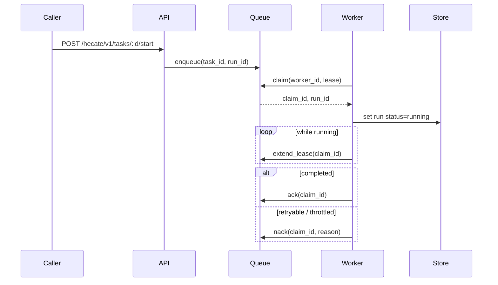

# Runtime API Notes

Hecate exposes a coding-runtime API surface under `/hecate/v1/tasks` for client-orchestrated agents. The runtime is durable: a run survives process restarts, can be resumed from a terminal state, and is leased to one worker at a time so two replicas can share a queue without stepping on each other.

For the high-level execution flow (lease semantics, sandbox boundary, event sequence), see [`architecture.md`](architecture.md#task-runtime-flow). For the LLM-driven `agent_loop` execution kind specifically (tools, approval gating, cost tracking, retry-from-turn semantics), see [`agent-runtime.md`](agent-runtime.md).

> Contributing here? Start at [`AGENTS.md`](../AGENTS.md) for the codebase map and runtime invariants; conventions, workflow, and verification ladders live under [`docs-ai/`](../docs-ai/README.md).

## API namespaces

Hecate serves three intentionally separate HTTP surfaces:

| Namespace | Purpose |
|---|---|
| `/v1/*` | Provider-compatible protocol ingress. These paths stay OpenAI- or Anthropic-shaped so existing SDKs can point at Hecate without learning Hecate-specific URLs. Today that means `GET /v1/models`, `POST /v1/chat/completions`, and `POST /v1/messages`. |
| `/hecate/v1/*` | Hecate-native product API: tasks, Hecate Chat sessions, external-agent adapters, settings, costs, traces, events, and system operations. Operator UI, MCP tools, ACP bridge, and Hecate-aware clients should use this namespace. |
| `/healthz` | Unversioned process liveness for local scripts, desktop sidecars, and load balancers. It is intentionally tiny and not wrapped in the normal `{object,data}` API envelope. |

OTLP collector/export endpoints keep their standard protocol paths
(`/v1/traces`, `/v1/metrics`, `/v1/logs`) when Hecate is configured to export to
an OpenTelemetry collector. Those are not Hecate product resources. Hecate's
local trace lookup for the operator UI is `GET /hecate/v1/traces`.

Legacy Hecate-native `/v1/*` and `/admin/*` paths are intentionally not kept as
compatibility shims in this alpha branch. Unknown API-shaped paths return 404
rather than falling through to the embedded UI shell.

## Error envelope

Hecate-native JSON errors use one stable envelope:

```json
{
  "error": {
    "type": "route_impossible",
    "message": "route request: no provider available",
    "user_message": "No configured provider can serve this request.",
    "operator_action": "Open Providers to inspect readiness checks, discover models, or enable a routable provider.",
    "request_id": "req_...",
    "trace_id": "..."
  }
}
```

- `type` is the stable machine code. Operator UI and automation should branch
  on this field, not raw text.
- `message` is the detailed gateway/runtime message. It may include provider or
  router wording.
- `user_message` is the short operator-facing summary.
- `operator_action` is the recommended next step.
- `request_id` and `trace_id` are included when the runtime has already created
  trace state. They mirror `X-Request-Id` / `X-Trace-Id` and let clients open
  `GET /hecate/v1/traces?request_id=...` directly from an error surface.
- Runtime-specific fields may be attached when they help repair the failure.
  Examples: `task_id`, `latest_run_id`, and `run_status` for a busy Hecate Chat
  task; `provider`, `model`, and `capabilities` for tool-capability failures;
  `limit_ms` / `turns_used` for session guardrails.

Common Hecate-native error types:

| Type | Status | Meaning |
|---|---:|---|
| `invalid_request` | 400 | Request JSON, query parameters, or required fields are invalid. |
| `not_found` | 404 | The requested Hecate resource does not exist. |
| `conflict` | 409 | The resource changed state or the requested transition is not valid now. |
| `gateway_error` | 500 | Hecate failed before it could classify the failure more specifically. |
| `rate_limit_exceeded` | 429 | The local gateway rate limiter rejected the request. |
| `model_not_configured` | 422 | The selected model is stale or not currently reported by the selected provider. |
| `agent_chat.agent_session_busy` | 409 | A Hecate Chat task-backed loop is queued, running, or awaiting approval. |
| `agent_chat.model_capability_required` | 422 | Tools are on, but the model is not marked tool-capable. |
| `agent_chat.workspace_required` | 400 | Hecate Agent or External Agent chat needs a workspace path. |
| `agent_chat.session_limit_exceeded` | 422 | The chat turn limit was reached. |
| `agent_chat.session_duration_limit_exceeded` | 422 | The chat wall-clock limit was reached. |
| `agent_chat.session_idle_timeout` | 422 | The chat was idle beyond the configured timeout. |

OpenAI-compatible and Anthropic-compatible ingress paths keep their protocol
shape, but gateway-classified failures also include the same
`user_message` / `operator_action` / correlation fields inside their `error`
object when available.

## Contents

- [API namespaces](#api-namespaces)
- [Error envelope](#error-envelope)
- [Core resources](#core-resources)
  - [Task fields](#task-fields)
  - [Run fields](#run-fields)
- [Lifecycle endpoints](#lifecycle-endpoints)
  - [Resume semantics](#resume-semantics)
  - [Retry-from-turn-N semantics](#retry-from-turn-n-semantics)
- [Execution detail endpoints](#execution-detail-endpoints)
- [Approval endpoints](#approval-endpoints)
  - [Approval kinds](#approval-kinds)
  - [Approval policy configuration](#approval-policy-configuration)
- [Event and stream endpoints](#event-and-stream-endpoints)
- [Queue execution model](#queue-execution-model)
- [Runtime backend and queue configuration](#runtime-backend-and-queue-configuration)
- [Health and discovery endpoints](#health-and-discovery-endpoints)
- [Rate-limit headers on chat / messages](#rate-limit-headers-on-chat--messages)

## Core resources

- `task`
- `task_run`
- `task_step`
- `task_artifact`
- `task_approval`
- `task_run_event`

### Task fields

The `task` resource accepts these fields on `POST /hecate/v1/tasks`:

- `execution_kind` — one of `shell`, `git`, `file`, `agent_loop`
- `prompt` — the user-facing prompt; required for `agent_loop`, optional description for the others
- `system_prompt` — per-task agent prompt (narrowest of the three-layer composition); `agent_loop` only
- `shell_command` / `git_command` / `file_path` / `file_content` / `file_operation` — execution-kind-specific
- `working_directory` — absolute path; required when `workspace_mode=in_place`
- `workspace_mode` — `""` / `"persistent"` / `"ephemeral"` (clone behavior, default) or `"in_place"` (run directly in `working_directory`); see [`agent-runtime.md`](agent-runtime.md#workspace-modes)
- `repo` / `base_branch` — alternate source for the workspace clone
- `sandbox_allowed_root` / `sandbox_read_only` / `sandbox_network` — sandbox policy for shell / git / file kinds; see [`sandbox.md`](sandbox.md) for the full policy and isolation model
- `requested_provider` / `requested_model` — pin the LLM (`agent_loop`); empty falls back to gateway default
- `budget_micros_usd` — per-task cost ceiling in micro-USD; `0` disables
- `mcp_servers` — `agent_loop`-only array of external MCP server configs whose tools join the LLM's tool catalog under `mcp__<name>__<tool>` aliases. Each entry picks one transport (stdio: `command` + optional `args` / `env`; HTTP: `url` + optional `headers`), and may set `approval_policy` (`auto` / `require_approval` / `block`). Capped per-task by `GATEWAY_TASK_MAX_MCP_SERVERS_PER_TASK`. Full schema, secret handling, and lifecycle in [`mcp.md#hecate-as-mcp-client`](mcp.md#hecate-as-mcp-client).
- `priority` / `timeout_ms`

`execution_profile` applies task-create defaults:

| Profile | Defaults |
|---|---|
| `repo_local` | `execution_kind=agent_loop`, `workspace_mode=persistent`, `working_directory=.`, `timeout_ms=120000` |
| `coding_agent` | Same as `repo_local`, plus `timeout_ms=300000` and a coding-oriented system prompt that nudges the model toward read-before-edit and `file_edit` for targeted changes |

### Run fields

`task_run` carries the cost figures the operator UI surfaces:

- `total_cost_micros_usd` — this run's LLM spend (after routing).
- `prior_cost_micros_usd` — cumulative spend of every prior run in this run's resume chain. Cumulative-across-task = `prior + total`.
- `model` / `provider` — what was actually used (after routing). May differ from the task's `requested_*` when the operator picked auto.

## Lifecycle endpoints

- `POST /hecate/v1/tasks`
- `GET /hecate/v1/tasks`
- `GET /hecate/v1/tasks/{id}`
- `DELETE /hecate/v1/tasks/{id}`
- `POST /hecate/v1/tasks/{id}/start` — returns `422 model_not_configured` when an `agent_loop` task has no model resolvable (neither `requested_model` on the task nor the gateway's default model is set). No run is created.
- `POST /hecate/v1/tasks/{id}/runs/{run_id}/retry`
- `POST /hecate/v1/tasks/{id}/runs/{run_id}/resume`
- `POST /hecate/v1/tasks/{id}/runs/{run_id}/continue`
- `POST /hecate/v1/tasks/{id}/runs/{run_id}/retry-from-turn`
- `POST /hecate/v1/tasks/{id}/runs/{run_id}/cancel`

### Resume semantics

- resume is allowed when the source run is terminal (`completed`, `failed`, or `cancelled`)
- resume creates a new run attempt (new `run_id`) rather than mutating the original run
- the new run reuses the prior run workspace when available, so file state carries forward
- optional payload: `{"reason":"..."}` to annotate the resume request
- resumed executions include checkpoint context (source run id, last completed step, last event sequence) in step input so executors/tools can continue from the prior boundary
- for `agent_loop` runs, the saved `agent_conversation` artifact is hydrated as the starting message history — the loop continues from where it left off rather than re-running prior turns
- the new run inherits the chain's cumulative cost via `PriorCostMicrosUSD`, so the per-task ceiling holds across the full chain

### Continue semantics

`POST /hecate/v1/tasks/{id}/runs/{run_id}/continue` body:

```json
{ "prompt": "follow-up instruction" }
```

- only valid for terminal `agent_loop` runs that produced an `agent_conversation` artifact
- creates a new run for the same task, hydrates the source conversation, appends the supplied user prompt, then resumes the loop
- used by ACP/editor sessions where one editor conversation maps to one durable Hecate task and each user prompt becomes the next Hecate run
- returns 409 when the source run is still active, and 400 for non-agent tasks, empty prompts, or missing/malformed conversation artifacts

### Retry-from-turn-N semantics

`POST /hecate/v1/tasks/{id}/runs/{run_id}/retry-from-turn` body:

```json
{ "turn": 2, "reason": "explore alternative" }
```

- only valid on `agent_loop` runs that produced an `agent_conversation` artifact
- `turn` must be in `[1, count(assistant turns)]`; out-of-range turns return 400
- creates a new run whose conversation is truncated to right before the Nth assistant message; the LLM re-issues that turn from the prior context
- step indices on the new run restart at 1 (semantically a fresh run that happens to share prior context, not a continuation)
- see [`agent-runtime.md`](agent-runtime.md#retry-and-resume) for the full flow

## Execution detail endpoints

- `GET /hecate/v1/tasks/{id}/runs`
- `GET /hecate/v1/tasks/{id}/runs/{run_id}`
- `GET /hecate/v1/tasks/{id}/runs/{run_id}/steps`
- `GET /hecate/v1/tasks/{id}/runs/{run_id}/steps/{step_id}`
- `GET /hecate/v1/tasks/{id}/runs/{run_id}/artifacts`
- `GET /hecate/v1/tasks/{id}/runs/{run_id}/artifacts/{artifact_id}`
- `GET /hecate/v1/tasks/{id}/artifacts`
- `GET /hecate/v1/tasks/{id}/runs/{run_id}/patches`
- `GET /hecate/v1/tasks/{id}/runs/{run_id}/patches/{artifact_id}`
- `POST /hecate/v1/tasks/{id}/runs/{run_id}/patches/{artifact_id}/apply`
- `POST /hecate/v1/tasks/{id}/runs/{run_id}/patches/{artifact_id}/revert`

`patches` is a review-focused projection over `patch` artifacts. File-writing tools create patches with `status=applied`; `file_edit` can also create `status=proposed` patches when called with `propose=true`. The apply endpoint writes the proposed after-content only when the current file still matches the captured before-content, then emits `tool.file.applied`. The revert endpoint restores the before-content captured in Hecate's patch artifact and updates the patch to `status=reverted`. Reverting a new-file patch removes the file. Reverting emits `tool.file.reverted` on the run-event stream.

## Approval endpoints

- `GET /hecate/v1/tasks/{id}/approvals`
- `GET /hecate/v1/tasks/{id}/approvals/{approval_id}`
- `POST /hecate/v1/tasks/{id}/approvals/{approval_id}/resolve`

### Approval kinds

The `kind` field on a `task_approval` is one of:

- `shell_command` — pre-execution gate for `execution_kind=shell` tasks
- `git_exec` — pre-execution gate for `execution_kind=git` tasks
- `file_write` — pre-execution gate for `execution_kind=file` tasks
- `network_egress` — pre-execution gate when `sandbox_network=true`
- `agent_loop_tool_call` — mid-loop gate when an `agent_loop` run calls a gated tool (`shell_exec`, `http_request`, etc.). The reason text lists the tools the agent wants to use. See [`agent-runtime.md`](agent-runtime.md#approval-gating) for the full flow.

Resolve payload: `{"decision": "approve" | "reject", "note": "..."}`. Approving an `agent_loop_tool_call` requeues the same run; the loop dispatches the approved tool calls without re-calling the LLM. Cancelling an `awaiting_approval` run marks the pending approval `cancelled`; resolving it afterward returns a conflict instead of mutating stale state.

### Approval policy configuration

`GATEWAY_TASK_APPROVAL_POLICIES` (default `shell_exec,git_exec,file_write`) is a comma-separated allowlist of which approval gates are active across the task runtime. It controls both pre-execution gates on `shell` / `git` / `file` tasks **and** mid-loop gates inside `agent_loop` runs — same env var, same names. Recognized values:

| Value | Effect |
|---|---|
| `shell_exec` | Gate `execution_kind=shell` task creates and `agent_loop` `shell_exec` tool calls. |
| `git_exec` | Gate `execution_kind=git` task creates and `agent_loop` `git_exec` tool calls. |
| `file_write` | Gate `execution_kind=file` task creates and `agent_loop` `file_write` / `file_edit` tool calls. |
| `network_egress` | Gate task creates that opt into `sandbox_network=true` and `agent_loop` `http_request` tool calls. |
| `read_file` | Gate `agent_loop` `read_file` tool calls. Useful when operators want visibility into every file the agent reads, not just what it writes. |
| `all_tools` | Gate every agent tool call (`shell_exec`, `git_exec`, `file_write`, `file_edit`, `read_file`, `list_dir`, `http_request`) and all pre-execution task gates. Short-circuits to the full set — no need to list individual names. |

Unknown policy names are rejected at startup with a clear error. Empty value disables every gate (use only in trusted environments). For per-MCP-server gating in `agent_loop` runs, see `approval_policy` on `mcp_servers` entries in [`mcp.md#approval-policy`](mcp.md#approval-policy).

## Event and stream endpoints

### Per-run events

- `GET /hecate/v1/tasks/{id}/runs/{run_id}/events?after_sequence=<n>`
- `POST /hecate/v1/tasks/{id}/runs/{run_id}/events`
- `GET /hecate/v1/tasks/{id}/runs/{run_id}/stream?after_sequence=<n>`

The JSON list returns agent event protocol v1 envelopes:
`schema_version`, `event_id`, `task_id`, `run_id`, `sequence`,
`occurred_at`, `type`, and `data`.

Stream resume also supports `Last-Event-ID`. Each per-run SSE frame carries the
current run state, steps, artifacts, activity, and approvals scoped to that run
so the operator UI can drive approval banners and progress surfaces without a
separate refetch (`TaskRunStreamEventData.Approvals`). The frame's `event_type`
mirrors the persisted event that produced the state refresh.

The frame also includes a normalized `activity` array for clients that want a
coding-agent-style timeline without reconstructing it from raw steps and
artifacts. Activity item types include `thinking`, `tool_call`, `patch`,
`changed_files`, `final_answer`, `approval`, and `run_result`. Approval
activities carry `approval_id` and `needs_action` when a user decision is
pending. The operator UI uses this same array in both Task Detail and Hecate
Chat transcript projections; clients should treat it as the compact timeline
surface and use raw steps/artifacts/events only for deeper inspection. Task
Detail may expose the raw `TaskActivityItem` fields behind an advanced
disclosure, but Chats should favor the compact projection.

### Public events feed

For external dashboards (Grafana, Slack notifiers, audit log shippers) that want one subscription instead of per-run polling:

- `GET /hecate/v1/events?event_type=<csv>&task_id=<id>&after_sequence=<n>&limit=<n>` — paginated JSON list with cursor-based pagination
- `GET /hecate/v1/events/stream?event_type=<csv>` — long-lived SSE feed; reconnect via `Last-Event-ID`

Both endpoints emit the same v1 event envelopes as the per-run event list.
Filters AND together; within a slice (`event_type` is comma-separated) the match
is OR. `after_sequence` is the event sequence cursor, strictly greater.

### Event types

The full catalog of event types — including payload shapes, when each fires, and per-event extras — lives in [`events.md`](events.md). Highlights:

- `run.*` lifecycle (`run.created` / `run.queued` / `run.started` / `run.finished` / `run.failed` / `run.cancelled`)
- typed `tool.*` events for in-run tool lifecycle detail
- `approval.requested` / `approval.resolved` for human-gating flows
- `turn.completed` for per-LLM-turn cost ledgers in `agent_loop` runs
- `run.resumed_from_event` for resume / retry-from-turn chains

## Queue execution model

When a run is queued, workers consume it through a claim/lease protocol:

1. enqueue `task_id` + `run_id`
2. worker claims with a time-bound lease
3. worker heartbeats to extend lease while work is running
4. worker `ack`s on success/terminal handling or `nack`s to requeue
5. expired leases can be reclaimed by another worker



## Runtime backend and queue configuration

- `GATEWAY_TASKS_BACKEND=memory|sqlite`
- `GATEWAY_TASK_QUEUE_BACKEND=memory|sqlite`
- `GATEWAY_TASK_QUEUE_WORKERS=<int>`
- `GATEWAY_TASK_QUEUE_BUFFER=<int>`
- `GATEWAY_TASK_QUEUE_LEASE_SECONDS=<int>`
- `GATEWAY_TASK_MAX_CONCURRENT=<int>` (`0` disables the limit)
- `GATEWAY_TASK_RECONCILE_INTERVAL=<duration>` (default `30s`; Go duration string — e.g. `"1m"`; how often the periodic reconciler scans for stalled runs; runs stuck in `running` longer than 3× `GATEWAY_TASK_QUEUE_LEASE_SECONDS` are automatically re-queued and emit `gap.run_disconnected` with `reason=worker_lease_expired`)
- `GATEWAY_TASK_MAX_MCP_SERVERS_PER_TASK=<int>` (default `16`; caps `mcp_servers` entries on `agent_loop` task creates; `0` disables the check)
- `GATEWAY_TASK_MCP_CLIENT_CACHE_MAX_ENTRIES=<int>` (default `256`; soft cap on the gateway-wide MCP client cache; LRU-idle eviction kicks in at the cap, with fail-open when every entry is in use)
- `GATEWAY_TASK_MCP_CLIENT_CACHE_PING_INTERVAL=<duration>` (default `60s`; how often the cache pings each idle cached upstream to detect wedged subprocesses; `0` disables the proactive health check, leaving only reactive eviction in `Pool.Call`)
- `GATEWAY_TASK_MCP_CLIENT_CACHE_PING_TIMEOUT=<duration>` (default `5s`; per-ping deadline; failure or timeout evicts the entry)

When `GATEWAY_TASKS_BACKEND` is `sqlite`, tasks/runs/steps/approvals/artifacts/run-events are persisted and the stream replay cursor is durable across restarts. When `GATEWAY_TASK_QUEUE_BACKEND` is `sqlite`, workers claim queue items with renewable leases, so pending runs survive process restarts and can be recovered when a lease expires.

For `agent_loop`-specific knobs (max turns, system-prompt layers, HTTP policy for the `http_request` tool), see [`agent-runtime.md`](agent-runtime.md#configuration-knobs).

`GET /hecate/v1/system/stats` also reports queue health fields including queue depth, queue capacity, worker count, and `queue_backend`.

The response also surfaces `agent_adapter_approval_mode` — the configured mode for the external-agent adapter approval coordinator: `"auto"`, `"prompt"`, or `"deny"`. Operators surface a danger banner in the UI when this is `"auto"` since every adapter `RequestPermission` is permitted without review. Empty when the gateway was built without an approval coordinator (legacy configs / test fixtures).

`GET /hecate/v1/system/mcp/cache` returns a snapshot of the shared MCP client cache:

```json
{
  "object": "mcp_cache_stats",
  "data": {
    "checked_at": "2026-04-29T01:00:00.123Z",
    "configured": true,
    "entries": 4,
    "in_use": 1,
    "idle": 3
  }
}
```

`configured: false` means no cache is wired (the deploy explicitly disabled it via `Handler.SetMCPClientCache(nil)`); the counter fields are present but zero so operator UIs can render a "no cache" cell instead of error-handling. `in_use` is the **sum** of refcounts across all entries (an entry held by two concurrent runs counts as 2), not the number of entries with at least one acquirer; `idle` is the count of entries with refcount=0. See [`mcp.md`](mcp.md#lifecycle-and-caching) for the underlying contract.

`POST /hecate/v1/mcp/probe` is the dry-run discovery surface for an MCP server config. It accepts a single MCP server entry (same shape as one item in the task-create `mcp_servers` array — `name` defaults to `probe` when omitted), brings the server up the way an `agent_loop` run would (same secret resolution, same uncached spawn path), calls `tools/list`, and tears it down. Returns the upstream's tool catalog so operators can confirm the config before committing it to a task.

```json
POST /hecate/v1/mcp/probe
{
  "command": "bunx",
  "args": ["--bun", "@modelcontextprotocol/server-filesystem", "/workspace"]
}

→ 200
{
  "object": "mcp_probe",
  "data": {
    "tools": [
      { "name": "read_text_file", "description": "...", "input_schema": {...} },
      { "name": "list_directory", "input_schema": {...} }
    ]
  }
}
```

Tool names come back un-namespaced — the operator wants to see what the upstream itself calls them, not the gateway's runtime alias. Bounded by a 10-second deadline; a stuck upstream surfaces as a 400 with the diagnostic rather than wedging the request.

## Health and discovery endpoints

### `GET /healthz`

Liveness probe. Returns `200` with the gateway's current time and version. Suitable for sidecar health checks, Kubernetes `livenessProbe` / `readinessProbe`, and Docker Compose `healthcheck`.

```json
GET /healthz
→ 200
{
  "status": "ok",
  "time": "2026-04-29T12:34:56Z",
  "version": "0.0.0-dev"
}
```

The endpoint is intentionally cheap: it doesn't touch the database, providers, or queue. A `200` here means "the process is up and serving HTTP," not "every backend is healthy." For deeper signal use `GET /hecate/v1/system/stats`.

### `GET /hecate/v1/providers/presets`

Provider catalog the UI's task-create form uses to render the provider picker. Each entry carries the operator-facing display name, the kind (`cloud` / `local`), the protocol Hecate speaks to it, the `BASE_URL` / `API_KEY` env-var pattern (so the UI can show which `PROVIDER_<NAME>_*` variables to set), the default model, and a short `env_snippet` ready to paste into `.env`.

```json
GET /hecate/v1/providers/presets
→ 200
{
  "object": "provider_presets",
  "data": [
    {
      "id": "openai",
      "name": "OpenAI",
      "kind": "cloud",
      "protocol": "openai",
      "base_url": "https://api.openai.com/v1",
      "api_key_env": "OPENAI_API_KEY",
      "default_model": "gpt-5.4-mini",
      "docs_url": "https://platform.openai.com/docs",
      "description": "OpenAI's Responses + Chat Completions API.",
      "env_snippet": "OPENAI_API_KEY=your_api_key_here"
    },
    ...
  ]
}
```

The list is built from `config.BuiltInProviders()` — see [`docs/providers.md`](providers.md) for the full catalog and OpenAI-compatible custom-endpoint flow.

### `GET /hecate/v1/providers/status`

Runtime provider readiness snapshot. The UI uses this endpoint to explain
whether a configured provider can receive traffic right now and why it may be
skipped by routing.

```json
GET /hecate/v1/providers/status
→ 200
{
  "object": "provider_status",
  "data": [
    {
      "name": "ollama",
      "kind": "local",
      "status": "healthy",
      "healthy": true,
      "base_url": "http://127.0.0.1:11434/v1",
      "models": ["llama3.1:8b"],
      "model_count": 1,
      "credential_state": "not_required",
      "credential_ready": true,
      "routing_ready": true,
      "readiness_checks": [
        {
          "name": "credentials",
          "status": "ok",
          "reason": "not_required",
          "message": "No credentials are required for this provider."
        },
        {
          "name": "models",
          "status": "ok",
          "reason": "models_discovered",
          "message": "1 model discovered."
        },
        {
          "name": "health",
          "status": "ok",
          "reason": "healthy",
          "message": "Provider health checks are passing."
        },
        {
          "name": "routing",
          "status": "ok",
          "reason": "routable",
          "message": "Provider is eligible for routing."
        }
      ]
    }
  ]
}
```

`readiness_checks` is the canonical operator-facing checklist. It prevents
clients from guessing readiness by combining unrelated raw fields. Check names
are currently `credentials`, `models`, `health`, and `routing`; statuses are
`ok`, `warning`, `blocked`, or `unknown`. `reason` is stable enough for UI
branching, while `message` is safe to show directly to the operator.
When a check needs operator action, `operator_action` carries the canonical
repair step; clients should prefer it over deriving their own copy from
`reason`. For example `credential_missing` includes "add or rotate
credentials", `no_models` includes "start the provider and load at least one
model", and `provider_rate_limited` includes "wait for cooldown or route
elsewhere".

`routing_ready=false` means the router currently skips the provider. The
matching `routing_blocked_reason` and the `reason` on the
`readiness_checks[]` item whose `name` is `routing` use the same vocabulary as
route diagnostics: `credential_missing`, `provider_disabled`,
`provider_rate_limited`, `circuit_open`, `provider_unhealthy`, and `no_models`.
Other checks use reason values scoped to that check, such as
`default_model_only` for model-discovery fallback, `discovery_failed` when the
provider could not return a model list, `self_referential` when a provider URL
points back to Hecate, `provider_slow` when a latency-degraded provider remains
routable, or `not_required` for local providers that do not need credentials.

The trace inspector reuses the same vocabulary in route candidates. A selected
candidate is paired with the route reason (`requested_model`, `pinned_provider`,
`global_default_model`, etc.); skipped candidates carry `skip_reason` values
such as `policy_denied`, `budget_denied`, `provider_rate_limited`,
`provider_less_stable`, or `preflight_price_missing`. This keeps the operator
debugging path consistent: Providers explains whether a route is possible now,
and Observability explains how a specific request moved through the candidates.

### `GET /hecate/v1/settings/providers/local-discovery`

Advisory discovery for the Providers tab's **Add provider → Local** catalog.
The gateway checks whether the expected provider command is on `PATH` and
probes each unique default local endpoint once. Shared endpoints, such as the
`llama.cpp` / `LocalAI` default `127.0.0.1:8080/v1`, are only called once and
then reused for every matching preset card.

```json
GET /hecate/v1/settings/providers/local-discovery
→ 200
{
  "object": "local_provider_discovery",
  "data": [
    {
      "preset_id": "ollama",
      "name": "Ollama",
      "base_url": "http://127.0.0.1:11434/v1",
      "probe_url": "http://127.0.0.1:11434/api/tags",
      "status": "running",
      "command": "ollama",
      "command_available": true,
      "command_path": "/opt/homebrew/bin/ollama",
      "http_available": true,
      "model_count": 2,
      "models": ["llama3.1:8b", "qwen2.5:7b"]
    }
  ]
}
```

`status` is one of:

- `running` — the HTTP probe returned 2xx.
- `installed` — the command is present on `PATH`, but the default HTTP
  endpoint did not respond.
- `not_detected` — neither the command nor the default HTTP endpoint was found.

This endpoint does not create or mutate provider records. It is a UX helper for
the picker; routing readiness still comes from `GET /hecate/v1/providers/status` after the
operator adds a provider.

### `GET /v1/models`

Lists models currently known to configured providers. Each row includes Hecate
metadata under `metadata`, including the effective model capability snapshot
used by the Chats target picker.

```json
GET /v1/models
→ 200
{
  "object": "list",
  "data": [
    {
      "id": "qwen2.5-coder",
      "object": "model",
      "owned_by": "ollama",
      "metadata": {
        "provider": "ollama",
        "provider_kind": "local",
        "default": false,
        "discovery_source": "provider",
        "capabilities": {
          "tool_calling": "unknown",
          "streaming": true,
          "max_context_tokens": 32768,
          "source": "provider"
        }
      }
    }
  ]
}
```

`capabilities.tool_calling` is one of `unknown`, `none`, `basic`, or
`parallel`. Hecate Agent treats tools as on by default and only blocks a model
when the effective value is `none`. Local/custom models often report
`unknown`; operators can use Settings → Model capabilities to explicitly turn
tools on or off for a provider/model pair.

### `PUT /hecate/v1/model-capabilities/overrides`

Stores an operator override for a provider/model capability record. Overrides
win over manual probe results, catalog defaults, and provider-discovered
metadata.

```json
PUT /hecate/v1/model-capabilities/overrides
{
  "provider": "ollama",
  "model": "qwen2.5-coder",
  "tool_calling": "basic",
  "streaming": true,
  "max_context_tokens": 32768,
  "note": "Validated locally with a tool-call prompt."
}

→ 200
{
  "object": "model_capability",
  "data": {
    "provider": "ollama",
    "model": "qwen2.5-coder",
    "tool_calling": "basic",
    "streaming": true,
    "max_context_tokens": 32768,
    "source": "operator_override",
    "note": "Validated locally with a tool-call prompt.",
    "updated_at": "2026-05-05T10:00:00Z"
  }
}
```

`tool_calling` must be `none`, `basic`, or `parallel` for overrides. Use
`DELETE /hecate/v1/model-capabilities/overrides?provider=...&model=...` to remove an
operator override and fall back to the next capability source.

### `POST /hecate/v1/model-capabilities/probes`

Records a manual probe result. Hecate does not run background capability probes
in this version; this endpoint persists an operator-supplied result after the
operator has tested the model.

```json
POST /hecate/v1/model-capabilities/probes
{
  "provider": "ollama",
  "model": "qwen2.5-coder",
  "tool_calling": "basic",
  "note": "Manual tool-call probe succeeded."
}
```

Manual probe results lose to operator overrides and win over catalog/provider
defaults.

### `GET /hecate/v1/agent-adapters`

External coding-agent adapter catalog. This is the first discovery surface for
Agent Chat: it reports the agent runtimes Hecate knows how to supervise and
whether their direct command or Hecate-managed launcher can be started.

```json
GET /hecate/v1/agent-adapters
→ 200
{
  "object": "agent_adapters",
  "data": [
    {
      "id": "codex",
      "name": "Codex",
      "kind": "acp",
      "command": "codex-acp",
      "managed": true,
      "managed_package": "@zed-industries/codex-acp",
      "available": true,
      "status": "available",
      "path": "/Users/alice/Library/Caches/hecate/agent-adapters/codex-acp",
      "cost_mode": "external",
      "version": "1.2.3",
      "supported_range": ">=0.1.0",
      "version_outside_range": false,
      "auth_status": "ok"
    },
    {
      "id": "cursor_agent",
      "name": "Cursor Agent",
      "kind": "acp",
      "command": "cursor-agent",
      "args": ["acp"],
      "available": true,
      "status": "available",
      "path": "/Users/alice/.local/bin/cursor-agent",
      "cost_mode": "external",
      "version": "0.0.9",
      "supported_range": ">=0.1.0",
      "version_outside_range": true,
      "auth_status": "unauthenticated",
      "auth_error": "Run cursor-agent login, or set CURSOR_API_KEY for the adapter environment."
    },
    {
      "id": "claude_code",
      "name": "Claude Code",
      "kind": "acp",
      "command": "claude-agent-acp",
      "managed": true,
      "managed_package": "@agentclientprotocol/claude-agent-acp",
      "available": false,
      "status": "missing",
      "error": "exec: \"claude-agent-acp\": executable file not found in $PATH; managed launcher unavailable: no local package runner found for @agentclientprotocol/claude-agent-acp",
      "cost_mode": "external",
      "supported_range": ">=0.1.0",
      "auth_status": "unknown",
      "auth_error": "Run claude /status or claude login if the ACP probe reports auth or billing errors."
    }
  ]
}
```

`version` is populated by running the binary with `--version` and extracting
the first semver-shaped token from stdout; it is absent when the adapter is
missing or when the binary does not print a recognisable version string.
`version_outside_range` is `true` when both `version` and `supported_range`
are present and the version does not satisfy the constraint — the Settings UI
shows an amber "outside tested range" chip in that case.

`auth_status` is a lightweight dashboard hint, not a full login check. Values:
`ok`, `unauthenticated`, `billing`, or `unknown`. It is derived from known env
vars and login files without spawning the adapter. Use `POST
/hecate/v1/agent-adapters/{id}/probe` for the full ACP handshake.

These are **agent adapters**, not model providers. They run ACP-compatible
external coding agents under Hecate supervision; cost is reported as `external`
until an adapter can supply structured usage.

### `POST /hecate/v1/agent-adapters/{id}/probe`

Re-runs discovery for one adapter, then performs the same end-to-end ACP probe
as `/health`. The response includes the fresh catalog row plus the health
result, so UIs can update a single Settings row after the operator logs in or
installs a missing dependency.

```json
POST /hecate/v1/agent-adapters/codex/probe
→ 200
{
  "object": "agent_adapter_probe",
  "data": {
    "adapter": {
      "id": "codex",
      "name": "Codex",
      "kind": "acp",
      "command": "codex-acp",
      "available": true,
      "status": "available",
      "auth_status": "ok"
    },
    "health": {
      "adapter_id": "codex",
      "status": "ready",
      "stage": "ready",
      "duration_ms": 412
    }
  }
}
```

Status codes:
- `200 OK` when the adapter id is registered; `health.status` carries
  `ready`, `not_installed`, `auth_required`, or `error`.
- `404 not_found` when the adapter id is not registered.

### `GET /hecate/v1/agent-adapters/{id}/health`

Probes a single adapter end-to-end and classifies the outcome so operators can
distinguish "binary missing" from "binary on PATH but auth failing" without
reading raw error text. The probe does spawn → ACP `Initialize` → ACP
`NewSession` against a temporary workspace → terminate; it never issues a
chat prompt.

```json
GET /hecate/v1/agent-adapters/codex/health
→ 200
{
  "object": "agent_adapter_health",
  "data": {
    "adapter_id": "codex",
    "status": "auth_required",
    "stage": "initialize",
    "path": "/Users/alice/.local/bin/codex-acp",
    "error": "Authentication required",
    "hint": "Adapter started but failed authentication. Try the adapter's CLI login flow or set its API-key env var.",
    "duration_ms": 412
  }
}
```

`status` is one of:

- `ready` — spawn + Initialize + NewSession all succeeded.
- `not_installed` — binary not on PATH and managed launcher unavailable.
- `auth_required` — process started but Initialize or NewSession failed with
  an auth-shaped error (`Authentication required`, `Please log in`, `API key`,
  `Credit balance is too low`, `401`, `403`, …).
- `error` — anything else. `error` and `stderr` carry the verbatim diagnostic
  so the operator can act on it.

`stage` reports which step in the sequence completed (on success) or failed (on
error): `lookup` / `spawn` / `initialize` / `new_session` / `ready`.

Status codes:
- `200 OK` with the typed result on every classification (`ready`,
  `not_installed`, `auth_required`, `error`). The probe completing
  successfully is itself a 200; the adapter's status lives in the body.
- `404 not_found` when the adapter id is not registered.

The probe creates and immediately abandons a fresh ACP session, so adapters
that bill on session creation will see one no-op session per call. Adapters
that bill on prompt completion see no charge.

### `POST /hecate/v1/agent-adapters/{id}/refresh-launcher`

Deletes and recreates the Hecate-managed launcher script for a managed adapter
such as Codex or Claude Code, then returns a one-item `agent_adapters` response
with the refreshed status. This is useful after changing Node/npm managers or
when `HECATE_AGENT_ADAPTERS_DIR` points at a stale cache.

```json
POST /hecate/v1/agent-adapters/codex/refresh-launcher
→ 200
{
  "object": "agent_adapters",
  "data": [
    {
      "id": "codex",
      "name": "Codex",
      "kind": "acp",
      "command": "codex-acp",
      "managed": true,
      "managed_package": "@zed-industries/codex-acp",
      "available": true,
      "status": "available"
    }
  ]
}
```

Status codes:
- `200 OK` for managed adapters when a local package runner such as `npx` is
  available.
- `404 not_found` when the adapter id is not registered.
- `409 conflict` when the adapter is not managed or the launcher cannot be
  recreated.

### `GET /hecate/v1/agent-chat/sessions`

Lists Agent Chat sessions. Agent Chat uses the same backend selection as model
chat history: memory by default, SQLite when
`GATEWAY_CHAT_SESSIONS_BACKEND=sqlite`. It is the alpha transcript surface for
Hecate Chat and External Agent sessions:

- `runtime_kind="model"` — Hecate Chat sends the turn directly through the
  gateway/router to the selected provider/model. No task is created and no
  tools run, but the turn is stored in the same transcript as later Hecate
  Agent turns.
- `runtime_kind="agent"` — Hecate creates and continues a visible
  `agent_loop` task with Hecate tools, task approvals, artifacts, and OTel.
  The chat transcript projects backing task-run activity and can resolve
  pending task approvals through the existing task approval endpoint.
- `runtime_kind="external_agent"` — Codex, Claude Code, Cursor Agent, or
  another adapter owns the native session while Hecate supervises lifecycle,
  transcript, diagnostics, and external-agent approvals.

`GATEWAY_CHAT_SESSIONS_BACKEND=sqlite` is the single selector for the entire
agent-chat state bundle: sessions, messages, **and** the operator-facing
approval rows + grants documented under
`/hecate/v1/agent-chat/sessions/{id}/approvals` and `/hecate/v1/agent-chat/grants`. They all
move together so agent-chat state can't go split-brain. On startup the gateway
runs a reconcile pass that flips any approvals stuck in `pending` from a prior
process to `status=timed_out` with `path=startup_reconcile` — process-local
waiters can't be resurrected, so the operator UI never sees an actionable
"pending" row that nothing is actually blocked on.

Resolved approvals are pruned by the retention worker
(`GATEWAY_RETENTION_AGENT_CHAT_APPROVALS_*`, default 30d / 10k). Operator-
authored grants are NOT subject to that retention — only their own
`expires_at` drives deletion, so explicit operator intent outlives normal
retention windows.

The same per-session SSE stream (`GET /hecate/v1/agent-chat/sessions/{id}/stream`)
also carries approval lifecycle events so frontends don't have to poll. Two
event types are emitted in addition to normal chat session updates:

```
event: approval.requested
data: {
  "approval_id":   "appr_01JX...",
  "session_id":    "chat_01JX...",
  "adapter_id":    "codex",
  "tool_kind":     "file_write",
  "tool_name":     "Edit src/foo.go",
  "scope_choices": ["once","session","workspace_tool","adapter_tool"],
  "created_at":    "2026-05-04T10:23:45.123Z",
  "expires_at":    "2026-05-04T10:28:45.123Z"
}

event: approval.resolved
data: {
  "approval_id":     "appr_01JX...",
  "session_id":      "chat_01JX...",
  "status":          "approved",
  "decision":        "approve",
  "scope":           "session",
  "path":            "operator",
  "selected_option": "allow_always_for_session",
  "resolved_at":     "2026-05-04T10:24:01.000Z"
}
```

Frontends switch on the `path` field of `approval.resolved` to render the
disposition: `operator` (explicit decision), `grant` (pre-existing grant
short-circuited the prompt), `default_mode` (`auto`/`deny` mode resolved
without operator), `timeout` (prompt-mode timeout fired), or
`request_cancelled` (the request context died — session shutdown, adapter
teardown, HTTP context cancellation, process stop). `request_cancelled` is
operationally distinct from `operator`: nobody clicked anything, the request
just died.

Backpressure: per-subscriber buffers are bounded (16 events). On overflow,
approval events are **dropped** rather than blocking the coordinator. A
slow operator UI catches up by re-fetching `/approvals?status=pending` on
reconnect. Replay across restart is not supported in this slice.

```json
GET /hecate/v1/agent-chat/sessions
→ 200
{
  "object": "agent_chat_sessions",
  "data": [
    {
      "id": "agent_chat_...",
      "title": "Hecate Chat",
      "runtime_kind": "model",
      "provider": "ollama",
      "model": "qwen2.5-coder",
      "capabilities": {
        "tool_calling": "basic",
        "streaming": true,
        "source": "operator_override"
      },
      "status": "completed",
      "turns_used": 3,
      "max_turns_per_session": 50,
      "session_started_at": "2026-05-03T12:00:00Z",
      "max_session_duration_ms": 7200000,
      "idle_timeout_ms": 1800000,
      "message_count": 2,
      "created_at": "2026-05-03T12:00:00Z",
      "updated_at": "2026-05-03T12:00:08Z"
    }
  ]
}
```

### `POST /hecate/v1/agent-chat/sessions`

Creates an Agent Chat session. `runtime_kind` chooses the execution target:

- `model` requires `model`. `provider` is optional; when omitted, Hecate uses
  the normal routing path for the requested model. `workspace` is optional
  because no local tools run.
- `agent` requires `provider`, `model`, and `workspace`.
- `external_agent` requires `adapter_id` and `workspace`.

When `workspace` is provided, it must be an operator-controlled local
directory. Hecate validates and canonicalizes the path before a tool-backed or
external-agent run starts, so later runs use the resolved directory instead of
failing only after execution starts.

```json
POST /hecate/v1/agent-chat/sessions
{
  "runtime_kind": "model",
  "provider": "ollama",
  "model": "qwen2.5-coder",
  "title": "Hecate Chat"
}

→ 200
{
  "object": "agent_chat_session",
  "data": {
    "id": "agent_chat_...",
    "title": "Hecate Chat",
    "runtime_kind": "model",
    "provider": "ollama",
    "model": "qwen2.5-coder",
    "capabilities": {
      "tool_calling": "basic",
      "streaming": true,
      "source": "operator_override"
    },
    "status": "idle",
    "turns_used": 0,
    "session_started_at": "2026-05-03T12:00:00Z",
    "messages": []
  }
}
```

### `GET /hecate/v1/agent-chat/sessions/{id}`

Returns the full session transcript, including user messages and assistant
messages produced by the backing runtime. Hecate Agent sessions include
`task_id`, `latest_run_id`, `provider`, `model`, and the capability snapshot
used when the session was created. Individual agent-chat messages also carry a
runtime snapshot: `runtime_kind`, `segment_id`, optional `task_id`, optional
`run_id`, provider/model, and capabilities. Frontends should prefer those
message-level fields when rendering historical turns because the session header
can change as the operator switches tools on/off. If tools are re-enabled after
a direct model segment, Hecate creates a new task-backed segment in the same
transcript; older messages keep their original runtime/model/task snapshots.

The response also includes a derived `segments` array. Messages remain the
durable source of truth; segments are a render helper that groups contiguous
turns with the same `segment_id` so clients can show transcript boundaries such
as "tools off with smollm2" → "tools on with qwen2.5-coder". Each segment
contains its `runtime_kind`, provider/model snapshot, optional `task_id`,
latest run id, status, message count, and first/last timestamps.

### `POST /hecate/v1/agent-chat/sessions/{id}/messages`

Sends the submitted prompt to the session's backing runtime and appends both
the user message and assistant output.

`POST` also accepts per-turn overrides:

- `runtime_kind` — `model`, `agent`, or `external_agent`. Hecate Chat
  sessions may switch between `model` and `agent`; External Agent
  sessions cannot switch into Hecate Chat runtimes.
- `provider` / `model` — used for direct model turns and new Hecate Agent
  task-backed segments. Existing Hecate Agent task segments continue with their
  saved model snapshot until the operator turns tools off or starts a new
  task-backed segment.
- `system_prompt` — applied to direct model turns.
- `workspace` — required when starting a Hecate Agent turn on a session that
  does not already have a workspace.

For `runtime_kind="model"`, Hecate calls the normal gateway path and stores the
user/assistant messages without creating a Task. For
`runtime_kind="external_agent"`, Hecate sends the prompt to the session's
native ACP session. For `runtime_kind="agent"`, the first tool-enabled
prompt creates a visible `agent_loop` task and starts it; follow-up prompts
continue the latest terminal run when the immediately previous segment was also
Hecate Agent. If the previous segment was direct model chat, Hecate starts a
fresh task-backed segment in the same transcript.

Only one task-backed segment can be active in a Hecate Chat session at a time.
If the latest backing task is queued, running, or awaiting approval, **all** new
turns on that chat are rejected with `409 agent_chat.agent_session_busy`,
including direct `runtime_kind="model"` turns. Operators should wait for the
task to finish, resolve the pending approval, or cancel/stop the active run
before sending another prompt. The operator UI layers a local composer queue on
top of that API contract: prompts submitted while a run is busy are held in a
client-side FIFO and posted only after the active task reaches a terminal
state. Queue entries are scoped to the chat session that created them so a
prompt cannot drain into a different transcript after the operator switches
sessions. That queue is intentionally not durable until each prompt is
submitted.

Clients can block obvious stale selections by combining `/v1/models` with
`/hecate/v1/providers/status`, but the server remains authoritative. If a stale
provider/model selection slips through, Hecate Chat returns
`422 model_not_configured` with provider readiness fields, suggested replacement
models, and an `operator_action` repair hint in the error details.

The response returns after the backing turn finishes, times out, is cancelled,
or fails. For live output while the turn is running, subscribe to the session
stream before posting the message. Hecate Agent turns update the running
assistant message's `content` when the backing task's model route supports
streaming; non-streaming providers still publish the final assistant content
when the run finishes. External Agent turns continue to publish normalized
adapter output as it arrives.

Before starting the adapter, Hecate enforces optional agent-chat guardrails:
`GATEWAY_AGENT_CHAT_MAX_TURNS_PER_SESSION`,
`GATEWAY_AGENT_CHAT_MAX_SESSION_DURATION`, and
`GATEWAY_AGENT_CHAT_IDLE_TIMEOUT`. Each returns HTTP 422 with a stable
`error.type` when exceeded:
`agent_chat.session_limit_exceeded`,
`agent_chat.session_duration_limit_exceeded`, or
`agent_chat.session_idle_timeout`.

```json
POST /hecate/v1/agent-chat/sessions/agent_chat_.../messages
{
  "content": "Review the current diff and suggest fixes."
}

→ 200
{
  "object": "agent_chat_session",
  "data": {
    "id": "agent_chat_...",
    "status": "completed",
    "messages": [
      {
        "id": "msg_...",
        "role": "user",
        "content": "Review the current diff and suggest fixes."
      },
      {
        "id": "msg_...",
        "run_id": "agent_run_...",
        "request_id": "req_...",
        "trace_id": "d4c5...",
        "span_id": "8f3a...",
        "role": "assistant",
        "content": "...",
        "raw_output": "...",
        "adapter_id": "codex",
        "adapter_name": "Codex",
        "driver_kind": "acp",
        "native_session_id": "session_...",
        "status": "completed",
        "cost_mode": "external",
        "workspace": "/Users/alice/project",
        "diff_stat": "...",
        "started_at": "2026-05-03T12:00:01Z",
        "completed_at": "2026-05-03T12:00:08Z",
        "duration_ms": 7000,
        "activities": [
          {
            "type": "started",
            "status": "completed",
            "title": "Starting external agent",
            "detail": "Codex in /Users/alice/project",
            "created_at": "2026-05-03T12:00:01Z"
          },
          {
            "type": "files_changed",
            "status": "completed",
            "title": "Files changed",
            "detail": "2 files changed",
            "created_at": "2026-05-03T12:00:08Z"
          },
          {
            "type": "completed",
            "status": "completed",
            "title": "Final answer",
            "created_at": "2026-05-03T12:00:08Z"
          }
        ]
      }
    ]
  }
}
```

Each adapter response gets a stable `run_id` plus start/end timestamps and
duration so clients can correlate streamed updates, final output, and future
artifacts without treating the assistant message id as the runtime identity.
It also stores `request_id`, `trace_id`, and `span_id`; use
`GET /hecate/v1/traces?request_id=<request_id>` to inspect the OTel-shaped
`agent_chat.run` span for that prompt.
Task-backed Hecate Agent messages also include a `timing` object derived from
the backing run's task steps, approvals, and run events:

```json
{
  "total_ms": 12400,
  "queue_ms": 120,
  "model_ms": 8500,
  "tool_ms": 700,
  "approval_wait_ms": 2000,
  "overhead_ms": 1080,
  "turn_count": 2,
  "tool_count": 1,
  "bottleneck": "model",
  "bottleneck_ms": 8500
}
```

`overhead_ms` is the remainder after queue/model/tool/approval buckets and
covers gateway orchestration, artifact projection, polling cadence, and final
transcript rendering. It is intentionally named as overhead rather than a fake
artifact duration because Hecate does not yet record artifact-write spans for
every task artifact.
`content` is the normalized transcript that should be shown by default.
`raw_output` preserves raw ACP update JSON for diagnostics when an adapter emits
surprising structured output. `driver_kind` and `native_session_id` identify the
underlying ACP session reused across turns in the Hecate chat. `activities` is
the structured progress model for the Chats UI: it records lifecycle markers
such as starting, running, output, files changed, failed, cancelled, and final
answer. Failures from the ACP adapter are still represented as assistant
messages with `"status": "failed"` and `error` so the transcript stays intact.
Transport or request validation failures still use the normal Hecate error
envelope.

Hecate Agent-specific errors:

| Status | `error.type` | Meaning |
|---|---|---|
| `400` | `agent_chat.workspace_required` | Hecate Agent and External Agent sessions need a selected workspace path before the first turn. |
| `400` | `agent_chat.model_required` | Hecate Chat needs an explicit selected model before direct model or Hecate Agent turns. |
| `400` | `agent_chat.runtime_kind_invalid` | The requested chat runtime is not one of `model`, `agent`, or `external_agent`. |
| `400` | `agent_chat.runtime_mismatch` | The request tried to run a turn through a runtime that does not match the existing session type. |
| `400` | `agent_chat.adapter_not_found` | The selected external-agent adapter is not registered. |
| `409` | `agent_chat.agent_session_busy` | The backing task run is queued, running, or awaiting approval. Resolve/cancel the active run before sending another prompt, even for direct model turns in the same Hecate Chat session. |
| `409` | `agent_chat.session_stopping` | The session is still cancelling or closing; retry after it settles. |
| `409` | `agent_chat.session_not_running` | A stop request was issued when no run was active. |
| `422` | `model_not_configured` | The selected model is not currently reported by the selected provider. Choose a discovered model or refresh/fix provider discovery. |
| `422` | `agent_chat.model_capability_required` | Tools are explicitly disabled for the selected model. Turn tools off for direct model chat or enable tools in Settings. |

Client note: browser/operator clients may queue a prompt locally when they
receive or predict `agent_chat.agent_session_busy`, but the server still
accepts only one active task-backed turn per Hecate Chat session.

### `GET /hecate/v1/agent-chat/sessions/{id}/messages/{message_id}/files`

Returns a structured file list for an Agent Chat assistant message that captured
a workspace diff. The data is derived from the stored `diff` first, then falls
back to `diff_stat` when only the stat text is available.

```json
GET /hecate/v1/agent-chat/sessions/agent_chat_.../messages/msg_.../files
→ 200
{
  "object": "agent_chat_changed_files",
  "data": [
    {
      "path": "src/foo.go",
      "additions": 12,
      "deletions": 3,
      "status": "modified"
    }
  ]
}
```

`status` is best-effort: `modified`, `added`, `deleted`, `renamed`, or
`binary`. Messages without a captured diff return an empty list.

### `GET /hecate/v1/agent-chat/sessions/{id}/messages/{message_id}/files/{path}`

Returns the stored unified diff block for one changed file. Encode the path as
a URL path component (`encodeURIComponent(path)` in browser clients).

```json
GET /hecate/v1/agent-chat/sessions/agent_chat_.../messages/msg_.../files/src%2Ffoo.go
→ 200
{
  "object": "agent_chat_changed_file_diff",
  "data": {
    "path": "src/foo.go",
    "additions": 12,
    "deletions": 3,
    "status": "modified",
    "diff": "diff --git a/src/foo.go b/src/foo.go\n..."
  }
}
```

Status codes:
- `200 OK` with the per-file diff.
- `404 not_found` when the session, message, or file path is unknown.

### `POST /hecate/v1/agent-chat/sessions/{id}/messages/{message_id}/revert`

Reverts workspace changes captured by an Agent Chat assistant message. This is
only available for Git workspaces and only for paths present in the stored
agent-message diff; Hecate rejects arbitrary paths. Pass a non-empty `paths`
array to revert selected files, or an empty array to revert every file in the
captured diff.

```json
POST /hecate/v1/agent-chat/sessions/agent_chat_.../messages/msg_.../revert
{
  "paths": ["src/foo.go"]
}

→ 200
{
  "object": "agent_chat_revert",
  "data": {
    "reverted": true,
    "paths": ["src/foo.go"],
    "diff_stat": "README.md | 1 +",
    "files": [
      {
        "path": "README.md",
        "additions": 1,
        "deletions": 0,
        "status": "modified"
      }
    ]
  }
}
```

After a successful revert, Hecate refreshes the message's stored `diff` and
`diff_stat` for the originally captured path set, appends a `files_reverted`
activity, and publishes an updated Agent Chat session snapshot. Non-Git
workspaces return `400 invalid_request` with a human-readable limitation.

### `GET /hecate/v1/agent-chat/sessions/{id}/stream`

Streams live Agent Chat session snapshots as Server-Sent Events. This is an
in-process live feed, not the durable task-event log: session history remains in
the configured Agent Chat backend, while the stream fans out updates from the
currently running gateway process.

```text
event: snapshot
data: {"object":"agent_chat_session","data":{...}}

event: done
data: {"object":"agent_chat_session","data":{"status":"completed",...}}
```

Clients should subscribe before sending a message so they can receive live
updates. For External Agent sessions, snapshots include partial ACP output from
the adapter. For Hecate Agent sessions, snapshots can include partial assistant
text from the backing task's streamed model turn plus projected task activity.
Projected task activity uses the same compact vocabulary as Task Detail:
tool calls, approvals, changed files, final-answer artifacts, terminal state,
and a low-level Details group. The stream stays open for an idle or previously
completed session and closes after it observes a new running message reach a
terminal status (`completed`, `failed`, or `cancelled`).

### `POST /hecate/v1/agent-chat/sessions/{id}/cancel`

Cancels the currently running ACP turn for the session.

```json
POST /hecate/v1/agent-chat/sessions/agent_chat_.../cancel
{}
```

Returns `202` when a running turn was signalled. If the session is not
currently running, the endpoint returns `409 invalid_request`.

### `POST /hecate/v1/agent-chat/sessions/{id}/close`

Closes the native ACP adapter session while keeping the Hecate chat history.
If a turn is currently running, Hecate cancels and waits briefly before closing
the external session.

### `DELETE /hecate/v1/agent-chat/sessions/{id}`

Deletes an Agent Chat session from the configured chat-session backend.
If the session has an active native ACP adapter process, Hecate closes the
native session and terminates the owned process as part of deletion.

### `POST /hecate/v1/workspace-dialog`

Opens a local folder picker from the gateway process and returns the selected
workspace path. The browser cannot safely expose absolute folder paths on its
own, so this endpoint is intentionally local-runtime-oriented.

```json
POST /hecate/v1/workspace-dialog
{}

→ 200
{
  "object": "workspace_dialog",
  "data": {
    "path": "/Users/alice/project",
    "branch": "main"
  }
}
```

Current native-dialog support is macOS via `osascript`; unsupported platforms
return `501`. The UI falls back to a manual path entry so Agent Chat remains
usable on Linux and Windows. If the operator cancels the dialog, the endpoint
returns the standard error envelope and the UI keeps the workspace unchanged.

## Rate-limit headers on chat / messages

Every response from `POST /v1/chat/completions` and `POST /v1/messages` carries three rate-limit headers, regardless of whether rate limiting is enabled (the headers are zero-value when off):

| Header | Type | Meaning |
|---|---|---|
| `X-RateLimit-Limit` | int | Steady-state refill rate (`GATEWAY_RATE_LIMIT_RPM`). |
| `X-RateLimit-Remaining` | int | Tokens still available in the bucket. Decrements per request. |
| `X-RateLimit-Reset` | Unix seconds | When the bucket will be full again. |

Over-limit requests get `429 Too Many Requests` with the standard error envelope and `code: "rate_limit_exceeded"`. See [Deployment: Rate limiting](deployment.md#rate-limiting) for the env-var knobs.
