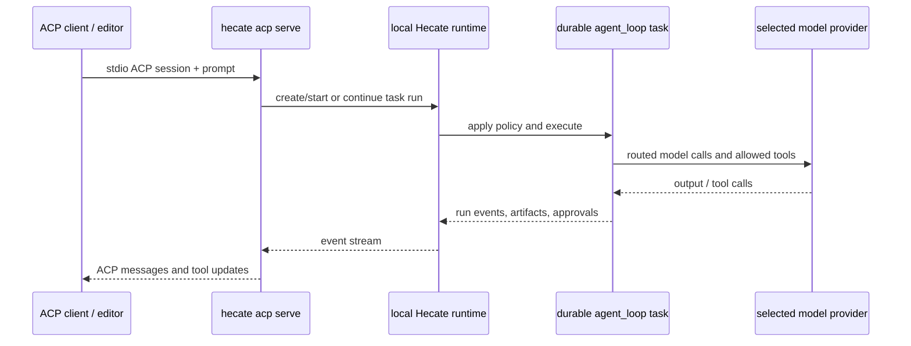

# Hecate as an ACP agent

`hecate acp serve` lets an ACP-capable editor or client use Hecate's native
`agent_loop` as its agent. The command speaks Agent Client Protocol (ACP) over
stdio and delegates execution to a running local Hecate runtime.

This is the inverse of [External Agents](external-agents.md): there, Hecate is
the ACP **client** that supervises another coding-agent CLI. Here, the editor is
the ACP client and Hecate is the ACP **agent**. Both directions keep Hecate's
supervision, policy boundary, approvals, artifacts, and observability visible
to the operator; External Agents still execute in their own vendor CLIs.

The stdio protocol plumbing is shared with the provider-neutral
[`acp-adapter-kit`](https://github.com/hecatehq/acp-adapter-kit). Hecate owns
the ACP agent behavior and its mapping to Hecate tasks; the kit does not contain
Hecate defaults or task policy.

## Contents

- [Run it](#run-it)
- [How a prompt runs](#how-a-prompt-runs)
- [V1 capability boundary](#v1-capability-boundary)
- [Local security boundary](#local-security-boundary)
- [Troubleshooting](#troubleshooting)

## Run it

Start the Hecate runtime first, then configure an ACP client to launch this
stdio command:

```text
hecate acp serve
```

The command uses the following environment variables:

| Variable               | Default                 | Purpose                                                                           |
| ---------------------- | ----------------------- | --------------------------------------------------------------------------------- |
| `HECATE_BASE_URL`      | `http://127.0.0.1:8765` | URL of the running Hecate runtime. V1 accepts literal loopback IP origins only.   |
| `HECATE_RUNTIME_TOKEN` | unset                   | Runtime token forwarded as `X-Hecate-Runtime-Token` when the runtime requires it. |

For example, use the ACP client's normal `command`, `args`, and `env` fields:

```json
{
  "command": "hecate",
  "args": ["acp", "serve"],
  "env": {
    "HECATE_BASE_URL": "http://127.0.0.1:8765"
  }
}
```

Keep stdout exclusively for ACP JSON-RPC. Startup diagnostics and errors go to
stderr, so they do not corrupt the client protocol stream.

## How a prompt runs



At ACP initialization, Hecate verifies that the local runtime has at least one
usable auto-route: a routable provider default or a configured gateway default
available from a routable provider. It does **not** select a provider or model
in the ACP bridge. Each ACP session requires an absolute current working
directory. Its Hecate task uses `workspace_mode: in_place`, so edits and tool policy apply to
the directory the client selected rather than to a cloned workspace.

The first accepted prompt creates and starts a durable `agent_loop` task. Later
prompts in that ACP session continue its latest run. Hecate maps task events to
ACP assistant and tool updates; ACP cancellation and session close request
Hecate run cancellation. The durable task, run history, artifacts, approvals,
and traces remain visible in the Hecate console. ACP leaves the task's requested
provider and model empty, so Hecate's own auto-routing chooses eligible provider
defaults and retains its normal cross-provider failover behavior.

## V1 capability boundary

The first implementation deliberately keeps the ACP surface narrow while its
execution contract is made reliable.

| Capability                               | V1 behavior                                                                                                                                |
| ---------------------------------------- | ------------------------------------------------------------------------------------------------------------------------------------------ |
| Text prompts                             | Supported.                                                                                                                                 |
| ACP resource links                       | Accepted only as opaque references. Hecate uses a safe label and never reads, dereferences, or forwards the supplied URI or file contents. |
| Images, audio, embedded resources        | Unsupported. The ACP client must not assume file or media transfer.                                                                        |
| Client-provided MCP server configuration | Unsupported. Hecate does not launch editor-supplied MCP servers through this boundary.                                                     |
| Editor filesystem and terminal callbacks | Unsupported. Hecate uses its own WorkspaceFS, ProcessRunner, GitRunner, sandbox, and task policy seams.                                    |
| Agent Preset selection                   | Unsupported. ACP V1 creates native tasks with Hecate's normal task defaults; clients cannot select or alter an Agent Preset through ACP.   |
| List, load, and resume ACP sessions      | Unsupported. Task history is durable, but the ACP-session mapping is process-local in V1.                                                  |
| Remote Hecate runtime                    | Unsupported. The editor's local working directory and Hecate's execution boundary must be on the same machine.                             |

An ACP client should use the Hecate console to inspect runs, review artifacts,
and resolve approvals. When a run pauses for approval, ACP sends one generic
message directing the operator to the Hecate console; it does not expose an
approval-resolution control. ACP does not bypass Hecate's task sandbox,
approval, or provider-routing policy; V1 simply has no client control for Agent
Presets.

## Local security boundary

`hecate acp serve` is a local stdio bridge, not a network ACP endpoint. It
accepts only literal IPv4/IPv6 loopback `HECATE_BASE_URL` origins (not hostnames
such as `localhost`, which could be re-resolved at dial time), and it forwards
`HECATE_RUNTIME_TOKEN` only to that configured local runtime. Do not expose the
runtime's loopback listener or the stdio process to untrusted users.

The client supplies the workspace directory, but Hecate remains responsible for
what can execute there. The selected model route, task-level tool and sandbox
policy, approval gates, and audit trail remain Hecate-owned. ACP V1 does not
expose Agent Preset selection.

## Troubleshooting

- **No ready route:** configure and make at least one Hecate provider ready,
  with a provider default model or a gateway default model, then restart the
  ACP client. Hecate resolves the route when the task executes; the ACP bridge
  never pins one itself.
- **Runtime authentication fails:** set the same `HECATE_RUNTIME_TOKEN` in the
  ACP client's environment that the running runtime expects.
- **Working directory rejected:** configure the client to send an absolute
  directory path. Relative directories are not accepted.
- **A capability is missing:** V1 intentionally does not transfer media/files,
  launch client MCP servers, expose editor terminals/filesystems, or reload ACP
  sessions. Use Hecate Chat or [External Agents](external-agents.md) for the
  currently supported file-bearing workflows.
