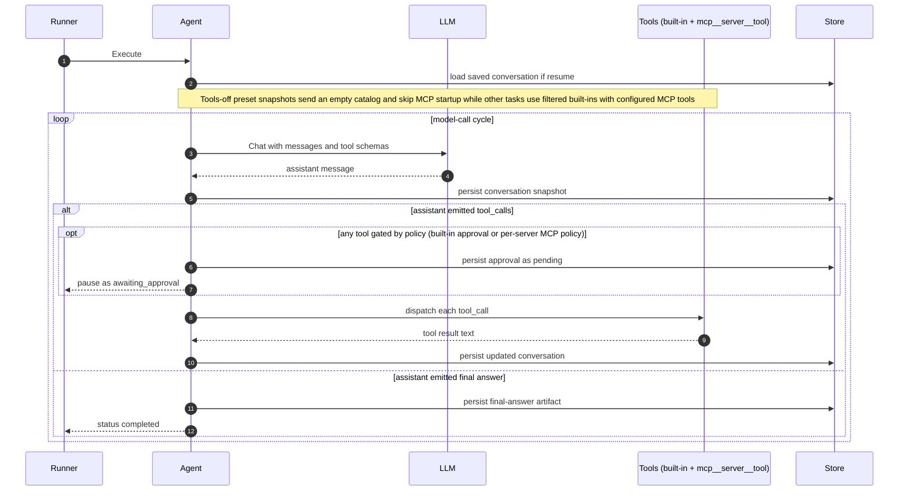

# Agent Runtime

Hecate's `agent_loop` execution kind runs an LLM-driven loop: the model picks tools, the runtime dispatches them, results feed back to the model, and the loop continues until the model produces a final answer or hits a safety bound (maximum model calls, cost ceiling, approval gate). This document covers how the loop works, the built-in tools, the safety story, and the control surface.

For the high-level execution flow that wraps it (queue, lease, sandbox, events), see [`architecture.md`](../contributor/architecture.md#task-runtime-flow). For the API endpoints that drive it, see [`runtime-api.md`](runtime-api.md).

`agent_loop` is also the runtime behind **Hecate Chat** when tools are on. In
that mode Chats creates a visible task with `execution_profile=chat_agent` and
`origin_kind=chat`; the first tools-on user message starts the task, and
follow-up tools-on messages continue the latest terminal Task Run instead of
creating a new task per message. Turning tools off switches the same transcript
back to direct model chat. Turning tools on again after a direct model segment
starts a fresh task-backed segment in that transcript. Tasks remains canonical
for approvals, events, artifacts, retry/resume, and patch review; Chats is the
conversational entry point with compact activity, task/trace links, and inline
approval actions. When the selected provider supports streaming, the agent loop
streams assistant text into the conversation artifact during the model call so
Chats can show the answer before the Task Run reaches a terminal state.
Providers without streaming fall back to the normal non-streaming chat call.

When a Hecate Chat session is linked to a project, Hecate keeps the Chat UI
simple and injects project workflow guidance into the effective system prompt
for project-linked Hecate-owned turns. The prompt includes bounded project-root
metadata plus role, skill, active-work, and accepted-memory vocabulary, and
tells the model to treat planning/assignment/handoff/memory requests as
proposal-only Project Assistant intent. Project roots and skill entries are
metadata only; root files and `SKILL.md` bodies are not injected by the simple
chat path. The guidance does not grant Chat or the agent loop direct authority
to create/start project records, tasks, runs, chats, external-agent sessions,
or promoted memory. External Agent sessions linked to a project keep their
agent-owned prompt and receive no Hecate project workflow prompt layer.
For task-backed project-linked Hecate Chat, the agent tool catalog also includes
`draft_project_proposal`. That tool can create a
`project_assistant_proposal` task artifact containing reviewable proposal JSON
for the linked project. It does not apply the proposal or mutate project work;
Chats can open the artifact in Projects, where the normal Project Assistant
review/apply boundary still applies.

**Invariant: one chat, many segments, one active task-backed loop.** A single
Hecate Chat session can carry an arbitrary history of segments — alternating
tools-on and tools-off — in one continuous transcript. Within that transcript
**at most one task-backed loop is active at a time.** Each tools-on segment
maps to exactly one backing task; while that Task's latest Run is non-terminal
(`queued`, `running`, `awaiting_approval`), the chat is "busy" and the
composer's submit control reflects three states:

- **idle** — the regular `Send message` button (`aria-label="Send message"`).
- **busy with empty composer** — a red icon button labelled
  `Stop active task` that cancels the backing Task Run.
- **busy with a typed prompt** — a `Queue message` button that buffers
  the text locally and replays it automatically once the backing Task Run
  finishes.

A yellow banner under the composer surfaces a queueing notice plus an
`Open task` link to the backing task in the Tasks workspace and a `Stop`
button (`aria-label="Stop active task"`) that also cancels the backing Task Run. The
backend returns `409 chat.agent_session_busy` if a client bypasses
the UI. Once the backing Task Run reaches a terminal state, the next tools-on
prompt either continues the same Task with a new Run or — if tools have
been toggled off and on in the meantime — starts a fresh task-backed
segment. Historical segments persist for transcript context but never
resume execution; the only loop the runtime drives forward is the active
one.

The Tasks workspace in the operator UI is the human entry point — create a task, watch its run state, approve or retry, and inspect streamed output:

> Contributing here? Start at [`AGENTS.md`](../../AGENTS.md) for the codebase map and runtime invariants; conventions, workflow, and verification ladders live under [`docs-ai/`](../../docs-ai/README.md).

## Contents

- [Loop mechanics](#loop-mechanics)
- [Report-only QA workflow](#report-only-qa-workflow)
- [Built-in tools](#built-in-tools)
- [External MCP tools](#external-mcp-tools)
- [Workspace modes](#workspace-modes)
- [Output and stderr in the UI](#output-and-stderr-in-the-ui)
- [System prompt layers](#three-layer-system-prompt)
- [Approval gating](#approval-gating)
- [Cost tracking](#cost-tracking)
- [Retry and resume](#retry-and-resume)
- [Configuration knobs](#configuration-knobs)
- [Common failure modes](#common-failure-modes)

## Loop mechanics

A run with `execution_kind=agent_loop` walks model calls:

1. The runtime calls the LLM with the running conversation, available tool schemas, and the operator-composed system prompt. If the gateway route supports streaming, assistant text deltas are captured and persisted as a partial conversation snapshot while the model call is still running.
2. The model responds with either tool calls or a final answer.
3. If tool calls: each is dispatched, the result is appended as a `tool` message, and the loop makes another model call.
4. If a final answer: the loop ends. Ordinary agent-loop tasks persist the
   answer as a `summary` artifact; report-only QA tasks persist a versioned
   `workflow_report` that labels the answer as agent-reported.

The conversation is persisted as an artifact (`agent_conversation`, JSON-encoded `[]Message`) after every model call. During a streaming model call, Hecate also refreshes that artifact with the partial assistant answer at a throttled cadence; after the provider finishes, the usual full snapshot replaces it. A crash mid-loop, an approval pause, or a deliberate retry-from-model-call therefore all start from a known state.

Each fresh model call records the same runtime accounting regardless of whether
the provider streamed or returned one response body: resolved route metadata
(`provider`, `provider_kind`, `model`), the assistant thinking step,
`assistant.*` run events, per-model-call cost records, and the updated conversation
snapshot. Resume-after-approval iterations are different: the model has already
produced the tool calls, so the runtime dispatches those approved calls without
emitting a new `model.call.started` or `model.call.completed`.

The implementation keeps those responsibilities split so the loop stays
auditable:

- `executor_agent_loop.go` owns the high-level loop: resume detection, final answer, approval gate, tool dispatch, cost-ceiling check.
- `executor_agent_loop_chat.go` owns one fresh model call: request construction, streaming capture, route capture, assistant events, thinking step, model-call cost, conversation snapshot.
- `executor_agent_loop_run_state.go` owns in-memory run assembly: next step index, steps/artifacts, resolved route, cost totals, `ExecutionResult`.
- `executor_agent_loop_conversation.go`, `executor_agent_loop_approval_gate.go`, and `executor_agent_loop_tools.go` own conversation hydration, approval-gate decisions, and tool dispatch respectively.

Three things bound the loop:

- **`HECATE_TASK_AGENT_LOOP_MAX_MODEL_CALLS`** (default `8`) — hard ceiling on LLM round-trips per run. Runaway-cost safety net.
- **`Task.BudgetMicrosUSD`** — per-task cost ceiling. Checked after each model call against `priorCost + costSpent`; failing the run preserves the assistant's last message.
- **Approval gates** — when the model requests a gated tool, the loop pauses with `status=awaiting_approval` and emits an approval record. See below.

## Report-only QA workflow

`workflow_mode="qa"` is Hecate's first built-in runbook contract. It is not a
generic workflow engine, a Project/Cairnline record, or an External Agent
command. It is available only on a native `execution_kind="agent_loop"` Task;
ordinary model and task requirements still apply. A QA task can either pin both
`requested_provider` and `requested_model`, or omit both to use Hecate
auto-routing before the Task starts.

Hecate owns the contract version. On creation it records
`workflow_mode="qa"` and `workflow_version="v0"` on the Task and snapshots
both fields on each Run, including retry/resume descendants. Clients do not
supply `workflow_version`; the stored mode and version must be a complete,
canonical pair, and unknown, non-canonical, missing, future, or partial
persisted workflow values fail closed before a workspace or executor is
selected. A QA
create rejects configured `mcp_servers`, native HTTP/search network access, or
an explicitly requested non-ephemeral workspace mode. The runtime then forces
an ephemeral workspace, `sandbox_read_only=true`, and `sandbox_network=false`
before the Task is stored. QA also rejects workspace reuse and binds each Run
to its generated Hecate-managed Task/Run directory; follow-up Runs get a fresh
isolated workspace rather than inheriting a prior path. The workspace
`CLAUDE.md` / `AGENTS.md` compatibility layer is explicitly excluded, so
repository guidance remains inspectable evidence rather than system-priority
instruction. For a local Git source, QA provisions that isolated workspace by
safe directory copy instead of `git clone` checkout and excludes every `.git`
entry, including linked-worktree metadata. That prevents host global Git
filters from running before the dispatcher and later source index or object
changes from becoming QA evidence.

Those stored fields are not the only boundary. The QA tool catalog and the
dispatcher both fail closed. File and artifact inspection can run:
`read_file`, `grep`, `glob`, `artifact_read`, and `list_dir`. The `git_status`
and `git_diff` tool names return a clear unavailable result in QA v0 without
invoking Git, so the agent can record that limitation rather than observe a
live source repository. QA blocks shell and terminal commands, all
workspace/Git writes,
`file_edit` / `apply_patch` proposals, `draft_project_proposal`, external MCP
tools, `http_request`, `web_search`, and `browser_inspect`. A model that nevertheless returns one
of those calls receives a policy-denied tool result; Hecate does not create an
approval or contact the blocked executor/service.

QA v0 also blocks `browser_inspect`. Its public Task creation surface has no
assignment-launch selector for browser evidence, so it must not imply a
conditional capability that operators cannot actually select. A future QA
contract may add constrained browser evidence only with an explicit Hecate
runtime selection and its own review; it would still not enable browser
automation.

At Run start, Hecate writes a `workflow_manifest` JSON artifact containing the
versioned contract and no prompt, workspace path, credentials, or model output.
When—and only when—the agent produces a final response, Hecate writes a
`workflow_report` JSON artifact. Its `agent_reported.summary_markdown` is the
agent's narrative; it is not proof a test or browser check ran. Its
`hecate_observed` object separately records the enforced read-only/native
HTTP-and-search/MCP posture, the QA-v0-unavailable browser- and Git-evidence
postures, and the manifest ID.
QA v0 has no shell test runner, arbitrary test-command input, browser
automation, automatic memory candidate, patch-application path, or automatic
post-run Git-summary capture. It also has no Git evidence in v0: its Git tool
names report that the metadata-free snapshot cannot support inspection. These
limits describe
agent-exposed runtime capabilities; Hecate still performs the ordinary local
filesystem work needed to create its managed workspace.

## Built-in tools

The agent gets its standard workspace tools by default. None require operator
config beyond the approval policies; `http_request` reads the network policy
from env. A configured web-search provider can add `web_search`; the separate
native browser-evidence capability is opt-in, local-only, and much narrower.
Chat-origin Task Runs for project-linked Hecate Chat receive one additional
proposal-only tool.

| Tool                     | What it does                                                          | Policy                                                                                                                                                                                                                                                                                                                                                                                                                                    |
| ------------------------ | --------------------------------------------------------------------- | ----------------------------------------------------------------------------------------------------------------------------------------------------------------------------------------------------------------------------------------------------------------------------------------------------------------------------------------------------------------------------------------------------------------------------------------- |
| `shell_exec`             | Run a shell command in the workspace through ProcessRunner            | Omitted and fail-closed when `sandbox_read_only=true`; otherwise gated by `shell_exec` or `all_tools` policy (default on), with env sanitisation + output cap + timeout and optional OS wrapper (see [`sandbox.md`](sandbox.md))                                                                                                                                                                                                          |
| `terminal_open`          | Open a long-lived terminal process in the workspace                   | Omitted and fail-closed when `sandbox_read_only=true`; otherwise gated by `shell_exec` or `all_tools` policy (default on), using `LocalWorkspace.OpenTerminal`, static command policy, env sanitisation, workspace root, and optional OS wrapper                                                                                                                                                                                          |
| `terminal_write`         | Write stdin to an open native agent-loop terminal                     | Gated by `shell_exec` or `all_tools` policy (default on); terminal handles are scoped to the current run and preserved across same-run approval requeues                                                                                                                                                                                                                                                                                  |
| `terminal_read`          | Read the retained output tail from an open native agent-loop terminal | Gated by `shell_exec` or `all_tools` policy (default on); output returned to the model is bounded                                                                                                                                                                                                                                                                                                                                         |
| `terminal_wait`          | Wait for an open native agent-loop terminal to exit                   | Gated by `shell_exec` or `all_tools` policy (default on); wait calls are bounded by `timeout_ms`, and a timeout leaves the terminal running                                                                                                                                                                                                                                                                                               |
| `terminal_kill`          | Terminate an open native agent-loop terminal                          | Gated by `shell_exec` or `all_tools` policy (default on)                                                                                                                                                                                                                                                                                                                                                                                  |
| `git_exec`               | Run a Git subcommand in the workspace through the sandbox executor    | Omitted and fail-closed when `sandbox_read_only=true`; otherwise gated by `git_exec` or `all_tools` policy (default on)                                                                                                                                                                                                                                                                                                                   |
| `file_write`             | Write or append a file under the workspace                            | Omitted and fail-closed when `sandbox_read_only=true`; otherwise gated by `file_write` or `all_tools` policy (default on)                                                                                                                                                                                                                                                                                                                 |
| `file_edit`              | Replace exact text in an existing workspace file                      | Gated by `file_write` or `all_tools` policy (default on); read-only tasks may propose a patch but cannot apply it                                                                                                                                                                                                                                                                                                                         |
| `apply_patch`            | Apply or propose structured multi-file patches                        | Gated by `file_write` or `all_tools` policy (default on); emits patch artifacts; read-only tasks may propose but cannot apply                                                                                                                                                                                                                                                                                                             |
| `read_file`              | Read a file under the workspace, optionally by line range             | Ungated by default; gate with `read_file` or `all_tools` policy. Path must resolve through WorkspaceFS within the workspace root                                                                                                                                                                                                                                                                                                          |
| `grep`                   | Search workspace text files with a bounded regular-expression search  | Ungated by default; gate with `read_file` or `all_tools` policy. Path must resolve through WorkspaceFS within the workspace root                                                                                                                                                                                                                                                                                                          |
| `glob`                   | Find workspace paths by glob pattern                                  | Ungated by default; gate with `read_file` or `all_tools` policy. Path must resolve through WorkspaceFS within the workspace root                                                                                                                                                                                                                                                                                                          |
| `artifact_read`          | Read an inline artifact from the current task by artifact ID          | Ungated by default; gate with `read_file` or `all_tools` policy. Only artifacts belonging to the current task are visible                                                                                                                                                                                                                                                                                                                 |
| `list_dir`               | List entries under a workspace path                                   | Ungated unless `all_tools` is set. Path must resolve through WorkspaceFS within the workspace root                                                                                                                                                                                                                                                                                                                                        |
| `git_status`             | Return structured branch and changed-file status                      | Gated by `git_exec` or `all_tools` policy (default on); immutable GitRunner metadata view with optional locks, lazy fetch, fsmonitor, global/system config/attributes, and recursion disabled; conversion attributes fail closed. QA v0 is an exception: it returns an unavailable evidence result without invoking Git.                                                                                                                  |
| `git_diff`               | Return a bounded workspace or staged diff                             | Gated by `git_exec` or `all_tools` policy (default on); immutable GitRunner metadata view with external diff/text conversion, optional locks, lazy fetch, fsmonitor, global/system config/attributes, and recursion disabled; conversion attributes fail closed. QA v0 is an exception: it returns an unavailable evidence result without invoking Git.                                                                                   |
| `http_request`           | Make an outbound HTTP request                                         | For preset-backed tasks, advertised only when the preset snapshot has `sandbox_network=true`; unexpected calls fail closed. Then gated by `network_egress` or `all_tools`, with private-IP, scheme, and optional host allowlist checks                                                                                                                                                                                                    |
| `web_search`             | Search the web through the configured search provider                 | For preset-backed tasks, advertised only when configured and the snapshot has `sandbox_network=true`; unexpected calls fail closed. Then gated by `network_egress` or `all_tools`; endpoint and API key stay operator-owned                                                                                                                                                                                                               |
| `browser_inspect`        | Load one approved static page and return bounded, text-only evidence  | Available only to native project-assignment tasks whose Agent Preset snapshot explicitly enables browser evidence with exact origins, and only when a local executable is configured. Every call requires an `agent_loop_tool_call` approval even if global tool approvals are disabled. Page scripts are disabled. It is not controlled by `sandbox_network`, and is omitted from Hecate Chat, External Agent, legacy, and manual tasks. |
| `draft_project_proposal` | Draft a Project Assistant proposal artifact for the linked project    | Available only to Chat-origin Task Runs backing Hecate Chat Turns with `origin_kind=chat`, `execution_profile=chat_agent`, and a `project_id`; gated only by `all_tools`. Creates a `project_assistant_proposal` artifact for operator review and does not apply or start anything.                                                                                                                                                       |

Tool argument schemas are JSON-Schema-shaped and surfaced to the LLM in the standard `tools` array on each `Chat` request. Bad arguments are returned to the model as a tool-result error string rather than failing the run, so the model can correct itself.

For a project-assignment task carrying an explicit
`agent_preset_tools_enabled=false` snapshot, that setting is the master tool
gate. Hecate sends an empty catalog, does not start configured MCP hosts, and
keeps the execution as a normal supervised Task/Run so context, route, cost,
events, and the final answer remain inspectable. If an upstream nevertheless
returns a native or namespaced MCP call, Hecate bypasses approval, records a
denied policy step, emits `policy.tool_blocked` with
`policy=agent_preset_tools`, and returns a tool error without dispatch. A
missing snapshot preserves the catalog behavior of legacy and manually created
tasks.

The machine-generated system message states that tools are unavailable but
omits the absolute workspace path because a model-only call cannot use it.

For a task carrying an `agent_preset_id` launch snapshot, `sandbox_network` is
the master gate for Hecate-native egress. When false, `http_request` and
`web_search` are omitted from the model request. If an upstream still returns
either call, the dispatcher records a denied policy step, emits
`policy.tool_blocked`, and returns a tool error without contacting the
HTTP/search provider. Legacy and manually created tasks without a preset
snapshot retain the pre-existing native HTTP/search behavior; setting their
process-network bit is not silently reinterpreted as a new native-tool policy.
When preset network is enabled, global approval and host/private-IP policies
still apply. When the master tools gate is enabled, external MCP servers are
separately configured trusted tool sources and keep their own per-server
approval policy.

### Browser evidence

`browser_inspect` is a deliberately narrow local inspection tool, not general
browser automation. It is exposed only when all of the following are true:

- The gateway is running locally and an operator configured an absolute path to
  a Chromium-compatible executable with `HECATE_TASK_BROWSER_EXECUTABLE`.
  Hecate does not search `PATH`, download a browser, attach to an existing
  browser, or enable this capability in remote-runtime mode.
- The native project-assignment task has a resolved `hecate_task` (or `any`)
  Agent Preset with tools enabled, `browser_allowed=true`, and one or more
  exact `browser_allowed_origins`. Those normalized origins are copied to the
  output-only task snapshot fields
  `agent_preset_browser_allowed` and
  `agent_preset_browser_allowed_origins`; later preset edits cannot expand an
  existing task's browser scope.
- The model requests an absolute HTTP(S) page URL at one of those origins. URLs
  containing credentials, a query string, or a fragment are rejected rather
  than recorded or redacted later. A path is allowed. This keeps query-borne
  secrets out of tool-call records and conversation artifacts.

Each request pauses for explicit operator approval. This is unconditional:
empty `HECATE_TASK_APPROVAL_POLICIES` and the absence of `all_tools` do not
make browser inspection automatic. The approval describes the requested safe
page target (origin plus path). Credentials, queries, and fragments were
already rejected, and a target that cannot fit in the approval display is
rejected before it reaches task records or the browser. This keeps every
approval bound to the complete page it authorizes.

For every inspection Hecate launches a fresh temporary profile and removes it
after the browser exits. It imports no host cookies, saved logins, extensions,
clipboard, or device permissions; it blocks downloads and retains no browser
profile data. The evidence is a bounded `browser_evidence` `text/plain`
artifact containing a redacted final URL/origin, page title, small
accessibility summary, bounded console lines, and network counters. It never
contains screenshots, downloaded bytes, raw CDP traffic, cookies, storage, or
request/response bodies.

One `HECATE_TASK_BROWSER_TIMEOUT` wall-clock budget covers origin preflight,
browser startup, and page capture together. The inspector also disables its
network cache and cancels the capture once CDP observes aggregate streamed
response data beyond 4 MiB, including chunked or other unknown-length
responses. This is a cancellation threshold, not a hard wire-byte limit:
browser, socket, and peer buffers can add bytes before cancellation reaches
Chromium.

A fresh Hecate profile is not a hard identity-isolation boundary. Machine or
enterprise Chromium policy can still supply integrated authentication or a
client certificate outside profile storage. Do not use this capability against
identity-sensitive sites unless the configured executable runs in a dedicated,
unmanaged browser environment with the required OS/network isolation.

The inspector disables page JavaScript before navigation, bypasses service
workers, and uses an allow-first browser URL gate plus `GET`/`HEAD` interception
for the selected exact origin. It therefore captures static server-rendered
content only: no scripts, workers, WebSockets, WebTransport, WebRTC, click,
type, form-submit, upload, download, clipboard, or device-control primitive is
available. This makes ordinary browser writes unavailable, but HTTP does not
guarantee that a `GET` endpoint is semantically safe. Treat every approval as
permission to load that origin and page, and do not enable it for an application
whose read route can cause a side effect.

Before launch, Hecate resolves configured origins and rejects loopback,
private, link-local, multicast, and otherwise non-public addresses unless
`HECATE_TASK_BROWSER_ALLOW_PRIVATE_IPS=true` is set. For hostname origins, it
passes the preflight-selected numeric address to Chromium for that inspection,
which reduces the DNS-rebinding window. That defense in depth and the
exact-origin check are application-level guardrails, not an OS-level egress
firewall or a sandbox boundary for the browser process. Operators who need a
hard network boundary must provide it outside Hecate.

When `sandbox_read_only=true`, the agent loop removes broad subprocess and
interactive surfaces that cannot provide a hard read-only workspace guarantee:
`shell_exec`, `git_exec`, `file_write`, and all terminal tools. A model-returned
call to any of them fails closed before process spawn. Structured inspection
tools remain available. Structured Git reads run as fixed, bounded, passive
commands: they do not refresh the index, invoke repository fsmonitor helpers,
load global/system Git configuration or attributes, recurse into submodules, or
lazily fetch objects, and use the offline/read-only OS wrapper where available.
The actual status/diff process reads an immutable temporary gitdir containing a
safe core-config allowlist plus snapshotted HEAD/ref/info metadata, so a source
config change cannot introduce an executable helper between validation and
use. Nested workspaces use the checkout's true top-level metadata but scope
status paths and diffs to the workspace. Because omitting an effective
clean/process driver could instead produce misleading Git state, bounded
NUL-safe attribute resolution fails closed when a scoped tracked path has an
effective or ambiguous conversion filter. `file_edit` and `apply_patch` remain
available for proposal artifacts, while their apply paths enforce read-only
policy.

That ordinary read-only posture still allows proposal artifacts from
`file_edit` or `apply_patch`. Report-only QA is stricter: its workflow filter
also rejects those proposal calls, so a QA run cannot create a new change
artifact as a side effect of inspection.

### Network egress for shell_exec / git_exec

`shell_exec` and `git_exec` are bounded by the same allowlist semantics as `http_request` when the task has `sandbox_network=true`:

- HTTP/HTTPS URLs that appear as command tokens are extracted and validated.
- Hosts that parse as a private/loopback IP literal (10/8, 172.16/12, 192.168/16, 127/8, 169.254/16, link-local, multicast) are rejected unless `HECATE_TASK_SHELL_ALLOW_PRIVATE_IPS=true`.
- When `HECATE_TASK_SHELL_ALLOWED_HOSTS` is set, only those exact hostnames are reachable. Empty = all public hosts allowed.

Enforcement is **best-effort static parsing** of the command string. Tools that respect the allowlist (`curl`, `wget`, `git fetch`, `bun install`, `pip install`, etc.) get covered; clever obfuscation (base64-encoded URLs, `nc`/`telnet` raw sockets, custom-binary egress) bypasses it. The kernel-enforced backstop comes from Layer 2 of the sandbox: on Linux with `bwrap` installed, and on macOS, every shell/git call runs inside a wrapper that drops the network namespace (Linux) or applies a Seatbelt profile (macOS) when the task's `sandbox_network=false`. See [`sandbox.md`](sandbox.md#layer-2--os-level-isolation) for the auto-detection logic and platform coverage. The default `sandbox_network=false` (no network at all) plus an active Layer 2 wrapper is the strongest guarantee short of a full container.

Native agent-loop terminal tools (`terminal_open`, `terminal_write`,
`terminal_read`, `terminal_wait`, `terminal_kill`) use the same workspace
terminal primitive as ACP terminal callbacks. Static validation happens at
spawn time for the initial command. On Unix, known detachers are also rejected
from stdin when the requested process is actually reading interactive shell or
interpreter code. Stdin used as data by a shell/interpreter script or inline
command is not scanned unless a force-interactive option keeps executable stdin
active; explicit shell stdin such as `sh -` and `bash -` is scanned. Shell
writes retain at most 64 KiB of syntactically incomplete input across calls and
fail closed at that bound, while validated complete commands leave no cumulative
history. Interpreter input retains only fixed-size token tails. This static
enforcement is best effort, while Unix process-group and Windows Job Object
ownership provide the lifecycle backstop. These tools are unavailable on
read-only tasks because interactive stdin cannot be statically proven
non-mutating. Terminal handles are scoped to the current run and wait for the
owned process unit plus output to drain. Each handle holds its own shared
workspace writer lease for that full lifetime, independently of the execution
attempt lease. They are kept alive when a same-run approval pause returns
`awaiting_approval`, without opening a workspace-discard window, and closed when
the run reaches a terminal state or is cancelled. Runtime shutdown fences new
handles and closes retained approval-paused handles too.

## External MCP tools

In addition to the built-ins, an `agent_loop` task can declare external MCP servers on the `mcp_servers` task field. Their tools join the LLM's catalog at run start under `mcp__<server>__<tool>` aliases — for example a `read_file` tool on a server aliased `fs` becomes `mcp__fs__read_file`. Approval gating is per-server (`auto` / `require_approval` / `block`), distinct from the built-in approval policy axis. Report-only QA is the exception: task creation rejects `mcp_servers`, and the runtime fails closed before starting an MCP host if a malformed or older stored QA task still carries one.

Use MCP when a search server needs organization-specific credentials, ranking,
or retrieval logic beyond Hecate's configured native provider. The native
`web_search` tool deliberately returns search results only; fetching a result
URL still goes through `http_request` and its HTTP policy.

See [`mcp.md#hecate-as-mcp-client`](mcp.md#hecate-as-mcp-client) for the full schema, transports (stdio + Streamable HTTP), secret-aware `env` / `headers`, lifecycle / caching contract, and dry-run probe.

## Workspace modes

Every run has a workspace — a directory the sandbox locks tools to. Two modes:

- **isolated clone** (default; `WorkspaceMode` empty / `persistent` / `ephemeral`) — the workspace manager copies or git-clones `task.WorkingDirectory` (or `task.Repo`) to a fresh temp dir under `${TMPDIR}/hecate-workspaces/<task_id>/<run_id>`. Writes don't touch the source. Safe by default.
- **managed reuse** (internal `WorkspaceReuse`) — when Hecate Chat needs a new task segment after a managed Task Run, the workspace manager reuses that runtime-owned root byte-for-byte. The operator source remains isolated, while unstaged and untracked work survives the segment boundary. Public task creation cannot set this flag.
- **`in_place`** — the workspace IS `task.WorkingDirectory`. Tools write directly to the operator's source. Necessarily destructive; opt-in. Requires an absolute existing directory or the run fails up-front rather than silently flipping back to the clone behavior.

The new-task UI exposes `in_place` as a "Run directly in this workspace" checkbox under WORKSPACE.

## Task Run activity in the UI

Task Detail renders the run's normalized activity array as the primary
inspection timeline. Hecate Chat uses the same renderer when a tools-on chat
turn projects backing task activity into the transcript, so operators see the
same labels in both places: tool calls, approvals, changed files, final-answer
artifacts, and terminal run state.

The shared renderer intentionally separates signal from bookkeeping. High-level
activity stays visible in chronological order; raw task artifacts and internal
markers are grouped under **Details**. Task Detail opens that activity section
by default because it is a run-inspection view. Chats keeps it quieter so the
conversation remains the primary surface. Task Detail may additionally expose a
per-row **Advanced** disclosure with raw activity metadata for debugging:
activity id/type/status, step/artifact/approval ids, tool kind, path, timestamp,
and summary payload. Failed tool rows additionally preview related stdout/stderr
artifacts there, so the common "why did this command fail?" path is answerable
without leaving the activity row.

## Output and stderr in the UI

Task runs capture process output as structured stdout/stderr artifacts and
typed `tool.shell.*` events. The operator UI intentionally treats stdout as the
primary terminal pane and only surfaces stderr when stderr exists.

That default keeps successful runs readable: many healthy CLIs write progress,
warnings, or diagnostics to stderr, and rendering an always-empty stderr panel
creates noise. When both streams exist, they should remain visually separated
(stdout first, stderr as a labeled section or toggle) rather than merged into
one undifferentiated transcript. For lower-level consumers, use the run
artifacts and `tool.shell.output_chunk` events; the event payload includes
`stream: "stdout" | "stderr"` so tooling can reconstruct or filter either
stream.

Task Detail still records whether each stream artifact exists. The run output
header shows stdout size when available, `stderr available` when stderr has
content, and `stderr empty` when the stderr artifact was created but no bytes
were captured. Failed tool rows in Task Detail's **Advanced** disclosure preview
stdout/stderr artifacts from the same step and keep empty stderr discoverable as
"No bytes captured for this stream." Hecate Chat keeps failed-tool diagnostics
compact: it links only non-empty stdout/stderr artifacts from the chat activity
row, shows capped inline previews for those streams, and leaves the empty-stream
confirmation to Task Detail.

### Workspace environment system message

Every fresh `agent_loop` run prepends a machine-generated system message that tells the model where its workspace lives:

> Your workspace is at: `/var/folders/.../run_xxx`
>
> Use this path (or paths under it) when calling tools. `shell_exec` uses
> ProcessRunner with the workspace as its default working directory; `git_exec`
> runs Git from the workspace through the sandbox executor; `git_diff` uses
> GitRunner from the workspace; `read_file` / `list_dir` / `grep` / `glob`
> resolve relative paths through WorkspaceFS. Tool calls that target paths
> outside this directory are rejected — don't reuse paths from the user prompt
> verbatim if they fall outside the workspace.

Without this, the model would read `/Users/foo/myrepo` from the user prompt and use that path verbatim — landing outside the cloned sandbox and failing with `escapes allowed root`. The env message is environmental fact, kept separate from the operator-tunable system prompt so it can't be accidentally elided.

## Three-layer system prompt

The operator-tunable system prompt is composed from three layers, broadest first:

1. **Global** — `HECATE_TASK_AGENT_SYSTEM_PROMPT` (env). Applies to every agent_loop run gateway-wide.
2. **Workspace** — `CLAUDE.md` or `AGENTS.md` in the task's working directory, capped at 8 KiB. Read once per run unless the task sets `workspace_system_prompt_policy="exclude"`.
3. **Per-task** — `Task.SystemPrompt` set when the task is created.

Layers are concatenated with blank lines between them. Empty layers are skipped (no wasted message). The composed prompt is the second system message in the conversation; the workspace-environment message above is the first.

Project assignment tasks set `workspace_system_prompt_policy="exclude"` and use
the project/preset context builder instead. That keeps project memory and
workspace-instruction bodies controlled by the resolved Agent Preset:
`project_memory_policy=include` can include bounded project memory bodies, and
`context_source_policy=include_enabled` can include bounded portable `AGENTS.md`
workspace-instruction bodies. Host-specific guidance files and `SKILL.md` bodies
remain metadata-only for this path. If the selected route is a cloud provider,
included project memory and workspace-instruction bodies are sent to that
provider as normal task prompt content. The task also snapshots the resolved
preset id and `tools_enabled`, maps `writes_allowed=false` to
`sandbox_read_only=true`, and maps `network_allowed` to `sandbox_network`;
when the preset enables browser evidence, it separately snapshots the exact
browser-origin allowlist. Retries and resumes reuse those task snapshots rather
than resolving a mutable preset again.

Project-linked Hecate Chat uses a separate bounded project prelude in the chat
system prompt. It may include project identity, root metadata, role hints,
enabled skill metadata, active work metadata, and accepted project memory
bodies. Project context-source file bodies, host-specific guidance file bodies,
and `SKILL.md` bodies are not loaded into chat prompts in V1. External Agent
chat and External Agent project-assignment starts record project metadata for
inspection, but Hecate does not inject project memory bodies, source bodies, or
skill bodies into adapter prompts; the adapter owns any private prompt packing
inside its native session.

## Approval gating

Two distinct approval flows:

### Pre-execution approval

Triggered when the task's `execution_kind` is `shell` / `git` / `file` (or `sandbox_network=true`) AND a matching policy is in `HECATE_TASK_APPROVAL_POLICIES`. An `agent_loop` task whose Agent Preset snapshot explicitly sets `tools_enabled=false` skips the network pre-execution gate: it advertises no tools, starts no MCP clients, and has no executable network capability to approve. The run is otherwise created in `awaiting_approval` status before it ever leaves the queue. The UI shows an amber banner with the command being approved. Approve → run becomes `queued` → executes. Cancel before approval → run becomes `cancelled` and the pending approval is marked `cancelled` so stale approval buttons cannot resurrect the run.

### Mid-loop approval (`agent_loop_tool_call`)

When the LLM calls a gated tool inside an `agent_loop` run, the loop pauses. Policy → tool mapping:

- `shell_exec` → pauses on `shell_exec`, `terminal_open`, `terminal_write`, `terminal_read`, `terminal_wait`, and `terminal_kill` tool calls
- `git_exec` → pauses on `git_exec`, `git_status`, and `git_diff` tool calls
  outside QA v0; QA v0 reports Git evidence unavailable without an approval
- `file_write` → pauses on `file_write`, `file_edit`, and `apply_patch` tool calls
- `read_file` → pauses on `read_file`, `grep`, `glob`, and `artifact_read` tool calls
- `network_egress` → pauses on `http_request` and configured `web_search` tool calls
- `all_tools` → pauses on every otherwise-permitted tool call (`shell_exec`, `terminal_open`, `terminal_write`, `terminal_read`, `terminal_wait`, `terminal_kill`, `git_exec`, `git_status`, `git_diff`, `file_write`, `file_edit`, `apply_patch`, `read_file`, `grep`, `glob`, `artifact_read`, `list_dir`, `http_request`, `web_search`, `draft_project_proposal`); QA v0 Git evidence remains unavailable without an approval

`browser_inspect` is intentionally not in that policy mapping: every otherwise
permitted browser-inspection call pauses for `agent_loop_tool_call` approval,
regardless of `HECATE_TASK_APPROVAL_POLICIES`. That extra gate is required
because loading even a read-only page can disclose operator-visible content or
trigger an application-specific `GET` side effect.

Approval never grants a capability denied by the resolved runtime policy. In
particular, unexpected calls on a task whose Agent Preset snapshot sets
`tools_enabled=false` are hard-denied with `policy=agent_preset_tools` before
the approval gate and cannot pause for operator approval.

The runtime emits an approval record of kind `agent_loop_tool_call`, persists the conversation snapshot, and returns `status=awaiting_approval` for the run. The UI banner shows which tools the agent wants to use. On approve, the same run is re-queued; on resume, the loop detects the trailing assistant tool_calls without resolved results, dispatches them (no second LLM call), and continues. On reject, the run and task terminate `cancelled` with `last_error="approval rejected"`. On cancel, the run terminates `cancelled`, any awaiting approval step is marked `cancelled`, and the pending approval is resolved as `cancelled`.

The approval banner stays in sync with the run state because approvals ride along in every SSE snapshot (`TaskRunStreamEventData.Approvals`). No separate refetch needed.

## Cost tracking

Per-model-call LLM cost is captured at three granularities:

- **`model.call.completed` events** — one per LLM round-trip on the persisted run-event log. Each event carries the model-call spend, the run-cumulative figure (this run only), and the task-cumulative figure (entire resume chain via `PriorCostMicrosUSD`). Subscribe via `/hecate/v1/events?event_type=model.call.completed`; the wire shape is in [`events.md`](events.md#modelcallcompleted). These rows are the only run events the retention worker prunes — see the `model_call_events` subsystem in [`telemetry.md`](telemetry.md#retention-spans) and `HECATE_RETENTION_MODEL_CALL_EVENTS_*` in `.env.example`.
- **`tool.file.patch` events** — emitted whenever `file_write`, `file_edit`, or `apply_patch` changes or proposes a file change. Each event points at a `patch` artifact containing the unified diff, giving operator UIs and future ACP/CLI consumers an inspectable edit record without re-deriving state from the workspace.
- **Patch review API** — `GET /hecate/v1/tasks/{id}/runs/{run_id}/patches` lists patch artifacts. Applied patches can be reverted; proposed patches from `file_edit` or `apply_patch` with `propose=true` can be applied if the target file still matches the captured before-content.
- **`git_summary` artifacts** — when the run workspace is a git repository and has changes at run completion, Hecate records a `git-changes.json` artifact with porcelain status entries and a diff stat for quick changed-file review.
- **Model-step `OutputSummary`** — each thinking step's `OutputSummary.cost_micros_usd` carries the same model-call figure, so the run-replay UI surfaces it next to "Model call N" without a separate event subscription.
- **`TaskRun.TotalCostMicrosUSD` + `PriorCostMicrosUSD`** — finalized totals on the run record. Cumulative across the resume chain = `Prior + Total`.

The per-task ceiling (`Task.BudgetMicrosUSD`) is checked against `priorCost + costSpent` after each model call — so a chain of resumes can't escape the ceiling by repeatedly resuming a maxed-out run.

Same-run mid-approval resumes seed `costSpent` from the run's pre-pause `TotalCostMicrosUSD`, so post-resume model calls add to (rather than overwrite) the pre-pause spend.

## Retry and resume

Three operations land an agent_loop run back on the queue with prior context:

- **Retry** — `POST /hecate/v1/tasks/{id}/runs/{run_id}/retry`. Creates a new run with the same task config but no conversation history. The cheapest "do it again from scratch" button.
- **Resume** — `POST /hecate/v1/tasks/{id}/runs/{run_id}/resume`. Creates a new run that hydrates the source run's conversation and continues from where it left off. Used after a `failed` or `cancelled` run.
- **Continue** — `POST /hecate/v1/tasks/{id}/runs/{run_id}/continue` with `{ "prompt": "..." }`. Creates the next run in the same agent conversation, hydrates the source conversation, then appends the new user prompt. This is the ACP/editor-session path.
- **Retry from model call N** — `POST /hecate/v1/tasks/{id}/runs/{run_id}/retry-from-model-call` with `{ "model_call_index": N, "reason": "..." }`. `model_call_index` is 1-based within the selected source Run and must be in `[1, source_run.model_call_count]`. Hecate preserves inherited conversation context, truncates immediately before that Run-local response, and re-issues the call in a new Run. To branch from an inherited response, select the older Run that produced it. The new Run's model-call and Step indices restart at 1; cumulative cost picks up from `source.PriorCost + source.Total`.

These actions share the task runtime's atomic start boundary. Concurrent
requests cannot create two active runs. A resume may raise
`budget_micros_usd`, but the store compares against the latest durable task in
the same transaction that creates the run, so a stale lower request or a
zero-budget retry cannot erase a higher committed ceiling.

The conversation viewer in the run-replay UI shows a `↻ retry from here` button on each assistant model call (terminal runs only).

## Configuration knobs

Env vars that affect agent_loop runs:

| Variable                                 | Default            | What it does                                                                                                                                                                                                  |
| ---------------------------------------- | ------------------ | ------------------------------------------------------------------------------------------------------------------------------------------------------------------------------------------------------------- |
| `HECATE_TASK_AGENT_LOOP_MAX_MODEL_CALLS` | `8`                | Hard ceiling on LLM round-trips per run                                                                                                                                                                       |
| `HECATE_TASK_AGENT_SYSTEM_PROMPT`        | `""`               | Global (broadest) layer of the three-layer system prompt                                                                                                                                                      |
| `HECATE_TASK_HTTP_TIMEOUT`               | `30s`              | Timeout for the `http_request` tool                                                                                                                                                                           |
| `HECATE_TASK_HTTP_MAX_RESPONSE_BYTES`    | `262144` (256 KiB) | Response size cap for `http_request`                                                                                                                                                                          |
| `HECATE_TASK_HTTP_ALLOW_PRIVATE_IPS`     | `false`            | When `false`, blocks loopback / RFC1918 / link-local destinations                                                                                                                                             |
| `HECATE_TASK_HTTP_ALLOWED_HOSTS`         | `""`               | Comma-separated exact-host allowlist; empty = all public hosts                                                                                                                                                |
| `HECATE_TASK_BROWSER_EXECUTABLE`         | `""`               | Absolute path to a local Chromium-compatible executable for optional native browser evidence. Empty disables it; Hecate never finds or downloads a browser automatically, and remote-runtime mode rejects it. |
| `HECATE_TASK_BROWSER_TIMEOUT`            | `20s`              | Positive wall-clock limit for one browser inspection, including preflight, browser startup, and page capture                                                                                                  |
| `HECATE_TASK_BROWSER_ALLOW_PRIVATE_IPS`  | `false`            | Allows private/local destinations after an explicit operator opt-in. The inspector pins hostname resolution for the inspection, but this is still not an OS/network isolation boundary.                       |
| `HECATE_TASK_WEB_SEARCH_PROVIDER`        | `""`               | Empty disables native web search. Supported values: `brave`, `tavily`, `exa`                                                                                                                                  |
| `HECATE_TASK_WEB_SEARCH_API_KEY`         | `""`               | API key for the configured search provider. Provider aliases: `BRAVE_SEARCH_API_KEY`, `TAVILY_API_KEY`, `EXA_API_KEY`                                                                                         |
| `HECATE_TASK_WEB_SEARCH_ENDPOINT`        | provider default   | Optional provider endpoint override, mostly for tests or private proxies                                                                                                                                      |
| `HECATE_TASK_WEB_SEARCH_TIMEOUT`         | `15s`              | Timeout for the search-provider request                                                                                                                                                                       |
| `HECATE_TASK_WEB_SEARCH_MAX_RESULTS`     | `5`                | Maximum results returned per `web_search` call, capped by Hecate and the provider                                                                                                                             |
| `HECATE_TASK_WEB_SEARCH_SAFE_SEARCH`     | `moderate`         | Provider safe-search default (`off`, `moderate`, or `strict` for Brave)                                                                                                                                       |
| `HECATE_TASK_WEB_SEARCH_COUNTRY`         | `""`               | Optional default country code for searches                                                                                                                                                                    |
| `HECATE_TASK_WEB_SEARCH_SEARCH_LANG`     | `""`               | Optional default search language                                                                                                                                                                              |
| `HECATE_TASK_SHELL_ALLOW_PRIVATE_IPS`    | `false`            | Same private-IP block, applied to URLs in shell_exec / git_exec commands when the task has `sandbox_network=true`                                                                                             |
| `HECATE_TASK_SHELL_ALLOWED_HOSTS`        | `""`               | Same exact-host allowlist, applied to shell_exec / git_exec command URLs                                                                                                                                      |

For `HECATE_TASK_APPROVAL_POLICIES` (which gates mid-loop tool calls and the matching pre-execution task gates; valid values: `shell_exec`, `git_exec`, `file_write`, `network_egress`, `read_file`, `all_tools`) see [`runtime-api.md#approval-policy-configuration`](runtime-api.md#approval-policy-configuration). `shell_exec` gates one-shot shell calls plus native agent-loop terminal tools. `git_exec` gates arbitrary git commands plus structured `git_status` and `git_diff`; QA v0 is an exception because it reports the metadata-free Git limitation without invoking Git or asking for approval. `file_write` gates full-file writes, exact-match `file_edit`, and structured `apply_patch` calls. `read_file` gates direct reads, structured search tools (`grep`, `glob`), and task artifact reads. Browser evidence is different: `browser_inspect` always requires its own explicit approval and cannot be enabled by changing this list. For per-task `mcp_servers` knobs (max-servers cap, client-cache sizing, ping intervals) see [`runtime-api.md#runtime-backend-and-queue-configuration`](runtime-api.md#runtime-backend-and-queue-configuration) and [`mcp.md#resource-limits`](mcp.md#resource-limits).

Hecate Chat can opt a session into RTK command-output compaction from
the chat settings panel. The setting is off by default. Hecate only
discovers RTK with `exec.LookPath("rtk")`, so the `rtk` binary must be
visible in the gateway process `PATH`; `/hecate/v1/system/stats` then
reports `rtk_available=true` plus `rtk_path`, and the UI suggests
enabling compact command output during new-chat onboarding. When enabled
for that chat, shell/git tool subprocesses launch as
`rtk sh -lc <command>` after policy validation; the same sandbox wrapper,
environment sanitisation, output caps, and timeouts still apply. Task
telemetry records both the pre-wrapper and post-wrapper command strings
so traces can show what RTK changed, with secret-looking env assignments
redacted before export or persistence.

Per-task fields on `POST /hecate/v1/tasks` that affect agent_loop:

- `execution_kind: "agent_loop"` — picks this runtime
- `workflow_mode: "qa"` — optional built-in report-only QA contract. Omit for
  a normal Task; Hecate assigns and snapshots `workflow_version: "v0"`. QA
  forces an ephemeral read-only/native-HTTP-and-search-disabled posture, rejects `mcp_servers`, and
  allows only the structured inspection set described above.
- `prompt` — the user message; required
- `system_prompt` — narrowest layer of the three-layer composition; optional
- `working_directory` — absolute path; required when `workspace_mode=in_place`
- `workspace_mode` — `""` / `"persistent"` / `"ephemeral"` (all clone) or `"in_place"` (use source directly)
- `requested_provider` / `requested_model` — pin the LLM provider and model.
  Omit both on an `agent_loop` task to use Hecate auto-routing: the router
  selects eligible provider defaults and retains its normal failover set. An
  explicit provider without a model returns 422 `model_not_configured` before
  a run is created.
- `budget_micros_usd` — per-task cost ceiling in micro-USD; `0` disables
- `mcp_servers` — array of external MCP server configs whose tools join the catalog under `mcp__<name>__<tool>` aliases. Schema in [`mcp.md#hecate-as-mcp-client`](mcp.md#hecate-as-mcp-client).

## Common failure modes

- **HTTP 422 `model_not_configured`** — `POST /hecate/v1/tasks/{id}/start`
  received an incomplete explicit route, such as a provider without
  `requested_model`. Either supply both pin fields or omit both to use Hecate
  auto-routing. No run is created for the malformed explicit route.
- **`escapes allowed root`** — the LLM picked a path outside the workspace. The env system message normally prevents this; if you see it, check that `task.WorkingDirectory` matches what the model is using, or switch to `workspace_mode=in_place` to align them.
- **`api key is required for cloud provider X`** — the operator pinned provider X but no credentials are configured. The router uses `Scope.ProviderHint` from `run.Provider` (mirrored from `task.RequestedProvider`).
- **`model "X" does not support tool-calling`** — the chosen model rejects the `tools` field. Tiny / chat-only models (e.g. `smollm2:135m`) hit this. Pick a tool-capable model: `gpt-4o-mini`, `claude-sonnet-4-6`, or `qwen2.5-coder` for Ollama. Hecate Chat normally avoids this for new prompts by falling back to direct model chat when tool support is unknown or absent. Native Tasks require a tool-capable model when their effective catalog is non-empty; preset-backed model-only tasks send no tools.
- **`browser inspection is unavailable`** — this is expected unless the local
  gateway has an explicit `HECATE_TASK_BROWSER_EXECUTABLE`, the task came from
  a browser-enabled native Agent Preset, and the model requested the tool after
  approval. It is never offered to Hecate Chat or External Agent sessions.
- **`workflow_mode=qa requires an ephemeral workspace`**, **`does not allow
native network access`**, or **`does not allow mcp_servers`** — QA v0 deliberately
  refuses a caller-supplied posture that would widen its report-only contract.
  Omit the conflicting field; Hecate supplies the required ephemeral,
  read-only, native-HTTP-and-search-disabled posture itself. QA v0 also blocks
  browser inspection; browser evidence needs a later explicitly selected
  Hecate runtime contract.
- **`browser inspection URL is invalid`** or **`browser inspection origin is
not allowed`** — use an absolute HTTP(S) URL without credentials, a query
  string, or a fragment, and add only its exact origin (not a path) to the
  native Agent Preset. Keep the origin-plus-path short enough to appear in
  full in the approval. Do not use this capability for a private/local origin
  unless the operator deliberately enabled
  `HECATE_TASK_BROWSER_ALLOW_PRIVATE_IPS`.
- **`agent loop hit per-task cost ceiling`** — `Task.BudgetMicrosUSD` was exceeded across the run + prior chain. Raise the ceiling and resume to continue.
- **`agent loop reached the maximum of N model calls without producing a final answer`** — the model didn't terminate. Either raise `HECATE_TASK_AGENT_LOOP_MAX_MODEL_CALLS`, narrow the prompt, or resume to give it more model calls.
