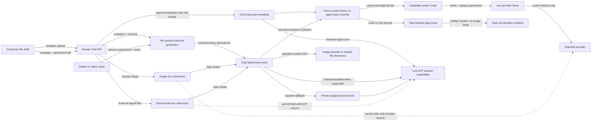

# Chat sessions

All chat persistence in Hecate today goes through chat sessions under
`/hecate/v1/chat/sessions`. The same store backs two session-owner categories
in the Chats workspace: Hecate-owned chats and supervised External Agent
sessions (Codex, Claude Code, Cursor Agent). Hecate-owned chats can contain direct
model turns and task-backed tools-on turns with a backing `agent_loop` task — see
[agent-runtime.md](agent-runtime.md) for the runtime.

The Chats workspace has one shell and an agent picker. **Hecate** is always
first and covers both direct model chat and Hecate-owned agent execution: the
tools toggle decides whether a prompt stays as a direct provider/model turn or
enters the native agent task runtime. Codex, Claude Code, Cursor Agent, and Grok Build entries in
the same picker create **External Agent** sessions.

Chats may also belong to a **Project**. Projects are optional durable identities
for a work area, not only a codebase; **No project** remains a valid chat scope.
When a project is selected in the Chats sidebar, new Hecate and External Agent
chat sessions are created with that `project_id`, and the chat list shows only
chats for the active project. When an open chat is linked to a project, the chat
header exposes a compact project shortcut that selects that project and opens
the Projects workspace. Project-linked Hecate Chat also exposes a compact
composer action that deterministically drafts a Project Assistant proposal from
the current message and hands it to the Projects review surface. The same path
is available as the Hecate-owned `/proposal <request>` chat command for
operators who prefer a slash-command flow. Project-shaping commands such as
`/plan`, `/work`, `/handoff`, and `/review` use the same proposal boundary:
selecting one only inserts the command scaffold, and submitting it drafts from
the text after the command. That handoff is proposal data only; it does not send
a chat message, create project records, call the model-backed draft path, or
apply the proposal.
When tools are on, project-linked Hecate Chat can also let the model call the
Hecate-owned `draft_project_proposal` tool from ordinary natural-language
planning intent. That produces a `project_assistant_proposal` task artifact on
the backing run and shows a compact transcript activity with the proposal title,
action count, and a **Review in Projects** action. It is still proposal data
only: no mirrored Project Assistant chat is created, and apply remains an
explicit Projects action.
Deleting a project also deletes its project-scoped chat transcripts.
Unprojected chats and chats in other projects stay untouched. The Projects
review card preserves the originating request and chat session id for operator
inspection and exposes an **Open source chat** action.
The server makes the project-existence check and chat-session create one
reserved operation relative to project deletion. This includes both direct chat
creation and the supervised External Agent chat created while starting a
project assignment. A delete closes new-chat admission before waiting for an
already reserved create, then removes the completed session during cleanup. A
not-yet-reserved create whose request predates or overlaps deletion cannot
resume afterward; it returns
`409 chat.session_create_conflict` and must be retried explicitly after the
client refreshes projects and chats. The gate is process-wide and conservative:
while any project deletion owns it, project-free and other-project chat creates
also pause and return the same conflict. The same API composition gate covers
both Hecate and embedded Cairnline project authority without moving portable
project identity into Hecate storage.

Hecate Chat treats model/provider readiness as part of composition, not a
send-time surprise. If no configured provider has routable models, the empty
state points at provider setup or local runtime discovery. If models exist but
the currently selected model is no longer reported by the selected provider
(for example after changing Ollama models), the composer is blocked with the
selected model, provider route, discovered-model count, health, and next steps
before any request is sent. Existing transcripts show the full readiness card
near the composer with an **Open Connections** action; empty chats show a compact
version in the empty state that still includes the discovered-model count,
health/blocking/error diagnostics, and short remediation steps. The compact card
is intentionally not just a warning — it should be enough to choose a discovered
model, accept a backend-suggested replacement when one is available, refresh
local provider discovery, or jump to Connections for the full readiness
checklist. Suggested replacement models should be offered as explicit repairs:
switch to the backend-suggested provider/model pair, or keep the current route
and choose another model from the picker. Do not silently widen a stale route
back to a hidden provider fallback.

The backend owns the readiness wording. `/hecate/v1/providers/status` returns a
provider-level `readiness` summary plus detailed `readiness_checks`, and
`/v1/models` adds `metadata.readiness` for every discovered provider/model row.
The UI should prefer those fields over local guesswork whenever they are
present; client-side inference is only a fallback for stale sessions or older
payloads.

The chat setup surface has one repair contract shared by the empty state, the
composer notice, and disabled-send copy. When a prompt cannot be sent, the UI
should pick one primary operator action: **Go to Connections**, **Choose
workspace**, **Enable tools**, **Use suggested model**, or **Open setup** for a
coding-agent integration. Avoid adding local one-off blockers in the Chat view; put
new send blockers behind the shared readiness resolver so the same reason and
CTA are visible before and after the transcript has messages.

Connections owns the provider repair workflow that backs those chat actions.
If the chat CTA sends an operator to Connections, the summary card should show
the same root cause and a concrete first action: add a provider, open the
blocked provider, or refresh provider/model discovery after the operator starts
a local runtime or fixes an upstream account.

Hecate Chat also has one per-chat **Instructions** field. With tools off, the
instructions are sent as the direct model turn's `system_prompt`. With tools
on, the same text becomes the per-task system prompt for the Hecate-owned
`agent_loop` task, layered under the global, tenant, and workspace
`AGENTS.md` / `CLAUDE.md` prompts. Once a chat has messages the field is locked
so historical segments keep the instructions they were created with; start a
new chat to change them. External Agent chats do not use this field because
Codex, Claude Code, Cursor Agent, and Grok Build own their own
prompt/configuration surface; external-agent model, reasoning, and mode
controls appear near the message composer when the agent exposes them.
Hecate-managed launch controls can appear before the first External Agent chat
session exists when a local agent requires startup choices; the message input
itself appears only after the chat session has been created.
External-agent context and reported cost are intentionally shown in the active
chat, not the Usage workspace, because those values are agent-reported and
only meaningful alongside the session that produced them.

Assistant turns may also expose a collapsed **context** inspector. This is a
metadata snapshot that answers "what kind of context did this turn use?" without
storing the prompt body. The packet records execution mode, provider/model when
Hecate owns routing, workspace path, whether a system prompt was included, the
visible transcript message count for that turn, the legacy high-level
`sources`, and itemized `items` with `kind`, `trust_level`, `origin`, `title`,
optional `body` / `body_ref`, `included`, and `inclusion_reason`. Current items
cover system prompt presence, prompt-policy notes, transcript count, enabled
project source metadata (workspace guidance, URLs, notes, local paths, or
external references), enabled project skill metadata, current active project
work metadata, accepted project memory, workspace path metadata, Hecate
task-runtime state, and external-agent session metadata. Hecate-owned project
chat packets mark bounded project prelude content as included, but mark project
context-source file bodies as visible-only because those bodies are not loaded
into chat prompts. External Agent packets mark project memory and source records
as visible-only and explicitly note that Hecate can show adapter metadata and
transcript rows it receives but cannot inspect or control the agent's private
prompt packing. Context packets deliberately do not persist full system prompts,
raw transcript text, file contents, source bodies, `SKILL.md` bodies, or
agent-private prompt packing. The message count is
an operator-facing transcript count, not a provider token count or a guarantee
that every counted message was packed into the provider or agent prompt. Context
packets are snapshots on assistant messages; changing project context sources,
skills, or work records later does not rewrite old message packets.
For project-linked Hecate Chat packets, the inspector also calls out the
bounded project prelude explicitly so operators can distinguish project
guidance from ordinary transcript/runtime metadata and see the metadata-only
root / skill-body boundary.

Long Hecate-owned model chats compact older transcript context before a direct
model turn once the compactable transcript reaches the automatic threshold.
`/compact` runs the same compaction path manually. When the session has a
routable provider/model, Hecate asks that model to produce a structured semantic
summary of the older transcript window and stores it as `context_summary` with
`strategy: "semantic_transcript_summary"`. If that model call is unavailable,
empty, or fails, Hecate falls back to the deterministic transcript summary:
one bounded line per compacted message, capped from the oldest side, with
`strategy: "deterministic_transcript_summary"`. Original chat messages remain
stored; future Hecate-owned model turns inject the summary as background and
send newer transcript messages in full.

### Queued text delivery

When a chat is busy, an explicitly submitted text-only follow-up is stored in
the browser queue and drains in FIFO order after the active turn settles. The
queue contains prompt and route snapshots only; it is local operator state, not
a server-side message or task, until the message API accepts it. Dispatch sends
the stored provider, model, workspace, execution mode, and `tools_enabled`
values verbatim; later runtime capability refreshes do not rewrite queued intent.

Immediately before dispatch, the UI synchronously writes and verifies a
`submitting` state and the authoritative transcript message-id baseline in
local storage. If that durable fence cannot be confirmed, delivery pauses
before the network request. Queue items use independent storage records so
same-origin tabs in one browser profile merge additions and removals instead of
overwriting a stale whole-queue snapshot. Storage events project another tab's
durable `submitting` record as local `reconcile_required` state without
rewriting or removing that fence. A page reload makes the same local projection
and never resends it automatically. Only an explicit **Check status** action may
claim an exact matching keyed fence for same-key replay. Known local or
pre-commit rejections become
`retryable`. A transport or server outcome without proof remains
`reconcile_required`. For current idempotency-keyed items, **Check status**
replays the exact same request key and payload; the response identifies the
committed user message. Hecate keeps that item at the FIFO head until a terminal
assistant for that exact turn appears before the next user message. It observes
SSE and polls the authoritative session concurrently so a publish missed during
stream subscription cannot block the queue indefinitely. Content/baseline
matching is only a compatibility fallback for legacy unkeyed records. It enables
an explicit retry only when the chat is idle, every baseline message is still
present, and no new unmatched transcript message exists at all. A server-proven
`chat.client_request_conflict` is persisted as delivery provenance, bypasses all
content matching (even when transcript text happens to match), and stays blocked:
review the transcript, remove the item, and use a new queue id if its text is
still needed. If proof is unavailable, the item stays blocked for manual
transcript review. A blocked first item also blocks later items, preserving FIFO
delivery. This coordination remains browser-local: other profiles, devices, and
browsers do not receive the queue before its user transcript row commits.
If an item add or edit cannot be written and read back exactly, Hecate keeps the
latest text visible, blocks automatic drain, and warns before unload. A failed
edit best-effort removes an older ready payload so reload cannot silently send
stale text; it does not remove an existing `submitting` fence needed for safe
reconciliation. Single-chat deletion writes a generation-scoped, prompt-free
session tombstone before queue cleanup; stale tabs, reload migration, and later
queue writes reject or purge work for that deleted session. Project deletion
likewise verifies browser-record removal and keeps cleanup failures
blocked/unload-protected; persistent failures require clearing Hecate site data
through browser settings. The running system-reset endpoint does not touch
server or browser state because it fails closed before mutation.

### Dictation

The chat composer can turn a short microphone recording into editable draft
text for Hecate Chat, direct-model chat, or an External Agent chat. Dictation is
not part of the chat execution route: the operator chooses a transcription
provider independently, sees whether it is local or cloud, and can change that
choice before recording. Hecate prefers the first available local route when no
saved choice is available.

Recording is capped at two minutes in the UI and 10 MiB at the API boundary.
The composer stops every microphone track when recording ends, the active chat
changes, or the component unmounts. Hecate sends the audio only to the selected
provider generation, with no cross-provider retry or failover, and does not
retain the audio. The transcript is inserted at the current textarea selection
with readable boundary spacing. It remains an ordinary editable draft and is
never sent automatically.

Browser dictation requires a secure context (HTTPS or the loopback Hecate URL),
`getUserMedia`, and `MediaRecorder`. The macOS, Windows, and Linux desktop apps
integrate those same web APIs through their platform webviews. Linux and Windows
desktop capture remain experimental pending real-machine microphone smokes. The
composer reports an unsupported context separately from an unconfigured
transcription provider, and a denied microphone request leaves the draft and
the rest of the composer usable.

When permission was denied, browser users should open the current site's
controls in the address bar, change **Microphone** to **Allow**, and reload the
page. Desktop users should enable Hecate in the operating system's microphone
privacy settings and restart the app. On macOS that control is **System
Settings → Privacy & Security → Microphone**; on Windows it is **Settings →
Privacy & security → Microphone**, including desktop-app access.

The transcription route is independent of the selected chat model or External
Agent. A Claude/Anthropic chat therefore still needs one configured
speech-to-text route; the returned text is then an ordinary draft that Claude
can receive. The built-in routes are OpenAI (`gpt-4o-mini-transcribe`), Groq
(`whisper-large-v3-turbo`), and LocalAI (`whisper-1`). Operators can also opt an
env-configured OpenAI-compatible provider into the same typed contract. See
[Providers](../operator/providers.md#dictation-providers) and the
[Runtime API](runtime-api.md#dictation-api).

### File attachments

Chat attachments have two ownership-specific admission modes:

- A Hecate-owned turn accepts PNG/JPEG/WebP input with Tools on or off, and
  at least one matching routable provider/model route with effective
  `image_input="supported"`. `unknown`, `none`, and support reported only by a
  blocked route fail closed. Tools-on agent loops keep only an opaque input
  reference in task state, hydrate the body immediately before execution, and
  replace image blocks with a non-sensitive marker in conversation artifacts.
  Same-input approval resumes and retries rehydrate that marker through the
  opaque reference; a later chat prompt replaces or clears the reference.
- An External Agent turn accepts arbitrary non-empty files once its normal
  workspace, adapter, and required launch controls are ready. ACP resource links
  are the baseline. Hecate uses an inline image or embedded resource only when
  the live ACP session reports that capability; otherwise it privately stages
  the file and sends a resource link.

The direct-model rule is an explicit Hecate Chat runtime requirement;
provider-compatible `/v1` multimodal requests retain upstream passthrough when
custom-provider discovery cannot prove image support, but image-bearing
compatibility requests cannot fail over to another provider and revalidate the
selected provider instance immediately before dispatch. Their encoded JSON body
is limited to 32 MiB with a 60-second read deadline.

Both chat modes accept at most four files per message. Each upload is limited to
5 MiB, and the combined files on one message are limited to 12 MiB. Hecate-owned
images are also limited to 8000 pixels on either axis and 16 megapixels. Hecate
checks their magic bytes, declared media type, and decoded dimensions, fully
decodes the bounded image, then records a server-generated id and SHA-256
digest. External Agent files retain their bounded bytes and declared media type
without being interpreted as active content by the operator UI. The composer
supports file selection, drop, and paste. An attachment-bearing draft cannot be
queued while the chat is busy. Switching between Hecate Tools modes or into an
External Agent keeps compatible drafts; switching into a Hecate route that
cannot accept every selected file remains blocked.
Because the browser keeps those local `File` drafts in memory only, it also
requests confirmation before a page reload or close would discard them. On
submit, the UI atomically transfers the exact prompt and `File` values out of
the visible composer before upload starts. Those submitted values remain owned
by one in-flight turn, and reload protection remains active, until the turn
settles. Later composer edits therefore belong to the next turn; removing or
replacing a visible draft cannot mutate the already-submitted request. The
originating chat retains that ownership fence so a late response cannot replace
another chat or restore Files into the wrong composer. Starting or switching
chats, deleting a chat or project, changing runtime ownership, and compacting
are blocked while the owner is live. Visible image drafts apply the same
project-delete guard after navigating away from their owning chat. Individual
chat deletion and project deletion acquire a tokenized chat ownership
reservation before their backend request
starts and retain it through the outcome. While that reservation is held, the UI
rejects new image selection, image-turn submission, chat/session ownership
changes, and queued-message drain.
The confirmation for an in-flight chat or project deletion remains
non-dismissible and cannot be confirmed twice, so the operator cannot return to
the composer and create a newer draft that successful active-chat or
project-scope cleanup would clear.
Reservation acquisition also conflicts with explicit and first-message session
creation until the create request settles. Deferred tool-result continuations
check the queue-lineage generation and session/project deletion tombstones
before every stream or completion write, so a late response cannot repopulate
fenced chat state.
This closes the interval where a draft could otherwise appear after the guard
check but before a successful destructive response fences the deleted sessions.
These browser reservations are UX admission only. The backend gate remains the
authoritative cross-tab fence and returns `chat.session_create_conflict` for a
create that overlaps project deletion.
Destructive operations on an existing chat also close that session's backend
lifecycle before cancelling or checking its active run. Request snapshots are
leased and released, allowing inactive lifecycle state to be reclaimed after
all delayed requests drain. A turn that registers first is cancelled and
awaited; a delete, project delete, or native-session close that closes
admission first makes a delayed turn return `409 chat.session_stopping` before
user-message append, attachment claim/body read, or provider, task, or ACP
dispatch. Overlapping destructive operations remain refcounted for admission
but execute serially and reread the authoritative session after acquiring
ownership, so stale task or native-session fields are never dispatched.
Task-backed Hecate Chat deletion additionally closes the shared task-origin
mutation gate. It waits for already-admitted Task start, retry, resume,
continue, retry-from-turn, and approval-resolution mutations, then cancels every
non-terminal run whose durable Task origin names the chat while no later
mutation can enter. The gate remains held through transcript deletion and
commits that deletion before release, so retained Task history stays
inspectable but cannot be restarted or requeued after its chat owner
disappears. Execution mutation also checks durable chat ownership, preserving
that fail-closed behavior after a runtime restart while allowing
validator-backed in-memory gate state to be reclaimed.
While that attachment turn is live, an explicitly submitted text-only follow-up
is rejected without clearing or persisting it in the browser queue. The text
stays in the composer and can be submitted after the attachment response reaches
a known outcome. This prevents an ambiguous attachment POST from releasing its
local owner and automatically draining later text against stale or unknown
transcript state. The mode-specific Stop control remains available for the exact
submitted turn while the browser stages file drafts, including the short interval where an
implicit first turn is creating its session and no session ID exists yet. That
unknown-session projection belongs only to the active detached composer; an
unrelated preparatory session create is not presented as agent work. Before the
message POST begins, Stop owns a generation-bound, monotonic local cancellation
token. The same `AbortSignal` reaches session creation and upload, and the turn
rechecks the fence before message dispatch even when an intermediary ignores
the signal. If an ignored session-create abort returns a known acknowledgement,
Hecate records and binds the message-empty session shell and its create-time
title metadata, then stops. Stop does not promise metadata rollback, but it does
guarantee that, after cancellation wins, the exact turn sends no message and
starts no provider, task, or ACP work. The local cancellation owner remains
visible until that exact submit has restored its prompt and Files and unwound.
During unconfirmed message admission the control is withheld. It
reappears on the server path only after a non-empty session ID is bound and an
authoritative busy snapshot confirms admission. The composer announces stopping
progress as a polite live status and uses mode-specific labels for direct model,
task-backed, and External Agent turns.

After server admission, a successful Stop response means only that cancellation
was signalled. Its point-in-time session body may still be non-terminal. The UI
keeps an exact session/turn terminal fence, drops reordered busy snapshots and
new approval requests from that turn, and settles only from its matching live
stream or message POST, or from a session GET begun after Stop was accepted. The
visible Stop owner waits for that proof only up to a bounded deadline; releasing
the owner on timeout does not release the terminal fence or make stale approvals
actionable. An initially rejected Stop removes the provisional fence first,
then reconciles session and approval state independently so either catch-up read
may stall without wedging chat controls. If a retry fails while an earlier
accepted Stop is still unsettled, the UI restores that fence, renews its bounded
settlement window, and keeps the original turn stream available for terminal
proof.

A definite rejection restores the original prompt and Files and
preserves any newer unsent text as one editable composer draft. Hecate retries
failed draft cleanup once. If both deletion attempts fail, the UI preserves the
typed submission error and warns that retained server copies may consume
attachment quota until a later upload reclaims them after they are at least 24
hours old. The operator can delete the chat to release those copies immediately,
or remove the restored draft and wait until after 24 hours before another upload
triggers reclamation. If an upload response itself is lost or an unrecognized
5xx response cannot prove rejection, the UI treats that upload as ambiguous. It
restores the exact prompt and Files without automatically retrying, deletes only
the drafts whose ids were acknowledged, and warns that one unlinked copy may be
hidden until the same later-upload reclamation or chat deletion.

Attachment bodies live in the Hecate-owned chat attachment store selected by the
chat backend (`memory`, SQLite, or Postgres). Transcript messages contain only
immutable metadata and a session-scoped content URL; binary data and base64 are
never stored in session JSON, SSE snapshots, traces, logs, or the browser's
local queued-prompt storage. The UI loads stored previews through the normal
Hecate-native API client, including the runtime-token header when that optional
guard is configured, cancels body reads when previews move outside the viewport,
offers an explicit retry after load failure, and revokes its temporary object
URLs. Non-image files never load automatically or render inline: an explicit
Download action fetches the guarded blob, starts a browser download, and revokes
the temporary object URL after the click has been processed.

Uploads begin as deletable drafts. A session may stage at most eight unlinked
drafts totaling 40 MiB. Staging another upload atomically reclaims unlinked
drafts older than 24 hours across all sessions before applying that quota, so
an eligible stale browser draft cannot permanently block a later staging
request. Sending claims every referenced draft
atomically against deletion; a failed transcript append releases the claim,
while a successful append permanently links the bodies. Linked transcript
attachments do not count against draft quota and never expire before session
deletion. Draft and linked attachment bodies together are capped at 512 MiB per
chat.
The aggregate cap is 512 MiB for memory and 4 GiB for SQLite/Postgres; the
operator can delete chats to release that retained storage.

The upload snapshots the chat lifecycle before reading the session, then
rechecks that generation immediately before attachment persistence. If a
delete or native close wins while the body is being validated, persistence is
not attempted and the upload returns `409 chat.session_stopping`. If
persistence was admitted first, the destructive operation waits for it before
session-scoped cleanup. A post-create ownership check still rolls back a body
when an external store observes concurrent owner loss; if that rollback cannot
be confirmed, the API returns a sanitized `500` rather than a false definite
`404`, and clients must treat the upload result as ambiguous.

Claims carry the intended user-message id as a durable fence. If an append or
commit result is ambiguous, Hecate checks the transcript before releasing any
body. On startup, exact committed metadata links the claim, an absent message
releases it, a deleted owner purges every body for that session, and conflicting
metadata stays claimed and non-deletable. Before project chat cleanup, a live
orphan sweep compares attachment session IDs with authoritative transcript rows
and removes bodies only for missing owners. It does not inspect or resolve
pending claims. This lets a project-delete retry finish cleanup if chat deletion
committed before its attachment cleanup.

Direct model history rehydrates recent, non-compacted image turns only for the
outbound provider request. Hecate reserves up to 12 MiB of stored image bytes per
request, newest first. If older images do not fit, the model receives an
explicit omission marker; transcript metadata and the operator preview remain
available. Historical bytes are rehydrated only for the same configured
provider generation recorded on the original turn. Provider selection prefers an exact
configured runtime name, then a unique normalized runtime name, then a unique
stable alias; ambiguous aliases fail closed. Configured providers participate
in identity resolution even when they currently report no models. The resolved
route carries an opaque, internal generation identity in addition to its
canonical name. Managed-provider identity remains stable across an unchanged
runtime reload, but endpoint, account, configuration, credential rotation, or
delete-and-recreate changes it. Legacy transcript rows without a generation and
runtime-only providers that have been recreated receive an omission marker, as
do provider switches and unresolved Auto boundaries. The identity contains no
secret-derived material and is not exposed by the chat or model APIs,
telemetry, logs, or errors. Once bytes are hydrated, dispatch is pinned to the
canonical provider and generation resolved during admission. The executor
rechecks both against the live registry immediately before the provider call.
A same-name replacement, live alias reassignment, normalized-name takeover, or
removal therefore fails the turn without disclosing bytes to the replacement.
Image-bearing requests may retry on the selected provider, but Hecate disables
cross-provider failover. If an Auto-routed provider receives bytes and then
fails, the failed transcript still records that attempted provider/model and
trace correlation. Context compaction keeps original transcript rows but
replaces the older model-facing window with the normal context summary.

A process-wide two-slot image-turn gate bounds the transient memory held by
attachment claims, historical body hydration, base64 expansion, provider
serialization, and in-flight provider calls. A saturated image turn returns
`429 chat.image_turn_busy` with `Retry-After: 1` before claiming a draft or
mutating the transcript. Text-only turns and turns whose historical images are
certain to be omitted do not consume an image-turn slot.

A separate process-wide two-slot External file-turn gate bounds attachment
claim, hydration, private staging, and the synchronous ACP prompt lifetime
across workspaces. Saturation returns
`429 chat.external_file_turn_busy` with `Retry-After: 1` before claiming a
draft or mutating the transcript. Text-only External Agent turns do not consume
this slot.



External Agent sessions may expose ACP-advertised `available_commands` on the
session snapshot. These are agent-native slash command hints, not Hecate
project commands; selecting one still sends ordinary prompt text to the
external agent. The operator UI may show these hints while the composer starts
with `/`; choosing a hint only inserts the slash command text. Hecate-owned
chat commands are separate local shortcuts and must still route through
Hecate's proposal, validation, and operator-apply boundaries.
The composer picker labels command provenance as **External Agent** for
ACP-advertised external commands, **Project** for Hecate-owned project proposal
shortcuts, and **Hecate** for local navigation/runtime shortcuts.

### Hecate-owned chat commands

Hecate-owned commands are local UI shortcuts in Hecate Chat. They are not ACP
commands and they do not run when submitted to an External Agent chat. Project
commands draft Project Assistant proposals; navigation commands open Hecate UI
surfaces without sending a chat message.

Project-linked Hecate Chat also receives a bounded Hecate-owned prompt prelude
with project-root metadata, role hints, enabled skill metadata, active work,
and accepted project memory excerpts. Roots and skills are metadata only: the
chat path does not read root files or inject `SKILL.md` bodies. When Cairnline
is the configured read source, that prelude and its context-packet metadata are
assembled from the active embedded or sidecar Cairnline project graph rather
than requiring a native Hecate project row. External Agent sessions may share
the same project filter and sidebar scope, but their prompt packing remains
agent-owned and does not receive this Hecate prelude.

| Command               | Available when                          | Behavior                                                                    |
| --------------------- | --------------------------------------- | --------------------------------------------------------------------------- |
| `/proposal <request>` | Hecate Chat is linked to a project      | Drafts a Project Assistant proposal from the request.                       |
| `/plan <request>`     | Hecate Chat is linked to a project      | Drafts a Project Assistant plan proposal from the request.                  |
| `/work <request>`     | Hecate Chat is linked to a project      | Drafts a project-work proposal from the request.                            |
| `/handoff <request>`  | Hecate Chat is linked to a project      | Drafts a project handoff proposal from the request.                         |
| `/review <request>`   | Hecate Chat is linked to a project      | Drafts a project review proposal from the request.                          |
| `/diff`               | Hecate Chat has a workspace             | Opens the workspace changes panel.                                          |
| `/model`              | Hecate Chat is open                     | Opens chat settings focused on provider/model controls.                     |
| `/settings`           | Hecate Chat is open                     | Opens the chat settings panel.                                              |
| `/status`             | Hecate Chat is open                     | Opens the chat settings/status details panel.                               |
| `/task`               | Hecate Chat is open                     | Opens the active task when one exists; otherwise opens the Tasks workspace. |
| `/project`            | Hecate Chat is linked to a project      | Opens the linked project in Projects.                                       |
| `/connections`        | Hecate Chat is open with app navigation | Opens Connections for provider/model and External Agent setup.              |
| `/context`            | Hecate Chat is open                     | Opens the chat context/settings panel without sending a chat message.       |
| `/compact`            | Hecate Chat is open                     | Compacts older Hecate-owned transcript context without sending a message.   |

Submitting a project command without text after the command returns a composer
notice and does not draft a proposal. Unknown slash commands in Hecate Chat are
submitted as ordinary chat text, matching the normal composer path.

Hecate Chat settings also own **Workspace execution**, the **Tools** toggle,
and the optional **Compact command output** toggle. **Managed workspace**
(`persistent` or `ephemeral`) keeps the selected source folder untouched and
provisions task-backed turns in a separate Hecate-owned workspace. **Current
folder** (`in_place`) lets tools write directly to the selected folder and is
therefore the explicitly destructive posture. The two managed values remain
distinct persisted settings, but currently share clone/copy provisioning;
the UI intentionally renders both as one stable **Managed workspace** choice
until their lifecycles differ. Existing `ephemeral` sessions retain that API
intent while showing the same managed choice. Git-worktree provisioning can be
added behind the managed-workspace contract without changing the operator
choice. External Agent chats do not expose this control: their ACP sessions
always own the selected workspace in place.

The operator UI explicitly defaults project-free Hecate chats to Managed
workspace. A project-linked new chat inherits the Cairnline Project's workspace
default as coordination intent, while Hecate snapshots and enforces the value
on the chat and backing task. An empty or direct-model-only Hecate Chat may
change posture, including when it started from a linked Project default. While
that write is pending, the requested value is shown immediately and message
submission, attachments, route controls, and chat-setting edits pause until
Hecate confirms or reloads the authoritative value. The composer announces the
pending state and associates it with the disabled Send and attachment controls.
After its first task-backed segment exists, the selector is locked so one
transcript cannot silently switch between managed and live-folder execution. A
managed run atomically replaces the session and launching message paths with the
actual generated execution path, keeping Review, Files, and evidence scoped to
the files the agent changed. If a provider/model/MCP change starts a new task
segment, it reuses that managed root so unstaged and untracked work remains
visible to the next agent.

All non-empty Hecate settings writes share the same exclusive turn boundary,
including Compact command output changes. If the atomic task/run link cannot be
confirmed after retry and an authoritative reread, Hecate cancels the backing
run, terminalizes the assistant as failed, and keeps Review/Files closed. A
same-`client_request_id` replay returns that terminal transcript without
dispatching another run. Durable chat-origin metadata remains a fallback Stop
path if the first cancellation attempt could not be confirmed.
Until that origin run is terminal, Hecate also rejects another turn instead of
starting a second backing task against an incompletely linked transcript.

Tools decides whether future turns stay as direct model calls or enter the
Hecate task runtime. If tools are on but the selected model is known not to
support tool-calling, Hecate keeps the chat usable by sending the turn as direct
model chat and showing that state in the chat header. Compact command output is
per-chat RTK support. It is off by default; if `rtk` is installed in the
gateway process `PATH`, Hecate suggests enabling it during new-chat onboarding.
When enabled, future shell/git tool calls in task-backed turns launch as
`rtk sh -lc <command>`. Hecate still performs its own approval, policy,
sandbox, timeout, and output-limit checks; RTK only changes the command output
shape the model sees. Task/run activity carries the resulting argv and
`hecate.sandbox.rtk.enabled` flag so debugging can confirm whether a command
actually used RTK. When compact output is enabled, telemetry also carries
`hecate.sandbox.rtk.command.before` and `hecate.sandbox.rtk.command.after` so
operators can compare the command Hecate validated with the argv that RTK
wrapped.

The operator UI's **Hecate** agent choice uses chat sessions under
`/hecate/v1/chat/sessions` for both tools-off direct model turns and tools-on
task-backed turns. Session ownership is stable (`agent_id="hecate"`), and
every Hecate-side message persists as `execution_mode="hecate_task"` —
the tools-on/off axis is recorded on each message's `tools_enabled` boolean
instead of split across two execution-mode values:

- **Model** segments (`tools_enabled=false`) call the gateway/router directly
  and store user/assistant messages without creating Tasks.
- **Task-backed Hecate Chat** segments map a tools-on stretch of a chat to one
  visible `agent_loop` task. The first tool-enabled prompt creates the task;
  follow-up prompts continue the latest terminal run when the previous segment
  was also task-backed. If tools are re-enabled after a direct model segment,
  Hecate creates a new task-backed segment in the same transcript.
  While a task-backed segment is queued, running, or awaiting approval, the
  whole Hecate Chat session is busy: direct model sends are blocked too, so one
  transcript cannot race a live task loop against a separate model turn. The
  composer shows the busy state with **Open task** and **Stop** actions so the
  operator can jump to the canonical Task view or cancel the active loop.
  If the operator submits another prompt while the active run is still busy,
  the UI keeps it in a local **Queued next** FIFO and submits it automatically
  after the run or approval reaches a terminal state. Queued prompts preserve
  the originating chat session and project plus the selected
  runtime/model/workspace snapshot from the moment they were queued, so
  switching to another chat cannot drain a prompt into the wrong transcript and
  project deletion can remove prompts observed only by another tab. Legacy
  records with unknown project ownership and raw records that cannot be audited
  make deletion cleanup report failure instead of claiming all matching prompts
  are gone. Unknown-owner records are also quarantined after a project tombstone
  because their unrelated ownership cannot be proven; new project-free records
  carry an explicit empty owner and do not trigger that warning. A
  browser-profile project tombstone rejects new queue admissions and purges late
  records in other tabs and after reload. Single-chat deletion uses the same
  fence shape at session scope, before prompt cleanup, so a stale tab cannot
  recreate queued work for a server-deleted chat. Queue items plus project and
  session tombstones carry the browser-profile queue-lineage generation observed by
  their writer. Every item mutation uses a new immutable revision-scoped
  physical key; the previous exact revision is retired only after the new record
  is verified. Duplicate surviving revisions pause the whole local queue until
  storage events or manual cleanup make the lineage unambiguous.

  Remove writes a generation-scoped SHA-256 tombstone for the exact canonical
  payload before deleting immutable revisions. The same payload stays consumed
  if a stale tab rewrites it. A different ready payload with the same id is kept
  as a local queue-id conflict and must be removed and submitted again to obtain
  a fresh id; a different `submitting` payload stays fenced for explicit status
  reconciliation. These hash tombstones contain no prompt but reveal equality
  and remain until queue or site-data cleanup.

  Previous releases used mutable unscoped or revisionless item keys. Migration
  copies a valid row into an immutable revision and records a prompt-free
  fingerprint marker. The mutable prompt remains as a suppressed shadow because
  local storage cannot atomically compare and delete it without risking a newer
  cross-tab replacement. Matching shadows remain consumed after delivery or
  removal; changed shadows surface as blocked conflicts. Explicit browser-queue
  or site-data cleanup removes the retained legacy prompt, marker, and exact-item
  tombstones. The queue cleanup also post-audits the older prompt-bearing
  whole-array key so a write that races its snapshot makes cleanup fail instead
  of being silently retained. The disabled server reset endpoint does not invoke
  this browser action.

  ```mermaid
  flowchart LR
      Mutation["Queue mutation"] --> Revision["Immutable generation + revision key"]
      Revision --> Snapshot["Cross-tab logical snapshot"]
      Remove["Logical Remove"] --> ExactHash["Exact payload-hash tombstone"]
      ExactHash --> Snapshot
      Legacy["Mutable legacy row"] --> Marker["Migration fingerprint"]
      Marker --> Snapshot
      Cleanup["Explicit browser-queue cleanup"] --> Revision
      Cleanup --> ExactHash
      Cleanup --> Marker
  ```

  Parseable inconsistent generation metadata remains visible and blocked for
  manual cleanup; malformed or unreadable records, markers, or tombstones make
  admission and cleanup fail closed even when their contents cannot be rendered.
  Ordinary ready/retryable items can be edited or removed while waiting. A
  parseable stale-generation item exposes Remove as an exact cleanup retry; an
  ambiguous submission fence must first be reconciled, and unreadable or
  persistently failing storage requires manual browser site-data cleanup. Modern
  immutable prompt revisions are removed after successful submission, explicit
  removal, or session/project pruning; suppressed legacy shadows can remain
  until reset. Each queued item id is also sent as the optional
  `client_request_id`. Hecate atomically
  binds that key to the user transcript row before backing-turn dispatch, so
  concurrent tabs and explicit same-payload retries receive the current
  authoritative session without launching duplicate backing-turn provider,
  task, or ACP work. Admission-time semantic compaction is separate provider
  work and may precede that commit. Hecate keeps the pending reservation alive
  throughout that work and conditionally verifies its owner token and payload
  fingerprint again immediately before commit; losing the reservation fails
  the send before backing-turn dispatch. Reusing a committed key after editing
  any payload field fails closed with `409 chat.client_request_conflict`. Review the
  authoritative transcript, remove the conflicting queue item, and submit a new
  turn with a new queue id only if its text is still needed. Every successful
  keyed message response includes
  `message_request.replay` and `message_request.committed_message_id`. The first
  completed request reports `replay=false`; a same-payload retry reports
  `replay=true` and the exact already-committed user message id, even when the
  original assistant turn is still running. Hecate does not expose the key,
  fingerprint, payload copy, or internal lease token in this metadata.
  Once admission reaches the keyed commit, Hecate gives the atomic user-row/key
  write a short bounded server-owned persistence window, so a disconnect cannot
  turn a successful durable commit into an apparent failure. Unkeyed sends keep
  ordinary request cancellation. After commit, separate bounded windows create
  the running assistant, attach task/run ownership, and settle terminal
  assistant/session state even if the browser disconnects. Direct model and ACP
  execution remain request-bound and persist a cancelled terminal assistant
  after disconnect. The tools-on Hecate task watcher is server-owned after
  commit and continues across browser disconnect until the task finishes, the
  operator stops it, or the 30-minute chat-run ceiling expires. That ceiling
  ends the chat watcher and terminalizes the chat turn; it does not cancel the
  orchestrator-owned Task. A Task that remains active, including one awaiting
  approval, stays visible and independently cancellable in Tasks. Replaying the
  key observes that durable turn and never launches another provider, task, or
  ACP dispatch.
  The browser keeps a replayed queue item at the FIFO head until the exact
  committed user message has a terminal assistant before the next user message,
  with compatible segment/run/task identity when both messages expose it. It
  observes the live stream and polls the authoritative session concurrently; if
  terminal proof is unavailable, the item remains `reconcile_required` and later
  queued work does not drain.
  Chats projects the backing run activity into the transcript, links each
  assistant turn back to its backing Task/run, and can approve/reject pending
  task approvals inline. Low-level artifacts stay under transcript **Details**,
  while Tasks remains the canonical run/artifact view. On refresh, the UI
  rehydrates the active Hecate Chat from the persisted session/task snapshot so
  queued, running, and awaiting-approval states stay visible without sending a
  new prompt.
  If a task-backed MCP tool returns an MCP Apps resource, the transcript renders
  the captured app iframe directly in the assistant message body and keeps the
  compact tool activity row collapsed below it as audit metadata.
  If the project-linked agent loop drafts a Project Assistant proposal, the
  transcript shows a `Project Assistant proposal` activity with proposal
  title/action-count metadata and a **Review in Projects** action. The linked
  artifact is the handoff; Chats does not create a second Project Assistant chat
  thread.
  Deleting a Hecate Chat cancels any non-terminal backing task run before the
  transcript is removed; the backing Task record remains in Tasks for audit and
  artifact history.
  When the backing provider supports streaming, the running assistant message
  updates from the task conversation artifact before the task run completes.

  API responses include derived `turn_kind` on messages and transcript
  segments. Clients should prefer `turn_kind` (`direct_model`, `hecate_task`,
  or `external_agent`) for UI routing and keep `execution_mode` /
  `tools_enabled` as durable compatibility fields.

- **External Agent** sessions map one chat session to one supervised ACP
  session such as Codex, Claude Code, Cursor Agent, or Grok Build. Composer
  controls may be ACP-owned session options or Hecate-managed launch options;
  they stay separate from Hecate provider/model routing.

External Agent sessions persist Hecate's operator-facing shell plus the
agent-owned native session handle. Listing chat sessions does not start or
reattach agents. Opening a single External Agent session, or subscribing to
its stream, attempts to load the stored ACP session handle so Hecate can refresh
agent controls before the next prompt. If the agent cannot restore that
native session, the transcript still opens from Hecate's store; the next send or
agent setup action can start a fresh native session and keep the shell intact.
Opening a chat never silently replaces the stored native session handle with a
fresh agent session.

The chat session API shape used by the operator UI is in
[`runtime-api.md`](runtime-api.md#get-hecatev1chatsessions), and external-agent
behavior is in [External Agents](external-agents.md).

## Activity rendering

Hecate uses one compact activity vocabulary across Hecate Chat transcripts and
Task Detail. This is deliberate: an operator should see the same story whether
they stay in Chats or open the canonical Task/run view.

Chat titles are operator metadata and can be renamed from the Chats sidebar.
Renaming works the same way for Hecate Chat, direct model turns, and External
Agent sessions: it only changes the visible session title, not the transcript,
workspace, runtime segment, provider/model snapshot, or agent-owned native
session.

The shared renderer keeps the high-signal path visible:

- model turns / thinking
- tool calls
- approval requested / approved / rejected / cancelled
- workspace changes
- final answer
- terminal run state

Lower-level task artifacts, raw output markers, and internal bookkeeping are
grouped under **Details**. Chats keeps those details collapsed by default so the
conversation stays readable; Task Detail opens the activity section by default
because that view is already a run-inspection surface. Task Detail can also
show a per-row **Advanced** disclosure with raw activity metadata such as
step/artifact/approval ids, tool kind, path, timestamp, and summary payload.
Repetitive command rows are collapsed into a single **Ran N commands** group;
expanding that group shows the commands and any captured output in one layer so
operators do not have to click through nested output disclosures. Command and
read-context rows keep raw output out of the compact row and show normalized
line breaks inside the output card.
Workspace changes have one primary surface: the per-turn file badge and the
workspace changes panel. The panel has two jobs: **Review** shows the current
unstaged tracked patch (index → worktree) as a changed-file list with
collapsible rich diffs, while **Files** shows the full workspace tree separately
and keeps folders collapsed until the operator expands or searches. Staged
index changes and untracked files are not part of Review's patch or discard
authority. Transcript activity may mention that workspace changes exist, but it
should not duplicate raw patches or render a second diff viewer when the richer
workspace diff surface is available.

If the selected workspace has any staged change in scope, including mixed
staged and unstaged edits, Review and discard fail closed with
`422 invalid_request`. Hecate issues no revision, never renders staged-only
state as a clean patch, and never authorizes only the unstaged half of mixed
state. Unstage the changes, refresh Review, inspect the now-visible
index-to-worktree patch, and confirm discard again. Full staged-layer review and
discard is not part of this surface yet.

Discard confirmation is bound to the opaque revision returned with that exact,
complete raw, workspace-scoped unstaged tracked patch. Hecate first closes and
drains the owning chat's session lifecycle, then attempts an exclusive closure
in the shared process-local workspace registry. The registry treats canonical
parent and child roots as overlapping, so active task admission/execution,
External Agent turns and live ACP terminals, task-patch apply/revert, or an
operator terminal on either root blocks the discard. A live ACP terminal keeps
its own writer lease after its creating turn settles and releases it only after
exit is observed. Hecate also scans durable non-terminal task runs and other
active chat sessions for the same overlapping workspace before it trusts the
final snapshot.

With those gates held, Hecate checks for staged state again, captures the
complete raw unstaged tracked patch, and requires its revision to match the
reviewed token. Conditional reverse apply then reserves Git's conventional
index lock, rechecks staged state and the reviewed patch's live index baseline,
and applies only the selected hunks from those exact captured bytes. A committed
baseline change or overlapping worktree edit made after the snapshot causes the
whole discard to return `409` without changing the selected files; unrelated
and non-overlapping edits remain in the worktree. The index reservation blocks
cooperating Git index writers during the final recheck and apply, while
conditional apply remains the final protection against direct worktree edits.
The shared registry is process-local, not a distributed lock.
Discard controls remain disabled while the UI knows agent work is queued,
running, or awaiting approval, but the API is the authority for every
active-work, staged-state, and revision conflict.
Complete unstaged tracked patches above the 4 MiB review limit fail closed
instead of exposing partial discard authority.

For failed tool rows, Task Detail also previews stdout/stderr artifacts captured
for the same tool step, including an explicit empty-stream note when stderr was
captured but contained no bytes. Artifacts from other steps are intentionally
not linked into that row, so a failed command cannot appear to have output from
an unrelated tool call.
When a tool row fails, Chats may show its own **Advanced** disclosure with
capped previews of the backing Task's non-empty stdout/stderr artifacts plus an
**Open task output** escape hatch for the full capture. Empty streams stay
hidden there; open the Task view when you need to confirm whether stderr was
captured but empty.
