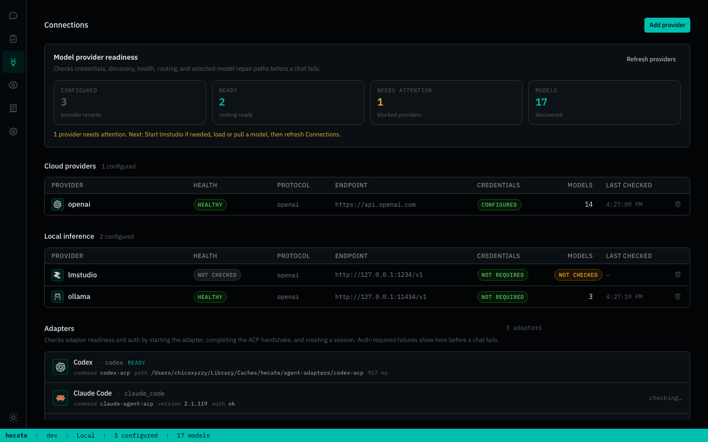
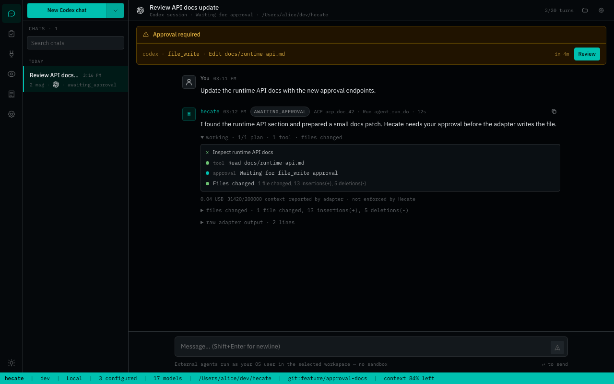
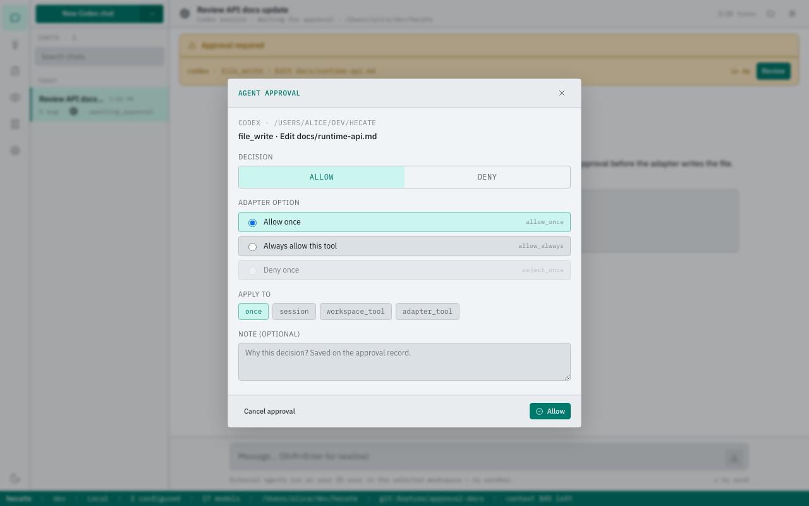

# External Agents

Hecate can supervise external coding-agent CLIs from **Chats**. Today that means
Codex, Claude Code, Cursor Agent, and Grok Build through ACP sessions launched
next to the Hecate runtime.

External agents are not Hecate model providers and they are not inside the
`hecate` process. Hecate starts the agent bridge as the operator's OS user, sends
prompts over ACP, records transcript/diagnostics, handles approvals, and shows
Git diffs. The model gateway path is not involved; `/v1` provider routing and
Hecate model credentials stay separate.

With `HECATE_BACKEND=sqlite` or `postgres`, Hecate keeps the transcript and the
agent's native ACP session id. After restart, the next prompt asks the agent to
`session/load` that native session when supported. If the adapter cannot load it,
Hecate starts a fresh native session and keeps the Hecate transcript.

The bundled Go Codex and Claude Code adapters use command-backed sessions today.
Both support in-memory `session/load` / `session/resume` / `session/fork` while
the adapter process is alive, and later prompt commands receive a bounded
transcript prelude for multi-turn continuity. Claude Code adapter
`v0.1.0-alpha.12` also uses Claude-native UUID session ids with
`claude --session-id`, so Hecate can reload a stored Claude native session id
after an adapter process restart. Codex does not yet claim vendor-native
durable history across adapter process restarts; if a load is stale, Hecate
falls back to a fresh native session. Hecate treats `codex-acp-adapter` and
`claude-code-acp-adapter` versions older than `v0.1.0` as outside the tested
range because the stable release line is the first supported floor that includes
the current continuity, permission-control, structured stream, session metadata,
external MCP handoff surface, ACP authenticate/logout mapping, prompt auth
failure/stop-reason classification, local-login environment contract,
`session/close` cleanup behavior, structured tool output preservation,
permission-outcome, rejected-tool-result, post-cancel stream, MCP
permission-label hardening, sparse Codex tool-completion metadata carry-over,
real-provider stdio MCP smoke coverage, and current prompt permission
selectors.
The `v0.1.0-alpha.8` adapters added supported Codex and Claude Code JSON stream
translation into ACP assistant-message, thought, tool-call, tool-result, and
usage updates, so Hecate can render External Agent activity without exposing raw
JSONL output in the chat transcript. The `v0.1.0-alpha.9` adapters added
config-option update notifications and richer command-backed `session/list`
metadata. The `v0.1.0-alpha.10` adapters also publish ACP
`session_info_update` notifications with command-backed session title and
updated-time metadata. Codex adapter `v0.1.0-alpha.11` adds the advertised
`/review` command backed by `codex review --uncommitted`, and
`v0.1.0-alpha.12` adds an ACP config option that maps normal Codex turns to
`codex exec --search` when enabled, and `v0.1.0-alpha.13` propagates
session-level stdio/HTTP MCP server config into Codex CLI config overrides.
Codex adapter `v0.1.0-alpha.14` also advertises `/init` through the normal
`codex exec` prompt path so operators can ask Codex to inspect the workspace and
create or update repository agent instructions from Hecate.
Codex adapter `v0.1.0-alpha.15` classifies more provider-native tool updates as
ACP tool kinds, including file, web/fetch, MCP, image, plan, TODO, goal, and
review updates, so the External Agent transcript can show those activities more
clearly.
Codex adapter `v0.1.0-alpha.16` maps ACP `logout` to the native `codex logout`
command.
Codex adapter `v0.1.0-alpha.17` maps ACP `authenticate` to the native
`codex login` command.
Codex adapter `v0.1.0-alpha.18` pins the shared Go ACP adapter kit to its
first tagged alpha release.
Codex adapter `v0.1.0-alpha.19` classifies prompt command auth failures as ACP
authentication-required errors so Hecate can surface the login action instead of
a generic prompt command failure.
Codex adapter `v0.1.0-alpha.20` propagates terminal stop reasons from the
structured Codex stream so Hecate can show actionable stops such as token limits
or refusals in the chat activity timeline.
Codex adapter `v0.1.0-alpha.21` maps parsed Codex stream permission requests to
ACP `session/request_permission`, so Hecate can record and resolve adapter tool
approvals instead of silently auto-continuing parsed permission events.
Codex adapter `v0.1.0-alpha.22` keeps first-party CLI local-login detection
visible to the spawned Codex process while retaining the sanitized adapter
environment, and the release is covered by the opt-in real CLI smoke suite.
Codex adapter `v0.1.0-alpha.23` classifies native Codex HTTP 401 prompt
failures as ACP authentication-required errors so Hecate can surface the login
action instead of a generic prompt command failure.
Codex adapter `v0.1.0-alpha.24` removes a stale Codex CLI approval flag that is
not accepted by current Codex CLI releases; command approvals continue through
Codex sandbox behavior and parsed permission-request events.
Codex adapter `v0.1.0-alpha.25` cancels active command-backed work and frees
in-memory command session state when Hecate closes the ACP session.
Codex adapter `v0.1.0-alpha.26` preserves structured Codex tool output in ACP
tool updates so Hecate can keep rendering detailed command/file/tool results.
Codex adapter `v0.1.0-alpha.27` hardens ACP permission outcomes so selected
options must match an adapter-offered option, and expands source-shaped
permission-request parsing for option aliases and defaults.
Codex adapter `v0.1.0-alpha.28` preserves MCP permission request labels as
`server/tool` when the Codex stream includes MCP server and tool fields.
Codex adapter `v0.1.0-alpha.29` marks denied, rejected, blocked, timed-out,
interrupted, and aborted provider tool results as failed ACP tool updates, and
uses the shared command bridge guard that drops stream chunks delivered after a
prompt has been cancelled.
Codex adapter `v0.1.0-alpha.30` advertises stable ACP session capabilities for
list, resume, close, delete, and additional directories during initialization,
so hosts can discover the supported lifecycle surface without probing calls.
Codex adapter `v0.1.0-alpha.31` adds GitHub artifact attestations for release
archives and documents the stable-readiness parity gate that remains before a
stable adapter tag.
Codex adapter `v0.1.0-alpha.32` adds an ACP approval-policy config selector,
including explicit bypass mode, and expands the opt-in real CLI smoke suite to
verify a local stdio MCP echo tool call.
Codex adapter `v0.1.0-alpha.33` carries tool title/kind metadata from start
events onto sparse completion updates, so Hecate can keep rendering MCP and
provider tool timeline entries with stable labels even when the completion event
only carries the result payload.
Codex adapter `v0.1.0` is the stable supported floor for Hecate's bundled Codex
adapter path. It keeps the alpha.33 behavior, pins the shared ACP adapter kit to
its first stable release, and documents draft ACP RFD work as non-blocking
future work.
Claude Code adapter `v0.1.0-alpha.11` adds command-backed stdio/HTTP MCP server
config propagation into Claude `--mcp-config`, and `v0.1.0-alpha.12` adds
Claude-native `--session-id` reload after adapter restarts. Claude Code adapter
`v0.1.0-alpha.13` advertises `/init` through the normal `claude --print` prompt
path so operators can ask Claude Code to inspect the workspace and create or
update `CLAUDE.md` from Hecate. Claude Code adapter `v0.1.0-alpha.14` also
advertises `/review`, `/code-review`, and `/security-review` as normal prompt
commands backed by Claude Code's native slash-command handling.
Claude Code adapter `v0.1.0-alpha.15` exposes Claude Code's
`bypassPermissions` permission mode as an ACP session config option for
operators who intentionally want the full-access Claude Code boundary.
Claude Code adapter `v0.1.0-alpha.16` classifies more provider-native tool
updates as ACP tool kinds, including web/fetch, task, and memory updates, so the
External Agent transcript can show those activities more clearly.
Claude Code adapter `v0.1.0-alpha.17` advertises additional prompt-backed
commands (`/compact`, `/debug`, `/run`, and `/verify`) so Hecate can show them
in the External Agent command picker.
Claude Code adapter `v0.1.0-alpha.18` maps ACP `logout` to the native
`claude auth logout` command.
Claude Code adapter `v0.1.0-alpha.19` maps ACP `authenticate` to the native
`claude /login` command.
Claude Code adapter `v0.1.0-alpha.20` pins the shared Go ACP adapter kit to its
first tagged alpha release.
Claude Code adapter `v0.1.0-alpha.21` classifies prompt command auth failures
as ACP authentication-required errors so Hecate can surface the login action
instead of a generic prompt command failure.
Claude Code adapter `v0.1.0-alpha.22` propagates terminal stop reasons from the
structured Claude result stream so Hecate can show actionable stops such as turn
limits or refusals in the chat activity timeline.
Claude Code adapter `v0.1.0-alpha.23` maps parsed Claude Code stream permission
requests to ACP `session/request_permission`, so Hecate can record and resolve
adapter tool approvals instead of silently auto-continuing parsed permission
events.
Claude Code adapter `v0.1.0-alpha.24` keeps first-party CLI local-login
detection visible to the spawned Claude process while retaining the sanitized
adapter environment, and the release is covered by the opt-in real CLI smoke
suite.
Claude Code adapter `v0.1.0-alpha.25` resumes established or host-adopted native
Claude sessions with `claude --resume`, while keeping `claude --session-id` for
fresh session creation, so follow-up turns continue the same Claude session
without hitting native session locks.
Claude Code adapter `v0.1.0-alpha.26` cancels active command-backed work and
frees in-memory command session state when Hecate closes the ACP session.
Claude Code adapter `v0.1.0-alpha.27` preserves structured Claude Code tool
output in ACP tool updates so Hecate can keep rendering detailed
command/file/tool results.
Claude Code adapter `v0.1.0-alpha.28` hardens ACP permission outcomes so
selected options must match an adapter-offered option, and expands
source-shaped permission-request parsing for option aliases and defaults.
Claude Code adapter `v0.1.0-alpha.29` preserves MCP permission request labels
as `server/tool` and infers MCP permission kind from typed MCP payloads.
Claude Code adapter `v0.1.0-alpha.30` marks denied, rejected, blocked,
timed-out, interrupted, aborted, and non-zero-exit provider tool results as
failed ACP tool updates, and uses the shared command bridge guard that drops
stream chunks delivered after a prompt has been cancelled.
Claude Code adapter `v0.1.0-alpha.31` advertises stable ACP session
capabilities for list, resume, close, delete, and additional directories during
initialization, so hosts can discover the supported lifecycle surface without
probing calls.
Claude Code adapter `v0.1.0-alpha.32` adds GitHub artifact attestations for
release archives and documents the stable-readiness parity gate that remains
before a stable adapter tag.
Claude Code adapter `v0.1.0-alpha.33` expands the opt-in real CLI smoke suite
to verify a local stdio MCP echo tool call, delimits Claude's variadic
`--mcp-config` option before prompt text, and preserves provider tool metadata
on matching result updates.
Claude Code adapter `v0.1.0` is the stable supported floor for Hecate's bundled
Claude Code adapter path. It keeps the alpha.33 behavior, pins the shared ACP
adapter kit to its first stable release, and documents draft ACP RFD work as
non-blocking future work.

## Supported External Agents

| External agent | How Hecate starts it      | Local auth mode                                            | Remote-safe auth mode                            |
| -------------- | ------------------------- | ---------------------------------------------------------- | ------------------------------------------------ |
| Codex          | `codex-acp-adapter`       | Operator-owned Codex CLI auth visible to the adapter       | `OPENAI_API_KEY` or `CODEX_API_KEY`              |
| Claude Code    | `claude-code-acp-adapter` | Operator-owned Claude Code login visible to Claude Code    | `ANTHROPIC_API_KEY`                              |
| Cursor Agent   | `cursor-agent acp`        | Operator-owned Cursor Agent auth visible to `cursor-agent` | `CURSOR_API_KEY`                                 |
| Grok Build     | `grok agent ... stdio`    | Operator-owned Grok login visible to `grok`                | `XAI_API_KEY` or Hecate's `PROVIDER_XAI_API_KEY` |

## Hecate ACP Capability Contract

`GET /hecate/v1/agent-adapters` includes a `capabilities` array for each
adapter. This is Hecate's contract for the surfaces it knows how to supervise;
the explicit probe still decides which live ACP Initialize features are
available from the installed adapter today.

| Capability          | Catalog status                                                       | What Hecate does                                                                                                                                                           |
| ------------------- | -------------------------------------------------------------------- | -------------------------------------------------------------------------------------------------------------------------------------------------------------------------- |
| `prompt_session`    | `supported`                                                          | Starts, reuses, closes, and recovers ACP sessions while keeping the Hecate transcript durable.                                                                             |
| `structured_stream` | `supported`                                                          | Converts ACP assistant messages, thoughts, tool calls/results, terminal rows, usage, and stop reasons into External Agent activity.                                        |
| `cancel`            | `supported`                                                          | Sends operator stop/cancel through the ACP session boundary and ignores late stream chunks after cancellation.                                                             |
| `permissions`       | `supported`                                                          | Turns ACP permission requests into External Agent approvals and durable grants.                                                                                            |
| `mcp_servers`       | `supported`                                                          | Passes configured stdio/HTTP MCP servers to ACP `session/new` and `session/load`.                                                                                          |
| `config_options`    | `adapter_dependent`                                                  | Renders and persists agent-owned model, effort, mode, and similar selectors when the adapter reports them.                                                                 |
| `terminal_rpc`      | `operator_opt_in`                                                    | Enables ACP terminal callbacks only when the operator opts in with `HECATE_AGENT_ADAPTER_TERMINALS=1`; remote runtime also requires `HECATE_REMOTE_ALLOW_ACP_TERMINALS=1`. |
| `authenticate`      | `supported` for Codex and Claude Code, otherwise `adapter_dependent` | Calls ACP `agent-login` only when the live adapter advertises that method.                                                                                                 |
| `logout`            | `supported` for Codex and Claude Code, otherwise `adapter_dependent` | Calls ACP `auth.logout` only when the live adapter advertises logout.                                                                                                      |

Connections renders this matrix as compact chips on each adapter row. If a
probe succeeds, live ACP Initialize capabilities override the static login and
logout expectation for that row so the UI does not show actions the installed
adapter did not advertise.

The Docker runtime image includes the supported agent CLIs and ACP adapters so
local/self-host Docker deployments can use External Agents without installing
those binaries into the container at runtime. Bare binary and desktop
deployments use whatever agent CLIs and Go ACP adapter binaries are installed on
the operator's machine.

## Credential and account boundaries

The selected external agent owns its model/runtime/account relationship:

- Hecate does not call Claude Code SDK/API, Codex SDK/API, Cursor Agent APIs,
  or Grok/xAI APIs directly for External Agent sessions.
- Hecate does not proxy, pool, resell, or bypass external-agent credentials,
  accounts, credits, or vendor policy.
- Hecate does not store External Agent credentials. The local agent process reads the
  operator's local CLI login files and environment.
- Local CLI login files remain owned by the upstream CLI. Do not copy them
  between users or machines.
- Remote runtimes use vendor-supported API-key style credentials by default.
  Runtime-local browser login state is only considered when explicitly enabled
  for a one-person personal remote runtime.
- External Agent vendors may restrict or forbid shared/account-delegated use of
  browser or CLI login state. Hecate does not interpret, bypass, or relax those
  terms; check the vendor-supported auth mode for the way you deploy.

When `HECATE_REMOTE_RUNTIME_MODE=1`, External Agent launches fail closed unless
the selected adapter has a declared remote-safe credential mode and the matching
environment variable is present. The bundled CLIs do not make personal
browser login state sufficient for remote mode by default. Runtime-local CLI
login state is ignored for this decision unless the personal remote opt-in below
is enabled. The runtime accepts API-key style
credentials for Codex (`OPENAI_API_KEY` / `CODEX_API_KEY`), Claude Code
(`ANTHROPIC_API_KEY`), Cursor (`CURSOR_API_KEY`), and Grok Build (`XAI_API_KEY`,
or `PROVIDER_XAI_API_KEY` bridged to `XAI_API_KEY` only for Grok). Auth-token env
vars that represent local CLI login state, such as `CODEX_AUTH_TOKEN` or
`ANTHROPIC_AUTH_TOKEN`, are local-only for this policy. Remote-mode adapter
processes also get an ephemeral `HOME` / XDG config directory instead of the
runtime process home.

Single-user personal remote runtimes can deliberately opt into runtime-local
External Agent login state with:

```bash
HECATE_PERSONAL_REMOTE_EXTERNAL_AGENT_LOGINS=1
```

Use it only when one human owns the runtime boundary, the runtime home/XDG
directories are on that runtime's persistent volume, and logins are created
inside the runtime, for example from Hecate Terminal or SSH. Keep it unset
unless that ownership boundary is true. Use API keys, team/project credentials,
enterprise tokens, or future vendor auth flows for anything beyond personal
remote use. The `hecate_remote` build tag still strips local-login credential
modes entirely.

This is the same practical boundary used by ACP-capable editors such as
[Zed](https://zed.dev/docs/ai/external-agents): the client supervises a local
agent bridge, while authentication and billing stay with the provider.

## Quick start from the operator UI

1. Start Hecate and open **Chats**.
2. Pick **Codex**, **Claude Code**, **Cursor Agent**, or **Grok Build** from the
   agent picker.
3. Choose the workspace directory the external agent is allowed to work in.
4. If model, reasoning, or mode controls appear above the message composer,
   choose the values you want. Some controls are launch-time choices and some
   appear after the ACP session is prepared.
5. Click **New chat**. Hecate starts the agent session immediately. The
   message input appears after that session exists, while launch controls can be
   shown earlier so required values can be selected first.
6. Optionally attach up to four non-empty files by choosing, dropping, or
   pasting them. Each file can be up to 5 MiB and one turn can carry up to
   12 MiB combined. Hecate uses the live ACP session's supported inline image
   or embedded-resource form when available; otherwise it privately stages the
   file and sends a resource link. Non-image transcript files are never
   rendered inline and require an explicit **Download** action.
   Resource-link callbacks admit only the exact per-turn files. Body-free stage
   and quarantine namespaces remain denied across later callbacks and turns
   until cleanup proves removal. Absolute, file-URI, and workspace-relative
   spellings share the same fence, which remains held through ordinary
   WorkspaceFS fallback while cleanup registers a quarantine alias before
   rename. Body-free alias redactors remain for the ACP session lifetime, so
   delayed approval requests, command/config updates, and direct config-write
   responses still redact display metadata and drop entries whose protocol
   identifiers or values would change; original typed-update raw records are
   withheld. Hecate also redacts complete
   temporary path aliases and ordinary accumulated ACP chunking from
   operator-visible output, approvals, activities, errors, and late terminal
   previews. Staged-turn raw ACP diagnostics are withheld when present, and
   native close/delete failures retain only fixed classifications and numeric
   codes. These controls are not DLP against a selected agent deliberately
   transforming or segmenting a path. The protected stage reduces accidental
   exposure but is not isolation from another process running as your OS user.
   On macOS, every temporary-path
   mount must be local. On Linux, the canonical temporary path and its ancestor
   mounts must use ext2/3/4, XFS, Btrfs, tmpfs, overlayfs, ramfs, or F2FS. Every
   other model rejects resource-link staging, including NFS, SMB/CIFS, FUSE,
   ZFS, AUFS, eCryptfs, and 9p. If the default path fails, launch Hecate with
   `TMPDIR` on an allowlisted local filesystem whose canonical ancestors also
   pass. If four protected cleanup remnants are already pending for the same
   ACP session, or 16 file turns/remnants already reserve process-wide cleanup
   capacity, another file-bearing turn fails closed until the process janitor
   makes room; text-only turns remain available. Hecate rechecks cancellation
   after the final staged-file identity audit and before prompt dispatch, so a
   cancellation that wins during that audit cleans up without sending the
   resource link. Bounded adapter stderr is retained only for startup failures;
   after initial session and model/config setup succeeds, that buffer is zeroed
   and later stderr is discarded before a prompt can carry file data.
7. If the agent row is amber/red, open **Connections**. The probe performs
   a real spawn + ACP handshake + temporary
   no-op session, so it catches missing auth, billing/subscription issues,
   unsupported versions, and missing or unsupported binaries before a prompt
   fails.
8. Send a small smoke prompt:

   ```text
   Show me git status and summarize what changed.
   ```

External Agent chats do not use Hecate model providers or Hecate's task
sandbox. The selected external agent owns its model/runtime/account relationship;
Hecate supervises the local process, approvals, transcript, diagnostics, traces,
guardrails, and Git diff review.

External Agent controls have two sources:

- **Launch controls** come from Hecate's agent catalog and can appear before a
  concrete chat session exists. Hecate passes the selected values as process
  arguments when it starts or restarts the external agent.
- **ACP session controls** come from the agent during `session/new`,
  `session/load`, or `session/set_config_option`. Hecate surfaces model,
  reasoning, mode, and similar selectors in the composer after the External
  Agent chat exists. If an agent reports ACP model state from `session/new` or
  `session/load`, Hecate surfaces that state as the model control and applies
  model changes with ACP `session/set_model`. Chat settings are reserved for
  session details and agent-provided text/instruction settings.

The controls are agent-defined: Codex / Claude Code / Cursor Agent / Grok
Build decide which model, mode, or reasoning selectors exist and what the labels
mean. The selected external agent is fixed for that chat; start another chat to use a
different agent. Hecate stores the latest reported control state with the chat
session and sends ACP-owned changes back with ACP `session/set_config_option`;
it does not translate those controls into Hecate provider/model settings.

External Agent chat sessions can also carry session-level `mcp_servers`
configuration. Hecate persists the configured stdio/HTTP server list with the
chat session and passes it to the adapter during ACP `session/new` and
`session/load`. That is a transport handoff, not Hecate-owned MCP dispatch:
the selected external agent decides whether and how those MCP servers are
exposed inside its own runtime. Hecate-owned Chat tool turns use per-message
`mcp_servers` instead, because each tool-backed turn creates or continues an
explicit task segment with its own recorded server set.

In the operator UI, expand **MCP servers** in the new External Agent composer
controls before the session is created. Session-level MCP config is fixed at
ACP session start; existing chats show the configured servers in Chat settings.

ACP agents may also advertise **available slash commands** with
`available_commands_update`. Hecate stores the latest advertised command
metadata on the chat session as `available_commands` so clients can render
agent-native command hints. Commands are still submitted as normal
`session/prompt` text such as `/web agent client protocol`; ACP does not define
a separate execute-command RPC. The operator UI can surface the advertised list
when the composer starts with `/`, but choosing an item only inserts the command
text. These are external-agent-native commands, not Hecate-owned project
mutations. Hecate Chat shortcuts such as `/proposal` are separate local UI
commands, not ACP commands. Project-shaping shortcuts such as `/plan`, `/work`,
`/handoff`, and `/review` should remain intent hints that go through the usual
proposal, validation, and operator-apply boundaries instead of directly
mutating project records.
The composer picker labels ACP-advertised commands as **External Agent**.
Hecate-owned local shortcuts use **Project** for proposal-oriented project
commands and **Hecate** for local navigation/runtime commands.

Check discovery:

```sh
curl -s http://127.0.0.1:8765/hecate/v1/agent-adapters | jq
```

Discovery reports command availability, tested version range, and lightweight
auth hints (`auth_status`: `ok`, `unauthenticated`, `billing`, or `unknown`).
When an ACP adapter binary is separate from the coding-agent CLI, Hecate reports
both versions: `adapter_version` for the bridge and `agent_version` for the
underlying agent (`codex`, `claude`, `cursor-agent`, `grok`).

Manual setup stays in the upstream CLIs:

| External agent | Sign-in command      |
| -------------- | -------------------- |
| Codex          | `codex login`        |
| Claude Code    | `claude /login`      |
| Cursor Agent   | `cursor-agent login` |
| Grok Build     | `grok login`         |

If an agent readiness check reports an auth failure, run the matching command
in Terminal, then return to Connections and test the agent again.
If it reports a timeout or `context deadline exceeded`, the adapter did not
finish startup or ACP session creation inside the probe window. Hecate did not
send a prompt; close any stuck browser or login prompt, fix the CLI if needed,
then retry from Connections.

Connections refreshes agent readiness when opened. You can also
call the probe endpoint for a full spawn + ACP handshake + no-op session check:



```sh
curl -X POST http://127.0.0.1:8765/hecate/v1/agent-adapters/codex/probe | jq
```

Probe results make ACP `Initialize` capabilities authoritative for the tested
adapter row. The catalog tells Hecate what the built-in adapter is expected to
support; the probe tells the UI what this installed agent actually advertised
today (`supports_authenticate`, `supports_logout`, `supports_load_session`, and
non-secret `auth_methods`). Hecate shows the local **Sign in** action only when
the live agent advertises ACP auth method `agent-login`, which is the method the
Hecate `/authenticate` endpoint calls. It shows **Sign out** only when the live
agent advertises ACP `auth.logout`; direct API calls enforce the same Initialize
capability checks before invoking ACP `authenticate` or `logout`. Probes stay
short so the UI can classify broken adapters quickly, while the managed local
`authenticate` action allows a longer native sign-in flow because Codex and
Claude Code may open a browser or terminal login.

Codex and Claude Code use standalone Go ACP adapter binaries backed by the
operator's local vendor CLI. Cursor and Grok ship ACP mode inside the vendor CLI
itself. The selected adapter command and the underlying vendor CLI must be
installed and visible on `PATH`. Hecate does not pin an external-agent model by
default. When an ACP agent reports model state, the agent-provided model list and
current model become the chat model control.

Hecate's default adapter integration tests exercise Hecate's stdio ACP boundary
through a repo-local fake ACP peer. Provider-specific Codex and Claude Code
adapter parity lives in the standalone adapter repositories. When packaging
drift needs coverage, run `just test-acp-release-smoke`; it downloads the
Dockerfile-pinned Go adapter release binaries, verifies checksums, and smokes
probe capability discovery, ACP authenticate/logout, session config selectors
and selector changes, session-level MCP propagation, advertised slash commands,
command-backed prompt execution, prompt auth-required mapping, prompt streaming,
usage mapping, structured activity mapping, stop-reason mapping, repeated
prompt continuation, and native session reload/recovery with fake `codex` and
`claude` CLIs. The fake CLIs intentionally use real-world failure shapes, such
as Codex's 401 auth wording and Claude Code's first-prompt versus resume flags,
so adapter bumps prove Hecate still sees the same operator-facing behavior.

## Setup checks

External Agent chat does not use Hecate model providers. It needs the selected
coding-agent to be authenticated, and the direct ACP command to be visible to
Hecate.

Use this order when troubleshooting:

1. **Discovery** — `GET /hecate/v1/agent-adapters` tells you whether Hecate can
   find the adapter command. This catalog path is intentionally cheap: it does
   not spawn adapter CLIs for version, auth, or launch-control discovery.
2. **Probe** — `POST /hecate/v1/agent-adapters/{id}/probe` actually starts the
   agent bridge and opens a temporary ACP session. This refreshes version,
   auth/capability, and launch-control details and is the best "will it run?"
   check.
3. **Chat run** — send a real prompt only after discovery/probe are green. If
   the agent still fails, open the message's raw diagnostics disclosure; the
   normalized transcript is for reading, raw ACP output is for debugging.
   File-bearing turns that use private resource-link staging withhold raw ACP
   diagnostics when present so split temporary paths cannot be reconstructed.

### Codex ACP

```sh
command -v codex-acp-adapter
command -v codex
curl -s http://127.0.0.1:8765/hecate/v1/agent-adapters | jq '.data[] | select(.id=="codex")'
```

If `available` is true, Hecate can start the Go Codex ACP adapter. The adapter
uses the local `codex` CLI for command-backed prompt execution, so both
`codex-acp-adapter` and `codex` should be visible to the Hecate process.

### Claude ACP

```sh
command -v claude-code-acp-adapter
command -v claude
curl -s http://127.0.0.1:8765/hecate/v1/agent-adapters | jq '.data[] | select(.id=="claude_code")'
```

If `available` is true, Hecate can start the Go Claude Code ACP adapter. The
adapter uses the local `claude` CLI for command-backed prompt execution, so both
`claude-code-acp-adapter` and `claude` should be visible to the Hecate process.

### Direct CLI adapters

```sh
command -v cursor-agent
cursor-agent acp --help
cursor-agent login
command -v grok
grok login
```

Headless and hosted environments can authenticate through vendor-supported API keys:

```sh
export OPENAI_API_KEY=...
export ANTHROPIC_API_KEY=...
export CURSOR_API_KEY=...
export XAI_API_KEY=...
```

In local mode, Hecate passes only the matching credential family to each adapter
process: Codex receives `CODEX_` / `OPENAI_`, Claude Code receives `CLAUDE_` /
`ANTHROPIC_`, Cursor Agent receives `CURSOR_`, and Grok Build receives `XAI_`.
Provider or gateway-scoped secrets are not shared across adapters. In remote
runtime mode this narrows further to the declared remote-safe env keys plus
runtime essentials such as `PATH`, locale, temp, and certificate variables.
The Hecate-managed ACP `authenticate` action is local-only; hosted runtimes use
these declared env-key credential modes instead of starting an interactive CLI
login. Hosted adapter probes and chat starts still run ACP `Initialize`, but
they authenticate the underlying vendor CLI through the remote-safe environment
Hecate passed to the adapter process.

If discovery cannot find a direct CLI adapter, install the vendor CLI and
restart Hecate from an environment where the command is on `PATH`. If a run
fails with an authentication-required message, authenticate the CLI in the same
environment that starts Hecate.

## Manual smoke

1. Start Hecate:

   ```sh
   just dev
   ```

2. Open **Chats** and choose Codex, Claude Code, Cursor Agent, or Grok Build
   from the agent picker.

3. Choose an available external agent.

4. Choose a workspace directory from the folder button. If the native folder
   dialog is not available, Hecate falls back to a manual path entry. Hecate
   stores the canonical path and shows the full path plus Git branch in the
   shell status bar.

5. Send a prompt, for example:

   ```text
   Show me git status and summarize what changed.
   ```

6. Confirm the assistant message shows:
   - structured activity markers such as starting, running, files changed, or failed
   - normalized transcript text
   - per-block thinking entries when the agent streams ACP
     `agent_thought_chunk` updates (chunks sharing a `messageId` collapse into
     one row; a new `messageId` starts a fresh row)
   - per-file `file_change` rows for each completed mutating tool call (kind =
     edit / delete / move) in addition to the end-of-turn diff-stat aggregate
   - context usage in the shell status bar when the agent reports it
   - a file-count badge when the turn reports workspace changes
   - the header workspace-changes button opens the current workspace panel:
     **Review** shows changed files with collapsible rich diffs, while **Files**
     shows the full workspace tree separately
   - raw ACP diagnostics under the inline diagnostic disclosure when they differ
     from the normalized transcript, except when private resource-link staging
     requires them to be withheld

## Runtime behavior

Each External Agent chat session maps to one native ACP session. Hecate starts or
restores the selected agent process when the chat is created, creates the ACP
session before the first prompt, and reuses it for later prompts in the same
External Agent chat session. The external agent is fixed for the chat session;
start a new External Agent chat to choose another agent.
The visible chat title can be renamed from the Chats sidebar without changing
the ACP native session, workspace, or agent selection.
Hecate-owned chats are different: their provider/model selection can change
between direct model turns and new task-backed segments in one transcript.

Project assignments can also prepare External Agent sessions. Starting a
`driver_kind="external_agent"` assignment from Projects creates and prepares the
linked External Agent chat session, records assignment/profile/workspace context,
stores the ACP adapter metadata, advertised command list, and session link on
the assignment-linked chat. It does not append a visible chat message, create a
`message_id`, or send the assignment prompt automatically. After a successful
prepare from the Projects cockpit, the UI opens the linked chat with an editable
launch-context draft so the operator can review or change the first turn before
sending it. That successful prepare seeds the draft once. Later **Continue in
chat**, **Open chat**, **Review in chat**, or **Inspect chat** navigation selects
the existing session without replacing that session's composer draft. Drafts
remain scoped by chat, and the initial launch draft survives a transient
selection failure so a later retry can restore it. Because composer drafts are
not persisted, reopening a prepared assignment after an app reload rebuilds a
launch-context fallback from its current project, work, assignment, and role
records. Within the running app, a live edit or intentional clear wins over
that fallback. A draft detached before session creation completes carries a
transient ownership token plus its project, agent, workspace, and Hecate
provider/model route. Recovery is consumed only by the matching chat creation,
so an identical string or a different project cannot claim it. Session
creation is also serialized across Projects and Chats. A preparation request
that has not submitted a turn does not project agent work or expose **Stop**.
After the operator submits an implicit first turn, however, that exact detached
composer owns a local busy/Stop projection while the session ID is unknown. Stop
passes the turn's `AbortSignal` into session creation and fences every later
message and ACP dispatch. If an adapter or intermediary ignores abort
and returns a known create acknowledgement, Hecate keeps the message-empty
session shell and its create-time title metadata. Stop does not roll that
metadata back, but once cancellation wins the exact turn sends no message and
starts no model or ACP work. After the session ID is allocated, the same turn
generation remains bound to that session through message and stream completion.
Server cancellation is unavailable until the bound session is authoritatively
busy. A newer chat selection therefore cannot inherit the background turn's
transcript, working state, or Stop control. The submitted
composer stays locked during the short unknown-session interval so a second
draft cannot replace the prompt being recovered or sent; its route,
configuration, and MCP controls are frozen with the same request while the
focused composer remains keyboard reachable. Explicitly prepared launch text
can still be edited during preparation, while its captured route and
configuration remain fixed. Once a canonical session exists, a failed message is saved
against that source session independently of the
currently selected chat or any newer composer draft. The operator can restore
saved messages explicitly without silently retrying them.

Projects presents an available `chat_session_id` without `message_id` as a
prepared **Chat ready** state. A reference marked missing or unavailable stays
unavailable and offers no chat action even if it retains an ID. Once an
assistant `message_id` is recorded, the linked turn has active continuity; the
authoritative projected status still chooses between open, review, inspect,
and completed follow-through. Project assignment and activity rows project the
linked chat's latest assistant-message status, session status, adapter
identity, and missing-session diagnostics so the Projects cockpit can show
follow-through state without embedding the full chat transcript. When the
External Agent turn settles, Hecate also best-effort
reconciles the linked assignment row to the chat outcome, including the
assistant `message_id` and terminal status. Handoffs created from these
assignments can carry the source assignment, chat session, message, run, and
context refs for provenance. If the work item declares reviewer roles, the
Projects cockpit can prefill a review handoff from the External Agent
assignment, but accepting the handoff, creating the follow-up assignment, and
starting that assignment remain operator-controlled.

Hecate validates the workspace before creating a session, sanitizes the
environment passed to the ACP agent process, applies timeout/cancel behavior,
captures ACP updates with an output cap, and records Git diff / diff stat after
each turn. External agents are still trusted subprocesses in the
selected workspace; this is not equivalent to the task runtime sandbox.
Read [Security](../operator/security.md) for the full runtime-boundary and workspace-safety
model.

When `HECATE_AGENT_ADAPTER_TERMINALS=1`, live External Agent chat sessions
advertise ACP client terminal support during `Initialize`. This is disabled by
default because ACP `terminal/create` runs a command in the selected workspace.
Remote runtime mode also requires `HECATE_REMOTE_ALLOW_ACP_TERMINALS=1` before
startup accepts the setting. `terminal/create` is routed through the same
External Agent approval coordinator as adapter `RequestPermission`: prompt mode
pauses before spawn, deny mode rejects before spawn, and auto mode remains an
explicit operator opt-in. If approved, Hecate starts the requested command in
the selected workspace, rejects working directories outside that workspace,
applies the same static command policy checks and OS sandbox wrapper path used
by one-shot shell tasks, retains bounded merged stdout/stderr for
`terminal/output`, supports `terminal/wait_for_exit`, `terminal/kill`, and
invalidates the terminal after `terminal/release`. On Unix, known
process-group/session detachers are rejected in literal spawn commands and in
stdin that is actually interactive shell/interpreter code; ordinary stdin data
is not scanned. Shell writes retain up to 64 KiB of syntactically incomplete
input for cross-write supervision and fail closed at that bound; validated,
newline-terminated commands leave no cumulative history. Interpreter writes
retain only fixed-size raw and whitespace-compacted tails needed to recognize
split detachment forms. Explicit shell stdin (`sh`/`bash -`) and
force-interactive interpreter modes remain code-scanned even when an inline
command or script also runs. This validation is best effort and does not cover
arbitrary wrappers, sourced/generated/encoded code, custom binaries, or
delegation to an external service manager. Terminal output retention truncates
from the beginning at a valid UTF-8 boundary when the agent
supplies `outputByteLimit`. Env variable names are included in approval
context; env values are not persisted in the approval payload. Terminal
lifecycle callbacks are also projected into the
chat activity timeline as `terminal` rows: Hecate records the command, working
directory, running/completed/failed/cancelled status, exit code when available,
and a bounded output preview after the process exits. Each terminal captures an
immutable activity sink for the assistant message whose turn created it. If the
process exits after that turn returns, while the session is idle, or during a
later turn, its final status and preview still merge into the originating row;
they are never resolved through mutable current-turn state. Terminal callbacks
enqueue into a per-session settlement dispatcher, so older-terminal activity,
current streaming output, turn-final metadata, and live session snapshots are
persisted and published in one order. The callback returns without waiting for
storage. A matching terminal-closed signal follows the authoritative final
activity and ends callback ownership; the ordinary Run-scoped activity callback
is never retained as a fallback. When an ACP tool-call update references a
terminal, Hecate also reuses the retained terminal output preview in the
`tool_call` activity detail and artifact preview when available. This makes
approved client-side commands visible after refresh even though Hecate does not
expose an embedded operator terminal UI.

Each approved terminal acquires its own shared workspace writer admission
immediately before spawn. That admission outlives the creating turn and is
released only after terminal exit is observed, including every descendant in
the owned Unix process group or Windows Job Object and all terminal output
drain, during release or session shutdown. Current-workspace discard therefore
returns `409 workspace_active` while an unreleased ACP terminal can still
modify the selected workspace. A close deadline can return before drain, but
the watcher retains the writer admission until it observes completion.

On Hecate shutdown, active External Agent turns are cancelled first. Hecate waits
briefly for the ACP turn to drain, closes any unreleased ACP terminals, asks the
native ACP session to close, and then kills the owned agent process group if it
is still alive. Closing unreleased terminals marks them cancelled in the active
originating chat activity timeline and retains their bounded output preview when
available, even when the creating turn already returned.
If the close deadline expires before process/output drain, that cancellation is
authoritative for the transcript and Hecate detaches its activity callbacks.
The process watcher continues only to drain output and release the workspace
writer lease; its eventual exit does not publish a second terminal final.

Chat close, delete, idle cleanup, and project cleanup close normal
session admission before native cleanup. After pre-existing mutations drain,
Hecate gives the serialized terminal dispatcher the same destructive owner,
cancels any active turn, closes the native ACP session, and waits for its queued
terminal finals before clearing or deleting the transcript. New callbacks are
rejected once that queue is sealed. If settlement misses the bounded drain
window, the operation reports that the chat is still stopping and leaves the
transcript and lifecycle fence intact until the worker exits; Hecate does not
publish a deleted transcript from a stale callback.
This keeps app quit / restart from leaving Codex, Claude Code, Cursor Agent, or
Grok Build processes behind. If an ACP peer does not implement `session/close`,
Hecate treats that as an optional shutdown method and still terminates the owned
process group.
Operators can also close an External Agent chat session manually to release the
external agent process while keeping the Hecate chat history. Deleting a chat is
destructive: Hecate asks the ACP peer to delete the native session with
`session/delete` before removing the persisted Hecate transcript. If an adapter
does not implement `session/delete`, Hecate falls back to `session/close` and
still terminates the owned process group.
Hecate does not advertise ACP elicitation UI support yet. If an experimental
adapter still sends unstable `elicitation/create`, Hecate replies with the ACP
`cancel` outcome instead of surfacing a JSON-RPC method-not-found error; unstable
`elicitation/complete` notifications are ignored.

Every prompt also gets OTel-shaped observability. The message response includes
`request_id`, `trace_id`, and `span_id`, and `GET
/hecate/v1/traces?request_id=<request_id>` shows the `chat.run` span with adapter
identity, workspace, status, duration, output byte counts, and diff-capture
state. Approval gating adds two more spans:
`agent_adapter.approval.request` covers the coordinator's decision (grant
short-circuit, mode default, or prompt-mode wait) and carries
`hecate.agent_adapter.approval.path` once the path is known;
`agent_adapter.approval.resolve` wraps the operator's decision-application
path with `decision` and `scope` attributes.

Durable approval grants are part of the chat-session storage bundle. When
`HECATE_BACKEND=sqlite` or `postgres`, grants survive Hecate server restarts and
are listed from `GET /hecate/v1/chat/grants`; the operator can revoke them from
Connections. Pending approvals from a dead process are not
replayed as actionable prompts — startup reconcile marks them `timed_out` with
`path=startup_reconcile` before Hecate accepts traffic.
Grant matching uses Hecate's normalized `tool_kind` (`file_write`, `shell_exec`,
`mcp`, and so on), while the adapter's raw tool name stays on the approval row
for display and audit. That means a broad `mcp` grant applies to MCP tool
requests from that adapter within the chosen session/workspace/adapter scope,
not only to one vendor-specific `server/tool` label.

Adapter health probes also preserve ACP `initialize.agentInfo` in
`/hecate/v1/agent-adapters/{id}/health` as `agent_info`. Connections renders
that live self-reported agent name/version alongside the static binary version
checks so operators can confirm which ACP implementation answered the handshake.
When a chat session is prepared or a turn runs, Hecate stores the same
`agent_info` snapshot on the External Agent chat session and assistant message.
This keeps transcript/project views explainable after restart even if no fresh
health probe is available.





## Approval mode

`HECATE_AGENT_ADAPTER_APPROVAL_MODE` controls how Hecate responds to ACP
`RequestPermission` from external agents. Three values:

- `prompt` (default) — Hecate records a pending row and waits for an
  operator decision via the Chats workspace banner / modal or the
  `/hecate/v1/chat/sessions/{id}/approvals` REST surface. Without an operator
  reviewing within `HECATE_AGENT_ADAPTER_APPROVAL_TIMEOUT` (default 5m), the
  approval times out and the adapter receives ACP `Cancelled`.
- `auto` — every agent request is permitted without review. Surfaces a red
  danger banner across every Chats session because every agent call runs
  unsupervised. Useful only for headless / CI usage where no operator is
  available; never the right setting for interactive use.
- `deny` — every agent request is refused.

Prompt-mode decisions are forwarded back to the ACP adapter as native ACP
permission outcomes. Approving selects the operator-chosen allow option and can
create a durable grant when the operator chooses a session/workspace/tool scope;
rejecting selects the operator-chosen reject option; cancelling or timing out
returns ACP `Cancelled`. Hecate clears the active turn after each terminal
outcome, so the same local ACP session can continue accepting later turns unless
the adapter process itself exits.

## Runtime guardrails

### Per-session turn ceiling

`HECATE_CHAT_MAX_TURNS_PER_SESSION` caps the number of user→assistant
round-trips per chat session. When a session reaches the ceiling,
`POST /hecate/v1/chat/sessions/{id}/messages` returns HTTP 422:

```json
{
  "error": {
    "type": "chat.session_limit_exceeded",
    "message": "session has reached the 50-turn limit; start a new session to continue",
    "limit": 50,
    "turns_used": 50
  }
}
```

| Setting                                | Behavior                            |
| -------------------------------------- | ----------------------------------- |
| `HECATE_CHAT_MAX_TURNS_PER_SESSION=0`  | Unlimited (default)                 |
| `HECATE_CHAT_MAX_TURNS_PER_SESSION=50` | Enforce 50-turn ceiling per session |

When a limit is set, the chat header shows a `{turns_used}/{max} turns` badge.
The badge turns amber when the ceiling is reached.

Turns are counted per session, not per workspace — starting a new session in
the same workspace resets the counter.

### Wall-clock and idle limits

Two optional time-based limits protect long-lived ACP sessions from turning
into invisible background processes:

| Setting                               | Behavior                                                  |
| ------------------------------------- | --------------------------------------------------------- |
| `HECATE_CHAT_MAX_SESSION_DURATION=0s` | Unlimited wall-clock age (default)                        |
| `HECATE_CHAT_MAX_SESSION_DURATION=2h` | Reject new turns once the session is at least 2 hours old |
| `HECATE_CHAT_IDLE_TIMEOUT=0s`         | No idle sweeper (default)                                 |
| `HECATE_CHAT_IDLE_TIMEOUT=1h`         | Auto-close idle sessions after 1 hour without updates     |

When the wall-clock limit is exceeded, `POST
/hecate/v1/chat/sessions/{id}/messages` returns HTTP 422 with
`chat.session_duration_limit_exceeded`.

When the idle limit is exceeded, the background sweeper cancels the session,
clears the native ACP handle, and appends an `interrupted` activity to the last
assistant message when one exists. If the operator sends a new prompt before
the sweeper has closed the stale session, the request returns HTTP 422 with
`chat.session_idle_timeout`; start a new chat to continue.

## Stable alpha scope

External agents are stable enough for alpha use when the operator
accepts the trusted-subprocess model: Codex, Claude Code, Cursor Agent, and Grok Build run as
their own runtimes in the selected workspace while Hecate supervises lifecycle,
approvals, output capture, diagnostics, observability, guardrails, captured
turn diffs, current workspace diff review, and full workspace file-tree
browsing and search.

## Future enhancements

- Patch review is intentionally "already applied" for now. Hecate captures
  per-turn diff data in the transcript and exposes a separate current-workspace
  Git diff panel that can inspect or discard selected tracked paths from the
  live working tree. A fuller review surface with side-by-side hunks, richer
  batch selection, untracked-file handling, and artifact history is still
  future work.
- Adapter-specific ACP mappers can make Codex, Claude Code, Cursor Agent, and Grok Build progress
  updates prettier over time. The current generic mapper plus raw diagnostics is
  sufficient for alpha stability.
- External Agent chat is a lightweight API around opaque external runtimes.
  Future work may reuse more task-runtime primitives for artifacts, event
  history, retention, and trace correlation, but Hecate should not pretend it
  owns the Codex / Claude Code / Cursor Agent / Grok Build runtime loop.
