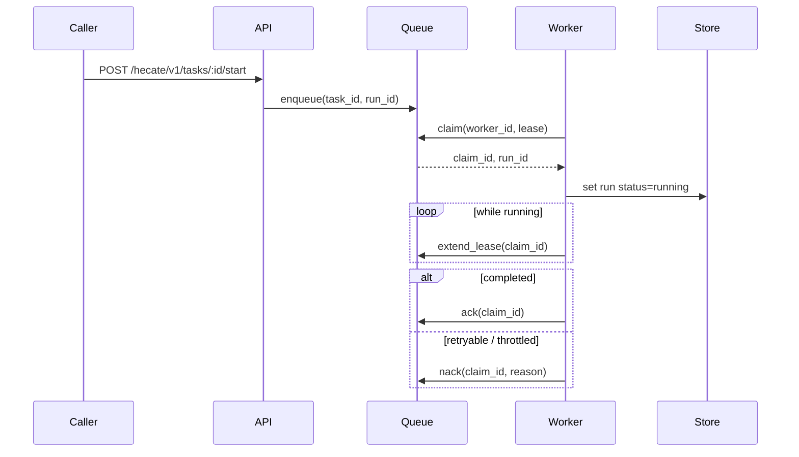

# Runtime API Notes

Hecate exposes a coding-runtime API surface under `/hecate/v1/tasks` for client-orchestrated agents. The runtime is durable: a run survives process restarts, can be resumed from a terminal state, and is leased to one worker at a time so two replicas can share a queue without stepping on each other.

For the high-level execution flow (lease semantics, sandbox boundary, event sequence), see [`architecture.md`](../contributor/architecture.md#task-runtime-flow). For the LLM-driven `agent_loop` execution kind specifically (tools, approval gating, cost tracking, retry-from-turn semantics), see [`agent-runtime.md`](agent-runtime.md).

> Contributing here? Start at [`AGENTS.md`](../../AGENTS.md) for the codebase map and runtime invariants; conventions, workflow, and verification ladders live under [`docs-ai/`](../../docs-ai/README.md).

## API namespaces

Hecate serves three intentionally separate HTTP surfaces:

| Namespace      | Purpose                                                                                                                                                                                                                                                 |
| -------------- | ------------------------------------------------------------------------------------------------------------------------------------------------------------------------------------------------------------------------------------------------------- |
| `/v1/*`        | Provider-compatible protocol ingress. These paths stay OpenAI- or Anthropic-shaped so existing SDKs can point at Hecate without learning Hecate-specific URLs. Today that means `GET /v1/models`, `POST /v1/chat/completions`, and `POST /v1/messages`. |
| `/hecate/v1/*` | Hecate-native product API: tasks, Hecate Chat sessions, External Agent integrations, settings, usage, traces, events, and system operations. Operator UI, MCP tools, and Hecate-aware clients should use this namespace.                                |
| `/healthz`     | Unversioned process liveness for local scripts, desktop sidecars, and load balancers. It is intentionally tiny and not wrapped in the normal `{object,data}` API envelope.                                                                              |

OTLP collector/export endpoints keep their standard protocol paths
(`/v1/traces`, `/v1/metrics`, `/v1/logs`) when Hecate is configured to export to
an OpenTelemetry collector. Those are not Hecate product resources. Hecate's
local trace lookup for the operator UI is `GET /hecate/v1/traces`.

Set `HECATE_RUNTIME_TOKEN` to require Hecate-aware clients to send
`X-Hecate-Runtime-Token` on `/hecate/v1/*`. This protects the Hecate-native
control plane, including Hecate-native chat and task routes that can spend
configured provider credentials. It does not apply to provider-compatible
`/v1/*` paths or `/healthz`. The operator UI sends the header when
`hecate.runtimeToken` is present in `sessionStorage` or `localStorage`; the MCP
server reads the same value from its `HECATE_RUNTIME_TOKEN` environment.

Set `HECATE_INFERENCE_TOKEN` to require a shared token on the
provider-compatible inference routes: `GET /v1/models`,
`POST /v1/chat/completions`, and `POST /v1/messages`. Clients may send it as
either `Authorization: Bearer <token>` or `x-api-key: <token>`, so standard
OpenAI- and Anthropic-shaped SDK configuration continues to work. This token
does not wrap `/hecate/v1/*`, `/healthz`, static UI assets, or OTLP collector
paths such as `/v1/traces`, `/v1/metrics`, and `/v1/logs`. The operator UI
sends it to local provider-compatible paths when `hecate.inferenceToken` is
present in `sessionStorage` or `localStorage`.

When `HECATE_REMOTE_RUNTIME_MODE=1`, `/healthz` remains the unauthenticated
liveness probe and every other path requires trusted trusted proxy headers:
`X-Hecate-Remote-Runtime-Secret`, `X-Hecate-Remote-Actor-ID`,
`X-Hecate-Remote-Org-ID`, `X-Hecate-Remote-Project-ID`, and
`X-Hecate-Remote-Runtime-ID`. Valid remote identity is attached to request
context, exposed from `GET /hecate/v1/whoami` as `data.remote_identity`, added to
the top-level HTTP span attributes, and accepted in place of the local
runtime/inference shared tokens. Remote mode rejects local-only endpoints for
workspace picker/open, reset-data, shutdown, MCP probe, Cairnline sidecar
probe/connect/read/detail/coordination/assignment-context/launch-packet,
Cairnline sidecar lifecycle/write/setup/work/collaboration/memory/assistant
smokes, plugin-registry management, agent-adapter authenticate, and local
provider and MCP registry discovery. Hecate-native `/hecate/v1/*` routes are
explicitly classified for remote mode, and route coverage tests fail when a new
registered route is not marked remote-safe or local-only.

Remote mode disables local model providers by default. In that default posture,
local presets are omitted, `kind=local` provider creates/updates are rejected,
env-preconfigured local providers are skipped, and existing local provider rows
are not loaded into the runtime provider registry. Set
`HECATE_REMOTE_ALLOW_LOCAL_PROVIDERS=1` only for a private hosted runtime whose
local model server is intentionally inside that runtime's isolation boundary.
This provider policy is kind-based: Hecate blocks providers marked
`kind=local`, but does not URL-filter custom `kind=cloud` `base_url`
destinations. Operators should enforce egress and private-endpoint policy
outside the runtime when they need destination-level controls.

Legacy Hecate-native `/v1/*` and `/admin/*` paths are intentionally not kept as
compatibility shims in this alpha branch. Unknown API-shaped paths return 404
rather than falling through to the embedded UI shell.

## Error envelope

Hecate-native JSON errors use one stable envelope:

```json
{
  "error": {
    "type": "route_impossible",
    "message": "route request: no provider available",
    "user_message": "No configured provider can serve this request.",
    "operator_action": "Open Connections to inspect readiness checks, discover models, or enable a routable provider.",
    "request_id": "req_...",
    "trace_id": "..."
  }
}
```

- `type` is the stable machine code. Operator UI and automation should branch
  on this field, not raw text.
- `message` is the detailed gateway/runtime message. It may include provider or
  router wording.
- `user_message` is the short operator-facing summary.
- `operator_action` is the recommended next step.
- `request_id` and `trace_id` are included when the runtime has already created
  trace state. They mirror `X-Request-Id` / `X-Trace-Id` and let clients open
  `GET /hecate/v1/traces?request_id=...` directly from an error surface.
- Runtime-specific fields may be attached when they help repair the failure.
  Examples: `task_id`, `latest_run_id`, and `run_status` for a busy Hecate Chat
  task; `provider`, `model`, and `capabilities` for tool-capability failures;
  `limit_ms` / `turns_used` for session guardrails.

Common Hecate-native error types:

| Type                                   | Status | Meaning                                                                          |
| -------------------------------------- | -----: | -------------------------------------------------------------------------------- |
| `invalid_request`                      |    400 | Request JSON, query parameters, or required fields are invalid.                  |
| `not_found`                            |    404 | The requested Hecate resource does not exist.                                    |
| `conflict`                             |    409 | The resource changed state or the requested transition is not valid now.         |
| `gateway_error`                        |    500 | Hecate failed before it could classify the failure more specifically.            |
| `rate_limit_exceeded`                  |    429 | The local gateway rate limiter rejected the request.                             |
| `model_not_configured`                 |    422 | The selected model is stale or not currently reported by the selected provider.  |
| `chat.agent_session_busy`              |    409 | A Hecate Chat task-backed loop is queued, running, or awaiting approval.         |
| `chat.model_capability_required`       |    422 | A task-backed Hecate Chat turn was requested, but the model is not tool-capable. |
| `chat.workspace_required`              |    400 | Task-backed Hecate Chat or External Agent chat needs a workspace path.           |
| `chat.session_limit_exceeded`          |    422 | The chat turn limit was reached.                                                 |
| `chat.session_duration_limit_exceeded` |    422 | The chat wall-clock limit was reached.                                           |
| `chat.session_idle_timeout`            |    422 | The chat was idle beyond the configured timeout.                                 |

OpenAI-compatible and Anthropic-compatible ingress paths keep their protocol
shape, but gateway-classified failures also include the same
`user_message` / `operator_action` / correlation fields inside their `error`
object when available.

## Contents

- [API namespaces](#api-namespaces)
- [Error envelope](#error-envelope)
- [Core resources](#core-resources)
  - [Task fields](#task-fields)
  - [Run fields](#run-fields)
- [Lifecycle endpoints](#lifecycle-endpoints)
  - [Resume semantics](#resume-semantics)
  - [Retry-from-turn-N semantics](#retry-from-turn-n-semantics)
- [Execution detail endpoints](#execution-detail-endpoints)
- [Approval endpoints](#approval-endpoints)
  - [Approval kinds](#approval-kinds)
  - [Approval policy configuration](#approval-policy-configuration)
- [Event and stream endpoints](#event-and-stream-endpoints)
- [Queue execution model](#queue-execution-model)
- [Runtime backend and queue configuration](#runtime-backend-and-queue-configuration)
- [Usage endpoints](#usage-endpoints)
- [Health and discovery endpoints](#health-and-discovery-endpoints)
- [Plugin registry endpoints](#plugin-registry-endpoints)
- [Agent Preset endpoints](#agent-preset-endpoints)
- [Project endpoints](#project-endpoints)
- [Project Assistant endpoints](#project-assistant-endpoints)
- [Chat session endpoints](#chat-session-endpoints)
- [Rate-limit headers on chat / messages](#rate-limit-headers-on-chat--messages)

## Core resources

- `task`
- `task_run`
- `task_step`
- `task_artifact`
- `task_approval`
- `task_run_event`

### Task fields

The `task` resource accepts these fields on `POST /hecate/v1/tasks`:

- `execution_kind` — one of `shell`, `git`, `file`, `agent_loop`
- `prompt` — the user-facing prompt; required for `agent_loop`, optional description for the others
- `project_id` — optional owning project id. Empty / omitted creates an unprojected task; `GET /hecate/v1/tasks?project_id=` lists only unprojected tasks
- `system_prompt` — per-task agent prompt (narrowest of the three-layer composition); `agent_loop` only
- `shell_command` / `git_command` / `file_path` / `file_content` / `file_operation` — execution-kind-specific
- `working_directory` — absolute path; required when `workspace_mode=in_place`
- `workspace_mode` — `""` / `"persistent"` / `"ephemeral"` (clone behavior, default) or `"in_place"` (run directly in `working_directory`); see [`agent-runtime.md`](agent-runtime.md#workspace-modes)
- `repo` / `base_branch` — alternate source for the workspace clone
- `sandbox_allowed_root` / `sandbox_read_only` / `sandbox_network` — sandbox policy for shell / git / file kinds; see [`sandbox.md`](sandbox.md) for the full policy and isolation model
- `requested_provider` / `requested_model` — pin the LLM (`agent_loop`); empty falls back to gateway default
- `budget_micros_usd` — per-task cost ceiling in micro-USD; `0` disables
- `mcp_servers` — `agent_loop`-only array of external MCP server configs whose tools join the LLM's tool catalog under `mcp__<name>__<tool>` aliases. Each entry picks one transport (stdio: `command` + optional `args` / `env`; HTTP: `url` + optional `headers`), and may set `approval_policy` (`auto` / `require_approval` / `block`). Capped per-task by `HECATE_TASK_MAX_MCP_SERVERS_PER_TASK`. Full schema, secret handling, and lifecycle in [`mcp.md#hecate-as-mcp-client`](mcp.md#hecate-as-mcp-client).
- `priority` / `timeout_ms`

Task responses may also include `workspace_system_prompt_policy`. Empty /
omitted means the normal workspace `CLAUDE.md` / `AGENTS.md` prompt layer is
eligible. `exclude` means the runner skips that compatibility layer for the
task; native project assignments set this so Agent Preset context-source policy
controls any workspace-instruction body inclusion.

Task responses also include `work_item_id` and `assignment_id` when a
project-work assignment created the task. These fields are inspection links only
and do not replace the task's generic `origin_kind` / `origin_id` fields.

`execution_profile` applies task-create defaults:

| Profile        | Defaults                                                                                                                                                              |
| -------------- | --------------------------------------------------------------------------------------------------------------------------------------------------------------------- |
| `repo_local`   | `execution_kind=agent_loop`, `workspace_mode=persistent`, `working_directory=.`, `timeout_ms=120000`                                                                  |
| `coding_agent` | Same as `repo_local`, plus `timeout_ms=300000` and a coding-oriented system prompt that nudges the model toward read-before-edit and `file_edit` for targeted changes |

### Run fields

`task_run` carries the cost figures the operator UI surfaces:

- `project_id` / `work_item_id` / `assignment_id` — project inspection links
  snapped onto new runs from the parent task. Older alpha rows may still derive
  these links from the parent task or run context-packet refs when the run
  payload predates direct run linkage.
- `total_cost_micros_usd` — this run's LLM spend (after routing).
- `prior_cost_micros_usd` — cumulative spend of every prior run in this run's resume chain. Cumulative-across-task = `prior + total`.
- `model` / `provider` / `provider_kind` — what was actually used (after routing). May differ from the task's `requested_*` when the operator picked auto. Agent-loop runs preserve these fields for both streaming and non-streaming model turns.

## Lifecycle endpoints

- `POST /hecate/v1/tasks`
- `GET /hecate/v1/tasks` — optional `project_id` query scopes the list. Pass an empty value (`?project_id=`) for unprojected tasks only.
- `GET /hecate/v1/tasks/{id}`
- `DELETE /hecate/v1/tasks/{id}`
- `POST /hecate/v1/tasks/{id}/start` — returns `422 model_not_configured` when an `agent_loop` task has no `requested_model` set. No run is created.
- `POST /hecate/v1/tasks/{id}/runs/{run_id}/retry`
- `POST /hecate/v1/tasks/{id}/runs/{run_id}/resume`
- `POST /hecate/v1/tasks/{id}/runs/{run_id}/continue`
- `POST /hecate/v1/tasks/{id}/runs/{run_id}/retry-from-turn`
- `POST /hecate/v1/tasks/{id}/runs/{run_id}/cancel`

### Resume semantics

- resume is allowed when the source run is terminal (`completed`, `failed`, or `cancelled`)
- resume creates a new run attempt (new `run_id`) rather than mutating the original run
- the new run reuses the prior run workspace when available, so file state carries forward
- optional payload: `{"reason":"..."}` to annotate the resume request
- resumed executions include checkpoint context (source run id, last completed step, last event sequence) in step input so executors/tools can continue from the prior boundary
- for `agent_loop` runs, the saved `agent_conversation` artifact is hydrated as the starting message history — the loop continues from where it left off rather than re-running prior turns
- the new run inherits the chain's cumulative cost via `PriorCostMicrosUSD`, so the per-task ceiling holds across the full chain

### Continue semantics

`POST /hecate/v1/tasks/{id}/runs/{run_id}/continue` body:

```json
{ "prompt": "follow-up instruction" }
```

- only valid for terminal `agent_loop` runs that produced an `agent_conversation` artifact
- creates a new run for the same task, hydrates the source conversation, appends the supplied user prompt, then resumes the loop
- used by ACP/editor sessions where one editor conversation maps to one durable Hecate task and each user prompt becomes the next Hecate run
- returns 409 when the source run is still active, and 400 for non-agent tasks, empty prompts, or missing/malformed conversation artifacts

### Retry-from-turn-N semantics

`POST /hecate/v1/tasks/{id}/runs/{run_id}/retry-from-turn` body:

```json
{ "turn": 2, "reason": "explore alternative" }
```

- only valid on `agent_loop` runs that produced an `agent_conversation` artifact
- `turn` must be in `[1, count(assistant turns)]`; out-of-range turns return 400
- creates a new run whose conversation is truncated to right before the Nth assistant message; the LLM re-issues that turn from the prior context
- step indices on the new run restart at 1 (semantically a fresh run that happens to share prior context, not a continuation)
- see [`agent-runtime.md`](agent-runtime.md#retry-and-resume) for the full flow

## Execution detail endpoints

- `GET /hecate/v1/tasks/{id}/runs`
- `GET /hecate/v1/tasks/{id}/runs/{run_id}`
- `GET /hecate/v1/tasks/{id}/runs/{run_id}/context`
- `GET /hecate/v1/tasks/{id}/runs/{run_id}/steps`
- `GET /hecate/v1/tasks/{id}/runs/{run_id}/steps/{step_id}`
- `GET /hecate/v1/tasks/{id}/runs/{run_id}/artifacts`
- `GET /hecate/v1/tasks/{id}/runs/{run_id}/artifacts/{artifact_id}`
- `GET /hecate/v1/tasks/{id}/artifacts`
- `GET /hecate/v1/tasks/{id}/runs/{run_id}/patches`
- `GET /hecate/v1/tasks/{id}/runs/{run_id}/patches/{artifact_id}`
- `POST /hecate/v1/tasks/{id}/runs/{run_id}/patches/{artifact_id}/apply`
- `POST /hecate/v1/tasks/{id}/runs/{run_id}/patches/{artifact_id}/revert`

`patches` is a review-focused projection over `patch` artifacts. File-writing tools create patches with `status=applied`; `file_edit` and `apply_patch` can also create `status=proposed` patches when called with `propose=true`. The apply endpoint writes the proposed after-content only when the current file still matches the captured before-content, then emits `tool.file.applied`. The revert endpoint restores the before-content captured in Hecate's patch artifact and updates the patch to `status=reverted`. Before reverting, Hecate verifies that the current file still matches the artifact's after-content (or is still present/absent as expected for create/delete patches). If it drifted, the endpoint returns `409 Conflict`, leaves the workspace unchanged, and emits no `tool.file.reverted` event. Repeated reverts of an already-reverted patch are clean no-ops. Reverting a new-file patch removes the file. Reverting emits `tool.file.reverted` on the run-event stream.

Revert is also conflict-checked. Before touching the workspace, Hecate verifies
that the current file still matches the patch artifact's captured after-content.
If the operator or another agent changed or removed the file after the patch was
applied, revert returns `409 conflict`, leaves the workspace unchanged, and keeps
the patch artifact in `applied`.

`GET /hecate/v1/tasks/{id}/runs/{run_id}/context` returns the context packet
snapshot for a task run. Hecate first returns a run-owned packet when the run
persisted one directly, then falls back to a linked Hecate Chat assistant
message packet for task-backed chat runs. Native project-assignment starts now
persist a run-owned packet, and resume/retry chains carry the latest stored
packet forward onto the new run with updated task/run refs. Older or unrelated
runs can still return `404 not_found` when no stored or linked packet exists.

## Approval endpoints

- `GET /hecate/v1/tasks/{id}/approvals`
- `GET /hecate/v1/tasks/{id}/approvals/{approval_id}`
- `POST /hecate/v1/tasks/{id}/approvals/{approval_id}/resolve`

### Approval kinds

The `kind` field on a `task_approval` is one of:

- `shell_command` — pre-execution gate for `execution_kind=shell` tasks
- `git_exec` — pre-execution gate for `execution_kind=git` tasks
- `file_write` — pre-execution gate for `execution_kind=file` tasks
- `network_egress` — pre-execution gate when `sandbox_network=true`
- `agent_loop_tool_call` — mid-loop gate when an `agent_loop` run calls a gated tool (`shell_exec`, `http_request`, etc.). The reason text lists the tools the agent wants to use. See [`agent-runtime.md`](agent-runtime.md#approval-gating) for the full flow.

Resolve payload: `{"decision": "approve" | "reject", "note": "..."}`.

Approval resolution is owned by the task runtime so approval, run, task, step, and run-event state transition together:

- `approve` marks the pending approval `approved`, emits `approval.resolved`, requeues the same run (`queued`) and task (`queued`), and emits `run.queued`. For `agent_loop_tool_call`, the loop dispatches the approved tool calls without re-calling the LLM.
- `reject` marks the pending approval `rejected`, emits `approval.resolved`, and terminalizes the run/task as `cancelled` with `last_error: "approval rejected"`. Any awaiting approval step is cancelled, and the runtime emits `run.cancelled` and `task.updated`.
- Cancelling an `awaiting_approval` run cancels the run/task, cancels pending approvals with `resolved_by: "system"`, cancels the awaiting approval step, and emits the same terminal run/task events. Resolving that approval afterward returns `409 conflict`.
- Resolving a non-pending approval returns `409 conflict`; cancelling an already-terminal run is a no-op and returns the current terminal run.

### Approval policy configuration

`HECATE_TASK_APPROVAL_POLICIES` (default `shell_exec,git_exec,file_write`) is a comma-separated allowlist of which approval gates are active across the task runtime. It controls both pre-execution gates on `shell` / `git` / `file` tasks **and** mid-loop gates inside `agent_loop` runs — same env var, same names. Recognized values:

| Value            | Effect                                                                                                                                                                                                                                                                                                        |
| ---------------- | ------------------------------------------------------------------------------------------------------------------------------------------------------------------------------------------------------------------------------------------------------------------------------------------------------------- |
| `shell_exec`     | Gate `execution_kind=shell` task creates and `agent_loop` `shell_exec` tool calls.                                                                                                                                                                                                                            |
| `git_exec`       | Gate `execution_kind=git` task creates and `agent_loop` `git_exec` / `git_status` / `git_diff` tool calls.                                                                                                                                                                                                    |
| `file_write`     | Gate `execution_kind=file` task creates and `agent_loop` `file_write` / `file_edit` / `apply_patch` tool calls.                                                                                                                                                                                               |
| `network_egress` | Gate task creates that opt into `sandbox_network=true` and `agent_loop` `http_request` / configured `web_search` tool calls.                                                                                                                                                                                  |
| `read_file`      | Gate `agent_loop` `read_file` / `grep` / `glob` / `artifact_read` tool calls. Useful when operators want visibility into every file, search, or persisted artifact the agent reads, not just what it writes.                                                                                                  |
| `all_tools`      | Gate every agent tool call (`shell_exec`, `git_exec`, `git_status`, `git_diff`, `file_write`, `file_edit`, `apply_patch`, `read_file`, `grep`, `glob`, `artifact_read`, `list_dir`, `http_request`, `web_search`, `draft_project_proposal`) and all pre-execution task gates. Short-circuits to the full set. |

Unknown policy names are rejected at startup with a clear error. Empty value disables every gate (use only in trusted environments). For per-MCP-server gating in `agent_loop` runs, see `approval_policy` on `mcp_servers` entries in [`mcp.md#approval-policy`](mcp.md#approval-policy).

## Event and stream endpoints

### Per-run events

- `GET /hecate/v1/tasks/{id}/runs/{run_id}/events?after_sequence=<n>`
- `POST /hecate/v1/tasks/{id}/runs/{run_id}/events`
- `GET /hecate/v1/tasks/{id}/runs/{run_id}/stream?after_sequence=<n>`

The JSON list returns agent event protocol v1 envelopes:
`schema_version`, `event_id`, `task_id`, `run_id`, `sequence`,
`occurred_at`, `type`, and `data`.

Stream resume also supports `Last-Event-ID`. Each per-run SSE frame carries the
current run state, steps, artifacts, activity, and approvals scoped to that run
so the operator UI can drive approval banners and progress surfaces without a
separate refetch (`TaskRunStreamEventData.Approvals`). The frame's `event_type`
mirrors the persisted event that produced the state refresh.
The frame is a read-time projection over the append-only run-event log and live
run storage. When the stream emits a projected live snapshot without a newer
persisted event, the SSE `id` and `data.sequence` stay on the latest persisted
cursor instead of creating a new `run_event` row.

The frame also includes a normalized `activity` array for clients that want a
coding-agent-style timeline without reconstructing it from raw steps and
artifacts. Activity item types include `thinking`, `tool_call`, `patch`,
`changed_files`, `final_answer`, `project_assistant_proposal`, `approval`, and
`run_result`. Approval
activities carry `approval_id` and `needs_action` when a user decision is
pending. The operator UI uses this same array in both Task Detail and Hecate
Chat transcript projections; clients should treat it as the compact timeline
surface and use raw steps/artifacts/events only for deeper inspection. Task
Detail may expose the raw `TaskActivityItem` fields behind an advanced
disclosure, but Chats should favor the compact projection. For MCP Apps tool
calls, task-backed chat activities may include `mcp_app` with the captured
`ui://` resource URI, MIME type, HTML, resource/tool metadata, tool arguments,
and MCP `CallToolResult`; clients can render it inline or ignore it and fall
back to the normal text activity.

`mcp_app` is optional and appears only when Hecate could associate a tool call
with an MCP Apps HTML resource:

```json
{
  "resource_uri": "ui://weather/dashboard",
  "mime_type": "text/html;profile=mcp-app",
  "html": "<!doctype html>...",
  "html_truncated": false,
  "tool_name": "mcp__weather__get_weather",
  "tool_input": { "city": "Lisbon" },
  "tool_result": {
    "content": [{ "type": "text", "text": "72F" }],
    "structuredContent": { "temperature": "72F" }
  },
  "resource_meta": {
    "ui": {
      "csp": { "resourceDomains": ["https://cdn.example.com"] },
      "prefersBorder": true
    }
  },
  "tool_meta": {
    "ui": {
      "resourceUri": "ui://weather/dashboard",
      "visibility": ["model", "app"]
    }
  }
}
```

The operator UI renders the iframe directly in the assistant message body and
keeps the normal collapsed activity row below it as audit metadata. `ui://`
values are MCP resource identifiers, not browser URLs; clients that render apps
should treat `html` as the captured resource body and apply their own sandboxing
and CSP policy. If app resource capture fails, `error` may be present and `html`
may be absent.

### Public events feed

For external dashboards (Grafana, Slack notifiers, audit log shippers) that want one subscription instead of per-run polling:

- `GET /hecate/v1/events?event_type=<csv>&task_id=<id>&after_sequence=<n>&limit=<n>` — paginated JSON list with cursor-based pagination
- `GET /hecate/v1/events/stream?event_type=<csv>` — long-lived SSE feed; reconnect via `Last-Event-ID`

Both endpoints emit the same v1 event envelopes as the per-run event list.
Filters AND together; within a slice (`event_type` is comma-separated) the match
is OR. `after_sequence` is the event sequence cursor, strictly greater.

### Event types

The full catalog of event types — including payload shapes, when each fires, and per-event extras — lives in [`events.md`](events.md). Highlights:

- `run.*` lifecycle (`run.created` / `run.queued` / `run.started` / `run.finished` / `run.failed` / `run.cancelled`)
- typed `tool.*` events for in-run tool lifecycle detail
- `approval.requested` / `approval.resolved` for human-gating flows
- `turn.completed` for per-LLM-turn cost/tokens summaries in `agent_loop` runs
- `run.resumed_from_event` for resume / retry-from-turn chains

## Queue execution model

When a run is queued, workers consume it through a claim/lease protocol:

1. enqueue `task_id` + `run_id`
2. worker claims with a time-bound lease
3. worker heartbeats to extend lease while work is running
4. worker `ack`s on success/terminal handling or `nack`s to requeue
5. expired leases can be reclaimed by another worker



## Runtime backend and queue configuration

- `HECATE_BACKEND=memory|sqlite|postgres` controls all Hecate-owned durable state,
  including tasks, the task queue, projects, project memory, chats, usage
  events, and settings.
- `HECATE_PROJECTS_COORDINATION_BACKEND=hecate|cairnline` records the intended
  Projects coordination authority. The default is `hecate`. `cairnline` is an
  opt-in replacement-readiness setting only: Hecate-native stores remain
  authoritative until the feature-flagged Cairnline read/write adapter and
  migration path land. Use
  `GET /hecate/v1/projects/backend-status` to inspect the effective state.
- `HECATE_PROJECTS_CAIRNLINE_CONNECTOR=embedded|sidecar` chooses the Cairnline
  connector mode while `HECATE_PROJECTS_COORDINATION_BACKEND=cairnline`.
  `embedded` is the current replacement-readiness path: Hecate uses the
  embedded Cairnline Go package bridge and optional embedded mirror database.
  `sidecar` can start a standalone Cairnline MCP process through the
  local-only `sidecar-probe` endpoint, connect a cached client through
  `POST /hecate/v1/projects/cairnline/sidecar-connect`, or call read-only
  `projects.list` / `projects.get` through the `sidecar-read-smoke` and
  `sidecar-detail-smoke` endpoints. `sidecar-coordination-smoke` also calls
  the read-only portable coordination list tools and checks their typed
  `structuredContent` arrays. `sidecar-assignment-context-smoke` calls
  read-only `assignments.context`, and `sidecar-launch-packet-smoke` calls
  read-only `assignments.launch_packet`; both check typed MCP-pull assignment
  metadata. `sidecar-lifecycle-smoke` is the assignment mutation smoke: after
  `confirm_mutation=true`, it selects a compatible sidecar assignment through
  `assignments.next`, claims it, marks it running, reads its launch packet, and
  completes it in the standalone Cairnline sidecar database.
  `sidecar-write-smoke` is the project-identity mutation smoke: after
  `confirm_mutation=true`, it creates, lists, updates, reads, deletes, and
  verifies deletion of a temporary standalone Cairnline project.
  `sidecar-setup-smoke` is the project setup metadata mutation smoke: after
  `confirm_mutation=true`, it creates a temporary standalone Cairnline project,
  creates/updates/lists/deletes a root and context source, then deletes and
  verifies removal of the temporary project. `sidecar-work-smoke` is the
  project work coordination mutation smoke: after `confirm_mutation=true`, it
  creates a temporary standalone Cairnline project, role, work item, and queued
  MCP-pull assignment, verifies `assignments.context` and
  `assignments.launch_packet` for that assignment, then deletes and verifies
  removal of the temporary project. `sidecar-collaboration-smoke` is the
  collaboration mutation smoke: after `confirm_mutation=true`, it creates a
  temporary standalone Cairnline project, role/work/assignment scaffolding, then
  records and verifies artifact, evidence, review, and handoff metadata before
  deleting and verifying removal of the temporary project.
  `sidecar-memory-smoke` is the memory mutation smoke: after
  `confirm_mutation=true`, it creates and verifies an accepted memory entry,
  creates and promotes one memory candidate into accepted memory, rejects and
  deletes another candidate, then deletes and verifies removal of the temporary
  project. `sidecar-assistant-smoke` is the Project Assistant proposal/apply
  smoke: after `confirm_mutation=true`, it creates a temporary rootless
  standalone Cairnline project, creates and verifies an assistant proposal
  ledger record, applies it with explicit confirmation, verifies the created
  role/work/assignment side effects, then deletes and verifies removal of the
  temporary project. Live Projects writes still use Hecate-native stores in
  sidecar mode. Live project list/detail reads use Hecate-native stores unless
  `HECATE_PROJECTS_CAIRNLINE_READ_SOURCE=sidecar` is also set; setup-readiness,
  health, skills, memory, memory candidates, roles, work items, assignment
  lists, assignment context, launch-readiness, assignment preflight, artifact
  lists, handoff lists, Project Assistant context/proposal, project-chat
  prelude/context, activity, closeout readiness, and operations brief use the
  same sidecar source when it is configured.
- `HECATE_PROJECTS_CAIRNLINE_READ_SOURCE=auto|snapshot|embedded|sidecar` controls which
  Cairnline service backing configured read routes use while
  `HECATE_PROJECTS_COORDINATION_BACKEND=cairnline`. With
  `HECATE_PROJECTS_CAIRNLINE_CONNECTOR=embedded`, the default `auto` prefers the
  embedded mirror database under
  `{HECATE_DATA_DIR}/cairnline/embedded/projects.db` when it already contains
  the requested project or proposal record and otherwise falls back to the
  snapshot-seeded in-memory bridge. `snapshot` always uses the snapshot-seeded bridge.
  `embedded` is a strict replacement-readiness dogfood mode: configured read
  routes require a populated embedded mirror database and fail if the database
  or requested project row/proposal record is missing. Run
  `POST /hecate/v1/projects/cairnline/sync` first when testing strict embedded
  reads. Strict embedded project list/detail, setup-readiness, health, project
  skill list, project role list, work-item list/detail, assignment-list,
  assignment-context, launch-readiness, assignment preflight, activity,
  artifact-list, handoff-list, closeout-readiness, operations brief, project
  memory list, and memory-candidate list reads plus Project Assistant
  context/proposal reads use the embedded Cairnline project, skill, role,
  work-item, assignment, launch-packet, artifact, evidence, review, handoff,
  memory, and assistant proposal records directly instead of loading a Hecate
  snapshot first; other embedded read routes may still use Hecate snapshot
  scaffolding until their route families are cut over. With
  `HECATE_PROJECTS_CAIRNLINE_CONNECTOR=sidecar`, `sidecar` routes project
  list/detail, setup-readiness, health, project skill list, project memory list,
  memory-candidate list, project role list, work-item list/detail,
  assignment-list, assignment-context, launch-readiness, assignment preflight, artifact-list,
  handoff-list, Project Assistant context/proposal reads, project-chat
  prelude/context reads, activity, closeout-readiness, and operations-brief
  reads through the standalone Cairnline MCP client. Draft/propose/apply
  mutations remain Hecate-owned because write-authority switchpoints require
  `HECATE_PROJECTS_CAIRNLINE_CONNECTOR=embedded`.
- `HECATE_PROJECTS_CAIRNLINE_WRITE_AUTHORITY=none|all-portable|project-memory|project-memory,memory-candidates|project-collaboration|project-skills|project-roles|project-work-items|project-assignments|project-metadata-defaults|project-roots|project-context-sources|project-identity|project-assistant-proposals`
  controls alpha Cairnline write-authority switchpoints while
  `HECATE_PROJECTS_COORDINATION_BACKEND=cairnline` and
  `HECATE_PROJECTS_CAIRNLINE_CONNECTOR=embedded`. The default is `none`.
  `all-portable` expands to every current portable write-authority switchpoint
  for dogfooding; it does not make Hecate runtime side effects or migration
  cutover Cairnline-owned.
  `project-memory` makes accepted project memory entry create/update/delete
  commit to the embedded Cairnline database first and then best-effort shadow
  the row back into Hecate-native memory stores. The route can validate project
  identity from the embedded Cairnline graph and does not require a matching
  Hecate-native compatibility project row. `memory-candidates` requires
  `project-memory`; together they make reviewable memory-candidate
  create/promote/reject mutations Cairnline-first too, with candidate promotion
  creating accepted memory through Cairnline before shadowing the candidate and
  promoted memory row back into Hecate-native stores; candidate routes use the
  same Cairnline project-identity validation. `project-collaboration`
  makes collaboration artifact creation plus handoff create/update/status/delete
  mutations Cairnline-first, then best-effort shadows those portable records
  back into Hecate-native stores. `project-skills` makes project skill
  discovery/update mutations Cairnline-first for metadata-only skill records,
  then best-effort shadows those records back into Hecate-native project-skill
  stores. Skill authority can validate project identity, roots, and context
  sources from the embedded Cairnline graph and does not require a matching
  Hecate-native compatibility project row; it still does not load, inject,
  execute, or grant permissions from `SKILL.md` bodies. `project-roles` makes custom role
  create/update/delete mutations Cairnline-first, preserves built-in role
  protection, and keeps historical assignments that still reference deleted
  role ids. `project-work-items` makes work-item
  create/update/delete mutations Cairnline-first, while preserving Hecate's
  `backlog` default and closeout-readiness gate before shadowing the resulting
  work item back into Hecate-native project-work stores. `project-assignments`
  makes assignment create/update/delete record mutations Cairnline-first, then
  best-effort shadows portable assignment state back into Hecate-native
  project-work stores for compatibility when that store is configured.
  Assignment execution refs, context packets, and launch timestamps are
  preserved in Hecate's separate project assignment runtime overlay even when no
  native compatibility assignment row exists. Assignment start/dispatch remains
  Hecate-owned and writes that runtime overlay before any compatibility shadow
  or replacement-evidence mirror. `project-metadata-defaults` makes project metadata/default-only
  PATCHes Cairnline-first, then shadows Hecate's compatibility project row;
  project create/delete, roots, context sources, last-opened-only updates, and
  mixed metadata/root/source replacement PATCHes remain Hecate-owned.
  `project-assistant-proposals` makes Project Assistant draft/propose/apply-attempt
  ledger records Cairnline-first, then best-effort shadows Hecate's proposal
  store for compatibility; armed embedded replacement mode skips those native
  proposal compatibility shadows. Confirmed Project Assistant apply uses enabled
  project create, project metadata/default, root,
  role/work-item/assignment/handoff, and memory-candidate authority seams and
  can use a Cairnline-only project graph for project
  identity/metadata/default/root actions in strict embedded mode. Remaining
  chat/runtime effects stay Hecate-owned orchestrator capabilities outside
  Cairnline core.
  `project-roots` makes project root create/update/delete plus root list
  replacement plus discovery-result replacement and worktree-created root
  record mutations Cairnline-first, then shadows Hecate's compatibility project
  row; Hecate still performs the root discovery scan and Git worktree creation
  side effect. In root authority mode, discovery and worktree-created root
  record mutations can resolve project identity and roots from the embedded
  Cairnline graph without a Hecate-native compatibility project row.
  `project-context-sources` makes context-source create/update/delete plus
  context-source list replacement and discovery-result replacement
  Cairnline-first, then shadows Hecate's compatibility project row; Hecate
  still performs the workspace scan for its operator UI. In source authority
  mode, context-source discovery can use project identity, roots, and existing
  sources from the embedded Cairnline graph without a Hecate-native
  compatibility project row.
  `project-identity` makes project create/delete commit portable identity,
  initial roots, context sources, launch defaults, and project identity removal
  to Cairnline first, then best-effort shadows Hecate's compatibility project
  row. Delete restores the Cairnline snapshot if Hecate compatibility cleanup
  fails. All other Projects mutations remain Hecate-owned.
- `HECATE_PROJECTS_CAIRNLINE_REPLACEMENT_MODE=disabled|embedded` is the
  explicit cutover-mode arm. The default is `disabled`. `embedded` is accepted
  only with `HECATE_PROJECTS_COORDINATION_BACKEND=cairnline`,
  `HECATE_PROJECTS_CAIRNLINE_CONNECTOR=embedded`, and
  `HECATE_PROJECTS_CAIRNLINE_READ_SOURCE=embedded`. It does not bypass read,
  write-authority, strict embedded smoke, migration, rollback, or Hecate-owned
  runtime side-effect gates; backend status reports the mode as an explicit
  replacement gate so operators can distinguish "all portable writes are
  Cairnline-first" from "the embedded replacement contract is armed."
- `HECATE_PROJECTS_CAIRNLINE_SIDECAR_COMMAND`, `HECATE_PROJECTS_CAIRNLINE_SIDECAR_ARGS`,
  `HECATE_PROJECTS_CAIRNLINE_SIDECAR_DB`, and
  `HECATE_PROJECTS_CAIRNLINE_SIDECAR_PROBE_TIMEOUT` configure the standalone
  Cairnline MCP probe/connect surfaces. The default command is `cairnline`; the
  default timeout is `10s`. If sidecar args are empty and a database path is
  configured, Hecate appends `-db <path>` for the probe/connect command.
  Relative database paths resolve under `HECATE_DATA_DIR` when set, otherwise
  under `.data`.
- `HECATE_POSTGRES_URL=postgres://...` or `DATABASE_URL=postgres://...` is
  required when `HECATE_BACKEND=postgres`. Optional Postgres knobs:
  `HECATE_POSTGRES_TABLE_PREFIX`, `HECATE_POSTGRES_MAX_OPEN_CONNS`, and
  `HECATE_POSTGRES_MAX_IDLE_CONNS`.
- `HECATE_TASK_QUEUE_WORKERS=<int>`
- `HECATE_TASK_QUEUE_BUFFER=<int>`
- `HECATE_TASK_QUEUE_LEASE_SECONDS=<int>`
- `HECATE_TASK_MAX_CONCURRENT_PER_TENANT=<int>` (`0` disables the limit)
- `HECATE_TASK_RECONCILE_INTERVAL=<duration>` (default `30s`; Go duration string — e.g. `"1m"`; how often the periodic reconciler scans for stalled runs; runs stuck in `running` longer than 3× `HECATE_TASK_QUEUE_LEASE_SECONDS` are automatically re-queued and emit `gap.run_disconnected` with `reason=worker_lease_expired`)
- `HECATE_TASK_MAX_MCP_SERVERS_PER_TASK=<int>` (default `16`; caps `mcp_servers` entries on `agent_loop` task creates; `0` disables the check)
- `HECATE_TASK_MCP_CLIENT_CACHE_MAX_ENTRIES=<int>` (default `256`; soft cap on the gateway-wide MCP client cache; LRU-idle eviction kicks in at the cap, with fail-open when every entry is in use)
- `HECATE_TASK_MCP_CLIENT_CACHE_PING_INTERVAL=<duration>` (default `60s`; how often the cache pings each idle cached upstream to detect wedged subprocesses; `0` disables the proactive health check, leaving only reactive eviction in `Pool.Call`)
- `HECATE_TASK_MCP_CLIENT_CACHE_PING_TIMEOUT=<duration>` (default `5s`; per-ping deadline; failure or timeout evicts the entry)

When `HECATE_BACKEND=sqlite` or `postgres`,
tasks/runs/steps/approvals/artifacts/run-events are persisted and the stream
replay cursor is durable across restarts. Workers claim queue items with
renewable leases, so pending runs survive process restarts and can be recovered
when a lease expires.

For `agent_loop`-specific knobs (max turns, system-prompt layers, HTTP policy for the `http_request` tool, and optional native `web_search`), see [`agent-runtime.md`](agent-runtime.md#configuration-knobs).

`GET /hecate/v1/system/stats` also reports queue health fields including queue depth, queue capacity, worker count, and `queue_backend`.

The response also surfaces `agent_adapter_approval_mode` — the configured mode for the external-agent approval coordinator: `"auto"`, `"prompt"`, or `"deny"`. Operators surface a danger banner in the UI when this is `"auto"` since every agent `RequestPermission` is permitted without review. Empty when the gateway was built without an approval coordinator (legacy configs / test fixtures).

The same payload includes `rtk_available` and optional `rtk_path` so the UI can offer the per-chat **Compact command output** toggle only when the optional `rtk` helper is installed in the gateway process `PATH`. Hecate never enables RTK automatically; new chats default to compact output off.

`GET /hecate/v1/system/mcp/cache` returns a snapshot of the shared MCP client cache:

```json
{
  "object": "mcp_cache_stats",
  "data": {
    "checked_at": "2026-04-29T01:00:00.123Z",
    "configured": true,
    "entries": 4,
    "in_use": 1,
    "idle": 3
  }
}
```

`configured: false` means no cache is wired (the deploy explicitly disabled it via `Handler.SetMCPClientCache(nil)`); the counter fields are present but zero so operator UIs can render a "no cache" cell instead of error-handling. `in_use` is the **sum** of refcounts across all entries (an entry held by two concurrent runs counts as 2), not the number of entries with at least one acquirer; `idle` is the count of entries with refcount=0. See [`mcp.md`](mcp.md#lifecycle-and-caching) for the underlying contract.

`GET /hecate/v1/mcp/registry/servers` searches an MCP Registry server list. It defaults to the official registry at `https://registry.modelcontextprotocol.io`; pass `registry_url` to target a private registry. Supported query parameters mirror the read-only registry API: `search`, `cursor`, `limit` (default 30, capped at 100), `updated_since` (RFC3339), `version`, and `include_deleted`. The endpoint is local-only: non-loopback sockets and forwarded-client headers are rejected before the outbound registry request.

```json
GET /hecate/v1/mcp/registry/servers?search=weather&limit=10

→ 200
{
  "object": "mcp_registry_servers",
  "data": {
    "registry_url": "https://registry.modelcontextprotocol.io",
    "servers": [
      {
        "server": {
          "name": "io.github/example/weather",
          "title": "Weather",
          "description": "Forecasts",
          "version": "1.0.0",
          "remotes": [
            {
              "type": "streamable-http",
              "url": "https://weather.example/mcp",
              "headers": [
                {"name": "Authorization", "isRequired": true, "isSecret": true}
              ]
            }
          ],
          "packages": [
            {
              "registryType": "npm",
              "identifier": "@example/weather",
              "runtimeHint": "npx",
              "transport": {"type": "stdio"}
            }
          ],
          "_meta": {"publisher": "example"}
        },
        "_meta": {"rank": 1},
        "install_hints": [
          {
            "source": "remote",
            "transport": "streamable-http",
            "supported": true,
            "url": "https://weather.example/mcp",
            "required_secrets": ["MCP_AUTHORIZATION"],
            "hecate_config": {
              "name": "weather",
              "url": "https://weather.example/mcp",
              "headers": {"Authorization": "$MCP_AUTHORIZATION"}
            }
          },
          {
            "source": "package",
            "transport": "stdio",
            "supported": false,
            "registry_type": "npm",
            "identifier": "@example/weather",
            "runtime_hint": "npx",
            "unsupported_reason": "package entries require an operator-chosen local runtime command before Hecate can probe them"
          }
        ]
      }
    ],
    "next_cursor": "cursor-2",
    "count": 1
  }
}
```

Registry discovery does not install packages, spawn servers, or call `tools/list`; it only returns catalog metadata and Hecate-specific connection hints. Use `POST /hecate/v1/mcp/probe` on a selected config to inspect the live tool catalog before committing it to a task.

`POST /hecate/v1/mcp/probe` is the dry-run discovery surface for an MCP server config. It accepts a single MCP server entry (same shape as one item in the task-create `mcp_servers` array — `name` defaults to `probe` when omitted), brings the server up the way an `agent_loop` run would (same secret resolution, same uncached spawn path), calls `tools/list`, and tears it down. Returns the upstream's tool catalog so operators can confirm the config before committing it to a task. The endpoint is local-only: non-loopback sockets and forwarded-client headers are rejected before command handling.

```json
POST /hecate/v1/mcp/probe
{
  "command": "bunx",
  "args": ["--bun", "@modelcontextprotocol/server-filesystem", "/workspace"]
}

→ 200
{
  "object": "mcp_probe",
  "data": {
    "tools": [
      {
        "name": "get_weather",
        "description": "...",
        "input_schema": {...},
        "_meta": {
          "ui": {
            "resourceUri": "ui://weather/dashboard",
            "visibility": ["model", "app"]
          }
        },
        "ui_resource_uri": "ui://weather/dashboard",
        "ui_visibility": ["model", "app"],
        "model_visible": true
      },
      {
        "name": "refresh_dashboard",
        "input_schema": {...},
        "_meta": {
          "ui": {
            "resourceUri": "ui://weather/dashboard",
            "visibility": ["app"]
          }
        },
        "ui_resource_uri": "ui://weather/dashboard",
        "ui_visibility": ["app"],
        "model_visible": false
      }
    ]
  }
}
```

Tool names come back un-namespaced — the operator wants to see what the upstream itself calls them, not the gateway's runtime alias. MCP Apps metadata is preserved when present: `_meta` is the raw upstream object, `ui_resource_uri` and `ui_visibility` are derived convenience fields, and `model_visible: false` means the tool is app-only and will not be shown to the agent-loop model. Bounded by a 10-second deadline; a stuck upstream surfaces as a 400 with the diagnostic rather than wedging the request.

`POST /hecate/v1/system/reset-data` resets local operator state without restarting the gateway. It deletes chat sessions, projects, project memory entries and candidates, project work-coordination rows, Hecate-owned project assignment runtime overlays, plugin registry records, Agent Preset rows, tasks, configured providers, policy rules, and saved external-agent approval grants. Chat sessions are deleted through the normal chat-delete path first, so live external-agent sessions are asked to delete their native ACP session before their rows disappear. If an adapter does not support `session/delete`, Hecate falls back to `session/close` and still tears down the owned process. When SQLite or Postgres is configured, it then clears remaining Hecate-prefixed database table rows while preserving schemas. It also removes the embedded Cairnline mirror database files under the Hecate data directory so replacement-readiness mirrors cannot resurrect stale project state after reset. Workspace files and external CLI auth files are not touched. The endpoint is local-only and blocked in remote runtime mode: non-loopback sockets and forwarded-client headers are rejected.

```json
→ 200
{
  "object": "system_reset",
  "data": {
    "projects_deleted": 1,
    "project_work_rows_deleted": 3,
    "project_runtime_rows_deleted": 1,
    "plugins_deleted": 1,
    "agent_profiles_deleted": 1,
    "chat_sessions_deleted": 2,
    "tasks_deleted": 1,
    "providers_deleted": 1,
    "policy_rules_deleted": 1,
    "agent_approval_grants_deleted": 1,
    "database_rows_deleted": 8,
    "cairnline_mirror_files_deleted": 1
  }
}
```

If a running chat does not settle before the bounded close wait, or a standalone task still has an active run, the endpoint returns `409 conflict`; retry after the chat finishes cancelling or cancel the active task first.

`POST /hecate/v1/system/shutdown` requests an orderly process shutdown. The desktop app uses this from its window-close confirmation flow so the gateway runs the same drain path `SIGINT`/`SIGTERM` take (retention cancel, runner drain — including MCP subprocess teardown, then HTTP server shutdown) instead of being SIGKILL'd by the child-process handle. Empty body, returns `202` and an `object: "system_shutdown"` ack; the signal fires asynchronously after a short delay so the response can flush before the listener tears down. Clients that need to observe the gateway actually exiting should poll `/healthz` until it stops responding (the desktop app uses a 12-second deadline). The endpoint is local-only: non-loopback sockets and forwarded-client headers are rejected.

The shipped `cmd/hecate` binary wires `Handler.SetQuitFunc` unconditionally, so the endpoint is available in every standard deployment (Tauri sidecar, Docker, systemd) from the gateway's local network namespace. In Docker, call it from inside the container or use the normal orchestrator stop path (`docker stop`, Compose, systemd, Kubernetes); requests through a published port usually arrive from a non-loopback bridge address and are rejected. Returns `503` with `error.code = "gateway_error"` when the endpoint is not wired; this path is reached only by test harnesses or custom embedders that build a `Handler` without calling `SetQuitFunc`.

## Usage endpoints

Hecate records usage for operator visibility, not global spend enforcement.
Cloud-provider calls may include measured tokens and known or provider-reported
cost. Local-provider rows are still recorded as usage events, but the Usage UI
hides them from the cloud-spend table because they do not consume cloud-provider
tokens. External-agent usage remains agent-reported and is surfaced on chat
messages when the agent provides it.

### `GET /hecate/v1/usage/summary`

Returns the cumulative known/reported spend for a usage bucket. In the local
single-operator shape, clients usually call this without query parameters and
read the global bucket.

Query parameters:

| Name       | Meaning                                                                   |
| ---------- | ------------------------------------------------------------------------- |
| `scope`    | `global` (default) or `provider`. Unknown values fall back to `global`.   |
| `provider` | Provider id when `scope=provider`.                                        |
| `key`      | Explicit internal usage key. Intended for diagnostics, not normal UI use. |

```json
GET /hecate/v1/usage/summary
→ 200
{
  "object": "usage_summary",
  "data": {
    "key": "global",
    "scope": "global",
    "backend": "sqlite",
    "used_micros_usd": 1600,
    "used_usd": "$0.001600"
  }
}
```

### `GET /hecate/v1/usage/events`

Returns recent append-only usage rows, newest first. The UI uses these rows to
show cloud-provider tokens and known/reported cost. The endpoint is intentionally
read-only.

Query parameters:

| Name    | Meaning                                                                 |
| ------- | ----------------------------------------------------------------------- |
| `limit` | Maximum rows to return. Defaults to the configured usage history limit. |

```json
GET /hecate/v1/usage/events?limit=20
→ 200
{
  "object": "usage_events",
  "data": [
    {
      "type": "usage",
      "scope": "provider",
      "provider": "openai",
      "model": "gpt-5.4-mini",
      "request_id": "req_...",
      "amount_micros_usd": 1600,
      "amount_usd": "$0.001600",
      "prompt_tokens": 920,
      "completion_tokens": 280,
      "total_tokens": 1200,
      "timestamp": "2026-05-14T10:00:00Z"
    }
  ]
}
```

## Health and discovery endpoints

### `GET /healthz`

Liveness probe. Returns `200` with the gateway's current time and version. Suitable for sidecar health checks, Kubernetes `livenessProbe` / `readinessProbe`, and Docker Compose `healthcheck`.

```json
GET /healthz
→ 200
{
  "status": "ok",
  "time": "2026-04-29T12:34:56Z",
  "version": "0.0.0-dev"
}
```

The endpoint is intentionally cheap: it doesn't touch the database, providers, or queue. A `200` here means "the process is up and serving HTTP," not "every backend is healthy." For deeper signal use `GET /hecate/v1/system/stats`.

### `GET /hecate/v1/providers/presets`

Provider catalog the UI's task-create form uses to render the provider picker. Each entry carries the operator-facing display name, the kind (`cloud` / `local`), the protocol Hecate speaks to it, the `BASE_URL` / `API_KEY` env-var pattern (so the UI can show which `PROVIDER_<NAME>_*` variables to set), and a short `env_snippet` ready to paste into `.env`.

```json
GET /hecate/v1/providers/presets
→ 200
{
  "object": "provider_presets",
  "data": [
    {
      "id": "openai",
      "name": "OpenAI",
      "kind": "cloud",
      "protocol": "openai",
      "base_url": "https://api.openai.com/v1",
      "api_key_env": "OPENAI_API_KEY",
      "docs_url": "https://platform.openai.com/docs",
      "description": "OpenAI's Responses + Chat Completions API.",
      "env_snippet": "OPENAI_API_KEY=your_api_key_here"
    },
    ...
  ]
}
```

The list is built from `config.BuiltInProviders()` — see [`docs/operator/providers.md`](../operator/providers.md) for the full catalog and OpenAI-compatible custom-endpoint flow.

### `GET /hecate/v1/providers/status`

Runtime provider readiness snapshot. The UI uses this endpoint to explain
whether a configured provider can receive traffic right now and why it may be
skipped by routing.

Pass `refresh=true` or `refresh=1` when the operator explicitly asks to
refresh provider discovery. Normal reads keep using the provider capability
cache; explicit refresh bypasses the completed cache while still sharing any
same-provider discovery request already in flight.

```json
GET /hecate/v1/providers/status
→ 200
{
  "object": "provider_status",
  "data": [
    {
      "name": "ollama",
      "kind": "local",
      "status": "healthy",
      "healthy": true,
      "base_url": "http://127.0.0.1:11434/v1",
      "models": ["llama3.1:8b"],
      "model_count": 1,
      "credential_state": "not_required",
      "credential_ready": true,
      "routing_ready": true,
      "readiness": {
        "status": "ok",
        "reason": "ready",
        "message": "Provider \"ollama\" is ready for routing."
      },
      "readiness_checks": [
        {
          "name": "credentials",
          "status": "ok",
          "reason": "not_required",
          "message": "No credentials are required for this provider."
        },
        {
          "name": "models",
          "status": "ok",
          "reason": "models_discovered",
          "message": "1 model discovered."
        },
        {
          "name": "health",
          "status": "ok",
          "reason": "healthy",
          "message": "Provider health checks are passing."
        },
        {
          "name": "routing",
          "status": "ok",
          "reason": "routable",
          "message": "Provider is eligible for routing."
        }
      ]
    }
  ]
}
```

`readiness` is the compact provider-level answer for cards and tables:
`status` is `ok`, `warning`, `blocked`, or `unknown`; `reason` is stable enough
for UI branching; `message` is safe to show directly to the operator; and
`operator_action` appears when there is a repair step.

`readiness_checks` is the canonical operator-facing checklist. It prevents
clients from guessing readiness by combining unrelated raw fields. Check names
are currently `credentials`, `models`, `health`, and `routing`; statuses use the
same `ok` / `warning` / `blocked` / `unknown` set. `reason` is stable enough for
UI branching, while `message` is safe to show directly to the operator.
When a check needs operator action, `operator_action` carries the canonical
repair step; clients should prefer it over deriving their own copy from
`reason`. For example `credential_missing` includes "add or rotate
credentials", `no_models` includes "start the provider and load at least one
model", and `provider_rate_limited` includes "wait for cooldown or route
elsewhere".

`routing_ready=false` means the router currently skips the provider. The
matching `routing_blocked_reason` and the `reason` on the
`readiness_checks[]` item whose `name` is `routing` use the same vocabulary as
route diagnostics: `credential_missing`, `provider_disabled`,
`provider_rate_limited`, `circuit_open`, `provider_unhealthy`, and `no_models`.
Other checks use reason values scoped to that check, such as
`default_model_only` for model-discovery fallback, `discovery_failed` when the
provider could not return a model list, `self_referential` when a provider URL
points back to Hecate, `provider_slow` when a latency-degraded provider remains
routable, or `not_required` for local providers that do not need credentials.

The trace inspector reuses the same vocabulary in route candidates. A selected
candidate is paired with the route reason (`requested_model`, `pinned_provider`,
`provider_default_model`, etc.); skipped candidates carry `skip_reason` values
such as `policy_denied`, `provider_rate_limited`,
`provider_less_stable`, or `provider_unavailable`. This keeps the operator
debugging path consistent: Connections explains whether a route is possible now,
and Observability explains how a specific request moved through the candidates.

### `GET /hecate/v1/settings/providers/local-discovery`

Advisory discovery for the Connections view's **Add provider → Local** catalog.
The gateway checks whether the expected provider command is on `PATH` and
probes each unique default local endpoint once. Shared endpoints, such as the
`llama.cpp` / `LocalAI` default `127.0.0.1:8080/v1`, are only called once and
then reused for every matching preset card.

This endpoint is local-only and returns `403` in remote runtime mode. Hosted
runtimes also disable local provider presets and `kind=local` providers unless
launched with `HECATE_REMOTE_ALLOW_LOCAL_PROVIDERS=1`.

```json
GET /hecate/v1/settings/providers/local-discovery
→ 200
{
  "object": "local_provider_discovery",
  "data": [
    {
      "preset_id": "ollama",
      "name": "Ollama",
      "base_url": "http://127.0.0.1:11434/v1",
      "probe_url": "http://127.0.0.1:11434/api/tags",
      "status": "running",
      "command": "ollama",
      "command_available": true,
      "command_path": "/opt/homebrew/bin/ollama",
      "http_available": true,
      "model_count": 2,
      "models": ["llama3.1:8b", "qwen2.5:7b"]
    }
  ]
}
```

`status` is one of:

- `running` — the HTTP probe returned 2xx.
- `installed` — the command is present on `PATH`, but the default HTTP
  endpoint did not respond.
- `not_detected` — neither the command nor the default HTTP endpoint was found.

This endpoint does not create or mutate provider records. It is a UX helper for
the picker and is local-only: non-loopback sockets, forwarded-client headers,
and remote runtime mode are rejected. Routing readiness still comes from
`GET /hecate/v1/providers/status` after the operator adds a provider.

### `GET /v1/models`

Lists models currently known to configured providers. Each row includes Hecate
metadata under `metadata`, including the effective model capability snapshot
used by the Chats target picker.

Pass `refresh=true` or `refresh=1` for an explicit operator refresh. Without
that query parameter, the endpoint keeps normal provider discovery cache
behavior.

```json
GET /v1/models
→ 200
{
  "object": "list",
  "data": [
    {
      "id": "qwen2.5-coder",
      "object": "model",
      "owned_by": "ollama",
      "metadata": {
        "provider": "ollama",
        "provider_kind": "local",
        "default": false,
        "discovery_source": "provider",
        "capabilities": {
          "tool_calling": "unknown",
          "streaming": true,
          "max_context_tokens": 32768,
          "source": "provider"
        },
        "readiness": {
          "provider": "ollama",
          "matched_provider": "ollama",
          "model": "qwen2.5-coder",
          "ready": true,
          "status": "ok",
          "reason": "model_available",
          "message": "Provider \"ollama\" reports model \"qwen2.5-coder\".",
          "routing_ready": true,
          "provider_status": "healthy"
        }
      }
    }
  ]
}
```

`capabilities.tool_calling` is one of `unknown`, `none`, `basic`, or
`parallel`. Task-backed Hecate Chat requires a known tool-capable value
(`basic` or `parallel`). When tools are on but the selected model is
`unknown` or `none`, the operator UI keeps normal chat available by sending the
turn as direct model chat and showing a compact capability hint. Local/custom
OpenAI-compatible providers often report `unknown`; Ollama models are enriched
from the native `/api/show` capability list when available. Tool usage is a
per-chat setting; model capability metadata is observed from provider/catalog
data rather than edited globally.

`metadata.readiness` is the backend-owned provider/model readiness snapshot for
that discovered row. Chats should use it before sending instead of inferring
routability from model names alone: a model can appear in discovery while its
provider is credential-blocked, circuit-open, disabled, or otherwise not
routable. When `ready=false`, show `message` and `operator_action` directly and
use `reason`, `provider_status`, `provider_blocked_reason`, and
`suggested_models` for compact diagnostics.

### `GET /hecate/v1/agent-adapters`

External coding-agent catalog. This is the first discovery surface for
External Agent chats: it reports the agent runtimes Hecate knows how to
supervise and whether their command can be found. This endpoint is deliberately
cheap so the app can render startup state without spawning coding-agent CLIs.
Use `POST /hecate/v1/agent-adapters/{id}/probe` for live version, auth,
capability, and launch-control discovery.

```json
GET /hecate/v1/agent-adapters
→ 200
{
  "object": "agent_adapters",
  "data": [
    {
      "id": "codex",
      "name": "Codex",
      "kind": "acp",
      "command": "codex-acp-adapter",
      "available": true,
      "status": "available",
      "path": "/Users/alice/.local/bin/codex-acp-adapter",
      "cost_mode": "external",
      "supported_range": ">=0.1.0",
      "version_outside_range": false,
      "supports_authenticate": true,
      "supports_logout": true,
      "auth_status": "unknown",
      "capabilities": [
        {
          "id": "prompt_session",
          "name": "sessions",
          "status": "supported"
        },
        {
          "id": "permissions",
          "name": "permissions",
          "status": "supported"
        },
        {
          "id": "terminal_rpc",
          "name": "terminal RPC",
          "status": "operator_opt_in"
        }
      ],
      "credential_modes": [
        {
          "id": "local_login",
          "name": "Local CLI login",
          "remote_allowed": false
        },
        {
          "id": "api_key",
          "name": "API key",
          "remote_allowed": true,
          "env_keys": ["OPENAI_API_KEY", "CODEX_API_KEY"]
        }
      ]
    },
    {
      "id": "grok_build",
      "name": "Grok Build",
      "kind": "acp",
      "command": "grok",
      "args": ["agent", "stdio"],
      "available": true,
      "status": "available",
      "path": "/Users/alice/.local/bin/grok",
      "cost_mode": "external",
      "docs_url": "https://docs.x.ai/build/cli/headless-scripting#acp",
      "supported_range": ">=0.1.0",
      "supports_authenticate": false,
      "supports_logout": false,
      "auth_status": "unknown"
    },
    {
      "id": "cursor_agent",
      "name": "Cursor Agent",
      "kind": "acp",
      "command": "cursor-agent",
      "args": ["acp"],
      "available": true,
      "status": "available",
      "path": "/Users/alice/.local/bin/cursor-agent",
      "cost_mode": "external",
      "supported_range": ">=0.1.0",
      "version_outside_range": false,
      "supports_authenticate": false,
      "supports_logout": false,
      "auth_status": "unknown"
    },
    {
      "id": "claude_code",
      "name": "Claude Code",
      "kind": "acp",
      "command": "claude-code-acp-adapter",
      "available": false,
      "status": "missing",
      "error": "exec: \"claude-code-acp-adapter\": executable file not found in $PATH",
      "cost_mode": "external",
      "supported_range": ">=0.1.0",
      "supports_authenticate": true,
      "supports_logout": true,
      "auth_status": "unknown",
      "capabilities": [
        {
          "id": "prompt_session",
          "name": "sessions",
          "status": "supported"
        },
        {
          "id": "permissions",
          "name": "permissions",
          "status": "supported"
        },
        {
          "id": "terminal_rpc",
          "name": "terminal RPC",
          "status": "operator_opt_in"
        }
      ],
      "claude_code_cli": {
        "available": true,
        "command": "/Users/alice/.local/bin/claude",
        "executable_path": "/Users/alice/.local/bin/claude"
      }
    }
  ]
}
```

`adapter_version` and `agent_version` are omitted from the catalog response.
They are populated by the explicit probe response after Hecate starts the ACP
adapter and runs the live diagnostics. `version_outside_range` remains `false`
until a probed version is known to fall outside `supported_range`.

`auth_status` is `unknown` on the cheap catalog path unless a dev or remote
runtime override can classify it without spawning a CLI. Use `POST
/hecate/v1/agent-adapters/{id}/probe` for the full ACP handshake and login /
billing classification.

`supports_authenticate` and `supports_logout` tell clients whether Hecate can
call ACP `authenticate` or `logout` for this adapter. UIs should use these
catalog fields instead of hard-coding adapter IDs; the actions are currently
enabled for the standalone Go Codex and Claude Code adapters.

`capabilities` is Hecate's catalog-level ACP contract for the row. It describes
the features Hecate knows how to supervise for that adapter family, such as
sessions, structured activity, cancellation, permission approvals, MCP server
handoff, config options, terminal callbacks, authenticate, and logout. Capability
`status` is one of:

| Status              | Meaning                                                                   |
| ------------------- | ------------------------------------------------------------------------- |
| `supported`         | Hecate supports the surface for this adapter family.                      |
| `adapter_dependent` | Hecate will use the surface only when the live ACP adapter advertises it. |
| `operator_opt_in`   | Hecate supports the surface only behind an explicit operator setting.     |
| `not_supported`     | Hecate should not show or invoke this surface.                            |

Probe results remain authoritative for live ACP Initialize features. For
example, a probed adapter can turn `supports_authenticate` or `supports_logout`
off even when the catalog expected them.

`credential_modes` describes how the adapter can authenticate. `local_login`
means operator-local CLI/browser login state and is not sufficient for remote
runtime requests by default. Remote runtime mode normally accepts only rows where
`remote_allowed=true` and one listed `env_keys` value is present in the runtime
environment. A single-user personal remote runtime may opt into runtime-local
login state with `HECATE_PERSONAL_REMOTE_EXTERNAL_AGENT_LOGINS=1`; then
`remote_credential_mode` may report `local_login`, but the `hecate_remote` build
tag still strips local-login modes entirely. In remote runtime mode, catalog rows
include `remote_credential_mode`, `remote_credential_ok`, and
`remote_credential_hint` when applicable; adapters without allowed credentials
are reported as `available=false`, `auth_status="unauthenticated"` before
Hecate attempts command discovery.

These are **external agents**, not model providers. They run ACP-compatible
coding agents under Hecate supervision; cost is reported as `external`
until an agent can supply structured usage.

ACP terminal callbacks are not advertised by default. Operators must set
`HECATE_AGENT_ADAPTER_TERMINALS=1` before External Agent sessions include
`clientCapabilities.terminal=true`; remote runtime mode also requires
`HECATE_REMOTE_ALLOW_ACP_TERMINALS=1`. Approved `terminal/create` requests are
scoped to the selected workspace and routed through the External Agent approval
coordinator before command spawn.

`config_options` are omitted from the catalog response. Hecate returns
launch-control options on explicit probe responses and prepared chat sessions,
where it is acceptable to run the adapter's help/model discovery or consume the
ACP session's own controls. Values prefixed with `__hecate_no_` are explicit
"not selected" sentinels. Some options are optional; launch-model options can
be required by the adapter definition and cause `400 chat.model_required` at
session creation until a real value is selected. Agent-owned ACP model state
appears on the prepared chat session and is updated with ACP
`session/set_model`.

### `POST /hecate/v1/agent-adapters/{id}/probe`

Re-runs discovery for one adapter, then performs the same end-to-end ACP probe
as `/health`. The response includes the fresh catalog row plus the health
result, so UIs can update a single Connections row after the operator logs in or
installs a missing dependency.

```json
POST /hecate/v1/agent-adapters/codex/probe
→ 200
{
  "object": "agent_adapter_probe",
  "data": {
    "adapter": {
      "id": "codex",
      "name": "Codex",
      "kind": "acp",
      "command": "codex-acp-adapter",
      "available": true,
      "status": "available",
      "supports_authenticate": true,
      "supports_logout": true,
      "auth_status": "ok"
    },
    "health": {
      "adapter_id": "codex",
      "status": "ready",
      "stage": "ready",
      "capabilities_known": true,
      "supports_authenticate": true,
      "supports_logout": true,
      "supports_load_session": true,
      "auth_methods": [
        {
          "id": "agent-login",
          "kind": "agent",
          "name": "Agent login"
        }
      ],
      "duration_ms": 412
    }
  }
}
```

Status codes:

- `200 OK` when the adapter id is registered; `health.status` carries
  `ready`, `not_installed`, `auth_required`, or `error`.
- `404 not_found` when the adapter id is not registered.

When ACP `Initialize` succeeds, `health.capabilities_known` is true and the
probe response uses the live capabilities advertised by the adapter to refresh
`data.adapter.supports_authenticate` and `data.adapter.supports_logout`.
Catalog discovery remains the offline fallback before a probe runs. Hecate only
marks `supports_authenticate` true for ACP auth method `agent-login`, because
that is the method the local `/authenticate` endpoint invokes.

### `GET /hecate/v1/agent-adapters/{id}/health`

Probes a single adapter end-to-end and classifies the outcome so operators can
distinguish "binary missing" from "binary on PATH but auth failing" without
reading raw error text. The probe does spawn → ACP `Initialize` → ACP
`NewSession` against a temporary workspace → terminate; it never issues a
chat prompt.

```json
GET /hecate/v1/agent-adapters/codex/health
→ 200
{
  "object": "agent_adapter_health",
  "data": {
    "adapter_id": "codex",
    "status": "auth_required",
    "stage": "initialize",
    "path": "/Users/alice/.local/bin/codex-acp-adapter",
    "error": "Authentication required",
    "hint": "Adapter started but failed authentication. Try the adapter's CLI login flow or set its API-key env var.",
    "capabilities_known": true,
    "supports_authenticate": true,
    "supports_logout": true,
    "supports_load_session": true,
    "auth_methods": [
      {
        "id": "agent-login",
        "kind": "agent",
        "name": "Agent login"
      }
    ],
    "duration_ms": 412
  }
}
```

`status` is one of:

- `ready` — spawn + Initialize + NewSession all succeeded.
- `not_installed` — binary not on PATH.
- `auth_required` — process started but Initialize or NewSession failed with
  an auth-shaped error (`Authentication required`, `Please log in`, `API key`,
  `Credit balance is too low`, `401`, `403`, …).
- `error` — anything else. `error` and `stderr` carry the verbatim diagnostic
  so the operator can act on it. Timeout and deadline diagnostics stay in this
  bucket with a hint to retry from Connections after resolving stuck CLI,
  browser, or login prompts.

`stage` reports which step in the sequence completed (on success) or failed (on
error): `lookup` / `spawn` / `initialize` / `new_session` / `ready`.

If ACP `Initialize` succeeds, the health payload also includes
`capabilities_known`, `supports_authenticate`, `supports_logout`,
`supports_load_session`, and a non-secret `auth_methods` summary. These fields
can be present even when `status` is `auth_required` because auth failures may
occur after `Initialize` during `NewSession`. Env-var names and terminal env
payloads are intentionally not exposed through health responses.

Status codes:

- `200 OK` with the typed result on every classification (`ready`,
  `not_installed`, `auth_required`, `error`). The probe completing
  successfully is itself a 200; the agent status lives in the body.
- `404 not_found` when the adapter id is not registered.

The probe creates and immediately abandons a fresh ACP session, so agents that
bill on session creation will see one no-op session per call. Agents that bill
on prompt completion see no charge.

### `POST /hecate/v1/agent-adapters/{id}/authenticate`

Asks one registered ACP adapter to start its own local login flow. Hecate
spawns the adapter, performs ACP `Initialize`, verifies that the adapter
advertised agent auth method id `agent-login`, calls ACP `authenticate` with
that method id, and then terminates the process. This is an adapter-account
action: it does not create or mutate Hecate chat sessions, approvals, or
transcripts. Remote runtime mode treats this as local-only; hosted deployments
should use the adapter's declared remote-safe env-key credential modes instead.

```json
POST /hecate/v1/agent-adapters/codex/authenticate
→ 200
{
  "object": "agent_adapter_authenticate",
  "data": {
    "adapter_id": "codex",
    "status": "authenticated",
    "method_id": "agent-login",
    "path": "/Users/alice/.local/bin/codex-acp-adapter",
    "duration_ms": 328
  }
}
```

Status codes:

- `200 OK` when the adapter accepted ACP `authenticate`.
- `404 not_found` when the adapter id is not registered.
- `502 chat.adapter_unavailable` when the adapter binary cannot start,
  initialize, does not advertise ACP `agent-login`, or cannot complete ACP
  `authenticate`.

### `POST /hecate/v1/agent-adapters/{id}/logout`

Asks one registered ACP adapter to clear its own account/session state. Hecate
spawns the adapter, performs ACP `Initialize`, verifies that the adapter
advertised ACP `auth.logout`, calls ACP `logout`, and then terminates the
process. This is an adapter-account action: it does not delete Hecate chat
sessions, close live adapter sessions, revoke approvals, or mutate transcripts.

```json
POST /hecate/v1/agent-adapters/codex/logout
→ 200
{
  "object": "agent_adapter_logout",
  "data": {
    "adapter_id": "codex",
    "status": "logged_out",
    "path": "/Users/alice/.local/bin/codex-acp-adapter",
    "duration_ms": 328
  }
}
```

Status codes:

- `200 OK` when the adapter accepted ACP `logout`.
- `404 not_found` when the adapter id is not registered.
- `502 chat.adapter_unavailable` when the adapter binary cannot start,
  initialize, does not advertise ACP `auth.logout`, or cannot complete ACP
  `logout`.

## Plugin registry endpoints

The plugin registry is a local catalog and policy-review surface. Registry rows
store a raw Hecate-native manifest plus normalized capabilities, requested
permissions, auth-binding requests, and validated MCP-server mount candidates.
They do not run plugin code, start MCP servers, mount tools, call external
providers, or grant secrets.
`manifest_digest` is a SHA-256 digest of Hecate's canonicalized manifest JSON,
so semantically equivalent manifests share the same digest even when caller
formatting differs.

The initial routes are local-only in remote-runtime mode:

- `GET /hecate/v1/plugins`
- `GET /hecate/v1/plugins/{id}`
- `POST /hecate/v1/plugins/install-local`
- `PATCH /hecate/v1/plugins/{id}`
- `GET /hecate/v1/plugins/{id}/health`

`POST /hecate/v1/plugins/install-local` accepts either a manifest directly or
an object with `manifest` and optional `source_ref`. The current slice records
the manifest JSON sent by the operator/client; it does not read arbitrary local
paths or execute package lifecycle hooks.

```json
POST /hecate/v1/plugins/install-local
{
  "source_ref": "/plugins/github/plugin.json",
  "manifest": {
    "schema_version": "hecate.plugin.v0",
    "id": "github",
    "name": "GitHub",
    "version": "0.1.0",
    "permissions": ["network:github.com", "secret:github_token"],
    "capabilities": {
      "connectors": [
        {
          "id": "issues",
          "display_name": "Issues",
          "auth": [{ "name": "github_token", "kind": "token" }]
        }
      ],
      "mcp_servers": [
        {
          "id": "github-mcp",
          "name": "github",
          "display_name": "GitHub MCP",
          "transport": "stdio",
          "command": "npx",
          "args": ["-y", "@modelcontextprotocol/server-github"],
          "env": { "GITHUB_TOKEN": "$GITHUB_TOKEN" },
          "approval_policy": "require_approval"
        }
      ],
      "slash_commands": [{ "name": "github" }]
    }
  }
}
```

MCP server capabilities may use the inline shape above or place the same fields
inside `config`. The registry normalizes either shape into an `mcp_server`
response object. Exactly one of `command` or `url` must be set; `transport`, if
present, must match (`stdio` for `command`, `http` for `url`). `env` and
`headers` values must be whole `$VAR_NAME` references; `env` keys must be valid
process environment names and `headers` keys must be valid HTTP header names.
Literal values and manifest-provided encrypted blobs are rejected so plugin
registry records do not become a credential store. Unknown MCP server
capability fields are rejected in this native v0 schema; compatibility
importers should translate or drop host-specific fields such as `cwd` or
`timeout` before installing a Hecate manifest.

`approval_policy` is recorded as requested mount metadata only. When explicit
mounting into profiles or task/chat starts lands, Hecate's own approval policy
remains authoritative; a plugin-declared `auto` value must not downgrade a
Hecate-owned requirement for approval.

```json
→ 200
{
  "object": "plugin",
  "data": {
    "id": "github",
    "name": "GitHub",
    "version": "0.1.0",
    "source_kind": "local_path",
    "source_ref": "/plugins/github/plugin.json",
    "manifest_schema_version": "hecate.plugin.v0",
    "manifest_digest": "sha256:...",
    "requested_permissions": [
      { "value": "network:github.com", "classification": "advisory" },
      { "value": "secret:github_token", "classification": "advisory" }
    ],
    "registry_state": "valid",
    "enabled": false,
    "capabilities": [
      {
        "id": "issues",
        "kind": "connector",
        "display_name": "Issues",
        "enabled": true
      },
      {
        "id": "github-mcp",
        "kind": "mcp_server",
        "display_name": "GitHub MCP",
        "enabled": true,
        "mcp_server": {
          "name": "github",
          "transport": "stdio",
          "command": "npx",
          "args": ["-y", "@modelcontextprotocol/server-github"],
          "env": { "GITHUB_TOKEN": "$GITHUB_TOKEN" },
          "approval_policy": "require_approval"
        }
      },
      {
        "id": "github",
        "kind": "slash_command",
        "display_name": "/github",
        "enabled": true
      }
    ],
    "auth": [
      {
        "capability_id": "issues",
        "requested_name": "github_token",
        "kind": "token",
        "status": "unknown"
      }
    ],
    "installed_at": "2026-06-18T10:00:00Z",
    "updated_at": "2026-06-18T10:00:00Z"
  }
}
```

`PATCH /hecate/v1/plugins/{id}` currently toggles only registry metadata:

```json
{
  "enabled": true,
  "capabilities": {
    "issues": { "enabled": false }
  }
}
```

`GET /hecate/v1/plugins/{id}/health` reports manifest review status:
unsupported permissions, unresolved secret-binding requests, disabled
capabilities, and slash-command collisions. It does not call external services.

## Agent preset endpoints

Agent presets are reusable Hecate runtime postures for project work, Hecate
Chat, task-backed runs, and external-agent launches. They describe defaults and
constraints such as instructions, surface, provider/model hints, tool/write/
network posture, approval policy, project-memory policy, context-source
policy, skill ids, and external-agent options. `skill_ids` resolve against the
selected project's skills registry when project work starts. Hecate snapshots
resolved/skipped skill metadata and warnings into the context packet, but it
does not install skills, execute scripts, grant tools, or inject `SKILL.md`
bodies from an agent preset.

Hecate also exposes an immutable built-in preset catalog. Built-ins are
returned by list/get requests with `built_in: true`, can be selected by project
or role defaults, and are resolved at assignment launch without being persisted
as `agent_profiles` rows. `POST`, `PATCH`, and `DELETE` against built-in ids
return `409 conflict`.
If an older persisted row uses a now-reserved built-in id, list/get responses
prefer the immutable built-in and suppress the stored duplicate.

Built-in preset ids:

```text
project_assignment
planning
architecture
implementation
frontend_implementation
design_review
reliability_ops
documentation
review_qa
safe_external_review
```

Built-in presets are portable runtime postures and intentionally avoid
project-specific `skill_ids`. Bind discovered project skills through roles or
custom presets so missing project-local skills do not create warnings in every
project.

Preset responses use the normal Hecate envelope:

```json
GET /hecate/v1/agent-presets
→ 200
{
  "object": "agent_presets",
  "data": [
    {
      "id": "prof_...",
      "name": "Backend implementer",
      "description": "Go runtime work",
      "instructions": "Prefer narrow, tested patches.",
      "surface": "hecate_task",
      "provider_hint": "anthropic",
      "model_hint": "claude-sonnet-4",
      "execution_profile": "coding_agent",
      "tools_enabled": true,
      "writes_allowed": true,
      "network_allowed": false,
      "approval_policy": "require",
      "project_memory_policy": "visible_only",
      "context_source_policy": "include_enabled",
      "skill_ids": ["backend", "providers"],
      "external_agent_kind": "codex",
      "external_agent_options": { "effort": "high" },
      "built_in": false,
      "created_at": "2026-06-08T12:00:00Z",
      "updated_at": "2026-06-08T12:00:00Z"
    }
  ]
}
```

Supported endpoints:

- `GET /hecate/v1/agent-presets`
- `POST /hecate/v1/agent-presets`
- `GET /hecate/v1/agent-presets/{id}`
- `PATCH /hecate/v1/agent-presets/{id}`
- `DELETE /hecate/v1/agent-presets/{id}`

Enums:

| Field                   | Values                                                  |
| ----------------------- | ------------------------------------------------------- |
| `surface`               | `hecate_chat`, `hecate_task`, `external_agent`, `any`   |
| `approval_policy`       | `inherit`, `require`, `block`, `allow`                  |
| `project_memory_policy` | `inherit`, `include`, `visible_only`, `exclude`         |
| `context_source_policy` | `inherit`, `include_enabled`, `visible_only`, `exclude` |

Project assignment starts resolve presets in this order: role default,
project default, built-in `project_assignment` fallback. The start path
snapshots the resolved preset, provider/model hints, runtime profile,
memory policy, context-source policy, skill ids, and warnings into the task/run
context packet. For native project assignments, `project_memory_policy=include`
marks enabled project memory active and includes bounded memory bodies in the
assignment task system prompt. `visible_only` and `inherit` keep enabled memory
as inspect-only context, and `exclude` omits memory records from the packet. For
context sources, `context_source_policy=include_enabled` marks enabled source
metadata active and includes bounded portable `AGENTS.md` workspace-instruction
bodies. `visible_only` and `inherit` keep sources inspect-only, and `exclude`
omits them. Host-specific guidance files remain metadata-only for Hecate prompt
context, and `SKILL.md` bodies are never included by these policies. If the
assignment route uses a cloud provider, included project memory and `AGENTS.md`
bodies are sent to that provider as normal task prompt content.

## Project endpoints

Projects are the durable Hecate identity for a work area: code, research,
writing, design, ops, planning, support, or any other operator-coordinated
effort. A project can exist without a workspace root. When local files or code
matter, it can remember one or more concrete workspace roots and future defaults
such as provider, model, agent preset, tools posture, workspace mode, system
prompt, compact command-output preference, and trusted context-source metadata.

The project catalog implementation is intentionally lightweight:
`GET`/`POST`/`PATCH`/`DELETE /hecate/v1/projects` work, and
`HECATE_BACKEND=sqlite` or `postgres` persists them. Chat sessions can carry an optional
`project_id` so the operator UI can group history by project. Opening chat from
a project-work assignment creates a project-scoped Hecate Chat session and
pre-fills the editable composer with a concise launch-context draft; the draft
is not submitted automatically. Projects can also remember context-source
metadata (`path`, `kind`, `title`, `format`, `scope`, `trust_label`,
`source_category`, arbitrary string metadata, and whether the source is
enabled). Chat message context packets include enabled sources as itemized
`workspace_guidance` metadata for inspection, but Hecate does not inject those
files into prompts yet. Projects also have a project-scoped skills registry
for local `SKILL.md` metadata discovered from `.agents/skills`,
`.hecate/skills`, and enabled guidance-linked local skill roots. The registry
stores ids, title/description metadata, path, root, status, trust label, and
warnings; it does not store or return skill bodies. Project work-coordination
endpoints can persist roles, work items, assignments, and collaboration
artifacts under a project. Assignments may record links to existing task runs
or chat messages, but creating an assignment does not start a task, open a
chat, inject context, or dispatch any agent. Project handoffs are structured
project-scoped records for passing context and a recommended next action from
one assignment/run/chat to another role or assignment. They can link artifacts,
memory entries, and context references, but they do not launch follow-up work
by themselves. Work-item `reviewer_role_ids` are follow-through hints for
review handoffs: the Projects cockpit can prefill a request-review handoff to a
reviewer role, but creating the target assignment and starting it remain
explicit operator actions.
Project memory entries are structured project-scoped records with
Markdown-compatible `body` text; they are not Markdown files, and they are
written only through explicit operator API/UI actions. Enabled project memory
entries appear as itemized chat context-packet metadata with their
`trust_label`, but Hecate still does not perform automatic memory extraction,
embeddings, retrieval ranking, or source-content injection.
Project setup readiness, project health, and Project Operations are read-only
cockpit projections over these existing records. They help the operator choose
the next surface to open, but they do not create durable project records or
start supervised work.

### `GET /hecate/v1/projects`

Lists projects ordered by recent activity, then update/create time.
When `HECATE_PROJECTS_COORDINATION_BACKEND=cairnline` and the backend status
reports `read_model_switch_ready=true`, this endpoint renders portable project
identity, roots, default root, and context-source metadata from the Cairnline
read model and marks each item with `read_backend: "cairnline"`. Project
default agent preset and runtime posture are read from Cairnline's project and
Hecate-specific bridge runtime records where available; Hecate-only timestamps such as
`last_opened_at` remain enriched from Hecate's native project store. Create,
update, delete, root, and context-source mutations still commit to
Hecate-native stores first; when Cairnline is configured they also best-effort
mirror the portable project identity shape into the embedded Cairnline database.

```json
GET /hecate/v1/projects
→ 200
{
  "object": "projects",
  "data": [
    {
      "id": "proj_...",
      "read_backend": "hecate",
      "name": "Hecate",
      "description": "Gateway and agent runtime",
      "roots": [
        {
          "id": "root_...",
          "path": "/Users/alice/src/hecate",
          "kind": "git",
          "git_remote": "git@github.com:hecatehq/hecate.git",
          "git_branch": "master",
          "active": true,
          "created_at": "2026-05-20T12:00:00Z",
          "updated_at": "2026-05-20T12:00:00Z"
        }
      ],
      "context_sources": [
        {
          "id": "ctxsrc_...",
          "kind": "doc",
          "title": "README",
          "path": "README.md",
          "enabled": true,
          "format": "",
          "scope": "",
          "trust_label": "",
          "source_category": "",
          "metadata": {},
          "created_at": "2026-05-20T12:00:00Z",
          "updated_at": "2026-05-20T12:00:00Z"
        }
      ],
      "default_root_id": "root_...",
      "default_provider": "ollama",
      "default_model": "qwen2.5-coder",
      "default_agent_profile": "implementation",
      "default_tools_enabled": true,
      "default_workspace_mode": "in_place",
      "default_system_prompt": "Prefer small, reviewable patches.",
      "default_compact_tool_output": false,
      "created_at": "2026-05-20T12:00:00Z",
      "updated_at": "2026-05-20T12:00:00Z",
      "last_opened_at": "2026-05-20T12:30:00Z"
    }
  ]
}
```

### `POST /hecate/v1/projects`

Creates a project. `name` is required. Root `id` values are optional; Hecate
generates `root_...` IDs for roots that omit them. If `default_root_id` is
empty and at least one root is supplied, the first root becomes the default.
When supplied, `default_root_id` must match one of the supplied roots.
Context source `id` values are optional; Hecate generates `ctxsrc_...` IDs for
sources that omit them. Context sources are project source metadata:
workspace guidance discovered from roots, operator-added URLs, local paths,
notes, tickets, design files, source docs, or other external references.
Their `path` field is the source locator. For note-style sources, clients may
use a stable locator such as `note:research-goals` and store the note text in
`metadata.note`. Source metadata is visible to Project Assistant and context
inspectors, but Hecate does not fetch URLs, execute sources, or blindly inject
source bodies into prompts. Assignment prompt inclusion is still governed by
Agent Preset context-source policy and currently only includes bounded portable
workspace guidance (`kind: "workspace_instruction"`, `format: "agents_md"`).
Clients that render `path` as a link must validate the scheme first; Hecate
stores operator-provided locators as-is.
Project names are unique across the local project catalog, and root/workspace
paths are unique across all projects. Duplicate project names or root paths
return `409 conflict`.

Projects may be created without a workspace by omitting both `workspace_path`
and `roots`; this is the normal shape for planning, research, writing, ops, or
design projects that do not start from local files. For the common
one-workspace case, send `workspace_path` and optionally `workspace_kind`;
Hecate creates one active root and makes it the default root. For advanced
multi-root setup, send `roots` directly.
`workspace_path` cannot be combined with `roots` or an explicit
`default_root_id`.

```json
POST /hecate/v1/projects
{
  "name": "Hecate",
  "description": "Gateway and agent runtime",
  "workspace_path": "/Users/alice/src/hecate",
  "workspace_kind": "git",
  "context_sources": [
    {
      "kind": "url",
      "title": "Design brief",
      "path": "https://example.invalid/design",
      "enabled": true,
      "format": "url",
      "trust_label": "operator_source",
      "source_category": "operator_source",
      "metadata": { "note": "Reviewed by the operator." }
    },
    {
      "kind": "note",
      "title": "Research goals",
      "path": "note:research-goals",
      "enabled": true,
      "format": "text",
      "trust_label": "operator_source",
      "source_category": "operator_source",
      "metadata": { "note": "Prioritize sources with concrete user evidence." }
    }
  ],
  "default_provider": "ollama",
  "default_model": "qwen2.5-coder",
  "default_tools_enabled": true,
  "default_workspace_mode": "in_place"
}

→ 201
{
  "object": "project",
  "data": {
    "id": "proj_...",
    "name": "Hecate",
    "roots": [
      {
        "id": "root_...",
        "path": "/Users/alice/src/hecate",
        "kind": "git",
        "active": true
      }
    ],
    "default_root_id": "root_..."
  }
}
```

### `GET /hecate/v1/projects/{id}`

Returns one project or `404 not_found`.

### `PATCH /hecate/v1/projects/{id}`

Updates project metadata and defaults. Fields are optional. When `roots` is
present, it replaces the full root list; this remains available for
compatibility and admin-style bulk replacement. Operator root edits should use
the root-specific endpoints below so a single root create, update, or delete is
typed and auditable.
When `context_sources` is present, it replaces the full source-metadata list;
this remains available for compatibility and admin-style bulk replacement.
Operator source edits should use the source-specific endpoints below so a
single source create, update, or delete is typed and auditable.
When `default_root_id` is supplied, it must match the replacement root list or,
if `roots` is omitted, one of the existing roots. Renames and root replacements
preserve the same catalog uniqueness rules as creation: duplicate project names
or root paths return `409 conflict`.

```json
PATCH /hecate/v1/projects/proj_...
{
  "name": "Hecate runtime",
  "last_opened_at": "2026-05-20T12:45:00Z",
  "default_compact_tool_output": true
}
```

### `POST /hecate/v1/projects/{id}/roots`

Creates one project-root metadata record and returns the updated project. This
does not create a directory, create a Git worktree, scan the workspace, or
launch work. Use `POST /roots/worktrees` when Hecate should explicitly create a
Git worktree.

If `id` is omitted, the server generates one. Duplicate root IDs return
`409 conflict`; invalid root metadata returns `400 invalid_request`.

```json
POST /hecate/v1/projects/proj_.../roots
{
  "path": "/Users/alice/src/hecate",
  "kind": "git",
  "git_branch": "main",
  "active": true
}

→ 201
{
  "object": "project",
  "data": {
    "id": "proj_...",
    "roots": [
      {
        "id": "root_...",
        "path": "/Users/alice/src/hecate",
        "kind": "git",
        "git_branch": "main",
        "active": true
      }
    ],
    "default_root_id": "root_..."
  }
}
```

### `PATCH /hecate/v1/projects/{id}/roots/{root_id}`

Replaces one project-root metadata record and returns the updated project. The
path `root_id` is authoritative; any `id` in the request body is ignored for
the updated record. The payload is the full replacement metadata, so omitted
optional fields clear or default through the normal project-root validation
rules.

Missing projects or roots return `404 not_found`; invalid root metadata returns
`400 invalid_request`.

```json
PATCH /hecate/v1/projects/proj_.../roots/root_...
{
  "path": "/Users/alice/src/hecate/.worktrees/feature-a",
  "kind": "git_worktree",
  "git_branch": "feature/a",
  "active": true
}
```

### `DELETE /hecate/v1/projects/{id}/roots/{root_id}`

Deletes one project-root metadata record and returns the updated project so
clients can reconcile against the server state. Deleting a root only removes
the project metadata reference; it does not delete local folders, Git
worktrees, branches, files, work items, assignments, chats, tasks, or
external-agent runs. If the deleted root was the default root, the store
normalizes the updated project to the first remaining root or to no default
when no roots remain.

```json
DELETE /hecate/v1/projects/proj_.../roots/root_...
→ 200
{
  "object": "project",
  "data": {
    "id": "proj_...",
    "roots": []
  }
}
```

### `POST /hecate/v1/projects/{id}/context-sources`

Creates one context-source metadata record and returns the updated project. The
request is explicit metadata only: Hecate does not read file bodies, fetch URLs,
promote memory, inject prompt context, or change profile policy.

If `id` is omitted, the server generates one. Duplicate source IDs return
`409 conflict`; invalid source metadata returns `400 invalid_request`.

```json
POST /hecate/v1/projects/proj_.../context-sources
{
  "kind": "url",
  "title": "Launch brief",
  "path": "https://example.invalid/brief",
  "enabled": true,
  "format": "url",
  "trust_label": "operator_source",
  "source_category": "operator_source",
  "metadata": {
    "note": "Reviewed source for launch planning."
  }
}

→ 201
{
  "object": "project",
  "data": {
    "id": "proj_...",
    "context_sources": [
      {
        "id": "ctxsrc_...",
        "kind": "url",
        "title": "Launch brief",
        "path": "https://example.invalid/brief",
        "enabled": true
      }
    ]
  }
}
```

### `PATCH /hecate/v1/projects/{id}/context-sources/{source_id}`

Replaces one context-source metadata record and returns the updated project.
The path `source_id` is authoritative; any `id` in the request body is ignored
for the updated record. The payload is the full replacement metadata, so
omitted optional fields clear or default through the normal project-source
validation rules.

Missing projects or sources return `404 not_found`; invalid source metadata
returns `400 invalid_request`.

```json
PATCH /hecate/v1/projects/proj_.../context-sources/ctxsrc_...
{
  "kind": "doc",
  "title": "Architecture notes",
  "path": "docs/architecture.md",
  "enabled": true,
  "format": "markdown",
  "trust_label": "operator_source",
  "source_category": "operator_source"
}
```

### `DELETE /hecate/v1/projects/{id}/context-sources/{source_id}`

Deletes one context-source metadata record and returns the updated project so
clients can reconcile against the server state. Deleting a source only removes
the project metadata reference; it does not delete local files, remote content,
memory records, work items, assignments, chats, tasks, or external-agent runs.

```json
DELETE /hecate/v1/projects/proj_.../context-sources/ctxsrc_...
→ 200
{
  "object": "project",
  "data": {
    "id": "proj_...",
    "context_sources": []
  }
}
```

### `POST /hecate/v1/projects/{id}/roots/discover`

Refreshes Git metadata for active project roots and discovers linked Git
worktrees for the same repository. This is an explicit operator action. It
does not create branches, create worktrees, delete roots, change
`default_root_id`, or start work.

Discovered linked worktrees are appended to `roots` with:

- `kind: "git_worktree"`
- `git_branch` from `git worktree list --porcelain`
- `git_remote` from `origin` when configured
- `active: false` by default

Inactive discovered roots are visible to the operator but are not scanned for
workspace guidance or used for assignment launch until the operator enables
them or makes one the default root. Existing roots are matched by path; their
IDs and active state are preserved while branch/remote metadata is refreshed.

```json
POST /hecate/v1/projects/proj_.../roots/discover
→ 200
{
  "object": "project",
  "data": {
    "id": "proj_...",
    "roots": [
      {
        "id": "root_main",
        "path": "/Users/alice/src/cynic",
        "kind": "git",
        "git_remote": "git@github.com:owner/cynic.git",
        "git_branch": "main",
        "active": true
      },
      {
        "id": "root_...",
        "path": "/Users/alice/src/cynic/.claude/worktrees/fix-array-sort",
        "kind": "git_worktree",
        "git_remote": "git@github.com:owner/cynic.git",
        "git_branch": "fix-array-sort",
        "active": false
      }
    ],
    "default_root_id": "root_main"
  }
}
```

### `POST /hecate/v1/projects/{id}/roots/worktrees`

Creates a linked Git worktree from an existing project root and appends the
created checkout as a project root. This is an explicit operator action. V1
constrains the target path to a direct child of the selected base root's
`.worktrees/` directory so Hecate does not create sibling, nested, or arbitrary
filesystem workspaces through this endpoint.

Request fields:

- `branch` is required and becomes the new worktree branch.
- `base_root_id` selects the Git root to run `git worktree add` from; omitted
  means project default root, then first active root, then first root.
- `start_point` is optional and is passed to Git after the target path.
- `path` is optional. Relative paths resolve under the base root and must be a
  direct child of `.worktrees/`.
- `active` defaults to `true`.
- `set_default` makes the new root the project's `default_root_id`.

```json
POST /hecate/v1/projects/proj_.../roots/worktrees
{
  "base_root_id": "root_main",
  "branch": "feature/project-roots",
  "start_point": "origin/main",
  "active": true,
  "set_default": true
}

→ 201
{
  "object": "project",
  "data": {
    "id": "proj_...",
    "default_root_id": "root_...",
    "roots": [
      {
        "id": "root_...",
        "path": "/Users/alice/src/hecate/.worktrees/feature-project-roots",
        "kind": "git_worktree",
        "git_branch": "feature/project-roots",
        "active": true
      }
    ]
  }
}
```

### `POST /hecate/v1/projects/{id}/context-sources/discover`

Discovers workspace guidance metadata from active absolute project roots and
merges it into `context_sources`. Discovery is an explicit operator action: it
does not read discovered file bodies into prompts and does not change Hecate
policy, approvals, sandboxing, or profile settings.

V1 enables portable `AGENTS.md` sources as `kind=workspace_instruction`,
`format=agents_md`, and `trust_label=workspace_guidance`. Host-specific files
are labelled for visibility but remain metadata-only: `CLAUDE.md`,
`.claude/CLAUDE.md`, `GEMINI.md`, `.cursor/rules`, `.github/instructions`,
`.devin/rules`, `.windsurf/rules`, and `.gemini/commands`.

Discovery skips common vendor/build directories such as `.git`, `node_modules`,
`vendor`, `dist`, `build`, `.next`, `.turbo`, `.cache`, `target`, and
`coverage`. It also skips nested Git checkouts plus `.worktrees` and
`.claude/worktrees` under an active root. Linked worktrees should be added as
explicit project roots through root discovery; their guidance is discovered only
when that root is active.
Existing sources are matched by `(kind,path)` plus root metadata so operator
disabled state and source IDs are preserved on rediscovery.

```json
POST /hecate/v1/projects/proj_.../context-sources/discover
→ 200
{
  "object": "project",
  "data": {
    "id": "proj_...",
    "context_sources": [
      {
        "id": "ctxsrc_...",
        "kind": "workspace_instruction",
        "title": "AGENTS.md",
        "path": "AGENTS.md",
        "enabled": true,
        "format": "agents_md",
        "scope": "workspace",
        "trust_label": "workspace_guidance",
        "source_category": "workspace_guidance",
        "metadata": { "root_id": "root_..." }
      }
    ]
  }
}
```

### `DELETE /hecate/v1/projects/{id}`

Deletes the project catalog entry, its roots, and chat sessions scoped to that
project. It also deletes project memory entries, memory candidates, project
work-coordination rows, and Hecate-owned assignment runtime overlay rows for
that project. Project-scoped External Agent chats are deleted through
the normal chat-delete path, so Hecate asks the adapter to delete the native ACP
session where supported. This does not delete workspace files. Unprojected
chats and chats scoped to other projects stay untouched. Assignment links to
task/chat IDs are metadata only; the linked tasks or unprojected chat sessions
are not deleted through assignment cleanup.

The response reports the scoped records Hecate cleaned up:

```json
{
  "object": "project_delete",
  "data": {
    "project_id": "proj_...",
    "project_name": "Launch operations",
    "chat_sessions_deleted": 2,
    "project_work_rows_deleted": 8,
    "project_runtime_rows_deleted": 2,
    "project_skills_deleted": 1,
    "memory_entries_deleted": 3,
    "memory_candidates_deleted": 4
  }
}
```

### `GET /hecate/v1/projects/backend-status`

Local-only endpoint that reports the configured Projects coordination backend
and the backend that is actually authoritative for live project reads/writes.
It exists to make the Cairnline replacement switch explicit while the adapter is
being built.

`configured_backend` reflects `HECATE_PROJECTS_COORDINATION_BACKEND`.
`cairnline_connector` reflects `HECATE_PROJECTS_CAIRNLINE_CONNECTOR`.
`embedded` is the only connector that can make live Hecate write routes use
Cairnline today. `sidecar` exposes standalone MCP contract probe/connect
surfaces and can serve the explicit sidecar read-route families when
`HECATE_PROJECTS_CAIRNLINE_READ_SOURCE=sidecar`; it still reports
`cairnline_connector_ready=false` for replacement-readiness because
write-authority switchpoints are ignored in sidecar connector mode.
`cairnline_read_source` reflects `HECATE_PROJECTS_CAIRNLINE_READ_SOURCE`.
`HECATE_PROJECTS_CAIRNLINE_WRITE_AUTHORITY=all-portable` expands to every
current portable write-authority switchpoint for dogfooding the embedded
Cairnline authority path. It is not a migration or runtime cutover switch:
Hecate-owned root scan/worktree, assignment-start, Project Assistant chat/runtime
side effects, and migration/rollback gates still remain separate.
`HECATE_PROJECTS_CAIRNLINE_WRITE_AUTHORITY=project-memory` enables the first
disabled-by-default write authority switchpoint: accepted project memory entries
commit to embedded Cairnline first and are then shadowed back into Hecate-native
memory stores. In this authority mode, memory writes can validate the project
from the embedded Cairnline graph and do not require a Hecate-native
compatibility project row. Adding `memory-candidates` to that comma-separated
setting makes candidate create/promote/reject Cairnline-first as well; it
requires `project-memory` because candidate promotion creates accepted project
memory, and candidate routes use the same Cairnline project-identity
validation. Hecate's live memory-candidate authority surface is
create/promote/reject; standalone Cairnline sidecar delete smoke tests remain
diagnostic and do not represent a Hecate route cutover.
Adding `project-collaboration` makes generic collaboration artifact, evidence,
review, and handoff mutations Cairnline-first, then shadows the portable records
back into Hecate-native project-work stores for compatibility. In that alpha
authority mode, review artifacts must include a supported `review_verdict` so
Hecate never silently converts a verdict-less Hecate review into a Cairnline
review with different semantics. Adding `project-skills` makes project skill
discovery/update Cairnline-first for metadata-only skill records, then shadows
those records back into Hecate-native project-skill stores without loading,
injecting, executing, or granting permissions from `SKILL.md` bodies. In skill
authority mode, discovery/update can use roots and context sources from the
embedded Cairnline graph without a Hecate-native compatibility project row. Adding
`project-roles` makes role
create/update/delete mutations Cairnline-first, then shadows portable role
defaults back into Hecate-native project-work stores. Role delete preserves
historical assignments that still carry the deleted `role_id`. Adding
`project-work-items` makes work-item
create/update/delete mutations Cairnline-first, then shadows the portable record
back into Hecate-native project-work stores. It preserves Hecate's `backlog`
create default and closeout-readiness gate. In these opt-in authority modes,
portable project-work write routes can validate project identity and roots from
the embedded Cairnline project graph, so they no longer require a matching
Hecate-native compatibility project row before reaching Cairnline authority.
Adding `project-assignments` makes assignment create/update/delete mutations
Cairnline-first; Hecate keeps task/chat execution refs, context packets, and
launch timestamps in the separate project assignment runtime overlay even when
there is no native compatibility assignment row to shadow.
When `HECATE_PROJECTS_CAIRNLINE_READ_SOURCE=embedded` is set, those authority
helpers prefer the embedded Cairnline project graph over any Hecate-native
compatibility shadow so stale shadows cannot override authoritative project/root
metadata.
Adding `project-metadata-defaults` makes project metadata/default-only PATCHes
Cairnline-first, then shadows Hecate's compatibility project row; project
create/delete, roots, context sources, last-opened-only updates, and mixed
root/source replacement PATCHes remain Hecate-owned.
Adding `project-roots` makes project root create/update/delete plus root list
replacement, discovery-result replacement, and worktree-created root record
mutations Cairnline-first, then shadows the compatibility project row. Hecate
still performs the root discovery scan and Git worktree creation side effect.
In root authority mode, discovery and worktree-created root record mutations
can run against a Cairnline-only project graph.
Adding `project-context-sources` makes context-source create/update/delete plus
context-source list replacement and discovery-result replacement
Cairnline-first, then shadows the compatibility project row. Hecate still
performs the workspace scan for its operator UI. In source authority mode,
context-source discovery can run against a Cairnline-only project graph.
Adding `project-identity` makes project create/delete Cairnline-first for
portable identity, initial roots, context sources, launch defaults, and project
identity removal, then shadows the compatibility project row. Delete restores
the Cairnline snapshot if Hecate compatibility cleanup fails. Identity delete can
also target a Cairnline-only project graph and clean any Hecate compatibility
shadow rows for that project without requiring a matching native project row.
`authoritative_backend` remains `hecate` until Hecate can run project read/write
flows against Cairnline without UI-local fallback state. When
`configured_backend=cairnline` and `cairnline_connector=embedded`, Hecate still
commits live Projects writes to the current Hecate-native stores first except
for explicitly enabled write-authority switchpoints. `read_model_switch_ready=true`
means the Cairnline read adapter is wired well enough to project the full current Hecate project
graph, including the Project Assistant proposal ledger. In that state, project
list/detail reads, project setup readiness, project health, skills, memory
entries, memory candidates, roles, work items, assignment lists, assignment
context previews, assignment launch-readiness, assignment preflight, artifact
lists, handoff lists, Project Assistant context/proposal reads, project-chat
prelude/context reads, closeout readiness, activity inbox, and operations brief
can be served from the Cairnline read model, while other live Projects reads
still use Hecate. Most of those configured embedded read routes still load
Hecate snapshots as bridge
scaffolding, but strict embedded project list/detail, setup-readiness, health,
project skill list, project role list, work-item list/detail, assignment-list,
assignment-context, launch-readiness, assignment preflight, activity,
artifact-list, handoff-list, closeout-readiness, operations brief, project
memory list, and memory-candidate list reads plus Project Assistant
context/proposal reads now load directly from the embedded Cairnline project,
skill, role, work-item, assignment, launch-packet, artifact, evidence, review,
handoff, memory, and assistant proposal records. Their
Cairnline service read source is controlled by
`HECATE_PROJECTS_CAIRNLINE_READ_SOURCE`: `auto` prefers the embedded mirror and
falls back to the snapshot-seeded bridge, `snapshot` always uses the
snapshot-seeded bridge, and `embedded` requires the mirror database and
requested project row or proposal record to exist so replacement-readiness gaps
fail loudly. In strict embedded mode, route selection is driven by this
configuration: direct-read routes attempt the embedded Cairnline graph without
first requiring a Hecate-native snapshot or compatibility project row. With
`HECATE_PROJECTS_CAIRNLINE_CONNECTOR=sidecar`,
`HECATE_PROJECTS_CAIRNLINE_READ_SOURCE=sidecar` routes only project list/detail,
setup-readiness, health, project skill list, project memory list,
memory-candidate list, project role list, work-item list/detail,
assignment-list, assignment-context, launch-readiness, assignment preflight,
artifact-list, handoff-list, project-assistant context/proposal, project-chat
prelude/context, activity, closeout-readiness, and operations-brief reads
through the standalone Cairnline MCP client; backend status reports those
routes in `read_routes` while `read_model_switch_ready` remains false because
the broader read model is not sidecar-backed yet.
`read_routes` lists the live read families currently backed by the Cairnline
read model. `replacement_target=embedded_cairnline_first` documents the
current source-of-truth strategy: replace Hecate-native Projects with embedded
Cairnline first, then keep the standalone Cairnline sidecar as the later
interoperability and external-server boundary. `replacement_mode` and
`replacement_mode_armed` reflect
`HECATE_PROJECTS_CAIRNLINE_REPLACEMENT_MODE`; the mode is a human/operator
cutover arm, not permission to skip the other gates. `write_adapter_ready=true` means
all portable project-state write-authority gaps known to this Hecate build are
closed through explicit Cairnline switchpoints; it does not mean Hecate runtime
side effects, migration, rollback, or final replacement are ready.
`write_adapter_seams`
lists non-authoritative bridge proofs that can write Cairnline-shaped records
during tests or local sync rehearsals;
`write_adapter_gaps` lists mutation families whose live Hecate routes are not
Cairnline-backed yet. That broad diagnostic list includes both portable
coordination-state gaps and Hecate-owned runtime/workspace capabilities.
`portable_write_gaps` groups the durable project-state gaps that can be closed
by existing Cairnline write-authority switchpoints. It is the write-authority
replacement blocker list. `orchestrator_capabilities` groups still-Hecate-owned
runtime/workspace behavior such as root discovery or worktree creation,
assignment dispatch, and Project Assistant chat/runtime effects. Those
capabilities are intentionally outside Cairnline core and do not block
Cairnline owning portable project coordination state. `migration_blockers`
lists remaining cutover/rollback work. The groups are explanatory and not
guaranteed to be exclusive: for example, `roots` can appear in
`portable_write_gaps` until root metadata writes are Cairnline-authoritative and
can remain in `orchestrator_capabilities` while Hecate still owns discovery
scans and Git worktree creation.
`replacement_ready` stays `false` until read parity, strict embedded mirror
probes, write-authority switchpoints, migration/rollback gates, and explicit
embedded replacement mode are all ready. `next_replacement_action` is an
advisory next operator step derived from the same status snapshot; it is not a
command, permission, gate result, or proof that replacement is safe. It can
include `config_hints`, which are environment setting suggestions such as a specific
`HECATE_PROJECTS_CAIRNLINE_WRITE_AUTHORITY` value; clients must treat them as
operator guidance, not as mutations to apply automatically. `replacement_gates`
reports those high-level gates as structured checklist items so clients do not
need to parse warning prose. Each gate and next action may include `probes`, a
method-aware list of route templates that produce supporting evidence, plus the
legacy `probe_urls` string list for compatibility. These probes identify checks
to run and are not proof that the gate has already passed unless the gate
status itself is ready/verified. Clients can use the method-aware list to render
operator-safe probe checklists, with POST routes presented as smoke/rehearsal
actions and GET routes presented as read checks. The
`strict-embedded-read-smoke` gate is
evidence-backed when Hecate is configured with the embedded connector,
`HECATE_PROJECTS_CAIRNLINE_READ_SOURCE=embedded`, and a data directory: backend
status runs the read-only mirror-parity check and reports `not_run` for a
missing mirror, `drift_detected` for parity drift, `probe_error` when the
inspection cannot run, and `verified` only when the existing mirror matches
Hecate stores and strict embedded route smoke passes. The
same backend-status response includes `migration_rehearsal` when that
mirror-parity probe can run. That object is the same structured rehearsal
evidence returned by `/hecate/v1/projects/cairnline/mirror-parity`: snapshot
import mode, snapshot version, checklist, rollback notes, and strict embedded
smoke details. The `migration-and-rollback` gate uses this object directly
rather than only relying on prose. It treats missing evidence, non-verified
mirror parity, incomplete import/parity/smoke checks, missing rollback steps, or
non-passing embedded smoke as `rehearsal_incomplete`.
`write-authority-switchpoints` gate can be `blocked`, `partial`, or `ready`;
it is driven by `portable_write_gaps` and ignores Hecate-owned orchestrator
capabilities and the separate `migration-cutover` gap because those are reported
by their own status fields/gates. The `migration-and-rollback` gate reports
`waiting_for_read_smoke` until strict embedded read-smoke evidence is verified;
after that, with complete migration rehearsal evidence attached, it reports
`cutover_switch_missing` until Hecate has an explicit authoritative Cairnline
storage cutover and rollback switch. When strict
embedded reads are verified, all portable write-authority gaps are closed, and
`replacement_mode=embedded`, backend status treats replacement mode as that
explicit embedded cutover switch: `migration_blockers` is empty, the
`migration-and-rollback` gate is `ready`, and `authoritative_backend` reports
`cairnline` for portable Projects coordination state. In armed embedded
replacement mode with all portable write-authority gaps closed,
Cairnline-authoritative project identity create returns the Cairnline record
with `read_backend: "cairnline"` and without creating a native Hecate project
identity row; strict embedded read routes serve the new project from Cairnline.
That identity-shadow behavior is a write-path switch, not the full readiness
verdict: clients should use `replacement_ready` and `replacement_gates` to tell
whether mirror parity, strict read smoke, migration, and rollback are actually
clean.
When every replacement gate is ready, `status` becomes
`cairnline_authoritative`, `detail` describes Cairnline as authoritative for
portable Projects coordination state, and warnings are limited to the remaining
Hecate-owned runtime/workspace side-effect boundary rather than stale
Hecate-store authority warnings. At that point `migration-cutover` is also
removed from `write_adapter_gaps`; Hecate-owned runtime/workspace capabilities
such as `assignment-start` can still remain in `write_adapter_gaps` and
`orchestrator_capabilities` because they are not portable Cairnline core.
When all portable write-authority gaps are closed but strict embedded mirror
evidence is not yet verified, the next action is
`run-strict-embedded-read-smoke`; `config_hints` identify the strict embedded
dogfood posture expected for the rehearsal:
`HECATE_PROJECTS_CAIRNLINE_CONNECTOR=embedded`,
`HECATE_PROJECTS_CAIRNLINE_READ_SOURCE=embedded`, and
`HECATE_PROJECTS_CAIRNLINE_WRITE_AUTHORITY=all-portable`. These are still
operator-applied settings and do not flip Hecate into a replaced backend by
themselves. Once strict embedded mirror parity and route smoke are verified, the
next action becomes `implement-migration-cutover`, which is intentionally an
operator-controlled configuration step rather than an automatic mutation. That
action includes the `HECATE_PROJECTS_CAIRNLINE_REPLACEMENT_MODE=embedded`
configuration hint so clients can render the cutover arm as a copyable operator
step. Once the cutover is armed and all replacement gates are ready, the next
action becomes `monitor-cairnline-backend`.
The initial embedded dogfood and sidecar-to-embedded connector actions point at
backend-status plus embedded read-model diagnostics. If the current runtime is
still using `HECATE_PROJECTS_CAIRNLINE_READ_SOURCE=sidecar`, those actions also
include `HECATE_PROJECTS_CAIRNLINE_READ_SOURCE=embedded` so the suggested
configuration matches the embedded probe set.
`write_switchpoints` maps each live mutation family to the current authority,
the Cairnline state (`live_mirror_non_authoritative`, `result_mirror_only`,
`snapshot_import_rehearsal_available`, `authoritative_opt_in` for enabled
alpha write-authority switchpoints, or `partial_authoritative_opt_in` when only
some routes in a family have moved). When strict embedded mirror parity and
read smoke are verified, all portable write-authority gaps are closed, and
`replacement_mode=embedded`, the `migration-cutover` switchpoint reports
`embedded_cutover_armed` and no longer blocks authority. Each switchpoint also
reports the related mirror seams and whether that family still blocks portable
write authority or remains Hecate-owned runtime behavior.
Non-authoritative bridge seams currently cover project/root/source/defaults,
Hecate-specific Agent Preset compatibility records, skills, roles, work items, assignment metadata upsert/delete plus
lifecycle-status sync, create-if-missing generic artifacts/evidence/reviews,
handoffs, memory entries, memory candidates, Project Assistant proposal-ledger
import, and all-project sync rehearsal. The
`project-identity-live-mirror` seam means project create/delete normally commit
to Hecate stores first, then best-effort mirror the portable project identity
shape into the embedded Cairnline database when Cairnline is configured.
`HECATE_PROJECTS_CAIRNLINE_WRITE_AUTHORITY=project-identity` makes project
create/delete Cairnline-first for portable identity, initial roots, context
sources, launch defaults, and project identity removal; delete restores the
Cairnline snapshot if Hecate compatibility cleanup fails.
`project-metadata-live-mirror` uses Cairnline's project-metadata seam for
project name/description updates without replacing mirrored roots or sources;
`HECATE_PROJECTS_CAIRNLINE_WRITE_AUTHORITY=project-metadata-defaults` makes
metadata/default-only PATCHes Cairnline-first while mixed metadata/root/source
replacement PATCHes stay Hecate-owned.
`project-roots-live-mirror` uses Cairnline's root-level API for direct root
mutations, full root-list replacement, root discovery, and worktree-created
root record mirroring after Hecate commits unless
`HECATE_PROJECTS_CAIRNLINE_WRITE_AUTHORITY=project-roots` makes root
create/update/delete, root list replacement, discovery-result replacement, and
worktree-created root record mutations Cairnline-first; Hecate still performs
the root discovery scan and Git worktree creation side effect in that partial
authority mode. Those mutations can resolve project identity and roots from the
embedded Cairnline graph without a Hecate-native compatibility project row.
`project-context-sources-live-mirror` uses Cairnline's source-level
API for direct context-source mutations, full context-source-list replacement,
and context-source discovery after Hecate commits unless
`HECATE_PROJECTS_CAIRNLINE_WRITE_AUTHORITY=project-context-sources` makes
context-source create/update/delete, list replacement, and discovery-result
replacement Cairnline-first; Hecate still performs the workspace scan for its
operator UI in that authority mode. Context-source discovery can resolve
project identity, roots, and existing sources from the embedded Cairnline graph
without a Hecate-native compatibility project row.
`project-defaults-live-mirror`
uses Cairnline's project-defaults seam for default-only project updates after
Hecate commits, preserving existing mirrored roots and context sources unless
`project-metadata-defaults` is enabled for scoped metadata/default-only PATCHes.
`project-skills-live-mirror` mirrors metadata-only
project skill discovery/update records after Hecate commits unless
`HECATE_PROJECTS_CAIRNLINE_WRITE_AUTHORITY=project-skills` makes those mutations
Cairnline-first; it does not load, inject, or execute `SKILL.md` bodies, and
preserves suggested tool names plus nullable permission hints as inspectable
metadata only. Those authority routes can validate the project, roots, and
context sources from the embedded Cairnline graph without creating a
Hecate-native project row. In armed embedded replacement mode with all portable
write authority closed, Cairnline-authoritative skill discovery/update skips
native project-skill compatibility rows and reads come from the active Cairnline
read model. `project-roles-live-mirror` and
`project-work-items-live-mirror` mirror role/work-item coordination metadata
after Hecate commits. Role mirroring preserves referenced Agent Preset ids as
opaque host-owned hints; it does not seed Hecate preset rows or preset-derived
runtime posture into Cairnline.
`HECATE_PROJECTS_CAIRNLINE_WRITE_AUTHORITY=project-roles,project-work-items`
makes role and work-item create/update/delete Cairnline-first and then shadows
Hecate-native compatibility rows. When the embedded Cairnline graph already
contains the project, those authority routes do not require a matching
Hecate-native project row; Hecate's project-work rows remain a best-effort
compatibility shadow. In armed embedded replacement mode with all portable write
authority closed, these routes skip native project-work compatibility rows and
serve their mutation responses from Cairnline instead.
`project-assignments-live-mirror` mirrors assignment create/update/delete
coordination metadata, lifecycle status, and Hecate-provided
started/completed timestamps after Hecate commits without manufacturing missing
times during import unless
`HECATE_PROJECTS_CAIRNLINE_WRITE_AUTHORITY=project-assignments` makes assignment
record create/update/delete mutations Cairnline-first and then shadows portable
assignment state back into Hecate-native project-work stores. Assignment
authority uses Cairnline-owned work item, role, and root records when present,
so direct create/update/delete can operate on a Cairnline-only project graph.
In armed embedded replacement mode with all portable write authority closed,
assignment record mutations skip the native project-work compatibility row;
Hecate still writes assignment execution refs, context packets, and timestamps
to its runtime overlay. Mirror failures are logged outside that replacement
posture.
`project-collaboration-live-mirror` mirrors collaboration artifact, evidence,
review, and handoff records after Hecate commits unless
`HECATE_PROJECTS_CAIRNLINE_WRITE_AUTHORITY=project-collaboration` makes those
records Cairnline-first. In armed embedded replacement mode with all portable
write authority closed, Cairnline-authoritative collaboration mutations skip
native project-work artifact and handoff compatibility rows; collaboration reads
come from the active Cairnline read model.
`project-assignment-start-result-live-mirror` best-effort mirrors
committed assignment-start results after Hecate-owned dispatch completes or
returns a committed cleanup/conflict state; it is replacement evidence, not
runtime write authority. With `project-assignments` authority enabled, Hecate
claims the embedded Cairnline assignment before non-strict dispatch and releases
that claim if launch setup fails before a runtime record is committed. With
strict embedded Cairnline reads, assignment start may load the launch
project/work/assignment/role/root/defaults from a Cairnline-only graph.
Hecate-task and external-agent assignment start can claim/progress the assignment
in embedded Cairnline and persist only Hecate-owned task/run or chat-session
refs, context packets, and launch timestamps in the assignment runtime overlay
when the native project-work store is absent or embedded replacement mode is
armed. They do not require or advance a native Hecate project identity row, and
they do not create or advance native project-skill compatibility rows or role,
work-item, assignment, collaboration artifact, or handoff compatibility rows
with coordination/runtime state; runtime dispatch, task execution, and
external-agent supervision remain Hecate-owned.
Assignment launch/preflight context uses the active Cairnline read model for
inspect-only collaboration artifact and handoff metadata, so Cairnline-only
project graphs preserve the same evidence/review/handoff hints as native
project-work rows.
Project Assistant confirmed apply preflight also reads the embedded Cairnline
work graph in this posture, which lets confirmed proposals close, hand off, or
extend Cairnline-only work without depending on native project-work
compatibility rows.
`project-assignment-chat-reconcile-live-mirror`
best-effort mirrors assignment status/ref updates committed by linked
external-agent chat reconciliation, and strict embedded reconciliation can
commit those linked-chat status/ref updates to embedded Cairnline plus Hecate's
runtime overlay even when no native project-work row exists.
`project-collaboration-live-mirror` mirrors
collaboration artifact creation, including generic artifacts, evidence links,
and reviews, and `project-handoffs-live-mirror` mirrors handoff
create/update/delete mutations and status-transition timestamps after Hecate
commits unless `HECATE_PROJECTS_CAIRNLINE_WRITE_AUTHORITY=project-collaboration`
makes those collaboration routes Cairnline-first. In collaboration authority
mode, artifact/review/evidence/handoff dependency checks accept existing
Cairnline work item, role, and assignment records before falling back to native
Hecate shadows. `project-memory-live-mirror`
mirrors accepted project memory entries after Hecate commits unless
`HECATE_PROJECTS_CAIRNLINE_WRITE_AUTHORITY=project-memory` makes accepted memory
Cairnline-first. `project-memory-candidates-live-mirror` mirrors reviewable
candidate state after Hecate commits unless
`HECATE_PROJECTS_CAIRNLINE_WRITE_AUTHORITY=project-memory,memory-candidates`
makes candidate create/promote/reject Cairnline-first, including promoted or
rejected status and promoted memory references. In memory and memory-candidate
authority modes, the write routes can validate the project from the embedded
Cairnline graph and keep Hecate memory rows as compatibility shadows without
creating a Hecate-native project row.
`project-assistant-proposal-ledger-live-mirror`
mirrors Project Assistant draft/propose/apply proposal records and apply-attempt
history after Hecate commits unless
`HECATE_PROJECTS_CAIRNLINE_WRITE_AUTHORITY=project-assistant-proposals` makes
those ledger records Cairnline-first. `project-assistant-apply-side-effects-live-mirror`
mirrors remaining committed apply side effects after Hecate commits; enabled
project create, project metadata/default, root,
role/work-item/assignment/handoff, and memory-candidate apply actions use their
Cairnline authority seams first. Assignment-start dispatch still writes
Hecate-owned project assignment runtime overlays first, while committed
results and cleanup/conflict states mirror to Cairnline. Other non-mirrored
live mutation routes still write only Hecate-native stores.
`mirror_parity_url` points at a read-only check that compares Hecate's current
project stores with the existing embedded Cairnline mirror database without
creating or repairing it. `sync_readiness_url` points at the all-project
embedded SQLite rehearsal sync, which replaces that database from Hecate stores.
`cairnline_sidecar_probe_url` points at the local-only one-shot standalone
Cairnline MCP contract probe. `cairnline_sidecar_connect_url` points at the
local-only cached-client connect surface. `cairnline_sidecar_read_url` points at
the local-only read smoke that calls Cairnline's read-only `projects.list` tool
through that cached client. `cairnline_sidecar_detail_url` points at the
local-only detail smoke that calls Cairnline's read-only `projects.get` tool,
using either an explicit `project_id` or the first typed project from
`projects.list`. The remaining sidecar smoke URLs cover coordination list
tools, assignment context, launch packets, the explicitly confirmed standalone
assignment lifecycle, the explicitly confirmed temporary-project write smoke,
the explicitly confirmed temporary root/context-source setup smoke, and the
explicitly confirmed temporary role/work/assignment/context/launch-packet work
smoke, plus confirmed collaboration, memory, and Project Assistant
proposal/apply smokes. None of these changes live route authority.

Example response, with `write_switchpoints` shortened for readability:

```json
{
  "object": "project_coordination_backend_status",
  "data": {
    "configured_backend": "cairnline",
    "authoritative_backend": "hecate",
    "storage_backend": "sqlite",
    "cairnline_connector": "embedded",
    "cairnline_connector_ready": true,
    "cairnline_connector_detail": "Hecate is using the embedded Cairnline Go package bridge for replacement-readiness dogfood.",
    "cairnline_read_source": "auto",
    "cairnline_bridge_ready": true,
    "cairnline_authoritative": false,
    "read_model_switch_ready": true,
    "write_adapter_ready": false,
    "replacement_ready": false,
    "replacement_target": "embedded_cairnline_first",
    "replacement_target_detail": "Hecate's Projects replacement path targets embedded Cairnline as the first source of truth; the standalone sidecar remains an interoperability and future external-server boundary.",
    "replacement_mode": "disabled",
    "replacement_mode_armed": false,
    "replacement_mode_detail": "Embedded Cairnline replacement mode is disabled; Hecate will not report Projects as replaceable without an explicit operator cutover-mode opt-in.",
    "read_routes": [
      "project-list",
      "project-detail",
      "setup-readiness",
      "health",
      "skills",
      "memory",
      "memory-candidate",
      "roles",
      "work-item",
      "assignment-list",
      "assignment-context",
      "launch-readiness",
      "assignment-preflight",
      "artifact-list",
      "handoff-list",
      "project-assistant-context",
      "project-assistant-proposal",
      "project-chat-prelude",
      "project-chat-context",
      "activity",
      "closeout-readiness",
      "operations-brief"
    ],
    "write_adapter_seams": [
      "projects",
      "roots",
      "project-roots-live-mirror",
      "context-sources",
      "project-context-sources-live-mirror",
      "project-metadata-live-mirror",
      "project-defaults",
      "project-defaults-live-mirror",
      "project-identity-live-mirror",
      "skills",
      "project-skills-live-mirror",
      "roles",
      "project-roles-live-mirror",
      "work-items",
      "project-work-items-live-mirror",
      "assignments",
      "assignment-status",
      "project-assignments-live-mirror",
      "project-assignment-start-result-live-mirror",
      "project-assignment-chat-reconcile-live-mirror",
      "artifacts-create",
      "evidence-create",
      "reviews-create",
      "project-collaboration-live-mirror",
      "handoffs",
      "project-handoffs-live-mirror",
      "memory",
      "project-memory-live-mirror",
      "memory-candidates",
      "project-memory-candidates-live-mirror",
      "project-assistant-proposal-ledger-import",
      "project-assistant-proposal-ledger-live-mirror",
      "project-assistant-apply-side-effects-live-mirror",
      "sync-rehearsal"
    ],
    "write_adapter_gaps": [
      "projects",
      "roots",
      "context-sources",
      "skills",
      "memory",
      "memory-candidates",
      "roles",
      "work-items",
      "assignments",
      "assignment-start",
      "artifacts",
      "handoffs",
      "project-assistant-proposals",
      "project-assistant-apply-side-effects",
      "migration-cutover"
    ],
    "portable_write_gaps": [
      "projects",
      "roots",
      "context-sources",
      "skills",
      "memory",
      "memory-candidates",
      "roles",
      "work-items",
      "assignments",
      "artifacts",
      "handoffs",
      "project-assistant-proposals"
    ],
    "orchestrator_capabilities": [
      "roots",
      "assignment-start",
      "project-assistant-apply-side-effects"
    ],
    "migration_blockers": ["migration-cutover"],
    "next_replacement_action": {
      "id": "move-portable-write-authority",
      "label": "Move the next portable write authority",
      "detail": "Close the next portable project-state gap by adding a Cairnline-authoritative switchpoint while keeping Hecate as compatibility shadow.",
      "target": "projects",
      "config_hints": [
        {
          "env": "HECATE_PROJECTS_CAIRNLINE_WRITE_AUTHORITY",
          "value": "project-identity,project-metadata-defaults",
          "detail": "Add these comma-separated values to HECATE_PROJECTS_CAIRNLINE_WRITE_AUTHORITY; this gap requires the switchpoints together."
        }
      ]
    },
    "replacement_gates": [
      {
        "id": "read-routes",
        "ready": true,
        "status": "ready",
        "detail": "Configured live project read families can be served from Cairnline's projected read model.",
        "probes": [
          {
            "method": "GET",
            "url": "/hecate/v1/projects/{id}/cairnline/read-model"
          },
          {
            "method": "GET",
            "url": "/hecate/v1/projects/{id}/cairnline/embedded-read-model"
          },
          {
            "method": "GET",
            "url": "/hecate/v1/projects/{id}/cairnline/embedded-parity-report"
          }
        ],
        "probe_urls": [
          "/hecate/v1/projects/{id}/cairnline/read-model",
          "/hecate/v1/projects/{id}/cairnline/embedded-read-model",
          "/hecate/v1/projects/{id}/cairnline/embedded-parity-report"
        ]
      },
      {
        "id": "strict-embedded-read-smoke",
        "ready": false,
        "status": "not_run",
        "detail": "No embedded Cairnline mirror database exists yet; run /hecate/v1/projects/cairnline/sync and then /hecate/v1/projects/cairnline/mirror-parity.",
        "probes": [
          {
            "method": "POST",
            "url": "/hecate/v1/projects/cairnline/sync"
          },
          {
            "method": "GET",
            "url": "/hecate/v1/projects/cairnline/mirror-parity"
          }
        ],
        "probe_urls": [
          "/hecate/v1/projects/cairnline/sync",
          "/hecate/v1/projects/cairnline/mirror-parity"
        ]
      },
      {
        "id": "write-authority-switchpoints",
        "ready": false,
        "status": "blocked",
        "detail": "Live mutation routes still commit to Hecate-native stores first; Cairnline mirrors are replacement evidence, not write authority."
      },
      {
        "id": "migration-and-rollback",
        "ready": false,
        "status": "waiting_for_read_smoke",
        "detail": "Strict embedded mirror parity and read smoke must be verified before migration and rollback can be treated as rehearsed.",
        "probes": [
          {
            "method": "POST",
            "url": "/hecate/v1/projects/cairnline/sync"
          },
          {
            "method": "GET",
            "url": "/hecate/v1/projects/cairnline/mirror-parity"
          },
          {
            "method": "POST",
            "url": "/hecate/v1/projects/{id}/cairnline/export"
          }
        ],
        "probe_urls": [
          "/hecate/v1/projects/cairnline/sync",
          "/hecate/v1/projects/cairnline/mirror-parity",
          "/hecate/v1/projects/{id}/cairnline/export"
        ]
      }
    ],
    "write_switchpoints": [
      {
        "name": "project-memory",
        "current_authority": "hecate",
        "cairnline_state": "live_mirror_non_authoritative",
        "live_mirror": true,
        "blocks_authority": true,
        "seams": ["project-memory-live-mirror"],
        "gap": "memory",
        "detail": "Accepted project memory mutations still commit to Hecate first, then mirror durable memory state into Cairnline."
      },
      {
        "name": "assignment-start-dispatch",
        "current_authority": "hecate",
        "cairnline_state": "result_mirror_only",
        "live_mirror": true,
        "blocks_authority": false,
        "seams": ["project-assignment-start-result-live-mirror"],
        "gap": "assignment-start",
        "detail": "Assignment start still dispatches through Hecate runtime/task/external-agent authority; strict embedded starts may claim/progress assignments in Cairnline while Hecate owns runtime refs, cleanup, and conflict handling."
      },
      {
        "name": "migration-cutover",
        "current_authority": "hecate",
        "cairnline_state": "snapshot_import_rehearsal_available",
        "live_mirror": false,
        "blocks_authority": true,
        "seams": ["sync-rehearsal"],
        "gap": "migration-cutover",
        "detail": "Snapshot import/export rehearsal and rollback notes exist, but no authoritative Cairnline storage cutover switch exists yet."
      }
    ],
    "status": "cairnline_read_routes_ready",
    "detail": "Cairnline is configured as the future Projects coordination backend, and the project-list, project-detail, setup-readiness, health, skills, memory, memory-candidate, roles, work-item, assignment-list, assignment-context, launch-readiness, assignment-preflight, artifact-list, handoff-list, project-assistant-context, project-assistant-proposal, project-chat-prelude, project-chat-context, activity, closeout-readiness, and operations brief read routes are served from the Cairnline read model. Configured read routes prefer the embedded mirror database when it already contains the requested project or proposal record; otherwise they fall back to the snapshot-seeded in-memory bridge projection. Hecate stores remain authoritative until the remaining live read routes, writes, and migration are ready.",
    "warnings": [
      "Only the project-list, project-detail, setup-readiness, health, skills, memory, memory-candidate, roles, work-item, assignment-list, assignment-context, launch-readiness, assignment-preflight, artifact-list, handoff-list, project-assistant-context, project-assistant-proposal, project-chat-prelude, project-chat-context, activity, closeout-readiness, and operations brief live read routes use Cairnline.",
      "HECATE_PROJECTS_CAIRNLINE_READ_SOURCE=auto makes configured Cairnline read-model service reads prefer the embedded mirror database when it already contains the requested project or proposal record, and otherwise use a snapshot-seeded in-memory Cairnline bridge projection.",
      "Project create/delete still write Hecate-native stores first, then best-effort mirror portable project identity into the embedded Cairnline database.",
      "Project metadata/default updates still write Hecate-native stores first, then best-effort mirror through Cairnline's project-metadata and project-defaults seams.",
      "Root create/update/delete, root list replacement, root discovery, and worktree-created root record mutations still write Hecate-native stores first, then best-effort mirror through Cairnline's root-level API; Hecate owns the Git worktree creation side effect.",
      "Direct context-source create/update/delete, context-source list replacement, and discovery mutations still write Hecate-native stores first, then best-effort mirror through Cairnline's source-level API.",
      "Project skill discovery and metadata updates still write Hecate-native stores first, then best-effort mirror metadata-only skill records into Cairnline.",
      "Project role and work-item mutations still write Hecate-native stores first, then best-effort mirror coordination metadata into Cairnline unless project-roles or project-work-items write authority is explicitly enabled.",
      "Project assignment create/update/delete mutations still write Hecate-native stores first, then best-effort mirror coordination metadata into Cairnline; assignment start remains Hecate-owned and best-effort mirrors committed start and linked-chat reconciliation results.",
      "Project collaboration artifact creation and handoff mutations still write Hecate-native stores first, then best-effort mirror portable collaboration metadata into Cairnline.",
      "Project memory entry and memory-candidate mutations still write Hecate-native stores first, then best-effort mirror accepted memory and reviewable candidate state into Cairnline.",
      "Project Assistant proposal draft/propose/apply-attempt ledger mutations still write Hecate-native stores first, then best-effort mirror proposal records into Cairnline.",
      "Project Assistant confirmed apply side effects still execute through Hecate-owned mutation services, then best-effort mirror committed results into Cairnline.",
      "Other project mutation routes still write only Hecate-native stores.",
      "Cairnline write-adapter seams are non-authoritative proofs; live write authority and migration path are not ready."
    ],
    "replacement_readiness_url": "/hecate/v1/projects/{id}/cairnline/read-model",
    "embedded_read_model_url": "/hecate/v1/projects/{id}/cairnline/embedded-read-model",
    "embedded_parity_report_url": "/hecate/v1/projects/{id}/cairnline/embedded-parity-report",
    "sync_readiness_url": "/hecate/v1/projects/cairnline/sync",
    "mirror_parity_url": "/hecate/v1/projects/cairnline/mirror-parity",
    "cairnline_sidecar_probe_url": "/hecate/v1/projects/cairnline/sidecar-probe",
    "cairnline_sidecar_connect_url": "/hecate/v1/projects/cairnline/sidecar-connect",
    "cairnline_sidecar_read_url": "/hecate/v1/projects/cairnline/sidecar-read-smoke",
    "cairnline_sidecar_detail_url": "/hecate/v1/projects/cairnline/sidecar-detail-smoke",
    "cairnline_sidecar_coordination_url": "/hecate/v1/projects/cairnline/sidecar-coordination-smoke",
    "cairnline_sidecar_assignment_context_url": "/hecate/v1/projects/cairnline/sidecar-assignment-context-smoke",
    "cairnline_sidecar_launch_packet_url": "/hecate/v1/projects/cairnline/sidecar-launch-packet-smoke",
    "cairnline_sidecar_lifecycle_url": "/hecate/v1/projects/cairnline/sidecar-lifecycle-smoke",
    "cairnline_sidecar_setup_url": "/hecate/v1/projects/cairnline/sidecar-setup-smoke",
    "cairnline_sidecar_write_url": "/hecate/v1/projects/cairnline/sidecar-write-smoke",
    "cairnline_sidecar_work_url": "/hecate/v1/projects/cairnline/sidecar-work-smoke",
    "cairnline_sidecar_collaboration_url": "/hecate/v1/projects/cairnline/sidecar-collaboration-smoke",
    "cairnline_sidecar_memory_url": "/hecate/v1/projects/cairnline/sidecar-memory-smoke",
    "cairnline_sidecar_assistant_url": "/hecate/v1/projects/cairnline/sidecar-assistant-smoke"
  }
}
```

### `POST /hecate/v1/projects/cairnline/sidecar-probe`

Local-only standalone Cairnline MCP contract probe. It starts the configured
stdio command once, lists MCP tools, and returns whether the process exposes the
current portable Projects backend tool surface Hecate would need for a future
sidecar backend. It does not keep a persistent client, proxy Projects reads or
writes, or make Cairnline authoritative.

The probe is controlled by:

- `HECATE_PROJECTS_CAIRNLINE_CONNECTOR=sidecar`
- `HECATE_PROJECTS_CAIRNLINE_SIDECAR_COMMAND`
- `HECATE_PROJECTS_CAIRNLINE_SIDECAR_ARGS`
- `HECATE_PROJECTS_CAIRNLINE_SIDECAR_DB`
- `HECATE_PROJECTS_CAIRNLINE_SIDECAR_PROBE_TIMEOUT`

Required tools:

```text
projects.list
projects.get
projects.create
projects.update
projects.delete
roots.list
roots.create
roots.update
roots.delete
context_sources.list
context_sources.create
context_sources.update
context_sources.delete
projects.operations_brief
projects.setup_readiness
projects.health
projects.activity
assistant.propose
assistant.proposals.list
assistant.proposals.get
assistant.apply
skills.list
skills.discover
skills.create
skills.update
roles.list
roles.create
roles.update
roles.delete
work_items.list
work_items.get
work_items.create
work_items.update
work_items.delete
work_items.closeout_readiness
assignments.list
assignments.get
assignments.next
assignments.create
assignments.update
assignments.claim
assignments.release
assignments.update_status
assignments.context
assignments.launch_packet
assignments.complete
assignments.delete
artifacts.list
artifacts.get
artifacts.create
evidence.list
evidence.get
evidence.record
reviews.list
reviews.get
reviews.record
handoffs.create
handoffs.list
handoffs.get
handoffs.update
handoffs.update_status
handoffs.delete
memory_entries.list
memory_entries.get
memory_entries.create
memory_entries.update
memory_entries.delete
memory_candidates.create
memory_candidates.list
memory_candidates.get
memory_candidates.promote
memory_candidates.reject
memory_candidates.delete
```

Example response, shortened:

```json
{
  "object": "project_cairnline_sidecar_probe",
  "data": {
    "ready": true,
    "status": "sidecar_probe_ready",
    "detail": "Cairnline sidecar MCP server started and exposes the required portable Projects tool contract. Project writes stay on Hecate-native stores in sidecar mode; HECATE_PROJECTS_CAIRNLINE_READ_SOURCE=sidecar routes only project-list, project-detail, setup-readiness, health, skills, memory, memory-candidate, roles, work-item, assignment-list, assignment-context, launch-readiness, assignment-preflight, artifact-list, handoff-list, project-assistant-context, project-assistant-proposal, project-chat-prelude, project-chat-context, activity, closeout-readiness, operations-brief through the standalone Cairnline MCP client.",
    "command": "cairnline",
    "args": ["-db", "/Users/alice/.local/share/hecate/cairnline/projects.db"],
    "database_path": "/Users/alice/.local/share/hecate/cairnline/projects.db",
    "probe_timeout_ms": 10000,
    "tool_count": 81,
    "required_tools": ["projects.list", "projects.get", "projects.create"],
    "missing_tools": [],
    "tools": [{ "name": "projects.list" }],
    "warnings": []
  }
}
```

### `POST /hecate/v1/projects/cairnline/sidecar-memory-smoke`

Local-only standalone Cairnline MCP memory lifecycle smoke. This endpoint
mutates only the standalone Cairnline sidecar database after explicit
confirmation. It does not mutate Hecate-native Projects stores, does not start
a Hecate Task, does not launch an External Agent, and does not make Cairnline
authoritative for live Projects routes.

Without `confirm_mutation=true`, the endpoint returns
`sidecar_memory_confirmation_required` and makes no sidecar tool calls. With
confirmation, Hecate uses the same sidecar command, database, timeout, and
Cairnline-specific MCP client cache as `sidecar-connect`.

The smoke creates a temporary rootless project, creates and verifies one
accepted memory entry through `memory_entries.create` / `memory_entries.list` /
`memory_entries.get` / `memory_entries.update`, creates and verifies one
pending memory candidate through `memory_candidates.create` /
`memory_candidates.list` / `memory_candidates.get`, promotes that candidate
through `memory_candidates.promote` and verifies the promoted accepted memory
entry through `memory_entries.get`, creates a second candidate, rejects it
through `memory_candidates.reject`, deletes the rejected candidate through
`memory_candidates.delete`, then deletes the temporary project and expects a
final `projects.get` to return a tool-level missing/error result. If a step
fails after the temporary project id is known, Hecate attempts a best-effort
project cleanup delete and verifies that cleanup through another
`projects.get`.

Example request:

```json
{
  "confirm_mutation": true,
  "project_name": "Hecate sidecar memory smoke"
}
```

Example response, shortened:

```json
{
  "object": "project_cairnline_sidecar_memory",
  "data": {
    "ready": true,
    "status": "sidecar_memory_ready",
    "detail": "Hecate created and verified temporary standalone Cairnline accepted memory, promoted one memory candidate, rejected and deleted another, then deleted the temporary project. Hecate-native Projects stores were not mutated.",
    "command": "cairnline",
    "args": ["-db", "/Users/alice/.local/share/hecate/cairnline/projects.db"],
    "database_path": "/Users/alice/.local/share/hecate/cairnline/projects.db",
    "probe_timeout_ms": 10000,
    "persistent_client": true,
    "client_cache_configured": true,
    "confirmed_mutation": true,
    "project_name": "Hecate sidecar memory smoke",
    "selected_project_id": "proj_123",
    "memory_entry_id": "mem_123",
    "promote_candidate_id": "memcand_123",
    "promoted_memory_entry_id": "mem_456",
    "reject_candidate_id": "memcand_456",
    "created_memory_entry": {
      "id": "mem_123",
      "title": "Sidecar memory entry",
      "trust_label": "operator_memory",
      "enabled": true
    },
    "promoted_memory_candidate": {
      "id": "memcand_123",
      "status": "promoted",
      "promoted_memory_id": "mem_456"
    },
    "rejected_memory_candidate": {
      "id": "memcand_456",
      "status": "rejected"
    },
    "cleanup_verified": true,
    "warnings": []
  }
}
```

### `POST /hecate/v1/projects/cairnline/sidecar-assistant-smoke`

Local-only standalone Cairnline MCP Project Assistant proposal/apply smoke.
This endpoint mutates only the standalone Cairnline sidecar database after
explicit confirmation. It does not mutate Hecate-native Projects stores, does
not start a Hecate Task, does not launch an External Agent, and does not make
Cairnline authoritative for live Projects routes.

Without `confirm_mutation=true`, the endpoint returns
`sidecar_assistant_confirmation_required` and makes no sidecar tool calls. With
confirmation, Hecate uses the same sidecar command, database, timeout, and
Cairnline-specific MCP client cache as `sidecar-connect`.

The smoke creates a temporary rootless project, creates and verifies a
confirmed-action Project Assistant proposal through `assistant.propose` /
`assistant.proposals.list` / `assistant.proposals.get`, first verifies
`assistant.apply` with `confirm=false` returns a typed `needs_confirmation`
result without applying side effects, then applies it through `assistant.apply`
with `confirm=true`. It verifies the applied proposal ledger state through
another `assistant.proposals.get`, verifies the proposal side effects through
`roles.list`, `work_items.list`, and `assignments.list`, then deletes the
temporary project and expects a final `projects.get` to return a tool-level
missing/error result. If a step fails after the temporary project id is known,
Hecate attempts a best-effort project cleanup delete and verifies that cleanup
through another `projects.get`.

Example request:

```json
{
  "confirm_mutation": true,
  "project_name": "Hecate sidecar assistant smoke"
}
```

Example response, shortened:

```json
{
  "object": "project_cairnline_sidecar_assistant",
  "data": {
    "ready": true,
    "status": "sidecar_assistant_ready",
    "detail": "Hecate created, listed, fetched, applied, and verified a temporary standalone Cairnline Project Assistant proposal, then deleted the temporary project. Hecate-native Projects stores were not mutated.",
    "command": "cairnline",
    "args": ["-db", "/Users/alice/.local/share/hecate/cairnline/projects.db"],
    "database_path": "/Users/alice/.local/share/hecate/cairnline/projects.db",
    "probe_timeout_ms": 10000,
    "persistent_client": true,
    "client_cache_configured": true,
    "confirmed_mutation": true,
    "project_name": "Hecate sidecar assistant smoke",
    "selected_project_id": "proj_123",
    "proposal_id": "prop_proj_123_assistant_smoke",
    "role_id": "role_proj_123_assistant",
    "work_item_id": "work_proj_123_assistant",
    "assignment_id": "asgn_proj_123_assistant",
    "created_proposal": {
      "id": "prop_proj_123_assistant_smoke",
      "status": "proposed",
      "proposal": {
        "title": "Queue sidecar assistant assignment",
        "requires_confirmation": true,
        "actions": [
          { "kind": "create_role" },
          { "kind": "create_work_item" },
          { "kind": "create_assignment" }
        ]
      }
    },
    "unconfirmed_apply_result": {
      "proposal_id": "prop_proj_123_assistant_smoke",
      "status": "needs_confirmation",
      "applied": false,
      "confirmed": false,
      "applied_action_count": 0
    },
    "apply_result": {
      "proposal_id": "prop_proj_123_assistant_smoke",
      "status": "applied",
      "applied": true,
      "confirmed": true,
      "applied_action_count": 3
    },
    "applied_proposal": {
      "id": "prop_proj_123_assistant_smoke",
      "status": "applied"
    },
    "cleanup_verified": true,
    "warnings": []
  }
}
```

### `POST /hecate/v1/projects/cairnline/sidecar-connect`

Local-only standalone Cairnline MCP client connect/status surface. It uses the
same command, database, timeout, and required-tool contract as
`sidecar-probe`, but acquires the sidecar through Hecate's Cairnline-specific
MCP client cache. A successful call leaves the sidecar process idle in that
cache until the cache evicts it or Hecate shuts down. This connection alone
does not change live Projects routing. Add
`HECATE_PROJECTS_CAIRNLINE_READ_SOURCE=sidecar` to route the explicit sidecar
read families through the standalone MCP client; write-authority switchpoints
still require the embedded Cairnline connector.

The response uses the same fields as `sidecar-probe` plus cache metadata:

- `persistent_client=true` means the operation used the cached sidecar client.
- `client_cache_configured=true` means the handler owns the sidecar client
  cache.
- `client_cache_entries`, `client_cache_in_use`, and `client_cache_idle`
  report the cache occupancy after the connect attempt.

Example response, shortened:

```json
{
  "object": "project_cairnline_sidecar_client",
  "data": {
    "ready": true,
    "status": "sidecar_client_ready",
    "detail": "Cairnline sidecar MCP client connected and exposes the required portable Projects tool contract. Project writes stay on Hecate-native stores in sidecar mode; HECATE_PROJECTS_CAIRNLINE_READ_SOURCE=sidecar routes only project-list, project-detail, setup-readiness, health, skills, memory, memory-candidate, roles, work-item, assignment-list, assignment-context, launch-readiness, assignment-preflight, artifact-list, handoff-list, project-assistant-context, project-assistant-proposal, project-chat-prelude, project-chat-context, activity, closeout-readiness, operations-brief through the standalone Cairnline MCP client.",
    "command": "cairnline",
    "args": ["-db", "/Users/alice/.local/share/hecate/cairnline/projects.db"],
    "database_path": "/Users/alice/.local/share/hecate/cairnline/projects.db",
    "probe_timeout_ms": 10000,
    "persistent_client": true,
    "client_cache_configured": true,
    "client_cache_entries": 1,
    "client_cache_in_use": 0,
    "client_cache_idle": 1,
    "tool_count": 81,
    "required_tools": ["projects.list", "projects.get", "projects.create"],
    "missing_tools": [],
    "tools": [{ "name": "projects.list" }],
    "warnings": []
  }
}
```

### `POST /hecate/v1/projects/cairnline/sidecar-read-smoke`

Local-only standalone Cairnline MCP read smoke. It uses the same sidecar
command, database, timeout, and Cairnline-specific MCP client cache as
`sidecar-connect`, then calls the read-only `projects.list` tool with empty
arguments. This proves Hecate can perform a real MCP tool call through the
persistent standalone Cairnline sidecar. The smoke endpoint is diagnostic only.
When `HECATE_PROJECTS_CAIRNLINE_READ_SOURCE=sidecar` is also set, live project
list reads use the same sidecar tool path; writes, mirrors, dispatch,
approvals, write-authority switchpoints, and other Projects read routes remain
on Hecate-native stores or embedded dogfood paths.
`ready=true` means the MCP tool call succeeded. `structured_ready=true` means
Hecate also parsed `projects.list` `structuredContent` as typed project-list
data, which is the contract a future sidecar read adapter would consume.
Text-only sidecars can still be `ready=true`, but return a warning and
`structured_ready=false`.

The response reports:

- `tool="projects.list"` and `read_only=true` for the called tool.
- `tool_text` with the flattened MCP text result.
- `tool_is_error=true` when Cairnline returned a tool-level MCP error rather
  than a transport/protocol error.
- `structured_content` and `_meta` when the MCP result carries those optional
  fields.
- `structured_ready`, `structured_project_count`, and `structured_projects`
  with the typed project-list data Hecate parsed from `structuredContent`.
- `structured_parse_error` when `structuredContent` was present but did not
  match the expected project-list shape.
- The same persistent-client cache counters as `sidecar-connect`.

Example response, shortened:

```json
{
  "object": "project_cairnline_sidecar_read",
  "data": {
    "ready": true,
    "status": "sidecar_read_ready",
    "detail": "Hecate called the read-only Cairnline sidecar projects.list tool through the persistent sidecar client. HECATE_PROJECTS_CAIRNLINE_READ_SOURCE=sidecar routes the configured Projects read routes through this sidecar; writes stay on Hecate-native stores or embedded dogfood paths.",
    "command": "cairnline",
    "args": ["-db", "/Users/alice/.local/share/hecate/cairnline/projects.db"],
    "database_path": "/Users/alice/.local/share/hecate/cairnline/projects.db",
    "probe_timeout_ms": 10000,
    "persistent_client": true,
    "client_cache_configured": true,
    "client_cache_entries": 1,
    "client_cache_in_use": 0,
    "client_cache_idle": 1,
    "tool": "projects.list",
    "read_only": true,
    "tool_text": "Projects (1):\n- proj_123: Example Project",
    "tool_is_error": false,
    "structured_ready": true,
    "structured_project_count": 1,
    "structured_projects": [
      {
        "id": "proj_123",
        "name": "Example Project",
        "description": "Portable coordination state",
        "roots": [
          {
            "id": "root_main",
            "path": "/Users/alice/projects/example",
            "kind": "local",
            "active": true
          }
        ]
      }
    ],
    "warnings": []
  }
}
```

### `POST /hecate/v1/projects/cairnline/sidecar-detail-smoke`

Local-only standalone Cairnline MCP project-detail smoke. It uses the same
sidecar command, database, timeout, and Cairnline-specific MCP client cache as
`sidecar-connect`. With an empty body, Hecate first calls read-only
`projects.list`, parses typed `structuredContent`, selects the first project id,
and then calls read-only `projects.get`. With a body such as
`{"project_id":"proj_123"}`, Hecate skips the list selection and calls
`projects.get` directly.

This endpoint is diagnostic only. It proves Hecate can read a typed project
detail record through the standalone Cairnline sidecar, including roots and
context-source metadata. When `HECATE_PROJECTS_CAIRNLINE_READ_SOURCE=sidecar`
is also set, live project-detail reads use the same sidecar tool path; the
endpoint itself does not switch mirroring, dispatch, approvals, or write
authority.

The response reports:

- `tool="projects.get"` and `read_only=true` for the detail call.
- `requested_project_id` when the operator supplied one.
- `selected_project_id` and `selected_project_source` (`request` or
  `projects.list`) for the id Hecate passed to `projects.get`.
- `list_*` fields when Hecate had to call `projects.list` to select a project.
- `tool_text`, `tool_is_error`, `structured_content`, and `_meta` for the
  `projects.get` result.
- `structured_ready` and `structured_project` when Hecate parsed typed
  `projects.get` `structuredContent`.
- `structured_parse_error` when `projects.get` returned structured content that
  did not match the expected project-detail shape.
- The same persistent-client cache counters as `sidecar-connect`.

Example response, shortened:

```json
{
  "object": "project_cairnline_sidecar_detail",
  "data": {
    "ready": true,
    "status": "sidecar_detail_ready",
    "detail": "Hecate called the read-only Cairnline sidecar projects.get tool through the persistent sidecar client. HECATE_PROJECTS_CAIRNLINE_READ_SOURCE=sidecar routes the configured Projects read routes through this sidecar; writes stay on Hecate-native stores or embedded dogfood paths.",
    "command": "cairnline",
    "args": ["-db", "/Users/alice/.local/share/hecate/cairnline/projects.db"],
    "database_path": "/Users/alice/.local/share/hecate/cairnline/projects.db",
    "probe_timeout_ms": 10000,
    "persistent_client": true,
    "client_cache_configured": true,
    "client_cache_entries": 1,
    "client_cache_in_use": 0,
    "client_cache_idle": 1,
    "tool": "projects.get",
    "read_only": true,
    "selected_project_id": "proj_123",
    "selected_project_source": "projects.list",
    "list_structured_ready": true,
    "list_project_count": 1,
    "tool_text": "Project proj_123: Example Project",
    "tool_is_error": false,
    "structured_ready": true,
    "structured_project": {
      "id": "proj_123",
      "name": "Example Project",
      "description": "Portable coordination state",
      "roots": [
        {
          "id": "root_main",
          "path": "/Users/alice/projects/example",
          "kind": "local",
          "active": true
        }
      ],
      "context_sources": [
        {
          "id": "ctxsrc_agents",
          "kind": "workspace_instruction",
          "title": "AGENTS.md",
          "locator": "AGENTS.md",
          "enabled": true
        }
      ]
    },
    "warnings": []
  }
}
```

### `POST /hecate/v1/projects/cairnline/sidecar-coordination-smoke`

Local-only standalone Cairnline MCP coordination-list smoke. It uses the same
sidecar command, database, timeout, and Cairnline-specific MCP client cache as
`sidecar-connect`. Hecate calls read-only `projects.list`, `skills.list`,
`roles.list`, `work_items.list`, and `assignments.list`. With an empty body, Hecate selects the first typed project
id from `projects.list` before calling project-scoped tools. With a body such
as `{"project_id":"proj_123"}`, Hecate uses that id for project-scoped tools.

This endpoint is diagnostic only. It proves Hecate can call Cairnline's
portable coordination list surfaces and parse each tool's `structuredContent`
as a JSON array. It does not switch live Projects routing, mirroring, dispatch,
approvals, or write authority. `ready=true` means all MCP tool calls succeeded.
`structured_ready=true` means every called list surface returned parseable typed
`structuredContent`; text-only results can be `ready=true` with
`structured_ready=false` and warnings.

The response reports:

- `requested_project_id` when the operator supplied one.
- `selected_project_id` and `selected_project_source` (`request` or
  `projects.list`) for project-scoped list calls.
- `tool_count` for the number of read-only list tools Hecate attempted.
- `lists[]` with per-tool `tool`, `project_scoped`, `project_id`, `tool_text`,
  `tool_is_error`, `structured_content`, `_meta`, `structured_ready`,
  `structured_count`, and `structured_parse_error`.
- The same persistent-client cache counters as `sidecar-connect`.

Example response, shortened:

```json
{
  "object": "project_cairnline_sidecar_coordination",
  "data": {
    "ready": true,
    "status": "sidecar_coordination_ready",
    "detail": "Hecate called read-only Cairnline sidecar coordination list tools through the persistent sidecar client. Project writes stay on Hecate-native stores in sidecar mode; HECATE_PROJECTS_CAIRNLINE_READ_SOURCE=sidecar routes only project-list, project-detail, setup-readiness, health, skills, memory, memory-candidate, roles, work-item, assignment-list, assignment-context, launch-readiness, assignment-preflight, artifact-list, handoff-list, project-assistant-context, project-assistant-proposal, project-chat-prelude, project-chat-context, activity, closeout-readiness, operations-brief through the standalone Cairnline MCP client.",
    "command": "cairnline",
    "args": ["-db", "/Users/alice/.local/share/hecate/cairnline/projects.db"],
    "database_path": "/Users/alice/.local/share/hecate/cairnline/projects.db",
    "probe_timeout_ms": 10000,
    "persistent_client": true,
    "client_cache_configured": true,
    "client_cache_entries": 1,
    "client_cache_in_use": 0,
    "client_cache_idle": 1,
    "read_only": true,
    "selected_project_id": "proj_123",
    "selected_project_source": "projects.list",
    "tool_count": 7,
    "structured_ready": true,
    "lists": [
      {
        "tool": "projects.list",
        "read_only": true,
        "project_scoped": false,
        "tool_text": "Projects (1):\n- proj_123: Example Project",
        "structured_ready": true,
        "structured_count": 1
      },
      {
        "tool": "assignments.list",
        "read_only": true,
        "project_scoped": true,
        "project_id": "proj_123",
        "structured_ready": true,
        "structured_count": 2
      }
    ],
    "warnings": []
  }
}
```

### `POST /hecate/v1/projects/cairnline/sidecar-assignment-context-smoke`

Local-only standalone Cairnline MCP assignment-context smoke. It uses the same
sidecar command, database, timeout, and Cairnline-specific MCP client cache as
`sidecar-connect`. With an empty body, Hecate calls read-only `projects.list`,
selects the first typed project id, calls read-only `assignments.list`, selects
the first typed assignment id, and then calls read-only `assignments.context`.
With a body such as `{"project_id":"proj_123","assignment_id":"asg_123"}`,
Hecate skips list selection and calls `assignments.context` directly.

This endpoint is diagnostic only. It proves Hecate can read the MCP-pull
assignment context shape a compatible agent would consume from a standalone
Cairnline sidecar. It does not claim, start, mutate, dispatch, or complete
assignments. `ready=true` means the MCP tool call succeeded.
`structured_ready=true` means Hecate parsed `assignments.context`
`structuredContent` and found assignment, project, work item, and role ids.

The response reports:

- `requested_project_id` / `requested_assignment_id` when the operator supplied
  ids.
- `selected_project_id` / `selected_assignment_id` and their selection sources
  (`request`, `projects.list`, or `assignments.list`).
- `project_list` and `assignment_list` evidence when Hecate had to select ids.
- `tool="assignments.context"` and `read_only=true` for the context call.
- `tool_text`, `tool_is_error`, `structured_content`, and `_meta` for the
  `assignments.context` result.
- `structured_ready`, `structured_ids`, and `structured_parse_error` for the
  typed assignment-context contract, including assignment/project/work/role ids
  when present.
- The same persistent-client cache counters as `sidecar-connect`.

Example response, shortened:

```json
{
  "object": "project_cairnline_sidecar_assignment_context",
  "data": {
    "ready": true,
    "status": "sidecar_assignment_context_ready",
    "detail": "Hecate called the read-only Cairnline sidecar assignments.context tool through the persistent sidecar client. Project writes stay on Hecate-native stores in sidecar mode; HECATE_PROJECTS_CAIRNLINE_READ_SOURCE=sidecar routes only project-list, project-detail, setup-readiness, health, skills, memory, memory-candidate, roles, work-item, assignment-list, assignment-context, launch-readiness, assignment-preflight, artifact-list, handoff-list, project-assistant-context, project-assistant-proposal, project-chat-prelude, project-chat-context, activity, closeout-readiness, operations-brief through the standalone Cairnline MCP client.",
    "command": "cairnline",
    "args": ["-db", "/Users/alice/.local/share/hecate/cairnline/projects.db"],
    "database_path": "/Users/alice/.local/share/hecate/cairnline/projects.db",
    "probe_timeout_ms": 10000,
    "persistent_client": true,
    "client_cache_configured": true,
    "client_cache_entries": 1,
    "client_cache_in_use": 0,
    "client_cache_idle": 1,
    "tool": "assignments.context",
    "read_only": true,
    "selected_project_id": "proj_123",
    "selected_project_source": "projects.list",
    "selected_assignment_id": "asg_123",
    "selected_assignment_source": "assignments.list",
    "tool_text": "Assignment context asg_123 for project proj_123",
    "tool_is_error": false,
    "structured_ready": true,
    "structured_ids": {
      "assignment_id": "asg_123",
      "project_id": "proj_123",
      "work_item_id": "work_123",
      "role_id": "role_reviewer"
    },
    "warnings": []
  }
}
```

### `POST /hecate/v1/projects/cairnline/sidecar-launch-packet-smoke`

Local-only standalone Cairnline MCP launch-packet smoke. It uses the same
sidecar command, database, timeout, and Cairnline-specific MCP client cache as
`sidecar-connect`. With an empty body, Hecate calls read-only `projects.list`,
selects the first typed project id, calls read-only `assignments.list`, selects
the first typed assignment id, and then calls read-only
`assignments.launch_packet`. With a body such as
`{"project_id":"proj_123","assignment_id":"asg_123"}`, Hecate skips list
selection and calls `assignments.launch_packet` directly.

This endpoint is diagnostic only. It proves Hecate can read the richer
MCP-pull launch packet a compatible agent or orchestrator would consume from a
standalone Cairnline sidecar. It does not claim, start, mutate, dispatch, or
complete assignments. `ready=true` means the MCP tool call succeeded.
`structured_ready=true` means Hecate parsed `assignments.launch_packet`
`structuredContent` and found stable launch-packet metadata.

The response reports:

- `requested_project_id` / `requested_assignment_id` when the operator supplied
  ids.
- `selected_project_id` / `selected_assignment_id` and their selection sources
  (`request`, `projects.list`, or `assignments.list`).
- `project_list` and `assignment_list` evidence when Hecate had to select ids.
- `tool="assignments.launch_packet"` and `read_only=true` for the packet call.
- `tool_text`, `tool_is_error`, `structured_content`, and `_meta` for the
  `assignments.launch_packet` result.
- `structured_ready`, `structured_ids`, `structured_counts`,
  `structured_warnings`, and `structured_parse_error` for the typed packet
  contract.
- The same persistent-client cache counters as `sidecar-connect`.

Example response, shortened:

```json
{
  "object": "project_cairnline_sidecar_launch_packet",
  "data": {
    "ready": true,
    "status": "sidecar_launch_packet_ready",
    "detail": "Hecate called the read-only Cairnline sidecar assignments.launch_packet tool through the persistent sidecar client. Project writes stay on Hecate-native stores in sidecar mode; HECATE_PROJECTS_CAIRNLINE_READ_SOURCE=sidecar routes only project-list, project-detail, setup-readiness, health, skills, memory, memory-candidate, roles, work-item, assignment-list, assignment-context, launch-readiness, assignment-preflight, artifact-list, handoff-list, project-assistant-context, project-assistant-proposal, project-chat-prelude, project-chat-context, activity, closeout-readiness, operations-brief through the standalone Cairnline MCP client.",
    "command": "cairnline",
    "args": ["-db", "/Users/alice/.local/share/hecate/cairnline/projects.db"],
    "database_path": "/Users/alice/.local/share/hecate/cairnline/projects.db",
    "probe_timeout_ms": 10000,
    "persistent_client": true,
    "client_cache_configured": true,
    "client_cache_entries": 1,
    "client_cache_in_use": 0,
    "client_cache_idle": 1,
    "tool": "assignments.launch_packet",
    "read_only": true,
    "selected_project_id": "proj_123",
    "selected_project_source": "projects.list",
    "selected_assignment_id": "asg_123",
    "selected_assignment_source": "assignments.list",
    "tool_text": "Launch packet launch_123 for asg_123",
    "tool_is_error": false,
    "structured_ready": true,
    "structured_ids": {
      "launch_packet_id": "launch_123",
      "kind": "assignment_launch_packet",
      "project_id": "proj_123",
      "assignment_id": "asg_123",
      "work_item_id": "work_123",
      "role_id": "role_reviewer",
      "profile_id": "profile_review",
      "execution_profile_id": "exec_local"
    },
    "structured_counts": {
      "skills": 1,
      "artifacts": 0,
      "evidence": 1,
      "reviews": 1,
      "handoffs": 0,
      "memory": 2,
      "memory_candidates": 1,
      "warnings": 0
    },
    "warnings": []
  }
}
```

### `POST /hecate/v1/projects/cairnline/sidecar-lifecycle-smoke`

Local-only standalone Cairnline MCP lifecycle smoke. Unlike the read-only sidecar
smokes above, this endpoint mutates the standalone Cairnline sidecar database
after explicit confirmation. It never mutates Hecate-native Projects stores,
does not start a Hecate Task, does not launch an External Agent, and does not
make Cairnline authoritative for live Projects routes.

Without `confirm_mutation=true`, the endpoint returns
`sidecar_lifecycle_confirmation_required` and makes no sidecar tool calls. With
confirmation, Hecate uses the same sidecar command, database, timeout, and
Cairnline-specific MCP client cache as `sidecar-connect`.
If a later lifecycle step fails after a successful mutation, the response
includes a warning because the standalone sidecar assignment may already be
claimed or running; inspect the returned steps before retrying. If the failure
happens after claim but before `assignments.update_status` succeeds, Hecate
attempts a best-effort `assignments.release` cleanup and appends that cleanup
step to the response. Once the assignment is marked running, Hecate does not
try to release it.

With an empty confirmed body, Hecate:

1. Calls read-only `projects.list` and selects the first typed project id.
2. Calls read-only `assignments.next` with `agent_kind="any"`,
   `execution_modes=["mcp_pull"]`, `status="queued"`, and `limit=1`.
3. Calls `assignments.claim` with `claimed_by="hecate-sidecar-smoke"`.
4. Reads `assignments.context` to verify claimed state.
5. Calls `assignments.update_status` with `status="running"`.
6. Reads `assignments.context` to verify running state.
7. Reads `assignments.launch_packet`.
8. Calls `assignments.complete` with `status="completed"`.
9. Reads final `assignments.context`.

Supplying `project_id` and `assignment_id` skips list/next selection and uses
the requested assignment. Optional fields are `claimed_by`, `execution_ref`,
`completion_status`, `agent_kind`, `skill_ids`, and `execution_modes`.

Example request:

```json
{
  "confirm_mutation": true,
  "project_id": "proj_123",
  "assignment_id": "asg_123",
  "claimed_by": "agent-smoke",
  "execution_ref": "run-smoke",
  "completion_status": "completed"
}
```

Example response, shortened:

```json
{
  "object": "project_cairnline_sidecar_lifecycle",
  "data": {
    "ready": true,
    "status": "sidecar_lifecycle_ready",
    "detail": "Hecate selected a compatible standalone Cairnline assignment, claimed it, marked it running, read its launch packet, and completed it through the persistent sidecar client. Hecate-native Projects stores were not mutated.",
    "command": "cairnline",
    "args": ["-db", "/Users/alice/.local/share/hecate/cairnline/projects.db"],
    "database_path": "/Users/alice/.local/share/hecate/cairnline/projects.db",
    "probe_timeout_ms": 10000,
    "persistent_client": true,
    "client_cache_configured": true,
    "confirmed_mutation": true,
    "selected_project_id": "proj_123",
    "selected_project_source": "request",
    "selected_assignment_id": "asg_123",
    "selected_assignment_source": "request",
    "claimed_by": "agent-smoke",
    "execution_ref": "run-smoke",
    "completion_status": "completed",
    "steps": [
      {
        "name": "claim",
        "tool": "assignments.claim",
        "read_only": false,
        "status": "ready",
        "tool_text": "Claimed assignment asg_123 by agent-smoke"
      },
      {
        "name": "launch_packet",
        "tool": "assignments.launch_packet",
        "read_only": true,
        "status": "ready",
        "structured_ready": true,
        "launch_packet_ids": {
          "assignment_id": "asg_123",
          "kind": "assignment_launch_packet"
        }
      }
    ],
    "final_assignment": {
      "id": "asg_123",
      "project_id": "proj_123",
      "status": "completed",
      "claimed_by": "agent-smoke",
      "execution_ref": "run-smoke"
    },
    "launch_packet_ready": true,
    "warnings": []
  }
}
```

### `POST /hecate/v1/projects/cairnline/sidecar-write-smoke`

Local-only standalone Cairnline MCP project write smoke. This endpoint mutates
only the standalone Cairnline sidecar database after explicit confirmation. It
does not mutate Hecate-native Projects stores and does not make Cairnline
authoritative for live Projects routes.

Without `confirm_mutation=true`, the endpoint returns
`sidecar_write_confirmation_required` and makes no sidecar tool calls. With
confirmation, Hecate uses the same sidecar command, database, timeout, and
Cairnline-specific MCP client cache as `sidecar-connect`.

The smoke creates a temporary rootless project with a unique or supplied
`project_name`, finds the created record through typed `projects.list`
`structuredContent`, updates it through `projects.update`, verifies the updated
name through typed `projects.get`, deletes it through `projects.delete`, and
then expects a final `projects.get` to return a tool-level missing/error result.
If a step fails after the temporary project id is known, Hecate attempts a
best-effort cleanup delete and verifies that cleanup through another
`projects.get`.

Example request:

```json
{
  "confirm_mutation": true,
  "project_name": "Hecate sidecar write smoke"
}
```

Example response, shortened:

```json
{
  "object": "project_cairnline_sidecar_write",
  "data": {
    "ready": true,
    "status": "sidecar_write_ready",
    "detail": "Hecate created, listed, updated, verified, deleted, and confirmed removal of a temporary standalone Cairnline project through the persistent sidecar client. Hecate-native Projects stores were not mutated.",
    "command": "cairnline",
    "args": ["-db", "/Users/alice/.local/share/hecate/cairnline/projects.db"],
    "database_path": "/Users/alice/.local/share/hecate/cairnline/projects.db",
    "probe_timeout_ms": 10000,
    "persistent_client": true,
    "client_cache_configured": true,
    "confirmed_mutation": true,
    "project_name": "Hecate sidecar write smoke",
    "updated_project_name": "Hecate sidecar write smoke updated",
    "selected_project_id": "proj_123",
    "cleanup_verified": true,
    "steps": [
      {
        "name": "create_project",
        "tool": "projects.create",
        "read_only": false,
        "status": "ready",
        "tool_text": "Created project proj_123: Hecate sidecar write smoke"
      },
      {
        "name": "get_after_delete",
        "tool": "projects.get",
        "read_only": true,
        "status": "expected_missing",
        "tool_is_error": true,
        "tool_text": "project not found: proj_123"
      }
    ],
    "created_project": {
      "id": "proj_123",
      "name": "Hecate sidecar write smoke"
    },
    "updated_project": {
      "id": "proj_123",
      "name": "Hecate sidecar write smoke updated"
    },
    "warnings": []
  }
}
```

### `POST /hecate/v1/projects/cairnline/sidecar-setup-smoke`

Local-only standalone Cairnline MCP project setup write smoke. This endpoint
mutates only the standalone Cairnline sidecar database after explicit
confirmation. It does not mutate Hecate-native Projects stores and does not
make Cairnline authoritative for live Projects routes.

Without `confirm_mutation=true`, the endpoint returns
`sidecar_setup_confirmation_required` and makes no sidecar tool calls. With
confirmation, Hecate uses the same sidecar command, database, timeout, and
Cairnline-specific MCP client cache as `sidecar-connect`.

The smoke creates a temporary rootless project, finds it through typed
`projects.list`, creates and updates a root through `roots.create` /
`roots.update`, verifies it through typed `roots.list`, creates and updates a
workspace-instruction context source through `context_sources.create` /
`context_sources.update`, verifies it through typed `context_sources.list`,
deletes the source and root, verifies both no longer appear in their typed
lists, then deletes the temporary project and expects a final `projects.get` to
return a tool-level missing/error result. If a step fails after the temporary
project id is known, Hecate attempts a best-effort project cleanup delete and
verifies that cleanup through another `projects.get`.

Example request:

```json
{
  "confirm_mutation": true,
  "project_name": "Hecate sidecar setup smoke"
}
```

Example response, shortened:

```json
{
  "object": "project_cairnline_sidecar_setup",
  "data": {
    "ready": true,
    "status": "sidecar_setup_ready",
    "detail": "Hecate created, updated, listed, deleted, and verified removal of temporary standalone Cairnline root and context-source setup metadata through the persistent sidecar client. Hecate-native Projects stores were not mutated.",
    "command": "cairnline",
    "args": ["-db", "/Users/alice/.local/share/hecate/cairnline/projects.db"],
    "database_path": "/Users/alice/.local/share/hecate/cairnline/projects.db",
    "probe_timeout_ms": 10000,
    "persistent_client": true,
    "client_cache_configured": true,
    "confirmed_mutation": true,
    "project_name": "Hecate sidecar setup smoke",
    "selected_project_id": "proj_123",
    "root_id": "root_setup_smoke",
    "context_source_id": "src_setup_smoke",
    "cleanup_verified": true,
    "steps": [
      {
        "name": "create_root",
        "tool": "roots.create",
        "read_only": false,
        "status": "ready",
        "structured_ready": true
      },
      {
        "name": "get_after_project_delete",
        "tool": "projects.get",
        "read_only": true,
        "status": "expected_missing",
        "tool_is_error": true,
        "tool_text": "project not found: proj_123"
      }
    ],
    "created_root": {
      "id": "root_setup_smoke",
      "path": "/tmp/hecate-sidecar-setup-smoke",
      "kind": "local",
      "active": true
    },
    "updated_source": {
      "id": "src_setup_smoke",
      "kind": "workspace_instruction",
      "title": "Setup smoke guidance updated",
      "locator": "AGENTS.md",
      "enabled": false
    },
    "warnings": []
  }
}
```

### `POST /hecate/v1/projects/cairnline/sidecar-work-smoke`

Local-only standalone Cairnline MCP project work coordination smoke. This
endpoint mutates only the standalone Cairnline sidecar database after explicit
confirmation. It does not mutate Hecate-native Projects stores, does not start
a Hecate Task, does not launch an External Agent, and does not make Cairnline
authoritative for live Projects routes.

Without `confirm_mutation=true`, the endpoint returns
`sidecar_work_confirmation_required` and makes no sidecar tool calls. With
confirmation, Hecate uses the same sidecar command, database, timeout, and
Cairnline-specific MCP client cache as `sidecar-connect`.

The smoke creates a temporary rootless project, finds it through typed
`projects.list`, creates a project role through `roles.create`, verifies it
through typed `roles.list`, creates a work item through `work_items.create`,
verifies it through typed `work_items.list`, creates a queued `mcp_pull`
assignment through `assignments.create`, verifies it through typed
`assignments.list`, reads typed `assignments.context`, reads typed
`assignments.launch_packet`, then deletes the temporary project and expects a
final `projects.get` to return a tool-level missing/error result. If a step
fails after the temporary project id is known, Hecate attempts a best-effort
project cleanup delete and verifies that cleanup through another `projects.get`.

Example request:

```json
{
  "confirm_mutation": true,
  "project_name": "Hecate sidecar work smoke"
}
```

### `POST /hecate/v1/projects/cairnline/sidecar-collaboration-smoke`

Local-only standalone Cairnline MCP collaboration metadata smoke. This endpoint
mutates only the standalone Cairnline sidecar database after explicit
confirmation. It does not mutate Hecate-native Projects stores, does not start
a Hecate Task, does not launch an External Agent, and does not make Cairnline
authoritative for live Projects routes.

Without `confirm_mutation=true`, the endpoint returns
`sidecar_collaboration_confirmation_required` and makes no sidecar tool calls.
With confirmation, Hecate uses the same sidecar command, database, timeout, and
Cairnline-specific MCP client cache as `sidecar-connect`.

The smoke creates a temporary rootless project, two roles, a work item, and a
queued `mcp_pull` assignment, then records and verifies one generic artifact,
one evidence record, one structured review, and one handoff through
`artifacts.create` / `artifacts.list` / `artifacts.get`,
`evidence.record` / `evidence.list` / `evidence.get`, `reviews.record` /
`reviews.list` / `reviews.get`, and `handoffs.create` / `handoffs.list` /
`handoffs.get`. It then deletes the temporary project and expects a final
`projects.get` to return a tool-level missing/error result. If a step fails
after the temporary project id is known, Hecate attempts a best-effort project
cleanup delete and verifies that cleanup through another `projects.get`.

Example request:

```json
{
  "confirm_mutation": true,
  "project_name": "Hecate sidecar collaboration smoke"
}
```

Example response, shortened:

```json
{
  "object": "project_cairnline_sidecar_collaboration",
  "data": {
    "ready": true,
    "status": "sidecar_collaboration_ready",
    "detail": "Hecate created and verified temporary standalone Cairnline artifact, evidence, review, and handoff metadata through the persistent sidecar client, then deleted the temporary project. Hecate-native Projects stores were not mutated.",
    "command": "cairnline",
    "args": ["-db", "/Users/alice/.local/share/hecate/cairnline/projects.db"],
    "database_path": "/Users/alice/.local/share/hecate/cairnline/projects.db",
    "probe_timeout_ms": 10000,
    "persistent_client": true,
    "client_cache_configured": true,
    "confirmed_mutation": true,
    "project_name": "Hecate sidecar collaboration smoke",
    "selected_project_id": "proj_123",
    "author_role_id": "role_author",
    "reviewer_role_id": "role_reviewer",
    "work_item_id": "work_123",
    "assignment_id": "asg_123",
    "created_artifact": {
      "id": "artifact_123",
      "kind": "diagnostic_note",
      "title": "Sidecar collaboration artifact"
    },
    "created_evidence": {
      "id": "evidence_123",
      "title": "Sidecar collaboration evidence",
      "locator": "file://hecate-sidecar-collaboration-smoke.md"
    },
    "created_review": {
      "id": "review_123",
      "title": "Sidecar collaboration review",
      "verdict": "approved",
      "risk": "low"
    },
    "created_handoff": {
      "id": "handoff_123",
      "title": "Sidecar collaboration handoff",
      "status": "open"
    },
    "cleanup_verified": true,
    "warnings": []
  }
}
```

Example response, shortened:

```json
{
  "object": "project_cairnline_sidecar_work",
  "data": {
    "ready": true,
    "status": "sidecar_work_ready",
    "detail": "Hecate created and verified temporary standalone Cairnline role, work item, assignment, assignment context, and launch packet metadata through the persistent sidecar client, then deleted the temporary project. Hecate-native Projects stores were not mutated.",
    "command": "cairnline",
    "args": ["-db", "/Users/alice/.local/share/hecate/cairnline/projects.db"],
    "database_path": "/Users/alice/.local/share/hecate/cairnline/projects.db",
    "probe_timeout_ms": 10000,
    "persistent_client": true,
    "client_cache_configured": true,
    "confirmed_mutation": true,
    "project_name": "Hecate sidecar work smoke",
    "selected_project_id": "proj_123",
    "role_id": "role_123",
    "work_item_id": "work_123",
    "assignment_id": "asg_123",
    "cleanup_verified": true,
    "context_ids": {
      "assignment_id": "asg_123",
      "project_id": "proj_123",
      "work_item_id": "work_123",
      "role_id": "role_123"
    },
    "launch_packet_ids": {
      "launch_packet_id": "launch_123",
      "kind": "assignment_launch_packet",
      "project_id": "proj_123",
      "assignment_id": "asg_123",
      "work_item_id": "work_123",
      "role_id": "role_123"
    },
    "steps": [
      {
        "name": "create_role",
        "tool": "roles.create",
        "read_only": false,
        "status": "ready"
      },
      {
        "name": "read_launch_packet",
        "tool": "assignments.launch_packet",
        "read_only": true,
        "status": "ready",
        "structured_ready": true,
        "launch_packet_ids": {
          "assignment_id": "asg_123",
          "kind": "assignment_launch_packet"
        }
      },
      {
        "name": "get_after_project_delete",
        "tool": "projects.get",
        "read_only": true,
        "status": "expected_missing",
        "tool_is_error": true,
        "tool_text": "project not found: proj_123"
      }
    ],
    "created_role": {
      "id": "role_123",
      "project_id": "proj_123",
      "name": "Sidecar work smoke operator",
      "default_execution_mode": "mcp_pull"
    },
    "created_work_item": {
      "id": "work_123",
      "project_id": "proj_123",
      "title": "Sidecar work smoke task",
      "owner_role_id": "role_123"
    },
    "created_assignment": {
      "id": "asg_123",
      "project_id": "proj_123",
      "work_item_id": "work_123",
      "role_id": "role_123",
      "execution_mode": "mcp_pull",
      "status": "queued"
    },
    "warnings": []
  }
}
```

### `GET /hecate/v1/projects/{id}/cairnline/read-model`

Local-only experimental bridge endpoint. It loads the selected project from
Hecate's authoritative Projects stores, seeds an in-memory Cairnline service,
and returns Cairnline's portable read projections for the project without
writing an export database. The seeded project preserves roots,
`default_root_id`, project default agent-preset/runtime references, and
context-source provenance metadata including source format, scope, category,
trust label, and metadata labels so replacement-readiness checks exercise
Hecate's workspace, launch-default, and context-control inputs. It also imports
portable Project Assistant proposal ledger records,
including root/default-root actions, proposal warnings, latest apply results,
and apply attempts, without replaying proposal actions. The read model attempts
to generate a portable Cairnline assignment launch packet for every seeded
assignment and reports packet coverage, warnings, and errors separately from
Hecate's runtime-specific context packets. A launch packet that builds with
warnings is replacement evidence, but not a clean parity pass.

The response is useful for replacement-readiness checks: it shows whether
Cairnline can reconstruct the portable operations brief and activity inbox from
current Hecate state. It does not make Cairnline authoritative, does not proxy
live Projects reads or writes, and does not migrate Hecate's stores. Agent
Presets are Hecate runtime configuration and are excluded from the portable
Cairnline graph; preset ids may still appear as opaque host hints on projects,
roles, and assignments. Execution-profile counts cover only portable
project-level and role-level launch-default records derived from Hecate
project/role defaults.

Example response:

```json
{
  "object": "project_cairnline_read_model",
  "data": {
    "project_id": "proj_...",
    "read_source": "snapshot_seeded_memory",
    "root_count": 1,
    "context_source_count": 2,
    "agent_profile_count": 0,
    "execution_profile_count": 2,
    "skill_count": 3,
    "role_count": 6,
    "work_item_count": 2,
    "assignment_count": 5,
    "artifact_count": 4,
    "handoff_count": 1,
    "memory_entry_count": 3,
    "memory_candidate_count": 2,
    "assistant_proposal_count": 1,
    "launch_packet_count": 5,
    "launch_packet_warning_count": 0,
    "operations": {
      "project_id": "proj_...",
      "status": "attention",
      "title": "Project needs attention",
      "counts": {
        "work_items": 2,
        "open_work_items": 1,
        "assignments": 5,
        "active_assignments": 0,
        "blocked_assignments": 1,
        "pending_memory_candidates": 2,
        "review_follow_ups": 0,
        "missing_evidence": 1,
        "open_handoffs": 1,
        "closeout_ready": 0
      }
    },
    "activity": {
      "project_id": "proj_...",
      "counts": {
        "assignments": 5,
        "queued": 1,
        "completed": 3,
        "active": 0,
        "blocked": 1
      },
      "buckets": {
        "blocked": [
          {
            "bucket": "blocked",
            "assignment_id": "asgn_...",
            "work_item_id": "work_...",
            "status": "queued"
          }
        ]
      }
    }
  }
}
```

### `GET /hecate/v1/projects/{id}/cairnline/parity-report`

Local-only experimental bridge endpoint. It loads the same in-memory Cairnline
read model as `/cairnline/read-model`, renders Hecate's native project activity
and operations brief, then compares raw graph counts, rendered work-item route
shape, collaboration artifact/handoff route shape, shared derived counts, and
assignment launch-packet coverage.

This endpoint is a replacement-readiness report, not a backend switch. A
non-matching report does not mean either model is wrong; it means the current
Cairnline portable model and Hecate cockpit model still differ on at least one
count, semantic bucket, or portable launch-packet coverage check that should be
reviewed before Cairnline becomes authoritative.

Use this endpoint to verify snapshot import/translation coverage. Use
`/hecate/v1/projects/{id}/cairnline/embedded-parity-report` to verify the live
embedded mirror database can serve the same read projections directly.

Example response:

```json
{
  "object": "project_cairnline_parity_report",
  "data": {
    "project_id": "proj_...",
    "read_source": "snapshot_seeded_memory",
    "match": true,
    "hecate": {
      "graph": {
        "roots": 1,
        "context_sources": 2,
        "agent_profiles": 0,
        "execution_profiles": 2,
        "skills": 3,
        "roles": 6,
        "work_items": 1,
        "assignments": 1,
        "artifacts": 4,
        "handoffs": 1,
        "memory_entries": 3,
        "memory_candidates": 2
      },
      "work_items": {
        "items": 1,
        "embedded_assignments": 1,
        "unassigned_items": 0
      },
      "collaboration": {
        "artifacts": 4,
        "handoffs": 1,
        "artifact_kind_counts": {
          "decision_note": 1,
          "evidence_link": 1,
          "handoff": 1,
          "review": 1
        },
        "handoff_status_counts": {
          "pending": 1
        }
      },
      "activity": {
        "work_items": 1,
        "assignments": 1,
        "active": 0,
        "blocked": 1,
        "completed": 0,
        "recent": 1
      },
      "operations": {
        "item_count": 3,
        "available_item_count": 3,
        "omitted_item_count": 0,
        "item_limit": 8,
        "high_count": 1,
        "medium_count": 2,
        "low_count": 0,
        "pending_memory_candidates": 1,
        "open_handoffs": 1,
        "kind_counts": {
          "review_memory_candidates": 1,
          "review_pending_handoff": 1,
          "start_queued_assignment": 1
        }
      },
      "assistant": {
        "proposals": 1
      },
      "launch_packets": {
        "assignments": 1,
        "warnings": 0,
        "errors": 0
      }
    },
    "cairnline": {
      "graph": {
        "roots": 1,
        "context_sources": 2,
        "agent_profiles": 0,
        "execution_profiles": 2,
        "skills": 3,
        "roles": 6,
        "work_items": 1,
        "assignments": 1,
        "artifacts": 4,
        "handoffs": 1,
        "memory_entries": 3,
        "memory_candidates": 2
      },
      "work_items": {
        "items": 1,
        "embedded_assignments": 1,
        "unassigned_items": 0
      },
      "collaboration": {
        "artifacts": 4,
        "handoffs": 1,
        "artifact_kind_counts": {
          "decision_note": 1,
          "evidence_link": 1,
          "handoff": 1,
          "review": 1
        },
        "handoff_status_counts": {
          "pending": 1
        }
      },
      "activity": {
        "work_items": 1,
        "assignments": 1,
        "active": 0,
        "blocked": 1,
        "completed": 0,
        "recent": 1
      },
      "operations": {
        "item_count": 3,
        "available_item_count": 3,
        "omitted_item_count": 0,
        "item_limit": 8,
        "high_count": 1,
        "medium_count": 2,
        "low_count": 0,
        "pending_memory_candidates": 1,
        "open_handoffs": 1,
        "kind_counts": {
          "review_memory_candidates": 1,
          "review_pending_handoff": 1,
          "start_queued_assignment": 1
        }
      },
      "assistant": {
        "proposals": 1
      },
      "launch_packets": {
        "assignments": 1,
        "warnings": 0,
        "errors": 0
      }
    }
  }
}
```

### `GET /hecate/v1/projects/{id}/cairnline/embedded-parity-report`

Local-only experimental bridge endpoint. It compares Hecate's native project
activity and operations brief with the direct embedded Cairnline mirror read
model from `/hecate/v1/projects/{id}/cairnline/embedded-read-model`.

Unlike `/cairnline/parity-report`, this endpoint does not use the
snapshot-seeded in-memory service for the Cairnline side. It opens the existing
embedded SQLite mirror database, reads portable graph/activity/launch-packet
state from that database, and renders the Cairnline operations brief through
Hecate's cockpit adapter so work-item route shape, collaboration
artifact/handoff route shape, and operation/action-kind counts can be compared
with the native operator surface. A missing mirror database or a project absent
from the mirror returns `404`; the endpoint does not create, seed, or repair
the database.

Use this endpoint as the stricter read-side replacement-readiness check: a
matching report shows that the live embedded mirror can serve the same
operator-facing project projections for that project. It still does not make
Cairnline authoritative.

The response shape matches `/cairnline/parity-report`, except `object` is
`project_cairnline_embedded_parity_report`, `read_source` is
`embedded_cairnline`, and `database_path` points at the embedded mirror DB.

### `GET /hecate/v1/projects/{id}/cairnline/embedded-read-model`

Local-only experimental bridge endpoint. It opens the existing embedded
Cairnline mirror database at:

```text
{HECATE_DATA_DIR}/cairnline/embedded/projects.db
```

and returns the same portable read projections as
`/hecate/v1/projects/{id}/cairnline/read-model`, but directly from that live
mirror database. It does not load Hecate's authoritative stores, seed an
in-memory service, create the database, repair drift, or make Cairnline
authoritative. A missing mirror database or a project that is not present in
the mirror returns `404`.

This endpoint is stricter replacement-readiness evidence than the
snapshot-seeded read-model endpoint: it proves the embedded Cairnline DB that
live mirror writes maintain can serve operations, activity, and assignment
launch-packet projections on its own.

Example response:

```json
{
  "object": "project_cairnline_embedded_read_model",
  "data": {
    "project_id": "proj_...",
    "read_source": "embedded_cairnline",
    "database_path": "/Users/alice/Library/Application Support/hecate/cairnline/embedded/projects.db",
    "root_count": 1,
    "context_source_count": 2,
    "agent_profile_count": 0,
    "execution_profile_count": 2,
    "skill_count": 3,
    "role_count": 6,
    "work_item_count": 2,
    "assignment_count": 5,
    "artifact_count": 4,
    "handoff_count": 1,
    "memory_entry_count": 3,
    "memory_candidate_count": 2,
    "assistant_proposal_count": 1,
    "launch_packet_count": 5,
    "launch_packet_warning_count": 0,
    "operations": {},
    "activity": {}
  }
}
```

### `GET /hecate/v1/projects/cairnline/mirror-parity`

Local-only experimental bridge endpoint. It loads every project from Hecate's
authoritative Projects stores and compares that snapshot with the existing
embedded Cairnline mirror database at:

```text
{HECATE_DATA_DIR}/cairnline/embedded/projects.db
```

Unlike `POST /hecate/v1/projects/cairnline/sync`, this endpoint is read-only:
it does not create the database, repair drift, or make Cairnline authoritative.
It exists to prove that live best-effort mirror writes have kept the embedded
Cairnline graph aligned with Hecate. `database_exists=false` means no live
mirror database is present; the endpoint still reports Hecate-side counts and
ID differences without creating files. `match=false` means the existing mirror
has count, record-ID, semantic-content, or launch-packet drift. Built-in
project roles are included in the comparison because Hecate's replacement read
model exposes them as durable portable coordination metadata. Agent Presets are
not included as Cairnline profile rows; only opaque preset ids and
project/role-level execution defaults participate in portable parity.

The response shape matches the sync response, except `object` is
`project_cairnline_mirror_parity`, `database_exists` may be `false`, and
`migration_rehearsal.status` is `verified` for an exact existing mirror,
`drift_detected` for a mismatched existing mirror, or `not_run` when no mirror
database exists.

### `POST /hecate/v1/projects/cairnline/sync`

Local-only experimental bridge endpoint. It loads every project from Hecate's
authoritative Projects stores, converts them into Cairnline's versioned
portable snapshot contract, imports that snapshot into a single refreshable
embedded Cairnline SQLite database, then compares aggregate Hecate snapshot
counts with aggregate counts, record ID sets, semantic record-content digests,
and stable assignment launch-packet digests read back from that database:

```text
{HECATE_DATA_DIR}/cairnline/embedded/projects.db
```

If `HECATE_DATA_DIR` is unset, Hecate uses `.data` relative to the runtime
process. The caller cannot choose the output path. Re-running the endpoint
replaces the same embedded sync database after the Hecate snapshots have been
loaded, so it is deterministic and remains a migration rehearsal rather than a
live dual-write path.

This endpoint does not make Cairnline authoritative, does not proxy live
Projects reads or writes, and does not migrate Hecate's stores. It exists to
prove Hecate can seed a durable all-project Cairnline database before the write
adapter and migration path exist. `match: false` means the sync completed but
the written database no longer mirrors the source graph and launch-packet
coverage/content at the count, record-ID, or semantic-record-content level; see
`differences` for count mismatches, `id_differences` for same-family ID drift,
and `content_differences` for same-path/same-ID records whose normalized
Cairnline-shaped JSON digests differ. Content digests intentionally omit
volatile write timestamps and do not expose raw project, memory, or artifact
bodies in the response. Launch-packet content digests compare packets that can
be built on both sides; launch-packet coverage and build errors are reported by
the count and ID-set checks.

The response also includes `migration_rehearsal`, a structured checklist for
the replacement-readiness rehearsal. It records the operation
(`embedded_sync`), import mode (`cairnline_snapshot_import`), Cairnline snapshot
version, source authority (`hecate_authoritative_stores`), target database
family, whether the target was refreshed, and rollback notes. `cutover_ready`
is always `false` in this release: Hecate stores remain authoritative, and the
generated SQLite database is evidence for future migration rather than a source
of truth. Sync and mirror-parity responses also include
`migration_rehearsal.embedded_smoke` when an embedded Cairnline database was
available. That smoke forces Hecate's read adapter to `cairnline + embedded`
for project list/detail, setup, health, skills, memory, roles, work/activity,
operations, assignment context/readiness, collaboration artifact/handoff,
Project Assistant, project-linked Hecate Chat, and read-model routes without
mutating live configuration. Nested work-item, assignment, and proposal reads
are checked when matching records exist in the snapshot. `read_route_checks`
counts every per-project check; `read_routes` lists the unique route/check
families that were exercised.

Example response:

```json
{
  "object": "project_cairnline_sync",
  "data": {
    "database_path": "/Users/alice/.hecate/cairnline/embedded/projects.db",
    "database_exists": true,
    "match": true,
    "hecate": {
      "projects": 2,
      "roots": 2,
      "context_sources": 3,
      "agent_profiles": 0,
      "execution_profiles": 2,
      "skills": 3,
      "roles": 8,
      "work_items": 2,
      "assignments": 5,
      "artifacts": 4,
      "handoffs": 1,
      "memory_entries": 3,
      "memory_candidates": 2,
      "assistant_proposals": 1,
      "launch_packets": 5,
      "launch_warnings": 0,
      "launch_errors": 0
    },
    "cairnline": {
      "projects": 2,
      "roots": 2,
      "context_sources": 3,
      "agent_profiles": 0,
      "execution_profiles": 2,
      "skills": 3,
      "roles": 8,
      "work_items": 2,
      "assignments": 5,
      "artifacts": 4,
      "handoffs": 1,
      "memory_entries": 3,
      "memory_candidates": 2,
      "assistant_proposals": 1,
      "launch_packets": 5,
      "launch_warnings": 0,
      "launch_errors": 0
    },
    "authoritative": false,
    "migration_rehearsal": {
      "operation": "embedded_sync",
      "import_mode": "cairnline_snapshot_import",
      "snapshot_version": 1,
      "source_authority": "hecate_authoritative_stores",
      "target": "embedded_cairnline_sqlite",
      "refreshes_target": true,
      "authoritative": false,
      "cutover_ready": false,
      "status": "rehearsed",
      "checklist": [
        {
          "id": "load-hecate-stores",
          "status": "complete",
          "detail": "Loaded Hecate's authoritative project, work, skill, memory, and assistant stores."
        },
        {
          "id": "native-snapshot-import",
          "status": "complete",
          "detail": "Imported through Cairnline's versioned snapshot contract."
        },
        {
          "id": "parity-check",
          "status": "complete",
          "detail": "Compared counts, IDs, launch packets, and content digests where available."
        },
        {
          "id": "strict-embedded-read-smoke",
          "status": "complete",
          "detail": "Set Hecate to the embedded Cairnline read source and exercise Projects routes before any cutover."
        },
        {
          "id": "authoritative-switchpoint",
          "status": "blocked",
          "detail": "No write authority has moved to Cairnline yet."
        }
      ],
      "rollback": [
        "Hecate stores remain authoritative; do not treat the generated Cairnline database as source of truth.",
        "Rollback the rehearsal by deleting the generated Cairnline SQLite database files under the reported database path.",
        "Keep or restore HECATE_PROJECTS_COORDINATION_BACKEND=hecate until write switchpoints and cutover are implemented."
      ],
      "embedded_smoke": {
        "status": "passed",
        "project_count": 2,
        "checked_project_ids": ["proj_a", "proj_b"],
        "read_route_checks": 37,
        "read_routes": [
          "project-list",
          "project-detail",
          "setup-readiness",
          "health",
          "skills",
          "memory",
          "memory-candidate",
          "roles",
          "work-item",
          "assignment-list",
          "artifact-list",
          "closeout-readiness",
          "assignment-context",
          "launch-readiness",
          "handoff-list",
          "activity",
          "operations-brief",
          "project-chat-prelude",
          "project-chat-context",
          "project-assistant-context",
          "project-assistant-proposal",
          "embedded-read-model"
        ],
        "read_model_count": 2,
        "launch_packet_count": 5,
        "launch_packet_warning_count": 0,
        "launch_packet_error_count": 0
      }
    }
  }
}
```

### `POST /hecate/v1/projects/{id}/cairnline/export`

Local-only experimental bridge endpoint. It loads the selected project from
Hecate's authoritative Projects stores and writes a refreshable Cairnline SQLite
export through Cairnline's native snapshot import. The export preserves roots,
`default_root_id`, context-source provenance metadata, and portable Project
Assistant proposal ledger records at:

```text
{HECATE_DATA_DIR}/cairnline/projects/{safe_project_id}.db
```

If `HECATE_DATA_DIR` is unset, Hecate uses `.data` relative to the runtime
process. The caller cannot choose the output path. Re-running the endpoint
replaces the same project export after the Hecate snapshot has been loaded, so a
missing project does not wipe an existing export.

This endpoint is an interoperability and replacement-readiness proof only. It
does not make Cairnline authoritative, does not proxy live Projects reads or
writes, and does not migrate Hecate's stores. Response counts are read back
from the written Cairnline database, not copied from the Hecate snapshot. The
response includes the same `migration_rehearsal` object as the all-project sync
response, with `operation: "project_export"` and
`target: "project_cairnline_sqlite_export"`.

Example response:

```json
{
  "object": "project_cairnline_export",
  "data": {
    "project_id": "proj_...",
    "database_path": "/Users/alice/.hecate/cairnline/projects/proj_....db",
    "root_count": 1,
    "context_source_count": 2,
    "agent_profile_count": 0,
    "execution_profile_count": 2,
    "skill_count": 3,
    "role_count": 6,
    "work_item_count": 2,
    "assignment_count": 5,
    "artifact_count": 4,
    "handoff_count": 1,
    "memory_entry_count": 3,
    "memory_candidate_count": 2,
    "assistant_proposal_count": 1,
    "migration_rehearsal": {
      "operation": "project_export",
      "import_mode": "cairnline_snapshot_import",
      "snapshot_version": 1,
      "source_authority": "hecate_authoritative_stores",
      "target": "project_cairnline_sqlite_export",
      "refreshes_target": true,
      "authoritative": false,
      "cutover_ready": false,
      "status": "exported",
      "checklist": [
        {
          "id": "load-hecate-stores",
          "status": "complete",
          "detail": "Loaded Hecate's authoritative project, work, skill, memory, and assistant stores."
        },
        {
          "id": "native-snapshot-import",
          "status": "complete",
          "detail": "Imported through Cairnline's versioned snapshot contract."
        },
        {
          "id": "parity-check",
          "status": "complete",
          "detail": "Compared counts, IDs, launch packets, and content digests where available."
        },
        {
          "id": "strict-embedded-read-smoke",
          "status": "operator_required",
          "detail": "Set Hecate to the embedded Cairnline read source and exercise Projects routes before any cutover."
        },
        {
          "id": "rollback-plan",
          "status": "documented",
          "detail": "Hecate remains authoritative; rollback is deleting the generated Cairnline SQLite files or switching reads back to Hecate."
        },
        {
          "id": "authoritative-switchpoint",
          "status": "blocked",
          "detail": "No write authority has moved to Cairnline yet."
        }
      ],
      "rollback": [
        "Hecate stores remain authoritative; do not treat the generated Cairnline database as source of truth.",
        "Rollback the rehearsal by deleting the generated Cairnline SQLite database files under the reported database path.",
        "Keep or restore HECATE_PROJECTS_COORDINATION_BACKEND=hecate until write switchpoints and cutover are implemented."
      ]
    }
  }
}
```

### Project Memory

Project memory is explicit operator-approved context. Hecate never writes these
entries automatically from chat, task, handoff, or generated output; generated
or external text must be reviewed and saved by the operator before it becomes
memory. Agents, chats, tasks, and project-work surfaces may create memory
candidates, but candidates are review records only. They do not participate in
context packets and do not create durable memory until the operator explicitly
promotes one.

Memory entry fields:

| Field         | Meaning                                                                |
| ------------- | ---------------------------------------------------------------------- |
| `id`          | Stable `mem_...` entry id.                                             |
| `scope`       | `"project"` in this release.                                           |
| `project_id`  | Owning project id.                                                     |
| `title`       | Operator-facing label.                                                 |
| `body`        | Markdown-compatible text stored on the structured record.              |
| `trust_label` | Context trust label such as `operator_memory` or `generated_summary`.  |
| `source_kind` | Provenance category such as `operator`, `handoff`, or `runtime_state`. |
| `source_id`   | Optional source artifact/chat/message/handoff id.                      |
| `enabled`     | Disabled entries remain saved but are excluded from active context.    |
| `created_at`  | UTC RFC3339Nano timestamp.                                             |
| `updated_at`  | UTC RFC3339Nano timestamp.                                             |

#### `GET /hecate/v1/projects/{id}/memory`

Lists enabled project memory entries by default. Pass
`include_disabled=true` to inspect disabled entries too.
When `HECATE_PROJECTS_COORDINATION_BACKEND=cairnline` and the backend status
reports `read_model_switch_ready=true`, this endpoint renders accepted project
memory from the Cairnline read model and marks each item with
`read_backend: "cairnline"`. Create, update, and delete requests still mutate
Hecate's native memory stores until the Cairnline write adapter is ready.
With `HECATE_PROJECTS_CAIRNLINE_READ_SOURCE=embedded`, this list route reads
directly from the embedded Cairnline project and memory records; it does not
require a Hecate-native project or memory-store snapshot.
When `HECATE_PROJECTS_CAIRNLINE_CONNECTOR=sidecar` and
`HECATE_PROJECTS_CAIRNLINE_READ_SOURCE=sidecar`, this endpoint reads the
project and memory entries through the standalone Cairnline MCP client and
requires typed `structuredContent`; text-only sidecar output is rejected.

```json
GET /hecate/v1/projects/proj_.../memory?include_disabled=true
→ 200
{
  "object": "project_memory",
  "data": [
    {
      "id": "mem_...",
      "scope": "project",
      "project_id": "proj_...",
      "read_backend": "hecate",
      "title": "Commit style",
      "body": "Use conventional commits.",
      "trust_label": "operator_memory",
      "source_kind": "operator",
      "enabled": true,
      "created_at": "2026-06-04T10:00:00Z",
      "updated_at": "2026-06-04T10:00:00Z"
    }
  ]
}
```

#### `POST /hecate/v1/projects/{id}/memory`

Creates a project memory entry. `title` and `body` are required. `trust_label`
defaults to `operator_memory`, `source_kind` defaults to `operator`, and
`enabled` defaults to `true`. A duplicate generated entry id returns
`409 conflict`.

```json
POST /hecate/v1/projects/proj_.../memory
{
  "title": "Review posture",
  "body": "Keep generated summaries labelled.",
  "trust_label": "operator_memory",
  "source_kind": "operator"
}

→ 201
{
  "object": "project_memory_entry",
  "data": {
    "id": "mem_...",
    "scope": "project",
    "project_id": "proj_...",
    "read_backend": "hecate",
    "title": "Review posture",
    "body": "Keep generated summaries labelled.",
    "trust_label": "operator_memory",
    "source_kind": "operator",
    "enabled": true,
    "created_at": "2026-06-04T10:00:00Z",
    "updated_at": "2026-06-04T10:00:00Z"
  }
}
```

#### `PATCH /hecate/v1/projects/{id}/memory/{memory_id}`

Updates title, body, trust/provenance fields, or enabled state. `id`, `scope`,
and `project_id` are immutable.

#### `DELETE /hecate/v1/projects/{id}/memory/{memory_id}`

Deletes the memory entry. Historical chat context packets that already
snapshotted the entry are not rewritten.

#### `GET /hecate/v1/projects/{id}/memory/candidates`

Lists pending memory candidates by default. Pass `include_resolved=true` to
include promoted and rejected candidates, or `status=pending|promoted|rejected`
to filter explicitly.
When `HECATE_PROJECTS_COORDINATION_BACKEND=cairnline` and the backend status
reports `read_model_switch_ready=true`, this endpoint renders memory candidates
from the Cairnline read model and marks each item with
`read_backend: "cairnline"`. Candidate creation, promotion, and rejection still
mutate Hecate's native memory-candidate store until the Cairnline write adapter
is ready.
With `HECATE_PROJECTS_CAIRNLINE_READ_SOURCE=embedded`, this list route reads
directly from the embedded Cairnline project and memory-candidate records; it
does not require a Hecate-native project or memory-candidate-store snapshot.
When `HECATE_PROJECTS_CAIRNLINE_CONNECTOR=sidecar` and
`HECATE_PROJECTS_CAIRNLINE_READ_SOURCE=sidecar`, this endpoint reads the
project and memory candidates through the standalone Cairnline MCP client and
requires typed `structuredContent`; text-only sidecar output is rejected.

Candidates are review artifacts, not durable memory. Operators should inspect
the candidate body, suggested trust/source fields, and `source_refs` before
promotion. `source_refs` point back to evidence such as task runs, handoffs,
chat messages, or artifacts so the UI can show where the candidate came from
without injecting unapproved text into future context packets.

```json
GET /hecate/v1/projects/proj_.../memory/candidates
→ 200
{
  "object": "project_memory_candidates",
  "data": [
    {
      "id": "memcand_...",
      "project_id": "proj_...",
      "read_backend": "hecate",
      "title": "Generated summary",
      "body": "Keep generated context labelled until reviewed.",
      "suggested_kind": "note",
      "suggested_trust_label": "generated_summary",
      "suggested_source_kind": "task_output",
      "suggested_source_id": "run_...",
      "source_refs": [{ "kind": "task_run", "id": "run_..." }],
      "status": "pending",
      "created_at": "2026-06-04T10:00:00Z",
      "updated_at": "2026-06-04T10:00:00Z"
    }
  ]
}
```

#### `POST /hecate/v1/projects/{id}/memory/candidates`

Creates a review candidate from a manual payload or a known source reference.
`title` and `body` are required. Candidates default to
`suggested_trust_label="generated_summary"` and
`suggested_source_kind="generated"` so generated/external text stays
lower-trust unless the operator changes it during promotion.

#### `POST /hecate/v1/projects/{id}/memory/candidates/{candidate_id}/promote`

Promotes a pending candidate into a durable project memory entry. The request
may include edited `title`, `body`, `trust_label`, `source_kind`, `source_id`,
and `enabled`; omitted fields use the candidate's suggested values. Promotion
sets the candidate status to `promoted` and records `promoted_memory_id`.
Only the created memory entry participates in future project-memory context
selection; the candidate remains a provenance/audit record.
Promoting an already-promoted candidate is idempotent when the linked
`promoted_memory_id` still exists and returns the existing promoted candidate.
Promoting a rejected candidate returns `409 conflict`.

The response is `{ "object": "project_memory_candidate", "data": ... }`. The
created memory entry is returned by the normal project memory list/get flows.

#### `POST /hecate/v1/projects/{id}/memory/candidates/{candidate_id}/reject`

Rejects or dismisses a pending candidate without creating durable memory. The
optional request body is `{ "reason": "..." }`. Rejecting an already resolved
candidate returns `409 conflict`.

### Project Work Coordination

Project work coordination is the durable substrate for future project-team
orchestration. It records project-scoped agent roles, work items, assignment
metadata, and collaboration artifacts. It does not add a new execution runtime:
existing Tasks and Chats remain the execution surfaces. Assignment creation
records intended or already-linked execution metadata; the separate native
assignment start endpoint can create and start a Hecate-owned `agent_loop` task
for `driver_kind="hecate_task"` assignments.
Create requests that supply an existing project-scoped ID return `409 conflict`
instead of overwriting the existing record.

Role list responses merge built-in roles with project custom roles. Built-ins
are listable but immutable and are not seeded as duplicate project rows. The
built-in role ids and default preset mappings are:

| Role id              | Default driver | Default preset            |
| -------------------- | -------------- | ------------------------- |
| `product_manager`    | `hecate_task`  | `planning`                |
| `architect`          | `hecate_task`  | `architecture`            |
| `software_developer` | `hecate_task`  | `implementation`          |
| `frontend_engineer`  | `hecate_task`  | `frontend_implementation` |
| `designer`           | `hecate_task`  | `design_review`           |
| `sre`                | `hecate_task`  | `reliability_ops`         |
| `tech_writer`        | `hecate_task`  | `documentation`           |
| `reviewer_qa`        | `hecate_task`  | `review_qa`               |

Supported work-item statuses are `backlog`, `ready`, `running`, `review`,
`blocked`, `done`, and `cancelled`. Supported assignment statuses are `queued`,
`running`, `awaiting_approval`, `completed`, `failed`, and `cancelled`.
Supported assignment driver kinds are `hecate_task` and `external_agent`.
Assignment start dispatches `hecate_task` assignments through the native task
runtime and prepares `external_agent` assignments as supervised External Agent
chat sessions.
Work items and assignments may carry `root_id` to select a concrete project
root. Launch workspace resolution uses assignment `root_id`, then work-item
`root_id`, then project `default_root_id`, then the first active project root.
Work items may also carry `reviewer_role_ids`; these identify roles that are
appropriate targets for review handoffs and do not grant permissions, enforce
policy, or auto-dispatch review work.
Supported collaboration artifact kinds are `brief`, `handoff`, `review`,
`decision_note`, and `evidence_link`.
Supported structured handoff statuses are `pending`, `accepted`, `superseded`,
and `dismissed`.

Assignment responses are projected from linked canonical task/run state when
`execution_ref.kind="task_run"` and `execution_ref.task_id` /
`execution_ref.run_id` point at a Hecate task run. If
`execution_ref.task_id` is present and `execution_ref.run_id` is empty, Hecate
uses that task's `latest_run_id` when available. The stored assignment row is
coordination metadata; task/run reads do not mutate the task, run, or
assignment rows. Run statuses map directly into assignment statuses:

| Task/run status     | Project assignment status |
| ------------------- | ------------------------- |
| `queued`            | `queued`                  |
| `running`           | `running`                 |
| `awaiting_approval` | `awaiting_approval`       |
| `completed`         | `completed`               |
| `failed`            | `failed`                  |
| `cancelled`         | `cancelled`               |

If the linked task/run is missing, Hecate keeps the stored assignment status
and marks the nested `execution` summary as `missing`. If a linked run is older
than a newer explicit terminal assignment update, the assignment keeps that
explicit project-work terminal status instead of being overwritten by stale
runtime state. The `execution` summary may include `task_status`, `run_status`,
projected `status`, pending approval count, step/approval/artifact counts,
model/provider, last error, run timestamps, and trace ID.

External Agent assignments use the linked project-scoped chat session as their
canonical execution state when `execution_ref.kind="chat_session"` and
`execution_ref.chat_session_id` points at a Chat in the same project.
Assignment reads project the latest assistant-message status first, then the
session status, so a stale session summary cannot keep a completed assistant
turn in the active bucket. Chat-backed projections update
`execution_ref.status`, `execution_ref.message_id`, `execution_ref.trace_id`,
and assignment `completed_at` when available; they do not include a task-run
`execution` summary. Missing chats, chat-store lookup errors, or cross-project
chat links are treated as missing execution refs instead of exposing foreign
chat metadata.

When an External Agent chat turn reaches `completed`, `failed`, or
`cancelled`, Hecate also performs a best-effort reconciliation pass that
updates linked project assignment rows. This makes the durable assignment
status catch up with the chat outcome without making the chat response fail if
project metadata reconciliation is temporarily unavailable.

Assignments include `execution_ref`, the canonical compact execution link for
UI clients and API callers. It prefers projected execution data when available
and falls back to stored links, with `kind` set to `task_run`, `chat_session`,
or `context_snapshot`. The richer `execution` summary remains for detail views;
raw top-level assignment link fields are not part of the alpha contract.

Work-item list and detail responses apply the same conservative rollup over
projected assignment statuses: any active linked assignment (`queued`,
`running`, or `awaiting_approval`) makes the work item `running`; all
assignments `completed` makes it `done`; all assignments `cancelled` makes it
`cancelled`; any failed assignment, or any cancelled assignment mixed with a
non-cancelled assignment, makes it `blocked`. Otherwise the stored work-item
status is returned.

The Projects UI also exposes an operator closeout action for selected work
items. The read-only
`GET /hecate/v1/projects/{id}/work-items/{work_item_id}/readiness` contract is
the shared closeout authority for Project Operations, selected-work detail, and
`PATCH` requests that set `status="done"`: it derives blockers from
assignments, completion evidence, handoffs, and review follow-up without
mutating project state. The guided action still uses the normal work-item
`PATCH` path only after the operator clicks Mark done. Hecate does not
auto-mutate stored work-item status from review verdicts, handoffs, or
assignment rollups without an explicit operator update. Updates that do not mark
the work item done continue to use the normal edit flow while closeout blockers
remain.

#### `GET /hecate/v1/projects/{id}/activity`

Returns a read-only project activity inbox for the operator cockpit. The
response is bounded and deterministic: Hecate composes existing project work
items, assignments, projected task/run execution summaries, linked chat/task
identifiers, and recent collaboration artifact signals without mutating any
project-work or task rows.

Activity Inbox stays focused on live assignment buckets. The compact
Needs Attention header uses the server-owned project health endpoint below so
clients do not rederive a second attention cascade from activity, memory,
skills, and project defaults.

The top-level envelope follows the Hecate-native convention:

Activity items are exposed through `data.recent` and the `data.buckets`
collections. There is no top-level `data.items` list.
When `HECATE_PROJECTS_COORDINATION_BACKEND=cairnline` and the backend status
reports `read_model_switch_ready=true`, this endpoint uses the Cairnline read
model for the portable assignment activity set and then enriches those rows with
Hecate runtime, linked chat, artifact, handoff, and cockpit bucket metadata.
`read_backend` identifies the source of the assignment activity read model, not
a full Projects backend switch.
When `HECATE_PROJECTS_CAIRNLINE_CONNECTOR=sidecar` and
`HECATE_PROJECTS_CAIRNLINE_READ_SOURCE=sidecar`, this endpoint reads project
identity through `projects.get`, reads the portable activity rows through the
typed `projects.activity` MCP result, and uses typed sidecar list tools only to
enrich the Hecate cockpit projection. Text-only sidecar output is rejected.

```json
{
  "object": "project_activity",
  "data": {
    "project_id": "proj_...",
    "read_backend": "hecate",
    "summary": {
      "work_item_count": 3,
      "assignment_count": 5,
      "active_count": 1,
      "blocked_count": 2,
      "completed_count": 2,
      "recent_count": 1
    },
    "buckets": {
      "blocked": [
        {
          "id": "asgn_...",
          "project_id": "proj_...",
          "work_item": {
            "id": "work_...",
            "title": "Backend substrate",
            "status": "running",
            "priority": "high"
          },
          "assignment": {
            "id": "asgn_...",
            "project_id": "proj_...",
            "work_item_id": "work_...",
            "role_id": "software_developer",
            "driver_kind": "hecate_task",
            "status": "awaiting_approval",
            "task_id": "task_...",
            "run_id": "run_...",
            "execution": {
              "task_id": "task_...",
              "run_id": "run_...",
              "task_status": "running",
              "run_status": "awaiting_approval",
              "status": "awaiting_approval",
              "pending_approval_count": 1
            },
            "created_at": "2026-06-03T12:00:00Z",
            "updated_at": "2026-06-03T12:01:00Z"
          },
          "role": {
            "id": "software_developer",
            "project_id": "proj_...",
            "name": "Software Developer",
            "built_in": true
          },
          "status": "awaiting_approval",
          "blocking_signal": "awaiting_approval",
          "status_summary": "1 approval pending",
          "linked_task_id": "task_...",
          "linked_run_id": "run_...",
          "linked_chat_id": "chat_...",
          "linked_chat": {
            "id": "chat_...",
            "title": "Backend substrate - External implementer",
            "agent_id": "codex",
            "driver_kind": "acp",
            "native_session_id": "native_...",
            "status": "running",
            "latest_message_id": "msg_...",
            "latest_role": "assistant",
            "latest_status": "completed",
            "message_count": 2,
            "updated_at": "2026-06-03T12:02:00Z"
          },
          "artifact_summary": {
            "count": 1,
            "latest_kind": "handoff",
            "latest_title": "Backend handoff",
            "latest_at": "2026-06-03T12:03:00Z",
            "assignment_id": "asgn_..."
          },
          "handoff_summary": {
            "count": 1,
            "pending_count": 1,
            "accepted_count": 0,
            "latest_status": "pending",
            "latest_title": "QA handoff",
            "latest_at": "2026-06-03T12:04:00Z",
            "assignment_id": "asgn_...",
            "target_role_id": "reviewer_qa"
          },
          "recent_artifacts": [
            {
              "id": "art_...",
              "project_id": "proj_...",
              "work_item_id": "work_...",
              "assignment_id": "asgn_...",
              "kind": "handoff",
              "title": "Backend handoff",
              "body": "Ready for review.",
              "created_at": "2026-06-03T12:03:00Z",
              "updated_at": "2026-06-03T12:03:00Z"
            }
          ],
          "recent_handoffs": [
            {
              "id": "handoff_...",
              "project_id": "proj_...",
              "work_item_id": "work_...",
              "source_assignment_id": "asgn_...",
              "source_chat_session_id": "chat_...",
              "source_message_id": "msg_...",
              "target_role_id": "reviewer_qa",
              "title": "QA handoff",
              "summary": "Implementation is ready for review.",
              "recommended_next_action": "Create a queued QA assignment.",
              "status": "pending",
              "provenance_kind": "agent_draft",
              "trust_label": "operator_reviewed",
              "created_at": "2026-06-03T12:04:00Z",
              "updated_at": "2026-06-03T12:04:00Z",
              "status_changed_at": "2026-06-03T12:04:00Z"
            }
          ],
          "updated_at": "2026-06-03T12:04:00Z"
        }
      ],
      "active": [],
      "completed": [],
      "recent": []
    },
    "recent": []
  }
}
```

`blocking_signal` is the compact V1 operator signal. Known values are
`awaiting_approval`, `failed`, `cancelled`, `not_started`, `running`,
`completed`, and `stale_unknown`. `not_started` means a queued assignment has
no linked task, run, or chat identifiers. `stale_unknown` covers missing linked
task/run/chat records, run-only links without enough task context, unknown
status values, wrong-project linked chats, and transient linked-chat lookup
failures.
Rows are sorted by most recent assignment/work/artifact update, then assignment
ID. Each bucket is capped at 20 rows; `recent` mirrors
`buckets.recent`. The example above leaves the mirrored recent arrays empty for
brevity; real responses include the same item shape there when `recent_count`
is non-zero. `artifact_summary.assignment_id` is present only when the latest
summarized artifact is assignment-scoped; work-item-level artifacts omit it.
`linked_chat` is present when an assignment points at a Chat or External Agent
session. It is a compact activity projection, not a full chat transcript:
clients use it for session status, last-message status/error,
adapter/session identity, and missing linked-session diagnostics, then open the
chat endpoint for full transcript state. When a handoff is created from an
assignment, clients may copy the assignment, run, chat, message, and context
refs into the handoff source fields so later follow-up assignments preserve
provenance without auto-dispatching work.
An `idle` linked chat with a running/queued external assignment is a prepared
session waiting for the operator's first or next turn, not stale execution.
`handoff_summary` and `recent_handoffs` are activity projections over
structured handoff records attached to the same work item and, when present,
the same source or target assignment. Handoffs that are not assignment-linked
are still available from the handoff list/detail endpoints; V1 does not create
standalone activity rows for them.

#### `GET /hecate/v1/projects/{id}/health`

Returns a read-only Project attention summary for the selected project. The
endpoint derives compact operator rows from existing project state: missing
provider/model defaults, missing active roots, missing agent preset refs,
project skill registry conflicts or unresolved/disabled referenced skills,
pending handoffs, review artifacts that need a follow-up path, stale or missing
linked assignment execution, failed/cancelled External Agent assignments,
empty memory/context posture, and pending memory candidates.

This endpoint does not create tasks, runs, chats, assignments, handoffs,
proposals, memory entries, or memory candidates. It is a bounded projection over
durable project state; durable changes still go through the typed project,
memory, work, role, skill, and Project Assistant apply endpoints.
When `HECATE_PROJECTS_COORDINATION_BACKEND=cairnline` and the backend status
reports `read_model_switch_ready=true`, portable health inputs are read from
the Cairnline read model and then projected into Hecate's health/attention
contract. Hecate still owns Hecate-specific provider/model default checks and
action shapes. `read_backend` identifies the health-state read-model source.
When `HECATE_PROJECTS_CAIRNLINE_CONNECTOR=sidecar` and
`HECATE_PROJECTS_CAIRNLINE_READ_SOURCE=sidecar` are both configured, this route
instead composes typed read-only Cairnline MCP sidecar calls for project detail,
roles, work items, assignments, collaboration artifacts, handoffs, memory,
profiles, and skills. The sidecar path requires typed `structuredContent`;
malformed or text-only sidecar responses fail loudly with `502 gateway_error`.

The five-item cap is applied after the server's attention derivation order. The
summary reports returned, available, omitted, and limit counts so clients can
show when lower-priority attention rows are hidden.

```json
{
  "object": "project_health",
  "data": {
    "project_id": "proj_...",
    "generated_at": "2026-06-20T12:00:00Z",
    "read_backend": "hecate",
    "summary": {
      "attention_count": 2,
      "available_attention_count": 2,
      "omitted_attention_count": 0,
      "attention_limit": 5,
      "missing_defaults": true,
      "missing_project_root": false,
      "enabled_memory_count": 0,
      "saved_memory_count": 1,
      "enabled_context_source_count": 0,
      "pending_memory_candidate_count": 1,
      "promoted_memory_candidate_count": 0,
      "rejected_memory_candidate_count": 0,
      "pending_handoff_count": 1,
      "accepted_handoff_count": 0,
      "superseded_handoff_count": 0,
      "dismissed_handoff_count": 0,
      "review_follow_up_count": 0,
      "blocked_review_count": 0,
      "changes_requested_review_count": 0,
      "stale_or_unknown_assignment_count": 0
    },
    "attention": [
      {
        "id": "proj_...:defaults",
        "project_id": "proj_...",
        "title": "Provider/model defaults missing",
        "detail": "Native project starts and assignment chats need a default provider and model.",
        "status": "awaiting_approval",
        "action": {
          "type": "open_project_settings",
          "project_id": "proj_..."
        }
      },
      {
        "id": "memcand_...:memory-candidate",
        "project_id": "proj_...",
        "title": "Memory candidate pending review",
        "detail": "Remember project convention - generated_summary",
        "status": "awaiting_approval",
        "action": {
          "type": "review_memory_candidate",
          "project_id": "proj_...",
          "candidate_id": "memcand_..."
        },
        "candidate_id": "memcand_..."
      }
    ]
  }
}
```

Attention rows route to existing surfaces through a typed `action` object.
Supported action types are shared with Project Operations where they overlap:
`open_project_settings`, `open_memory_review`, `open_profiles`, `open_roles`,
`open_skills`, `open_work_item`, `open_task`, `open_activity_bucket`, and
`review_memory_candidate`. The top-level `work_item_id`, `task_id`, `run_id`,
`chat_id`, `candidate_id`, and `bucket` fields remain row metadata for compact
buttons and labels; clients should use `action` as the authority for row
activation. Clients should not mutate project state directly from a row; they
open the referenced surface and use that surface's explicit typed mutation.

#### `GET /hecate/v1/projects/{id}/setup-readiness`

Returns a read-only Project setup readiness projection for the selected
project. The endpoint decides whether the project should show first-run
onboarding, whether setup has started, and whether the empty project is ready
for first-work creation. It derives those flags from existing project roots,
defaults, context sources, custom roles, skills metadata, project memory, memory
candidates, and work items.

The endpoint does not create tasks, runs, chats, proposals, roles, work items,
memory entries, memory candidates, or skills. Checklist actions route the
operator to existing typed surfaces: Project Settings, Project Assistant setup,
or explicit work-item creation.
When `HECATE_PROJECTS_COORDINATION_BACKEND=cairnline` and the backend status
reports `read_model_switch_ready=true`, the portable setup counts are read from
the Cairnline read model and then projected into Hecate's setup checklist/action
contract. Hecate still owns Hecate-specific provider/model default checks.
When `HECATE_PROJECTS_CAIRNLINE_CONNECTOR=sidecar` and
`HECATE_PROJECTS_CAIRNLINE_READ_SOURCE=sidecar` are both configured, this route
instead composes typed read-only Cairnline MCP sidecar calls for project detail,
roles, work items, skills, accepted memory, and pending memory candidates. The
sidecar path requires typed `structuredContent`; malformed or text-only sidecar
responses fail loudly with `502 gateway_error`.
`read_backend` identifies the setup-state read-model source.

```json
{
  "object": "project_setup_readiness",
  "data": {
    "project_id": "proj_...",
    "generated_at": "2026-06-20T12:00:00Z",
    "read_backend": "hecate",
    "show_onboarding": true,
    "setup_started": false,
    "first_work_ready": false,
    "summary": {
      "work_item_count": 0,
      "role_count": 0,
      "skill_count": 0,
      "enabled_context_source_count": 0,
      "saved_memory_count": 0,
      "pending_memory_candidate_count": 0,
      "has_purpose": true,
      "has_active_root": true,
      "missing_defaults": false
    },
    "primary_action": {
      "type": "bootstrap_project",
      "project_id": "proj_...",
      "label": "Set up project"
    },
    "checks": [
      {
        "id": "workspace_source",
        "label": "Workspace source",
        "detail": "/Users/alice/src/hecate",
        "status": "ready"
      },
      {
        "id": "first_work_item",
        "label": "First work item",
        "detail": "Create the first reviewable task after setup.",
        "status": "todo",
        "action": {
          "type": "create_work_item",
          "project_id": "proj_...",
          "label": "Create work"
        }
      }
    ]
  }
}
```

Known setup action types are `bootstrap_project`, `create_work_item`, and
`open_project_settings`. Clients should dispatch on `action.type` and validate
`project_id` before routing the operator. A stale or unsupported action should
surface a refresh error rather than performing a guessed fallback.

#### `GET /hecate/v1/projects/{id}/operations/brief`

Returns a read-only Project Operations brief for the selected project. The
brief is an operator-facing triage layer over existing project state: launch
defaults, the project activity buckets, work items without assignments, pending
handoffs, pending memory candidates, review artifacts that need follow-up,
missing completion evidence, and work items ready for closeout. When none of
those operations exists, the server may return a low-priority `open_latest_work`
orientation item so the operator can reopen the most recently updated work item
without clients deriving their own fallback cascade. It is bounded and
deterministic; it does not create tasks, runs, chats, assignments, handoffs,
proposals, memory entries, or memory candidates, and it never starts queued
work.
The eight-item cap is applied after sorting by priority, explicit operation
kind urgency, recency, and stable ID, so truncation is part of the operator
priority policy. The summary reports the returned item count, available item
count before the cap, omitted item count, and current item limit so clients can
show when lower-priority operations are hidden.

Each item has a `kind` that explains why it appears and an `action` that is the
typed client routing contract. Clients should dispatch on `action.type`, not on
`kind` or `target.surface`. `target` remains descriptive context for existing
Hecate surfaces (`project_settings`, `work`, or `memory`) and for summaries
copied from the existing project APIs.

Known action types are:

- `open_project_settings`
- `open_work_item`
- `open_assignment_preflight`
- `open_memory_review`
- `draft_project_proposal`

Actions do not directly mutate project state. `open_assignment_preflight` opens
the existing assignment launch preflight before any start. `draft_project_proposal`
uses `action.request` and the normal Project Assistant draft/propose/apply flow,
where the operator reviews the typed proposal before any durable mutation.

```json
{
  "object": "project_operations_brief",
  "data": {
    "project_id": "proj_...",
    "generated_at": "2026-06-20T12:00:00Z",
    "read_backend": "hecate",
    "summary": {
      "item_count": 2,
      "available_item_count": 2,
      "omitted_item_count": 0,
      "item_limit": 8,
      "high_count": 1,
      "medium_count": 1,
      "low_count": 0,
      "pending_memory_candidate_count": 3,
      "pending_handoff_count": 1
    },
    "items": [
      {
        "id": "approve_assignment:proj_...:asgn_...",
        "kind": "approve_assignment",
        "priority": "high",
        "title": "Review pending approval: Backend substrate",
        "detail": "1 approval pending",
        "action_label": "Open approval",
        "status": "awaiting_approval",
        "target": {
          "surface": "work",
          "project_id": "proj_...",
          "work_item_id": "work_...",
          "assignment_id": "asgn_...",
          "activity_bucket": "blocked"
        },
        "action": {
          "type": "open_work_item",
          "project_id": "proj_...",
          "work_item_id": "work_...",
          "assignment_id": "asgn_...",
          "activity_bucket": "blocked"
        }
      },
      {
        "id": "review_memory_candidates:proj_...",
        "kind": "review_memory_candidates",
        "priority": "medium",
        "title": "Review memory candidates",
        "detail": "Promote, edit, or reject pending memory candidates before they become stale.",
        "action_label": "Review memory",
        "status": "pending",
        "target": {
          "surface": "memory",
          "project_id": "proj_..."
        },
        "action": {
          "type": "open_memory_review",
          "project_id": "proj_..."
        },
        "metadata": {
          "candidate_count": "3"
        }
      }
    ]
  }
}
```

The response is a convenience contract for operator workspaces, not a new
durable planner. Project Activity remains the source for live assignment
buckets, Project Assistant remains the proposal author, and assignment start
still goes through preflight and explicit operator confirmation.
When `HECATE_PROJECTS_COORDINATION_BACKEND=cairnline` and the backend status
reports `read_model_switch_ready=true`, this endpoint uses the Cairnline read
model for portable project/work/artifact/handoff/memory rows, then assembles the
operator-facing brief through the same Hecate activity projection and cockpit
action helpers as the native route. Hecate-specific setup/defaults items and
client actions remain Hecate-owned, so `read_backend` identifies the source of
the work-operations read model rather than a full Projects backend switch.
In strict embedded mode, this route verifies project identity in the embedded
Cairnline database and renders from Cairnline rows without requiring a matching
Hecate-native project row.
When `HECATE_PROJECTS_CAIRNLINE_CONNECTOR=sidecar` and
`HECATE_PROJECTS_CAIRNLINE_READ_SOURCE=sidecar`, this endpoint reads project
identity through `projects.get`, reads portable operation rows through the
typed `projects.operations_brief` MCP result, and uses typed sidecar list tools
only to render Hecate cockpit action targets. Text-only sidecar output is
rejected.
Items are capped after sorting by priority, then an explicit operation-kind
urgency rank, then recency, then id. This keeps blocked or waiting work ahead of
setup gaps, handoffs ahead of memory triage, and active/completion hygiene below
operator-gated work when the brief has more candidates than it can show.

#### `GET /hecate/v1/projects/{id}/skills`

Lists persisted project skills. These are project metadata records, not loaded
runtime instructions. Bodies are never returned.
When `HECATE_PROJECTS_COORDINATION_BACKEND=cairnline` and the backend status
reports `read_model_switch_ready=true`, this endpoint renders the portable skill
registry from the Cairnline read model and marks each item with
`read_backend: "cairnline"`. Hecate-only advisory fields such as
`suggested_tools` and `required_permissions` are still enriched from the Hecate
snapshot because they are not part of Cairnline's portable core skill contract.
When `HECATE_PROJECTS_CAIRNLINE_CONNECTOR=sidecar` and
`HECATE_PROJECTS_CAIRNLINE_READ_SOURCE=sidecar`, this endpoint reads the
project and skill registry through the standalone Cairnline MCP client and
requires typed `structuredContent`; text-only sidecar output is rejected.

```json
{
  "object": "project_skills",
  "data": [
    {
      "id": "backend",
      "project_id": "proj_...",
      "read_backend": "hecate",
      "title": "Backend",
      "description": "Build backend changes.",
      "path": ".hecate/skills/backend/SKILL.md",
      "root_id": "root_...",
      "format": "skill_md",
      "suggested_tools": ["git.diff", "file.read"],
      "required_permissions": {
        "tools": true,
        "writes": false,
        "network": false
      },
      "enabled": true,
      "status": "available",
      "trust_label": "workspace_skill",
      "source_context_source_ids": ["ctx_agents"],
      "warnings": [],
      "discovered_at": "2026-06-10T12:00:00Z",
      "created_at": "2026-06-10T12:00:00Z",
      "updated_at": "2026-06-10T12:00:00Z"
    }
  ]
}
```

#### `POST /hecate/v1/projects/{id}/skills/discover`

Refreshes the project skills registry from active absolute project roots.
Discovery scans:

- `.agents/skills/*/SKILL.md`
- `.hecate/skills/*/SKILL.md`
- local skill roots explicitly linked from enabled `AGENTS.md` or `CLAUDE.md`
  context sources.

Discovery ignores nested worktree containers such as `.worktrees` and
`.claude/worktrees` when reading guidance-linked skill roots. Add a linked
worktree as its own project root when the operator wants it represented.

Only safe metadata is parsed from bounded `SKILL.md` files: frontmatter
`name`/`title`, `description`, optional `hecate.suggested_tools`, optional
`hecate.required_permissions.{tools,writes,network}`, then H1/title fallback and
directory id. Suggested-tool lists are normalized, de-duplicated, capped before
storage/API exposure, and summarized in operator-facing text. Duplicate ids
become `status: "conflict"` records with warnings. Previously persisted skills
not found in the latest discovery become `status: "missing"`. Operator edits to
`enabled`, `title`, `description`, and `trust_label` are preserved across
rediscovery.

Skill capability metadata is advisory. Skills do not grant tools, writes,
network access, approval bypasses, script execution, or memory writes. During
assignment launch planning, Hecate compares resolved project skills with the
resolved agent preset and surfaces mismatches as launch-readiness and
context-inspector warnings for operator review.

#### `PATCH /hecate/v1/projects/{id}/skills/{skill_id}`

Updates operator-owned skill metadata:

```json
{
  "enabled": false,
  "title": "Backend Lead",
  "description": "Operator-curated backend posture.",
  "trust_label": "workspace_skill"
}
```

Returns `{ "object": "project_skill", "data": { ... } }`.

Skill status values are `available`, `missing`, `invalid`, and `conflict`.

#### `GET /hecate/v1/projects/{id}/roles`

Lists built-in roles plus custom roles for the project.

When `HECATE_PROJECTS_COORDINATION_BACKEND=cairnline` and the backend status
reports `read_model_switch_ready=true`, this endpoint uses the Cairnline read
model and enriches the portable roles with Hecate built-in flags plus
role-level provider/model execution defaults. `read_backend` identifies the
source of the role read model.

When `HECATE_PROJECTS_CAIRNLINE_CONNECTOR=sidecar` and
`HECATE_PROJECTS_CAIRNLINE_READ_SOURCE=sidecar` are both configured, this
endpoint calls `projects.get` and typed `roles.list` through the standalone
Cairnline MCP client. Sidecar roles expose portable role metadata such as
profile, execution-mode, and skill defaults; Hecate-specific provider/model
defaults remain absent unless they are projected by a Hecate-owned embedded
read path.

```json
{
  "object": "project_roles",
  "data": [
    {
      "id": "architect",
      "project_id": "proj_...",
      "name": "Architect",
      "description": "Owns technical direction, boundaries, and system trade-offs.",
      "default_driver_kind": "hecate_task",
      "default_agent_profile": "architecture",
      "built_in": true,
      "read_backend": "hecate"
    },
    {
      "id": "role_...",
      "project_id": "proj_...",
      "name": "Release captain",
      "description": "Coordinates release work.",
      "instructions": "Keep release notes current.",
      "default_driver_kind": "hecate_task",
      "default_provider": "ollama",
      "default_model": "ministral-3:latest",
      "default_agent_profile": "implementation",
      "skill_ids": ["release"],
      "built_in": false,
      "read_backend": "hecate",
      "created_at": "2026-06-03T12:00:00Z",
      "updated_at": "2026-06-03T12:00:00Z"
    }
  ]
}
```

#### `POST /hecate/v1/projects/{id}/roles`

Creates a custom role. `name` is required. `id` is optional; Hecate generates a
`role_...` ID when omitted. Built-in role IDs cannot be created, updated, or
deleted as custom roles. Role defaults are execution hints: `default_driver_kind`
can seed new assignment driver kind, and `default_provider`, `default_model`,
and `default_agent_profile` can seed native task/chat launches before project
defaults are used. Provider, model, and profile hints are stored as supplied
and are not validated against the live provider catalog when the role is saved;
stale or unroutable values fail later when an assignment or chat launch uses
them. `skill_ids` are references to the project skills registry. Missing,
disabled, or conflicting skills warn at assignment start; they do not block the
assignment.

```json
{
  "name": "Release captain",
  "description": "Coordinates release work.",
  "instructions": "Keep release notes current.",
  "default_driver_kind": "hecate_task",
  "default_provider": "ollama",
  "default_model": "ministral-3:latest",
  "default_agent_profile": "implementation",
  "skill_ids": ["release"]
}
```

Returns `{ "object": "project_role", "data": { ... } }`.
When `project-roles` Cairnline write authority is active, create and update
responses are labelled with `read_backend: "cairnline"` because the mutation
record is committed through Cairnline before any Hecate compatibility shadow.

#### `PATCH /hecate/v1/projects/{id}/roles/{role_id}`

Updates a custom role's `name`, `description`, `instructions`, `skill_ids`, or
role default execution hints. Built-in roles return `409 conflict`.

#### `DELETE /hecate/v1/projects/{id}/roles/{role_id}`

Deletes a custom role. Built-in roles return `409 conflict`.

#### `GET /hecate/v1/projects/{id}/work-items`

Lists work items for the project. Each item includes projected assignment
summaries in `assignments` when assignments exist, so callers can render list
status/count signals without issuing one assignment request per work item.
The nested assignment objects use the same shape as
`GET /hecate/v1/projects/{id}/work-items/{work_item_id}/assignments`.
When `HECATE_PROJECTS_COORDINATION_BACKEND=cairnline` and the backend status
reports `read_model_switch_ready=true`, the work-item set is read from the
Cairnline read model and then enriched with Hecate runtime assignment
projection. `read_backend` identifies that read-model source.
In strict embedded mode, the work-item list is read directly from the embedded
Cairnline database and does not require a matching Hecate-native project row.

When `HECATE_PROJECTS_CAIRNLINE_CONNECTOR=sidecar` and
`HECATE_PROJECTS_CAIRNLINE_READ_SOURCE=sidecar` are both configured, this
endpoint calls `projects.get`, typed `work_items.list`, and typed
`assignments.list` through the standalone Cairnline MCP client. Assignment
summaries remain portable metadata unless their execution refs point at
Hecate-owned runtime records that can be projected locally.

#### `POST /hecate/v1/projects/{id}/work-items`

Creates a project-scoped work item. `title` is required. `status` defaults to
`backlog`; `priority` defaults to `normal` and accepts `low`, `normal`, `high`,
or `urgent`.

```json
{
  "title": "Backend substrate",
  "brief": "Persist coordination metadata only.",
  "status": "ready",
  "priority": "high",
  "owner_role_id": "software_developer",
  "root_id": "root_...",
  "reviewer_role_ids": ["architect", "reviewer_qa"]
}
```

Returns:

```json
{
  "object": "project_work_item",
  "data": {
    "id": "work_...",
    "project_id": "proj_...",
    "read_backend": "hecate",
    "title": "Backend substrate",
    "brief": "Persist coordination metadata only.",
    "status": "ready",
    "priority": "high",
    "owner_role_id": "software_developer",
    "root_id": "root_...",
    "reviewer_role_ids": ["architect", "reviewer_qa"],
    "created_at": "2026-06-03T12:00:00Z",
    "updated_at": "2026-06-03T12:00:00Z"
  }
}
```

When `project-work-items` Cairnline write authority is active, create and
update responses are labelled with `read_backend: "cairnline"` because the
mutation record is committed through Cairnline before any Hecate compatibility
shadow.

#### `GET /hecate/v1/projects/{id}/work-items/{work_item_id}`

Returns one work item or `404 not_found`. Under the same Cairnline read-route
switch described above, the selected work item is read from Cairnline and
enriched with Hecate assignment runtime projection.
In strict embedded mode, the work-item detail is read directly from the embedded
Cairnline database and does not require a matching Hecate-native project or work
item row.
In sidecar read-source mode, detail is resolved from the typed
`work_items.list` result for the project plus typed `assignments.list`
metadata; `work_items.get` remains a sidecar diagnostic/smoke contract rather
than a live Hecate detail-route dependency.

#### `GET /hecate/v1/projects/{id}/work-items/{work_item_id}/readiness`

Returns the read-only closeout readiness contract for one work item. This is
the same server-side decision path used by Project Operations when it surfaces
review follow-up, missing completion evidence, or closeout-ready items.

The response does not create, update, or delete project records. `ready=true`
means the selected-work detail may enable the guided Mark done action; the
operator still applies the durable `status="done"` mutation through
`PATCH /hecate/v1/projects/{id}/work-items/{work_item_id}`.
In strict embedded mode, the closeout readiness projection is read directly
from the embedded Cairnline database and does not require matching
Hecate-native project or work-item rows.
When `HECATE_PROJECTS_CAIRNLINE_CONNECTOR=sidecar` and
`HECATE_PROJECTS_CAIRNLINE_READ_SOURCE=sidecar` are both configured, this
endpoint validates the work item through typed `work_items.list`, reads typed
`assignments.list`, `artifacts.list`, `evidence.list`, `reviews.list`, and
`handoffs.list`, then runs the same Hecate closeout evaluator over the
converted portable records. The closeout mutation path remains Hecate-owned.

```json
{
  "object": "project_work_item_readiness",
  "data": {
    "project_id": "proj_...",
    "work_item_id": "work_...",
    "read_backend": "hecate",
    "ready": false,
    "status": "blocked",
    "title": "Closeout is blocked",
    "detail": "Resolve the listed assignment, evidence, handoff, or review follow-up items before marking this work done.",
    "blockers": [
      "1 completed assignment is missing evidence",
      "Review follow-up \"Architecture review\" is not triaged"
    ],
    "warnings": [],
    "assignment_count": 1,
    "completed_assignments": 1,
    "review_follow_up_count": 1,
    "review_follow_ups": [
      {
        "artifact_id": "artifact_...",
        "title": "Architecture review",
        "status": "needs_path",
        "blocker": "Review follow-up \"Architecture review\" is not triaged",
        "reviewed_assignment_id": "asgn_...",
        "review_verdict": "changes_requested",
        "review_risk": "medium"
      }
    ],
    "missing_evidence_assignment_ids": ["asgn_..."]
  }
}
```

`review_follow_ups` lists review artifacts that still need an explicit
follow-up path. Clients should use this server field for closeout notices and
Project Assistant draft shortcuts instead of deriving readiness from raw
artifact fields. `review_follow_up_artifact_ids` may also be present for compact
artifact-id consumers.

#### `PATCH /hecate/v1/projects/{id}/work-items/{work_item_id}`

Updates `title`, `brief`, `status`, `priority`, `owner_role_id`, `root_id`, or
`reviewer_role_ids`. An empty `root_id` clears the work-item root override.
When `status` is set to `done`, the server validates the same closeout readiness
contract returned by
`GET /hecate/v1/projects/{id}/work-items/{work_item_id}/readiness`. If blockers
remain, the update returns `409 conflict` with a `readiness` object in the error
body. Other work-item edits are not blocked by closeout readiness.

#### `DELETE /hecate/v1/projects/{id}/work-items/{work_item_id}`

Deletes the work item and its assignments and collaboration artifacts.

#### `GET /hecate/v1/projects/{id}/work-items/{work_item_id}/assignments`

Lists assignment metadata for a work item.
When `HECATE_PROJECTS_COORDINATION_BACKEND=cairnline` and the backend status
reports `read_model_switch_ready=true`, the assignment set is read from the
Cairnline read model and then enriched with Hecate runtime execution projection.
`read_backend` identifies that read-model source. Assignment context,
preflight, and start/prepare routes remain Hecate-native.
In strict embedded mode, assignment-list reads are backed directly by embedded
Cairnline project/work-item/assignment rows and do not require matching
Hecate-native project, work item, or assignment rows.
When `HECATE_PROJECTS_CAIRNLINE_CONNECTOR=sidecar` and
`HECATE_PROJECTS_CAIRNLINE_READ_SOURCE=sidecar` are both configured, this
endpoint validates the work item through typed `work_items.list` and reads
assignments through typed `assignments.list` on the standalone Cairnline MCP
client. Assignment context reads typed `assignments.context` sidecar data.
Launch-readiness and assignment preflight read typed `assignments.launch_packet`
sidecar data before applying Hecate runtime validation. Start/prepare and
status mutation routes remain Hecate-owned.

#### `POST /hecate/v1/projects/{id}/work-items/{work_item_id}/assignments`

Creates an assignment metadata record. `role_id` is required. `driver_kind`
defaults to `hecate_task`. Optional execution links are stored under
`execution_ref` only.

```json
{
  "role_id": "software_developer",
  "root_id": "root_...",
  "driver_kind": "hecate_task",
  "execution_ref": {
    "kind": "task_run",
    "task_id": "task_...",
    "run_id": "run_...",
    "context_snapshot_id": "ctx_..."
  }
}
```

Returns:

```json
{
  "object": "project_assignment",
  "data": {
    "id": "asgn_...",
    "project_id": "proj_...",
    "work_item_id": "work_...",
    "role_id": "software_developer",
    "root_id": "root_...",
    "driver_kind": "hecate_task",
    "status": "queued",
    "execution_ref": {
      "kind": "task_run",
      "task_id": "task_...",
      "run_id": "run_...",
      "status": "queued"
    },
    "execution": {
      "task_id": "task_...",
      "run_id": "run_...",
      "task_status": "queued",
      "run_status": "queued",
      "status": "queued"
    },
    "created_at": "2026-06-03T12:00:00Z",
    "updated_at": "2026-06-03T12:00:00Z"
  }
}
```

#### `PATCH /hecate/v1/projects/{id}/work-items/{work_item_id}/assignments/{assignment_id}`

Updates assignment status, role, `root_id`, link fields, `started_at`, or
`completed_at`. An empty `root_id` clears the assignment root override. It does
not mutate or start the linked Task or Chat.

#### `DELETE /hecate/v1/projects/{id}/work-items/{work_item_id}/assignments/{assignment_id}`

Deletes the assignment metadata record and collaboration artifacts attached to
that assignment. It does not delete or cancel a linked Task, Run, Chat session,
or external-agent execution.

#### `GET /hecate/v1/projects/{id}/work-items/{work_item_id}/assignments/{assignment_id}/context`

Returns the best available context packet for the assignment. Hecate resolves
linked Task/Run packets first, then falls back to the assignment-stored packet
created by an External Agent start, then to a linked Chat `chat_session_id` +
`message_id` from `execution_ref` when present.

When `HECATE_PROJECTS_COORDINATION_BACKEND=cairnline` and the Cairnline read
adapter is ready, the endpoint falls back to an inspectable Cairnline
assignment launch/context preview if no persisted Hecate execution packet
exists. That preview is deterministic, metadata-oriented, and read-only: it
does not create a Task, Run, Chat session, external-agent execution, memory
entry, artifact, or assignment update. It shows portable project/work/role,
profile, skill, source, memory, evidence, review, and handoff metadata so the
operator can inspect what Cairnline would hand to a compatible orchestrator.

In strict embedded mode, the endpoint first checks Hecate's assignment runtime
overlay for a persisted task/chat execution context packet whose refs match the
requested project, work item, and assignment. When that snapshot exists, the
endpoint returns it so assignment context matches the launched execution. Before
an assignment is started, it reads the inspect-only assignment context directly
from the embedded Cairnline database and does not require a matching
Hecate-native project or assignment row.

With the default Hecate backend, unstarted assignments, rows without a stored
packet or execution link, or older runs that predate snapshots return
`404 not_found`. The Projects cockpit uses this endpoint for the assignment
`Inspect context` action so operators can inspect the resolved Agent Preset, launch
instructions, memory, project sources, work context, runtime refs, and skipped
or inspect-only items without reopening the raw task or chat transcript.

#### `GET /hecate/v1/projects/{id}/work-items/{work_item_id}/assignments/{assignment_id}/launch-readiness`

Returns a typed, read-only assignment launch readiness projection. The endpoint
does not create a Task, Run, Chat session, memory entry, artifact, or assignment
update. Hecate verifies the same launch shape used by preflight/start: project,
work item, assignment, and role identity; queued/startable status; stored driver
support; active execution; workspace/root resolution; profile and skills
resolution; native provider/model readiness; and External Agent adapter/options
resolution.

When `HECATE_PROJECTS_COORDINATION_BACKEND=cairnline` and the Cairnline read
adapter is ready, the project/work/assignment/role coordination records are
read from the Cairnline read model and the response includes
`read_backend: "cairnline"`. Hecate still owns the runtime launch checks:
task-store/runner availability, active execution lookup, workspace validation,
provider/model readiness, and External Agent adapter validation.

In strict embedded mode, the endpoint reads the launch packet directly from the
embedded Cairnline database and does not require a matching Hecate-native
project, work item, assignment, or role row.

The response envelope is:

```json
{
  "object": "project_assignment_launch_readiness",
  "data": {
    "project_id": "proj_123",
    "work_item_id": "work_123",
    "assignment_id": "asgn_123",
    "read_backend": "hecate",
    "ready": false,
    "status": "blocked",
    "title": "Launch is blocked",
    "detail": "Resolve the listed launch blockers before starting or preparing this assignment.",
    "blockers": ["No routable provider reports model \"dogfood-model\"."],
    "warnings": [],
    "driver_kind": "hecate_task",
    "workspace": "/Users/alice/dev/hecate",
    "root_id": "root_main",
    "provider": "",
    "model": "dogfood-model",
    "execution_profile": "implementation",
    "profile_posture": {
      "id": "implementation",
      "name": "Implementation",
      "source": "role_default",
      "tools_enabled": true,
      "writes_allowed": true,
      "network_allowed": false,
      "approval_policy": "require",
      "project_memory_policy": "include",
      "context_source_policy": "include_enabled"
    },
    "model_readiness": {
      "ready": false,
      "status": "blocked",
      "reason": "model_not_discovered",
      "message": "No routable provider reports model \"dogfood-model\".",
      "operator_action": "Pick one of the discovered models."
    }
  }
}
```

Native Hecate Task assignments may include `model_readiness`, using the same
reason and repair vocabulary as `metadata.readiness` on `/v1/models`. External
Agent assignments include `external_agent_id`, `external_agent`, and
`session_title` when the adapter/options resolve. Assignments with a resolved
profile include `profile_posture`, a read-only summary of the selected profile's
tools, writes, network, approval, memory, and context-source posture. `ready=false`
is the UI gate for `Start assignment`, `Prepare chat`, and `Start from handoff`;
operators must still confirm the separate start mutation after reviewing preflight.

#### `GET /hecate/v1/projects/{id}/work-items/{work_item_id}/assignments/{assignment_id}/preflight`

Returns a launch context packet for a queued assignment without creating or
mutating a Task, Run, Chat session, memory entry, artifact, or assignment
record. Hecate performs the same launch-shape validation used by assignment
start: project/work/assignment/role lookup, stored driver support, active
execution checks, workspace resolution, resolved Agent Preset, provider/model hints
for native assignments, External Agent adapter/options for external-agent
assignments, skill metadata resolution, and prompt-context policy metadata.
The packet includes a `project_work` / `project_root` item describing the
selected root, path, Git branch/remote when known, and whether the root came
from an assignment override, work-item default, or project default/fallback.

The response is a normal `context_packet` envelope with assignment refs only;
task, run, chat session, and message refs remain empty because preflight is
inspect-only. The packet includes a `runtime` / `launch_preflight` item with
`included=false` describing what will be created on confirm. For native Hecate
task assignments, the packet can also include a `runtime` / `launch_readiness`
item when the gateway is wired. That item is operator evidence, not the UI
authority; clients should gate launch confirmation with the typed
`/launch-readiness` projection rather than parsing context item copy.

When `HECATE_PROJECTS_COORDINATION_BACKEND=cairnline` and the Cairnline read
adapter is ready, preflight reads the project/work/assignment/role coordination
records from the Cairnline read model before applying Hecate-owned runtime
validation. It also appends an inspect-only `runtime` /
`cairnline_launch_packet` item. That item reports whether Cairnline can build a
portable assignment launch packet and summarizes portable project/work/root,
role, Hecate preset-id/runtime hints, skills, evidence, reviews,
handoffs, memory, and memory-candidate counts. It is replacement-readiness
evidence only; Hecate still owns dispatch validation and the subsequent
start/prepare mutation.

In strict embedded mode, preflight reads the launch packet directly from the
embedded Cairnline database and does not require a matching Hecate-native
project, work item, assignment, or role row.

The Projects cockpit uses this endpoint before `Start assignment`, `Prepare
chat`, and `Start from handoff` so the operator can review the effective launch
context before dispatch. The UI disables confirmation when
`/launch-readiness` reports blockers and offers repair actions for Project
Settings, Roles, Agent Presets, and Connections. Project-local actions repair
defaults that feed assignment resolution; Connections remains the
provider/model readiness surface. `POST /start` remains the authoritative
mutation path and the task runner/gateway still performs the actual route
checks during execution.

Unqueued, terminal, already-linked, unsupported, misconfigured, or invalid
assignments return the same operator-facing error classes as start would use,
without causing launch side effects.

#### `POST /hecate/v1/projects/{id}/work-items/{work_item_id}/assignments/{assignment_id}/start`

Starts a project assignment through its stored driver. The request body is
optional. When present, `driver_kind` must match the stored assignment driver.

```json
{
  "driver_kind": "hecate_task"
}
```

For `driver_kind="hecate_task"`, starting verifies that the project, work item,
assignment, and role exist, then
creates a normal Task with `execution_kind="agent_loop"`,
`origin_kind="project_work_item"`, and `origin_id` set to the work item ID. The
task response also exposes `work_item_id` and `assignment_id` for direct
inspection, and the created run snapshots `project_id`, `work_item_id`, and
`assignment_id` directly on the run payload. The
task title, prompt, and system prompt are composed from a visible launch-context
block covering project, work item, assignment, role, execution hints, role
defaults, project defaults, and any profile-activated prompt context. Project
assignment tasks set `workspace_system_prompt_policy="exclude"` so the legacy
root `CLAUDE.md` / `AGENTS.md` compatibility layer cannot bypass profile
context-source policy. Role default provider/model/profile override
project defaults for the backing task when configured; project
provider/model/workspace settings remain the fallback. Provider and model
defaults are route hints, so catalog/routing validation happens during task
start instead of role save. Preflight snapshots the selected model's current
readiness so the operator can fix stale provider/model defaults before a task
and run are created. The workspace root must
resolve to an absolute existing project root before a task is created; missing
or defaultless roots return `400 invalid_request`. A missing model returns
`422 model_not_configured`.

The endpoint then starts the task through the canonical task runner, so normal
task approvals, queueing, run events, artifacts, and SSE inspection apply. On
success it also persists a structured context packet on the created run, updates
`execution_ref.context_snapshot_id` to that packet id, then updates the
assignment with `execution_ref.task_id`, latest `execution_ref.run_id`, status,
and timestamps before returning the updated assignment:

The persisted context packet records the resolved Agent Preset and applies its
project memory/context-source policies. For native assignments, it also records
the same `runtime` / `launch_readiness` metadata captured by preflight so later
run-context inspection can show what provider/model readiness looked like when
the assignment was started. When the Cairnline read adapter is active, the
persisted packet also includes the same inspect-only `runtime` /
`cairnline_launch_packet` replacement-readiness evidence captured by preflight;
Hecate still owns task creation, route checks, approvals, and assignment
mutation. `include` / `include_enabled` make the
enabled project records active in the packet and add a `prompt_context`
instructions item summarizing what was loaded into the native assignment prompt.
`visible_only` / `inherit` keep records inspect-only, and `exclude` omits them
so memory bodies are not snapshotted. Prompt context is capped at 12 KiB total,
2 KiB per memory entry, and 8 KiB per source body. Only enabled
`workspace_instruction` sources with `format="agents_md"` are body-loaded through
WorkspaceFS; host-specific sources remain metadata-only and produce inspector
warnings when skipped. If the resolved provider is a cloud route, included
memory and workspace-instruction bodies leave the local machine as part of the
model request.

```json
{
  "object": "project_assignment",
  "data": {
    "id": "asgn_...",
    "project_id": "proj_...",
    "work_item_id": "work_...",
    "role_id": "software_developer",
    "driver_kind": "hecate_task",
    "status": "queued",
    "execution_ref": {
      "kind": "task_run",
      "task_id": "task_...",
      "run_id": "run_...",
      "context_snapshot_id": "ctx_...",
      "status": "queued"
    },
    "execution": {
      "task_id": "task_...",
      "run_id": "run_...",
      "task_status": "queued",
      "run_status": "queued",
      "status": "queued"
    },
    "created_at": "2026-06-03T12:00:00Z",
    "updated_at": "2026-06-03T12:00:01Z",
    "started_at": "2026-06-03T12:00:01Z"
  }
}
```

For `driver_kind="external_agent"`, starting prepares a supervised External
Agent chat session without sending the assignment prompt. The resolved Agent
Profile must name an `external_agent_kind` such as `codex`, `claude_code`,
`cursor_agent`, or `grok_build`; profile `external_agent_options` may set
Hecate-owned launch controls for that adapter. Hecate validates the project
workspace root, creates and prepares the chat session through the External Agent
supervisor, stores a project assignment context packet on the assignment, and
links `execution_ref.chat_session_id` plus
`execution_ref.context_snapshot_id`. Task-run fields and `message_id` remain
empty until the operator sends a turn in the linked chat.

```json
{
  "object": "project_assignment",
  "data": {
    "id": "asgn_...",
    "project_id": "proj_...",
    "work_item_id": "work_...",
    "role_id": "software_developer",
    "driver_kind": "external_agent",
    "status": "running",
    "execution_ref": {
      "kind": "chat_session",
      "chat_session_id": "chat_...",
      "context_snapshot_id": "ctx_...",
      "status": "running"
    },
    "created_at": "2026-06-03T12:00:00Z",
    "updated_at": "2026-06-03T12:00:01Z",
    "started_at": "2026-06-03T12:00:01Z"
  }
}
```

Repeated starts for an assignment that already has an active execution return
`409` with the current assignment envelope and do not create another task/run.
Assignments in terminal states (`completed`, `failed`, `cancelled`) also return
`409`. If task creation succeeds but task start fails, Hecate keeps the
assignment's `execution_ref.task_id`, marks the assignment `failed`, and returns
an error so the operator can inspect the linked task instead of losing the
partial state.

#### `GET /hecate/v1/projects/{id}/handoffs`

Lists structured handoff records for the project. Optional query parameters:
`work_item_id=<id>` and `status=<pending|accepted|superseded|dismissed>`.
Responses use `{ "object": "project_handoffs", "data": [...] }`. When
`HECATE_PROJECTS_COORDINATION_BACKEND=cairnline` and the backend-status route
reports `read_model_switch_ready=true`, list responses are projected from
Cairnline and include `read_backend: "cairnline"` on each handoff; writes still
mutate Hecate's native project-work store.
When `HECATE_PROJECTS_CAIRNLINE_CONNECTOR=sidecar` and
`HECATE_PROJECTS_CAIRNLINE_READ_SOURCE=sidecar` are both configured, project
handoff lists are read through typed `handoffs.list` on the standalone
Cairnline MCP client. Handoff create/update/status/delete routes remain
Hecate-owned unless an embedded Cairnline write-authority switchpoint is
enabled.

#### `GET /hecate/v1/projects/{id}/work-items/{work_item_id}/handoffs`

Lists structured handoff records for one work item. Handoffs are sorted by
latest update time, newest first. In sidecar read-source mode, this endpoint
first validates the work item through typed `work_items.list`, then reads
handoffs through typed `handoffs.list`.

```json
{
  "object": "project_handoffs",
  "data": [
    {
      "id": "handoff_...",
      "project_id": "proj_...",
      "work_item_id": "work_...",
      "source_assignment_id": "asgn_...",
      "source_run_id": "run_...",
      "source_chat_session_id": "chat_...",
      "source_message_id": "msg_...",
      "target_role_id": "reviewer_qa",
      "target_assignment_id": "asgn_review_...",
      "target_work_item_id": "work_followup_...",
      "title": "QA handoff",
      "summary": "The implementation is ready for review.",
      "recommended_next_action": "Review the changed files and run the focused checks.",
      "linked_artifact_ids": ["art_..."],
      "linked_memory_ids": ["mem_..."],
      "context_refs": ["ctx_..."],
      "status": "pending",
      "provenance_kind": "agent_draft",
      "trust_label": "operator_reviewed",
      "created_by_role_id": "software_developer",
      "created_at": "2026-06-03T12:00:00Z",
      "updated_at": "2026-06-03T12:00:00Z",
      "status_changed_at": "2026-06-03T12:00:00Z"
    }
  ]
}
```

#### `POST /hecate/v1/projects/{id}/work-items/{work_item_id}/handoffs`

Creates a handoff. `title`, `summary`, and `recommended_next_action` are
required. `status` defaults to `pending`, `provenance_kind` defaults to
`operator`, and `trust_label` defaults to `operator_reviewed`. Source/target
assignment IDs, if supplied, must belong to the same work item. Linked artifact
IDs, memory IDs, and context refs are stored as references only; creating a
handoff does not write memory, inject context, start a task, or open a chat.
The Projects UI can use a handoff's target role/work-item hints to create a
queued follow-up assignment. That operation remains operator-controlled: the UI
creates the assignment, records `target_assignment_id` on the handoff, and marks
the handoff accepted, but it does not start the assignment automatically. Source
assignment/run/chat/message/context refs remain on the handoff as provenance
rather than being copied into the new assignment as if they were the new
assignment's own execution links.

```json
{
  "source_assignment_id": "asgn_...",
  "target_role_id": "reviewer_qa",
  "title": "QA handoff",
  "summary": "The implementation is ready for review.",
  "recommended_next_action": "Create a queued QA assignment and run focused UI tests.",
  "linked_artifact_ids": ["art_..."],
  "linked_memory_ids": ["mem_..."],
  "context_refs": ["ctx_..."],
  "provenance_kind": "agent_draft",
  "trust_label": "operator_reviewed",
  "created_by_role_id": "software_developer"
}
```

Returns `{ "object": "project_handoff", "data": { ... } }`.

#### `PATCH /hecate/v1/projects/{id}/work-items/{work_item_id}/handoffs/{handoff_id}`

Updates handoff refs, target hints, text fields, linked IDs, provenance/trust
metadata, or `status`. Status changes update `status_changed_at`.

#### `POST /hecate/v1/projects/{id}/work-items/{work_item_id}/handoffs/{handoff_id}/status`

Transitions only the handoff status. The body is `{ "status": "accepted" }`
where status is one of `pending`, `accepted`, `superseded`, or `dismissed`.
Accepting a handoff records operator intent; it does not automatically start a
linked assignment.

#### `DELETE /hecate/v1/projects/{id}/work-items/{work_item_id}/handoffs/{handoff_id}`

Deletes the handoff record. It does not delete linked artifacts, memory
entries, tasks, runs, chats, work items, or assignments.

#### `GET /hecate/v1/projects/{id}/work-items/{work_item_id}/artifacts`

Lists collaboration artifacts attached to a work item.
When `HECATE_PROJECTS_COORDINATION_BACKEND=cairnline` and the backend-status
route reports `read_model_switch_ready=true`, this list is projected from
Cairnline and includes `read_backend: "cairnline"` on each artifact. The
portable projection includes generic collaboration artifacts plus evidence and
review records.
When `HECATE_PROJECTS_CAIRNLINE_CONNECTOR=sidecar` and
`HECATE_PROJECTS_CAIRNLINE_READ_SOURCE=sidecar` are both configured, this
endpoint validates the work item through typed `work_items.list`, then combines
typed `artifacts.list`, `evidence.list`, and `reviews.list` from the standalone
Cairnline MCP client. Collaboration artifact creation remains Hecate-owned
unless an embedded Cairnline write-authority switchpoint is enabled.

#### `POST /hecate/v1/projects/{id}/work-items/{work_item_id}/artifacts`

Creates a collaboration artifact. `kind` and `body` are required.
`assignment_id` is optional; when supplied it must refer to an assignment on
the same work item.

The Projects cockpit uses `kind="review"` artifacts to record reviewer outcomes
after a review assignment. In V1 the cockpit exposes this action only for
assignments whose role appears in the work item's `reviewer_role_ids`; callers
can still create any collaboration artifact through this endpoint. The current
V1 body is Markdown-compatible text with verdict, risk, summary, verification,
and follow-up sections, and review artifacts may also carry structured review
metadata:

- `reviewed_assignment_id` — optional assignment being reviewed. When supplied
  it must refer to an assignment on the same work item.
- `review_verdict` — optional `approved`, `changes_requested`, `blocked`, or
  `risk`. Required when
  `HECATE_PROJECTS_CAIRNLINE_WRITE_AUTHORITY=project-collaboration` is enabled,
  because the Cairnline review record has no verdict-less state.
- `review_risk` — optional `low`, `medium`, `high`, or `unknown`.
- `review_follow_up_required` — optional boolean used by Projects attention
  surfaces.

The review verdict/risk enum values are validated by the runtime and mirrored
by the Projects UI picker.

Hecate records these fields for filtering and operator triage, but does not
mutate work-item status or auto-dispatch follow-up work from the verdict.
Operators can create a separate handoff from the review artifact when follow-up
is needed. The UI may also offer a shortcut that creates the handoff and queued
follow-up assignment together, but it still records the handoff first and does
not start the assignment automatically.

The Projects cockpit uses `kind="evidence_link"` artifacts to attach generic
external or local evidence to a work item. Evidence links are intentionally not
GitHub- or code-specific: a link can point at a source document, research
artifact, ticket, deployment, pull request, design file, meeting note, or any
other operator-provided reference. Evidence link metadata is stored only as
project provenance; Hecate does not fetch the URL, grant access to the external
system, or treat the provider as policy authority. Evidence links may carry:

- `evidence_source_kind` — free-form source category such as `source_document`,
  `pull_request`, `ticket`, `deployment`, `design_file`, or `meeting_note`.
- `evidence_url` — optional URL or locator string. Hecate stores this
  operator-provided value as-is; clients must validate the scheme before
  rendering it as a clickable link.
- `evidence_external_id` — optional external identifier when a URL is not the
  best reference.
- `evidence_provider` — optional source system label such as `github`, `figma`,
  `jira`, `docs`, or `local`.
- `evidence_trust_label` — provenance/trust label, defaulting to
  `operator_provided`.

An evidence link requires `body` plus either `evidence_url` or
`evidence_external_id`. Non-evidence artifacts clear these evidence fields on
write.

```json
{
  "kind": "handoff",
  "assignment_id": "asgn_...",
  "title": "Backend handoff",
  "body": "Store and API are ready for UI wiring.",
  "author_role_id": "software_developer"
}
```

## Project Assistant endpoints

Project Assistant is the API-first assistant-action foundation for project
operations. It does not expose an open-ended chat persona. Clients can ask the
server to draft a reviewable proposal from project context, or submit a typed,
allowlisted proposal directly. Operators inspect the exact changes, then
explicitly apply the proposal. Apply revalidates current server state before
mutating projects, chats, project work, or memory candidates.

Apply is a human-gated operation. Do not wire it as a direct model-callable tool
without an explicit blocking operator confirmation. Before mutating durable
stores, apply preflights the remaining typed actions against current project,
work, handoff, memory-candidate, and chat targets, including explicit resources
created earlier in the same proposal. Multi-action apply is sequential and
resumable within the current process: on a failure the error includes
`apply_status`, `failed_action_index`, `total_action_count`,
`committed_action_count`, `resume_action_index`, and `partial_result`.
`apply_status` matches `partial_result.status`: `blocked_before_apply` or
`partial_due_to_runtime_failure`. Successful apply results use `status:
applied`. A `blocked_before_apply` result means preflight blocked the current
apply attempt before writing another action. A
`partial_due_to_runtime_failure` result means the unchanged proposal id can
resume after the committed actions. Changing the action set or reapplying a
fully applied proposal returns `409 conflict`.

Endpoints:

- `POST /hecate/v1/project-assistant/context`
- `POST /hecate/v1/project-assistant/draft`
- `POST /hecate/v1/project-assistant/propose`
- `POST /hecate/v1/project-assistant/apply`
- `GET /hecate/v1/project-assistant/proposals/{id}`
- `POST /hecate/v1/chat/sessions/{id}/project-assistant/draft`

`context` returns the v0 item-limited and body-budgeted project packet plus the
inspectable Auto role/driver selection that `draft` will use. The response
includes `read_backend` (`hecate` or `cairnline`). Under
`HECATE_PROJECTS_COORDINATION_BACKEND=cairnline`, this context packet is built
from the configured Cairnline read source. With
`HECATE_PROJECTS_CAIRNLINE_CONNECTOR=sidecar` and
`HECATE_PROJECTS_CAIRNLINE_READ_SOURCE=sidecar`, the context packet is composed
from typed sidecar project/work/skill/memory read tools and rejects malformed or
text-only sidecar output. In strict embedded mode, the context packet is seeded
directly from the embedded Cairnline database and does not require a matching
Hecate-native project row. Draft generation uses the same
Cairnline-projected context so preview and proposal assembly do not drift,
while proposal ledger writes remain Hecate-owned unless
`HECATE_PROJECTS_CAIRNLINE_WRITE_AUTHORITY=project-assistant-proposals` is
enabled; armed embedded replacement mode then skips native proposal ledger
compatibility shadows. Confirmed apply uses enabled project create, project
metadata/default, root, role/work-item/assignment/handoff, and memory-candidate
Cairnline-authority seams and leaves remaining chat/runtime effects as
Hecate-owned orchestrator capabilities outside Cairnline core. In strict
embedded mode, confirmed apply can create project identity and update portable
project metadata, defaults, and roots from the embedded Cairnline graph without
requiring a Hecate-native compatibility project store.
`GET /hecate/v1/project-assistant/proposals/{id}` uses the same configured
Cairnline read source as the other read routes; strict embedded mode reads the
proposal record from the embedded mirror instead of falling back to the native
proposal store. Sidecar mode reads typed `assistant.proposals.get` structured
content from the standalone Cairnline MCP client and falls back to the
Hecate-native proposal ledger only when the sidecar reports the proposal is
missing, so freshly drafted/proposed Hecate-owned records remain readable until
proposal writes move behind their Cairnline authority switchpoint.
The projection keeps Hecate-owned compatibility details such as native snapshot
timestamps and Hecate-only metadata where the current UI/model context depends
on them; Cairnline supplies the portable project graph, not final write
authority.
Committed assistant side effects are best-effort mirrored into the embedded
Cairnline database as replacement-readiness evidence.
It includes project context-source metadata, but not source file bodies. Memory
and memory-candidate bodies are truncated at per-body byte limits and carry
returned byte counts, original byte counts, truncation flags, and cheap token
estimates.
`draft` creates proposal data only; it does not create a chat message, task,
run, assignment, or external agent session. `draft_mode` defaults to
`deterministic`; `draft_mode: "bootstrap"` deterministically proposes memory
candidates from enabled guidance-source metadata and project roles from enabled
available project-skill registry records; `draft_mode: "model"`
can use the project default model or explicit request model to author typed
proposal actions, but those actions are
still project-scoped, allowlisted, server-validated, and explicitly applied by
the operator. Model-backed drafts use the normal model gateway path and send the
item-limited, body-budgeted context packet, including accepted memory and
pending memory-candidate excerpts, to the selected local or cloud provider
route. The packet is body-budgeted but not yet provider-tokenizer fitted.
Project Assistant assignment proposals create unstarted queued assignments and
cannot carry `task_id`, `run_id`, `chat_session_id`, `message_id`, or
`context_snapshot_id` links. Deterministic assignment drafts preserve the
selected work item's `root_id` in the proposal patch when present, so
branch/worktree selection survives the proposal/apply step. See
[`project-assistant.md`](project-assistant.md) for the context and draft
requests, proposal schema, supported action kinds, confirmation behavior, and
safety model.
`draft_mode: "review_follow_up"` is a deterministic selected-work shortcut that
requires `review_artifact_id` and returns a proposal to create a follow-up
handoff, create a queued assignment, and link the handoff to that assignment.
It does not start the assignment or mutate project work before apply.

`GET /hecate/v1/project-assistant/proposals/{id}` returns the durable proposal
record for reload/recovery flows: typed proposal, project/source metadata,
latest apply result, and apply attempts. Proposal records follow the project
operations backend and are read-only through this endpoint. Applying still
requires `POST /hecate/v1/project-assistant/apply` with `confirm: true`; the
record endpoint does not grant model-callable mutation authority.

`POST /hecate/v1/chat/sessions/{id}/project-assistant/draft` is the Chat
handoff variant for project-linked Hecate Chat sessions. The request body
accepts the deterministic draft fields `request`, optional `work_item_id`,
optional `role_id`, and optional `driver_kind`; Hecate derives the project from
the chat session and rejects unprojected or external-agent sessions. The
endpoint always uses deterministic drafting and returns
`project_assistant.proposal` data only. The operator UI exposes it through the
compact `Draft proposal` composer action and the Hecate-owned
`/proposal <request>` slash command. It does not call the model-backed draft
path, append chat messages, create project records, or apply the proposal; UI
clients should hand the response to the Projects Project Assistant review/apply
surface. Clients may carry local source metadata, such as the request text and
chat session id, for review UI navigation; that metadata is not part of the
proposal apply payload.

Task-backed project-linked Hecate Chat may also produce
`project_assistant_proposal` artifacts when the model calls the
`draft_project_proposal` agent-loop tool. The artifact content is JSON with the
linked `project_id`, optional `source_chat_session_id`, original request, and
embedded Project Assistant `proposal`. The normalized chat activity may carry
proposal title/action-count detail so clients can render a compact review row.
It is a review handoff only; clients open it in Projects and still apply through
`/hecate/v1/project-assistant/apply`.

## Chat session endpoints

### `GET /hecate/v1/chat/sessions`

Lists chat sessions. Chat sessions use the process-wide storage backend
selected by `HECATE_BACKEND`. They are the alpha transcript surface for Hecate
Chat and External Agent sessions. A session has a stable `agent_id` that
chooses the chat owner:

- `agent_id="hecate"` — Hecate owns the chat. Individual turns set
  `execution_mode="hecate_task"` and `tools_enabled` to choose between a normal
  provider/model call (`tools_enabled=false`) and a visible `agent_loop` task
  with Hecate tools, task approvals, artifacts, and OTel
  (`tools_enabled=true`). Hecate Chat sessions may opt into
  RTK command-output compaction with `rtk_enabled=true`; shell and git tool
  calls then launch as `rtk sh -lc <command>` while keeping Hecate approvals,
  policy validation, sandboxing, limits, and timeouts in place.
- `agent_id="codex"`, `"claude_code"`, `"cursor_agent"`, `"grok_build"`, or another
  registered adapter id — the external adapter owns the native session while
  Hecate supervises lifecycle, transcript, diagnostics, and external-agent
  approvals. Turns use `execution_mode="external_agent"`.

`HECATE_BACKEND=sqlite` or `postgres` persists the entire chat state bundle: sessions,
messages, **and** the operator-facing
approval rows + grants documented under
`/hecate/v1/chat/sessions/{id}/approvals` and `/hecate/v1/chat/grants`. They all
move together so chat state can't go split-brain. On startup the gateway
runs a reconcile pass that flips any approvals stuck in `pending` from a prior
process to `status=timed_out` with `path=startup_reconcile` — process-local
waiters can't be resurrected, so the operator UI never sees an actionable
"pending" row that nothing is actually blocked on.

Resolved approvals are pruned by the retention worker
(`HECATE_RETENTION_CHAT_APPROVALS_*`, default 30d / 10k). Operator-
authored grants are NOT subject to that retention — only their own
`expires_at` drives deletion, so explicit operator intent outlives normal
retention windows.

The same per-session SSE stream (`GET /hecate/v1/chat/sessions/{id}/stream`)
also carries approval lifecycle events so frontends don't have to poll. Two
event types are emitted in addition to normal chat session updates:

```
event: approval.requested
data: {
  "approval_id":   "appr_01JX...",
  "session_id":    "chat_01JX...",
  "adapter_id":    "codex",
  "tool_kind":     "file_write",
  "tool_name":     "Edit src/foo.go",
  "scope_choices": ["once","session","workspace_tool","adapter_tool"],
  "created_at":    "2026-05-04T10:23:45.123Z",
  "expires_at":    "2026-05-04T10:28:45.123Z"
}

event: approval.resolved
data: {
  "approval_id":     "appr_01JX...",
  "session_id":      "chat_01JX...",
  "status":          "approved",
  "decision":        "approve",
  "scope":           "session",
  "path":            "operator",
  "selected_option": "allow_always_for_session",
  "resolved_at":     "2026-05-04T10:24:01.000Z"
}
```

Frontends switch on the `path` field of `approval.resolved` to render the
disposition: `operator` (explicit decision), `grant` (pre-existing grant
short-circuited the prompt), `default_mode` (`auto`/`deny` mode resolved
without operator), `timeout` (prompt-mode timeout fired), or
`request_cancelled` (the request context died — session shutdown, adapter
teardown, HTTP context cancellation, process stop). `request_cancelled` is
operationally distinct from `operator`: nobody clicked anything, the request
just died.

Backpressure: per-subscriber buffers are bounded (16 events). On overflow,
approval events are **dropped** rather than blocking the coordinator. A
slow operator UI catches up by re-fetching `/approvals?status=pending` on
reconnect. Replay across restart is not supported in this slice.

```json
GET /hecate/v1/chat/sessions
→ 200
{
  "object": "chat_sessions",
  "data": [
    {
      "id": "chat_...",
      "title": "Hecate Chat",
      "project_id": "proj_...",
      "agent_id": "hecate",
      "provider": "ollama",
      "model": "qwen2.5-coder",
      "capabilities": {
        "tool_calling": "basic",
        "streaming": true,
        "source": "provider"
      },
      "status": "completed",
      "rtk_enabled": true,
      "turns_used": 3,
      "max_turns_per_session": 50,
      "session_started_at": "2026-05-03T12:00:00Z",
      "max_session_duration_ms": 7200000,
      "idle_timeout_ms": 1800000,
      "message_count": 2,
      "created_at": "2026-05-03T12:00:00Z",
      "updated_at": "2026-05-03T12:00:08Z"
    }
  ]
}
```

### `POST /hecate/v1/chat/sessions`

Creates a chat session. `agent_id` chooses the session owner:

- `hecate` (default) creates a Hecate Chat. Subsequent turns send
  `execution_mode="hecate_task"` with `tools_enabled` set per turn
  (`tools_enabled=true` for tool-backed runs, `tools_enabled=false` for
  direct model chat).
- Any registered external-agent id, such as `codex`, `claude_code`,
  `cursor_agent`, or `grok_build`, creates an External Agent chat and requires
  `workspace`.

Hecate Chat sessions may be created as empty shells before a model or workspace
is chosen. Hecate validates the selected model when the first message is sent.
When `provider` is omitted on a model-backed turn, Hecate routes across
configured providers that expose the selected model.

`project_id` is optional. When supplied, it must reference an existing project
or Hecate returns `404 not_found`. When Cairnline project reads are configured,
that existence check uses the active Cairnline read backend, so strict embedded
replacement mode and sidecar read mode can create chats for Cairnline-only
project identities. Project-linked Hecate Chat prelude/context assembly uses
the same configured Cairnline read source for project identity, role, skill,
work, and accepted-memory metadata. In sidecar read mode, malformed or
text-only Cairnline responses during the existence check fail with
`502 gateway_error`. The chat transcript itself remains Hecate chat state.
Project-scoped sessions are still normal chat sessions, but deleting the
project later deletes those project-scoped transcripts as part of the project
cleanup.

`title` is optional session metadata. The Projects UI uses it when launching a
chat from a project-work assignment so the empty chat shell is named after the
work item and role before the first turn. The launch-context draft itself lives
only in the client composer until the operator edits and submits it through
`POST /hecate/v1/chat/sessions/{id}/messages`; creating the session does not
create a user message or run.

For Hecate Chat sessions, `rtk_enabled` records the chat's command-output
compaction preference. It is only applied when a future turn runs through the
task-backed `hecate_task` execution mode; direct model turns never execute
local commands.

When `workspace` is provided, it must be an operator-controlled local
directory. Hecate validates and canonicalizes the path before a tool-backed or
external-agent run starts, so later runs use the resolved directory instead of
failing only after execution starts.

For external-agent `agent_id` values, session creation also starts or restores
the native ACP session immediately. Clients may include `config_options`
selected from the agent catalog when a catalog row exposes Hecate-managed
launch controls; Hecate validates required launch options and uses them when
starting the agent process. After the ACP session exists, agent-owned
`config_options` are returned with the session so clients can render them before
the first prompt. If the agent reports ACP `initialize.agentInfo`, Hecate returns
the trimmed implementation metadata as `agent_info` on the chat session and on
assistant messages produced by that session. If the adapter binary is missing,
unauthenticated, missing a required launch option, or fails its ACP handshake,
session creation fails and Hecate removes the empty chat record.

External Agent session creation may also include `mcp_servers`, using the same
stdio/HTTP server shape as task-create `mcp_servers`. Hecate stores the server
list on the chat session and passes it to the adapter during ACP `session/new`
or `session/load`; support beyond transport propagation depends on the selected
adapter and upstream agent. Hecate-owned chats do not accept session-level
`mcp_servers`; pass them on `POST /hecate/v1/chat/sessions/{id}/messages` so
the backing task segment records the exact server set for that run.
If an ACP agent advertises native slash commands with
`available_commands_update`, Hecate stores the latest command metadata on the
session as `available_commands`. Clients send those commands back as ordinary
prompt text, for example `/web agent client protocol`; there is no separate ACP
execute-command RPC.

```json
POST /hecate/v1/chat/sessions
{
  "agent_id": "hecate",
  "project_id": "proj_...",
  "provider": "ollama",
  "model": "qwen2.5-coder",
  "title": "Hecate Chat"
}

→ 200
{
  "object": "chat_session",
  "data": {
    "id": "chat_...",
    "title": "Hecate Chat",
    "project_id": "proj_...",
    "agent_id": "hecate",
    "provider": "ollama",
    "model": "qwen2.5-coder",
    "capabilities": {
      "tool_calling": "basic",
      "streaming": true,
      "source": "provider"
    },
    "status": "idle",
    "rtk_enabled": false,
    "turns_used": 0,
    "session_started_at": "2026-05-03T12:00:00Z",
    "messages": []
  }
}
```

External Agent creation with ACP session controls:

```json
POST /hecate/v1/chat/sessions
{
  "agent_id": "grok_build",
  "workspace": "/Users/alice/src/my-app",
  "mcp_servers": [
    {
      "name": "filesystem",
      "command": "node",
      "args": ["./mcp-filesystem-server.js"],
      "approval_policy": "require_approval"
    }
  ],
  "config_options": [
    {
      "id": "model",
      "name": "Model",
      "category": "model",
      "type": "select",
      "source": "acp_model",
      "current_value": "chosen-model-id"
    }
  ]
}

→ 200
{
  "object": "chat_session",
  "data": {
    "id": "chat_...",
    "agent_id": "grok_build",
    "workspace": "/Users/alice/src/my-app",
    "driver_kind": "acp",
    "agent_info": {
      "name": "grok-build-acp-adapter",
      "title": "Grok Build ACP Adapter",
      "version": "0.1.0-alpha.1"
    },
    "status": "idle",
    "mcp_servers": [
      {
        "name": "filesystem",
        "command": "node",
        "args": ["./mcp-filesystem-server.js"],
        "approval_policy": "require_approval"
      }
    ],
    "config_options": [
      {
        "id": "model",
        "name": "Model",
        "category": "model",
        "type": "select",
        "source": "acp_model",
        "current_value": "chosen-model-id"
      }
    ],
    "available_commands": [
      {
        "name": "web",
        "description": "Search the web",
        "input_hint": "query"
      }
    ],
    "messages": []
  }
}
```

### `GET /hecate/v1/chat/sessions/{id}`

Returns the full session transcript, including user messages and assistant
messages produced by the backing runtime. Hecate-owned sessions include
`provider`, `model`, and the current capability snapshot; once a tools-on turn
creates a backing task, they also include `task_id` and `latest_run_id`.
Individual chat messages carry the durable runtime snapshot:
`execution_mode`, derived `turn_kind`, `segment_id`, optional `task_id`,
optional `run_id`, provider/model, and capabilities. Frontends should prefer
message-level `turn_kind` (`direct_model`, `hecate_task`, or `external_agent`)
for UI routing and keep `execution_mode` / `tools_enabled` as compatibility
fields. If tools are re-enabled after a direct model segment, Hecate creates a
new task-backed segment in the same transcript; older messages keep their
original runtime/model/task snapshots.

The response also includes a derived `segments` array. Messages remain the
durable source of truth; segments are a render helper that groups contiguous
turns with the same `segment_id` so clients can show transcript boundaries such
as "tools off with smollm2" → "tools on with qwen2.5-coder". Each segment
contains its derived `turn_kind`, `execution_mode`, provider/model snapshot,
optional `task_id`, latest run id, status, message count, and first/last
timestamps.

Hecate-owned sessions may include `context_summary` after automatic or manual
context compaction. The summary is operator-visible metadata for older
transcript context and includes `content`, `message_count`,
`through_message_id`, `compacted_at`, and `strategy`. `strategy` is
`semantic_transcript_summary` when Hecate used the session provider/model to
summarize the older transcript window, and `deterministic_transcript_summary`
when it used the bounded transcript-line fallback. Original messages remain in
`messages`; future direct model turns inject the summary as background context
and send newer messages in full.

External Agent sessions may also include `config_options`, a normalized
projection of ACP session configuration options reported by the agent during
`session/new`, `session/load`, or `session/set_config_option`, merged with any
Hecate-managed launch controls that affected the agent process. Because
Hecate starts the ACP session during chat creation, clients can usually show
session controls before the first prompt. Catalog launch controls can be shown
even earlier from `GET /hecate/v1/agent-adapters`. Common `category` values
include `model`, `mode`, and `thought_level`, but clients must handle missing
or custom categories.

External Agent sessions may also include `available_commands`, the latest ACP
available slash command list advertised by the agent. Each item has `name`,
optional `description`, and optional `input_hint`. The `name` is agent-owned;
clients should render it as a slash command hint but submit the chosen command
as normal prompt text.

External Agent sessions and assistant messages may include `agent_info`, the
adapter-reported ACP implementation metadata from `initialize.agentInfo`.

Hecate-owned sessions may include `context_summary` when older direct-model
chat transcript turns have been compacted. The original messages remain in the
durable transcript; `context_summary` tells clients and later model calls how
many older messages were summarized, the last summarized message id, and when
the summary was produced. Hecate injects that summary as system context before
the retained recent transcript on later direct-model turns.

### `PATCH /hecate/v1/chat/sessions/{id}`

Renames a chat session. This is shared by Hecate Chat
(`agent_id="hecate"`) and External Agent sessions. The title is
metadata only; it does not change the prompt history, workspace, provider/model,
or ACP native session.

```json
PATCH /hecate/v1/chat/sessions/chat_...
{
  "title": "Review release notes"
}

→ 200
{
  "object": "chat_session",
  "data": {
    "id": "chat_...",
    "title": "Review release notes",
    "agent_id": "hecate",
    "status": "completed",
    "messages": []
  }
}
```

### `POST /hecate/v1/chat/sessions/{id}/config-options/{config_id}`

Updates one ACP session configuration option for an active External Agent
session. Body:

```json
{
  "value": "smart"
}
```

`value` may be a string select value or a boolean. Hecate forwards the change to
the active adapter with ACP `session/set_config_option`, persists the adapter's
returned full `config_options` list on the chat session, publishes a session
snapshot, and returns the updated session response. If the native ACP session
has been closed or is not active, the endpoint returns
`409 chat.session_not_running`; create a new External Agent chat or retry
after the session has been restored.

### `PATCH /hecate/v1/chat/sessions/{id}/settings`

Updates Hecate-owned chat settings for future turns. This endpoint currently
accepts `rtk_enabled` for `agent_id="hecate"` sessions. External Agent sessions
reject it with `chat.runtime_mismatch` because Codex, Claude Code, Cursor
Agent, Grok Build, and other ACP adapters own their own command execution.

When an existing Hecate Chat session already has a backing task, the task
record is updated too so later continued runs inherit the same setting.
Running turns are not mutated mid-flight.

```json
PATCH /hecate/v1/chat/sessions/chat_.../settings
{
  "rtk_enabled": true
}

→ 200
{
  "object": "chat_session",
  "data": {
    "id": "chat_...",
    "agent_id": "hecate",
    "rtk_enabled": true
  }
}
```

### `POST /hecate/v1/chat/sessions/{id}/compact`

Compacts older transcript context for a Hecate-owned chat session and returns
the updated session. This endpoint is deterministic and local to Hecate; it
does not call a model. It summarizes older user/assistant turns into
`context_summary` while retaining the newest messages in full for later turns.

External Agent sessions reject this endpoint with `409 chat.runtime_mismatch`
because their native runtimes own their own context windows. If there are not
enough older messages to compact, Hecate returns `400 invalid_request`.

```json
POST /hecate/v1/chat/sessions/chat_.../compact

→ 200
{
  "object": "chat_session",
  "data": {
    "id": "chat_...",
    "agent_id": "hecate",
    "context_summary": {
      "content": "- User: previous request\n- Assistant: previous answer",
      "message_count": 2,
      "through_message_id": "msg_...",
      "compacted_at": "2026-06-16T10:00:00Z"
    }
  }
}
```

### `POST /hecate/v1/chat/sessions/{id}/messages`

Sends the submitted prompt to the session's backing runtime and appends both
the user message and assistant output.

`POST` also accepts per-turn overrides:

- `execution_mode` — `hecate_task` or `external_agent`. Hecate Chat sessions
  use `hecate_task` (tools-on/off is set separately via `tools_enabled`);
  External Agent sessions always use `external_agent`.
- `tools_enabled` (boolean) — per-turn tools-on/off signal for Hecate Chat
  sessions. `true` opts into the tool-backed `agent_loop` path; `false`
  dispatches the prompt directly to the selected model without creating a
  task. When omitted, Hecate treats Hecate-owned turns as tools-on unless model
  capabilities require a tools-off direct model fallback.
- `provider` / `model` — used for tools-off turns and new task-backed
  Hecate Chat segments. Existing task-backed segments continue with their
  saved model snapshot until the operator turns tools off or starts a new
  task-backed segment.
- `system_prompt` — applied to tools-off turns and new task-backed Hecate Chat
  segments. When the chat is linked to a project, Hecate prepends hidden
  project workflow guidance and bounded project context before the operator
  prompt. That guidance uses the same project/role/skill/active-work/memory
  vocabulary as project assignment launch context and keeps Chat conversational
  while telling the model to treat project-planning intent as proposal-only
  Project Assistant work; it does not grant direct project mutation rights.
  Task-backed project-linked Hecate Chat exposes the bounded
  `draft_project_proposal` tool for that proposal-only path; direct model turns
  receive the guidance but cannot call tools.
  Skill entries are metadata only and do not inject `SKILL.md` bodies. If the
  selected model routes to a cloud provider, the bounded project prompt context
  is sent through the normal model gateway route like any other chat prompt.
- `workspace` — required when starting a task-backed Hecate Chat turn
  (`tools_enabled=true`) on a session that does not already have a workspace.
- `mcp_servers` — optional per-turn external MCP server configs for Hecate
  Chat tool-backed turns. Same shape and validation as task-create
  `mcp_servers`; when present, Hecate starts a fresh task-backed segment so the
  server set is explicit for that run. MCP Apps resources returned by those
  tools render through `activities[].mcp_app`.

For `tools_enabled=false` on a Hecate Chat session, Hecate calls the normal
gateway path and stores the user/assistant messages without creating a Task.
Project-linked direct model turns receive the same project workflow guidance
in their system prompt, but they still cannot run tools or mutate project
state.
For `execution_mode="external_agent"`, Hecate sends the prompt to the
session's native ACP session. For `tools_enabled=true` on a Hecate Chat
session, the first tool-enabled prompt creates a visible `agent_loop` task and
starts it; follow-up prompts continue the latest terminal run when the
immediately previous segment was also task-backed. If the previous segment was
direct model chat (tools off), Hecate starts a fresh task-backed segment in
the same transcript.

Only one task-backed segment can be active in a Hecate Chat session at a time.
If the latest backing task is queued, running, or awaiting approval, **all** new
turns on that chat are rejected with `409 chat.agent_session_busy`,
including tools-off (`tools_enabled=false`) turns. Operators should wait for the
task to finish, resolve the pending approval, or cancel/stop the active run
before sending another prompt. The operator UI layers a local composer queue on
top of that API contract: prompts submitted while a run is busy are held in a
client-side FIFO and posted only after the active task reaches a terminal
state. Queue entries are scoped to the chat session that created them so a
prompt cannot drain into a different transcript after the operator switches
sessions. That queue is intentionally not durable until each prompt is
submitted.

Clients can block obvious stale selections by combining `/v1/models` with
`/hecate/v1/providers/status`, but the server remains authoritative. If a stale
provider/model selection slips through, Hecate Chat returns
`422 model_not_configured` with provider readiness fields, suggested replacement
models, and an `operator_action` repair hint in the error details.

The response returns after the backing turn finishes, times out, is cancelled,
or fails. For live output while the turn is running, subscribe to the session
stream before posting the message. Task-backed Hecate Chat turns update the running
assistant message's `content` when the backing task's model route supports
streaming; non-streaming providers still publish the final assistant content
when the run finishes. External Agent turns continue to publish normalized
adapter output as it arrives.

Before starting the adapter, Hecate enforces optional chat guardrails:
`HECATE_CHAT_MAX_TURNS_PER_SESSION`,
`HECATE_CHAT_MAX_SESSION_DURATION`, and
`HECATE_CHAT_IDLE_TIMEOUT`. Each returns HTTP 422 with a stable
`error.type` when exceeded:
`chat.session_limit_exceeded`,
`chat.session_duration_limit_exceeded`, or
`chat.session_idle_timeout`.

```json
POST /hecate/v1/chat/sessions/chat_.../messages
{
  "content": "Review the current diff and suggest fixes."
}

→ 200
{
  "object": "chat_session",
  "data": {
    "id": "chat_...",
    "status": "completed",
    "messages": [
      {
        "id": "msg_...",
        "role": "user",
        "content": "Review the current diff and suggest fixes."
      },
      {
        "id": "msg_...",
        "run_id": "agent_run_...",
        "request_id": "req_...",
        "trace_id": "d4c5...",
        "span_id": "8f3a...",
        "role": "assistant",
        "content": "...",
        "raw_output": "...",
        "agent_id": "codex",
        "agent_name": "Codex",
        "driver_kind": "acp",
        "native_session_id": "session_...",
        "agent_info": {
          "name": "codex-acp-adapter",
          "title": "Codex ACP Adapter",
          "version": "0.1.0-alpha.28"
        },
        "status": "completed",
        "cost_mode": "external",
        "workspace": "/Users/alice/project",
        "diff_stat": "...",
        "started_at": "2026-05-03T12:00:01Z",
        "completed_at": "2026-05-03T12:00:08Z",
        "duration_ms": 7000,
        "activities": [
          {
            "type": "started",
            "status": "completed",
            "title": "Starting external agent",
            "detail": "Codex in /Users/alice/project",
            "created_at": "2026-05-03T12:00:01Z"
          },
          {
            "type": "files_changed",
            "status": "completed",
            "title": "Files changed",
            "detail": "2 files changed",
            "created_at": "2026-05-03T12:00:08Z"
          },
          {
            "type": "completed",
            "status": "completed",
            "title": "Final answer",
            "created_at": "2026-05-03T12:00:08Z"
          }
        ]
      }
    ]
  }
}
```

Each adapter response gets a stable `run_id` plus start/end timestamps and
duration so clients can correlate streamed updates, final output, and future
artifacts without treating the assistant message id as the runtime identity.
It also stores `request_id`, `trace_id`, and `span_id`; use
`GET /hecate/v1/traces?request_id=<request_id>` to inspect the OTel-shaped
`chat.run` span for that prompt.
Task-backed Hecate Chat messages also include a `timing` object derived from
the backing run's task steps, approvals, and run events:

```json
{
  "total_ms": 12400,
  "queue_ms": 120,
  "model_ms": 8500,
  "tool_ms": 700,
  "approval_wait_ms": 2000,
  "overhead_ms": 1080,
  "turn_count": 2,
  "tool_count": 1,
  "bottleneck": "model",
  "bottleneck_ms": 8500
}
```

`overhead_ms` is the remainder after queue/model/tool/approval buckets and
covers gateway orchestration, artifact projection, polling cadence, and final
transcript rendering. It is intentionally named as overhead rather than a fake
artifact duration because Hecate does not yet record artifact-write spans for
every task artifact.
`content` is the normalized transcript that should be shown by default.
`raw_output` preserves raw ACP update JSON for diagnostics when an adapter emits
surprising structured output. `driver_kind` and `native_session_id` identify the
underlying ACP session reused across turns in the Hecate chat. `activities` is
the structured progress model for the Chats UI: it records lifecycle markers
such as starting, running, output, files changed, failed, cancelled, and final
answer. Task-backed MCP Apps tool calls can include `activities[].mcp_app` so
the UI can render the captured `text/html;profile=mcp-app` resource inline
while retaining the text fallback. Failures from the ACP adapter are still
represented as assistant
messages with `"status": "failed"` and `error` so the transcript stays intact.
Transport or request validation failures still use the normal Hecate error
envelope.

Chat execution errors:

| Status | `error.type`                     | Meaning                                                                                                                                                                                     |
| ------ | -------------------------------- | ------------------------------------------------------------------------------------------------------------------------------------------------------------------------------------------- |
| `400`  | `chat.workspace_required`        | Task-backed Hecate Chat turns and External Agent sessions need a selected workspace path before the first turn.                                                                             |
| `400`  | `chat.model_required`            | Hecate Chat needs an explicit selected model before direct model or task-backed turns, or an External Agent adapter requires a launch model before session start.                           |
| `400`  | `chat.agent_id_invalid`          | The requested session owner is not `hecate` and does not match a registered external-agent adapter.                                                                                         |
| `400`  | `chat.execution_mode_invalid`    | The requested turn execution mode is not one of `hecate_task` or `external_agent`.                                                                                                          |
| `400`  | `chat.runtime_mismatch`          | The request tried to run a turn through a runtime that does not match the existing session type.                                                                                            |
| `400`  | `chat.adapter_not_found`         | The selected external-agent adapter is not registered.                                                                                                                                      |
| `409`  | `chat.agent_session_busy`        | The backing task run is queued, running, or awaiting approval. Resolve/cancel the active run before sending another prompt, even for tools-off turns in the same Hecate Chat session.       |
| `409`  | `chat.session_stopping`          | The session is still cancelling or closing; retry after it settles.                                                                                                                         |
| `409`  | `chat.session_not_running`       | A stop request was issued when no run was active.                                                                                                                                           |
| `422`  | `model_not_configured`           | The selected model is not currently reported by the selected provider. Choose a discovered model or refresh/fix provider discovery.                                                         |
| `422`  | `chat.model_capability_required` | A task-backed Hecate Chat turn was explicitly requested, but the selected model is not known to support tools. Continue with direct model chat or choose a model that reports tool support. |

Client note: browser/operator clients may queue a prompt locally when they
receive or predict `chat.agent_session_busy`, but the server still
accepts only one active task-backed turn per Hecate Chat session.

### `GET /hecate/v1/chat/sessions/{id}/messages/{message_id}/context`

Returns the persisted context packet snapshot for an assistant message:
operator UIs render project-linked Hecate Chat packets with an explicit
project-prelude note, while the wire packet remains the same itemized
`context_packet` shape.

```json
GET /hecate/v1/chat/sessions/chat_.../messages/msg_.../context
→ 200
{
  "object": "context_packet",
  "data": {
    "id": "ctx_...",
    "version": "chat.context.v1",
    "execution_mode": "hecate_task",
    "provider": "ollama",
    "model": "llama3.1:8b",
    "execution_profile": "chat_agent",
    "workspace": "/workspace/hecate",
    "system_prompt_included": true,
    "message_count": 3,
    "refs": {
      "session_id": "chat_...",
      "message_id": "msg_...",
      "project_id": "proj_..."
    },
    "sources": [
      {
        "kind": "project",
        "label": "Hecate",
        "detail": "proj_...",
        "trust": "project"
      },
      {
        "kind": "transcript",
        "label": "Chat transcript",
        "detail": "3 chat messages including this turn",
        "trust": "operator"
      }
    ],
    "items": [
      {
        "section": "project",
        "kind": "project",
        "trust_level": "runtime_state",
        "origin": "proj_...",
        "title": "Hecate",
        "included": true,
        "inclusion_reason": "Project linked to this chat session"
      },
      {
        "section": "runtime",
        "kind": "transcript",
        "trust_level": "runtime_state",
        "origin": "chat.transcript",
        "title": "Chat transcript",
        "body": "3 chat messages including this turn",
        "included": true,
        "inclusion_reason": "Visible terminal transcript count for this turn"
      }
    ]
  }
}
```

Existing top-level fields and `sources` remain for older clients. Newer clients
should prefer `items` plus `refs` for trust-labelled, provenance-aware
inspection. Each item carries a stable `section` value so later inspectors can
group without inferring from `kind`. Current packets intentionally avoid storing
full system prompts, raw transcript text, source file contents, or
external-agent private prompt packing. Project assignment packets may include
project memory bodies because memory entries are first-class inspectable
context; source file bodies are represented by `BodyRef` plus `prompt_context`
summaries rather than copied into the packet.

Operator UI note: the current React console renders these packets as a compact
"what the agent saw" inspector. Chats expose it inline on assistant transcript
rows; Task Detail and Project assignment detail expose it behind an
`Inspect context` modal. The UI groups rows by `section` using labels such as
Profile, Instructions, Skills, Memory, Project sources, Work context, and
Runtime evidence; keeps trust labels on each item; falls back to legacy `sources` when
`items` are absent; and uses operator-facing copy such as `Not captured` when a
snapshot does not expose the full system prompt text.

Section values currently used by the runtime are:

- `instructions` for system-prompt, prompt-context, and instruction-layer metadata
- `skills` for resolved, skipped, or chat-visible project skill metadata; `SKILL.md` bodies are not included
- `memory` for project memory entries
- `workspace` for the selected workspace path
- `project` for project identity metadata
- `project_work` for chat-visible active work metadata and assignment launch work-item, assignment, role, execution-hint, handoff, and artifact-reference metadata
- `sources` for enabled project context-source metadata such as `workspace_doc` and `project_notes`
- `runtime` for transcript counts, task-runtime metadata, and external-agent session metadata

`included=true` means the item was part of the prepared context for that
message or run. `included=false` means the item is related inspectable metadata
that V1 did not inject into the runtime context. Hecate-owned project chat
packets use explicit `prompt_context` items to distinguish bounded project
prelude content from visible-only project source metadata. External Agent chat
and External Agent project-assignment packets mark project memory/source
records as visible-only because Hecate records metadata for inspection but does
not inject those bodies into adapter prompts. Native project-assignment packets
can mark project memory and eligible source metadata included only when the
resolved Agent Preset policy activated bounded prompt inclusion; handoffs and
artifact refs remain metadata-only.

Legacy packets can omit `id`, `execution_profile`, `refs`, or `section`. The
server backfills obvious request-scoped refs and default sections where it can,
but clients should render missing fields defensively.

### `GET /hecate/v1/chat/sessions/{id}/messages/{message_id}/files`

Returns a structured file list for a chat assistant message that captured
a workspace diff. The data is derived from the stored `diff` first, then falls
back to `diff_stat` when only the stat text is available.

```json
GET /hecate/v1/chat/sessions/chat_.../messages/msg_.../files
→ 200
{
  "object": "chat_changed_files",
  "data": [
    {
      "path": "src/foo.go",
      "additions": 12,
      "deletions": 3,
      "status": "modified"
    }
  ]
}
```

`status` is best-effort: `modified`, `added`, `deleted`, `renamed`, or
`binary`. Messages without a captured diff return an empty list.

### `GET /hecate/v1/chat/sessions/{id}/messages/{message_id}/files/{path}`

Returns the stored unified diff block for one changed file. Encode the path as
a URL path component (`encodeURIComponent(path)` in browser clients).

```json
GET /hecate/v1/chat/sessions/chat_.../messages/msg_.../files/src%2Ffoo.go
→ 200
{
  "object": "chat_changed_file_diff",
  "data": {
    "path": "src/foo.go",
    "additions": 12,
    "deletions": 3,
    "status": "modified",
    "diff": "diff --git a/src/foo.go b/src/foo.go\n..."
  }
}
```

Status codes:

- `200 OK` with the per-file diff.
- `404 not_found` when the session, message, or file path is unknown.

### `POST /hecate/v1/chat/sessions/{id}/messages/{message_id}/revert`

Reverts workspace changes captured by a chat assistant message. This is
only available for Git workspaces and only for paths present in the stored
agent-message diff; Hecate rejects arbitrary paths. Pass a non-empty `paths`
array to revert selected files, or an empty array to revert every file in the
captured diff.

```json
POST /hecate/v1/chat/sessions/chat_.../messages/msg_.../revert
{
  "paths": ["src/foo.go"]
}

→ 200
{
  "object": "chat_revert",
  "data": {
    "reverted": true,
    "paths": ["src/foo.go"],
    "diff_stat": "README.md | 1 +",
    "files": [
      {
        "path": "README.md",
        "additions": 1,
        "deletions": 0,
        "status": "modified"
      }
    ]
  }
}
```

After a successful revert, Hecate refreshes the message's stored `diff` and
`diff_stat` for the originally captured path set, appends a `files_reverted`
activity, and publishes an updated chat session snapshot. Non-Git
workspaces return `400 invalid_request` with a human-readable limitation.

### `GET /hecate/v1/chat/sessions/{id}/workspace-diff`

Returns the current Git diff for the chat session's selected workspace. This is
live working-tree state, not the captured diff from any assistant message.
The operator UI renders this as a Review tab: a changed-file list where each
file expands to its own rich diff, plus copy/discard actions for the full patch
or a single file.

```json
GET /hecate/v1/chat/sessions/chat_.../workspace-diff
→ 200
{
  "object": "chat_workspace_diff",
  "data": {
    "workspace": "/Users/alice/project",
    "diff_stat": "README.md | 1 +",
    "diff": "diff --git a/README.md b/README.md\n...",
    "has_changes": true,
    "files": [
      {
        "path": "README.md",
        "additions": 1,
        "deletions": 0,
        "status": "modified"
      }
    ]
  }
}
```

Sessions without a workspace return an empty diff response. Non-Git
workspaces return `400 invalid_request`.

### `GET /hecate/v1/chat/sessions/{id}/workspace-diff/files/{path}`

Returns the live unified diff for one file currently present in the session
workspace diff. Encode the path as a URL path component.

```json
GET /hecate/v1/chat/sessions/chat_.../workspace-diff/files/README.md
→ 200
{
  "object": "chat_workspace_file_diff",
  "data": {
    "path": "README.md",
    "additions": 1,
    "deletions": 0,
    "status": "modified",
    "diff": "diff --git a/README.md b/README.md\n..."
  }
}
```

The path must appear in the current workspace diff; Hecate rejects arbitrary
paths.

### `GET /hecate/v1/chat/sessions/{id}/workspace-files`

Returns the current file tree for the chat session's selected workspace. This
surface is intentionally separate from `workspace-diff`: clients can browse and
search the full workspace without mixing unchanged files into the changed-file
review flow.

The operator UI renders this as a **Files** tab. The tree is collapsed by
default, while search expands matching directories.

```json
GET /hecate/v1/chat/sessions/chat_.../workspace-files
→ 200
{
  "object": "chat_workspace_files",
  "data": {
    "workspace": "/Users/alice/project",
    "files": [
      {
        "path": "docs",
        "name": "docs",
        "kind": "directory"
      },
      {
        "path": "README.md",
        "name": "README.md",
        "kind": "file",
        "status": "modified",
        "size_bytes": 2048
      }
    ],
    "truncated": false
  }
}
```

Sessions without a workspace return an empty file list. The response may set
`truncated: true` when the workspace has more entries than the UI should render
eagerly.

### `POST /hecate/v1/chat/sessions/{id}/workspace-diff/revert`

Restores selected tracked files from the current Git workspace diff. Pass a
non-empty `paths` array to restore selected files, or an empty array to restore
every currently changed tracked file.

```json
POST /hecate/v1/chat/sessions/chat_.../workspace-diff/revert
{
  "paths": ["README.md"]
}

→ 200
{
  "object": "chat_workspace_diff",
  "data": {
    "workspace": "/Users/alice/project",
    "has_changes": false,
    "files": []
  }
}
```

Only paths present in the current diff can be restored. The endpoint refreshes
and returns the live workspace diff after Git restore completes.

### `GET /hecate/v1/chat/sessions/{id}/stream`

Streams live chat session snapshots as Server-Sent Events. This is an
in-process live feed, not the durable task-event log: session history remains in
the configured chat-session backend, while the stream fans out updates from the
currently running gateway process.

```text
event: snapshot
data: {"object":"chat_session","data":{...}}

event: done
data: {"object":"chat_session","data":{"status":"completed",...}}
```

Clients should subscribe before sending a message so they can receive live
updates. For External Agent sessions, snapshots include partial ACP output from
the adapter. For task-backed Hecate Chat turns, snapshots can include partial
assistant text from the backing task's streamed model turn plus projected task
activity.
Projected task activity uses the same compact vocabulary as Task Detail:
tool calls, approvals, changed files, final-answer artifacts, terminal state,
and a low-level Details group. The stream stays open for an idle or previously
completed session and closes after it observes a new running message reach a
terminal status (`completed`, `failed`, or `cancelled`).

### `POST /hecate/v1/chat/sessions/{id}/cancel`

Cancels the currently running ACP turn for the session.

```json
POST /hecate/v1/chat/sessions/chat_.../cancel
{}
```

Returns `202` when a running turn was signalled. If the session is not
currently running, the endpoint returns `409 invalid_request`.

### `POST /hecate/v1/chat/sessions/{id}/close`

Closes the native ACP agent session while keeping the Hecate chat history.
If a turn is currently running, Hecate cancels and waits briefly before closing
the external session. This uses ACP `session/close` and does not delete the
provider-side native session from the adapter's session list.

### `DELETE /hecate/v1/chat/sessions/{id}`

Deletes a chat session from the configured chat-session backend.
If the session has an active native ACP agent process, Hecate asks the adapter
to delete the native session with ACP `session/delete` and terminates the owned
process as part of deletion. If the adapter does not support `session/delete`,
Hecate falls back to `session/close` before tearing down the process.
If the session is a task-backed Hecate Chat with a non-terminal backing run,
Hecate cancels that run before removing the chat transcript. The backing Task
record remains available from Tasks.

### `POST /hecate/v1/workspace-dialog`

Opens a local folder picker from the gateway process and returns the selected
workspace path. The browser cannot safely expose absolute folder paths on its
own, so this endpoint is intentionally local-runtime-oriented.

```json
POST /hecate/v1/workspace-dialog
{}

→ 200
{
  "object": "workspace_dialog",
  "data": {
    "path": "/Users/alice/project",
    "branch": "main"
  }
}
```

The local gateway uses a cross-platform native-dialog helper for folder
selection. If the host has no usable dialog backend, the endpoint returns
`501` and the UI falls back to a manual path entry. If the operator cancels
the dialog, the endpoint returns `200` with an empty path and the UI keeps the
workspace unchanged. Hecate allows only one folder picker at a time; concurrent
requests return `409 conflict`.

### `POST /hecate/v1/workspace-open`

Opens a validated local workspace directory in an editor, terminal, or file
manager from the gateway process. This is the browser fallback for the Chats
header open-workspace menu; the Tauri app uses its native command path instead.

```json
POST /hecate/v1/workspace-open
{
  "path": "/Users/alice/project",
  "target": "cursor"
}

→ 200
{
  "object": "workspace_open",
  "data": {
    "path": "/Users/alice/project",
    "target": "cursor"
  }
}
```

`target` is one of `vscode`, `vscode_insiders`, `cursor`, `zed`, `finder`,
`terminal`, `iterm2`, or `xcode`. The endpoint accepts only loopback clients,
canonicalizes `path`, requires it to be a directory, and returns `403` for
non-local callers so a remotely hosted Hecate cannot unexpectedly launch apps
on the server machine.

### Operator terminals

Operator terminal sessions are disabled by default. Set
`HECATE_OPERATOR_TERMINALS=1` to enable them on a local runtime. Remote runtime
mode rejects this flag and the endpoints are local-only: non-loopback sockets
and forwarded-client headers are rejected.

```json
POST /hecate/v1/terminals
{
  "workspace": "/Users/alice/project",
  "working_directory": ".",
  "command": "npm",
  "args": ["test"],
  "output_byte_limit": 1048576
}

→ 201
{
  "object": "terminal",
  "data": {
    "id": "term_8a7f...",
    "workspace": "/Users/alice/project",
    "working_directory": "/Users/alice/project",
    "command": "npm",
    "args": ["test"],
    "output": "",
    "truncated": false,
    "running": true,
    "created_at": "2026-06-22T10:00:00Z",
    "updated_at": "2026-06-22T10:00:00Z"
  }
}
```

Hecate canonicalizes `workspace`, resolves relative `working_directory` inside
that workspace, rejects escapes, sanitizes the child environment, applies the
same static command checks and OS sandbox wrapper path used by shell tasks where
available, and retains bounded merged stdout/stderr.

Use `GET /hecate/v1/terminals/{terminal_id}/output` to read retained output,
`POST /hecate/v1/terminals/{terminal_id}/input` with `{"input":"...\n"}` to
write stdin, `POST /hecate/v1/terminals/{terminal_id}/wait` to wait for exit,
`POST /hecate/v1/terminals/{terminal_id}/kill` to terminate without releasing,
and `DELETE /hecate/v1/terminals/{terminal_id}` to release resources. Released
terminal IDs become invalid for all other terminal endpoints.

`GET /hecate/v1/whoami` also reports
`capabilities.local_providers_allowed`. Local mode reports `true`; cloud
runtime mode reports `false` by default and `true` only when
`HECATE_REMOTE_ALLOW_LOCAL_PROVIDERS=1` is explicitly set.

Hecate does not expose an embedded terminal over the runtime API. Operators who
need direct host access should use their normal local terminal or the deployment
platform's administrative shell; Hecate-owned command execution belongs in the
task-runtime APIs where approvals, timeouts, output caps, and sandbox policies
can apply.

## Rate-limit headers on chat / messages

Every response from `POST /v1/chat/completions` and `POST /v1/messages` carries three rate-limit headers, regardless of whether rate limiting is enabled (the headers are zero-value when off):

| Header                  | Type         | Meaning                                                       |
| ----------------------- | ------------ | ------------------------------------------------------------- |
| `X-RateLimit-Limit`     | int          | Steady-state refill rate (`HECATE_RATE_LIMIT_RPM`).           |
| `X-RateLimit-Remaining` | int          | Tokens still available in the bucket. Decrements per request. |
| `X-RateLimit-Reset`     | Unix seconds | When the bucket will be full again.                           |

Over-limit requests get `429 Too Many Requests` with the standard error envelope and `code: "rate_limit_exceeded"`. See [Deployment: Rate limiting](../operator/deployment.md#rate-limiting) for the env-var knobs.
