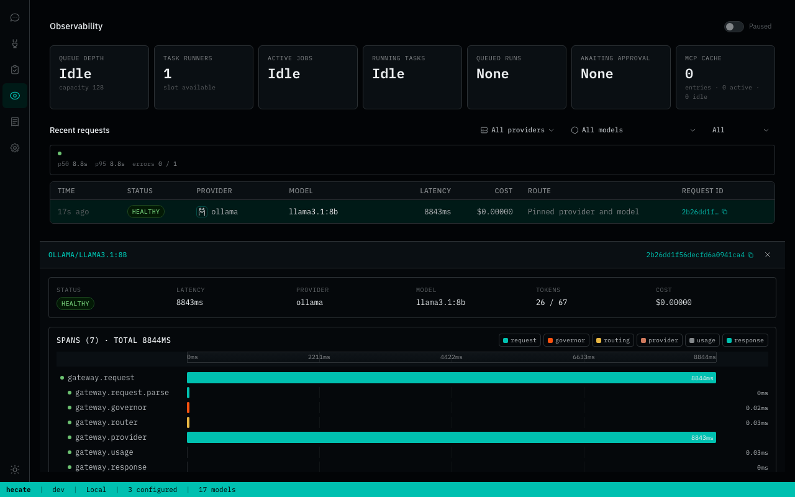

# Hecate Telemetry

Hecate uses OpenTelemetry-style traces, metrics, and logs, but the important thing for operators is simpler than that:

- every request gets stable runtime identifiers
- chat responses expose routing and cache metadata in headers
- traces are inspectable locally over HTTP
- OTLP export is available for traces, metrics, and logs

The runtime keeps standard OpenTelemetry keys where they already fit and uses `hecate.*` only for product-specific fields.

The Observability view in the operator UI surfaces all of this without needing an external collector — request ledger, trace inspector with route-report drilldown, and OTel signal status are all visible immediately.



For the full request lifecycle that produces these traces, see [`architecture.md`](architecture.md).

## Contents

- [Three streams, not one](#three-streams-not-one)
- [What You Can Inspect Today](#what-you-can-inspect-today)
- [OTLP Configuration](#otlp-configuration)
- [Trace Context Propagation](#trace-context-propagation)
- [Telemetry Contract](#telemetry-contract)
- [Core Vocabulary](#core-vocabulary)
- [Traces](#traces)
- [Metrics](#metrics)
- [Error And Limit Signals](#error-and-limit-signals)
- [Local Debugging Workflow](#local-debugging-workflow)
- [Known-Good OTLP Recipes](#known-good-otlp-recipes)
- [Troubleshooting Runbooks](#troubleshooting-runbooks)
- [Release Validation Checklist](#release-validation-checklist)
- [OTel support: status and gaps](#otel-support-status-and-gaps)

## Three streams, not one

Hecate produces three independent observability surfaces. They overlap in vocabulary but serve different consumers; mixing them up is the most common cause of "I'm seeing the wrong shape" confusion.

| Surface | Where it lives | What it's for | Reference |
|---|---|---|---|
| **OTel traces / metrics / logs** | Your tracing backend (via OTLP/HTTP export) | Long-term observability across many requests | This doc |
| **Persisted run events** | The gateway's `task_state_run_events` table | Subscribe-able timeline of one task or many; powers operator UI + dashboards | [`events.md`](events.md) |
| **Response headers + `/v1/traces`** | Per-request, in-memory | Fast local debugging without a collector | This doc |

The `events.md` catalog is the canonical reference for what `/v1/events` and the per-run SSE feed will hand you. This doc focuses on OTel spans, metrics, and the local debug surfaces.

## What You Can Inspect Today

Telemetry currently shows up in three places:

- response headers
- `GET /v1/traces?request_id=...`
- OTLP HTTP export when enabled

For request responses, the most useful headers are:

- `X-Request-Id`
- `X-Trace-Id`
- `X-Span-Id`
- `X-Runtime-Provider`
- `X-Runtime-Provider-Kind`
- `X-Runtime-Route-Reason`
- `X-Runtime-Requested-Model`
- `X-Runtime-Model`
- `X-Runtime-Cache`
- `X-Runtime-Cache-Type`
- `X-Runtime-Cost-USD`
- `X-RateLimit-Limit`
- `X-RateLimit-Remaining`
- `X-RateLimit-Reset`

The runtime metadata headers are most relevant on `/v1/chat/completions` and `/v1/messages`.

Task and run lifecycle endpoints also return `X-Trace-Id` and `X-Span-Id` on key execution actions such as run start and approval resolution.

For coding-runtime operations, `GET /admin/runtime/stats` is the primary live health snapshot. It includes queue depth/capacity, worker count, in-flight jobs, backend type (`queue_backend` / `store_backend`), and run-state counters.

The trace endpoint returns:

- the request id and trace id
- ordered spans with timestamps and attributes
- route candidates
- failover history
- the final provider, model, and route reason

The Observability workspace in the operator UI surfaces traces, the request ledger, and run-state cards.


## OTLP Configuration

OTLP export supports HTTP/protobuf and gRPC. Each signal is enabled
independently.

Shared identity (applied to traces, metrics, and logs as a single OpenTelemetry Resource):

- `GATEWAY_OTEL_SERVICE_NAME`
- `GATEWAY_OTEL_SERVICE_VERSION`
- `GATEWAY_OTEL_SERVICE_INSTANCE_ID` (auto-generated per process when unset)
- `GATEWAY_OTEL_DEPLOYMENT_ENVIRONMENT` (e.g. `production`, `staging`)
- `OTEL_RESOURCE_ATTRIBUTES` is honored last and can override any of the above

The runtime also auto-detects telemetry SDK, host, and process attributes
(`telemetry.sdk.name`, `host.name`, `process.runtime.name`, etc.) so backends
can group instances without extra wiring.

Shared OTLP defaults:

- `GATEWAY_OTEL_ENDPOINT`
- `GATEWAY_OTEL_HEADERS`
- `GATEWAY_OTEL_TIMEOUT`
- `GATEWAY_OTEL_TRANSPORT` — `http` (default) or `grpc`

When `GATEWAY_OTEL_ENDPOINT` is set with `http` transport, Hecate derives
signal endpoints by appending `/v1/traces`, `/v1/metrics`, and `/v1/logs`.
With `grpc` transport, the same host:port endpoint is used for every enabled
signal. Per-signal variables below override the shared defaults.

Traces:

- `GATEWAY_OTEL_TRACES_ENABLED`
- `GATEWAY_OTEL_TRACES_ENDPOINT`
- `GATEWAY_OTEL_TRACES_HEADERS`
- `GATEWAY_OTEL_TRACES_TIMEOUT`
- `GATEWAY_OTEL_TRACES_TRANSPORT`
- `GATEWAY_OTEL_TRACES_SAMPLER` — one of `always_on`, `always_off`, `traceidratio`, `parentbased_always_on` (default), `parentbased_always_off`, `parentbased_traceidratio`
- `GATEWAY_OTEL_TRACES_SAMPLER_ARG` — float in `[0, 1]`, used by the ratio samplers

Metrics:

- `GATEWAY_OTEL_METRICS_ENABLED`
- `GATEWAY_OTEL_METRICS_ENDPOINT`
- `GATEWAY_OTEL_METRICS_HEADERS`
- `GATEWAY_OTEL_METRICS_TIMEOUT`
- `GATEWAY_OTEL_METRICS_TRANSPORT`
- `GATEWAY_OTEL_METRICS_INTERVAL`
- `GATEWAY_OTEL_METRICS_EXEMPLAR_FILTER` — optional override for histogram/counter exemplar sampling: `trace_based` (SDK default), `always_on`, or `always_off`

Logs:

- `GATEWAY_OTEL_LOGS_ENABLED`
- `GATEWAY_OTEL_LOGS_ENDPOINT`
- `GATEWAY_OTEL_LOGS_HEADERS`
- `GATEWAY_OTEL_LOGS_TIMEOUT`
- `GATEWAY_OTEL_LOGS_TRANSPORT`

Behavior to know:

- traces export only when `GATEWAY_OTEL_TRACES_ENABLED=true`
- metrics export only when `GATEWAY_OTEL_METRICS_ENABLED=true`
- logs export only when `GATEWAY_OTEL_LOGS_ENABLED=true`
- signal-specific endpoint, headers, timeout, and transport override shared settings
- if log endpoint, headers, timeout, or transport are omitted, log export falls back to the trace signal settings

Trace body capture is configured separately from OTLP export:

- `GATEWAY_TRACE_BODIES`
- `GATEWAY_TRACE_BODY_MAX_BYTES`

## Trace Context Propagation

Hecate registers a global W3C TextMap propagator on startup, so any inbound
request carrying `traceparent` (and optional `tracestate` / `baggage`) headers
becomes the parent of the gateway's root span automatically. Operators do not
need to enable this — it is always on. With the default
`parentbased_always_on` sampler, sampling decisions made upstream are honored
end-to-end across the gateway.

If you front Hecate with a service that does not propagate trace context, the
gateway starts a fresh trace per request and the request id remains the
single correlation key.

Outbound provider calls use the same propagator. OpenAI-compatible and
Anthropic provider requests carry `traceparent`, `tracestate`, and `baggage`
from the gateway request context into upstream HTTP calls, including model
discovery, non-streaming chat, and streaming chat. If an upstream provider or
local proxy emits its own spans, a collector can stitch those spans under the
Hecate provider span.

## Telemetry Contract

Hecate treats telemetry as a product contract, not best-effort debug output.
Runtime code records events through the constants in `internal/telemetry`, and
tests enforce three invariants for known events:

- every event name is part of one enumerable contract
- every known event maps to a specific child span instead of the catch-all
  `gateway.runtime`
- every known event produces a stable `hecate.phase` attribute

Event families that need operator-facing guarantees can also declare required
attributes. The test suite currently validates required attributes for the
core gateway request path, provider execution, usage/cost, response return,
and external agent-chat lifecycle. When adding a new runtime event, add it to
the contract first, then choose the span and phase deliberately.

## Core Vocabulary

Common standard or standard-shaped attributes include:

- `service.name`
- `request.id`
- `trace.id`
- `span.id`
- `error.type`
- `error.message`
- `gen_ai.provider.name`
- `gen_ai.request.model`
- `gen_ai.response.model`
- `gen_ai.usage.input_tokens`
- `gen_ai.usage.output_tokens`
- `gen_ai.usage.total_tokens`

Common Hecate-specific attributes include:

- `hecate.phase`
- `hecate.result`
- `hecate.error.kind`
- `hecate.provider.kind`
- `hecate.provider.index`
- `hecate.provider.health_status`
- `hecate.route.reason`
- `hecate.route.outcome`
- `hecate.route.skip_reason`
- `hecate.cache.hit`
- `hecate.cache.type`
- `hecate.semantic.strategy`
- `hecate.semantic.index_type`
- `hecate.semantic.similarity`
- `hecate.cost.total_micros_usd`
- `hecate.retry.attempt_count`
- `hecate.retry.retry_count`
- `hecate.failover.from_provider`

Orchestrator-specific attributes include:

- `hecate.task.id`
- `hecate.task.status`
- `hecate.task.repo`
- `hecate.task.base_branch`
- `hecate.run.id`
- `hecate.run.number`
- `hecate.run.status`
- `hecate.run.duration_ms`
- `hecate.execution.kind`
- `hecate.step.id`
- `hecate.step.kind`
- `hecate.step.index`
- `hecate.step.tool_name`
- `hecate.step.duration_ms`
- `hecate.sandbox.wrapper.kind`
- `hecate.sandbox.network.enabled`
- `hecate.sandbox.read_only`
- `hecate.sandbox.output_limit.bytes`
- `hecate.tool.timeout_ms`
- `hecate.tool.exit_code`
- `hecate.tool.stdout.bytes`
- `hecate.tool.stderr.bytes`
- `hecate.tool.timed_out`
- `hecate.tool.cancelled`
- `hecate.tool.output_truncated`
- `hecate.tool.file.operation`
- `hecate.tool.file.bytes_written`
- `hecate.tool.file.before_existed`
- `hecate.tool.file.diff_bytes`
- `hecate.tool.file.artifact_status`
- `hecate.artifact.id`
- `hecate.artifact.kind`
- `hecate.artifact.size_bytes`
- `hecate.approval.id`
- `hecate.approval.kind`
- `hecate.approval.status`
- `hecate.approval.decision`
- `hecate.approval.wait_ms`
- `hecate.queue.backend`
- `hecate.queue.wait_ms`
- `hecate.worker.id`

Normalized results are:

- `success`
- `denied`
- `error`

## Traces

### Gateway Spans

Gateway traces are centered around a small set of runtime stages. Each stage maps to a child span under the root `gateway.request` span:

| Span name | Phase |
|---|---|
| `gateway.request` | Root span, present on every request |
| `gateway.request.parse` | Request parsing and validation |
| `gateway.governor` | Governor and policy decisions |
| `gateway.router` | Route selection |
| `gateway.cache` | Exact and semantic cache lookup/writeback events |
| `gateway.provider` | Provider execution, retry, and failover |
| `gateway.usage` | Usage normalization |
| `gateway.cost` | Cost calculation |
| `gateway.response` | Response return |
| `gateway.runtime` | Catch-all for unknown or not-yet-classified events |

Known Hecate event constants should not land in `gateway.runtime`; contract
tests fail if they do.

Route selection emits OTel-shaped events under `gateway.router` so the local
trace inspector and OTLP backends can explain the route, not just show the
winner:

| Event | When | Key attributes |
|---|---|---|
| `router.selected` | The router picked the initial provider/model | `gen_ai.provider.name`, `gen_ai.request.model`, `hecate.provider.kind`, `hecate.route.reason` |
| `router.candidate.skipped` | A provider/model was not selected before execution | `hecate.route.skip_reason`, `hecate.provider.health_status`, `hecate.provider.index` |
| `router.candidate.considered` | The executor is about to preflight/call a runtime candidate | `hecate.route.outcome=considered`, `hecate.provider.index` |
| `router.candidate.denied` | Policy, budget, or route preflight denied a candidate | `hecate.route.skip_reason`, `hecate.cost.estimated_micros_usd`, `hecate.policy.rule_id`, `hecate.policy.reason` |
| `router.candidate.selected` | A candidate survived preflight and will be called | `hecate.route.outcome=selected`, `hecate.cost.estimated_micros_usd` |
| `governor.model_rewrite` | The governor rewrote the requested model before routing | `gen_ai.request.model.original`, `gen_ai.request.model.rewritten`, `hecate.policy.rule_id`, `hecate.policy.action`, `hecate.policy.reason` |

Common skip reasons include `unsupported_model`, `circuit_open`,
`provider_not_requested`, `no_default_model`, `no_model`,
`preflight_price_missing`, `budget_denied`, `policy_denied`, `provider_slow`,
`provider_less_stable`, and `route_denied`. Policy-backed denials also carry the matched rule id/action/
reason when the governor rejected the candidate via a persisted or configured
policy rule. Rewrite events carry the same policy metadata when the governor
changes the requested model before the router runs. Runtime failover events use the same provider/model vocabulary
under `gateway.provider`.

Provider execution also emits attempt-level metrics. These are intentionally
separate from finalized chat metrics: retries and failed attempts are visible
even when a later provider recovers the request.

When `GATEWAY_TRACE_BODIES=true`, the gateway also records redacted, size-capped trace events named:

- `request.body.captured`
- `response.body.captured`

These events contain truncated message or choice snapshots and are intended for local debugging and carefully controlled observability setups, not blanket production payload capture.

### Orchestrator Spans

Coding-runtime operations emit their own spans, grouped by lifecycle stage:

| Span name | Events |
|---|---|
| `orchestrator.task` | `orchestrator.task.started`, `orchestrator.task.finished` |
| `orchestrator.run` | `orchestrator.run.started`, `orchestrator.run.finished`, `orchestrator.run.failed` |
| `orchestrator.step` | `orchestrator.step.completed`, `orchestrator.step.failed` |
| `orchestrator.artifact` | `orchestrator.artifact.created`, `orchestrator.artifact.failed` |
| `orchestrator.approval` | `orchestrator.approval.requested`, `orchestrator.approval.resolved`, `orchestrator.approval.failed` |
| `orchestrator.queue` | `queue.enqueued`, `queue.claimed`, `queue.acked`, `queue.nacked`, `queue.lease_extended`, `queue.lease_extend_failed` |

Generic runtime tool events (`tool.completed`, `tool.failed`) are grouped under
`orchestrator.step`. Policy tool blocks (`policy.tool_blocked`) are grouped
under `orchestrator.approval` because they represent a gate decision before
execution.

Steps carry `hecate.step.duration_ms`. Shell/file tool steps also promote a
closed allowlist of sandbox/tool attributes such as wrapper kind, timeout,
exit code, output sizes, truncation, and file patch metadata. Working
directories and command strings stay in persisted run events, not OTel span
attributes, to avoid accidental high-cardinality trace dimensions. Runs carry
`hecate.run.duration_ms`. Queue claim events carry `hecate.queue.wait_ms` —
the time the run spent in the queue between enqueue and claim.

`agent_loop` runs *also* emit one `turn.completed` per LLM round-trip on the **persisted run-event log** — not the OTel trace. That stream is documented in [`events.md`](events.md#turncompleted) and powers the per-run UI cost ledger and `/v1/events` subscriptions. The OTel side carries duration on the spans above; the cost breakdown lives on the run event.

### Agent Chat Spans

External coding-agent chats emit OTel-shaped trace data as well. `POST
/v1/agent-chat/sessions/{id}/messages` returns `X-Trace-Id` and `X-Span-Id`;
the assistant message stores `request_id`, `trace_id`, and `span_id` so the
Chats UI can point operators back to `/v1/traces?request_id=...`.

| Span name | Events |
|---|---|
| `agent_chat.run` | `agent_chat.run.started`, `agent_chat.output.started`, `agent_chat.files_changed`, `agent_chat.run.finished`, `agent_chat.run.failed`, `agent_chat.run.cancelled` |
| `agent_adapter.approval.request` | wraps the coordinator's RequestPermission decision (grant short-circuit, mode default, or prompt-mode wait); attributes include `hecate.agent_adapter.id`, `hecate.agent_adapter.session_id`, `hecate.agent_adapter.tool_kind`, `hecate.agent_adapter.approval.mode`, and `hecate.agent_adapter.approval.path` once the resolution path is known |
| `agent_adapter.approval.resolve` | wraps the operator decision-application path; attributes include `hecate.agent_adapter.approval.id`, `hecate.agent_adapter.approval.decision`, `hecate.agent_adapter.approval.scope`, and the same adapter / session / tool_kind context once the row loads |

Agent-chat spans carry adapter and workspace attributes such as
`hecate.agent_adapter.id`, `hecate.agent_adapter.command`,
`hecate.agent_adapter.driver.kind`, `hecate.agent_adapter.native_session.id`,
`hecate.agent_chat.session.id`, `hecate.run.id`, `hecate.workspace.path`,
`hecate.agent_adapter.output.bytes`, and
`hecate.agent_adapter.diff.captured`. Raw transcript text is intentionally not
emitted as OTel attributes; it is persisted on the Agent Chat message and shown
behind the raw-output diagnostic disclosure instead.

External-agent approval metrics:

| Metric | Type | Labels | Meaning |
|---|---|---|---|
| `hecate.agent_adapter.approval.requested` | counter | `adapter`, `tool_kind`, `mode` | ACP RequestPermission calls received from external agent adapters. |
| `hecate.agent_adapter.approval.resolved` | counter | `adapter`, `tool_kind`, `mode`, `decision`, `scope`, `path`, `status` | Approvals resolved, labeled by how (operator / grant / default_mode / timeout / request_cancelled). |
| `hecate.agent_adapter.approval.duration` | histogram | same labels as `resolved` | Time from RequestPermission to resolution. |
| `hecate.agent_adapter.approval.timed_out` | counter | `adapter`, `tool_kind`, `mode` | Approvals that hit the prompt-mode timeout. Dedicated counter so dashboards can alert on timeout rate without joining `resolved` on `path=timeout`. |
| `hecate.agent_adapter.approval.grants_active` | up-down counter | none | Live count of durable "always allow / always deny" grants. Incremented on grant create, decremented on grant delete. Seeded at process start from the SQLite store so a restart doesn't reset the dashboard line to zero. |
| `hecate.agent_adapter.probe` | counter | `adapter`, `status` | Adapter health probes grouped by final classification (`ready` / `not_installed` / `auth_required` / `error`). One increment per `agentadapters.Probe` call. |
| `hecate.agent_adapter.terminal_rpc_unsupported` | counter | `adapter`, `method` | ACP terminal RPC calls Hecate does not implement, grouped by method (`create` / `kill` / `output` / `release` / `wait`). The matching error returned to the adapter is `agentadapters.ErrTerminalRPCUnsupported`, wrapping JSON-RPC method-not-found (-32601). |

### ACP Bridge Spans

The `hecate-acp` stdio bridge has its own OTel trace provider. When trace export
is enabled for the bridge, JSON-RPC handling emits `acp.rpc` spans and each
gateway HTTP call emits an `acp.gateway.request` client span. The bridge injects
`traceparent`, `tracestate`, and `baggage` into gateway requests, so editor ACP
sessions can stitch through `hecate-acp` into the gateway traces.

### Retention Spans

Retention manager runs emit events under the `retention.run` span:

| Event | When |
|---|---|
| `retention.run.started` | A retention pass begins |
| `retention.subsystem.finished` | One subsystem pruned successfully |
| `retention.subsystem.failed` | One subsystem pruning failed |
| `retention.run.finished` | All subsystems processed |
| `retention.history.persisted` | Run record written to history store |
| `retention.history.failed` | History write failed |

The retention worker handles the following subsystems. The **subsystem name** is what the runtime exposes (in retention history rows, in `POST /admin/retention/run`'s `subsystems` array, and in `retention.subsystem.*` events); the **env-var prefix** is the config knob — they don't always match verbatim.

| Subsystem (runtime) | Env-var prefix | What it prunes |
|---|---|---|
| `trace_snapshots` | `GATEWAY_RETENTION_TRACES_` | Per-request profiler trace snapshots |
| `budget_events` | `GATEWAY_RETENTION_BUDGET_EVENTS_` | Governor budget ledger entries |
| `audit_events` | `GATEWAY_RETENTION_AUDIT_EVENTS_` | Control-plane audit log |
| `exact_cache` | `GATEWAY_RETENTION_EXACT_CACHE_` | Exact-match response cache |
| `semantic_cache` | `GATEWAY_RETENTION_SEMANTIC_CACHE_` | Semantic-similarity response cache |
| `provider_history` | `GATEWAY_RETENTION_PROVIDER_HISTORY_` | Persisted provider health and failover history rows exposed by `GET /admin/providers/history` |
| `turn_events` | `GATEWAY_RETENTION_TURN_EVENTS_` | `turn.completed` rows in the run-events table — high-cardinality bulk telemetry from agent_loop runs. Other event types (`run.started`, `run.finished`, `approval.*`) are never touched |

Each prefix has a `_MAX_AGE` and `_MAX_COUNT` suffix (e.g. `GATEWAY_RETENTION_TRACES_MAX_AGE=24h`). See `.env.example` for the defaults.

## Metrics

### Gateway Metrics

| Instrument | Type | Unit | Description |
|---|---|---|---|
| `hecate.gateway.requests` | Counter | `{request}` | Total gateway requests grouped by result |
| `hecate.gateway.request.duration` | Histogram | `ms` | Gateway request duration |
| `gen_ai.gateway.chat.requests` | Counter | `{request}` | Chat completion responses finalized |
| `gen_ai.gateway.cost` | Counter | `1` | Accumulated estimated cost in micros USD |
| `gen_ai.client.tokens.input` | Counter | `{token}` | Accumulated prompt tokens |
| `gen_ai.client.tokens.output` | Counter | `{token}` | Accumulated completion tokens |
| `gen_ai.client.tokens.total` | Counter | `{token}` | Accumulated total tokens |
| `hecate.gateway.retries` | Counter | `{retry}` | Provider retry attempts beyond the first |
| `hecate.gateway.failovers` | Counter | `{failover}` | Provider failover events |
| `hecate.provider.calls` | Counter | `{call}` | Upstream provider call attempts grouped by provider, model, result, retry attempt, and health status |
| `hecate.provider.call.duration` | Histogram | `ms` | Upstream provider call latency with the same attributes as `hecate.provider.calls` |

### Orchestrator Metrics

| Instrument | Type | Unit | Description |
|---|---|---|---|
| `hecate.orchestrator.runs` | Counter | `{run}` | Total runs grouped by status and execution kind |
| `hecate.orchestrator.run.duration` | Histogram | `ms` | Run wall-clock duration |
| `hecate.orchestrator.queue.wait_duration` | Histogram | `ms` | Time a run spent in the queue before being claimed |
| `hecate.orchestrator.steps` | Counter | `{step}` | Total steps grouped by kind and result |
| `hecate.orchestrator.step.duration` | Histogram | `ms` | Step wall-clock duration |
| `hecate.orchestrator.approvals` | Counter | `{approval}` | Approval gates resolved, grouped by kind and decision |
| `hecate.orchestrator.approval.wait_duration` | Histogram | `ms` | Time a run spent waiting for an approval gate |
| `hecate.orchestrator.queue.lease_extend_failures` | Counter | `{failure}` | Queue lease extension failures |
| `hecate.orchestrator.mcp.tool_calls` | Counter | `{call}` | MCP tool dispatches grouped by `hecate.mcp.server`, `hecate.mcp.tool`, and `hecate.mcp.call.result` (`dispatched` / `tool_error` / `failed` / `blocked`) |
| `hecate.orchestrator.mcp.tool_call.duration` | Histogram | `ms` | MCP tool dispatch wall-clock duration; same attribute set as the counter |
| `hecate.orchestrator.mcp.cache_events` | Counter | `{event}` | Shared-client cache events grouped by `hecate.mcp.cache.event` (`hit` / `miss` / `evicted`) and (when known) `hecate.mcp.server` |

### Agent Chat Metrics

| Instrument | Type | Unit | Description |
|---|---|---|---|
| `hecate.agent_chat.runs` | Counter | `{run}` | External agent-chat runs grouped by adapter, driver kind, status, and result |
| `hecate.agent_chat.run.duration` | Histogram | `ms` | External agent-chat run wall-clock duration |
| `hecate.agent_chat.cancelled` | Counter | `{cancellation}` | Agent-chat run/turn endings that terminated via cancellation, labeled by `adapter` and `reason` (`operator` / `request_cancelled` / `shutdown`). Distinguishes explicit operator cancels from request-context death and `SessionManager.Shutdown`-driven tear-downs. |

Metric attributes reuse the same vocabulary as traces — provider, model,
cache, failover, result, step kind, approval decision, queue backend, run
status, agent adapter id/driver kind, plus the MCP-specific `hecate.mcp.*`
attributes for the three MCP-client metrics above.

Metric label guardrails are intentionally stricter than trace/event payloads:
closed-set dimensions such as result, run status, execution kind, provider kind,
health status, approval kind/decision, queue backend, driver kind, MCP result,
and MCP cache event collapse unknown values to `other`. Free-form but useful
dimensions such as provider id, model id, agent adapter id, MCP server alias, and
MCP tool name are trimmed and reject control characters or labels longer than 96
bytes. Put ad-hoc diagnostics in spans, logs, or persisted events — not metric
labels.

New metric dimensions should be added in `internal/telemetry` instead of at the
call site. Closed-set dimensions need a normalizer; free-form dimensions must
use the shared label sanitizer. This keeps provider names, model names, command
output, paths, and tool diagnostics from accidentally becoming unbounded metric
labels.

The Go OTel SDK records metric exemplars with the trace-based filter by
default, so histogram/counter samples recorded under a sampled trace can carry
trace/span IDs to supporting backends. Set
`GATEWAY_OTEL_METRICS_EXEMPLAR_FILTER=always_on` for local collector smoke
tests when you want every sample eligible for exemplars, or `always_off` if
your backend does not support them yet.

## Error And Limit Signals

Two operational response classes are worth calling out:

- budget exhaustion is returned as HTTP `402` with a `payment_required` error shape
- rate limiting is returned as HTTP `429` with a `rate_limit_error` error shape

When rate limiting is enabled, the token-bucket limiter also exposes reset and remaining-budget information through the `X-RateLimit-*` headers above.

The `hecate.error.kind` attribute on error events is clamped to a closed set of known values. Any value outside this set is normalized to `other` to prevent high-cardinality label explosions in metric exporters and trace backends.

## Local Debugging Workflow

For request-level debugging:

1. Send a request through `/v1/chat/completions`.
2. Capture `X-Request-Id` and `X-Trace-Id` from the response.
3. Call `GET /v1/traces?request_id=<request-id>`.
4. Inspect route candidates, failovers, cache decisions, provider latency, final route reason, and span attributes.

That local HTTP path is usually faster than jumping straight into an OTLP backend while developing.

For task/run debugging, use `GET /v1/tasks/{task_id}/runs/{run_id}` to retrieve the run record with its `trace_id`, then look up the trace with `GET /v1/traces?request_id=<request_id>`. The queue wait and step durations are recorded as span attributes on the relevant spans.

## Known-Good OTLP Recipes

### Local dev recipe (collector-first)

Use a local OpenTelemetry Collector as the single ingest endpoint and fan out to
your preferred backend.

1. Point Hecate to collector OTLP/HTTP:

```bash
GATEWAY_OTEL_TRACES_ENABLED=true
GATEWAY_OTEL_METRICS_ENABLED=true
GATEWAY_OTEL_LOGS_ENABLED=true
GATEWAY_OTEL_ENDPOINT=http://127.0.0.1:4318
GATEWAY_OTEL_TRANSPORT=http
```

For OTLP/gRPC, use the collector gRPC port instead:

```bash
GATEWAY_OTEL_TRACES_ENABLED=true
GATEWAY_OTEL_METRICS_ENABLED=true
GATEWAY_OTEL_LOGS_ENABLED=true
GATEWAY_OTEL_ENDPOINT=127.0.0.1:4317
GATEWAY_OTEL_TRANSPORT=grpc
```

2. Run collector with an OTLP receiver and your exporter(s), for example:

```yaml
receivers:
  otlp:
    protocols:
      grpc:
      http:

processors:
  batch:

exporters:
  debug: {}
  otlphttp/tempo:
    endpoint: http://tempo:4318

service:
  pipelines:
    traces:
      receivers: [otlp]
      processors: [batch]
      exporters: [debug, otlphttp/tempo]
    metrics:
      receivers: [otlp]
      processors: [batch]
      exporters: [debug]
    logs:
      receivers: [otlp]
      processors: [batch]
      exporters: [debug]
```

This keeps Hecate vendor-neutral and lets you change backends without touching runtime settings.

### Production collector topology

- run collector as a sidecar/daemonset near Hecate pods
- keep Hecate exporting OTLP to a local collector over HTTP or gRPC
- do auth, retries, batching, sampling, and fan-out in collector
- route to one or more backends (Tempo/Jaeger/Datadog/New Relic/etc.)
- monitor collector queue and retry metrics as part of SLOs

### Secure headers and token guidance

- prefer short-lived ingest credentials
- set secrets in `GATEWAY_OTEL_*_HEADERS` via secret manager, not plaintext files
- avoid reusing provider API keys for telemetry ingest
- rotate ingest tokens and verify by checking `last_activity_at`/error counters in runtime telemetry health

## Troubleshooting Runbooks

### No traces visible in backend

1. Verify `GATEWAY_OTEL_TRACES_ENABLED=true`.
2. Check `GET /admin/runtime/stats` for telemetry signal error counters/messages.
3. Confirm collector receiver endpoint and path (`/v1/traces`).
4. Send a request and confirm `X-Trace-Id` is returned.
5. Query `GET /v1/traces?request_id=...` locally; if local trace exists but backend does not, the issue is exporter/collector path.

### High-cardinality warnings in backend

1. Confirm `hecate.error.kind` values are in the normalized closed set.
2. Avoid passing unbounded user input as metric labels.
3. Verify model/provider labels use normalized names.
4. Keep ad-hoc fields in log bodies/events, not metric attributes.

### Exporter timeout/backpressure symptoms

1. Inspect runtime telemetry health counters (`error_count`, `last_error`).
2. Increase collector resources or reduce downstream latency.
3. Tune batch and timeout env knobs to avoid sustained queue growth.
4. Validate that metrics/logs/traces endpoints are reachable from runtime network.

## Release Validation Checklist

- traces, metrics, and logs can all be exported through a generic OTLP collector
- `GET /admin/runtime/stats` returns runtime + telemetry signal health
- runs UI shows telemetry health panel and SLO cards without errors
- run timeline links resolve to trace payloads for recent task runs
- docs recipes and troubleshooting steps were exercised in a smoke environment

## OTel support: status and gaps

Working today:

- OTLP/HTTP and OTLP/gRPC export for traces, metrics, and logs (each independently toggleable)
- W3C TextMap propagator on inbound — `traceparent`, `tracestate`, `baggage` are honored automatically; the gateway becomes a child of the upstream trace
- W3C TextMap propagator on outbound provider calls — provider discovery, non-streaming chat, and streaming chat carry `traceparent` / `baggage` downstream
- ACP bridge tracing — `hecate-acp` emits JSON-RPC and gateway-client spans, and propagates trace context into gateway requests
- Sandbox/tool trace depth — shell and file tool steps expose sandbox wrapper/policy, timeout, exit, output-size, truncation, and file patch metadata through OTel-shaped `hecate.*` attributes
- Metric cardinality guardrails — closed-set labels collapse unknown values to `other`; free-form labels reject control characters and oversized values
- Metric exemplar filter configuration — Hecate exposes the SDK exemplar filter through `GATEWAY_OTEL_METRICS_EXEMPLAR_FILTER`
- Sampler selection: `always_on` / `always_off` / `traceidratio` / `parentbased_*` (default: `parentbased_always_on`)
- Resource attributes auto-populated (telemetry SDK, host, process; service identity from `GATEWAY_OTEL_SERVICE_*`)
- Stable span and metric vocabulary (`gen_ai.*` for OTel-standard fields, `hecate.*` for product-specific fields)
- High-cardinality protection on `hecate.error.kind` — values outside the closed set are normalized to `other`

Not yet:

- **Cross-backend exemplar verification** — the SDK filter is configurable, but backend-specific trace-from-metric UX still needs smoke coverage against the collectors/operators care about.
- **Full semantic convention audit** — core runtime paths use `gen_ai.*` and `hecate.*`, but new adapter/tool surfaces still need regular reviews as OTel semantic conventions evolve.

If any of these gaps are blocking your deployment, file an issue — operator demand drives the prioritization.
