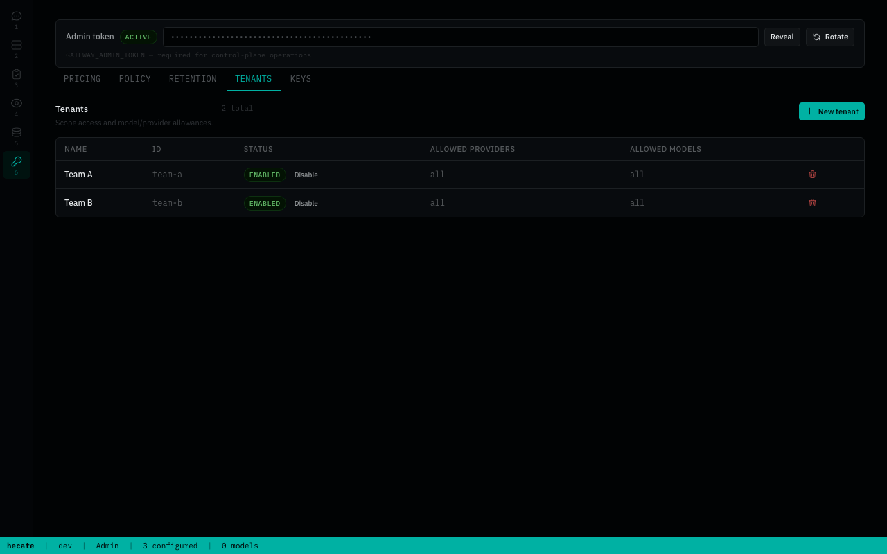
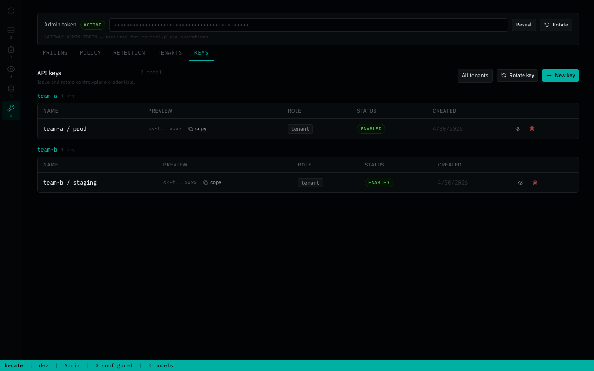

# Tenants and API keys

Hecate's tenant + API-key surfaces are an **opt-in feature**. The default deployment runs in single-tenant mode: one admin bearer token, no tenant CRUD, no per-key scoping. Flip the multi-tenant flag when you actually need to hand the gateway out to multiple users, scope provider/model access per key, or attribute spend back to a team.

This page covers when to enable it, what changes, and how the surfaces map to the runtime.

## Default: single-tenant

Out of the box (and in the published `Dockerfile.release` image), `GATEWAY_MULTI_TENANT=false`. The Settings workspace ships only the surfaces that matter for one operator on one host:

- Pricing — model catalog and pricebook overrides
- Policy — global allow/deny / rewrite rules
- Retention — manual purge runs

Tenants + Keys tabs stay hidden, the corresponding control-plane endpoints stay reachable for automation that already speaks them, and the admin bearer continues to authorize everything.

If that's all you need — single-user, single-host, talking to a few providers — leave the flag alone.

## Opt-in: multi-tenant

Set `GATEWAY_MULTI_TENANT=true` to expose:

- **Tenants tab** in Settings — create / disable tenants, scope each tenant's allowed providers and allowed models, and set a tenant-level `agent_loop` system prompt layer.

  

- **Keys tab** in Settings — issue API keys per tenant, mark them admin or tenant role, scope them further than the tenant defaults if needed, rotate, disable, delete.

  

- **Per-key request ledger** in the Costs workspace — usage attribution lines up against `key_id` once the storage tier records it.
- **Tenant-readable observability** — the `/v1/traces`, `/v1/requests`, `/v1/runtime/stats` endpoints honor tenant bearers; the `/admin/*` equivalents stay admin-only.

Enable it when:

- More than one human or service uses the gateway and you want spend / scope split per consumer.
- You want a CI key that can only call one provider, or a personal-use key that can't touch the pricebook.
- You're putting Hecate in front of a multi-team workload where audit trails by `key_id` matter.

## Wire-format

`/v1/whoami` reflects the flag in its `features` object:

```json
{
  "object": "session",
  "data": {
    "authenticated": true,
    "role": "admin",
    "features": {
      "multi_tenant": true,
      "auth_disabled": false
    }
  }
}
```

Clients that wrap the gateway can read `features.multi_tenant` to decide whether to expose tenant-management UI of their own.

## Roles

| Role | What it can do |
|---|---|
| `admin` | Everything: provider CRUD, tenant CRUD, key CRUD, pricebook, policy, retention, all `/admin/*` endpoints. |
| `tenant` | Chat completions / Anthropic messages within its allowed providers + models, queue tasks, read its own request ledger and traces. No `/admin/*` access. |
| `anonymous` | Health probe + bootstrap handshake only. Reached when auth is disabled or no key matches. |

The admin token is always treated as `admin` regardless of multi-tenant state. Tenant API keys only exist when multi-tenant is on.

## Storage

Tenants and keys live in the control-plane store you've configured (`memory`, `sqlite`, or `postgres` — see [`deployment.md`](deployment.md#storage-backends)). Flipping `GATEWAY_MULTI_TENANT` between runs doesn't drop any rows; it only toggles which surfaces are exposed in the UI.

## Disabling after the fact

Setting `GATEWAY_MULTI_TENANT=false` on a gateway that already has tenants and keys defined hides the management UI but leaves the rows intact. Existing API keys keep authenticating until you explicitly delete or disable them through the control-plane API. This is intentional — operators sometimes flip the flag while debugging single-user issues without wanting to nuke their multi-tenant setup.
